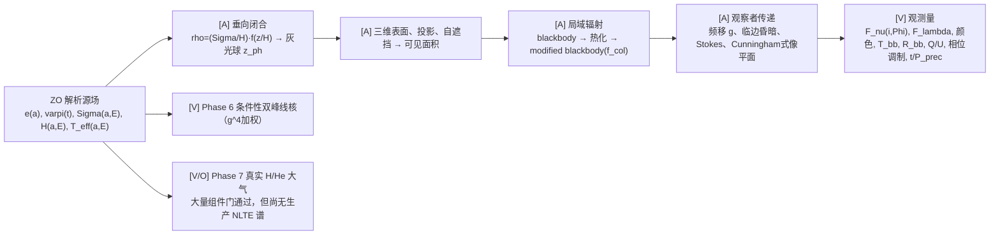

·# 从 ZO 偏心 TDE 盘到远方光谱：一份结果导向的项目讲义（改进版 · 完整）

> 本讲义改写自 `eccentric_tde_observer/lecture/项目讲义/项目整体讲义.md`（7278 行），改写原则：
> **① 按"源 → 几何 → 辐射 → 观察者"的物理逻辑顺序讲，不按 Phase 编号罗列步骤**；
> **② 把"成果性质"的内容放在前面讲清楚（算出了什么、量是多少），把大量"检验/审查门"压缩成
> 结论，不逐条展开**；**③ 每个公式都逐个参数说明**；**④ 每张图都讲清"横轴/纵轴/颜色/曲线与物理量的
> 对应关系"，即图是怎么画出来的**。图里凡未通过热化或收敛门的，只能读成诊断，不能读成预言。
>
> 证据标签沿用项目规范：`[L]`论文/教材已确定；`[A]`为实现"源到观测"而新增的闭合或诊断；
> `[V]`代码实际验证过的结果；`[O]`尚未闭合、不能写成预言的问题。

---

## 第 1 章 这是要回答什么

### 1.1 科学问题

Zanazzi & Ogilvie（下文 **ZO**，2020）给出一份**解析的偏心 TDE 盘**：它被冲击加热、沿嵌套椭圆轨道
运动、并发生垂向呼吸。ZO 把局域有效温度当黑体、对整盘积分，只给出一个 face-on 的 SED。这个量
**没有回答**：给定观察者倾角 $i$、观察者方位 $\phi_{\rm obs}$、进动相位 $\varpi(t)$，远方真正收到的
$F_{\nu_{\rm obs}}$ 是什么。`[L/O]`

本项目要检验的是：**不加入自由盘风时，偏心盘自身的非轴对称温度、厚度、投影、角分布和自遮挡，
能否产生可观测的 optical/UV 与 X-ray 相对强度、黑体诊断量和进动相关变化？** `[A]`

### 1.2 物理链条（地图）



这条链的方向不能反过来：**观察者模块只"消费" ZO 源场，不能靠选择风参数、裁剪无效状态、或重标定
温度来"修复"源模型。** `[A]`

### 1.3 证据标签（阅读规则）

- `[L]`：论文或标准教材已经给出的方程、定义或结论；
- `[A]`：为完成"源到观测"映射而**新增**的闭合、近似或诊断定义；
- `[V]`：当前代码、测试或输出文件**实际验证**过的结果；
- `[O]`：尚未闭合的问题，**不能写成模型预言**。

同一结论可能带两个标签，如 `[L/A]` 表示公式骨架来自文献、但用于当前偏心盘是本项目新闭合。
**特别提醒**：本文大量 `[V/O]` 表示"代码已验证该过程如何运作，但科学结论仍不成立或受限"。

### 1.4 一句话核心判断（先摆结论）

> **产生强高温区的典型高偏心源，没有通过"局域光球有效性"门；而通过有效性门的裸盘又没有 X-ray。**
> 不能用任意风参数把这条张力改名为"成功"。`[V/O]`

这是整个项目最重要、也最容易被误读的结论，建议先记住它，再看后面的细节。

---

## 第 2 章 源模型：什么是偏心 TDE 盘

### 2.1 最小背景（给初读者）

- **潮汐瓦解事件（TDE）**：一颗太阳型恒星（$M_\star\sim1M_\odot$）路过一个约 $10^6M_\odot$ 的黑洞，
  当它进入**潮汐半径** $R_t$（黑洞跨越恒星直径的引力差超过恒星自引力）时被整体撕碎。
- **碎片流（debris stream）**：碎片带略不相同的束缚能，沿极扁（$e\sim0.99$）的长细流绕黑洞运动；
  约 $t_{\min}\sim41$ 天起最束缚碎片先回返（fallback），返回率近似 $t^{-5/3}$ 衰减。
- **圆化（circularization）**：要形成盘，高偏心碎片必须通过**激波**耗散大量轨道能量、尽量保留角动量。
  在哪儿耗散、耗散多少，正是背景调研的核心争议（见 `00_工作流程_Result梳理.md`）。本项目**采纳**
  偏心盘仍存在这一结论，并**保留 ZO 解析偏心盘作为唯一源模型**、不加自由盘风。

### 2.2 坐标与记号

- $a$：半长轴（cm），标记一条椭圆轨道；
- $E\in[0,2\pi)$：偏近点角（无量纲），网格不重复 $2\pi$ 端点；
- $e(a)$：偏心率；当前主参考源取**常数** $e=0.6$；
- $\varpi(t)$：近心点经度；观察者相对相位 $\Phi=\phi_{\rm obs}-\varpi(t)$；
- 局域半径 $r=a(1-e\cos E)$，且 $\mathrm dM/\mathrm dE=1-e\cos E$（$M$ 为平近点角）。`[L]`

一般偏心盘里 $e=e(a)$、$\varpi=\varpi(a,t)$，还须满足相邻轨道不自交判据；本项目取**常偏心、无扭转**
参考族，不能代表任意径向偏心剖面。`[L/A]`

### 2.3 ZO 提供了哪些源量

- $j(a,E)$：Ogilvie–Lynch 规范坐标的**面积 Jacobian** 无量纲部分；
- $\Sigma(a,E)$：面密度（${\rm g\,cm^{-2}}$）；
- $H(a,E)=H^\circ(a)h(E)$：质量加权尺度高度（cm），$h(E)$ 是 ZO 的无量纲呼吸函数；
- $T_{\rm eff}(a,E)$：由局域耗散与辐射冷却关系给出的有效温度（K）。`[L]`

### 2.4 三种"光度"（必须分清）

1. **真实观察者通量** $F_{\nu}$（${\rm erg\,s^{-1}\,cm^{-2}\,Hz^{-1}}$），远方探测器单位面积收到；
2. **各向同性等效光度** $L_{\nu,\rm iso}=4\pi D^2F_{\nu}$，观察者假设各向同性后指派，**不等于**本征辐射功率；
3. **本征双面光度**（对局域各向同性黑体）$L_{\nu,\rm 2face}=2\pi\int B_\nu(T)\,\mathrm dA$。

corrected 面积上的 $4\pi\int B_\nu\mathrm dA_{\rm corr}$ 是 face-on 各向同性等效基准；$2\pi\int B_\nu\mathrm dA_{\rm corr}$
是本征双面量。三者不混名。`[L/V]`

### 2.5 面积基准：Erratum 修正后面积是唯一正式基准

ZO 2020 原文 Eq. (56) 错写成 $\mathrm dA_{\rm old}=a j\,\mathrm da\,\mathrm dE$。把椭圆嵌入 Cartesian 平面
（$x=a(\cos E-e)$，$y=a\sqrt{1-e^2}\sin E$）后，ZO 2022 Erratum Eq. (5) 证明真正的几何（=正式辐射）面积元为

$$
\mathrm dA_{\rm corr}=a\,j\,(1-e\cos E)\,\mathrm da\,\mathrm dE .
$$

**参数含义**：$\mathrm dA_{\rm corr}$ 是正式面积元（${\rm cm^2}$）；$a,\mathrm da$ 单位 cm；$E,\mathrm dE$ 为
无量纲角变量；$j$ 为无量纲 Jacobian 因子；**关键因子 $(1-e\cos E)$** 是平近点角到偏近点角的变换比。
$e\to0$ 时 $\mathrm dA_{\rm old}=\mathrm dA_{\rm corr}$；$e>0$ 且 $T_{\rm eff}$ 随 $E$ 变化时，两者局域
权重不同，SED 也因此不同。正式计算只走 corrected 路径。`[L/V]`


**这幅图怎么来的。** 上图的**横轴是频率、纵轴是 $\nu F_{\nu}$**（等温圆环的 Planck 谱）；彩色频带只标出
EUV/软 X-ray 频段位置，**不表示**这些频段对等温夹具具备 TDE 物理意义。**下半图横轴是频率、纵轴是逐频
相对误差**，量级接近机器精度。**图的含义**：数值面积积分与等温圆环的解析 Planck 谱"两条曲线重合"
（相当于 $y=x$：图上纵轴就是解析值本身），验证面积归一化与频率归一化正确。这只是 $e=0$、等温、face-on、
无遮挡、无频移的**解析夹具**，不验证偏心源、三维光球或观察者高频谱。

### 2.6 文献各自提供什么、没提供什么

- **ZO 2020**（`markdown_papers/2009.06636v2`）：偏心盘源模型、低效圆化、冲击加热参数 $\mathcal V$、
  面密度/尺度高度标度、垂向呼吸方程、$T_{\rm eff}$、corrected face-on SED。**没给**任意观察者方向的非灰
  $F_\nu$、三维光球、自遮挡、NLTE 大气或完整 GR ray tracing。`[L]`
- **Ogilvie & Lynch 2019**（`1812.05942`）：偏心盘 Hamiltonian 理论、Jacobian、非自交条件、三维呼吸动力学、
  一致进动本征模。`[L]`
- **Lynch & Ogilvie 2021**（动态结构 `2011.02219`、磁场 `2101.01221`）：非绝热呼吸、近心点 nozzle、辐射冷却、
  本项目采用的 $n=3$ 有限支撑垂向剖面；磁场会改变高偏心呼吸与稳定性——**当前代码无磁流体闭合**，保留为开放。`[L/O]`
- **Cunningham 1975**：把局域出射强度、频移、远方像平面立体角分开，形成 disk-to-observer transfer 架构；
  本项目只实现**可升级的弱场直接像**，不声称复现 Kerr 传递函数。`[L/A]`
- **Davis & Hubeny 2006**（`astro-ph_0602499`）：静态盘环带 $(T_{\rm eff},m_0,Q)$ 坐标与 NLTE 表；但其表面向
  更高温、更强垂向重力的圆盘环带，**不可外推**到当前低温动态偏心柱。`[L/V]`
- **Roth 等 2016**：说明 TDE 再处理介质中的电子散射、吸收、He II 光电离与离化状态如何控制 X-ray→optical
  再处理；是判断"为何 LTE He II 光深不等于可信 X-ray 谱"的依据，**不**是本项目引入自由包层的许可。`[L]`
- **Dai 等 2018**：把方向依赖作为 TDE 统一图景的重要因素（GRRMHD 流 + 风）；本项目只借用"观测方向必须
  显式建模"的问题意识。`[L]`
- **Wevers 2022 / Charalampopoulos 2022 / Roth–Kasen 2018**：多历元光谱、非轴对称结构、线轮廓形成，用于
  说明观测可施加约束；本项目不把连续谱任务改成宽发射线拟合。`[L]`

### 2.7 项目的边界选择

本项目保留 ZO 偏心盘作唯一源、**不加自由盘风**。这一选择由两份背景调研共同背书：偏心流真实存在
（见 `00_工作流程_Result梳理.md` 命题 D），而"激波供能"与"风/再处理"是两个**正交**机制——于是"裸偏心盘
自身信号"值得被单独、干净地算出来。**但**：观察者模块不能反过来修改源模型。`[A]`

---

## 第 3 章 链条第 1 环：从"面"到"三维可见表面"

### 3.1 为什么必须新增垂向密度（并给两种剖面）

ZO 给 $\Sigma$ 与 $H$，但不给三维 $\rho(z)$。为定义光球，最小闭合写成

$$
\rho(a,E,z)=\frac{\Sigma(a,E)}{H(a,E)}\,f\!\left(\frac zH\right),\qquad
\int_{-\infty}^{\infty}f(\zeta)\,\mathrm d\zeta=1 .
$$

**参数含义**：$\rho$ 为质量密度（${\rm g\,cm^{-3}}$）；$\Sigma$ 为双面总面密度（${\rm g\,cm^{-2}}$）；
$H$ 为质量加权尺度高度（cm）；$\zeta=z/H$、$f(\zeta)$ 均无量纲；归一化积分保证沿 $z$ 积分恰好回到 $\Sigma$。
代码比较两个 $f$：Gaussian $f_{\rm G}(\zeta)=e^{-\zeta^2/2}/\sqrt{2\pi}$；以及 LO 2021 Appendix A 的有限支撑剖面
$f_3(\zeta)=\frac{35}{96}[1-(\zeta/3)^2]^3$（$|\zeta|<3$，区间外 0）。$f_3$ 同时满足单位柱与单位二阶矩；但把
它接到固定 ZO 源上仍是**新增闭合**，不是 ZO 唯一指定的密度。`[L/A]`

### 3.2 灰光球：只定义几何，不证明热化

上表面柱光深 $\tau(\zeta)=\kappa\Sigma\int_\zeta^\infty f(u)\,\mathrm du$，以 $\tau_{\rm es}=2/3$ 定出
$z_{\rm ph}=H\zeta_{\rm ph}$。当前几何不透明度取电子散射 $\kappa_{\rm es}=0.34\ {\rm cm^2\,g^{-1}}$。

**参数含义**：$\tau$ 为从高度 $z$ 到上方无穷远的无量纲光深；$\kappa$ 为质量不透明度（${\rm cm^2\,g^{-1}}$）；
$u$ 为垂向积分哑变量；$z_{\rm ph}$ 为所选光球高度（cm）。**为什么是 2/3？** 来自平行平面灰 Eddington 大气
$T^4(\tau)=\frac34T_{\rm eff}^4(\tau+2/3)$：$\tau=2/3$ 处 $T=T_{\rm eff}$，与"约一个量级光深出射层"一致。
**注意**：散射不创造/销毁光子，所以 $\tau_{\rm es}=2/3$ **不能**证明 $I_\nu=B_\nu$（是黑体）。"灰"只表示
求高度时令 $\kappa$ 不依赖频率、所有频率共用同一 $z_{\rm ph}$；散射占优时真实 $\tau_{\rm eff}(\nu)\simeq1$ 面
可以更深且随频率变化。`[A/O]`


**这幅图怎么来的。** 左上：横轴 $\zeta=z/H$、纵轴 $\rho$（无量纲密度）与"上方剩余柱"，直观看出 Gaussian
有无限尾。右上：横轴为总灰光深 $\kappa\Sigma$、纵轴为 $z_{\rm ph}/H$；基准点 $\kappa\Sigma=3400$ 对应
$z_{\rm ph}/H\simeq3.55$。左下：横轴为偏近点角 $E$、纵轴为 $H$ 与 $z_{\rm ph}$。右下：由前几面板生成的
三维上表面。**验证了什么**：$\Sigma,H\to\rho\to z_{\rm ph}$ 数值链闭合（密度归一化、半柱质量、$\tau=2/3$
反演都达浮点精度）。**不能证明什么**：右下只是散射光球几何，不是热化面，不能据此宣称局域黑体成立。

### 3.3 三角表面、投影与自遮挡

光球顶点 $\boldsymbol r(a,E)=(a(\cos E-e),\ a\sqrt{1-e^2}\sin E,\ z_{\rm ph}(a,E))$，再旋转 $\varpi$；周期
四边形拆成三角形，叉积给出法向与面积。观察者视线方向
$\hat{\boldsymbol n}_{\rm obs}=(\sin i\cos\phi_{\rm obs},\sin i\sin\phi_{\rm obs},\cos i)$。

**无遮挡积分**
$$F_{\nu}=\frac1{D^2}\sum_{k,\mu_{k}>0}I_{\nu,k}\,\mu_{k}\,\Delta A_{k},\qquad
\mu_{k}=\hat{\boldsymbol n}_{k}\!\cdot\!\hat{\boldsymbol n}_{\rm obs}.$$

**参数含义**：$\boldsymbol r$ 为光球顶点（cm）；$i$ 为从盘角动量轴量起的倾角；$\phi_{\rm obs}$ 为盘面内
观察者方位；$D$ 为距离（cm）；$I_{\nu,k}$ 为比强度（${\rm erg\,s^{-1}\,cm^{-2}\,Hz^{-1}\,sr^{-1}}$）；
$\Delta A_k$ 为表面面积（${\rm cm^2}$）；$\mu_k$ 为表面法向与视线夹角余弦。**像平面面积已含投影，不能再乘
一次 $\mu$**。射线模式把表面投到像平面；同一像素被多个三角形覆盖时只保留深度最大的交点；背面最前交点可
遮挡但不发射。实现顺序："全三角形投影覆盖检查 → 重心插值交点深度 → 取最大深度面 → 再判断该面是否朝观察者"
，故**背向前景面仍参与遮挡**；对穿过遮挡边界的源三角形，自适应求积用四子重心 + 三近顶点探针判别。`[A]`


**这幅图怎么来的。** 左上：绿色为发射的最前表面、红色为"位于最前但背向观察者"的遮挡面。右上：横轴为
射线数、纵轴为可见面积与四个频率，看是否收敛。左下：横轴为频率、纵轴为 $\nu L_\nu$，比较 face-on 与两个近
edge-on 方位。右下：横轴为频率、纵轴为射线结果相对无遮挡积分之比。**验证了什么**：深度缓冲能让背向前景面
遮住后方发射面，并能产生颜色相关遮挡；频率积分仍回收可见投影面积对应的 Stefan–Boltzmann 能流。
**不能证明什么**：该图用人为的 $T_{\rm eff}\propto r^{-3/4}$ 热点与极端 $i=89^\circ$，不是 ZO 参考源，
只验证算法机制。

### 3.4 数值采样为什么需要两层审计

高偏心 ZO 源的近心点热点极窄，均匀像素可能完全漏掉热点，产生"看似收敛、实际没采到"的高频结果。Phase 1F
改为在源三角形内自适应细分可见性混合单元；随后又发现**源表面网格**在热点与遮挡边界相交处是第二个误差源。
`[V]`


**这幅图怎么来的。** 第一行：$e=0,0.4,0.8$ 的垂向呼吸与内轨道厚度；第二行：已收敛的 corrected 源 SED 及
corrected/pre-Erratum 局部面积权重差；第三行左：高频射线随像素数跳变，右侧：已收敛的 optical 进动响应。
**结果**：ZO Eq. (35) 呼吸解、历史质量回归、源端 corrected SED、optical 相位曲线通过收敛；同时高频射线在
增加像素时出现数量级跳变，因此被**明确扣留**、不计入预言。**不能证明什么**：源端波段光度不是任意方向的
预言；未收敛的 EUV/X-ray 观察者谱没有交付。


**这幅图怎么来的。** 上排：自适应积分后的谱、方向传递比、细分深度；下排：细分深度、源表面网格，并把自适应
结果与均匀像素射线叠加；虚线/着色高频区表示**未达严格门槛**。**结果**：源内自适应细分修复均匀像素漏掉窄
热点的问题，并把"像平面已收敛但源网格未收敛"识别为独立误差源。**不能证明什么**：$\Phi=90^\circ$ 高频结果仍
对源网格敏感，只能诊断热点与遮挡边界耦合。


**这幅图怎么来的。** 上排：两种归一化密度、剩余上柱、$z_{\rm ph}/H$；下排：$z_{\rm ph}/r$、闭合敏感的方向谱、
源网格收敛。$n=3$ 剖面在 $|z/H|=3$ 截止，Gaussian 有无限尾。**结果**：有限支撑剖面把平均光球压低，但
$z_{\rm ph}/r\ge1$ 的 corrected 面积分数只从 $99.35\%$ 降到 $99.20\%$，故典型参考源的局域薄柱失败**不是
Gaussian 尾部**造成。**不能证明什么**：高频泄漏对两种闭合与源网格都敏感。

### 3.5 第一道物理失败门：局域薄柱失效 → 严格域参考点

典型参考点 $(e,\mathcal V)=(0.8,1)$ 中，两种垂向闭合都有**超过 99%** 的 corrected 面积满足 $z_{\rm ph}/r\ge1$
（厚度大于半径，局域"平面平行薄柱"不成立）；有限支撑剖面只把该分数从 $99.35\%$ 降到 $99.20\%$。`[V]`


**这幅图怎么来的。** 四幅热图：**横轴为偏心率 $e$、纵轴为圆化效率 $\mathcal V$**，颜色依次编码
①corrected bolometric 光度、②最高有效温度、③最小 $\kappa\Sigma$、④$n=3$ 三维表面积/投影面积之比；白虚线
$\mathcal V=0.1$ 只是 ZO 常用范围标记。**能说明什么**：重现 ZO 源端随 $e,\mathcal V$ 的解析标度。**不能说明
什么**：高 $T_{\rm eff,\max}$ 只说明源端局部耗散强，不保证该区域满足薄柱/热化/观察者收敛，**不等同于
X-ray 可见**。


**这幅图怎么来的。** 六幅热图：**横轴 $e$、纵轴 $\mathcal V$**，颜色编码 Gaussian 与 $n=3$ 闭合中 $z_{\rm ph}/r$
超过 0.3 或 1 的面积比例、两闭合之差、源 $H/r$ 失败比例；黑线是"失败面积=1%"等值线。**结果**：703 个点中
只有 **49 个**同时通过两种闭合的严格筛选，且 $0.1\le\mathcal V\le10$ 内**没有**通过点；网格复算表明不是分辨率
假象。**注意**：$z_{\rm ph}/r<0.3$ 与失败面积 $<1\%$ 是透明的项目筛选 `[A]`，**不是**文献薄盘定理；未通过
只表示当前局域柱模型不能用，不等于真实三维厚盘不存在。

**于是选定严格域参考点** $(e,\mathcal V)=(0.6,0.01)$（Erratum 后重算又确认 $(0.65,0.01)$ 通过）。该点
$i\le75^\circ$ 无直线自遮挡，且 $L_{\rm X}/L_{\rm UVopt}\sim10^{-37}$。**重要限制**：$e=0.6,0.65$ 均低于 ZO
典型效率范围，所以后续是**严格域条件预言**，不是对典型源的无条件结论。`[V]`


**这幅图怎么来的。** 上排：横轴频率、纵轴 $\nu F_\nu$，比较不同倾角、$i=75^\circ$ 不同相位、$n=3$/Gaussian
闭合比。下排：横轴为相位、纵轴为四个频率的响应与单黑体 $T_{\rm bb},R_{\rm bb}$。**结果**：$(0.6,0.01)$ 在
$i\le75^\circ$ 的可见/无遮挡面积比为 1，所以相位变化来自**非轴对称温度场与投影、而非自遮挡**；两种垂向闭合的optical 差异只有百分数级；谱在 X-ray 前已指数截止。**注意**：图中早期 $T_{\rm bb}\simeq(3.14$–$3.21)\times10^4$ K
用 0.002–0.1 keV 宽窗并取局域黑体；Phase 2–4 改用完全热化的 optical 窗并加入谱硬化，得到约
$(1.8$–$2.1)\times10^4$ K——两组数**不能**在不说明拟合窗时直接比较。

---

## 第 4 章 链条第 2 环：局域辐射与频移

### 4.1 弱场频移

轨道取 Newtonian Kepler 椭圆速度；光球垂向速度 $v_z=z_{\rm ph}\,\mathrm d\ln h/\mathrm dE\,\mathrm dE/\mathrm dt$。
定义 $g=\nu_{\rm obs}/\nu_{\rm em}$，混合阶近似为

$$
g=\frac{\sqrt{1-2GM_\bullet/(rc^2)}}{\gamma[1-\boldsymbol\beta\cdot\hat{\boldsymbol n}_{\rm obs}]}.
$$

真空中 $I_\nu/\nu^3$ 不变，故 $I_{\nu_{\rm obs}}=g^3I_{\nu_{\rm em}}(\nu_{\rm obs}/g)$。

**参数含义**：$v_z$ 为光球垂向速度（${\rm cm\,s^{-1}}$）；$h(E)$ 为 ZO 无量纲呼吸函数；$\mathrm dE/\mathrm dt$
为偏近点角变化率（${\rm s^{-1}}$）；$g$ 为无量纲频移因子；$G,M_\bullet,r,c$ 为引力常数、黑洞质量、局域半径、
光速；$\boldsymbol\beta=\boldsymbol v/c$、$\gamma=(1-\beta^2)^{-1/2}$。**分子根号是 Schwarzschild 静止引力红移，
分母是狭义相对论 Doppler 因子**；把它与 Newtonian 椭圆速度、直线射线相乘是弱场混合闭合 `[A]`。
对黑体有精确恒等式 $g^3B_{\nu/g}(T)=B_\nu(gT)$；这里的 $gT$ 只是观察者谱的等价写法，**不代表源温度改变**。`[L/A]`

严格参考源 $g=0.9591$–$1.0404$：optical 只受百分数级频移影响，但 **Wien 尾会把小的 $g$ 差异指数放大**；
频移仍不能创造缺少的 X-ray 光子。`[V]`


**这幅图怎么来的。** 上排：横轴频率、纵轴频移后谱（不同倾角）、$i=75^\circ$ 相位谱、"频移后/无频移"通量比。
下排：横轴相位、纵轴可见面 $g$ 范围与加权平均、四频率相位响应、黑体诊断随相位。**结果**：optical 中趋近与
远离区域大体抵消（百分数级），Wien 尾同一小频移被指数放大；$g\to1$、$e\to0$、$g^3B_{\nu/g}=B_\nu(gT)$ 控制
均通过。**不能证明什么**：$gT$ 不是源温变化；混合近似没有 Kerr 自旋、弯曲多像和光行时。

### 4.2 自由–自由吸收、电子散射与有效光深

最小吸收闭合用完全电离 H/He、$g_{\rm ff}=1$ 的自由–自由吸收 $\alpha_\nu^{\rm ff}\propto T^{-1/2}n_e\sum_i Z_i^2n_i\nu^{-3}(1-e^{-h\nu/kT})$，$\kappa_\nu^{\rm ff}=\alpha_\nu^{\rm ff}/\rho$，与 $\kappa_{\rm es}$ 合成
$\kappa_{\rm tot}$，定义

$$
\boxed{\tau_{{\rm eff},\nu}=\int\rho\sqrt{3\,\kappa_\nu^{\rm abs}\kappa_{\rm tot}}\,\mathrm dz
=\int\rho\sqrt{3\,\kappa_\nu^{\rm abs}\left(\kappa_\nu^{\rm abs}+\kappa_{\rm es}\right)}\,\mathrm dz .}
$$

**参数含义**：$\alpha_\nu^{\rm ff}$ 为自由–自由体吸收系数（${\rm cm^{-1}}$）；$\kappa_\nu^{\rm ff}$ 为质量吸收
系数（${\rm cm^2\,g^{-1}}$）；$T$ 为 K；$n_e,n_i$ 为电子/离子数密度（${\rm cm^{-3}}$）；$Z_i$ 为离子电荷数；
$h,k$ 为 Planck/Boltzmann 常数。**电子散射不直接热化，但通过增加光子行程提高被吸收概率**；根号形式是散射
介质的标准热化尺度，以 $\tau_{\rm eff}=1$ 定位热化层是项目约定 `[A]`。垂向温度暂用灰 Eddington 关系
$T^4(\tau_{\rm es})=\frac34T_{\rm eff}^4(\tau_{\rm es}+2/3)$。

**结果**：在每个表面元的局域 Planck 峰频处，所有柱都可达 $\tau_{\rm eff}=1$，给出颜色修正
$f_{\rm col}=T_{\rm th}/T_{\rm eff}=1.540$–$1.656$；但**全盘可靠热化只到约 $10^{15}$ Hz，在 0.3 keV 全部柱的
自由–自由有效光深都小于 1**。`[A/V]`


**这幅图怎么来的。** 左上：横轴为有效光深、纵轴为面积分位数。右上：横轴为频率、纵轴为满足
$\tau_{\rm eff,\nu}\ge1$ 的 corrected 面积比例；**红虚线标出 0.3 keV**（此处比例为 0）。左下：由局域谱峰热化层
得到的 $f_{\rm col}(a,E)$。右下：横轴 $T_{\rm eff}$、纵轴 $f_{\rm col}$，颜色编码平均 $\log_{10}\Sigma$。
**结果**：$5\times10^{14}$ 与 $10^{15}$ Hz 全盘通过，$5\times10^{15}$ Hz 只约 $46.7\%$ 面积通过，0.3 keV 为 0；
垂向网格收敛优于当前物理闭合误差。**不能证明什么**：$\tau_{\rm eff}\ge1$ 不是 NLTE 大气解。

### 4.3 能量守恒的 modified-blackbody

局域谱取 $I_{\nu,\rm em}=f_{\rm col}^{-4}B_\nu(f_{\rm col}T_{\rm eff})$，从而逐表面元满足
$\pi\int_0^\infty I_{\nu,\rm em}\,\mathrm d\nu=\sigma T_{\rm eff}^4$。

**参数含义**：$f_{\rm col}=T_{\rm th}/T_{\rm eff}$ 为无量纲颜色修正因子；$T_{\rm th}$ 为在局域谱峰处由
$\tau_{\rm eff}=1$ 得到的热化层温度；$B_\nu$ 为 Planck 比强度；$\sigma$ 为 Stefan–Boltzmann 常数。**注意**：
$f_{\rm col}$ 由热化层求得，**不是自由拟合参数**；$f_{\rm col}^{-4}$ 把能量从低频重新分配到高频，**而不制造
额外总光度**。`[A/V]`

**结果**：在全盘热化的 $5\times10^{14}$ 与 $10^{15}$ Hz，$i=75^\circ$ 相位最大/最小约 $2.291$/$2.039$；保守
optical 黑体诊断 $T_{\rm bb}=1.80$–$2.03\times10^4$ K、$R_{\rm bb}=0.75$–$2.04\times10^{14}$ cm。
**X-ray 数学尾部仍是失效域中的形式外推**。`[V/O]`


**这幅图怎么来的。** 上排：横轴频率、纵轴 $\nu F_\nu$，不同倾角/相位，并画 modified-blackbody 相对局域黑体的
通量比；黑虚线约为保守全盘热化上限，橙色区为已有效薄的表面。下排：横轴相位、纵轴频率相关响应；只在
$5\times10^{14}$–$10^{15}$ Hz 拟合的 $T_{\rm bb},R_{\rm bb}$；以及标题明确标成"**不是预言**"的形式 X-ray/optical
尾部。**结果**：$f_{\rm col}^{-4}$ 使每面元严格保持 $\sigma T_{\rm eff}^4$；optical 窗 $i=75^\circ$ 最大/最小
$2.291/2.039$。**不能证明什么**：$>10^{15}$ Hz 进入闭合敏感区，最右下 X-ray 比只是失效局域谱上积分得到的
形式数，**不能发表为 $L_{\rm X}/L_{\rm opt}$**。


**这幅图怎么来的。** 左上：局域黑体 vs modified-blackbody；右上：全盘热化面积分数；左下：两种闭合的颜色相关
进动振幅；右下：只在完全热化 optical 窗给黑体诊断。**结果**：把第二阶段正面结论压缩为"optical/近 UV 可作
条件预言"，谱硬化移动峰值与相位振幅但不改变局域总能量。**不能证明什么**：阴影区与 0.3 keV 红线位于有效光深
失败区，是**失效边界**，不是隐藏高能预言。

---

## 第 5 章 链条第 3 环：角分布、偏振与观察者传递

### 5.1 临边昏暗（能量归一 Eddington 角律）

定义发射角余弦 $\mu=\hat{\boldsymbol n}_{\rm surf}\cdot\hat{\boldsymbol n}_{\rm ray}$，取

$$
I_\nu(\mu)=\frac34(\mu+2/3)I_{\nu,\rm iso},\qquad 2\int_0^1\frac34(\mu+2/3)\mu\,\mathrm d\mu=1 .
$$

**参数含义**：$I_{\nu,\rm iso}$ 为同一局域谱的各向同性比强度；前因子 $3/4$ 与第二个积分式保证半球能流与
各向同性版本相同。它**只重分配方向、不改变局域半球总能流**；若外部辐照造成温度反转与临边增亮则失效。`[L/A]`

### 5.2 Stokes 偏振（条件含义）

Stokes $I,Q,U$ 记录总强度与两个线偏振分量。局域偏振度取保守半无限电子散射大气的 Chandrasekhar 拟合

$$
p(\mu)=\frac{0.1171(1-\mu)}{1+3.582\mu}.
$$

**参数含义**：$p$ 为无量纲局域线偏振度（乘 100 为百分数）；该有理函数是对 Chandrasekhar–Sobolev 半无限、保守
电子散射大气解的有理拟合（Viironen & Poutanen 2004 Eq. (41)），**不是** ZO 给出的量。把该平面平行拟合逐元
应用到偏心曲面、把电矢量投到共同像平面后叠加 Stokes $Q,U$，是本项目观察者闭合 `[A]`。**当前无吸收稀释、
Faraday 旋转、磁场或 GR 平行移动**，所以偏振是角闭合下的条件预言；若 $I=0$ 偏振度无定义，代码直接**拒绝**。`[L/A/O]`

**结果**：严格参考源在 $5\times10^{14}$ Hz 的未分辨偏振范围约 $0.0013\%$–$5.95\%$。`[V]`

### 5.3 Cunningham 式观察者传递与当前弱场直接像

观察者积分写成

$$
F_{\nu_{\rm obs}}=\frac1{D^2}\sum_k\Delta A_{{\rm image},k}\,g_k^3\,I_{\nu_{\rm em}}(\nu_{\rm obs}/g_k,\mu_{{\rm em},k}).
$$

**参数含义**：$\Delta A_{{\rm image},k}$ 为远方像平面面积（${\rm cm^2}$），除以 $D^2$ 即观察者立体角；$g_k$ 为
第 $k$ 个像元频移；$\mu_{{\rm em},k}$ 为发射系角余弦。把局域强度、$g^3$、像平面立体角**分开保存**的架构来自
Cunningham（1975）`[L]`；当前用 Schwarzschild 弱场直接像映射源顶点，**只保留直接像**，不含 Kerr 自旋、多像、
光行时、returning radiation；像三角形折叠或奇偶翻转则拒绝。`[L/A]`

**结果**：严格参考源 $2GM/(rc^2)=2.64\times10^{-4}$–$2.14\times10^{-3}$，弱场像面积相对直线投影只增加
$0.021\%$–$0.193\%$；$M/r\to0$ 时像坐标、面积、谱都回 Newtonian。`[V]`

### 5.4 再处理层只作为守恒下界（不是加风）

若散射主导层 $\epsilon=\kappa_{\rm abs}/\kappa_{\rm tot}$，要达到 $\tau_{\rm eff}=1$ 至少需要

$$
\tau_{\rm tot,\min}=\frac1{\sqrt{3\epsilon}},\qquad \Sigma_{\min}=\frac{\tau_{\rm tot,\min}(1-\epsilon)}{\kappa_{\rm es}},
\qquad M_{\min}=4\pi R^2C\Sigma_{\min},\qquad t_{\rm diff}=\frac{\tau_{\rm tot}\Delta R}{c},
$$

并须满足 $L_{\rm seed}\ge L_{\rm rep}/(Cf_{\rm abs})$、$\dot Mv\le\tau_{\rm mom}L_{\rm seed}/c$。

**参数含义**：$\epsilon$ 为吸收占总不透明度比例；$\tau_{\rm tot,\min},\Sigma_{\min},M_{\min}$ 为达到热化所需的最小
总光深、面密度（${\rm g\,cm^{-2}}$）、覆盖质量；$R,\Delta R,C$ 为层半径、厚度、覆盖因子；$t_{\rm diff}$ 为扩散
时间；$L_{\rm seed},L_{\rm rep},f_{\rm abs}$ 为种子光度、被再处理光度、吸收份额；$\dot Mv$ 为动量流率。
**关键点**：$R=10^{14}$ cm、$\epsilon=10^{-6}$、$C=1$ 时 $M_{\min}=0.1073M_\odot$、$t_{\rm diff}/(\Delta R/R)=22.29$ day。
真实 $\epsilon$ 由 NLTE 离化态决定、**不能自由选择**；当前无通过有效性门的 X-ray seed，能量闭合**无法检验**。
项目**只保存约束下界，不实例化盘风**。`[V/O]`


**这幅图怎么来的。** 九面板按三行：第一行横轴频率/相位、纵轴条件方向谱、相位谱、颜色相关调制；第二行横轴相位、
纵轴未分辨偏振与偏振相位响应、弱场弯曲像/直线像之比；第三行横轴频率、纵轴 H/He LTE 有效光深失效门、有效深度
分布、最小热化质量约束。**可发表要点**：optical/UV 的 $F_\nu(i,\Phi)$、$T_{\rm bb},R_{\rm bb}$、相位调制、条件偏振
都已频率分辨；弱场像面积只比直线像大 $0.021\%$–$0.193\%$。**不能证明什么**：左下/中下的 LTE H/He 大光深对离化
布居高度敏感，只是"必须做 NLTE"的失效警报；右下是任何未来再处理层的质量下界，不是已加入的包层。

### 5.5 可发布 / 不可发布量（Phase 3）

`[V]`（在明确的 modified-blackbody、角律与弱场直接像下）可发布：$T_{\rm bb}=1.788\times10^4$–$2.086\times10^4$ K；
$R_{\rm bb}=5.84\times10^{13}$–$2.27\times10^{14}$ cm；$i=75^\circ$、$5\times10^{14}$ Hz 相位最大/最小 2.805；
同频条件偏振 $0.0013\%$–$5.95\%$。**`[O]` 仍不可发布物理 $L_{\rm X}/L_{\rm opt}$。**

---

## 第 6 章 成果主体：观察者图谱

### 6.1 图谱的自变量与网格

Phase 4B 用频率 $10^{14}$–$10^{16}$ Hz、倾角 $0,15,30,45,60,70,75^\circ$、相对相位 $0^\circ$–$345^\circ$
（步长 $15^\circ$，不重复 $360^\circ$）、距离 $D=100$ Mpc。每格点输出 $F_\nu,I,Q,U$、偏振度、$T_{\rm bb},R_{\rm bb}$
与带通诊断。主图为 `phase4_complete_summary.png`，频谱/诊断/谐波/无量纲光变分别存 CSV。`[A/V]`

### 6.2 理想 AB 带通

当前只用两个单位响应对数 top-hat：optical $4\times10^{14}$–$8\times10^{14}$ Hz，near-UV $8\times10^{14}$–
$1.5\times10^{15}$ Hz。光子计数 AB 平均

$$
\langle f_\nu\rangle=\frac{\int f_\nu R(\nu)\,\mathrm d\nu/\nu}{\int R(\nu)\,\mathrm d\nu/\nu},
\qquad
m_{\rm AB}=-2.5\log_{10}\!\left(\frac{\langle f_\nu\rangle}{3631\ {\rm Jy}}\right).
$$

**参数含义**：$f_\nu$ 为输入通量密度（${\rm erg\,s^{-1}\,cm^{-2}\,Hz^{-1}}$）；$R(\nu)$ 为无量纲响应；$\mathrm d\nu/\nu$
是光子计数的对数频率权重；$3631\ {\rm Jy}=3.631\times10^{-23}\ {\rm erg\,s^{-1}\,cm^{-2}\,Hz^{-1}}$ 是 AB 星等零点；
带间颜色即两带星等差。细节见 [[eccentric_tde_observer/lecture/学习笔记/讲义讨论_常见疑问澄清|讲义讨论]] §15.1。
**它们不代表 Swift/UVOT、ZTF、LSST 或 XMM 的真实响应**，不能拿当前 AB 数字拟合目录测光。`[L/A/V]`

### 6.3 结果数字

图谱给出：`[V]`
- ideal optical AB（100 Mpc）**18.54–21.26 mag**；ideal NUV–optical **−0.568–−0.382 mag**；
- $T_{\rm bb}=1.783\times10^4$–$2.082\times10^4$ K；$R_{\rm bb}=5.85\times10^{13}$–$2.27\times10^{14}$ cm；
- $i=75^\circ$ 时 $5\times10^{14},10^{15},2\times10^{15}$ Hz 的相位最大/最小约 2.805、2.416、1.639。

**解读**：face-on 相位不变；倾角增大后，非轴对称温度场、表面法向、临边昏暗与 Doppler 共同产生**颜色相关调制**。
严格参考源中直线可见面积与无遮挡面积之比恒为 1，所以这组调制来源**是温度非轴对称、投影、角律、Doppler，而不是自遮挡**。它不能回答"典型厚盘的强自遮挡能否解释 X-ray 变化"（典型厚盘已在局域光球层失效）。`[V/O]`


**这幅图怎么来的。** 上排：横轴为源坐标、纵轴为 $Q_{\rm pressure}/Q_{\rm tidal}$、准静态指标与当前源在
Davis–Hubeny 表坐标中的位置。中排：**横轴为倾角、纵轴为相位**的色彩热图——optical 相对通量、NUV–optical 颜色、
条件偏振。下排：$T_{\rm bb},R_{\rm bb}$ 热图与 $i=75^\circ$ 无量纲光变。**结果**：已发表 annulus 表对当前源三维
联合覆盖为 0；图谱同时给出随 $i,\Phi$ 变化的通量、颜色、偏振与黑体量；$i=75^\circ$ optical 光变最大/最小约 2.8，
且可见/无遮挡面积比恒为 1。

**高倾角拒绝门**：$i=80^\circ$、相位 $90^\circ$ 首次出现活动顶点 $\mu<0$，表示"单值上光球 + 顶点平面平行角律"不再
一致描述该方向；代码**不把 $\mu$ 裁成 0，而是拒绝该倾角进入全相位图谱**；后续需面级角转移或多值光球。`[V/O]`

**数值误差 vs 物理系统误差**：源网格 $33\times512\to65\times1024$ 图谱最大变化 $9.05\times10^{-4}$；相位点 12–24
一阶谐波最大变化 $6.27\times10^{-5}$；这些数值误差**远小于**局域大气、角律与动态 NLTE 缺失带来的系统误差。`[V/O]`

### 6.4 从 $F_\nu$ 到观察者系 $F_\lambda$

Phase 5A 把 $D_{\rm ref}=100$ Mpc 处的图谱转成带红移、光度距离与前景消光的每 Å 波长通量。这不是只把横轴从 Hz
改成 Å：**谱密度变量变换会带来 Jacobian，红移还会改变取样的源静止系频率。**

Hogg（1999）谱通量关系 $F_{\nu,\rm obs}(\nu_{\rm obs})=(1+z)(D_{\rm ref}/D_{\rm L})^2F_{\nu,\rm ref}[(1+z)\nu_{\rm obs}]$；
每 Å 波长通量 $F_{\lambda,\rm obs}=F_{\nu,\rm obs}\,c/\lambda_{\rm cm}^2\cdot10^{-8}$，并有
$\lambda_{\mathrm{\AA}}F_{\lambda,\rm obs}=\nu_{\rm obs}F_{\nu,\rm obs}$；前景消光
$A_\lambda=E(B-V)k(\lambda,R_{\rm V})$，$F_{\lambda,\rm att}=F_{\lambda,\rm obs}10^{-0.4A_\lambda}$。

**参数含义**：$z$ 为红移；$D_{\rm L}$ 为光度距离；$c$ 为光速；$\lambda_{\rm cm}$ 以 cm 表示；$F_\lambda$ 单位
${\rm erg\,s^{-1}\,cm^{-2}\,Å^{-1}}$；$10^{-8}$ 完成每 cm 到每 Å 换算；$\lambda F_\lambda=\nu F_\nu$ 是变量变换
标准 Jacobian；$E(B-V)$ 为色余（mag）；$R_{\rm V}=A_{\rm V}/E(B-V)$；$k=A_\lambda/E(B-V)$；消光曲线来自
Fitzpatrick（1998）。`[L/A]`


**这幅图怎么来的。** 两面板均取 $z=0.05$、$D_{\rm L}=222.29$ Mpc；**横轴为观察者波长 $1000$–$20000$ Å、纵轴为每 Å
的 $F_\lambda$**；左图不加前景消光，右图取 $E(B-V)=0.03,R_{\rm V}=3.1$；五条曲线对应 face-on 及四个倾角–相位方向。
**结果**：倾角主要改变归一化，相位同时改变归一化与曲率；前景消光在短波更强并在约 2175 Å 留下结构；未消光/消光后
峰值约 $7.03\times10^{-16}$/$4.72\times10^{-16}\ {\rm erg\,s^{-1}\,cm^{-2}\,Å^{-1}}$；代码验证
$\lambda F_\lambda=\nu F_\nu$ 与红移后 bolometric 通量只按 $(D_{\rm ref}/D_{\rm L})^2$ 缩放。**不能证明什么**：
参数只用于演示（`event_fit=false`），宿主消光设零，未卷积真实有效面积，只适用于 optical/UV 条件预测。

---

## 第 7 章 从相位到时间（day 轴）：一个重要负结果

Phase 4–6 的横轴是 $\Phi=\phi_{\rm obs}-\varpi(t)$。要换成"天"，不能只套单个测试粒子的 GR 进动式，而要证明不同
半长轴盘环通过压力通信构成**无扭曲的全局本征模**。Phase 5B 为此做了严格检验，结论对项目时间轴影响深远。`[A/O]`

### 7.1 为什么不能直接换（物理门槛）

只有把 $\Phi$ 换成 $\widetilde\omega t_{\rm ecc}$ 这类**全局一致进动**才可能给出 day 轴；这要求全盘是一个拱线
对齐、一致进动的本征模，而不是把某个测试粒子频率硬套到每一环上。ZO 的盘环通过压力彼此通信，因此必须解全局
边值问题（BVP）。`[L/A]`

### 7.2 线性极限模（Phase 5B1）

关闭最可检验的 $e\to0$ 线性极限，求解 $\mathbf K\boldsymbol e=\omega\mathbf M\boldsymbol e$，内外边施加线性化 ZO
Eq. (43)（$(2\gamma-1)a\,\mathrm de/\mathrm da+(4\gamma-3)e=0$）；相同边值问题另由强形式射击法从头积分。`[L/V]`


**这幅图怎么来的。** 四面板把 $a_{\rm out}/a_{\rm in}$ 从 1.3 增到 4；**横轴为半径、纵轴为按内边界偏心率归一化的
$e(a)/e(a_{\rm in})$**；虚线为 pressure only，实线为 pressure+GR。**结果**：四个最低阶模都无节点、从内向外单调
下降，盘越宽外边界相对偏心率越小；GR 把无量纲频率前移约 $0.019$–$0.023$，但不明显重塑线性模。**不能证明什么**：
这只是线性振幅形状，不是 $e_{\rm in}=0.6$ 的非线性解。

**数值**：512 点最坏强–弱相对差 $1.907752\times10^{-6}$，256 对 512 点最坏频率变化 $5.753100\times10^{-6}$。`[V]`


**这幅图怎么来的。** 左：在 $\widetilde\omega=0.1$ 下比较两条物理频率账本——蓝柱从 ZO Eqs. (9)–(12)、(39) 直接计算，
橙柱照录 Eq. (48) 印刷系数；右图为局域 GR 无量纲进动率随半长轴下降。**结果**：直接账本给
$5.755353\times10^{-4}\ {\rm cycle\,day^{-1}}$，Eq. (48) 给 $5.755849\times10^{-3}\ {\rm cycle\,day^{-1}}$，
**比值 $10.000862$**。**不能证明什么**：代码暂以定义式量纲账本为审计基准，把 Eq. (48) 的十倍差异保留为开放
文献问题；在 nonlinear ZO Figs. 6–7 复现再交叉核查前，不把任何高偏心相位周期写成 day。`[L/V/O]`

### 7.3 非线性局域核（Phase 5B2）

定义 $f=e+a\,\mathrm de/\mathrm da$、$q=(f-e)/(1-ef)$，局域 Jacobian $j(E)=(1-ef-(f-e)\cos E)/\sqrt{1-e^2}$。
每个 $(e,f)$ 都要先求完整周期呼吸 $h(E)$，再积分 ZO Eq. (34) 得 $F(e,f)$。`[L/V]`


**这幅图怎么来的。** **横轴为偏心率 $e$（0–0.9）、纵轴为 $q$（−0.75–0.75）**，颜色编码 $F(e,f)$；覆盖 130 个非交叉
状态，每块都独立求了三维呼吸。**结果**：$F$ 在扫描域内 3.122276–4.095870，同时依赖 $e$ 与 $q$；高偏心负梯度区
曲率与正梯度区明显不同，说明 Eq. (38) 的偏导必须由非线性核给出。**不能证明什么**：这只是局域验证面，不是全局
BVP 插值表。


**这幅图怎么来的。** 左：横轴为偏近点角 $E$、纵轴为 $h(E)$（对数轴），比较圆盘、常偏心 $e=0.6$、两个 $e=0.9$
梯度状态；右：相同状态的 $j(E)$。**结果**：最薄扫描态 $h=6.820037\times10^{-7}$，仍由 $u=\ln h$ 正变量变换直接
求得、无 floor；$q$ 符号会重排 Jacobian 轨道相位分布并改变极强近心点压缩。**不能证明什么**：$h$ 不是光球高度，
辐射压反馈、磁场、非局域转移尚未写入。

### 7.4 全局 BVP 与"published 复现失败"（Phase 5B3 及后续反演）

把 $x=a/a_{\rm in}$、$f=e+a\,\mathrm de/\mathrm da$ 代入 ZO Eq. (38)，得一阶系统
$$\frac{\mathrm de}{\mathrm dx}=\frac{f-e}{x},\qquad
\frac{\mathrm df}{\mathrm dx}=\frac{F_e-(f-e)F_{\rm ef}+3F_f-\dfrac{\delta_{\rm GR}e}{x(1-e^2)^{3/2}}+\dfrac{\widetilde\omega x^{3/2}e}{\sqrt{1-e^2}}}{xF_{\rm ff}}.$$

"数值收敛"做得很好：用**严格不外推**的 $G(e,q)$ 表恢复全部偏导，解析二次 Hamiltonian 控制回收
$\widetilde\omega=1.8088649$，真实表两档加密最大频率变化只有 $4.094735\times10^{-8}$。**但三维非线性与 published
的 ZO Fig. 6/7 对不上**：三维非线性 $\widetilde\omega=1.7336723,1.4764669$ 连续接近三维线性值 $1.8088649,1.5342577$，
而 Fig. 6 标注为 $-0.71,0.13$。`[V]`


**这幅图怎么来的。** 左图向右为 $e_{\rm in}\to0$，中图向左为窄环极限；呈现 published 基模曲线在两个极限的发散。
**结果**：发散属于更高节点支；为迁就图形破坏已回收的圆盘极限是不对的。**阶段判断**：Phase 5B3 方程内部门通过、
文献基准门失败；在 published 分支反演或取得作者代码前，**不开始 day 轴 atlas**。

**后续反演（逐一排除候选原因）**：
- **5B3a** 沿 Fig. 7 横轴把 published 曲线与三维无节点支放在相同 $e_{\rm in}$ 逐点比较；18 个三维解全为正频率
  （$\widetilde\omega=1.3917313$–$1.7880953$），published 曲线却含负频率并跨零；$\Delta\widetilde\omega=A/e_{\rm in}+B$
  拟合 $R^2=0.9672$–$0.9956$，符合"小的绝对偏导误差被频率项中的 $e_{\rm in}$ 除大"的形状。
- **5B3b** 用完整二维非线性压力矩阵式 $F^{(\rm 2D)}=\frac{1}{\gamma-1}\frac{1}{2\pi}\int(1-e\cos E)j^{-(\gamma-1)}\mathrm dE$
  （$j=\frac{1-ef-(f-e)\cos E}{\sqrt{1-e^2}}$, $f=e+a\mathrm de/\mathrm da$；$1-e\cos E$ 是平均异常角到偏心异常角
  Jacobian，不能省），回收 $F_{\rm ee}=2/3,F_{\rm ef}=-1/6,F_{\rm ff}=2/3$（相对误差 $3.17\times10^{-8}$）。
  完整二维非线性相对二维线性最多只改变 $2.13\times10^{-3}$；四个半径比频率仍全为负，published 差至少 0.2167。`[V]`
- **5B3c** 检查主文 Eq. (38) 与附录的二阶径向符号。主文为 $-\left(2ae_a+a^2e_{\rm aa}\right)F_{\rm ff}$（加号），附录
  为 $-\left(2ae_a-a^2e_{\rm aa}\right)F_{\rm ff}$（减号）；恒等式 $af_a=2ae_a+a^2e_{\rm aa}$ 支持主文加号作正式基线。
  附录路径收敛 $\widetilde\omega=-1.6386321$ 与 $-1.2467438$，published 为 $-0.7170616$ 与 $+0.13$，仍不能复现。
- **5B3d** 机器审计期刊正文、Crossref DOI、arXiv v2 源包（28 文件）、GitHub、Zenodo：**无任何数值源/求解器/原始数组**，
  论文只声明可按合理请求向作者共享。唯一一封作者请求已于 2026-08-30 发出，等待回复。`[A/O]`

### 7.5 候选周期与模形兼容（Phase 5B4）

现有严格域 atlas 用 $\mathcal V=0.01$、$a_{\rm out}/a_{\rm in}=2$、$e_{\rm atlas}(a)=0.6$。Phase 5B4 在相同 $\mathcal V$
与径向范围上求自由边界三维本征模；三档 Hamiltonian 表、射击–配点互证全部通过。直接 Eqs. (9)–(12)、(39) 账本给

$$
t_{\rm ecc}=3891.3693\ {\rm day},\qquad \delta_{\rm GR}=0.7794829 .
$$

**结果**：两个 equation-self-consistent 候选为

| $e_{\rm in}$ | $\widetilde\omega$ | 候选周期 |
|---:|---:|---:|
| 0.60 | 1.640149718 | 14907.29 day |
| 0.65 | 1.559376886 | 15679.46 day |

它们约 40.8–42.9 年，但只能标为**候选**。Eq. (48) 印刷归一化会给出**恰好短约十倍**的周期，而 5B1/5B4 直接账本
都不支持任选其一。`[L/V/O]`


**这幅图怎么来的。** 左：把本征模除以内边界偏心率（横轴半径、纵轴 $e(a)/e_{\rm in}$），黑虚线为旧 atlas 常偏心源；
右：同一候选的轨道非线性 $q$。**结果**：$e_{\rm in}=0.60$ 候选到外缘只剩 $e_{\rm out}=0.2171$（$e_{\rm out}/e_{\rm in}=0.3619$），
相对常偏心形状差超过 $62\%$。**不能证明什么**：不否定常偏心源作为受控连续谱实验，只否定"把另一 $e(a)$ 状态的本征
周期贴到旧几何上"。


**这幅图怎么来的。** 左：候选无量纲频率；右：把直接 Eq. (39) 与 Eq. (48) 印刷周期并列。**结果**：$e_{\rm in}$ 从
0.60 增至 0.65 只让直接候选周期增加约 5.18%；真正大差异来自十倍物理归一化，而非该偏心率边界敏感性。**不能证明什么**：
较短的橙柱不能因为更像 TDE 时间尺度就被选择。

### 7.6 安全时间钟接口与候选源重建（Phase 5B5 / 5B6 / 5B7）

- **5B5** 只有公式 $\Phi(t)=\left[\Phi_0+\frac{\widetilde\omega}{t_{\rm ecc}}(t-t_0)\right]_{2\pi}$ 还不够，因为
  $\widetilde\omega$ 与 $e_{\rm mode}(a)$ 是同一本征解的两部分。若代码只接收频率，仍可能把候选频率错配给常偏心源；
  因此 5B5 对离散 $(a/a_{\rm in},e)$ binary64 数组计算 **SHA-256**，只有源与本征模指纹完全相同才创建时间钟（接口
  不是给警告后继续，而是**拒绝**构造旧 atlas 时间钟）。直接账本周期仍 14907.294/15679.464 day，相位–时间往返误差
  $8.88\times10^{-16}$ rad；CSV 给出 15 度相位网格，但每行都标 `existing_constant_e_atlas_row=false`。`[A/V/O]`
- **5B6** 用 $f=(q+e)/(1+qe)$ 反解候选源（不对 $e(a)$ 数值微分、不插值、不 clip、不重归一化）；接口同时绑定
  $(a,e)$ 与 $(a,e,q)$ 的 SHA-256 指纹。结果：两条候选偏心率都从内缘向外下降（与常偏心 atlas 是**不同源**）；每个
  半长轴 Jacobian 上下包络严格为正；$e_{\rm in}=0.65$ Gaussian 闭合中 $z_{\rm ph}/r\ge0.3$ 的 corrected 面积分数为
  $8.10\times10^{-3}$，仍低于 $1\%$ 工作门。`[L/V/O]`
- **5B7** 固定同一 $(e,q)$ 候选、不插值重拟合，用原生径向节点 $N_a=33,65,129,256$ 与偏心近点角节点 $N_E=64,128,256,512$
  （后者同时把表面三角加密到 261120）做收敛。结果：最敏感 $e_{\rm in}=0.65$ Gaussian 曲线收敛到 $0.0081109$；把最后
  两级绝对变化保守相加 $f_{\rm conservative}=0.0081965<0.01$，两条候选关闭当前 `[A-domain]` 有效域收敛门。`[A/V/O]`


**这幅图怎么来的。** 左：把候选拱点相位映射为相对时间——$e_{\rm in}=0.60$ 与 $0.65$ 的候选周期 40.81395 年与 42.92803 年；
右：十年内相位只推进约 $88.2^\circ$ 与 $83.9^\circ$。**关键限制**：这条时间钟严格绑定候选的 $(a,e,q)$ 指纹，**无绝对
$t_0,\Phi_0$ 或 MJD**，也不能移植到旧常偏心 atlas。`[A/V/O]`

**本章结论**：项目把 $\Phi$ 换成 day 的努力，落到一个诚实而重要的负结果——**方程自洽的候选源有相对时间钟，但
由于 published 本征模无法独立复现，绝对进动周期不被授权**；图谱时间轴只能先写成 $t/P_{\rm prec}$。`[O]`

---

## 第 8 章 条件性双峰线核（Phase 6）

### 8.1 它在算什么（g^4 加权）

谱线模块只消费既有 corrected 曲面、速度、可见性与弱场频移。对归一化窄线，观察者谱

$$
F_{\nu_{\rm obs}}^{\rm line}=\frac1{D^2}\int_{\rm visible}g^3\,I_{\nu_{\rm em}}^{\rm line}\left(\frac{\nu_{\rm obs}}{g},\mu_{\rm em}\right)\mathrm dA_{\rm image}.
$$

**关键点**：delta 线的频率积分因变量变换**多出一个 $g$**，所以总线能流按 **$g^4$** 加权。三种权重：
uniform、$\sigma_{\rm SB}T_{\rm eff}^4$、完全电离极限 $\int n_en_i\,\mathrm dz$。H$\alpha$ 的
$\lambda_0=6562.8$ Å 只定义展示横轴；换 H$\beta$ 或 He II 只改变运动学核的波长标尺，不代表有相同发射率或光深。
当前线强度角律取局域各向同性，逐面元氢热宽定义在发射系，用 $\sigma_{v,\rm obs}=\sigma_{v,\rm em}/g$ 映射到展示
速度轴。`[L/A]`

### 8.2 八张图共同的回答


**怎么看**：横轴为展示速度（由 $g$ 换算）、纵轴为归一化线核；有限 bin 解析 arcsine 核与一百万点数值环在双角峰
重合。**结果**：概率 $L_1$ 差 $9.64\times10^{-4}$；face-on Newtonian 环只落在 $v=0$ 一个 bin。**不能说明什么**：
无展宽角峰只是运动学积分奇点，不是真实线转移。


**怎么看**：横轴为展示速度、纵轴为归一化线核；$e=0$ 从 face-on 窄核连续变为倾斜双角峰。**结果**：圆盘旋转本身就
产生双峰；方位变化平均谱差仅 $2.03\times10^{-4}$。


**怎么看**：**行方向增加倾角、列方向移动近心点相对方位**；近心热区在红蓝侧之间轮换。全部 atlas 与动态谱用固定
均匀高斯展宽 $\sigma_v/v_{\rm K}=0.02\approx124\ {\rm km\,s^{-1}}$，不是 delta 线。**结果**：在 $(0.6,0.01)$ 上
双峰、不对称、质心漂移、线翼变化同时出现。**不能说明什么**：每条线独立归一化，不能读 H$\alpha$ 光度或等效宽度。


**怎么看**：uniform、热功率、EM 三种权重在同一方向给出不同峰高与线翼。**结果**：168 个方向中三者分别有
107、162、155 个通过双峰门。**不能说明什么**：权重差异说明真实峰形仍依赖未闭合的线发射物理。


**怎么看**：在观察者速度空间施加的均匀高斯 $\sigma_v/v_{\rm K}$ 从 0 增到 0.5 时，角峰抹平、中央谷填充；0.02 是
主图谱工作点。**结果**：0.3 仍双峰、0.5 已合并；若设 $T_{\rm gas}=T_{\rm eff}$，氢热宽仅 8.2–17.9 km/s。


**怎么看**：四图分别显示峰间距、红蓝峰比、质心、谷深（横轴倾角、纵轴相位）。**结果**：相位能让峰比跨过 1、
质心跨过 0，并改变峰间距与谷深。**空白代表诊断未通过，不是删掉失败点**。


**怎么看**：固定 $i=60^\circ$，横轴为展示速度、纵轴为相位；两条亮脊随 $\Phi$ 周期性交换。**结果**：进动可造成峰强
反转、质心漂移、峰间距变化。**不能说明什么**：纵轴是相位，不是天数。


**怎么看**：左为同源同方向连续谱，右为单独归一化的线核；两模块共享 corrected 几何、可见性、频移。**不能说明什么**：
两面板高度推导不出线连续谱比或绝对等效宽度。

### 8.3 关键判别（务必记住）

> **双峰本身不能证明偏心性**——圆盘旋转同样给出双峰。更有判别力的是**红蓝峰不对称、质心、线翼，以及它们随
> 近心点方位与进动相位的关联变化**。

当前缺少 NLTE 能级布居、线自吸收、光致电离、电子散射重分布、时间依赖气体温度、真实仪器线扩散函数，因此当前 ZO
几何**允许**双峰，但双峰是否成为真实观测预言取决于未闭合的线发射与线转移物理；没有加入自由盘风或任意 $r^{-q}$
发射率。`[O]` **数值边界**：全图谱 $g^4$ 线能流残差不超过 $5.6\times10^{-16}$；相邻源网格峰比/质心变化
$4.10\times10^{-3}$/$1.94\times10^{-4}$，速度网格末级峰间距/峰比/质心变化 $5.08\times10^{-3}$/$1.43\times10^{-2}$/
$2.59\times10^{-5}$——故质心达 $10^{-3}$ 目标、峰位/峰高未达，须保留实际 0.5% 与 1.4% 误差。`[V]`

---

## 第 9 章 把局域黑体升级成真实 H/He 大气：当前前沿（Phase 7）

### 9.0 本阶段定位：为什么必须做

静态 annulus 需三个结构坐标：$T_{\rm eff}$、$m_0=\Sigma/2$、$Q=g_z/z$。但 ZO/OL 的 $H(a,E)$ 是**受迫呼吸解**，
柱在轨道上一般不处于垂向静力平衡。为量化静态表何时可能近似成立，定义潮汐重力系数
$Q_{\rm tidal}=GM_\bullet/r^3=n^2/u^3$（$n=\sqrt{GM_\bullet/a^3}$ 平均运动，$u=1-e\cos E$）、呼吸方程所需等效压力
重力 $Q_{\rm pressure}=Q_{\rm tidal}+\ddot H/H=n^2j^{-(\gamma-1)}h^{-(\gamma+1)}$，并定义无量纲失效指标
$\epsilon_{\rm dyn}=|\mathrm d\ln H/\mathrm dt|/\sqrt{Q_{\rm pressure}}$。`[L/A]`

**结果（为什么"接一张静态大气表"仍不够——零覆盖）**：严格参考源 $T_{\rm eff}=8.15\times10^3$–$3.87\times10^4$ K；
$m_0=104$–$834\ {\rm g\,cm^{-2}}$；$Q_{\rm tidal}=9.91\times10^{-14}$–$5.08\times10^{-11}\ {\rm s^{-2}}$；
$Q_{\rm pressure}=6.21\times10^{-14}$–$2.39\times10^{-9}\ {\rm s^{-2}}$；$Q_{\rm pressure}/Q_{\rm tidal}=0.300$–$47.1$；
$\epsilon_{\rm dyn}=0$–$2.00$。只有 $12.9\%$ 面积满足 $\epsilon_{\rm dyn}<0.1$、$35.3\%$ 满足 $<0.3$、$72.8\%$ 满足
$<1$。**Davis–Hubeny 2006 已发表表范围（$T_{\rm eff}\ge10^5$ K、$m_0\ge316\ {\rm g\,cm^{-2}}$、
$Q\ge10^{-4}\ {\rm s^{-2}}$）与当前源的三维联合覆盖面积严格为 0**。`[L/V]` 所以结论不是"缺一张表"，而是"需要覆盖
低温、极低 $Q$、外部辐照并能响应周期呼吸的动态 NLTE 柱"。`[O]`

### 9.1 Phase 7A：静态 H/He 大气审计——"官方控制通过，实际柱 0/12"

Phase 7A 先用静态 annulus 对"局域闭合"做基准。**方法**：用 TLUSTY 208 做官方 H/He LTE 与"由 LTE 重启的 NLTE
continuum"对照；只在 $\epsilon_{\rm dyn}<0.1$ 的严格准静态子集选点（完整 $65\times1024$ 源网格中 21,970 点通过、
44,590 点未通过；该子集占全源 corrected 面积 12.9165%、bolometric 功率 6.7358%、光学控制带功率 7.2760%）。
12 个代表柱是在 $(\log_{10}T_{\rm eff},\log_{10}m_0,\log_{10}Q)$ 空间按 corrected 面积、bolometric 功率、光学控制带
权重共同选出的**真实 medoid**。接受门：$\max\left|\delta\psi/\psi\right|<10^{-3}$ 且
$\left|\int F_\nu\,\mathrm d\nu/\sigma_{\rm SB}T_{\rm eff}^4-1\right|<10^{-2}$，并须实际生成可解析谱文件。`[A]`

**数值结果**：
- **官方控制（通过）**：LTE 最终最大相对改变 $1.03\times10^{-4}$，LTE 重启的 NLTE continuum $4.53\times10^{-4}$；
  能量残差 $4.10\times10^{-4}$/$4.32\times10^{-4}$——说明二进制、原子输入、$F_\nu=4\pi H_\nu$ 转换、重启链可用。
- **实际代表柱（失败）**：12 个真实代表柱灰初始化均有**$H_{\rm rad}/H_{\rm gas}=7.32$–$8.57$**（辐射压/气压尺度比，
  这是 Phase 7A 的指标）；直接 LTE 的最终最大相对改变高达 **$2.16\times10^{16}$–$6.44\times10^{27}$**，**接受数
  0/12**。
- **代表柱 03 续接**：固定 $T_{\rm eff}$ 与 $m_0$、从安全高 $Q$ 向目标续接，最后可接受点仍在
  $Q=91.296Q_{\rm target}$；下一小步失稳，目标直接解也失败——受控续接离目标重力约**两数量级**。`[V/O]`

**判断**：求解器并非在所有问题上失败（通过官方控制、在高 $Q$ 得到能量闭合续接模型），但实际 ZO 参数无一个代表柱
过接受门。**不能证明什么**：不证明所有静态解数学上不存在，也不证明 modified-blackbody 已对或已错；只阻止把当前灰
初值/失败迭代包装成更好的大气谱。`[O]`


**这幅图怎么来的。** 四面板：代表柱选点与接受门、官方 LTE/NLTE 控制、12 个实际柱的失败（直接 LTE 相对改变量级）、
代表柱 03 的高 $Q$ 续接路径。**结果**：官方控制通过，实际柱 0/12。**不能说明什么**：灰初值谱不能用于 blackbody /
modified-blackbody 与大气谱比较。

### 9.2 Phase 7B：动态 NLTE 柱的搭建——按物理逻辑分组

Phase 7B 的目的不是"换一个谱函数"，而是逐块检验能否用更自洽的 H/He 连续转移替代局域 blackbody。这里**按物理逻辑
分组**讲（每个都先过独立门再叠加），而不是逐 Phase 罗列。`[A/V/O]`

#### 9.2.1 位移与原子数据底座（7B1–7B3）

**7B1 规定轨道周期背景与守恒布居控制**：选代表柱 03 所在半长轴，用开普勒时间关系 $M=E-e\sin E=nt$ 把 ZO 的
$\Sigma(E),H(E),T_{\rm eff}(E),Q(E)$ 铺满一周。同源背景
$\rho(E,\zeta)=\frac{\Sigma(E)}{H(E)}f(\zeta)$，$v_z(E,\zeta)=\zeta H(E)\mathrm d\ln H/\mathrm dt$；率方程
$\mathrm d\boldsymbol n/\mathrm dt=\mathbf R(t)\boldsymbol n$，要求 $R_{ij}\ge0\ (i\ne j)$、$\sum_iR_{ij}=0$，
违反非负跃迁或粒子守恒直接拒绝；相邻生成元平均后用矩阵指数，不裁剪负布居、不加 floor。**数值**：4001 点垂向积分
回收 $\Sigma$ 相对残差 $9.33\times10^{-15}$；周期时间步之和回收 $P$ 残差 $2.22\times10^{-16}$；解析两态控制（
$\mathrm dx/\mathrm dt=(0.5+0.4\cos M-x)/\tau_{\rm rel}$）扫描 $\tau_{\rm rel}/P=0.01…10$ 最大粒子守恒残差
$6.22\times10^{-15}$。**注意**：代表柱在 $E=0$ 有 $\epsilon_{\rm dyn}=0$，但沿完整轨道最高达 1.9999——转向点瞬时
速度为零**不能**替代整轨道动态审计。`[A/V]`

**7B2 一维频率–角度转移控制**：在固定一维板层解 $\frac1c\frac{\partial I_\nu}{\partial t}+\mu\frac{\partial I_\nu}{\partial z}
=\chi_\nu(S_\nu-I_\nu)$，$S_\nu=\epsilon_\nu B_\nu+(1-\epsilon_\nu)J_\nu$。**数值**：真空/等温纯吸收顶部解析能流
$F_\nu^{\rm out}=2\pi B_\nu[\frac12-E_3(\tau_\nu)]$（64 阶角求积在 $\tau=1$ 误差 $2.53\times10^{-4}$；2049 点频率积分
回收 Stefan–Boltzmann 误差 $6.84\times10^{-6}$）；保守散射 $F_R+F_T=F_{\rm in}$——代表柱 03 单侧电子散射光深
$\tau_{\rm es}=199.099$，1024 深度、32 阶角下反射 0.993295、透射 0.006705、总能流残差 $1.21\times10^{-11}$，但
**透射分数从 512 到 1024 单元仍变 2.59%**——守恒通过 ≠ 每个小分量都已收敛。静态极限在 2048 深度单元误差
$4.96\times10^{-4}$。`[A/V]`

**7B3 可追溯 H/He 基态连续吸收**：引入 Verner 等（1996）H I / He I / He II 基态光致电离截面与 Verner–Ferland
总辐射复合率，并把 LTE 控制 opacity 耦合进静态转移。截面
$\sigma(E)=\sigma_0[(x-1)^2+y_w^2]y^{P/2-11/2}(1+\sqrt{y/y_a})^{-P}$（$x=E/E_0-y_0$，$y=\sqrt{x^2+y_1^2}$）；
H I / He I / He II 阈值分别 **13.60 / 24.59 / 54.42 eV**，阈值以下截面严格为零、超作者表 50 keV 上限则拒绝外推。
光致电离率 $\Gamma_i=4\pi\int_{\nu_{0,i}}^\infty(\sigma_{\nu,i}J_\nu/h\nu)\mathrm d\nu$；电荷守恒
$n_e=n_{\rm H\,II}+n_{\rm He\,II}+2n_{\rm He\,III}$。**结论**：H/He 基态连续数据有明确来源；离化边分段积分
（**必须从每个 $\nu_{0,i}$ 单独开始**，否则阈值下零点与阈值处非零点连成梯形会引入假三角面积）后，2049 点相对
8193 点最大率误差 $2.02\times10^{-4}$；稀释 Planck 控制最大电荷残差 $3.18\times10^{-16}$。**不能证明什么**：图中
Planck 场、等温板层、灰 Eddington 温度都是**输入**；无激发态、bound–bound、碰撞、金属、耗散与气体能量方程，
故无 NLTE 输出谱。`[L/A/V/O]`


**这幅图怎么来的。** 四面板：一维转移的真空/等温纯吸收/线性源/保守散射/静态极限收敛，以及 ZO 高光深（$\tau_{\rm es}=199$
）散射压力测试。**结果**：形式解、散射源函数线性系统、时间碰撞–输运分裂通过。**不能说明什么**：Planck 形状是解析
输入，不是从原子布居算出的新谱。

#### 9.2.2 基态动力学与辐射–布居耦合（7B4a–7B4e）

**7B4a 碰撞动力学**：补 Voronov（1997）电子碰撞电离率
$C_i(T)=A_i(1+P_iU_i^{1/2})/(X_i+U_i)\cdot U_i^{K_i}\exp(-U_i)$（$U_i=\Delta E_i/k_BT$），有效域 H I、He I 最低
$k_BT=1$ eV、He II 最低 3 eV、上限 20 keV，域外报错；三体逆率 $\beta_i^{\rm DB}(T)=C_i(T)/S_i(T)$（用 Saha 因子构
造、只验证详细平衡代数）；加入辐射复合后下降率 $d_i=n_e\alpha_i^{\rm RR}+n_e^2\beta_i^{\rm DB}$；率方程
$\mathrm dn/\mathrm dt=R\boldsymbol n$，$\boldsymbol n(t)=\exp(Rt)\boldsymbol n(0)$。**结果**：只保留正逆过程时 H、He
三条 Saha 比值最大相对误差 $4.44\times10^{-16}$；两态氢解析松弛最大绝对误差 $3.12\times10^{-13}$；电荷中性二分 48 次达
$1.78\times10^{-15}$；H 与 He 最慢局域松弛时间最高分别为轨道周期的 $3.16\times10^{-10}$ 与 $6.62\times10^{-8}$。
**判断**：中面温度与电子密度是灰 Eddington/LTE 的**输入**，没有低密度表层的自洽 $J_\nu$、气体温度或激发态。`[L/A/V/O]`

**7B4b 电荷自洽轨道基态动力学**：把 7B4a 的基态率放回规定 ZO 周期中面，用后向欧拉 + 电荷中性外层二分做周期推进；
严格控制 $\Gamma_{\rm H\,I}=\Gamma_{\rm He\,I}=\Gamma_{\rm He\,II}=0$（**无外部光致电离**）。离子分数范围 H II
0.99916–0.99999、He I $2.04\times10^{-6}$–0.0690、He II 0.0256–0.9855、He III $8.24\times10^{-5}$–0.9744。
**关键结论**：动态周期解 vs 逐相位瞬时无辐射稳态最大分数差仅 $3.57\times10^{-7}$（基态动力学近似瞬时跟随），但
瞬时无辐射稳态 vs 同温同密度 **LTE** 最大分数差达 **0.99909**、电子密度相对差最大 0.0896——**这证明"缺失辐射过程
远比轨道时间滞后重要"**。**不能证明什么**：它证明的是零辐射控制不能当物理大气，不是自洽物理中面电离史。`[A/V/O]`

**7B4c 规定辐射场耦合**：规定 $J_\nu(t)=W B_\nu[T_0(t)]$，用 Verner 截面算逐相位光致电离率，接进同一电荷自洽周期
求解器（只验证"辐射场→布居"接口）。热详细平衡构造 $\alpha_i^{\rm rad,DB}=\Gamma_i[B_\nu(T)]/S_i(T)$。
**结果**：$W=0$ 与 7B4b 显式零光致路径最大分数差为 **0**（逐点回归）；热极限瞬时稳态 vs LTE 最大分数误差
$2.22\times10^{-16}$；$W$ 扫描（0 到 1 逐十倍）He III 轨道平均分数 0.60972→0.99913，完整周期布居相对零场最大变化
0.99776。**判断**：$W$ 是受控扫描量、不是盘几何/转移输出，**不能当真实中面电离史**。`[A/V/O]`

**7B4d 固定板层的 $J_\nu$–布居–opacity 固定点**：第一次闭合非线性回路
$x^{(k)}\to\chi_\nu^{(k)}\to J_\nu^{(k)}\to\Gamma_i^{(k)}\to x_{\rm eq}^{(k)}$（Picard），主控制 $T=4.0\times10^4$ K、
$\rho=10^{-10}\ {\rm g\,cm^{-3}}$、$m_{\rm slab}=10^{-4}\ {\rm g\,cm^{-2}}$，上边界入射 $10^{-6}B_\nu(1.5\times10^5$ K)、
下边界无入射、**内部热源严格取零**。**结果**：He II 54.42 eV 连续边总光深 3.5635；两个极端初态 16 次 Picard 达容差、
最终布居最大差 $7.78\times10^{-12}$；主解固定点残差 $5.76\times10^{-12}$、转移能量残差 $7.29\times10^{-16}$、电荷残差
$1.56\times10^{-16}$；三个严格控制（零 opacity 透射分数=1、纯吸收最大能量残差 $3.59\times10^{-16}$、双侧同温 Planck
从 LTE 一步保持）通过。**判断**：角度离散是当前主误差（16 对 32 阶布居差 $1.28\times10^{-3}$）。`[A/V/O]`

**7B4e 基态 Milne 连续发射与固定温度能量账本**：用同组基态截面同时生成率、净消光与发射——束缚–自由净消光
$\chi_{\nu,i}^{\rm bf}=\sigma_i(\nu)[n_i-(n_{i+1}n_e/S_i(T))\exp(-h\nu/k_BT)]$，复合连续发射
$\eta_{\nu,i}^{\rm bf}=\sigma_i(\nu)(n_{i+1}n_e/S_i(T))(2h\nu^3/c^2)\exp(-h\nu/k_BT)$，LTE 中两者之比严格回到
$B_\nu(T)$（Kirchhoff）；自由–自由 $\eta_\nu^{\rm ff}=\chi_\nu^{\rm ff}B_\nu(T)$；局域净加热
$q_{\rm rad}(z)=4\pi\int[\chi_\nu^{\rm abs}J_\nu-\eta_\nu^{\rm th}]\mathrm d\nu$；能量账本
$F_{\rm bottom}-F_{\rm top}+\int q_{\rm rad}\mathrm dz=0$。**注意**：7B3 的文献复合率是含激发态的**总**辐射复合率，
而当前只实现基态复合连续发射，两者**不能强行配对**，故 7B4e 用"直接到基态的纯辐射 Milne 子网络"。**结果**：正式展示
顶面向外/底面向外/气体净吸收占入射能流 0.0752506/0.9234955/0.00125389（和为 1）；相对边界能量残差
$7.42\times10^{-16}$、光子率恒等式残差 $2.79\times10^{-15}$。**判断**：这只是固定 $T,\rho$ 纯辐射基态网络的控制谱，
不是 ZO 面元出射谱。`[A/V/O]`

#### 9.2.3 温度、有限柱与静力表（7B4f–7B4h）

**7B4f 规定加热、逐深度温度与无根门**：改为求逐深度温度根
$q_{\rm heat}(z)+4\pi\int[\chi_\nu^{\rm abs}J_\nu-\eta_\nu^{\rm th}]\mathrm d\nu=0$（以 $\ln T$ 为未知量），每次改
$T(z)$ 都重求 $J_\nu$、布居、净消光、发射（无冻结场局部冷却近似）。规定单面耗散通量 $F_{\rm diss}=\sigma_{\rm SB}T_{\rm eff}^4$，
近心点 $T_{\rm eff}=36496.09$ K、$F_{\rm diss}=1.0060\times10^{14}\ {\rm erg\,s^{-1}\,cm^{-2}}$，固定密度层内均匀
几何深度沉积 $q_{\rm heat}=F_{\rm diss}/L$（明确是 `[A-deposition]` 假设）。**结果**：零机械加热逐深度温度
$4.105\times10^4$–$4.436\times10^4$ K，局域/全局能量残差 $3.28\times10^{-14}$/$2.95\times10^{-17}$，温度增长矩阵
最大特征值实部 $−1.474\ {\rm s^{-1}}$（热稳定）；等温扫描在 $3\times10^{-5}$ 倍近心点通量处根 $3.8312\times10^5$ K，
**$10^{-4}$ 倍与完整单面通量均无根**。**判断**：板层柱质量仅 $10^{-4}\ {\rm g\,cm^{-2}}$，而 7B1 真实单面柱质量
585.59 ${\rm g\,cm^{-2}}$；把完整耗散压进薄层无根**只否定极浅沉积**，不能证明所有静态大气无解。`[A/V/O]`

**7B4g 有限沉积柱、静态根与连续谱路线门**：保持近心点单面通量，改变耗散分布所占质量柱，加 Compton 能量项
（Thomson 一阶）$q_C=(n_e\sigma_T/m_ec^2)\cdot4\pi\int J_\nu(h\nu-4k_BT)\mathrm d\nu$ 与 H I/He II 碰撞激发线冷却
（可开关）。**结果**：最低稳定柱 $1.5\ {\rm g\,cm^{-2}}$ 根温度 $2.122\times10^6$ K，随柱质量增加根温度下降
（$5\ {\rm g\,cm^{-2}}$ 从下界起净冷却，根低于声明域而非静态无解）；参考柱连续等温根 $4.8953\times10^5$ K，
Compton 约 $-3.3\times10^{-4}F_{\rm ZO}$、线上边界约 $-3.22\times10^{-2}F_{\rm ZO}$，不改变根数；热时间 2.73 s =
轨道周期 $6.55\times10^{-7}$（未触发动态门）。**谱形**：归一化 $L_1$ 距离 1.239、氢阈值以上能流比例 0.757（局域黑体
0.351）、$\nu F_\nu$ 峰 11.37→43.97 eV。**分类门**判"做有限静力大气表而非 UVOT"。**不能说明什么**：顶部通量约局域黑体
一半（能量可从两面逃逸），参考柱仅占实际单边柱 0.512%、密度固定、两面真空。`[A/V/O]`

**7B4h 静态热根存在，但保持 ZO 几何的静力表失败**：把 ZO 单面柱质量 $m_0$、尺度高度 $H$、共动垂向重力 $Q$ 映射到
有限 $n=3$ 柱，$\rho(z)=\rho_c[1-(z/3H)^2]^3$，$\mathrm dP_{\rm req}/\mathrm dz=-\rho Qz$；单位质量均匀耗散
$q_m=\sigma_{\rm SB}T_{\rm eff}^4/m_0$ 与局域体积耗散 $q_{\rm vol}=C_PP_{\rm req}$；深部扩散 $\mathrm dF/\mathrm dm=-q_m$、
$\mathrm dT^4/\mathrm dm=3\kappa_RF/(4\sigma_{\rm SB})$。**结果**：压力匹配厚度**$H_{\rm static}/H_{\rm ZO}=0.292$–$0.334$
（单位质量）与 0.313–0.356（压力加权），两者几何保持通过数均为 0/12**；固定 ZO 厚度的质量加权压力残差 0.673–0.726，
缩薄后 0.028–0.061；$\max(g_{\rm rad}/g)$ 收敛于 1.13–1.19。**结论**：**"静态热根存在，但保持 ZO 几何的静力表失败"**，
而非"静态方程完全无解"；不能把反求的薄柱回写为新 ZO 源。Phase 4 替换与 UVOT 均不获准，转入周期动态柱。`[A/V/O]`


**这幅图怎么来的。** 主面板：有限 $n=3$ 柱、两种耗散律、$H_{\rm static}/H_{\rm ZO}$ 厚度比、压力残差、$\max(g_{\rm rad}/g)$。
**结果**：12 个代表柱几何保持 0/12 失败。**不能说明什么**：$H_{\rm static}/H_{\rm ZO}\simeq0.3$ 只是诊断，不能回写成
新的 ZO 尺度高度。

#### 9.2.4 周期动态柱（7B4i–7B4o）

**7B4i 周期动态能量柱**：把每相位从独立静态环带改为**半柱固定拉格朗日质量坐标** $x=m/m_0$，同一批物质跨相位推进；
建立总比能 $e=e_{\rm gas}+e_{\rm rad}+e_{\rm ion}$ 方程（含逐级电离势、气体+辐射压、两种耗散），辐射率用局域受困
热场 $J_\nu=B_\nu(T)$、Rosseland opacity 随温度/布居更新。**结果**：动态温度范围 $1.21\times10^4$–$1.08\times10^5$ K；
两个不同正初态最终温度差 $9.22\times10^{-9}$、人口差 $6.25\times10^{-9}$；周期账本残差 $2.14\times10^{-12}$；
电荷/粒子数残差 $\le3.33\times10^{-16}$。**收敛缺口**：128 对 256 相位温度/通量误差 $8.90\times10^{-3}$、人口
$1.57\times10^{-2}$；8 对 12 半柱单元误差 $3.22\times10^{-2}$/$0.331$——当前主网格不是生产网格。`[A/V/O]`

**7B4j 共享自适应网格**：由 12 单元 pilot 周期解构造三个轨道最大梯度包络 $|\partial\ln T/\partial x|$、
$|\partial\ln\kappa_R/\partial x|$、$|\partial X_{\rm He\,III}/\partial x|$，归一化监视函数
$M(x)=1+G_{\ln T}+G_{\ln\kappa_R}+G_{X_{\rm He\,III}}$，全轨道共享（保持拉格朗日身份）。**结果**：24 单元质量分数
宽度 $2.7223\times10^{-3}$–0.15821；自适应网格在 8/12/16 单元均改善**逐点**指标，但**恶化柱平均**指标——16 对 24
单元逐点温度/opacity/能流联合相对误差 $5.989\times10^{-3}$、人口绝对误差 0.05576。**判断**：时间轴 512 对 1024 相位温度
/能流误差 $7.313\times10^{-4}$ 已低于目标，但人口误差 $1.281\times10^{-3}$ 高出目标约 28%。`[A/V/O]`

**7B4k 双网格误差**：用同一轨道嵌套 12/24 单元解直接估计空间误差，四处误差分量归一化为 $E_k(x)$，监视函数
$M(x)=f_{\rm base}b(x)+(1-f_{\rm base})/4\cdot\sum_kE_k(x)$，32 单元主网格、8/16 严格抽取其边界；用**解析幂律基线**
（保留原 $x^2$ 表面分辨率）替换均匀质量基线（后者曾破坏 $x^2$ 分辨率）。**结果**：two-grid 16 相对 fixed 16 逐点人口误差
$0.1615\to0.1346$，柱平均 $1.858\times10^{-3}\to2.267\times10^{-3}$；改变 $f_{\rm base}$ 只沿局部–积分权衡移动，无 16
单元候选同时支配 fixed 与 gradient。**时间轴 2048**：1024 对 2048 温度/能流误差 $2.418\times10^{-4}$、人口 $3.991\times10^{-4}$，
**均低于 $10^{-3}$——1024 相位时间门通过**。`[A/V/O]`

**7B4l 保守子单元重构**：把父质量单元内单值状态换成真实保留的有限体积子单元；重构变量
$q=(u_{\rm tot},x_{\rm H\,II},x_{\rm He\,II},x_{\rm He\,III})$，minmod 斜率 + 公共凸限制因子 $\theta_j$ 保证人口留在
单纯形内、$u_{\rm tot}-u_{\rm ion}>0$；温度由 $u_{\rm tot}$ 唯一正根反演（不直接插值）。**结果**：8 父单元 × 4 子单元把平均
绝对误差 $3.1146\times10^{-2}\to1.6394\times10^{-2}$、最大 $0.26744\to0.13844$（改善约 1.9 倍）；32 对 64 有效深度时柱平均
热力学、柱平均人口、前沿位置都低于 $10^{-3}$ 并通过。**缺口**：逐点 $T/\kappa_R$ 相对误差 $1.520\times10^{-2}$、
逐点人口绝对误差 0.1132——**正式空间门失败**。`[A/V/O]`

**7B4m 前沿感知可变细化**：让 P0.32 层 pilot 解自答"父单元内还有多少未表示结构"——先把 pilot 子单元限制到父平均再经
7B4l 守恒算子延拓回同一 pilot 网格，差异大说明单父平均无法表达局部结构；热力学量用 $\ln T/\ln\kappa_R$ 缺陷、
H II/He III 用人口绝对缺陷，逐父单元排序量=四者除以 $10^{-3}$ 后取最大；预算 N=56/60/62。**结果**：排序对独立
**N=64** 有限参考的实际逐父单元误差 Spearman 相关 $\rho_S=0.99118$；N=60 是首个全指标通过的测试预算，N=62 六项误差依次
表面通量 $2.685\times10^{-6}$、逐点 $T/\kappa_R$ $3.703\times10^{-4}$、逐点人口 $4.448\times10^{-4}$、柱平均 $T/\kappa_R$
$6.429\times10^{-5}$、柱平均人口 $6.428\times10^{-5}$、前沿位置 $1.286\times10^{-6}$，前沿错配 0。**注意**：逐点
$T/\kappa_R$ 误差 N=56→62 由 $3.683\times10^{-4}$ 微升至 $3.703\times10^{-4}$（非全单调），N=62 仅比 N=64 快约 9.1%——
方法主要价值是可解释地关闭前沿空间门，而非数量级加速。`[A/V/O]`

**7B4n / 7B4o 联合深度–时间参考**：7B4n 先解决计算可靠性——隐式能量残差 $R_j$ 只依赖本层与相邻两层温度
（$\partial R_j/\partial\ln T_k=0,\ |j-k|>1$），把温度列按索引模 3 分色后用一次基准 + 三次同色扰动构造完整**三对角
Jacobian**（与 dense 最大差 $4.578\times10^{-9}$、前沿零错配），把 64×1024 参考从 1449.2 s 提到 117.3 s（**加速
12.35 倍**）。**结果**：64×512、62×1024、64×1024 三个正式独立解周期残差 $5.337\times10^{-10}$/$4.907\times10^{-10}$/
$4.492\times10^{-10}$；空间轴 N=62 对 N=64 继续通过（逐点人口 $4.508\times10^{-4}$），但时间轴唯一失败项为逐点人口
$1.087\times10^{-3}$（最表层 He III，相位 0.98885、质量分数中心 $7.899\times10^{-4}$，512 与 1024 解分别 0.21157/0.21048）——
来源是近心点前快速移动的 He 电离结构，**非坏 bin**。7B4o 在**同一 N=64** 网格独立解 2048 相位（不热启动）：1024 对 2048 表面能流
$1.660\times10^{-4}$、逐点 $T/\kappa_R$ $3.505\times10^{-5}$、**逐点人口 $2.887\times10^{-4}$**、柱平均热力学 $2.910\times10^{-5}$、
柱平均人口 $3.923\times10^{-5}$、前沿位置 $3.486\times10^{-5}$、前沿错配 0，全部严格低于 $10^{-3}$——**联合有限深度–时间生产
门关闭**。`[A/V/O]`


**这幅图怎么来的。** 上排：pilot 延拓–限制缺陷、逐父单元排序量；下排：56/60/62 层应对有限 N=64 参考的逐误差、运行时间。
**结果**：N=60 首个全通过、N=62 六项全低于 $10^{-3}$。**不能说明什么**：只对有限 N=64 参考通过，不称连续极限。

#### 9.2.5 非局域输运与辐射记忆（7B4p–7B4s）

**7B4p 冻结非局域形式解**：不直接换动态 NLTE，先冻结 $\rho(m,t),T(m,t)$ 与 H/He 基态布居，把半柱镜像为完整对称柱，
逐相位解形式解 $\mu\partial I_\nu/\partial z=\chi_\nu(S_\nu-I_\nu)$。**结果**：LTE/Kirchhoff、对称能量、纯相干散射、高光深
扩散控制均达 $10^{-12}$–$10^{-16}$（证明求解器守恒，不自动证明 71 频点/4 方向/N=64 收敛）；冻结非局域通量/瞬时 ZO 加热
=0.8238–1.3883（原动态扩散 0.9886–1.0086），故冻结态**非**新周期平衡；**$t_{\rm diff}\approx3\tau_RH/c$ 峰值 0.7379
$P_{\rm orb}$，约 35.5% 相位高于 0.1 准静态门**；局部辐射失衡最高为机械加热的 48.61 倍。**收敛四轴**：时间 1024 对 2048 通过
（最差辐射加热误差 $7.426\times10^{-4}$）；角度 4 对 12 失败、16 对 24 = $6.626\times10^{-5}$；频率最严重——263 对 519
bolometric 通量误差仅 $5.521\times10^{-5}$ 但最大原子速率误差 0.3688。`[A/V/O]`

**7B4q 阈值求积与分离深度网格**：为每个 H I/He I/He II 阈值建立独立正权 Gauss–Legendre 求积，用
$u=\log_{10}[1+(E-E_{\rm th})/(k_BT_{\min})]$、$T_{\min}=5000$ K，阈值右侧自动变密。**结果**：节点 88/160/304；旧 263 对
519 非单调速率差来自不合适的求积坐标而非需无限加密，新正式 160 对 304 最大误差 $1.554\times10^{-12}$。**关键**：
64/*N*128 独立动态物质参考显示 **N64 对 N128 逐点温度/opacity 误差 $1.338\times10^{-2}$、逐点布居 0.1435 —— N64 未通过**；
把 N64 单元只做同物性质量二分，通量从 $1.0971\times10^{12}$ 降到 $9.1141\times10^{11}\ {\rm erg\,s^{-1}\,cm^{-2}}$，几乎回到
真实 N128 的 $9.1096\times10^{11}$——**主误差来自含散射 $J_\nu$–$S_\nu$ 耦合的辐射深度离散**（物质网格表示 $T,\rho$/布居、
辐射子网格表示 $J_\nu$/$S_\nu$ 梯度，两者必须分开）。生产门：16 对 32 辐射子网格 $3.602\times10^{-4}$、160 对 304 频率
$1.554\times10^{-12}$、16 对 24 角阶 $1.156\times10^{-6}$。`[A/V/O]`

**7B4r N128 时间参考**：7B4q 的 N128×1024 不能借用 N64×2048 证明 N128 时间轴，故从同一 N16 静态父初态直接守恒延拓到
N128×2048（不热启动）。**结果**：两周期后残差 $3.839\times10^{-10}$；1024 对 2048 表面能流 $1.660\times10^{-4}$、逐点温度
/opacity $3.511\times10^{-5}$、**逐点人口 $2.911\times10^{-4}$**、柱平均人口 $3.926\times10^{-5}$、He III 前沿位置
$3.417\times10^{-5}$、前沿错配 0——N128 有限物质深度–时间门关闭。`[A/V/O]`

**7B4s 隐式 ALE 辐射储能**：$\max t_{\rm diff}=0.7379P_{\rm orb}$ 使逐相位静态形式解会删辐射记忆；而显式迎风核在 N128
双面柱上最小 CFL 步仅 0.7098 s、单轨道需 $\ge5.86\times10^6$ 输运步。故建**全隐式 ALE**（arbitrary Lagrangian–Eulerian）
动态转移核，界面通量用相对速度 $c\mu_m-w$，时间/输运/吸收/发射/各向同性相干散射同入后向 Euler 稀疏系统，不再受真实光速
CFL 限制。**结果**：周期真空平流 32/64/128 单元最大误差 $1.581\times10^{-3}\to9.992\times10^{-5}$；长时间隐式解 vs 静态特征线
形式解最大差 N128=0.05064→N512=0.01498；均匀吸收后向 Euler 解析误差 $8.88\times10^{-16}$、移动网格几何守恒
$1.78\times10^{-15}$、纯散射能量 $7.47\times10^{-14}$；双频（10/60 eV）pilot 第二周期端点逐位一致，最大逐步能量账本残差
$1.424\times10^{-9}$。**注意**：ZO 呼吸速度最大 0.00803c、S16 最小 $|\mu|=0.019855$（未反转光线方向，但 $v/c$ 已高于
$10^{-3}$），单步单元宽度最多变 0.902%、表层最细边界位移可达相邻单元宽度 1.141 倍——不能只复制同下标强度。`[A/V/O]`


**这幅图怎么来的。** 面板：隐式核解析控制（均匀吸收、移动网格几何守恒、纯散射能量）、网格速度与几何压力、双频周期 pilot。
**结果**：数值核门通过。**不能说明什么**：最大垂向速度 0.00803c、全频正式网格、物质反馈仍开放。

#### 9.2.6 混合系与多群（7B4t–7B4z）

**7B4t 完整 Lorentz 射线与守恒频率组**：ALE 通量 $c\mu-w$ 只处理移动网格几何；引入完整 Lorentz 变换
$D=\nu_0/\nu=\gamma(1-\beta\mu)$、$\mu_0=(\mu-\beta)/(1-\beta\mu)$、$I_\nu/\nu^3$ 不变、$d\mu_0=d\mu/D^2$、灰
$I_0=D^4I$；新增显式阈值边界 + 由最大 $D$ 决定的守护带（越界直接报错，不复制端点、不 clip/floor）。
**结果（组件门）**：实际 $\max(|w|/c)=8.029\times10^{-3}$，S16 能量矩误差 $2.220\times10^{-16}$；阈值对齐频率组
40/78/153→303 物理组，解析 $I_\nu\propto\nu^{1.3}$ 最大积分误差 $2.823\times10^{-3}\to3.303\times10^{-4}$，153 组最大共动
$J_{\nu,0}$ 误差 $1.157\times10^{-3}$ 失败、303 组 $7.735\times10^{-4}$ 通过；正性批量源迭代与稀疏 LU 在最弱呼吸步解差
$1.76\times10^{-14}$、能量账本 $7.72\times10^{-10}$。**关键**：He II 阈值附近完整柱总光深 $9.094\times10^5$、
系统 $\beta\tau=6.554\times10^{3}$、局域单元最大 250.3——**即使 $\beta<10^{-2}$，未经动态扩散渐近验证的一阶速度展开不获准**。
`[A/V/O]`

**7B4u 多群连续系数**：真实 H/He 物质源还含离化边、Boltzmann 指数、$1/\nu$ 光子数权重；有限体积组保存组平均
$\bar I_g$，在每个阈值对齐组内再做正权 Gauss–Legendre 积分。**结果**：相对 584 节点静态参考，153/303/604/1205 组最大
误差 $1.4419\times10^{-2}$/$3.7871\times10^{-3}$/$1.0093\times10^{-3}$/$2.5271\times10^{-4}$，误差近似随组宽平方下降；
168 个真实物态（21 相位 × 8 质量深度）最坏点是最低温表层（$\Phi=0.50390$、$T=9363.6$ K、$\rho=2.4951\times10^{-14}$
${\rm g\,cm^{-3}}$，以 He I 为主、He III 极小，发射率跨约 300 个数量级——代码保留接近浮点零的真实值、无 floor）；
组内 16 对 32 阶求积最大差仅 $8.954\times10^{-16}$——说明**必须增加真实频率控制体**而非组内节点，1205 组成为下一阶段正式候选。`[A/V/O]`

**7B4v 完整 Lorentz–ALE 算子**：把实验室系 ALE 储能 + 移动界面通量 + 共动系 H/He 吸收/发射/相干散射 + 两次完整 Lorentz
频率–角度搬移写入同一后向 Euler 残差；三个不变量 $I_\nu/\nu^3$、$\eta_\nu/\nu^2$、$\chi_\nu\nu$ 不能机械共用强度的 Doppler
幂次。三层显式频率域：1205 物理实验室组、1207 一次变换共动碰撞组、1209 两次变换实验室守护组。**结果（两层结论）**：
算子门通过——零速度回归 $3.810\times10^{-14}$、刚体平移共动平衡 $3.846\times10^{-15}$、单元同源呼吸 $1.534\times10^{-14}$、
动态扩散 $\beta=0.05,\tau=40$（$\beta\tau=2$）S4/S8/S16 能量四力误差 $<6.3\times10^{-13}$；**频率门失败**——三个真实一步状态
（最冷系数表层、最大单元速度、最大宽度变化）相对 38496 组有限参考，1205 组最大误差 $1.874\times10^{-4}$/$5.020\times10^{-3}$/
$1.2829\times10^{-2}$（后两态未过 $10^{-3}$）；19249 组三个态 $<10^{-3}$ 但成本随组数增长，不获生产选择。**最显著误差来自
H I 光致电离率**（组内 $J_{0,\nu}$ 与阈值截面协方差未表示）。`[A/V/O]`

**7B4w 阈值局域 P0**：频率带 0.1–5000 eV，在 H I/He I/He II 阈值处精确分段，每段左边界右侧用
$u=\log_{10}[1+(E-E_k)/E_s]$、$E_s=k_B(5000$ K$)=0.4308666631$ eV。**结果**：物理组数 568/1134/2265/4527/9053/18105；
三状态联合精度门**首次在 18105 组关闭**（最冷表层 568 组起通过、最大速度 9053 组通过、最大宽度变化 18105 组降到
$5.7070\times10^{-4}$，决定性量仍是 H I 光致电离率）；但**18105 组超过预声明 4814 组效率上限**，且同成本对比普通对数 P0
（4814 组 $3.3462\times10^{-3}$ vs 阈值局域 4527 组 $3.3326\times10^{-3}$）最坏误差几乎相同——阈值局域**未降低生产成本**。`[A/V/O]`

**7B4x / 7B4y / 7B4z：P1 / 阈值 P1 / P2**：P1 保存组平均与一次矩，$q_\nu(x)=\bar q+3mx$
（$x=2(\nu-\nu_c)/\Delta\nu$），整组非负要求 $3|m|\le\bar q$（越界时 limiter 保持 $\bar q$ 只缩 $m$、频率积分能量不变），
两个 Gauss 节点 $x=\pm1/\sqrt3$ 精确积分 P1 碰撞乘积。**结果**：普通 P1 在 2408 组最大速度通过
$9.0435\times10^{-4}$ 但**最大宽度变化仍 $2.4547\times10^{-3}$ 失败**；阈值局域 P1 在 2265 组最大宽度变化
$3.4545\times10^{-3}$ 更差；P2（$q_\nu(x)=\bar q+3m_1x+5m_2P_2(x)$）在 4812 自由度把最大速度降到
$7.5063\times10^{-4}$ 但最大宽度变化仍 $2.5472\times10^{-3}$，且保留 limiter 相关算子失败点——**都不能关闭生产门**。`[A/V/O]`

#### 9.2.7 当前前线：频率表示搜索与固定点（7B5a 起）

这一段是项目**当前最前线的数值审计**，目标只有一个：为真实 H/He NLTE 大气找出**可生产的频率网格表示 + 求解器**。
三条主线反复"通过/失败"拉锯。

**主线一：频率网格表示（7B5a–7B5o）**：核心命题是"多群连续"——P1（组内线性）、log-P1（$\ln\nu$ 内线性、
$Q=\nu I_\nu$ 守恒坐标）、率核聚焦网格、多分辨率嵌套（1/2/4 叶）。**关键数字**：
- 普通 P1 与 log-P1 在最大宽度状态误差 **$2.4547\times10^{-3}$ vs $2.4569\times10^{-3}$**，仅差约 0.09%（换坐标没解决）；
  主误差被 7B5c–7B5i 定位到**每步重新注入的频率分区差**、H I Doppler 阈值带 $13.60$–$13.71$ eV，而非坏 bin。
- 7B5j 预算内三种非拟合 P0 分区均失败；只有率核与 Doppler 锚点在 **9632 组**通过，7B5k 又在 19264 组连续通过
  （最坏误差 $2.57\times10^{-4}$/$3.43\times10^{-4}$），确认**有限高分辨率 P0 参考存在**。
- 7B5l 关闭守恒局域多分辨率组件门（严格 1–2–4 层级、P0 守恒传递、4814 叶预算）；7B5m 冻结 4814 叶网格后在独立留出点
  **最大宽度变化 $1.003468\times10^{-3}$ 严格失败**（9632 master 在同点 $8.95887\times10^{-4}$）；7B5n 因预注册 $n=12$ 状态
  不存在而原样失败；7B5o 用全新初始/收敛态再判，**4816 叶候选 He II 以 $1.000546\times10^{-3}$ 严格失败**而 9632 master
  通过联合门。
- **结论**：9632 组 master 通过科学门，4816 组预算内各种表示反复**差 0.05%–0.35% 失败**，**生产表示始终未选定**，直到
  用户批准 9632 新预算。

**主线二：资源审计（7B5p–7B5q）**：4816 中位/最大进程峰值 $158.86/159.17$ MiB、9632 为 $190.44/191.50$ MiB（算子增量
比约 2.044）；7B5q 完整固定点 9632 最高峰值 $209.44$ MiB、投影/默认初值需 29/43 次迭代、跨初值最终强度差
$2\times10^{-10}$——支持把 9632 带入单单元角度–辐射子网格门。

**主线三：角度–辐射子网格联合门（7B5r–7B5t）**：7B5r 的 16/24 方向、16/32 子单元、联合门分别以 $5.448\times10^{-3}$/
$1.482\times10^{-2}$/$9.589\times10^{-3}$ 失败；7B5s 加密到 24/32/48 方向、32/64 子单元仍失败（主瓶颈是辐射深度离散）；
**7B5t 用特征分区角求积 + 守恒单元特征积分关闭该门**——角度、16/32 深度、32/64 深度与联合误差均低于
$1.74\times10^{-4}$，**正式接受 9632 组、特征分区 32 方向、每物质父单元 16 个辐射子单元**的单单元配置。

**主线四：全柱流式与内存（7B5u–7B5z）**：正式网格 $1{,}262{,}485{,}504$ 个强度未知量、单份双精度数组 9.406 GiB、
九类三维数组下界 **84.668 GiB（物理内存 5.292 倍）**——直接整体运行不可行，须建有界内存流式迭代 + turning-ray 算子。
7B5v 的 turning-ray 通过与首个流式映射严格失败（$3.93775\times10^{-12}>10^{-12}$）；7B5w 用**平移不变局域交叠**关闭流式
等价门且峰值从 1251.75 降到 392.08 MiB；7B5x 实测最坏 4096 深度块峰值 2863.14 MiB、一次源映射 9.659 s；7B5z 把最坏块算子
中位时间降到 6.137 s（加速 1.574 倍）且输出逐位相同。

**主线五：全频固定点收敛（7B6a–7B6r）**：76 块、两进程各约 238 s、一次映射最大相对变化仍 0.282899（远未收敛）；
直接调大松弛因子会产生负强度（$\omega=1.2,1.5,1.8$ 都触发），正性保护下 $\omega_{\max}=1.8$；向量 Aitken 有效但受全柱
正性限制（固定 16 次残差是保护 1.8 的 0.2012）。**关键判断**：7B6m–7B6n 证明**代数状态、体积泛函和出射边界不会同时收敛**，
最终观察者连续谱来自出射面，**不能用体积谱/代理替代宣布通过**；正式面通量排除"代理过严"。7B6o 在第 22 次过门后仍跑到第
30 次（$8.857\times10^{-5}$）。**7B6r 用进程回收（76 块分给 4 逻辑进程、并发 2）关闭固定物质单相位全柱门**：物理先验合理，
固定物质、单个最坏相位、9632 组、32 方向、4096 辐射深度单元的科学泛函收敛通过（相邻正式出射谱与总通量变化
$5.054\times10^{-4}$/$4.339\times10^{-4}$，均 $<10^{-3}$；非代数固定点 $10^{-10}$）。注意这与"物理固定点收敛"是两回事——
物理固定点残差仍有 $2.10\times10^{-4}$（见下）。

**主线六：物质–辐射耦合（7B7a–7B7k）**：7B7b 表层温变最高 36.1（>10% 门）、布居变化 $2.329\times10^{-6}$；7B7c 最短
响应时间 9.40 s（质量分数约 0.00434 的表层单元）、前 5.6% 柱质量贡献约 67% 净加热、净加热仅占吸收/发射（各约
$1.214\times10^{16}\ {\rm erg\,s^{-1}\,cm^{-2}}$）约 $3.32\times10^{-4}$——**热响应太快**，有限物质步（0.125 与 0.0625）
都会把正气体热能推出物理域。7B7e 的"小方向"仍不能继续迭代（柱积分相对差 $3.843\times10^{-2}$）；**7B7k 结论**：一次
"辐射映射 + 全局反馈"循环 678.79 s，恒定收缩外推需 70（质量加权）/4601（最差单元）循环，**最差单元收敛因子
$q\simeq0.9985$**——瓶颈是算法（非局域刚性耦合的慢收缩模），不是算力。

**主线七：非线性加速尝试（7B8a–7B8f）**：逐单元割线、端点换号、端点仿射预测等都无法让最差单元与全场同时收缩——需块
Jacobian / Jacobian-free Newton–Krylov 或等价隐式耦合。**主线八：Newton–Krylov 与辐射内收敛重定义（7B9a–7B9n）**：
7B9d 先修正"什么叫辐射内收敛"——旧块内能量账本始终约 0.977（单次块内中间诊断，不应收敛到零），新门用**全局源变化
$<10^{-4}$、边界谱 $L_1$ 与 bolometric $<10^{-3}$、连续两轮**；7B9e2 最后三次源变化 $8.32757\times10^{-5}$、
$6.75538\times10^{-5}$、$5.53863\times10^{-5}$、边界谱/bolometric $2.09312\times10^{-4}$/$1.06225\times10^{-4}$——
**固定物质辐射内收敛门关闭**（还不是物质–辐射耦合解）。7B9n 用多模 Krylov 又因残差历史近共线（Gram 条件数
$10^8$–$5.6\times10^{10}$）失败，提示须先用局域/块 Lambda 算子压缩散射谱。


**这幅图怎么来的。** 上面板合并 7B9dp/7B9du 的 49 个唯一状态并用竖虚线标出阶段连接：**横轴为迭代、纵轴为残差**，残差
始终下降但终点仍高于目标线；中面板显示收缩率约从 0.92–0.94 进入接近 0.99 的慢尾，说明继续纯 Picard 的单位成本收益
很低；下面板显示两项边界变化继续下降到 $10^{-6}$ 量级。**能说明什么**：当前误差瓶颈是**内部辐射场自由度**，不是表面
总通量尚在明显漂移。**不能说明什么**：终点未收敛，不能把"变化很小"或"继续迭代大概会下降"改写成已经收敛。

### 9.3 当前收尾客观结论

> `[V/O]` 到本阶段结束：**没有一个全轨道动态 NLTE 输出谱**，因此 **modified-blackbody 仍只是工作闭合**，尚未被更
> 自洽的局域大气替代。整段 7B7–7B9 仍卡在"固定物质态辐射内层已收敛、正式反馈已稳定，但物质–辐射耦合步（0.125 与
> 0.0625）都会把正气体热能推出物理域"，**尚无任何可接受的动态耦合解**。最接近的成就是"固定物质、单最坏相位、9632 组、
> 32 方向、4096 深度单元的科学泛函收敛"通过（7B6r），但物理固定点残差仍停在 **$2.1041349752\times10^{-4}$**、收缩因子
> $0.9919815$（边界量已稳定到 $10^{-6}$ 量级、内部辐射场自由度仍缓慢收缩）。**Phase 4 替换未授权；UVOT 未授权；现有的
> 条件连续谱不能当作 Cloudy 的物理 ionizing seed，也不能把 Phase 6 运动学线核升级成真实线形成。** 激发态、总复合级联、
> Compton 频率重分布与收敛的物质反馈均未闭合。

### 9.4 当前方案的主要弊端（客观限制）

| 层级 | 已验证内容 | 客观限制 |
|---|---|---|
| ZO 源与观察者连续谱 | corrected 面积、几何、速度、投影、频移、能量账本 | 正式 atlas 仍用 blackbody/modified-blackbody 局域闭合；Phase 7 尚未提供替代表 |
| Phase 7 转移 | 单半长轴、单相位、固定物质态上的全频 H/He 基态连续转移 | 非完整径向–轨道网格；无激发态、金属、完整 Compton 重分布、收敛物质反馈 |
| 数值收敛 | 全部块有限、非负、谱系、资源门通过；固定物质单相位科学泛函收敛 | 物理全态残差停在 $2.10\times10^{-4}$，无连续两态正式收敛，无正式 feedback pair |
| 条件性线核 | corrected 几何、速度、自遮挡、弱场频移下的归一化线形 | 不含 bound-bound NLTE 布居、线自吸收、光致电离平衡、电子散射线翼、绝对线光度 |
| 时间解释 | 方程自洽候选源有相对进动时间钟 | 无绝对历元；旧常偏心 atlas 与候选模形不兼容 |

**真实升级路径**：在完整候选源定义域上生成收敛的 $I_\nu(a,E,\mu)$，再接入 Phase 4 重跑观察者积分；真实原子线还要再
加入激发态 NLTE、bound-bound 源函数与 opacity、线自吸收、光致电离、电子散射重分布与仪器线扩散函数。**不应**为追求"漂亮
谱形"而任意加入盘风或径向发射率指数。`[A/O]`

---

## 第 10 章 验证体系：模型只有通过这些门才允许输出

### 10.1 解析极限

- $e\to0$：面积回圆环、方位与进动相位依赖消失；
- face-on、无遮挡、corrected ZO 2022 测度：回收 Erratum Eq. (5)；
- 等温圆/椭圆环：回收解析 Planck 谱与投影；
- $g\to1$：回无频移表面积分；$f_{\rm col}\to1$：回局域黑体；
- $M/r\to0$：弱场像回 Newtonian 平行射线；
- $z\to0$ 且 $D_{\rm L}=D_{\rm ref}$：观察者系 $F_\nu$ 回 Phase 4 输入；$E(B-V)\to0$：消光算子回恒等映射；
- 一维转移 $\chi_\nu\to0$ 回真空，等温纯吸收回指数积分解析解，时间解随深度加密连续趋近静态形式解；
- Phase 7B4s 均匀吸收回后向 Euler 解析松弛、移动真空均匀场满足几何守恒、纯散射周期柱保持总辐射能；
- Phase 7B4t 零速度变换回恒等映射、完整 Lorentz 射线矩回解析辐射张量 boost；
- Phase 7B4u 组内正权求积精确回收常数与线性频率场；
- Phase 7B4v 零速度解回静止 ALE、刚体平移保持共动热平衡、单元同源呼吸保持制造平衡；
- Phase 7B4w/7B4x/7B4y/7B4z：P0/P1/P2 各自动态门的解析回归（零速度回定常 ALE、移动常数场保持共动平衡）；
- Phase 7B5a 全局线性 $Q(\ln\nu)$ 有限 Doppler 平移后回收解析零阶/一次矩。`[V]`

### 10.2 守恒与光深极限

- 频率积分回 Stefan–Boltzmann；$I_\nu/\nu^3$ 与 bolometric $g^4$ 标度通过；
- modified-blackbody 逐面元保持 $\sigma T_{\rm eff}^4$；临边昏暗角律保持半球能流；
- $\lambda F_\lambda=\nu F_\nu$，有限频带频率积分与波长积分相同；
- 红移与光度距离映射后 bolometric 通量严格按 $(D_{\rm ref}/D_{\rm L})^2$ 缩放；
- 纯散射或吸收不足而无热化层时**直接报无解**；
- Phase 7B2 保守散射 $F_R+F_T=F_{\rm in}$，同时把高光深小透射分量的离散误差与总能流守恒残差分开报告；
- Phase 7B3 光致电离稳态同时保持 H/He 粒子数与电荷，静态真实 opacity 板层逐频率满足转移能量平衡；
- Phase 7B4a 碰撞稳态保持 H/He 粒子数与电荷，固定率矩阵每列求和为零；
- Phase 7B4b 每隐式步与完整周期同时保持粒子数与电荷，两正初值回同一周期解；
- Phase 7B4d 两极端初态回同一固定点，逐次布居映射保持粒子数与电荷；
- Phase 7B4e 束缚–自由光子交换逐离子等于布居率净交换，恒温项严格 $-q_{\rm rad}$；
- Phase 7B4f 每层 $q_{\rm heat}+q_{\rm rad}$ 与全层积分同时闭合；停在温度搜索边界的最小残差**不被接受为根**；
- Phase 7B4g 的 $q_{\rm dep}+q_{\rm cont}+q_{\rm C}-\Lambda_{\rm line}$ 在每层与全层同时闭合；
- Phase 7B4h 两种耗散律都逐浮点精度回收单面 $\sigma_{\rm SB}T_{\rm eff}^4$；
- Phase 7B4l 的延拓/限制逐父单元保持质量、H/He 总粒子数、单级布居、电荷、总比能；
- Phase 7B4m 从统一 64 层守恒初态合并到变量网格、再限制回父网格时全部残差低于 $2\times10^{-12}$；
- Phase 7B4t 以频率组重叠长度而非 Gauss 求积权重搬移 $I_\nu$，物理频带外使用显式 Doppler 守护组、越界直接失败；
- 观察者无穷远能流**不应**被强制等于局域能流，完整全局 GR 能量守恒仍需一致时空传递。`[V/O]`

### 10.3 数值收敛（四轴分别审计）

源表面网格、像平面/自适应射线、垂向 opacity 网格、频率积分与相位网格**分别**审计；不能只报告"总结果看起来稳定"。
阶段输出把最后一步相对变化写入 CSV/JSON。代表性：Phase 7B4m 排序对独立实际误差 Spearman $\rho_S=0.99118$；
Phase 7B4r N128×2048 逐点人口 $2.911\times10^{-4}$；Phase 7B4w 高频三状态精度在 18105 组通过但超效率上限。`[V]`

### 10.4 无效状态必须拒绝

非有限量、非正 $\rho,T,\nu,j,\Sigma,H$、$e$ 越界、重复周期端点、视界内点、超光速、非正 $g$、无热化层、像平面折叠、
$I=0$ 时的偏振、活动顶点 $\mu<0$ 都直接报错。源码禁止 `nan_to_num`、无物理依据的 `clip`、任意 floor 或为匹配目标
重新归一化。当前全套测试以现场 `uv run pytest -q` 为准：**`690 passed in 63.82s`**。`[V]`

---

## 第 11 章 代码、运行与结果如何对应

### 11.1 模块职责边界（选取关键）

- `source.py`、`zo_reference.py`：源契约与 ZO 参考解；`vertical.py`、`photosphere.py`：垂向形状与灰光球；
- `geometry.py`、`raytrace.py`、`adaptive.py`：表面、投影、可见性、自适应求积；`relativity.py`、`gr_transfer.py`：频移与弱场像；
- `atmosphere.py`、`non_gray.py`：热化、modified-blackbody 与 H/He 失效审计；
- `atomic_continuum.py`：Verner H/He 基态截面、总复合、守恒稳态、LTE opacity；`atomic_kinetics.py`：Voronov 碰撞电离、
  三体详细平衡、电荷自洽；`orbital_kinetics.py`：电荷自洽后向欧拉步、周期推进；
- `prescribed_radiation.py`：规定 Planck 场到光致率接口；`continuum_emission.py`、`thermal_balance.py`、
  `static_atmosphere_energy.py`：基态 Milne 发射、逐深度温度、有限质量柱沉积；
- `hydrostatic_atmosphere.py`：ZO 约束有限 $n=3$ 柱、两种耗散律、Rosseland 扩散与静力压力审计；
- `periodic_dynamic_atmosphere.py`：拉格朗日半柱周期能量、基态电离能、周期扩散、周期检查点；
- `subcell_reconstruction.py`、`adaptive_subcell_refinement.py`：保守子单元与前沿感知可变细化；
- `multiresolution_frequency.py`：严格 1–2–4 P0 频率层级、叶预算优化；
- `frequency_quadrature.py`、`radiative_transfer_1d.py`、`nonlocal_dynamic_transfer.py`：阈值求积、dense/稀疏形式解、冻结非局域转移；
- `implicit_radiative_transfer_1d.py`：全隐式 ALE 输运；`mixed_frame_frequency.py`：完整 Lorentz 射线关系、阈值对齐频率组；
  `multigroup_continuum.py`：组平均连续系数；`mixed_frame_ale.py`（及 `_p1`、`_p2`、`log_p1`）：混合系 ALE 与频率矩；
- `polarization.py`、`annulus_bridge.py`、`time_series.py`、`observer_frame.py`、`line_response.py`：角分布、annulus 桥、
  图谱/带通、观察者系、谱线响应；
- `phase7a.py`、`tlusty.py`：准静态柱、TLUSTY 208；`dynamic_column.py`：周期背景与守恒率方程控制核；`reprocessing.py`：再处理层守恒下界。`[A/V]`

### 11.2 最小复现命令

```bash
uv sync --all-groups
uv run pytest -q
uv run python scripts/phase3_complete.py --output-dir outputs
uv run python scripts/phase5a_observer_frame_flambda.py --output-dir outputs
uv run python scripts/phase6_line_response.py --output-dir outputs
uv run python scripts/phase7a_static_annulus_audit.py --output-dir outputs
uv run python scripts/phase7b_periodic_column_control.py --output-dir outputs
uv run python scripts/phase7b4h_hydrostatic_table_gate.py --output-dir outputs
uv run python scripts/phase7b4o_high_depth_time_reference.py --output-dir outputs --stage all
uv run python scripts/phase7b4s_implicit_ale_radiation.py --output-dir outputs --force
uv run python scripts/phase7b4v_mixed_frame_ale_gate.py --force
uv run python scripts/phase7b4w_threshold_frequency_groups.py --force
```

### 11.3 关键输出文件

- `phase3_complete_report.json`（Phase 3 证据与数值）、`phase3_complete_summary.png`、`phase4_complete_summary.png`；
- `phase4_atlas_spectra.csv`（全部 $F_\nu,Q,U$）、`phase4_atlas_diagnostics.csv`（带通、黑体量、方向诊断）、
  `phase4_dimensionless_lightcurve.csv`（$t/P_{\rm prec}$ 光变）、`phase4_annulus_coordinates.npz`（$T_{\rm eff},m_0,Q,\epsilon_{\rm dyn}$）；
- `phase5a_observer_flambda_spectra.csv`（逐方向逐波长未消光/消光后谱）、`phase5a_observer_flambda_spectra.png`；
- `phase6_line_diagnostics.csv`（三种权重的全部倾角–相位诊断）、`phase6_dynamic_spectrum.csv`（一周期归一化运动学线核）；
- `phase7a_representative_annuli.csv`（12 个真实代表柱及直接 LTE 失败）、`phase7a_static_annulus_audit.png`；
- 每个 Phase 7B* 子阶段对应 `*_summary.json`、`*_controls.png`、`*_convergence.csv` 等，命名与阶段一致。`[A/V]`

---

## 第 12 章 四类结论的最终边界

### 12.1 `[L]` 文献已经确定

ZO 的解析偏心源场、耗散/温度模型、呼吸方程与 2022 Erratum 面积；OL/LO 的 Jacobian、非自交条件、动态垂向结构与有限
$n=3$ 剖面；$I_\nu/\nu^3$、自由–自由、有效光深、Stokes 与转移基础关系；Cunningham 的局域发射–频移–像平面分解；
Davis–Hubeny 静态 annulus 坐标与已发表表边界；Roth 等关于散射、He II 光电离与离化依赖再处理的物理；Verner 等 H/He
基态光致电离截面、Verner–Ferland 总辐射复合率拟合；Voronov 碰撞电离率与有效域；Hogg 宇宙学距离/谱通量关系、Fitzpatrick
银河系平均消光曲线。

### 12.2 `[A]` 本项目新增闭合（突出"物理闭合"，数值选择略列）

- 从 $\Sigma,H$ 构造三维密度与 $\tau_{\rm es}=2/3$ 光球；三角表面、平行射线深度缓冲、自适应遮挡积分；
- Newtonian 椭圆速度 + ZO 呼吸速度 + Schwarzschild lapse 的弱场混合；灰 Eddington 温度、$\tau_{\rm eff}=1$ 热化、
  逐元能量守恒 modified-blackbody；H/He LTE 非灰失效门、Eddington 角律、Chandrasekhar 偏振拟合；
- Schwarzschild 弱场直接像；$Q_{\rm pressure}$ 准静态桥与 $\epsilon_{\rm dyn}$；理想 top-hat AB 带通与 $t/P_{\rm prec}$ 轴；
- $F_\nu\to F_\lambda$ 观察者映射；uniform、热功率、EM 三种受控线权重及显式双峰分类门；
- 规定 ZO 周期柱、耗散归一化输入门与守恒矩阵指数率方程控制核；Vornov 碰撞率、基态 Saha 三体逆率、固定电子密度松弛
  、灰温度/LTE 中面时标审计；$J_\nu=WB_\nu(T_0)$ 规定 $W$ 扫描与构造型 $\alpha_i^{\rm rad,DB}=\Gamma_i/S_i$ 控制；
  固定 $T,\rho,m_{\rm slab}$ 板层、单侧照明、零内部热源与 `opacity_scale` 扫描构成 7B4d 控制（不是 ZO 面元参数）；
- $J_\nu$–布居–opacity 固定点、基态 Milne 发射与逐深度温度根拓扑、有限沉积柱、ZB 约束有限柱与静力压力审计；
- Phase 7B4l–7B4z 的一系列**受控数值选择**：minmod 斜率 + 公共凸限制因子、严格嵌套 2/4 子单元、16/32/64 层轴、
  三色 Jacobian、阈值超额坐标、P0/P1/P2 与 log-P1 频率矩、$10^{-3}$ 生产分类门、率核/Doppler 像锚点网格——**这些都不是
  新的 ZO 动力学自由参数**。`[A/V]`

### 12.3 `[V]` 代码已经支持

- ZO 2022 Erratum 面积、圆盘/等温环、投影、能量与转移极限；典型参考源约 96% 面积不满足局域薄柱，严格参考源无直线
  自遮挡且无 X-ray；optical/UV 的频率、倾角、进动相位与无量纲时间分辨图谱；$z=0.05$ 演示条件的方向分辨 $F_\lambda$；
- Phase 3/4 的 $T_{\rm bb},R_{\rm bb}$、相位调制、条件偏振与理想 AB 范围；Davis–Hubeny 表零覆盖、准静态面积比例与
  严格禁外推接口；corrected ZO 曲面上的 $g^4$ 运动学线核、圆环 arcsine 极限与倾角–相位双峰诊断；源网格、射线、频率、
  垂向、相位与线速度网格的分层收敛；
- TLUSTY 208 官方 H/He LTE/NLTE 控制、12 个实际柱 0/12 接受与代表柱 03 续接边界；精确开普勒周期时间、规定 ZO 垂向背景、
  两态解析周期解；真空/等温纯吸收/线性源/保守散射/时间静态极限与 ZO 高光深测试；H/He 离化边分段积分、守恒电离稳态、
  真实 opacity 静态转移；H/He 碰撞电离有效域、三体详细平衡、固定率松弛、电荷二分；无辐射 ZO 周期中面的电荷自洽推进；
  规定 Planck 场、零场回归、热详细平衡；固定板层固定点、透明/LTE/纯吸收控制；同截面 Milne 连续发射、Kirchhoff、光子率；
  逐深度温度根、初温独立性、稳定矩阵、等温根拓扑；有限沉积柱稳定静态根、Compton/线边界独立控制；有限柱质量/通量回收、
  两种耗散律、12 个代表柱静力厚度门；周期动态能量柱、周期账本、初态独立；共享自适应网格、嵌套双网格误差、保守子单元、
  前沿感知可变细化、56/60/62 层对有限 64 层参考通过；64×1024/64×2048 联合参考、1024 对 2048 时间门；冻结非局域形式解、
  阈值求积、独立 N128×2048 周期参考；隐式 ALE 储能、Lorentz 频率组、多群连续、混合系 ALE、P0/P1/P2 频率矩及其全部
  解析/守恒控制。`[V]`

### 12.4 `[O]` 仍未解决

- 动态、受辐照、低温、极低 $Q$ 的 NLTE 垂向大气；
- 激发态与总复合级联、金属 line blanketing、Compton 频率重分布，以及全频并反馈物质状态的非局域动态转移；
- 在守恒 Doppler 搬移和正性下找到预算内通过的频率表示；普通/阈值局域 P1、普通 P2、对数频率守恒 P1、H I 率核固定网格均已
  测试但预算内三状态频率门失败；
- 周期动态柱的连续深度–时间极限与低温有效碰撞率；金属原子、真实谱形成层 Compton 化、自洽角分辨偏振；
- 物理可信的 X-ray 种子谱与 $L_{\rm X}/L_{\rm opt}$；压力、GR 与可能的磁场共同决定的绝对 $\varpi(t)$；
- 高倾角多值光球、弯曲射线自遮挡、Kerr 多像与光行时；真实仪器响应、事件级宿主消光先验、消光不确定度与选择函数；
- NLTE 线布居、线自吸收、光致电离与电子散射线翼决定的真实线强与线形；低温、极低 $Q$ 实际柱的可接受静态大气解与
  modified-blackbody 的直接谱误差；满足质量、能量、动量、扩散与离化约束的实际再处理层。`[O]`

---

## 第 13 章 当前最准确的科学结论

### 13.1 主要成果（可证伪的条件预言）

> `[V]` 以 ZO 解析偏心盘为源，在明确的 LTE/modified-blackbody、角分布和弱场直接像条件下，本项目已经对 optical/UV
> $F_\nu(i,\phi_{\rm obs}-\varpi)$、观察者系 $F_\lambda$、颜色、黑体诊断量、偏振与进动相位调制作出**频率分辨、可以被
> 数据证伪的条件预言**。代表量：$T_{\rm bb}=1.788$–$2.086\times10^4$ K、$R_{\rm bb}=5.84\times10^{13}$–
> $2.27\times10^{14}$ cm、$i=75^\circ$ 在 $5\times10^{14}$ Hz 相位振幅约 2.805、条件偏振 0.0013%–5.95%、
> ideal optical AB（100 Mpc）18.54–21.26 mag。

### 13.2 关键局限

> `[O]` 本项目**不能声称**裸偏心盘已经自洽解释 TDE 的 optical/UV 与 X-ray 相对强度。决定性缺口不是一张可外推的 opacity 表，
> 而是**大部分轨道相位不满足静态 annulus 响应条件**，并且**没有动态受辐照 NLTE 柱给出物理高能种子谱**。

> `[V/O]` corrected ZO 几何与速度允许条件性双峰线核，但**双峰本身不能证明偏心性**（圆盘同样产生双峰）；真实
> H$\alpha$/H$\beta$/He II 预言仍取决于未闭合的线发射与线转移物理。

> `[V/O]` TLUSTY 208 官方控制通过，但 Phase 7A 的 12 个实际代表柱没有一个产生可接受大气谱；modified-blackbody 因而
> **仍只是工作闭合**，尚未被更自洽的局域大气替代，也不能用灰初值假装完成比较。到 7B9 结束，仍无生产 NLTE 谱，物理固定点
> 残差停在 $2.10\times10^{-4}$。

### 13.3 自遮挡问题的最初回答

当前严格有效源的几何链已经能检测自遮挡，但它**没有发生**（可见/无遮挡面积比恒为 1）；可能发生强自遮挡的典型厚源又
**不满足现有局域光球闭合**。因此"裸盘自遮挡解释 X-ray 变化"在当前理论层级中**既未被证明，也不能靠现有结果排除**；
需要先解决厚动态光球。`[V/O]`

### 13.4 一句话定位

> 本项目当前最合适的定位，**不是"已经算出真实 TDE 光谱"，而是一个分层验证过的"源到观察者前向模型与大气闭合审计平台"**：
> corrected ZO 源给出偏心盘的几何、速度、面密度、厚度与有效温度；观察者链负责投影、自遮挡、弱场频移与 $F_\nu\leftrightarrow
> F_\lambda$；Phase 6 给出条件性运动学线核；Phase 7 检验局域 blackbody/modified-blackbody 闭合能否被更自洽的 H/He 连续转移
> 替代。**前三项可产生可证伪的条件预言，最后一项尚未闭合到可替换 Phase 4 的全盘局域强度表。** `[V/O]`

---

## 附录：学完后应能脱口而出的核对点（扩充版）

1. $\mathrm dA_{\rm old}$ 与 $\mathrm dA_{\rm corr}$ 在 $e>0$ 为什么不能混用？（差一个 $(1-e\cos E)$ 权重）
2. $F_\nu$、$4\pi D^2F_\nu$、本征双面光度各代表什么？（真实通量 / 各向同性等效 / 本征）
3. ZO 已提供哪些源量，为什么仍需要 $\rho(z)$ 与 $z_{\rm ph}$？（无三维密度、无光球几何）
4. $\tau_{\rm es}=2/3$（散射光球几何）与 $\tau_{\rm eff}=1$（热化层）分别定义什么？
5. 为什么严格参考点是 $(e,\mathcal V)=(0.6,0.01)$？对代表性有什么限制？（低于 ZO 典型范围，是严格域条件预言）
6. $g=\nu_{\rm obs}/\nu_{\rm em}$ 含哪些效应，为什么 Wien 尾比 optical 敏感？（指数放大）
7. $f_{\rm col}^{-4}B_\nu(f_{\rm col}T_{\rm eff})$ 为什么保持局域总能量？（$\pi\int I_\nu\mathrm d\nu=\sigma T_{\rm eff}^4$）
8. 为什么 LTE He II 光深很大不能升级成 X-ray 预言？（高能辐照把 He II 推向 He III，LTE 高估束缚态——是需 NLTE 的警报）
9. 当前 0.0013%–5.95% 偏振依赖哪些角分布假设？（Chandrasekhar 半无限保守电子散射拟合 + 共同像平面叠加，无吸收稀释/Faraday/磁场/GR）
10. Cunningham 式架构与完整 Kerr ray tracing 的差别？（只留直接像，无自旋/多像/光行时/returning radiation）
11. $Q_{\rm tidal},Q_{\rm pressure},\epsilon_{\rm dyn}$ 各回答什么？（潮汐重力系数 / 呼吸所需等效压力重力 / 呼吸变化率 vs 垂向响应率）
12. Davis–Hubeny 已发表表为什么不是"差一点覆盖"而是三维联合覆盖为零？（表域 $T_{\rm eff}\ge10^5$ K、$m_0\ge316$、$Q\ge10^{-4}$，源全不落在内）
13. ideal optical AB 为什么不能拟合 Swift/UVOT 或 ZTF？（理想 top-hat，非真实有效面积）
14. 为什么 $i=80^\circ$ 无效 $\mu$ 必须拒绝而不能裁剪？（单值光球 + 角度平面平行角律在该方向失效）
15. 为什么 $F_\lambda$ 不能通过简单把 $F_\nu$ 横轴从 Hz 改成 Å 得到？（谱密度 Jacobian + 红移改变取样频率）
16. 为什么 delta 线积分用 $g^4$ 而不是只保留 $g^3$？（变量变换多出一个 $g$）
17. 为什么双峰不能证明偏心性？哪些关联诊断更有判别力？（红蓝峰不对称、质心、线翼随近心点方位/进动相位的关联）
18. 为什么 TLUSTY 官方控制通过、12 个实际柱却 0/12 接受？（表域之外，静态近似本身不成立；$H_{\rm rad}/H_{\rm gas}=7.32$–$8.57$）
19. Phase 7A 的 $H_{\rm rad}/H_{\rm gas}$ 与 Phase 7B4h 的 $H_{\rm static}/H_{\rm ZO}$ 为什么不是同一个量？（前者辐射压/气压尺度比，后者静力厚度 / ZO 厚度）
20. 为什么 Phase 7B4b 瞬时稳态与 LTE 差 0.999，说明的是"缺辐射"而非"时间积分失败"？（主动删除辐射逆过程；时间滞后仅 $3.57\times10^{-7}$）
21. 为什么 $J_\nu=WB_\nu(T_0)$ 中的 $W$ 不能当真实中面电离史？（规定输入，不是盘几何/转移输出）
22. 为什么光致电离率必须在每个离化边分段积分，不能跨阈值直接做一条梯形边？（阈值下截面为 0，连梯形会引入假三角面积）
23. 为什么 7B3 文献复合率（含激发态的总率）不能与只含基态的 Milne 连续发射直接配对？（率闭合不同）
24. 为什么完整近心点耗散在 $10^{-4}\ {\rm g\,cm^{-2}}$ 薄层无根，不能证明整个静态 ZO 大气无解？（只否定极浅沉积）
25. $H_{\rm static}/H_{\rm ZO}\simeq0.3$ 是什么诊断，为什么不能回写成新的 ZO 尺度高度？（静力厚度相对 ZO 厚度的失配，非新源场）
26. 为什么 Phase 7B4i 周期能量账本达到 $10^{-12}$ 仍不等于生产网格收敛？（128 对 256 相位人口误差仍 $1.57\times10^{-2}$）
27. 为什么 Phase 7B4m 的 N=60 已全通过，仍保留 N=62 与轻微非单调的 $T/\kappa_R$ 误差？（对有限参考通过 ≠ 连续极限）
28. 为什么 Phase 7B4n 的 He III 差 $1.087\times10^{-3}$ 要判联合时间门失败（虽空间门通过）？（两层门不能互相替代）
29. 为什么 $\max(t_{\rm diff}/P_{\rm orb})=0.7379$ 使逐相位静态形式解会删辐射记忆？（35.5% 相位高于 0.1 准静态门）
30. 为什么 N64 单元只做同物性质量二分就改变含散射形式解？（物质网格表示 $T,\rho$/布居，辐射子网格表示 $J_\nu$/$S_\nu$ 梯度）
31. 为什么 0.00803c 的呼吸速度使"只复制同下标强度"既不守恒也可能跨多细单元？（表层最细边界位移可达相邻单元宽度 1.141 倍）
32. 为什么 $\beta\tau=6.554\times10^3$ 否决一阶速度展开？（即使 $\beta<10^{-2}$，系统程度也要求更完整 Lorentz 处理）
33. 为什么 604 组只差 0.9% 门槛仍不能批准？（约 1e-3 是预声明生产门，不因"差一点点"开后门）
34. 为什么 1205 组通过多群连续系数门，仍不授权全轨道动态谱？（只过静态微物理门，动态 $J_\nu$ 往返后可能失败）
35. 为什么 P1 的可实现条件是 $3|m|\le\bar q$、只限制 $m$ 又怎样保持组积分？（limiter 保持组平均只缩一次矩）
36. 为什么普通 P1 与 log-P1 误差差 0.09%（2.4547e-3 vs 2.4569e-3），说明换坐标没解决？（瓶颈是 H I 阈值加权泛函没有被离散自由度直接控制）
37. 为什么"变化很小"或"继续迭代大概下降"不能改写成已收敛？（物理固定点残差停在 $2.10\times10^{-4}$，无连续两态正式收敛）
38. 为什么全柱 9.406 GiB 单数组使整体运行不可行？（九类三维数组下界 84.668 GiB = 物理内存 5.292 倍）
39. 为什么不能用体积谱/代理替代出射边界谱宣布通过？（最终观察者连续谱来自出射面）
40. 为什么双峰/颜色/偏振可发布、而 $L_{\rm X}/L_{\rm opt}$ 与"天数"不可发布？（前者是严格域条件预言，后者未闭合）
