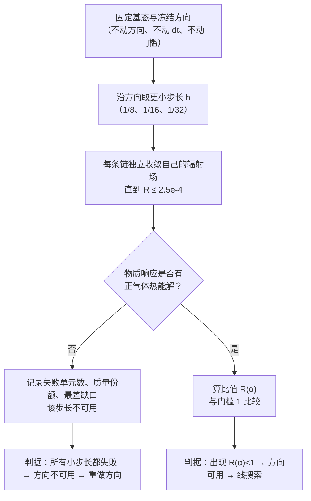
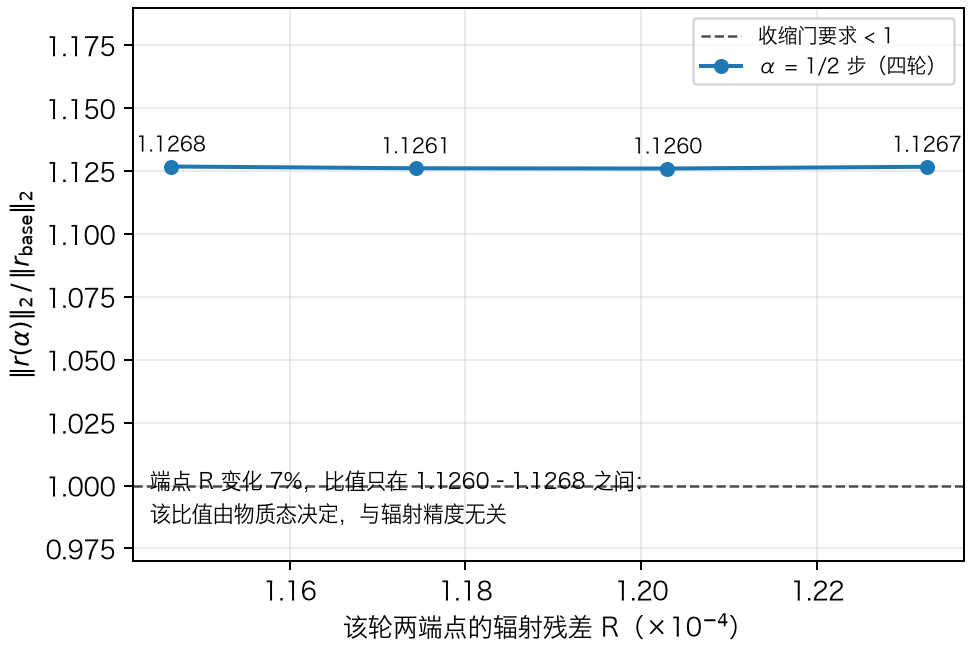
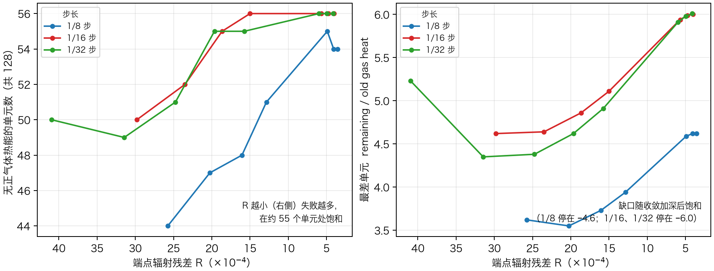

# 小步下降检验：一次"能不能靠缩短步长救回这条方向"的判定

## 一、这次要回答的问题

把局域黑体升级成 H/He 大气，需要让物质与辐射的耦合方程收敛到一个自洽解。此前的尝试沿同一方向取过三个步长：$1/2$ 步（$\alpha=0.0625$）响应物理成立但方程残差不下降；$1/4$ 步与更小步长的候选让物质响应离开了物理域（没有正气体热能解）。

这留下一个必须回答的岔路，而不是可以直接猜的问题：

> $1/2$ 步不下降，会不会只是因为"步长太大"？把步长缩小，残差是否就会下降？

如果答案是"会"，那么只要做线搜索（不断缩小步长直到满足条件）就能继续推进；如果答案是"不会"，则说明**方向本身**有问题，必须停下来重做方向——这是两条完全不同的后续路线，代价差别很大。

## 二、判据怎么定（先定判据，再看结果）

三个量必须先固定，否则结论会被我们事后挑指标挑出来：

1. **比较对象**：候选状态的编码残差范数与基态（$1/2$ 步的参考态）相比，
   $$R(\alpha)=\frac{\lVert r(\alpha)\rVert_2}{\lVert r_{\text{base}}\rVert_2}.$$
   收缩门要求 $R(\alpha)<1$。
2. **合格条件**：只有**两端点的辐射残差都 ≤ $2.5\times10^{-4}$**（阶段 B 授权门槛）的反馈轮次才参与判定。辐射未收敛时的比较会混入"场没算准"的误差，此前已被明确禁止。
3. **物理前提**：物质响应必须存在正气体热能解；若没有，该步长直接判为不可用，不进入上面的比值比较。

## 三、工作流程

具体做的事只有四件，顺序不能颠倒：

1. **各步长独立收敛自己的辐射场**。每个候选的物质态不同，辐射场也不同；用别人的场当初始猜测只是数值加速，最终必须收敛到该候选自己的解。为此给三个步长各建一条运行链，每条 48 张映射、每 4 张形成一轮反馈。
2. **每轮记录两组数据**：该轮两端点的辐射残差 $R$，以及物质响应的物理域状态（失败单元数、质量份额、最差单元的缺口）。
3. **等场收敛到门槛以下**，再用同一判据做比较；未达标的轮次只作趋势点，不参与判词。
4. **用同一套判据横向比较所有步长**，得到"方向可用/方向不可用"的结论。

## 四、三个真实的坑（都不是物理，而是工程）

这一段值得单独写，因为它决定了上面那套流程能否被信任。

**坑一：候选的身份被静默替换。** 一个候选运行"是什么实验"完全由它携带的物质态文件决定。我写的续跑脚本只继承了配置、没有显式带上物质态文件，而流水线发现该文件缺失时会自动复制一份**固定候选**（$1/2$ 步）填入。结果是：两条自称"小步"的链实际上都在跑 $1/2$ 步，据此得出的判词是错的，必须撤回。

处置：续跑脚本改为**先复制物质态、再逐位断言**（编码向量、基态、方向、基准残差、步长五个量全部比对），不一致就拒绝运行；并补了一条"复制后被篡改必须被发现"的负路径测试。教训写成一句话：**一个候选运行就是它的物质态文件；只校验配置或哈希不算通过检查。**

**坑二：形式状态门里混着一条资源门。** 配对计算要求"单个反馈状态的墙钟 < 900 秒"。节点被其他用户压满时，这条门会把物理上完全正常的反馈判为失败。处置：保留失败清单作为证据（改名而不删除）、在负载回落后重算，门本身不动。

**坑三：监督器会被"过期记录"杀死。** 监督器用 `squeue` 查询作业状态，作业记录过期后该命令返回非零退出码，脚本直接把非零当成致命错误而退出——三次无人值守运行都是这样断掉的。处置：新写一个健壮监督器，把"查不到记录"解释为正常答案（并回退到 `scontrol`/`sacct`），其余语义（停止条件、失败不盲目重试）保持原样。此后连续数小时无人值守运行再未中断。

## 五、结果

### 5.1 $1/2$ 步：确定不下降，且与辐射精度无关

四条独立轮次（每轮两个端点都已收敛）给出几乎相同的比值：

四轮的端点辐射残差从 $1.232\times10^{-4}$ 到 $1.146\times10^{-4}$（变化 7%），而比值只在 $1.1260$–$1.1268$ 之间变化（幅度 $8\times10^{-4}$）。这说明 **$R(\alpha)$ 由物质态决定，不是"场还没算准"造成的**。同时把噪声底单独测过：同一状态重复计算的三类扰动（迭代次数、输入末位、不同实现路径）造成的差异在 $10^{-14}$ 量级，与候选-基态差异（$22.4$）相差 15 个数量级。因此这个 $1.1268$ 是真实信号。

### 5.2 更小的步长：不是变好，而是更糟

三个更小步长（$1/8$、$1/16$、$1/32$）各自跑了 48 张映射、12 轮反馈，端点辐射残差分别从 $2.58\times10^{-3}$、$2.98\times10^{-3}$、$4.10\times10^{-3}$ 降到 $3.53\times10^{-4}$、$4.01\times10^{-4}$、$4.13\times10^{-4}$（下降 7.3、7.4、9.9 倍）。结果：

两件事同时发生并且都饱和：

- 没有正气体热能解的单元从 44–50 个增加到 **54–56 个**（共 128 个），在约 55 个处停住；
- 最差单元的缺口从 3.6–5.4 倍增加到 **4.6 倍（$1/8$ 步）与 6.0 倍（$1/16$、$1/32$ 步）**，同样停住。

账本里定义 `remaining = 旧气体热能 + 旧电离能 + 该时间步的辐射增能 − 更新后的电离能`；缺口取负说明**更新后的电离态所要求的比能量超过了前三项之和**，该单元不存在正温度解。对照步长序列（$1/4$ 步 43 个失败单元 → $1/8$ 步 54 个 → $1/16$ 与 $1/32$ 步 56 个），**步长越小失败越重，并在 $1/16$ 步附近饱和**。

### 5.3 结论

| 步长（原方向的分数） | 物质响应 | 编码残差比值 |
|---|---|---|
| $1/2$ | 物理成立 | $1.1268$（四轮稳定，>1） |
| $1/4$ | **离开物理域**（43 个单元） | 无法定义 |
| $1/8$ | **离开物理域**（54 个单元，缺口 −4.6） | 无法定义 |
| $1/16$ | **离开物理域**（56 个单元，缺口 −6.0） | 无法定义 |
| $1/32$ | **离开物理域**（56 个单元，缺口 −6.0） | 无法定义 |

需要先写清这个结论覆盖的范围，否则它会显得比证据更强。实测的步长集合是 $\alpha\in\{1/2,\ 1/4,\ 1/8,\ 1/16,\ 1/32\}$，另有平凡极限 $\alpha\to0$（此时候选就是基态本身，比值按定义为 1）。两个**未被采样**的窗口是 $(1/4,\ 1/2)$ 与 $(0,\ 1/32)$：要在其中得到下降步，比值必须在那里出现一个"凹陷"（先降到 1 以下再回升）。这一点现有数据既不能证明也不能排除，因此属于**明确标注的未测边界**，而不是被结论覆盖的部分。

在这个边界之内，结论是：

1. **"步长太大"不是原因。** 在已测的四个更小步长上，响应直接离开物理域（不存在比值可比），不是"比值仍然大于 1"。
2. **线搜索不是有证据支持的出路。** 线搜索只能在"响应仍物理"的步长范围内工作；而已测范围内唯一物理的步长是 $1/2$，它的比值稳定在 $1.1268>1$。要指望线搜索，就必须先证明那两个未采样窗口里存在下降凹陷——现有证据（失败随步长减小而加重、随收敛加深而饱和）与之相反，但没有排除它。
3. **有证据支持的下一步是重做方向。** 入口条件也已定量：用实测噪声底约束有限差分步长，**先保证差分信号显著高于噪声，再构造方向**；否则会再造出一条由噪声主导的方向（旧方向正是这样产生的：它用的差分步长使信号比噪声低 293 倍）。

## 六、与最终目标的关系

最终目标是一个自洽的 H/He 大气解，进而得到角分辨强度 $I_\nu$ 与发射率。这条链上必须分开的几件事，本次检验各自推进了一步：

- **内层辐射是否算得够准**：三条链已把残差压到 $3.3$–$4.1\times10^{-4}$，其中三条延续链仍在向 $2.5\times10^{-4}$ 推进；
- **一个物质步是否被接受**：没有——残余的失败既来自"方向不下降"（$1/2$ 步），也来自"响应不物理"（更小步长）；
- **方向本身是否可用**：本次给出明确否定结论，并给出一份可执行的重建入口条件。

因此本次检验的价值不是"又跑了几条链"，而是**把"继续在步长上试探"这条路的可能性一次性排除掉**，并把下一步（重做方向）所需的噪声约束准备好。

## 附：本讲义的三遍核对记录

讲义按与代码相同的标准核对三遍，修正如下（保留在此处，便于读者判断可信度）：

| 遍次 | 检查内容 | 发现的错误 | 处置 |
|---|---|---|---|
| 第一遍（事实与数字） | 逐条比对所有数值与工时记录：比值四轮值、端点残差、失败单元数、缺口、倍数、噪声量级 | "$R$ 变化 8%"应为 $6.97\%$；"11–12 轮"应为 12 轮；"下降 7–11 倍"应为 7.3/7.4/9.9 倍；"压到 3.5–4.1e-4"漏了延续链已到 3.29e-4 | 全部按记录改正；图 1 的标注同步重画 |
| 第二遍（逻辑闭合） | 检查"已测步长 → 结论"的推理链是否有缺口 | 原稿把结论写成了对全部步长成立，但实测集合只有 $\{1/2,1/4,1/8,1/16,1/32\}$（外加 $\alpha\to0$），未采样的 $(1/4,1/2)$ 与 $(0,1/32)$ 两个窗口没有覆盖 | 在 5.3 明确写出已测集合、两个未测窗口，以及"下降需要凹陷"这一缺口；结论限定在已测范围，并说明它为何不与证据矛盾 |
| 第三遍（物理表述） | 检查量纲、定义与物理解释 | 解释缺口为负时漏掉了旧电离能项（账本是 `旧气体热能 + 旧电离能 + 辐射增能 − 更新后电离能`） | 按账本定义改写，并注明"缺口以旧气体热能为单位" |

核对后的两条硬约束（读者可以用它们反过来检验本讲义）：

1. 任何比值都只在**两端点辐射残差 ≤ $2.5\times10^{-4}$** 的轮次上给出，其余轮次只作趋势点；
2. 任何"失败/成功"结论都指明它在哪些步长上被测过，未测区间显式标注。
