# 从慢收敛辐射历史到可检验的加速候选

本讲义对应76931、76946和下一批已声明的真实映射检验。Claude通过`claude -p`产生初稿，Mac独立核对代码、归档、公式与图后重写：纠正“当前块统计作用于整盘”“只读扫描执行了迭代”“三个map”及把最大范数说成平均量等错误。原始草稿保存在`outputs/review-20260925/claude-affine-lecture-draft.md`，不是科学结论。

## 1. 当前到底在求什么

当前计算对象是一个代表环带、一个物理时间层上的柱。物质状态包含温度和H/He布居等量；给定这个物质候选后，辐射转移仍需多次迭代，使强度与依赖辐射场的源项相容。这里的“固定物质”仅表示这段辐射迭代不改变物质候选，不表示辐射已收敛。

有了辐射场，才能积分得到物质率和净加热，计算物质响应，并与所给物质候选比较。这是外层耦合问题。76931的热能和布居两个试探方向都没通过全部物质接受门，因此正式已接受数仍20；这20次是有限非线性物质步，不是20个已完成的耦合柱。

即使代表柱闭合，还要解决径向和轨道相位覆盖、网格与历史敏感性等问题，才可能提供整盘观察者积分所需的局域出射角分辨强度$I_{\nu}$。本轮的9632频率组、32方向、4096辐射深度块统计属于当前柱，不能称为全盘强度。局域发射系数$j_{\nu}$还要经过吸收、散射和边界传输才能形成涌现$I_{\nu}$，两者不能互换。

## 2. 为什么要换一种辐射迭代办法

76931继续提高相同物质候选的辐射精度后，原相邻反馈噪声门改善，但两个方向仍分别违反最大单元或整体残差收缩门。候选与control又存在高度同向的慢漂移。因此既不能凭原噪声门通过宣布差商准确，也不能把两份漂移范数简单相加当作实际差分误差。

下一步需要检验能否用已有辐射历史减少慢漂移，而不是先把一个裕量仅约0.019%的线性物质混合预测当作可靠新方向。76946为此只读取旧态，计算外推可行性；它没有执行新map，也没有写出新的强度候选。

## 3. 两次已完成映射如何产生一个候选

令$T$表示固定物质下的一次原辐射映射，$a,b,c$是同一case的三个连续强度态，已有两次真实计算证明：

$$
b=T(a),\qquad c=T(b).
$$

用一个全场共同的无量纲系数$s$定义候选$q$和预测输出$p$：

$$
q=b+(s-1)(b-a),\qquad p=c+(s-1)(c-b).
$$

若$T$在这些场及外推位置上严格仿射，上式就给出$T(q)=p$。实际程序还含离散误差、内部迭代停止误差及可能破坏仿射关系的实现环节，所以必须新算$T(q)$。误差$T(q)-p$反映这次预测与实际算子的差异，不能不加区分地全归因于物理非线性。

系数由历史增量的全场平方范数代数拟合得到，并受所有单元非负性限制。每个case只有一个系数，没有按单元裁剪。三个系数约30.75、28.16、34.54；这不是已执行了相应数量的map，更不等于获得相应加速倍数。

## 4. 两种残差为什么看起来相差巨大

预测全局残差定义为全场最大绝对变化除以全场最大强度尺度。逐块相对残差则在该块内选取分子和分母。它们都是最大值统计，不是把误差平均掉。

76946预测全局残差约为$4.8\times10^{-6}$到$5.1\times10^{-6}$，相对于各自旧值的比为0.738、0.771、0.825；与此同时，弱高频尾部最差块的自身相对残差约0.16。弱块的绝对强度小，全局分母很大，便可能出现这种差距。全局值下降不能证明每块相同程度地改善，也不能代替率、加热和物质响应检查。图见`handoff/evidence/20260925-step21-radiation-scan-review.png`。

## 5. 下一批如何把预测变成证据

先给三个case各写一个新候选并做一次真实map。比较所有频率、角度、深度上的实际输出和预测输出，保留每个频率slab的误差，而非只比较两个标量残差是否相近。两个不同的场完全可以有相同的最大残差。

只有实际残差改善且通过原内层、边界、正性及资源门，同时全场预测误差小于已声明的算法续算限值，才追加反馈所需的两张相邻map。control反馈不稳定就停止依赖它的候选比较；任一物理响应离开正气体热能等允许域就停止后继反馈。

整批最多9张map、3对反馈。原物理dt和科学门不改，不自动接受第21步。本轮能回答“这次辐射外推是否值得用于后续精度检验”，不能提前回答“完整模型是否存在自洽解”或“何时得到整盘$I_{\nu}$”。

## 6. 三次真实映射的中期结果

76957的三个真实map已通过小工件独立审计：488个文件、680条代码声明、228份进程回执。实测全局残差与旧值之比为0.737593、0.770636、0.824947，预测误差与全场强度之比约为$4.29\times10^{-14}$到$4.60\times10^{-14}$。这些实测支持本次有界续算，不能提升成任意候选都满足仿射关系的定理。

最差16频率slab位于`[9488,9504)`，按它自身强度归一化的预测误差分别约10.49%、2.38%、2.44%。对应强度数值约$1.4\times10^{-310}$到$6.7\times10^{-310}$，处于float64非正规数范围。全局指标以整场强度为尺度，局部指标以弱尾自身为尺度，两者不矛盾。具体误差产生于哪个算术环节尚未定位，不能断言只有舍入误差；弱尾仍全部保留，没有删频点或裁剪。完整物质率和加热反馈继续承担其实际影响的检验。

本节由Claude根据实测事实生成补充草稿，再独立核验数字、分母和结论边界后改写；草稿保存在`outputs/review-20260925/claude-three-map-lecture-draft.md`。此时control追加map及反馈仍在运行，正式接受数保持20。审计细节见`handoff/linux-runs/2026-09-25-affine-three-map-independent-audit.md`。

## 7. 为什么相邻稳定仍不保证物质方向可靠

随后完成的control反馈保持同一物质状态，其final响应残差与旧参考$r_{20}$之差L2约0.51354，但当前相邻两个响应之差仅0.006607。前者反映同一物质在不同辐射数值状态下评估出的响应变化，不能称为仅仅改了参考名称；后者是相邻跨度，也不是到真实解的距离。两个数值都不是严格误差界，不足以证明收敛或发散。

热能候选相对原$r_{20}$的L2、质量加权和最大单元比为0.997500、1.004496、1.003312，后两门失败。它相对当前control的四种端点比较也未通过最大单元门，最坏比1.003003。加热门和相邻噪声门通过不能替代这些失败门，也不能更换分母让候选通过。旧参考和新control因此同时保留。此结论对应已审control/thermal工件，尚不包含population反馈的判定。

本节参考Claude补充草稿后独立复核并修订，去掉了把实际响应漂移说成单纯“参考版本更替”的歧义。原草稿位于`outputs/review-20260925/claude-affine-feedback-lecture-draft.md`；完整证据见`handoff/linux-runs/2026-09-25-affine-control-thermal-feedback-audit.md`。

## 8. 完整反馈已经拒绝两个方向，下一步检验辐射历史能提供多少信息

76957于11:44:53正常完成，9张映射和3对反馈全部落地。population候选的L2、质量加权和最差单元范数，相对原参考的比为1.006029、1.017638、0.999826。前两项大于1，所以不能接受。即使改看同轮control，四种端点比较的最坏质量比仍为1.002557。thermal也仍失败。正式接受的有限非线性步数保持20。

噪声门通过仅表示当前相邻辐射端点造成的响应差，相对协议所定义的试步信号足够小。它没有量出真实辐射固定点的误差，因而不能推断“失败与内层误差无关”。同一control的两种跨度已揭示这个限制：相邻响应差小，而相对较早评估结果的累计漂移大。

下一项只读检查的“两个方向”，指同一物质状态下的两个辐射历史差分，不是thermal/population两个物质方向。三个case各自拥有四个连续辐射态，彼此独立分析。把它们记为$x_{0},x_{1},x_{2},x_{3}$，其中$x_{i+1}=T(x_{i})$，$T$是固定物质下的转移映射。定义辐射增量$r_{i}=x_{i+1}-x_{i}$。选两个数$u,v$，使

$$
\|r_{2}+u(r_{1}-r_{2})+v(r_{0}-r_{2})\|_{2}^2
$$

尽量小。直觉是：若两个历史差分能区分两种衰减速度，就可能用两个系数同时减弱两种残留成分；若它们几乎共线，第二个系数就没有可靠的信息来源。代码因此检查Gram矩阵的条件数，病态时直接记录不能辨认，不添加任意正则项强造答案。范数是离散强度数组的L2，没有能量积分权重，不能把它等同于净加热误差。

随后只在内存小片内构造候选及其预测映射，检查四个预注册阻尼系数的全场正性、局部与全局残差、边界积分。没有合格项就停在诊断结果；有合格项也不写候选文件，不增加map或物质步。真正的下一关仍是新算$T(q)$，再核对反馈与物质响应。顺序文件读取和小矩阵诊断使用默认4核；具有16个转移worker的实际映射验证才使用32核。

本节参考Claude草稿后独立重写，纠正三点：不能把固定物质的辐射端点评估称为新“接受态”；不能用相邻噪声门通过排除所有内层误差；不能混淆两个辐射差分与两个物质方向。草稿保存在`outputs/review-20260925/claude-affine-final-draft.md`。完整审计见`handoff/linux-runs/2026-09-25-affine-final-audit-and-anderson2-plan.md`。

## 9. 历史方向可辨认，不代表外推强度保持非负

77066的三个Gram矩阵条件数约12133、2738、3171，均通过预声明的条件数门。这个结果只说明没有触发该算法拒绝条件，不能断言系数完全不受输入误差影响。矩阵方程最小化的是离散辐射差分范数，没有把逐点正性作为方程约束；负权重的外推组合即使降低整体残差，也可能把很弱的局部强度推到零以下。

实际只读扫描发现，满足系数幅度限制的六项候选都在同一80个频率组里产生负值，索引为`[9424,9504)`；预测全局残差仅下降约1%至4%。负值接近float64下溢区，部分却已超过最小正常数的绝对值。因此不能直接把全部负值归为非正规数，更不能仅由数值很小就断言全是舍入。

下一项诊断把两个问题分开。第一，保持历史字节和系数不变，仅提高组合运算精度，负号是否仍存在？第二，把选定位置的原字节和系数写成精确的二进制有理数，用不舍入的四则运算检查符号。设某一点沿固定方向的强度为$a+\eta d$，其中$a\geq0$是原强度，$d$是冻结的外推斜率，$\eta>0$是阻尼参数。如果精确计算证实$a=0$且$d<0$，任意正阻尼都会给出负值；不必继续猜测多小的阻尼能救这个方向。

这样的证据只排除现有字节与固定方向的组合，不排除别的方向或别的数值表示，也不证明物理模型无解。精确复算组合不能恢复历史计算中已经丢失的强度，更不能自动定位原始求解器在哪一步产生了零。诊断仍只读，结果出来之前不写候选、不提交32核真实映射、不裁剪弱尾。

本节参考Claude草稿后重新核对，删去其“条件数过门即可证明负号不是噪声”的过强推论；草稿在`outputs/review-20260925/claude-anderson2-draft.md`。对应完整审计与诊断方案见`handoff/linux-runs/2026-09-25-anderson2-rejection-and-tail-arithmetic-plan.md`。

## 10. 已经证明的负值，与尚未求出的合法方向

77094完成后，Mac独立把60个证据点的原始字节转换为有理数，精确重算全部组合。六个候选各有10个严格负点，说明它们的负号并非只由最后组合步骤的舍入引起；单纯用更高精度计算同一组字节和系数，不能让这些候选全部非负。这是对六个候选的反例，不是对所有辐射解或物理模型的否定。

更宽的longdouble计算仍有大量负值，thermal的$\eta=0.125$甚至多出11062个负点。现有计数没有细分这些点在float64中原来为零还是正数，不能凭计数就断言全部是舍入成零。没有找到零基态负斜率见证，因此也不能说“任何正阻尼都不行”。尾部给出的必要阻尼上界约为0.00248、0.0159、0.00562，但尚未证明这些阻尼在全场通过，更未验证它们改善物质反馈。

新方案把两个系数$u,v$当作一张平面上的坐标。每一个$q\geq0$或$p\geq0$条件都会排除这张平面的一侧；保留下来的交集才是候选区域。旧方案沿已经选好的射线缩步，新方案可以换方向，但始终使用同一物质状态和同一组历史辐射态。弱尾约束按实际参与的三个强度正规化，使它不会仅因数值小就被忽略。

首次只放入已知反例的约束，再做全场扫描。每轮虽只选每片每字段最严重的两个点用于下一次系数求解，但所有负点都保留计数，而且下一轮重新检查全部点。最多6轮；如果仍有负值，就记录未找到合格候选。即使全场非负，还必须通过原残差和边界门。固定的1%全局系数退回不修改任何单元，也不降低物理时间步。

这个有限搜索既不保证找到全场最优点，也不保证一定存在够好的候选。小矩阵审计复用同一个优化器，只是重放检查，不伪称第二套独立求解算法。真正的物理证据仍需后续真实映射和正式H/He反馈。本节依据Claude草稿独立重写，修正了由计数直接断言float64把负值变成零的过强表述；草稿在`outputs/review-20260925/claude-tail-exact-draft.md`。

## 11. 77102：找到全场非负的预测候选之后，为什么还要做真实映射

这一轮把“如何使预测残差变小”和“强度不能为负”放进同一个系数选择问题。
四个$x_{0},x_{1},x_{2},x_{3}$是同一固定物质下的连续辐射态；它们不是四个已接受物质态。
两个全局系数构造

$$
q=x_{2}+u(x_{1}-x_{2})+v(x_{0}-x_{2}),
$$

$$
p=x_{3}+u(x_{2}-x_{3})+v(x_{1}-x_{3}).
$$

这里$q$是候选辐射场的代数定义，$p$是对真实转移$T(q)$的预测。
$u,v$也不是thermal和population两个物质方向的混合比例：三个case各有自己的四态和系数，不能跨case拼接。

control、thermal、population分别经过3、3、2次完整场扫描，最终$q,p$的负点都为零。
预测残差与各自旧真实残差的比值是0.980458868751369、0.9725097569529314、0.975764149996243；
对应约1.95%、2.75%、2.42%的改善。系数、严格内部残差及边界两门也通过。
较早几轮有更大的预测改善，却含负强度，不能使用。追加正性约束后可选系数集合缩小，
较大的预测改善被舍弃，最后得到符号可接受的结果。没有把负单元裁掉或设成零。

应把三个命题拆开看。第一，扫描已在存储四态及指定float64运算顺序下，逐点计算$q,p$并证实非负。
第二，$p$是否足够接近真实$T(q)$仍未实算；真实算子包含的数值实现不能凭仿射代数式保证。
第三，即使$q$的真实辐射残差更小，也不意味着由其计算的物质响应会使全部物质残差范数下降。
这三层分别对应代数检查、真实映射检查、耦合反馈检查，前一层不能替后一层过门。

下一批因此先为三case各写一份候选并做真实$T(q)$，全部602个频率片与$p$比较，
并逐位重建$q$核对候选没有换成另一份数据。原最大残差与边界门、预测误差门都通过后，
再做control相邻反馈；控制态稳定才为合格的物质候选做反馈。
上限9张map、3个反馈对，32核/128GiB、16worker；科学门失败可以提前结束，不要求凑足预算。

Mac独立核对了归档6文件、683代码声明、约束hex和全片汇总，并查看图形。
小矩阵求解重放沿用同一优化器，不能称作另一算法独立证实最优；Mac也没有重新积分大型辐射场。
截至77102终态没有新增map、反馈或接受步，接受步数仍20。离整盘观测$I_{\nu}$还隔着耦合柱闭合、
所需相位/环带覆盖及观察者积分，不能从这次约2%的预测改善推算总项目完成时间。

本节参考Claude草稿后独立重写：删去“信息量最大”的无证据断言，并明确$q$是已逐点检查的候选定义、
只有$p\approx T(q)$是待真实映射验证的预测，避免把两者一并模糊称为代理模型。

## 12. 77126的首张control：全局预测准确，不等于每个弱尾单元都收敛

首张control真实映射已完成。Mac核对168文件、684项代码哈希声明、76个进程回执和602片汇总，原门均通过。
全局真实残差为$4.9937817096107006\times10^{-6}$，与旧control之比为0.9804588686808425，改善约1.95%。
这证实了这一候选的预测改善在真实映射中出现；本轮物质反馈还没做，所以不增加物质接受计数。

用全场强度尺度0.03863303480258114归一化，最大预测误差约为$9.7\times10^{-15}$。
但频率索引[9488,9504)的强度尺度只有$3.618032768489\times10^{-310}$，
该片最大预测误差为$3.09450244646\times10^{-312}$；两者之比是0.008553，约0.855%。
同片真实映射相对其自身尺度的变化约16.9%，最差自然频率block74的相对变化约16.0%。

这并不矛盾：全局误差将最大误差与全场强度尺度相比，局部误差将片内误差与该片尺度相比，
两者问的是不同问题。后者并非因为分母小就可以删去；它揭示了全局门不能约束每个弱尾点的相对误差。
也不能仅凭这些数就定位舍入来源，更不能把非正规数域中的非零信号一概当成无效数据。
本轮保持原全局接受门并完整报告局部量，没有负值修补、删点或改变物理时间步。

时间也要区分：首张真实map记录206.4秒，从提交到冻结输入声明则经历29分21秒准备阶段。
未对这一准备时间做逐函数剖析，不能说每秒都用于哈希；更不能把整段墙钟当作一次map计算时间。
15:41快照仍是control完成一张、thermal初始化中；接受物质步仍20，后续按原条件批次验证，不据此外推整盘$I_{\nu}$完成日期。

## 13. 三个首张真实映射都通过后，尚缺哪一段证据

截至16:16，三case首张真实map已独立审计通过。control、thermal、population各自的真实全局残差约为
$4.994\times10^{-6}$、$4.630\times10^{-6}$、$4.717\times10^{-6}$，相对各自旧值分别改善1.95%、2.75%、2.42%。
这些是三个独立的前后对照；不能因为thermal的数字较小，就说它的物质状态比另外两者更接近最终解。
每个比值的分母来自对应case的旧真实辐射映射，比较的物理对象必须保持相同。

真实$T(q)$与预测$p$的最大差异，除以全场强度尺度后约为$10^{-14}$。
因此，在这项全局范数下，预测描述了新候选的真实映射行为。
但最差弱尾片[9488,9504)自身尺度下的预测误差分别为0.8553%、0.2480%、0.2066%，
同片实际映射变化仍约16.9%、16.5%、16.5%。全局通过与局部变化并存，不是互相抵消的两条结论；
必须同时保存，不能把“所有602片都检查过”改写成“每个点都相对收敛了”。

下一环是物质响应。程序已为control追加两张map，正在计算相邻端点反馈；只有控制反馈稳定，
才会继续给通过首张验证的物质候选追加map和反馈。届时还要检查原全部物质残差门及新control四种端点组合，
不能只看加热或只看一个范数。首map一致性消除了本轮继续计算的一项障碍，却没有预先给出物质残差收缩的答案。
接受步数仍20，整批预算仍是最多9张map和3个反馈对；不据此承诺耦合柱或整盘$I_{\nu}$的完成日期。

## 14. thermal仍被拒绝：内层辐射验证与外层物质收缩是两个命题

77126的control和thermal两个完整反馈对已独立审计。control满足零位移控制的7个稳定/物理域条件；
thermal满足16项中的14项，但质量加权和最差单元残差没有收缩。
相对原$r_{20}$，thermal的L2比值为0.9976885，质量加权比为1.0069709，最差单元比为1.0032372。
这表示一个范数下降、另两个上升，不能凭L2单独宣布向解推进。

加热相邻变化约$1.5194\times10^{-4}$，小于$10^{-3}$；内层噪声/试探信号比约0.01104，小于0.1。
四个端点的最小气体热能均为正，最低约$7.02\times10^{12}$ erg/g。
这些检查排除了本次判决中的对应失败情形，却没有把物质收缩门变成多余条件。
因此，真实辐射map预测准确、热反馈相邻变化较小、气体能量为正，仍然可以与“这个物质候选应该拒绝”同时成立。

为什么还要与同期control比较？原$r_{20}$固定了与已接受基态的正式比较；新control保持同一基态物质，
但使用本轮辐射计算，提供相近数值求解阶段的参照。
thermal对同期control的四种端点比较中，最坏单元比仍达到1.0029558，也没有通过。
所以本次不能靠换分母救回候选，而且本来就不允许删除原基准判据。

当前control响应与$r_{20}$的向量差L2约0.5272，而control相邻两反馈的差仅约0.005617。
这是不同迭代跨度的差异，不是物理时间前进；物理旧时间层和时间步一直固定。
二者也不是精确解误差的严格界。相邻反馈稳定不能据此保证累计内层偏差已经消失，
同期control同样不能被说成自动消除了这种偏差。

population仍按原批次继续反馈。thermal的拒绝不替population作判决，也不证明该模型无解。
接受步数保持20；下一次决策必须等最后一对反馈与作业终态的独立审计。

## 15. 三个候选的最后结果，以及为什么转向长窗口控制实验

77126 已在 17:10:01 完成，耗时 2小时20分33秒。9张map和3对反馈均已独立核验。
上一节尚未完成的population现在有明确判决：对原基准的L2、质量加权、最差单元范数比分别为
1.0053503、1.0179333、0.9997611。前两项大于1，故拒绝；thermal也因质量加权和最差单元门失败而拒绝。
population的加热门、噪声门通过，目标比气体热能仍为正，最低约$6.97\times10^{12}$ erg/g。
所以“响应存在”和“候选改善了全部残差”是本轮必须分开的两个判断。接受物质步数仍为20。

### 15.1 为什么不能立即把两个失败方向相加

将同一轮的control、thermal、population完整物质残差向量记作$C,T,P$。
它们都是128层、每层4个编码分量的向量，不能先压成一个范数再混合。
我们只构造一个有限响应的仿射近似：

$$
R(a,b)=C+a(T-C)+b(P-C).
$$

$a,b$分别缩放已测得的thermal和population响应差；它们不是辐射外推的系数，也不是物理时间。
两个有限试步各对应原编码方向上的$1/256$位移，此近似没有证明是真实非线性物质响应。
以$a=\epsilon\theta,b=\epsilon(1-\theta)$考察原点附近的共同下降，$\epsilon>0$是小幅度，
$\theta$是thermal方向的比例。先对三种平方范数求方向导数；最大单元范数如有并列活跃层，必须所有活跃层的导数都为负。
每轮control/thermal/population各有前后两个端点，因此需检查$2^3=8$种组合。

76957的共同下降比例区间约为$(0.16381,0.57276)$，77126约为$(0.14024,0.63623)$。
这说明有限响应近似中存在局部下降方向。但下降是相对于同期$C$而言，正式门还要求优于冻结的$r_{20}$。
起点如果已经偏离原基准，一小步局部下降仍可能不够。因此我们另检验833个有限幅度网格点，
保留两轮共16种端点组合、两种基准和全部三范数。没有一个网格点预测全部通过；最好点的最坏比仍为1.004769。
这只能排除这组有限网格在该近似下的通过，不能排除网格外候选，更不能证明真实非线性模型无解。

### 15.2 现在缺少的是哪条证据

当前control与原$r_{20}$的向量差L2约为0.52716，而同轮相邻control反馈的差只有0.005617。
小的相邻变化可以与显著的长跨度变化同时存在。物质与旧时间层没有变化，故这里讨论的是求解迭代，不是物理演化。
这些数不是精确解误差上界，也没有证明原$r_{20}$或当前control哪个更接近精确反馈。
因此继续挑方向之前，先测量固定物质时的长窗口响应漂移，能直接补上缺失的控制证据。

### 15.3 新实验怎样形成可检验结论

新实验从当前control的最后映射态开始，仅推进辐射场；最多16张map，在第8、16张后分别计算完整反馈对。
记新旧窗口的前后反馈残差为$R_{\rm A,i}$和$R_{\rm B,j}$，其中$i,j$各取previous或final。
对三种范数中的任一种$\|\cdot\|_{k}$，计算

$$
D_{k,i,j}=\frac{\|R_{\rm B,j}-R_{\rm A,i}\|_{k}}{\|r_{20}\|_{k}}.
$$

分子先作向量差再取范数，避免两个方向不同但范数相同的向量被误报为稳定。
每窗口有4种端点组合、3种范数，共12个数；全部严格小于0.001才记录诊断一致性。
第一窗口从77126末反馈到新pair08，第二窗口从pair08到pair16；另保留pair16相对77126的累计变化。
第一窗口不一致仍执行第二个已声明窗口以观察趋势，但原物理、反馈、资源或身份检查失败就停止。

两窗口通过只能证明在这两个已观测窗口和所声明尺度上变化较小，不能证明以后不漂移，也不能直接替换$r_{20}$。
不通过则保留漂移证据并结束有限预算，不自动无限续跑。无论哪种结果，都不能自动接受第21个物质步。
代表柱的耦合闭合、全轨道与环带覆盖、角分辨$I_{\nu}$表及观察者积分仍是后续独立验收层次。

## 16. 独立审计能够证明到哪一层

这里有三个不同的问题。第一，收到的文件是否就是原计算的文件；SHA和清单检验回答这个问题。
第二，在给定反馈数组后，账本、范数和过门判定是否按声明的规则计算；独立代数复算回答这个问题。
第三，产生这些数组的微物理方程、离散化和求解是否给出了合格的物理解；它还需要方程审查、
守恒与分辨率检验，以及必要的独立求解。前两层通过不能代替第三层；即使独立求解一致，也不是模型物理正确的自动保证。

本次新窗口审计器独立实现了逐层平方和及三种范数，用`math.fsum`汇总，未调用生产窗口比较函数。
它保留全部128×4分量、每窗口四种端点组合与固定$r_{20}$分母，因而能发现“先取范数再相减”或
“换成新control作分母”等会改变结论的错误。14项新解析/负路径测试和6项相关回归已通过。
又用旧77126控制反馈做了152条回执对应的块汇总、归层、能量锚和7门复核，未重积分物质ODE或大型辐射场。

独立复算的旧两批最坏质量加权窗口比为0.0188410，它不是新77264的结果。
截至18:31，77264完成8张map但尚无完整反馈对，所以新入口的完整端到端验收仍待工件。
“审计工具通过旧工件验证”与“新窗口稳定”必须分开记录；接受20个有限物质步也仍不等于耦合柱自洽。

## 17. 首个窗口前的程序故障：为什么不能拿它判断物理模型

18:33:11，77264在8张map完成后退出。失败位置是反馈协议构造，尚未执行物质反馈。
零位移控制协议禁止接受新物质步，而通用构造器要求输入是有限试步模板；新驱动误把前者直接作为后者传入。
构造器的授权守卫因而正确拒绝。后续把协议设置为零控制的语句尚未执行，这不是气体能量或物质残差过门失败。
47项测试全过仍没有覆盖这个真实接口组合，是本次测试设计的缺口。

修复保留原失败目录与原驱动，新增恢复入口。它使用已审的有限模板，先核原科学门、基态、残差和物理旧层与控制模板一致，
再在写盘和执行之前换回零位移trial，关闭全部物质接受授权。真实协议预构造前移到任何新map之前。
新回归先复现旧错误，再验证最终授权、物理身份与恢复次序；Mac/Linux各40项通过，实际学校工件的构造与native身份预检也通过。
这修的是程序接口，不能靠放宽物理门来代替。

前8张map的608条进程回执和保留端点关系已独立核验。恢复使用新旋转槽，继承经过SHA核对的历史，
先补做pair08；原控制7门通过后，只新增map9–16和pair16。前8张不重算，原实验总预算仍为16张。
恢复作业77299已于18:48:13启动，启动只证明调度开始，不能提前写成恢复或反馈成功。

## 18. 首窗口的实测回答：短距离稳定与长距离漂移可以同时存在

77299已先补完pair08，再开始map9。新审计入口核对2153文件、152反馈回执和608继承map回执，
完成了前面尚待工件的端到端验证。这个包只含旧77264的8张map，没有恢复作业的新map；
归档范围与现场累计进度必须分开。

原零控制7门全过，相邻atomic加热变化约0.0001493，小于0.001，气体热能仍为正。
这些门检查当前相邻辐射端点、率/加热一致性和物理响应是否有效。新窗口门另问一个问题：
把当前物质响应与较早的77126响应比较，经过多个辐射迭代后，它改变了多少？
物质态与旧物理时间层一直固定，因此这个变化来自数值求解的迭代过程，而不是一次新的物理演化。

按第15节定义，四种端点组合的归一化向量差最坏值，L2为0.580%、质量加权为2.066%、最大单元为0.271%，
都超过0.1%窗口门。这里最大单元差也用固定原$r_{20}$的最大单元范数作分母，不是逐层各自的相对误差。
原7门通过和窗口门不通过并不矛盾，因为比较的对象和跨度不同。

相邻响应向量差L2由0.005617降到0.004975，但当前响应与原$r_{20}$的差L2由0.52716增到0.54571。
直觉上，每一步走得稍短，并不妨碍继续远离某个早先的参考点。这里尚未知道精确反馈所在的位置，
所以不能把到原参考点的距离当作精确解误差，也不能从这次漂移推出发散或模型无解。
同样，辐射全局残差约$4.79\times10^{-6}$也不代表所有频块自身尺度都稳定：block74仍有约15.85%的自身相对变化，
没有删去这些弱尾点，也没有证明它们是否主导物质响应漂移。

第二窗口按事先协议继续，以比较漂移趋势；首窗口不一致不是临时追加预算的理由。
接受步数仍为20，不替换$r_{20}$，不自动接受第21步，也还没有可用于整盘观测光谱的自洽大气表。

## 19. 两个窗口给出的完整答案，以及为何先换数值初猜

77299现已完成：18:48:13—20:04:11，耗时1小时15分58秒。它继承8张map并新算8张，
总实验16张、两轮反馈；接受物质步仍20。完整包4296文件的独立审计通过，但这句话说的是
工件与计算账本自洽，不是物理解收敛。Mac没有重积分大型辐射场或物质ODE。

第二窗口最坏L2、质量加权、最大单元漂移分别为0.5222%、1.9134%、0.2581%，都未低于0.1%门。
相较第一窗口，质量加权漂移仅减少约7.4%，不能据此认为很快过门。
两轮的相邻零控制7门都通过，第二轮加热差约0.00013765，最低气体热能仍为正。
准确含义是：相邻端点的率、加热与物理响应通过指定检查；这不保证较早与较晚反馈一致。

相邻响应差L2从0.004975降到0.004527，当前响应与原$r_{20}$的距离却从0.545706增到0.566171。
二者测量不同对象，不能互相代替。若每步继续朝同一方向走，即使步长逐渐减小，仍可继续远离出发点。
这只是帮助理解的几何类比；未知精确反馈在哪，因此这些数值既不是精确解误差，也不证明发散或无解。

现在要解决的是固定物质下的辐射求解效率。此前相邻三输入态的正性外推只有约2%的预测收益；
新诊断改用较远历史，检验残差方向是否更容易区分。这里$x_{k}$专指第$k$张控制map后的辐射数组，
与物质接受编号不同。第一组使用已验证映射对$(x_{6},x_{7})$、$(x_{14},x_{15})$、$(x_{15},x_{16})$；
第二组把首对换成$(x_{7},x_{8})$。输入与输出使用相同权重，权重和为一。
这样在仿射算子假设下可预测新初猜的映射；若实际算子或浮点误差偏离假设，预测需要真实计算纠正。

每个频率、角度、深度上的初猜及预测输出都必须非负，弱尾也受约束，不能删掉。
只读扫描用4CPU、16GiB、最多1小时，两组各最多6遍；不写新大型候选，不推进物质或物理时间。
原预测门保留，另加至少20%预测残差收益的算力筛选，才值得考虑32CPU真实验证。
这个20%是计算成本决策，不是物理收敛阈值。即使预测通过，也必须重新计算真实映射与反馈，
再谈物质步；目前尚无全时域、多环带自洽强度表，也没有整盘观测光谱的大气替换结果。

## 20. 宽间隔预测有了明显收益，但真实映射仍是下一道检验

77366在26分7秒内完成只读扫描。两套基组各检查两遍：首遍有负值，加入18个点的正性约束后，
第二遍的候选$q$及预测输出$p$全部非负。最优组使用第6、14、15个辐射历史态，
预测残差与原map16的比为0.701652，约下降29.83%；另一组为0.702618。
小包的来源、全部分段汇总和六态负值见证已经复核，图也已检查，但这个下降尚不是实算结果。

为何允许负系数，却要求辐射强度非负？系数约为$(0.99,-80.37546,80.38546)$，
它们的和为一，却不是凸平均。负系数使结果可以越过历史态所张成的凸包，从而尝试消除慢衰减方向。
约束施加在每个频率、角度、深度的最终$q,p$上，不是要求每个系数为正。
这次可行点只说明存储态按指定float64公式组合后非负，不保证未知真实$T(q)$处处等于$p$。
较大系数还可能放大状态差分中的数值误差，所以不能因为优化器给出了系数就跳过实算。

下一批先写一个新初猜$q$，用原算子计算真实$T(q)$，再对完整602个频率分段比较真实结果与预测。
同时核对写入的$q$确实等于选定公式；全局误差、局部弱尾误差和真实残差一并保留。
只有真实残差收益也达到20%、预测误差足够小、内层和边界及资源门全部满足，才继续。

通过后再做两张map与pair03正式反馈；原零控制七门有效，才追加八张和pair11。
pair03相对77299旧反馈的变化，包含外推初猜造成的数值位移，不能称作普通八张map漂移。
pair11相对pair03才给出外推之后的八张map漂移。这两个比较回答不同问题，均不能自动替换原$r_{20}$。
总预算为11张map、两个反馈对，32CPU/128GiB、4小时硬上限；这是资源边界，不是整盘完成时间。

即使本批完全成功，获得的也是固定第20物质态上的更有效辐射初猜及反馈证据。
物质残差是否收敛、代表柱的耦合解是否自洽、全相位和多环带覆盖是否成立，仍须逐层验证。
因此不能把这次预测收益称作新的物质接受，也不能把局域发射系数直接当成整盘所需的出射$I_{\nu}$。

## 21. 预测收益兑现为真实残差下降，仍须等待物质反馈

77371的首张真实映射给出了3.2487565237894585e-6的全局残差，
与外推前map16相比为0.701651775290317，实际下降29.83%。八道验证门通过，
Mac小包复核了六态来源、候选身份、76块完整归属与602片误差记录。
这表明指定初猜通过原算子计算后，获得了预期的残差改善；不表示这个初猜已是精确不动点。

预测输出与真实输出的最大差，除全局场尺度，约为$1.23\times10^{-13}$。
这个分母由强场点决定，因此不能把它读成所有频点都有同样的相对精度。
在[9488,9504)弱尾片，预测差/该片场尺度约为0.03534%，而该片自身的实际迭代残差仍有16.28%。
前一个数比较预测与实算，后一个数比较本次映射前后；它们不是同一种误差。
自然block74的自身变化另为15.68%，分块尺度不同，也不能拿来替换前述16.28%。

该弱尾片场尺度约$1.23\times10^{-307}$，高于float64最小正规数；其预测差约$4.35\times10^{-311}$才是subnormal。
这使浮点细节值得保留，但并不构成舍入误差主导全局物质漂移的证据。
本轮没有删尾、裁剪负值或放宽物理门。真实map墙钟约178秒，不包含前面的SHA核验、候选写入与初始化。
Mac没有重读大型辐射态或重积分物质ODE，工件也未保存逐片平方和，因此不能声称独立重算了全场L2误差。

下一步为何仍需两轮反馈？辐射场要通过光致电离、复合与净加热改变物质响应。
内层残差下降不直接给出这些响应是否稳定，也不保证温度、布居、能量共同满足原外层残差门。
首轮反馈检验外推后得到什么响应；后续八张map及第二轮反馈检验该响应是否仍漂移。
接受步保持20，整盘所需的全相位、多环带出射强度仍未建立。不能把本次29.83%当作以后每轮固定收缩率来预测完工日期。

## 22. 辐射残差下降以后，物质响应为什么仍会移动

外推后的pair03原七门全部通过，加热变化约$5.53\times10^{-5}$，两端点所有单元气体热能均为正。
这证明本次端点满足已声明的相邻反馈检查，并不证明固定物质态下的反馈已不再依赖辐射初猜。
将这次两个端点与外推前77299的两个端点交叉比较，共有四种组合。每次先对完整128×4响应向量相减，
再求范数，除以原$r_{20}$的同种范数。最坏L2、质量加权、最大单元比值分别为3.94%、14.57%、1.98%，
均高于0.1%的诊断一致性门。14.57%不是温度百分比，也不是某层自身响应的相对误差。

这些数测量的是外推前后的响应位移。外推更换了辐射初猜，随后重新迭代三张map；
所以不能把这个位移称作八张普通map的漂移。物质态、物理旧时间层和物理步长一直固定，
迭代次数增加不代表盘在物理时间上又演化了几步。

另两个距离帮助辨别相邻稳定和参考一致：pair03相邻端点差L2为0.002569，低于旧0.004527；
本次final响应离原$r_{20}$的L2距离却为0.795453，高于旧0.566171。
相邻两个位置可以更接近，同时离同一参考点更远。距离不等于路径长度；没有精确响应作参照，
这些变化也不构成发散或无解的证明。首张29.83%的收益使用旧辐射残差作分母，与上述$r_{20}$归一化不同。

下一轮pair11相对pair03，才测量外推后连续八张map造成的响应漂移。
如果该窗口仍超门，说明这段有限迭代范围内反馈尚不稳定；如果过门，只支持这个窗口达到诊断一致性，
还不能提供严格不动点误差界。两种结果都不能事后替换原$r_{20}$，也不能自动接受第21物质步。
本批只检验固定物质下的辐射求解与反馈，没有新的合格物质试步，更没有建立全环带、全相位的出射强度表。

## 23. 八张map窗口给出的判决：改善了，但还不能停止内层误差调查

77371完成全部11张map和两轮反馈，总用时1小时48分10秒。pair11相对pair03的八map窗口，
四种端点组合中最坏L2、质量加权、最大单元比值为0.2353%、0.7080%、0.1819%，均未达到0.1%。
这些百分比来自完整响应向量差的范数除原$r_{20}$的同种范数；不是先减掉$r_{20}$再算比值。
旧控制末窗口质量加权比为1.9134%，新数值比它小约63%。两窗口初始辐射态不同，
因此这只是实测量之间的比较，不是同初值控制实验，也不证明精确解误差减少63%。

相邻加热变化约$4.76\times10^{-5}$，原七門仍全部通过。为何长窗口却失败？
七门中的率和加热条件主要限制相邻辐射端点产生的反馈变化，正能量条件检验物理域。
八map窗口则对隔开较远的完整物质响应向量作比较。每一次相邻变化较小，累积变化仍可超过更长窗口的门。
正气体热能仅说明响应没有离开该物理域，不证明物质试探方向能够同时降低三种外层残差。

这次外推已通过真实算子检验，说明借助相隔较远历史消除一部分数值慢模是可行方向。
但普通map之后残差仍缓慢下降，反馈窗口未过，所以不直接追加大量普通迭代，也不宣布物理模型失败。
下一项计算先用默认4核，读取本次保留的第1、2、3、9、10、11个辐射态，检查新历史是否还支持有效外推。
每个输入必须有真实后继，不能拿预测后继当实算后继。两套基组各最多六遍检查，时间上限一小时。
正性约束覆盖所有点，不能为了外推成功删弱尾；只有预测残差改善超过20%才考虑新的32核实算。
扫描本身不生成新map、不推进物质或物理时间，也没有接受第21步的权限。

## 24. 收益门挡住了重复计算，能量账本指出更相关的目标

第二次历史扫描77473用30分35秒结束。两组最终都保持非负，但预计辐射残差只降12.08%和11.82%，
没有达到事先规定的20%收益要求。因此不为这两个组合启动32核任务，也不事后修改收益门。
这个决定说明本次基组不值得昂贵验证，不说明模型无解。

随后把已有八map窗口的响应漂移拆成四个编码分量，发现质量加权平方贡献约99.9846%属于
气体热能的对数分量。它不是“99.9846%的热量出了问题”，而是在指定范数中，绝大部分端点差
来自这一分量。这提示应该追查辐射如何改变净加热，而不是只看全场强度的无权L2残差。

固定旧物理时间层、密度与步长后，两个反馈端点的气体比热能差，等于辐射净加热增量减去电离能增量。
将各频率块加热差乘上同一个逐层对数割线因子，就可以精确相加，重现气体热能的对数变化。
本次总变化质量加权范数为0.00185419，电离能项只有约$2.69\times10^{-12}$，
分解闭合误差约$3.05\times10^{-16}$。主要贡献来自block24、48、23、49等块。
block56–75各项范数的总和仅约$1.01\times10^{-10}$；由三角不等式，这已是它们合计贡献范数的上界。
故本次不能把高频弱尾的大自身相对变化当作物质热能漂移的主因，也不能因贡献小而删掉这些频率。

这仍只是已知端点间的账本恒等式，不是证明求解器哪一处导致误差。
索引96–127占热能变化加权平方的80.50%，但在确认坐标方向前只报告索引，不叫表面或深层。
下一方向是检查对物质更相关的净加热投影；已有两个真实映射对的小型代数预测显示约21.72%的代理下降。
该代理不等于实际物质收敛：对应辐射组合尚未经过正性、全场残差、边界及真实反馈验证。
先核公式与代码，再注册有界实验；接受步仍20，整盘出射强度仍未建立。

## 25. 为什么可以预测净加热，却仍不能直接预测物质收敛

在当前固定物质的组内常强度路径中，多普勒频率搬移和角积分都是对辐射强度的线性运算。
吸收系数与热发射由固定物质决定，所以原子净加热是强度的仿射函数：线性吸收积分减去固定发射积分。
代码核对、非零速度与负权组合的小测试，以及四个真实端点的发射数组逐位相同，共同支持这条限定关系。
它不适用于更换物质或任意非线性限幅重构；相干散射对完整转移映射的影响仍在。

这允许用两对已经实算过的辐射态，预测一个新组合的加热投影变化。
选定系数约−2.22225后，只检查这一个组合，不看结果调整系数。
代理范数预计下降约21.72%，但还需检查整个组合的非负性、全场辐射残差和边界通量。
此次成本目标是净加热代理，不是旧扫描的全场L2目标；旧两组12%预测仍被拒绝，物理接受门从未改变。

为何代理通过仍不够？完整物质更新要同时计算布居、气体热能和温度，其依赖是非线性的，
固定参考气体热能构造的敏感度不能取代这一步。预测输出也没有代替真实算出的转移输出。
因此这次四核只读检查只筛选值得验证的初猜；即使全过，后面仍要真实映射、正式反馈及较长窗口比较。
诊断可以给出有用结论而不必等整盘完成，但不能把诊断结论扩大成第21步已接受或大气已自洽。

## 26. 预测通过之后，怎样检验它真的减少了加热误差

77531已完成。Mac核对完整包、690个代码声明、四态来源和602频率片归约后，确认
预测热代理比为0.7827750126445282，预测辐射残差比为0.9281833102456314，
预测输入q及输出p都没有负强度。前者是约21.72%的下降，后者只有约7.18%；
它们衡量的对象不同，不能用一个替另一个报收益。这里仍没有候选的实际加热值。

首先把两个容易混淆的编号分开。物质已接受20步，现在固定第20步物质，不作更新。
本节的$x_{1},x_{2},x_{9},x_{10}$却是77371内部四个**辐射**状态，编号不是物质步。
真实转移映射用$\mathcal{T}$表示，以免与温度T混淆。旧计算已经给出
$\mathcal{T}(x_{1})=x_{2}$与$\mathcal{T}(x_{9})=x_{10}$。
现在用固定系数$\alpha=-2.222250421897835$构造初猜与预测后继：

$$
q=x_{9}+\alpha(x_{1}-x_{9}),\qquad
p=x_{10}+\alpha(x_{2}-x_{10}).
$$

q是我们选择的输入，p是对转移输出的预测。新计算必须真的求出$\mathcal{T}(q)$，
逐频率、角度、深度与p比较，不能把p直接当作已计算的结果。

为什么第二张map后就做反馈？第一张map计算$\mathcal{T}(q)$，第二张计算
$\mathcal{T}(\mathcal{T}(q))$。这样两个输入q和$\mathcal{T}(q)$各有自己的真实算子残差，
能按原协议成为一对正式反馈输入。若等到第三张才首次反馈，就会跳过q，无法直接检验这次初猜的热代理预报。

对128个物质格逐格计算净原子加热Q。其单位是每体积每时间能量，乘$\Delta t/\rho$
得到比能量，再除固定参考比气体热能$u_{\rm ref}$，成为无量纲变化：

$$
s_{\rm actual}=rac{\Delta t}{\rho u_{\rm ref}}
\left[Q(\mathcal{T}(q))-Q(q)\right].
$$

参考能量取旧77371末反馈的正气体热能，此次写盘冻结。质量权重和旧晚期代理范数也冻结。
实际s的质量加权范数除旧晚期范数必须小于0.8，才算真正达到本次20%收益目标。
不能改用新响应的能量作分母，否则比较对象随答案改变，无法检验原预报。

但只看Q差还会漏错：若两个端点都多算相同加热，它们的差可以完全正确，物质能量却都错了。
因此还要分别检查两个Q相对各自仿射预报的误差，以及差向量误差。
三组误差均先乘同一固定尺度，质量范数和最大绝对值再分别除旧晚期s的对应尺度，
共六项都须小于0.001。这是预先登记的预测精度预算，不能在看到实际结果后修改。

首张真实场检查、原反馈七门、正热能等物理域检查、实际热代理收益和这六项全过，
才追加八张map，在第10张后再次反馈。新旧两对反馈的四种端点组合分别作向量差，
L2、质量加权和最差单元三个范数都除原r20的对应范数，再与0.001比较。
该窗口测试回答“继续推进内层时物质残差是否仍明显移动”，不是对未知真解误差的严格上界。

即使本批全部通过，也不自动接受第21步物质，更不是整盘强度完成。
局部热代理只测加热方向；完整物质响应还涉及布居、温度和非线性残差。
合格代表柱之外，仍须覆盖径向与相位定义域、检查分辨率和适用性，再把角分辨局域强度接入整盘投影与频移积分。
整盘$I_{\nu}$因此不是“有一个频率数组”就成立。

本节使用CLI讲义草稿作结构参考后独立重写：纠正了草稿把$\mathcal{T}(q)$写成易混淆的温度符号、
把整盘强度缩减成频率维度解，以及只列六项误差门而漏掉原反馈/物理域门的问题。

## 27. 首张真实映射验证了什么

77577已实际计算第一张$\mathcal{T}(q)$。Mac审阅完整小工件，核165个文件、691条代码声明、
76个块进程记录及602个频率片归约，首张七个检查门均通过。
实际辐射残差为$2.891787541923786\times10^{-6}$，相对旧77371末map为0.928183310072748，
约下降7.18%。原子加热的首轮正式反馈仍在计算，所以热代理下降21.72%还不是实测结论。

这里有两个不同的问题。预测误差比较$\mathcal{T}(q)$与预报p；固定点残差比较
$\mathcal{T}(q)$与输入q。前者小只说明外推很好地预报了算子的作用，不能推出后者为零。
本次预报误差除全局场尺度为$4.13\times10^{-15}$，除真实映射变化为$1.43\times10^{-9}$，
两者都很小。这支持把该候选交给下一阶段反馈检查，不是物质方程已经求解完毕。

全局尺度还会掩盖很弱的频率片。最差片9488:9504的局部预报误差比为$9.59\times10^{-7}$，
其场尺度只有$1.62\times10^{-306}$，绝对差$1.56\times10^{-312}$处于浮点次正规数范围。
该片自身一次迭代仍改变约16.14%。所以不能把全局误差说成每个频点都具有15位准确数字，
也不能只看弱尾的大相对变化就判断它主导气体加热；后一个问题必须通过Q积分与逐层能量账本回答。

独立审阅的边界也要具体：Mac核对来源并从块/片记录重新归约数值，不是只照抄summary，
但没有再次执行9.41GiB全场转移或物质ODE。现有片记录不含L2平方和，因而只保留生产端L2数值，
不声称独立重建它。既不能把这种审阅扩大为完整物理复现，也不该把它缩减为仅检查有没有读错字。

已接受物质步是20，第21步尚未接受。该事实与本次首张辐射检查通过并不冲突：
内层先给出可用反馈，外层才能判断物质更新，随后才有资格讨论代表柱、全域大气表和整盘$I_{\nu}$。

本节独立修正CLI草稿：删去无充分证据的“病态尾片”定性，并纠正其误写的“第20步未接受”。

## 28. 热代理改善第一次成为实测结果

首轮正式反馈已给出$Q(q)$和$Q(\mathcal{T}(q))$。把它们代入此前冻结的尺度，
独立重算所得实际代理比为0.7827750126391803，预报是0.7827750126445282。
因此，本候选让这一个热代理的质量范数实际降低约21.72%，已经不只是预测。
原晚期范数0.00018972716729363516，实际范数0.00014851368577627113；比较使用同一分母。

这一结论没有把“热代理”偷偷扩大为“热能的相对误差”。代理是两个辐射迭代输入所产生的
加热差，乘固定$\Delta t/(\rho u_{\rm ref})$后得到的128格向量。
它的质量加权范数减少，表示该尺度下的局部加热迭代变化减小；尚不知道它离未知真解还差多少，
更不能据此说完整物质残差或整盘光谱误差也下降21.72%。

为什么这次证据比单一范数比值更强？两个端点的Q预报误差和差向量误差都单独检查了，
每组各有质量范数与最大绝对值两个指标，六项最大为$5.55\times10^{-10}$，
小于预先登记的$10^{-3}$。这样既检查总的质量影响，也防止某格大误差被平均掩盖；
分别检查两端点还防止共同加热偏置在相减后消失。新旧自发发射数组逐位相同，固定物质的假设未被悄悄改变。

与此同时，原反馈七门通过，两端点最低气体比热能约$7.05\times10^{12}\,\mathrm{erg\,g^{-1}}$，
并通过布居、编码及能量账本检查。因此当前反馈没有重现此前无正气体热能的物理域失败。
这只描述当前候选的两个端点，不能证明以后所有物质候选都安全，也不能把七门等同于完整耦合求解已结束。

另一个看似冲突的数是0.01449：新pair02与旧77371末反馈的最大质量加权向量位移，
除以原r20的对应范数得到它。它描述重新选择辐射初猜后反馈移动了多少。
我们真正要检验的八map稳定性，却是新pair10与新pair02之间的向量差。
两者起点不同，不能把前一个0.01449拿来宣布后一个窗口失败；也不能因为局部热代理变小就预判窗口通过。

此次Mac从1244份小文件复核来源、块归约、能量账本，并以`math.fsum`独立计算热代理和端点位移范数。
原七门复用原判定函数重放，没有再解大辐射场或物质ODE。CLI草稿中“保证整个数值路径独立”的
表述过宽，本节限定独立性至实际另写的归约；草稿提到的长窗口范数，本轮尚只有外推位移，
真正八map窗口仍等待pair10。已接受物质步保持20，21未接受。

## 29. 一次有效加速为什么仍未结束计算

77577正常完成了10张新的全频map和两对新的正式反馈。热代理确实改善21.72%，
但八张追加map之后，两对物质响应仍有可测的移动。四种端点组合中，L2、质量加权和最差单元
位移范数除原r20对应范数后的最大值依次为0.001456、0.004994、0.000828。
要求每项小于0.001，所以前两项未通过，第三项已通过。不能只报道第三项宣布稳定。

这些数回答的是“继续求内层辐射后，物质响应还会改变多少”。它们不是未知真解的严格误差界，
也不是在比较不同物理时间。物质20、密度和物理时间步都固定，改变的是求解器内部的辐射近似。
末对仍通过原反馈七门，气体比热能最小约$7.03\times10^{12}\,\mathrm{erg\,g^{-1}}$；
这排除了当前端点无正热能的失败，却没有使物质残差归零。第21步仍未接受。

下一步先问一个便宜的问题：把三个已有真实映射配对的热变化向量重新组合，还能改善多少？
三组分别来自77371末对、77577首对和末对，所有向量使用原先同一参考能量与质量尺度。
三个权重之和等于1，因此只有两个自由度。解无约束的质量加权最小二乘，最优比也只有0.90834，
即相对最新配对再降约9.17%，达不到原定20%成本门。矩阵条件数约5.71，未出现近奇异放大。
因为无约束最优已经不够，再加全场正性约束不会创造更低的同目标范数，故不值得为这一组合做大场扫描。
这个结论只限该三个配对历史张成的空间，不能推及其他方向、其他求解器，更不能推论模型无解。

寻找新方向要回到误差作用在哪里。逐块加热变化按正确的4096到256再到128格规则归层后，
乘固定$\Delta t/(\rho u_{\rm ref})$，质量范数最大的仍是24、48块。
它们分别约$2.34\times10^{-4}$与$2.10\times10^{-4}$；这是定位指标，不能将所有块范数相加当净加热，
因为不同频率贡献会相消。因此新试验直接考察这两块的源残差校正，而不是继续混合相近的全局历史。

有限Krylov在这里生成一个数值校正方向，随后必须用原正性转移算子重新检验。
它固定块外频率halo，忽略的并非辐射物理本身，而是这次局部校正引起的块外未知变化。
因此局部原缺陷即使减半，也不保证拼接后整个场改善。旧74454已出现过局部有效、相邻块边缘最大缺陷增大的反例。
本次只用两worker、默认4核检查24、48块，保留局部候选，不写全局候选、不作新正式反馈或物质接受。
局部重放、正性、真实L2和最大缺陷、边界、资源与成本门均通过后，才有依据登记后续全频验证。

这条顺序保留四个证据层次：热代理预报与实算一致、长窗口响应足够稳定、完整物质耦合满足门、
全定义域局域强度可接入整盘积分。前一层有收益不自动完成后一层。
CLI草稿错误地说本批没有新全局map、把最大范数通过写成越门、又无依据地说“收敛成立”，
并把三历史局部求解器分析归入整盘层；本节已逐项纠正，草稿不能作为判决依据。

## 30. 局部校正有效以后，为什么还要计算完整的一步和半步

先固定对象：物质仍为已接受的第20步，原物理旧时间层和物理时间间隔均不变。
令$I$为全频、全角度、全辐射深度的强度数组，$T$为在这个固定物质条件下的一次原辐射映射，
定义缺陷$R(I)=T(I)-I$。零缺陷意味着该离散映射的不动点；小缺陷只表示一次映射改变小。
当慢模收缩率接近1时，小缺陷可能伴随较大的累积误差，所以不能把缺陷大小直接当离真实不动点的距离上界。

77648只处理第24、48频率块。halo指计算该块时读取的邻接频率范围，其数值固定为77577 map10输入的对应值。
这不是删除halo中的物理相互作用，而是求局部校正时尚未让邻块未知量随之调整。
在这个条件下，重新调用原算子后的L2缺陷分别降到原来的0.114258、0.097915，最大缺陷分别降到0.302907、0.411241。
候选和重新映射后的强度全有限非负。Mac检查了两个局部NPZ的SHA，并独立逐频率归约候选缺陷；
原始输入输出块没有下载，旧L2和边界通量仍依赖经源码与清单校验的学校报告。

这两个方向来自每块最多16次GMRES迭代。返回info=2、线性审计未通过，故不能称GMRES解收敛。
方向的价值来自“实际原映射缺陷下降”的直接证据，而不是迭代器宣称成功。
但这份证据的定义域只有固定halo的单块：将两块的新值放回全频场后，它们也会成为邻块的输入，
邻块缺陷可能增大。旧74454已有这种反例。因此下一张全频map必须保留所有频点、所有邻块和原最大范数，
不能把两份局部报告相加冒充全局验证。

具体地，以旧完整输入$x$及其已存真实映射$T(x)$为基准，将两个局部候选替换进去得到$q$。
其余频率组逐位复制$x$。半步$h$只在两个选中块取$(x+q)/2$，其余仍复制$x$；
实现用$0.5x+0.5q$避免先相加溢出。未改块直接复制也避免最小次正规数被半乘下溢后改变。
这里的半步是**辐射迭代方向上的数值半步**，绝不是把物理时间间隔减半。

实际计算$T(q)$与$T(h)$，定义$R_{0}=T(x)-x$、$R_{q}=T(q)-q$和$R_{h}=T(h)-h$。
若这条线段上的离散映射符合仿射关系，半步缺陷应等于端点缺陷的平均。检验量为

$$
\epsilon_{\rm half}
=\frac{\left\|R_{h}-\tfrac12R_{0}-\tfrac12R_{q}\right\|_{2}}{\left\|R_{0}\right\|_{2}}.
$$

要求它不大于$10^{-6}$，是对这条线段的有限数值检验，不证明任意强度方向都精确仿射。
77648恰好都取全步：将线段参数设为1后，端点插值就是端点自身，所以当时的零预测误差没有提供这个独立检验。
新半步需要另调一次完整原算子，才补上缺失的证据。

预注册门沿用已有全频组合检查：全步L2缺陷/旧L2不大于0.999；全步最大缺陷及半步两范数不增，
只给$10^{-10}$相对舍入余量；两个map的严格辐射门、边界谱与bolometric门同时通过，边界变化也不得超过旧值。
全域非负、身份、资源门一样不能省。若任一失败，最多两张map就结束，不临时改门或换成半步宣布成功。
这只否定当前完整步的登记门，并未否定这条方向上所有更短步长。

若都通过，full继续map2并取pair02正式反馈；原七门与物理响应域通过后，自动继续map3至10，再取pair10。
pair02相对77577的改变是换辐射初始化后的位移。pair10对pair02才是八map间隔的稳定性检验，
必须检查四种端点组合与L2、质量加权、最大三个范数，分母始终为原$r_{20}$的对应范数，门为0.001。
总预算最多11张全频map及两对反馈，零新物质接受。32核加速这一受控试验，并不消除这些证据条件。

平台CLI草稿由deepseek-v4-flash[1m]生成，已独立校正：没有依据把高低频机制分成“边界耦合/全域守恒”；
不是“前两map失败”，而是77577三个窗口范数中的前两个越门；半步不改变物理时间步；预算是11map、两对反馈，
不是“11个map2反馈”。接受总数仍20，新增接受为零。草稿不是科学判决。

## 31. 两张真实map给出的反例，以及如何严格限制下一步

77701在26分13秒内完成全步与半步的两张真实全频map。全步L2缺陷变为原来的0.968216，
半步为0.900595；最大缺陷却分别变为14.0205和7.42068倍。最大增幅在未修改输入的第25块，
第23、47、49块也增大。正式反馈因此没有启动，新增物质接受为零。

这里没有两个数学量互相矛盾。L2的平方是所有点缺陷平方之和，一个区域减少的平方和可以大于另一小区域的增加，
因而总和下降，同时最大点变大。不能仅凭L2下降推断“大多数点都改善”，更不能断言L2总是由中小点主导；
这些都要看分布。图中邻块尖峰直接表明：24、48块的新输入改变了相邻频率块实际接收的辐射，
局部固定halo问题中的收益没有保住全域最大缺陷。相邻原子反馈指标还没计算，不应填入想象中的结果。

半步检验确实提供了新证据：真实半步缺陷相对端点缺陷平均的误差，除原L2为$6.25\times10^{-11}$。
这支持在当前方向上用线性缺陷模型分析步长，但只检验了当前端点与半步，
不能把整个连续线段上所有点都说成已经实际求解。因此接下来先用只读4核扫描筛掉不可能过门的步，
有合格预测才值得再算真实map。

令$r=T(x)-x$，$d=[T(q)-q]-r$。沿数值方向$x+t(q-x)$的预测缺陷为$r+td$。
这里$t$是无量纲辐射迭代系数，物理时间间隔原封不动。固定原全域最大缺陷$M=\max_{i}|r_{i}|$，
对每个频率、角度、深度点$i$，要求$|r_{i}+td_{i}|\le M$且$0\le t\le1$。
因为原点$t=0$可行，正步的上界可以逐点直接求出：$d_{i}>0$时是$(M-r_{i})/d_{i}$，
$d_{i}<0$时是$(M+r_{i})/(-d_{i})$，$d_{i}=0$不给新限制。所有上界取最小值，就是全点共同可行的上界$u$。
若某个点原来已为$+M$且$d_{i}>0$，它的上界就是0：任何正步都会使这个点变坏。
这个点不能因为权重小而删除，否则已经更换了验收问题。

L2平方沿方向是一个二次式：

$$
\|r+td\|_{2}^2=\langle r,r\rangle+2t\langle r,d\rangle+t^2\langle d,d\rangle.
$$

当$\langle d,d\rangle>0$且$\langle r,d\rangle<0$时，无约束最优为
$t_\,=-\langle r,d\rangle/\langle d,d\rangle$。本次预先规定取$t=0.9\min(t_\,,u,1)$，
给步长留10%裕量，再逐点检查实际浮点组合的正性、缺陷、边界与辐射上界。
零方向、非下降方向或$u=0$直接记无合格正步，不把它写成成功候选。
L2仍至少要改善0.1%，否则收益不足以进入下一次真实映射验证。

这个扫描最多读三遍四个已存大态，不写新大候选，不产生新反馈。它保存每32频率组的二次系数、
最限制点的索引及精确浮点十六进制值，Mac可独立归约并检查限制点公式。
全体约束来自学校大场扫描，Mac没有下载全部大态，不能把小工件审计称作第二次全场求解。
即使$u=0$，也只说明当前固定方向不适合保住这个最大范数；换方向或联合处理邻块仍是不同问题，
这不是物理模型不存在自洽解的证明。

平台草稿曾把“多数点变好”当成已知，把二范数最优化写成未定义的绝对值最小化，
并用含混的“不等模型无解”描述零上界。本节已改为上述精确定义和证据边界。

## 32. 真正限制步长的是哪个点：短步扫描的定量答案

77747曾在写JSON时因NumPy整数类型失败，结果未保存。新77783只把索引转为普通整数，
同一数学扫描完整落盘并通过Mac小工件审计；因此以下数字属于77783，不能回填到旧失败运行。

忽略最大点约束，仅最小化全域L2二次式时，最优系数为0.5496，接近原方向的半步。
但77701已经实测半步会把全域最大缺陷增大7.42倍。加入每个点的最大缺陷约束后，
可行上界只有0.0097808。限制点是频率组3200、方向索引0、辐射深度索引2144，处于邻块25。
这些是离散数组的索引，不是物理坐标值；深度索引2144也不应误称第2144个物质单元。

这个点原缺陷$r_{i}=9.61549\times10^{-8}$，已经接近原全域最大值$M=1.07629\times10^{-7}$。
固定方向上的缺陷变化$d_{i}=1.17310\times10^{-6}$为正，会继续向外增长，故允许的正步为

$$
u_{i}=\frac{M-r_{i}}{d_{i}}=0.0097807752645.
$$

这里$u_{i}$是数值系数上界，不是气体热能。全点交集的最小上界恰由此点给出。
这个方向变化约为原$M$的10.9倍，与77701测得的极小半步仿射误差相比大得多，
没有证据把本次限步解释成那个已测舍入误差。但半步检验仍不是任意方向的严格误差上界。

按预先登记的10%步长裕量，选择$t=0.008802697738$。它只是原完整校正的0.88%。
预测L2比为0.996968999275；在学校逐点构造预测浮点场再归约得到0.996968999271，二者差约
$3.6\times10^{-12}$。相对0.3031%的预测收益，这个已测归约差很小，不能没有证据就说收益被归约噪声掩盖。
然而该收益本身也很有限：预测最大缺陷只保持不增，不能因此声称解决了辐射慢模或显著缩短了总计算时间。

Mac核对了301段平方和/交叉项、原全域最大值、四个边界通量谱，并用限制点的精确浮点值复算上界。
它没有下载四个9.41GiB大态，也没有独立搜索所有点来证明这个点必为最限制点；
全点交集和第三遍正性检查仍依赖经哈希与测试审查的学校程序。独立审计的范围必须如此明确。

下一批才实际计算这个短步及其半步的原辐射映射；要求原最大范数、边界、非负性等门同时成立，
并比较实测L2比与本次预测。通过后才执行两轮反馈与八map间隔窗口。
它最多11张全频map、两对反馈，不接受新物质步。已接受物质步总数仍为20，20不是某个接受阈值。
若通过，也只能说明这一受约束方向和有限窗口的行为；整盘$I_{\nu}$仍需耦合解与完整定义域验证。

平台草稿将20误写成“接受阈值”，并在没有量级证据时声称小收益易被slab归约近似掩盖。
本节已按实测归约差修正。这里的线段预测由已实算端点和半步支持，既不能说全部步长已经验证，
也不能将仅限本方向的可行性扩大为全模型收敛证明。

## 33. 短步预测已被原算子验证，但物质反馈仍是下一道问题

77790的前置检验现在有了真实结果：原算子对受约束短步与半步各完成一次完整映射。
实际L2缺陷比为0.996968999274639、0.998479532495981；两者最大缺陷比都是1.0。
全步实测L2比与77783扫描预测的相对差为$4.49\times10^{-14}$，
独立半步仿射检验相对旧L2为$6.24\times10^{-11}$，都在预注册门内。
原严格内层、边界及边界非增、全域非负、资源和身份门同时通过。

这给出了明确的前后对照：沿未经限制的原局部方向取全步时，邻块25把最大缺陷放大14倍；
用全点约束选择0.008803的短步后，完整算子实测不再出现全域最大缺陷增加。
成功属于这个固定物质态、这个方向和这两个被测系数，不能外推任意步长或任意后续迭代。
L2只下降0.3031%，最坏缺陷没有下降，因此也没有证据说总体求解已明显提速。

这里的$x_{20}$是固定的已接受物质基态，不是“物质权重”；质量权重、原$r_{20}$和物理时间步也均保留。
在此条件下得到的辐射缺陷与物质固定点残差是不同对象。
前者衡量一次辐射映射对强度场的改变，后者需要将正式辐射加热与原子率送入物质响应，再比较目标状态与当前状态。
辐射L2下降0.3031%并不意味着气体热能、布居或物质残差也按同一百分比改善。
因此作业在完成第二张full控制map后，正在计算pair02正式反馈；该反馈通过后才运行后续八map窗口。
当前没有新的反馈判决，不能预填“热能有效”“窗口已稳定”或“第21步已接受”。

Mac审计核对324个清单文件、698条代码声明和152个worker回执，
独立归约301段平方和、最大值并与逐块报告核对，还核实已审系数与来源。
这证明小工件内部和跨阶段来源一致，不是Mac又求解了一遍9.41GiB辐射场。
全域候选数值与原算子的执行仍由受审学校代码提供，不能扩大独立性的表述。

本批最多11张全频map与两对反馈，零新增物质接受。原物质步总数仍为20，
耦合柱、全定义域强度表与整盘$I_{\nu}$都仍在后续证据链上。
CLI草稿把$x_{20}$称为权重，并把学校计算与Mac审计混写为同一动作；本节已更正，
同时保留“有限方向的全域约束有效”和“尚未证明整体收敛”这两个不同结论。

## 34. 短步通过真实映射检验，为什么仍未通过八步反馈窗口？

77790已完成，总耗时1小时18分38秒。短步的第一次真实全频映射让L2辐射缺陷降到原来的0.996969，而最大绝对缺陷仍为原来的1倍。两轮正式反馈的原七门均通过，物质响应的气体热能仍为正。这些事实证明该短步没有重现此前14倍的最大缺陷放大，但不足以证明反馈已经稳定。

这里有三个不同的比较对象。第一，辐射缺陷是同一个物质态下的$T(I)-I$。第二，单轮反馈比较相邻两个辐射态所产生的光致电离、复合和加热，并检查物质响应域。第三，八map窗口比较首轮和末轮的物质残差向量。第三项不等于前两项，也不能由前两项直接推出。

具体地，记首轮两个反馈残差为$r_{2,p},r_{2,f}$，末轮为$r_{10,p},r_{10,f}$。分别计算四种差$r_{10,a}-r_{2,b}$，其中$a,b$各取$p,f$；每个差都计算L2、质量加权与最差单元范数，并除以始终冻结的原$r_{20}$对应范数。四组合中的最大值依次为0.0012843347、0.0048436987、0.0006967100。门槛均为0.001，因此前两项未过、第三项通过。这里测到的是反馈随继续迭代发生的漂移；尚未证明它是随机误差、系统偏差或某个单一物理机制，不能直接命名为“噪声累积”。

与77577的八map窗口相比，以上三项幅度下降约11.8%、3.0%、15.8%。这不是严格的短步对照实验：两个窗口起点不同，而且又做了额外迭代。因此不能把下降全部归因于短步，尤其质量加权仍约为门槛的4.84倍。目前不再机械重复相同短步或再追加八map。

下一试验固定77577原输入，将原单块24的修正范围扩大到23至25，单块48扩大到47至49。每个联合核心包含384个原频率组。频率组边界、物理率核、物质态、物理时间步均不变；改变的是共同求修正的未知量范围，使已发现的邻块响应纳入同一个局部问题。先验证扩大核心后的一次原映射能重现既有结果，失败即不做该组Krylov；成功才做最多16次Krylov迭代及独立半步检验。

联合核心仍有外边界。即便内部改善，22、26、46、50等外侧块也可能受影响，所以这个试验只决定是否值得再做全频检验，不直接接受物质步。当前仍是20个已接受物质步，第21步未接受，更没有整盘自洽$I_\nu$。

本节先由学校CLI无工具生成草稿，再由Mac依据已审计工件重写；修正了草稿把“漂移”概括为“误差累积”、把原七门笼统称为守恒量门的表述。实际CLI模型见本地草稿JSON；独立审计不依赖CLI判断。

## 35. 联合核心的方向确实有用，但有用到哪里？

77817把修正范围扩为23至25、47至49两组三块核心，固定核心以外的辐射态。两组的一次原映射均逐位重现既有结果，说明本次扩大计算核心没有改变这个输入上的映射结果。实际候选的局部L2缺陷分别降到原来的0.23717和0.10421，最大缺陷降到0.33942和0.40480。Mac已从两份各768 MiB的局部数组独立逐频归约这些新缺陷，而不是只读学校报告中的比例。

GMRES均在16次迭代后停下，`info=2`且线性审计未过。这回答的是“该线性修正方程是否解到了指定容差”。另一个问题是“把所得不完全方向放回原算子后，缺陷是否减少”。本次第二个问题的局部答案是肯定的，不能反过来抹掉第一个问题的未收敛记录。

还需区分两种误差。端点预测误差为零，是因为所选比例恰为1，所比较的两个端点重合，不是独立验证。另算半步后，与两个端点映射平均值的差除以原缺陷L2，分别约为$1.10\times10^{-10}$和$7.73\times10^{-11}$。这是同一局部方向上一个独立样本的仿射一致性检查，不是所有辐射态的严格误差界，也没有在Mac重新执行该半步算子。

为什么还要全频算一遍？局部计算固定了核心外的守护区；真实全域中，外侧22、26、46、50等块的映射可以响应核心变化。此前单块24、48的局部改善曾伴随邻块全域最大缺陷放大约14倍。扩大核心可能减轻这一问题，也可能把问题移到新的外边界。局部结果本身不能区分这两种情况。

下一试验把已审计的两个联合候选覆盖回完整辐射态，原频率控制体不变，全域仍采用原76块映射。先计算全候选和半候选各一次真实映射，全频每一点同等纳入L2、最大缺陷、边界与半步一致性检查。任一门失败即停，不进入反馈；全部过才条件推进有限的两轮反馈，至多11张map。它检验的是方向是否在全域也有益，并不直接接受第21个物质步。

本节先由学校无工具CLI草拟，再独立修订；草稿的“域截断造成误差外溢”没有作为已证实机制保留，而改为可由全频试验检验的外侧响应。原小核心与新大核心覆盖域不同，两个L2比值也不能直接拿来比较算法效率。

## 36. 全域L2下降近六成，为何方向仍被拒绝？

77843的全步和半步实际映射均已完成，但只跑这两张就停止了，没有反馈和物质接受。全步L2缺陷是原来的0.41113，最大缺陷却为3.85307倍；半步对应0.65157与2.01151倍。原最大缺陷非增门没有通过，其余严格辐射、边界及半步仿射一致性门通过。

L2把所有点的缺陷平方相加再开方，最大范数只看绝对值最大的点。比如缺陷从$(1,1)$变为$(0,1.2)$，L2从$\sqrt{2}$降至1.2，但最大值从1增至1.2。因此L2改善不需要各点同向变化，也不保证每点改善。这里不是“失败只属于局部、全局仍然通过”：最坏点条件本来就是正式全局验收的一部分，它失败就必须拒绝整个候选。

实际最坏slab在第50块、起始频率组6400，其全步最大缺陷为$4.1470\times10^{-7}$；原全域最大值为$1.0763\times10^{-7}$。第22、26、46块也放大。把核心从24、48扩大到23至25、47至49后，内部改善了，但新的外侧仍响应。该结果证明当前完整联合方向不合格，不证明所有联合方案或物理模型无解。

下一步只读四个已算出的端点$x,T(x),q,T(q)$。令$r=T(x)-x$，$d=[T(q)-q]-r$，在仿射预测下步长$t$的缺陷是$r+t d$。逐全域每一点求$|r_i+t d_i|\leq M$的共同可行区间，其中$M=\max_i|r_i|$始终固定。这个上界检查没有删除弱点，也没有改物理时间步。

在可行区间内，L2平方是$S_0+2tR_D+t^2D_D$，其中$S_0=\sum r_i^2$、$R_D=\sum r_i d_i$、$D_D=\sum d_i^2$。扫描选取最优可行步的0.9倍作为预先固定裕量，再逐点检查浮点组合、非负性与边界。此次增加算力成本门：预测L2至少改善20%，否则不启动新的昂贵真实映射。这个门用于选择是否值得花算力，不回写历史判决，也不替代物理验收。

全域半步仿射缺陷/原L2约$1.04\times10^{-10}$是一个独立测试点的证据，不是所有$t$的严格误差上界。因此即使只读筛选通过，仍必须独立审计并计算新候选的真实映射；筛选结果本身不能接受第21物质步。

本节先用学校无工具CLI草拟，再纠正草稿中“L2下降要求方向一致”和“失败是局部而非全局”的两处不准确表述。Mac本次核验小工件、来源和归约，没有重解完整大场。

## 37. 为什么放弃统一短步，改做固定频率渐消试验

77905完成了三遍只读扫描，没有生成新候选、没有调用新辐射映射。Mac复核了703个代码声明、包内3个文件、301个分片归约及限制点。按原最大缺陷不增约束，统一步长上界为0.22497727284556118；采用0.9安全系数时步长为0.20247954556100506，预测L2比为0.8534744897164847。即使去掉安全系数，在同一约束区间内最好的预测比也只有0.8375450174224208，改善16.2455%，达不到预先设置的20%成本门。这里去掉的只是安全余量，不是最大缺陷约束。没有理由为这条固定方向继续付出完整映射成本。

这个上限属于指定方向的代数预测。令原缺陷为$r=T(x)-x$，端点缺陷差为$d=[T(q)-q]-r$，则预测平方范数是

$$
\|r+td\|_2^2=S_0+2tR_D+t^2D_D,
\qquad S_0=\sum r_i^2,\quad R_D=\sum r_i d_i,\quad D_D=\sum d_i^2.
$$

见证点频率组6400、方向31、深度1647给出最紧约束；该点$r_i=1.882012598758767\times10^{-8}$、$d_i=3.9474498839597513\times10^{-7}$，原全域最大值$M=1.0762877694636686\times10^{-7}$。因为$d_i>0$，上界为$(M-r_i)/d_i$。流式组合得到的L2比与二次型预测相差约$3.9\times10^{-12}$，这是代数实现交叉检查，不是重新计算$T$，也不证明所有步长处的算子误差严格有界。

新的试验仍从77577原输入$x$出发，保留77817两个局部联合核心的候选$q$。两核心分别覆盖自然块23到25、47到49，各384组；它们不是两个相邻区域。现在对每个核心的修正施加同一固定权重：

$$
w_j=\sin^2\!\left[\frac{\pi(j+1/2)}{384}\right],\qquad
z_j=(1-w_j)x_j+w_jq_j,\qquad j=0,\ldots,383.
$$

权重在中心接近1，在两端接近0但并非严格0。核心外的输入直接逐位复制$x$，不做乘法，以保留极小次正规尾。直觉是：原来的局部修正到边缘突然终止，邻频耦合可能把较大的响应传到外侧；让修正在抵达边缘前逐渐减小，可能缓解这种放大。旧结果仅证明外侧22/26/46/50缺陷增大，没有证明存在振荡或负强度，也没有证明渐消一定有效。这是改变数值方向，不改变物理发射率、频率网格或物理时间步。

不能直接对旧映射结果加同一个频率权重。即便固定物质后的映射严格为仿射形式$T(I)=AI+b$，记$W$为按频率乘权重的对角算子，也有

$$
T(x+W(q-x))-\{T(x)+W[T(q)-T(x)]\}=(AW-WA)(q-x).
$$

邻频耦合通常使$AW\ne WA$。因此必须新算$T(z)$和$T(h)$，其中$h=(x+z)/2$；只对核外输入保持逐位不变，核外输出必须允许响应并纳入检查。半步仿射性比较真实缺陷$r_h$与$(r_x+r_z)/2$，它检验的是这个新方向上的独立样本，不是旧方向的复制。

运行预算为32核128GiB、16个worker、4小时硬限，最多11张map和两对反馈。先用全步和半步各一张真实map，要求全域L2至少改善20%、最大缺陷不增、半步/非负性/原边界门全部通过；失败就停。通过后才算control第二张map与pair02，原七门和物理域通过才继续第3到10张与pair10。最后按原$r_{20}$归一化，四种端点组合的三种范数八map漂移均小于0.001才称该窗口稳定。原物质态、旧时间层、$dt$、$r_{20}$均不替换。

学校CLI草稿实际模型为`deepseek-v4-flash[1m]`，已独立修正三处：不是“相邻两核心交接”；未观测到的振荡/越界不得补造；“核外不变”只约束候选输入，不能约束真实输出。当前仍只有20个已接受物质步，尚无耦合大气闭合，更没有整盘可用$I_\nu$。本试验通过也只增加关于数值方向和反馈稳定性的证据。

## 38. 渐消没有过门：先拆开实际缺陷，再决定算法

77927在27分15秒后正常结束，完成全步、半步各一张真实映射。全步L2比为0.8227658652，只改善17.7234%，未达到20%成本门；全步和半步最大缺陷分别是原值的3.1967745365、1.7824643457倍。独立半步仿射误差相对原L2约为$1.04\times10^{-10}$，边界门也通过。这些事实说明：实现给出了可以相互核对的结果，但方向不满足既定要求。它不是程序崩溃，也不是物理模型无解的证据。

最坏分片变成所选核心内block25的group3264，最大缺陷$3.4406493354\times10^{-7}$。原统一三块方向的最坏分片在外侧block50。因而“边缘渐消减少外侧放大”与“整个方向仍然失败”可以同时成立。不能只展示变好的外侧，忽略核心内的新最坏位置。

下一诊断读取六个现成场：原$x,y=T(x)$，统一核心候选$q,v=T(q)$，渐消候选$z,k=T(z)$。定义$r=y-x$、$s=v-q$和实际渐消缺陷$a=k-z$。如果错误地假定权重与算子可交换，会得到加权缺陷$p=(1-w)r+ws$；核外权重为零，所以$p=r$。以实际数据定义差额$c=a-p$，于是严格的代数分解是

$$
a=p+c,\qquad
\|a\|_2^2=\|p\|_2^2+\|c\|_2^2+2\langle p,c\rangle.
$$

这个分解要回答两件不同的事：把局部方向减弱后，单是剩下的加权缺陷$p$是否已经很大；真实邻频传播所对应的差额$c$又怎样改变了结果。交叉项可以为正，也可以为负，因此不能把两个平方范数分别当成独立的正“错误份额”相加。最坏点还要报告$a_i,p_i,c_i$的符号；全域范数不能代替单点机制。

只有在固定物质映射严格仿射、精确算术下，$c$才等于上一节的$(AW-WA)(q-x)$。实际诊断直接计算$c=a-p$，其中还包含舍入和可能的非仿射贡献，不能先验宣称全是某个物理过程。将按全部频率、所选核心、核心外三类归约，同时保留逐分片账本和最大点坐标，不预设哪项主导。

作业77954使用默认4核16G，最多一遍统计和一小时硬限，来源哈希校验另有读取开销；没有新map、反馈、候选或物质接受。这是利用既有失败结果决定下一算法的诊断，不是另一轮寻找“好看步长”。32核没有在证据空缺时继续无条件运算。学校CLI讲义草稿已独立核对，科学边界保持：物质接受数20，耦合大气和整盘强度尚未完成。

## 39. 差额分解的结果：加权预测遗漏了决定最坏点的响应

77954用4分45秒完成单遍统计，未新增映射或反馈。Mac独立核对了3个工件、706个代码声明和301个分片，实际全步范数与先前真实映射审计一致。分解的最大逐点闭合误差为$1.32\times10^{-23}$，全域平方闭合误差除以原平方范数约为$-6.81\times10^{-17}$，与双精度舍入量级相符。Mac没有重新读取六个完整大场，逐点候选身份仍由学校受审执行及哈希链支撑。

若只看上一节的加权缺陷$p$，其L2比为0.594519，最大值比为0.840472；两者看起来都很好。但差额$c$的L2比为0.547862，最大值比为2.852862。实际$a=p+c$的L2比于是为0.822766，最大值比为3.196775。平方范数账本按原尺度为

$$
0.6769436689=0.3534529912+0.3001524192+0.0233382586.
$$

最后一项是带符号的交叉项，不是第三种独立缺陷。范数通常不能直接相加；在这里交叉项为正，说明全域积分后两项有净增强，而不是净抵消。

最坏点位于频率组3289、方向0、深度2288。实际缺陷为$3.4406493354\times10^{-7}$，其中$p_i=3.7014885978\times10^{-8}$、$c_i=3.0705004756\times10^{-7}$，两者同号。差额占该点实际值约89.24%。这是一个具体点的有符号分解比例，不能说成全域89.24%的误差来自同一机制。核心外的$c$平方仅占全域$c$平方约0.0124%；差额主要位于所选核心，不能再把问题只归因于外侧接缝。

这不是换一套归一化后才出现的“口径差”，而是在同一原尺度下，实际算子响应与加权旧响应存在显著差额。也没有统计证据证明仅极少数点承载全部问题；最大值本来就由极值点定义，不能据此推断超阈点数量。学校CLI草稿中的这两处概括已纠正。差额仍包含非交换、浮点与潜在非仿射贡献，不能进一步臆断为已分离的某个原子过程。

下一步不再事后调整频率渐消权重。已有同原态的两个真实方向，可以先考虑标量凸组合$u=(1-\alpha-\beta)x+\alpha q+\beta z$，其中$\alpha,\beta\ge0$、$\alpha+\beta\le1$。这种候选在非负输入下保持非负；标量系数也避免直接重犯频率权重与邻频算子不交换的错误。但新候选的映射仍未实际计算。

下一有界任务将只读筛选二维系数：先检查全部点的最大缺陷不增约束、原边界门和至少20%的L2收益。不得以分片最大值或抽样点代替逐点约束，也不能把两次半步仿射性作为整个二维域的严格误差证明。若筛选有可行候选，仍需新的真实映射验收；若没有，就记录该二维空间的限制。当前仍是20个已接受物质步，没有完成大气强度表。

## 40. 二维约束生成：小问题提议，全场检查验收

作业78031把上节决定的筛选实现为有界计算。它固定原$x$及两个已真实映射候选$q,z$，选择非负标量$\alpha,\beta$且$\alpha+\beta\le1$。第1遍读取六个完整场，形成

$$
G_{ij}=\sum d_i d_j,\quad b_i=\sum r d_i,\quad S_0=\sum r^2,
\qquad \|r+\alpha d_1+\beta d_2\|_2^2=S_0+2b^T\theta+\theta^TG\theta,
$$

其中$\theta=(\alpha,\beta)^T$。所有求和包含全部频率、方向和深度，不是抽样拟合。Gram退化时直接记录方向未被分辨，不通过人工正则化制造解。

小问题从凸三角形开始，对当前多边形边界逐边解析最小化二次目标，取0.99倍系数作为待检候选。随后完整扫描全部点。若某点违反$s[r_i+d_i^T\theta]\le M$，其中$s=+1$或$-1$，就转成

$$
-\frac{s d_i^T}{M}\theta\ge\frac{s r_i}{M}-1.
$$

每32组最多保存正负两侧各一个最坏违反点，原始数值以十六进制浮点字符串保存，坐标和符号可复核。这些点构成下一轮小问题的约束。小问题确实满足当前已收集的约束，并不是“求解器只管目标下降”；它不能保证的是尚未加入的小问题约束。所以系数一变，就必须再扫全部点。最多一遍Gram和五遍候选扫描；预算到点不算通过。

验收对象是最后一次完整扫描过的候选，而不是优化器的返回状态。需要原最大缺陷不增、流式和二次型L2均改善至少20%、严格辐射与全/半预测边界门、有限性和非负性全部通过。边界或成本失败时停止，只说明本次候选没过；当前算法未联合求完整边界约束下的全域最优，不能扩大成二维空间无解。

凸组合的非负性是物理强度合法性的必要保护，与物理并非无关；它无法单独保证辐射固定点、物质响应、能量闭合或全盘强度表。整个任务不调用新map，不写候选大场，不推进物质或物理时间。若筛选通过，还要独立审计并重新运行真实算子验证。

Mac与学校的23项测试均通过，覆盖已知解析极值、约束符号、三角形边界、退化Gram、完整扫描回执、预算和失败路径。测试不等于真实六场已经筛选成功。学校CLI草稿中“只在采样点判定”“只认目标下降”和“凸非负与物理无关”三句均已按上述实现与逻辑纠正。

## 41. 二维候选终于通过预测门，但还必须经过真实映射

78031在12分42秒内完成一遍Gram统计和四轮完整候选扫描。前三轮最大缺陷比依次为3.8162、2.0675、1.0116，均未通过；加入九条去重约束后，第四轮才同时满足全部注册预测门。不能用第一轮较漂亮的L2比0.4135忽略它把最坏点放大了3.82倍。

最后选定$\alpha=0.2232383685126496$、$\beta=0.2344820251208071$，原态权重为0.5422796063665433。L2比为0.74772947634，预测改善25.227%；最大缺陷比为0.99460617936，下降约0.5394%。这满足预先要求的成本收益和最大缺陷保护，但不代表改善在空间或频率上均匀。两个范数只给出整体平方量与一个极值，不能据此重建分布。

Mac使用独立KKT活跃集枚举复算小问题，而学校生产代码采用多边形裁切后逐边求解，两种方法得到一致系数。Mac还复算301个分片、每轮流式范数、所有约束见证和六端点通量的边界量。没有在Mac读取全部六个大场，所以全点执行仍依赖学校受审代码与来源哈希。没有证明完整约束空间的全局最优：算法是在有限生成的约束下提出候选，然后检验可行性，并未给出整个问题的最优性证书。这与Mac是否重新下载大场是两种不同限制。

作业78032开始进行真正的检验：固定这个候选，重新计算$T(u)$和$T((x+u)/2)$。除了原20%L2收益、最大缺陷非增、半步仿射性、正值与边界门，还要求实际全步L2比和最大缺陷比与预测的绝对差均不超过$10^{-6}$。若不一致，先保留证据并定位原因，不放松误差门让候选过关。

预算为32核128G、16个worker、4小时上限。先两张真实map，全部验收通过才计算control第二张与pair02；原七门和物理域通过才继续第3至10张与pair10。总数最多11张map、两轮反馈，原$r_{20}$不换。八map漂移的四种端点组合、三种范数均低于0.001是严格稳定性门，不是可选参考。即使全部通过，也没有自动接受新物质步。

学校CLI草稿中“收益分布会相当均匀”的推断已删除，并修正了将最优性限制归因于未重扫大场、把漂移门称作参照的表述。现在仍为20个已接受物质步，尚无耦合大气解或整盘$I_\nu$；本次是一个有充分筛选依据、但结果尚未知的真实验证。

## 42. 首次真实组合验证通过：证明了什么，还没有证明什么

78032的全步与半步各完成一次真实映射。Mac独立核对324个文件、710个源码声明和152份worker回执，并重新汇总301个分片与全部76个频率块。固定旧缺陷尺度下，全步L2比为0.7477294763405771，半步为0.8680043928106623；全步最大值比为0.9946061792982213，半步为0.9167959628590002。13项注册检查全部通过。

最关键的新增证据是：预测的25.23%整体缺陷下降确实出现在真实算子输出中，而非仅存在于端点插值里。全步L2比和最大值比与预测的绝对差分别为$8.08\times10^{-13}$和$6.45\times10^{-11}$，均低于事前设置的$10^{-6}$门。独立半步仿射误差除以原L2为$1.04\times10^{-10}$。这支持该固定物质态、该方向和这些测试幅度下的预测可靠性，不是对所有方向或未来物质态的普遍保证。

半步的最大缺陷比全步更低，但L2比更高。两者并不矛盾：L2统计全域平方和，最大范数只取单个极值；不同位置的缺陷可以以不同幅度改变。残差分量在形成某点数值前可能相互抵消，但L2平方和不会让不同点的正负号相消。学校草稿对“抵消”的泛称应限定在此前，不能解释成L2跨点正负抵消。既不能由两个标量断言全步处处更好，也不应事后把既定候选改成半步。

这里的独立性有明确范围：Mac重新执行了来源、身份和小工件统计审计，没有重新扫描全部大场或重新求解辐射核。文件数和源码哈希说明证据链可追踪，不会自动提升为一套独立物理求解器的交叉验证。

后续仍按原协议运行control第二张map与pair02。只有原七门及正气体热能域通过，才继续第3到10张与pair10，检查原$r_{20}$归一化的四种端点组合、三种范数八map漂移。固定物质辐射方向通过，是继续这些反馈测试的条件；它不是第21个物质步已经被接受，更不是耦合大气或整盘$I_\nu$已经完成。
## 43. 辐射残差变小以后，为什么还不能接受物质解

78032首阶段检验的是固定物质状态下的缺陷 $r_J=T(J)-J$：全域L2减小25.23%，最大绝对缺陷不增。这里不是已知精确解与近似解的距离；没有逆算子误差界，不能把残差缩小解释为解误差缩小同样比例。

后续保持物质输入不变，只继续辐射映射，分别用端点计算物质响应向量 $R(J)$。八map窗口比较四种端点组合的差，再除以原r20相同范数。它测量辐射尚未稳定对物质响应造成的变化，不是物理时间演化，也不是质量守恒误差。“质量加权”只是在各物质单元上采用列质量权重，绝不是质量自身在漂移。

本轮L2比0.00097688365、最差单元比0.00051253460通过0.001门，质量加权比0.00360168053失败。三者分母分别是原r20的三种范数，因此不能直接比较大小顺序。原七门与正气体热能通过，也不能消去这个失败。响应向量本身仍明显非零；将来窗口过门，也还需外层物质求解。

质量加权平方漂移中99.982844%来自ln气体热能。取最大漂移端点的正气体能 $g_0,g_1$，定义精确割线系数 $f=\ln(g_1/g_0)/(g_1-g_0)$，相等时按极限取 $1/g_0$。每频率块贡献 $f\Delta t\Delta Q_b/\rho$，电离能变化贡献 $-f\Delta e_{\rm ion}$，所有带符号向量相加就是热能对数变化。这不是正交分解；平方总和中有交叉项，各块范数的和仅是三角不等式上界。本轮闭合误差质量范数3.12e-16，相对热变化范数9.43e-4约3.3e-13。它验证这份代数账本没有造成所见漂移，不能排除原转移核或物质模型的系统误差。

索引96..127占热分量质量平方88.38%，尚不据此命名表层或深层。块24、49、23、48及邻块较大，56..75的贡献范数和只有总热变化的2.10e-8；全部仍参与归约。加热在频率贡献求和时可能抵消，平方后的不同物质单元之间不会正负抵消。

本轮首末两个真实映射对的线性热代理，无约束外推也只有约1.44%预测收益。这个结论只限制该构造与该代理，不能说整个可用求解空间已耗尽。下一步考虑扩大局部频率核心，从23..25和47..49扩至22..26和46..50，并保留原77577输入作对照。改变的是数值修正允许共同求解的范围，原物理模型的频率自由度并没有增加。它有邻块证据支持，仍需真实重放、半步检验与全域验证，不能保证成功。

学校无工具CLI（实际模型deepseek-v4-flash[1m]）草稿把缺陷说成精确解距离、将质量加权漂移说成闭环守恒误差、称频率分解正交、从账本闭合排除所有数值误差，并把有限代理低收益推广到整个求解空间；这些说法均已在此纠正。草稿只辅助讲解，不构成证据。

## 44. 把三块扩大到五块：得到什么，仍缺什么

新局部问题允许22..26或46..50内的频率共同参与修正，外halo保留原值。真实局部映射后的缺陷L2与原缺陷的比值是0.31042和0.11001，不是绝对残差；最大缺陷比值是0.40894和0.37329。三块和五块包含的单元不同，分母也不同，不能把比例大小直接当成算法效率排名。GMRES仍为16次/info2，保存的是有限修正方向，不是线性方程收敛解。原源映射缺陷T(J)-J与Krylov内部线性方程残差也是两个不同对象。

学校78038在默认4核下只读原数组，逐频率核验1280行统计，Mac再独立归约。它核对保存数组确有报告的缺陷，却没有重新求解原转移算子；Mac也没有读取两份大数组。哈希证明输入字节对应，不能单凭哈希证明物理正确。残差不等于真解误差，有限残差指标也不替代守恒检验；不能概括成二者物理上毫无关系。

全域验证重新按原76个自然块更新全部频率，因此改动区外的输出也可能变化。下一阶段必须真实计算完整候选与半步，并检查外侧21/27/45/51和所有弱尾。只有全域L2至少降低20%、最大缺陷不增、半步与边界等全部通过，才花算力做两轮物质反馈；最坏预算11张映射，而不是承诺一定运行11张。即便成功，也只允许重新评估固定物质状态下的响应稳定性，还没有接受第21物质步或得到整盘光谱。

## 45. 五块扩大了范围，但最坏点移到新边界之外

78039将五块局部修正放回全域后，L2缺陷只剩原来的0.345315，最大缺陷却变为2.334772倍。半步最大缺陷仍有1.219176倍，因此不能直接改用半步。最大出现在核心外第51块。这个结果与固定halo局部门成功不矛盾：局部问题没有同时更新外侧频率的响应，全域问题更新了全部频率。它也不证明物理边界条件错误，只说明当前局部修正尚未满足完整算子的全点门。

L2降低只意味着全部分量平方和减少，不能由此推断多数点、多数方向的误差降低；我们未统计改善点数，残差也不是精确解误差。CLI草稿的“五方向”应纠正为两组五块核心构造的一条方向。

已有两个真实端点可定义原缺陷r与缺陷变化d。若在这条方向上采用标量t，仿射预测为r+t*d。全点条件绝对值不超过原最大M给出一个允许区间；L2平方则是S0+2t*RD+t*t*DD。下一步只读求这个区间与二次式最优位置，再保留10%步长裕量。正的可行步不等于有足够收益：缩得太小虽可能守住最大值，却不值得再做昂贵映射，所以仍要求至少20%预测L2改善。预测若过门，也必须真实重算；两个端点和半步近似仿射不是整条方向的严格误差界。

## 46. 保留整体收益，同时限制核心外的最大缺陷

78039显示：一次完整五块修正可以显著降低全域L2，却让核心外第51块的最大缺陷增大。这两个数并不矛盾。L2是所有点缺陷平方和的平方根，Linf只取绝对值最大的一点；降低前者不保证后者下降，更不能据此知道到真实解的距离。

本轮78040不重算物理。设 $x$ 是原辐射输入，$q$ 是完整五块候选，$T$ 是已经运行过的真实转移映射。定义 $r=T(x)-x$ 和 $d=[T(q)-q]-r$。注意 $q-x$ 是辐射状态的更新方向，$d$ 是两端缺陷之差，两者不是同一个量。沿线新输入为 $u(t)=(1-t)x+tq$。若这个方向上 $T$ 仿射，则有

$$
T(u(t))-u(t)=r+td.
$$

等号右边的端点来自已执行的真实映射；本轮预测的是尚未执行的新输入映射，不存在另一个所谓“预测算子”。78039独立半步的近仿射证据支持这个近似，但有限样本不能证明整条线处处精确。

令 $M=\max|r|$。逐每个频率、角度、深度施加 $|r_{i}+td_{i}|\le M$，与 $0\le t\le1$ 求交，学校端得到上界 $U=0.4017670734644154$。限制点为索引[6528,0,2544]，其 $r_{i}=1.1148271890490044\times10^{-8}$，$d_{i}=2.401403983256535\times10^{-7}$；此点的上界是 $(M-r_{i})/d_{i}$。Mac由十六进制精确浮点记录复算该点，但没有重新读取全部大场来证明它是所有点的最小上界：后者仍依赖学校受审全点扫描。

L2平方沿线为 $S_{0}+2tR_{\rm D}+t^2D_{\rm D}$，其中 $S_{0}=\sum r_{i}^2$、$R_{\rm D}=\sum r_{i}d_{i}$、$D_{\rm D}=\sum d_{i}^2$。无约束最优点 $-R_{\rm D}/D_{\rm D}=1.3022$ 已在允许区间外。因此采用预先固定的 $t=0.9U=0.3615903661179739$，而不是看到结果后调整裕量。该值预测L2比0.7448509081，第三遍实际浮点组合得到相同值；最大比0.9103580773。两者分别下降25.51%和8.96%。三遍只读扫描用默认4核5分18秒，未运行新map，也未写候选。

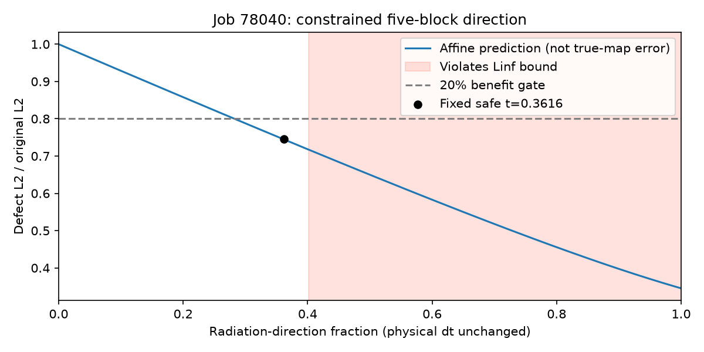

图的阴影区虽然继续降低L2预测，却违反最大缺陷约束。黑点位于允许区间内，并通过至少20%收益的成本门。这个门筛掉收益过小的昂贵试验，不是新的物理收敛标准。

下一步32核运行真实 $T(u)$ 与独立半步，并要求实际L2/Linf复现预测、边界与正域等门全部通过。只有通过后才允许两轮正式反馈及八张间隔的稳定性检查。固定数值辐射方向的步长，不改变物理时间步889.419892762322秒；20个已接受物质步也是同一个物理旧时间层问题的非线性迭代，不是20次时间推进。尚无耦合柱或整盘强度完成证据。

只读CLI讲义草稿实际模型为deepseek-v4-flash[1m]。本节已纠正它把真实端点说成预测算子、把物质迭代说成物理推进、无证据引入MPI非确定性、把缺陷方向与状态更新方向混同的表述。归约吻合不是物理模型验证；本节数值均以独立审计JSON为准。

## 47. 预测落到真实映射之后，哪些结论成立

78041对固定短步及其半步各真正计算了一张完整映射。独立小工件审计得到全步L2比0.7448509080527358、Linf比0.9103580772793498；半步相应为0.871468643667493、0.8931388546422822。四个数都相对同一个原场尺度，所以可以比较。全步整体缺陷更小，但半步最大缺陷更小；不能从全步L2较优推出每一点都更优。

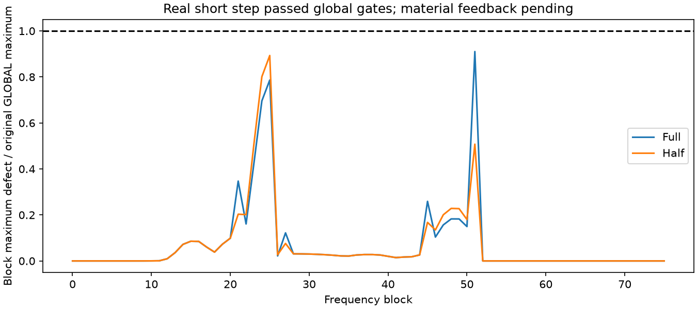

本图每个纵值是块内最大绝对缺陷除以原场全域最大绝对缺陷，绝非各块自行归一化。所有块都位于横虚线以下，因此各自全域最大门通过；不同块间曲线交叉解释了两个范数排序为什么可以不同。L2是缺陷平方和开根号，不是平均误差，更不是到真解的距离。

实际全步L2比与78040预测的相对差为 $1.09554\times10^{-13}$，Linf差为零。这不是仅仅把同一个统计量再求和一次：78040从两个已知真实端点构造沿线预测，78041额外调用真实转移算子处理新输入，两者再作比较。它支持该方向上仿射预测在这次步长的准确性，但不证明所有物质背景或任意方向都有同样性质。独立半步的仿射偏差相对原L2为 $1.30983\times10^{-10}$，提供另一处实际采样检验。

Mac校验324文件、717代码声明和152个worker回执，并独立归约301片统计、76块边界与最大值；Mac没有重新求解大场。13道首阶段门全部通过，因此按原协议继续双端点反馈。后续需要检验：辐射场的小变化通过净加热和物质响应后，会不会仍导致不可忽略的变化。首轮相对旧输入的位移与八张映射间隔的漂移分开记录，不能混用。此时仍20个接受步，第21步尚未接受。

CLI草稿实际模型deepseek-v4-flash[1m]，将L2称作“均方误差”、将真实新映射与预测之差缩减为“归约实现一致性”、将后续门泛称“map差异是否显著”均已纠正。反馈门针对具体率、能量与编码物质响应，不是抽象的统计显著性检验。

## 48. 辐射修正成功，为什么物质响应仍不能作为稳定基准

78041完成的是11张完整映射和两轮反馈，不是11次物质更新。两轮相邻端点的原七门都通过，末端目标气体能量最小仍为 $7.02819\times10^{12}$ erg/g；因此当前失败不属于负气体热能。真正未过的是相隔八张控制映射的物质响应变化：相对冻结参考r20，L2为0.000901945，质量加权为0.003316405，最大单元为0.000474804；只有质量加权超出0.001门。

三种范数使用各自原参考尺度，不能由“最大单元门已过”推出质量加权门也必须通过。后者仍有3.32倍缺口，说明辐射场经过八张迭代后的变化，在当前质量测度下足以改变物质响应。它没有证明物质解不存在，也没有证明可再跑固定张数解决。末响应本身L2约8.2507而非零，因此即使以后变化门通过，还要继续检查真正的物质固定点残差。

为定位变化来源，把最坏端点组合的热能对数差精确写成热源变化与电离能变化的贡献：使用正气体能量两端点间对数函数的割线系数，相等时取解析导数极限，而不引入floor。热项的质量范数为0.000868533，电离能变化折算到同一无量纲对数尺度后的范数仅 $1.14025\times10^{-12}$，重组闭合为 $2.96779\times10^{-16}$。这是本次响应差分的账本闭合，不是所有物理闭合的证明。

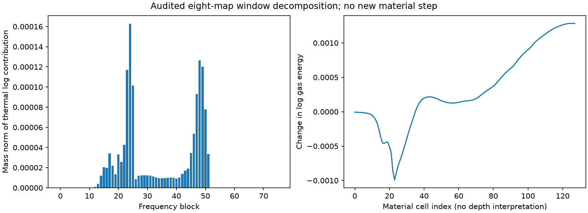

各频率块贡献不是正交向量，不能把柱高平方相加称作总误差预算；各块范数的和只是总范数的上界。56–75尾块的这个上界相对总热范数为 $2.27507\times10^{-8}$，足以说明本次漂移的主要来源不在该尾段。物质索引96–127占热质量平方的88.918%，在坐标映射未经核验前仅报告索引，不能叫深层或表层。

是否继续沿同一条辐射历史外推？用两对已知真实映射构造的线性热敏感度代理，最优外推只预期改善约0.72%，并且没有全域缺陷和正性证据，因此不值得直接投入昂贵验证。这只排除当前代理方向的成本吸引力，不排除其他预条件或更大子空间。

下一次有界试验把每个核心从五块扩成七块，纳入第51块；仍用77577原输入，保持16次Krylov预算，以隔离范围变化。它检验“把原先冻结在核心外的相邻频率纳入求解，能否得到更有效方向”。未入核心的外halo仍冻结，限制点可能继续外移。因此只有局部map，无全域候选或反馈自动授权，也不自动继续扩九块、十一块。它是一次受预算约束的数值试验，不能预先当作解决方案。

CLI草稿实际deepseek-v4-flash[1m]，把“11map、2反馈”连成“11个map2反馈”已纠正；本节也明确电离能项报告的是对数响应范数，不是以erg/g表示的能量。所有新图已目视检查，数值以独立审计和归档哈希为准。

## 49. 扩大局部求解范围之后，先确认得到了什么

78052把两个核心各从五个自然频率块扩大到七个：21–27和45–51；每块128组，因此每个核心896组。物质背景、原辐射输入与16次Krylov预算保持不变。结果是两个核心的L2缺陷分别降到原来的31.62%和11.76%，最大绝对缺陷降到41.42%和15.97%。这说明在指定核心内得到有限改善方向；它没有测量核心外的响应，不能排除先前全域检验中出现的外侧最大缺陷上升。

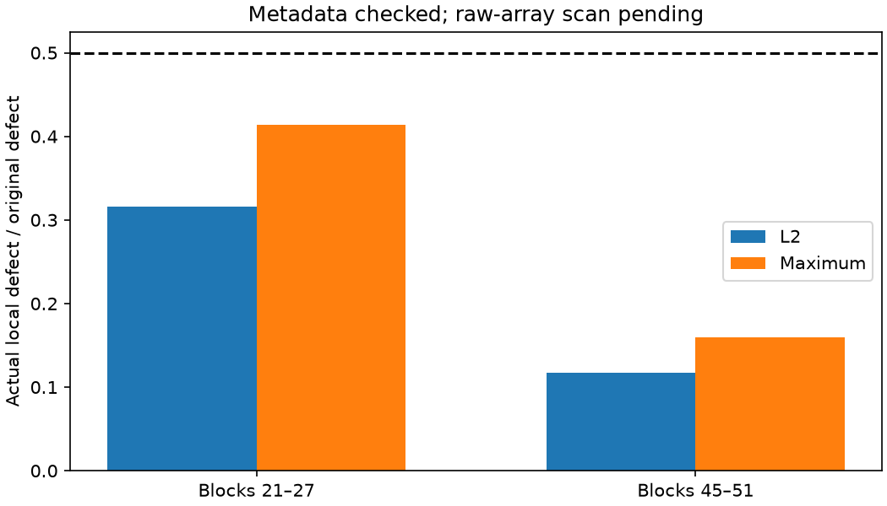

两组GMRES仍未通过线性收敛审计，16次预算已经用完。局部改善与线性收敛是不同命题：前者比较两次缺陷范数，后者要求达到预先声明的线性容差。现在只掌握前者。尤其不能把该候选直接作为可用于观测的大气强度。

48核心的警告发生在非负步长上界计算。对负方向分量，允许步长上限是当前非负强度除以方向绝对值；方向极小时，上限可能大到浮点数无法表示。这样的正无穷上界通常不限制步长，真正限制的是所有分量上限的最小值。代码要求最小上界有限且正，本次最终采用步长1。因此这个具体警告不能单独证明物理强度溢出；同时，候选最小值为正也不能排除其他位置存在异常，必须检查全部数组。

因此先用学校默认4核扫描原始数组，Mac只接收1792行统计并独立归约。该扫描验证数组、范数和来源，不重新求解转移算子。只有扫描通过，才进入32核真实全域映射。全域映射和反馈仍可能拒绝此方向。当前20个物质步被接受，第21步未接受，物理时间没有前进。

本节依据原协议与审计，不依据CLI草稿的猜测。实际草稿模型为deepseek-v4-flash[1m]；其只看摘要而未确认迭代上限的保留意见，已用冻结协议补全。

## 50. 全步失败而半步通过，改变了哪一个决策

78104用相同物质背景真实计算了七块修正的全步和半步。全步的L2缺陷比为0.322737，最大缺陷比却是1.073345；半步分别为0.646003和0.707114。每个比值都相对原场的同一种全域范数，不是某一局部块自行归一化。全步大幅降低平方和，却在一个地方产生比原最坏点更大的缺陷，因此严格最大非增门拒绝它。半步则在这两个指标上都改善。

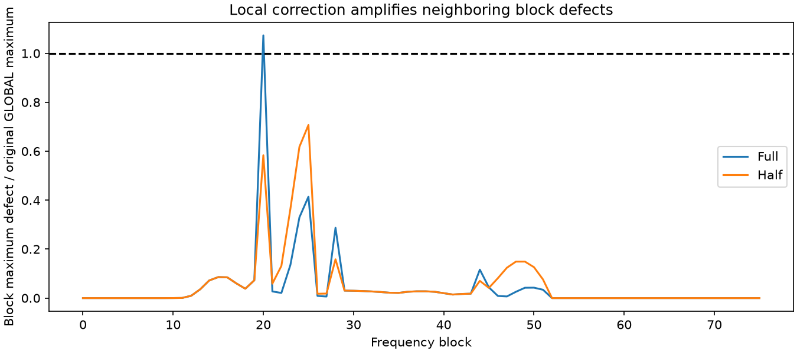

最坏全步位于核心外第20块。它的输入没有修改，但转移算子包含频率间耦合，故输出仍会响应相邻核心变化。“未改输入”是候选构造约束，不是输出不变的物理定律。当前最大值来自group2656起的32组统计，尚不知道精确最差频点、方向和深度，不能把slab起点冒充坐标。

这与五块全域试验有一个关键差别：五块时全步、半步最大门都失败，此次七块半步已实际通过。因此无需继续靠扩大范围赌边界消失。先固定当前方向，检查步长的可用区间。定义原输入和真实输出为x、y，七块候选与其真实输出为q、v；原缺陷r=y-x，缺陷方向d=(v-q)-r。在本方向仿射近似下，各点缺陷随数值步长t成为r+t*d。逐点要求其绝对值不超过原全域最大值，就能得到所有点共同允许的步长上界。该限制保留核心外的响应，不隐藏最坏点。

三遍只读扫描分别求二次型和边界统计、精确约束点、最终浮点组合复核。采用上界与L2最优步中较小者的90%，且要求至少20%的L2收益。这里t是辐射迭代的数值系数，不是物理时间步。独立半步仿射偏差相对原L2约1.53e-10，支持尝试这一预测；仍不能代替新候选的真实算子与物质反馈。

本次2map、0反馈、0新物质接受。CLI草稿把半步叫“已接受”已纠正：辐射门通过只是一个前置检查，接受物质步还需要后续物理域、反馈稳定和外层残差判据。现阶段仍20个已接受步，第21步未接受，没有整盘自洽强度。

## 51. 把最坏点约束变成一个明确的数值步长

78130在四个既有真实场上扫描了三遍，没有新解转移方程。全点共同允许上界为 $U=0.9250974045811835$，L2二次型的无约束最优系数为1.3309633962275913。后者超出允许区间，不能采用。预先规定保留10%的系数裕量，故实际待验证系数是 $t=0.9U=0.8325876641230652$。

限制点的零基索引为频率2687、角度31、深度3481，属于核心外第20自然块。该点原缺陷 $r=-1.0131641325385188\times10^{-8}$，沿单位系数的缺陷变化 $d=-1.0539121084781472\times10^{-7}$，原全域最大绝对缺陷 $M=1.0762877694636686\times10^{-7}$。因为 $d<0$，增加系数使该点更负；要求 $r+td\geq-M$，得到 $t\leq(M+r)/(-d)$。不是把负号当作改善，也不是随意缩小物理时间步。

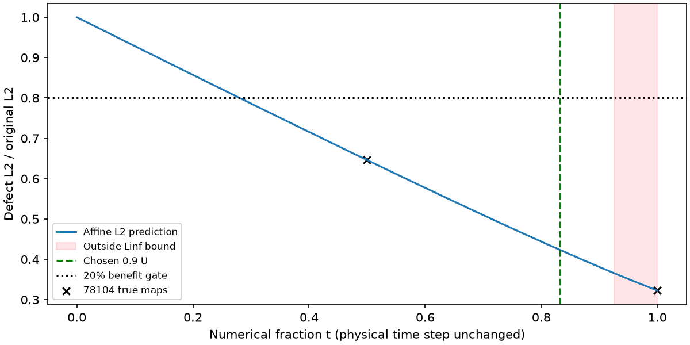

蓝线是两个真实端点所确定的仿射缺陷预测及其二次范数。黑叉是78104曾实际计算的半步和全步，仅为这两个位置的验证；原零系数场的映射也已存在。红区超过最大缺陷约束。选定系数的预测L2比为0.423084，预测最大比为0.909414；10%的系数裕量没有变成10%的最大缺陷改善，实际预测改善约9.06%。第三遍对真实浮点数组组合检查，与二次式相符，但没有调用新候选的转移算子。

Mac校验了归档、代码声明、301片归约和精确约束点，学校受审程序则扫描了所有频率、角度和深度。两者证据范围不同：不能把Mac小统计审计说成独立重扫大场，也不能因此抹去已经完成的交叉审计。预测场最小值为零，满足非负门；未用floor修补。

下一次32核作业将实际计算这个系数及其半步，检查真实缺陷与预测的相对差不超过1e-6，再决定是否进入两轮物质反馈。最终仍要检查相隔八张map的响应是否稳定，不能从57.7%的预测辐射L2改善推导物质残差必然改善。接受物质步仍20，物理时间不变。

CLI草稿中将负的方向比称为“降低97.9%”、将检查范围缩减为标量、忽略原零系数映射，均已纠正。草稿模型实际为deepseek-v4-flash[1m]，计算证据以审计工件为准。

## 52. 预测收益已经兑现，下一道门仍然独立

78161对系数0.8325876641230652的新输入重新调用真实转移算子。实际L2比0.4230840972978981，最大缺陷比0.9094135059654579，分别与此前预测仅差约2.04e-13、1.77e-11的相对量。这里比较的是新算子输出与原端点插值的预测，不是重复归约同一份数组，因此支持当前方向上仿射近似的准确性。它不提供到未知精确解的误差界，也不证明所有物质背景都同样适用。

新输入的半步另算一张真实映射，L2比0.704333、最大比0.756147。全步的L2更好，半步的最大缺陷更好，并不矛盾：全步降低了核心内更大范围的平方和，却使核外第20块的最大值高于半步。两者都低于原全域最大值，因此都满足最大非增门。协议事先按全步候选执行，不在看到两个指标排序不同后改选看起来更漂亮的一项。

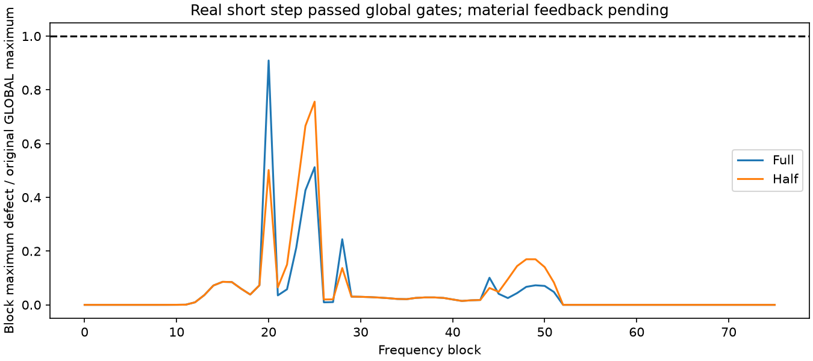

Mac核对324个文件、724条代码声明和152份worker回执，独立归约301片及76自然块的最大值与边界量，13门通过。Mac没有重读完整大场或求解原算子；归档哈希、学校受审计算与Mac独立小统计构成不同层次的证据。

接下来的问题是辐射场变化经过率与净加热积分后，是否让物质响应继续明显变化。作业按原规则继续首轮双端点反馈；首轮过门后才再推进八张控制映射并比较第二轮。第一轮相对77577的变化是初值位移，不能充当八张漂移。即使这两个窗口稳定，还须检查真正的外层物质残差，不会自动接受第21步或得到整盘自洽强度。

只读CLI草稿实际deepseek-v4-flash[1m]，其首阶段限定与数值经核对无误；正式讲义补充了不同范数排序的具体来源，而非仅说“不同范数可以不同”。

## 53. 辐射缺陷下降之后，为什么还要刷新局部方向

78161已完成11张真实映射和两轮反馈。它回答了两个不同问题：首阶段确认七块短步确实降低真实辐射缺陷；后八张控制映射检验这样得到的物质响应是否足够稳定。第二个问题仍未通过。四种端点组合中，质量加权差异除以冻结的r20范数，最大为0.0013228367941778812，高于0.001。L2与最差单元分别为0.000428890和0.000334613，已经在门内，但三个量必须同时满足，不能挑两个通过的量宣布成功。

这里的“稳定”也不是“物质已自洽”。响应稳定问的是继续改进辐射后，物质方程给出的残差会不会显著变动；自洽物质还要求残差本身趋近零。当前final残差的L2、质量加权和最差单元范数仍为8.25738、0.280648和2.70572。把一个非零向量测得很稳定，只是让下一次物质更新有可信依据，并不消灭那个非零向量。已经接受的非线性物质更新仍为20次，本次没有接受第21次，更没有推进20个物理时间步。

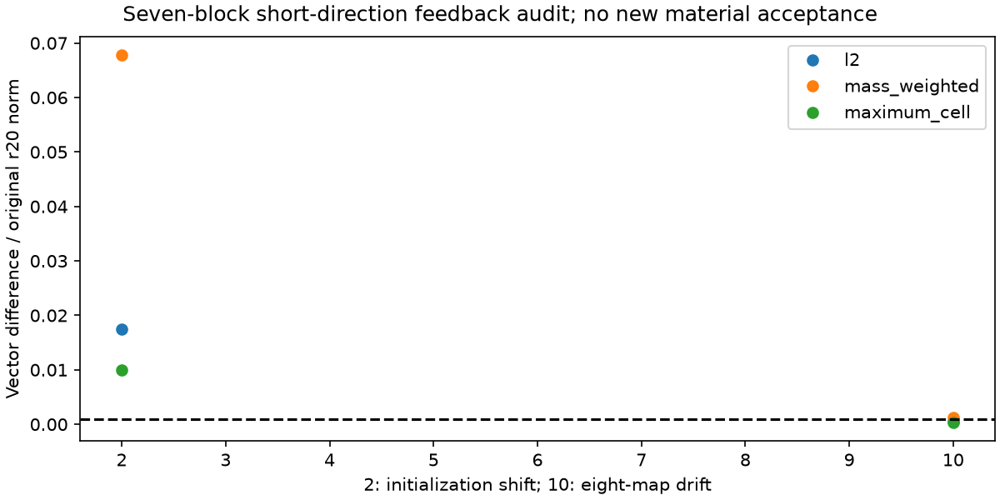

图中的第2张端点与第10张端点不是同一条收缩曲线上的两个误差值：前者比较新初值与旧77577端点，包含一次方向修正带来的位移；后者比较本轮早晚两个反馈对，是八张map内的漂移。七块方案的质量漂移比五块方案小60.1%，也只是两个不同轨迹的窗口比较，不能从它们推算还要多少轮才能得到大气解。

本轮已不再出现早期无正气体热能的拦截。最小气体热能仍有7.03e12 erg/g。剩余响应变化的质量平方有99.987975%来自ln气体能通道。逐块热源账本给出的无量纲热log质量范数是3.46444e-4，电离能变化对应的log项为1.76432e-13，闭合误差约3.10e-16；不能把这三个无量纲量读成能量单位。第24、25、23、49、48、50块贡献居前，高频第56–75块范数和上界只有总热项的5.62e-8，因此旧cold阶段的高频慢尾判断不能照搬到这里。

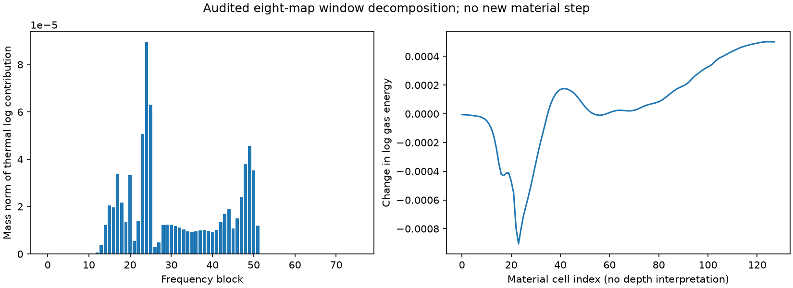

图左每根柱表示一个块的贡献向量范数。不同向量会相消，柱高相加是上界，不是互相独立的误差份额。右图只以单元索引定位；96–127号单元承载82.94%的热质量平方，没有核对对应物理坐标便不能说它们是深层或表层。这些分解说明“哪些输出贡献仍在变化”，尚未证明“哪一种独立物理机制造成病因”。

下一步保持同样的两组七块，但把局部算子的外侧辐射更新到78161第10张真实映射的输入，再求修正。直觉上，局部求解一直把核心外的场当作已知边界；全域经历短步修正和后续映射后，已知边界已经变了，旧边界下求出的方向未必仍适合。因此先重新建立这一条件求解问题，比直接扩大核心范围更容易解释实验差异。

实现上同时核对最新map输入、输出、连续历史和完整SHA，拒绝误用77577旧对；使用固定x20物质和原物理旧时间层，物理dt不变。首先重放局部真实映射，要求与全域归档对应部分逐位一致；这一步失败就停止，不以宽松公差掩盖算子差异。通过后两组各最多16次GMRES迭代，再查真实局部收益、边界变化、非负有限和独立半步仿射性。局部halo只在这一次求解内冻结，不声称得到完整跨频耦合解。

本次探针最多两小时allocation、每worker一小时计算硬限，零全域map、零正式反馈、零新物质接受。硬限是资源保护，不是得到自洽大气的时间估计。局部若通过，还须学校原数组扫描、Mac归约和新的全域真实映射；局部失败则保留失败门研究耦合结构。不能用越来越宽的核心、裁剪或物理dt缩短替代这些判据。

只读CLI草稿实际模型为deepseek-v4-flash[1m]。正式文字校正了接受计数的时间含义并补齐单位、范数和因果边界；数值证据来自审计工件。

## 54. 更新外侧场后的局部收益，已经查到原数组这一层

78253把外侧辐射换成78161第10张真实映射的输入，然后在同样两组七块上重新求方向。结果的确有局部收益：核心21–27的L2和最大缺陷降到原来的0.354829和0.426748，核心45–51为0.232354和0.288686。这些比值各自以本轮未修正的局部缺陷为分母，不能与旧初值下的比值拼成连续收缩曲线。16次GMRES用完时info仍为2，线性精度审计未过，因此这里得到的是有限预算下有用的修正，不是精确的局部线性解。

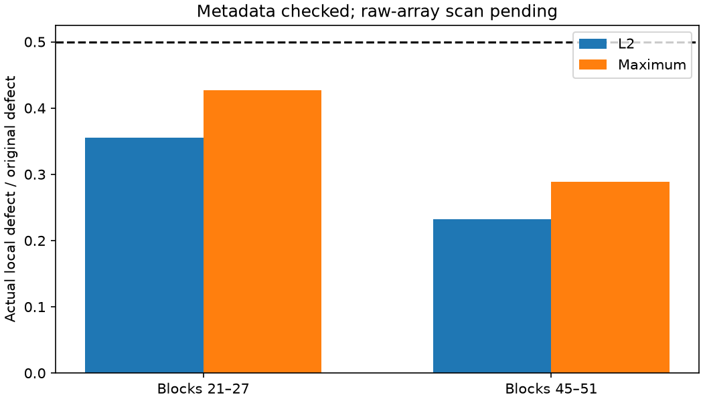

本次核验分三层。第一层，先在新输入上重放真实局部映射，与全域归档相应部分逐位一致，防止换了外侧场却仍拿旧输出作参照。第二层，元数据审计检查13个文件、726条代码声明和worker回执，独立重算九个局部门，核对原物质身份、源SHA和连续历史。第三层，默认4核作业78405直接读取两份实际局部数组与原输入输出，在1792个频率组中逐一检查全部32方向、4096辐射深度的非负有限性、平方和、最大值与最小值，再让Mac归约小统计。

第三层已经通过，用时72.725秒，峰内存5.65e9字节。Mac和学校的小统计一致，最大值完全相同；不同归约路径下旧整数组L2的最大相对差约3.73e-13，在事先声明的2e-11比较公差之内，不需也没有修改公差。这比“文件SHA相同”多证明了一步：文件里的实际数组确实产生报告中的缺陷范数。它仍没有在Mac重新求解转移方程，也没有证明局部方向放到全域之后依然有效。

为什么还可能失效？局部求解固定了核心外的输入，核心内辐射发生变化后，全域映射会把影响传到核外。即使核外输入逐位不动，核外输出也可以改变。于是局部平方和降低和某个邻块的最大误差升高可以同时发生；前者不能抵消后者的失败判决。刷新halo只是使用较新的全域背景重新定义这一条件问题，不能预先说它改善了界面误差或全域收敛率。

还需把一个数值警告与物理异常分开。block48的警告来自正性步长上界计算：某些正比值过大，浮点除法溢出为正无穷。函数随后对所有比值取最小值，并要求该最小上界有限且为正；本次允许完整数值步长1。原数组扫描另行确认了候选与映射场非负有限。因此没有证据表明这条警告意味着辐射场发散，但警告必须保留，不能把全轮描述成“没有warning”。

下一实验把两份局部候选放入78161基场，计算全步和半步各一张真实全域映射。未选输入直接复制，保留极小次正规数；所有频率组的输出都参与判定。L2至少改善20%、最大缺陷及边界量不增、正性和半步仿射性等全部通过后，才继续两对反馈及八张控制map的稳定性检验。第二对反馈与第一对的比较使用冻结r20，不能因为更新辐射基场就替换物质参考。

目前78253及78405没有产生任何新全域反馈，78161的0.001323质量漂移仍是此前未通过的测量值，不能宣称它已经下降。物质接受计数仍为20；局部修正、原数组核验、全域辐射检验、物质响应稳定和物质方程自洽，是依次需要建立的不同结论。只读CLI草稿实际deepseek-v4-flash[1m]，正式文字已修正其把刷新halo称为改善界面一致性、把原数组复核仅称存储校验的过度概括。

## 55. 整体改善为什么仍需缩短数值步长

78411真实全域检验给出了具体失败：L2缺陷降到原来的0.405109，最大缺陷却变成1.124064倍，11项首阶段门中只有全步最大缺陷非增门失败。两张map完成后驱动停止，没有反馈。L2是所有点缺陷平方和的平方根；大量点变好可以降低它，同时另一个点变差。因此两种范数并不矛盾，也不能相互抵消判决。全步和半步都是实际转移算子算出的结果；半步最大比0.713374通过，说明可以研究同一方向上的较短数值步。

先明确三个不同的量。原辐射输入是 $x$，本次局部修正拼入全域后的输入是 $q$，固定物质的转移映射是 $T$。原缺陷 $r=T(x)-x$；沿候选方向产生的缺陷变化是 $d=[T(q)-q]-r$。这里的 $d$ 是缺陷变化，不是输入修正 $q-x$。如果这一方向上的映射服从仿射近似，输入 $x+t(q-x)$ 的缺陷预测就是

$$
r(t)=r+td.
$$

78411独立半步偏离仿射预测的最大量，除以原最大缺陷约为9.15e-10。这支持用仿射模型筛选本次方向，不提供未知真解的严格误差界；新步长仍要实际求解。半步安全而全步失败也不说明算子非线性增强，在线性的 $r+td$ 中就能发生。

令 $M=\max|r|$。对每个频率、方向和深度，要求 $|r_{i}+td_{i}|\le M$，再与 $0\le t\le1$ 相交。78516的4核任务读取原场、实际完整候选及其真实输出，找到共同上界 $U=0.8753675285351291$。最紧限制点为零基数组索引(2687,31,3492)，频率属于第20块，位于修改输入的七块核心之外。这个点的 $r_{i}=-6.82733\times10^{-9}$、$d_{i}=-5.28371\times10^{-8}$ 同号，所以沿正步长其负缺陷绝对值增长；并没有符号翻转，也没有“灵敏度接近零”的证据。核外输入逐位不变，但频率耦合使核外输出受到核心修正影响。

只优化平方和时，最佳系数为 $-\langle r,d\rangle/\langle d,d\rangle=1.48448$，超过可行区间。按事先规定的10%数值余量，最终取

$$
t=0.9\min\left(-\frac{\langle r,d\rangle}{\langle d,d\rangle},U,1\right)=0.7878307756816162.
$$

10%余量是已声明的数值选择规则，不是物理耗散或真解误差保证。第三遍全场浮点组合预测L2比0.5200968554、最大比0.9128625462，九项筛选门通过。候选的部分强度可以恰好为零，守卫要求非负且有限，没有用floor把零抬高。

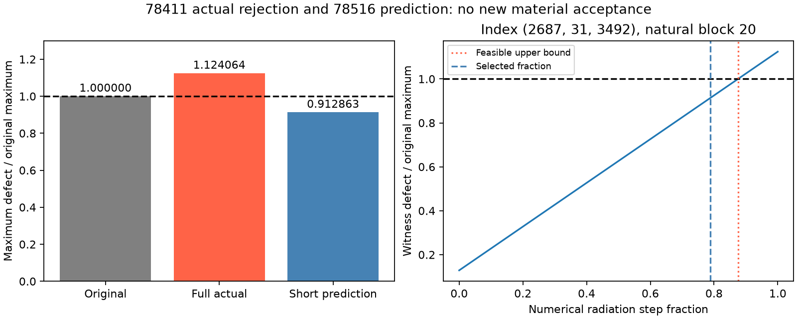

左图红柱是78411实测，蓝柱是78516预测，不能混称新真实映射已成功。右图只画决定上界的那个限制点，不代表每个步长下全场最大值都落在它上面。Mac核对3文件、729代码声明、301片独立归约和精确限制点，学校执行所有点的约束及第三遍扫描；Mac没有重读大场或重解算子。扫描用时5分42秒、峰约610MiB，不需要把四个CPU当成四个数值worker。

这里还有一次明确的程序错误：此前78513把资源检查函数的worker参数误传为4，触发26GiB内存要求，在读场前退出。修复版仍申请4CPU16GiB，实际一个扫描进程，另外核验CPU数；保留失败日志和旧源码，未改变科学门。它与科学判据失败是两类不同事件。

下一实验保持本次系数，在32CPU128GiB上先计算短步及独立半步的两张真实map；所有门通过后才接第一对反馈，再接八张控制map与第二对反馈。最多11map、两反馈，4小时为硬上限而非大气完成时间。第二对相对第一对的四组合三范数变化，均须除以原r20并小于0.001。物理dt、物质x20和r20始终固定；20次接受是非线性物质更新，不是20个物理时间步。即使响应窗口稳定，非零物质残差仍须另行求解。

只读CLI草稿实际为deepseek-v4-flash[1m]。其中把同号缺陷写成符号翻转、以半步和全步差异断言非线性、引入无证据的低灵敏度、混淆实测与预测，以及写出dt/r20关系，均已独立纠正；上面推导来自真实记录与公式，不采用这些解释。

## 56. 从预测走到真实映射之后，究竟新增了什么证据

78548先完成短步和独立半步两张真实映射。Mac独立核对324个文件、730条代码声明、152份进程回执，用301片平方和重算L2，并把全部76个自然频率块的最大值与原场、新短步及半步的真实map回执交叉核对。13项门全部通过：短步L2比0.5200968554386884、最大比0.9128625462222164；相对78516第三遍预测的差分别只有2.36e-13和3.58e-11，远低于事先规定的1e-6。

这比“代码算出的两个数字一致”多证明一步：本次有限的辐射修正确实把真实算子缺陷的L2降低47.99%，把最大缺陷降低8.71%。先前78411完整数值步的最大缺陷增加，现在已用同一方向上的较短步解决。这里的“完整数值步”是该方向系数1，不是一个物理时间步；当前系数0.78783也没有缩短物理dt。仍不知道距离未知真解还有多少，因为相邻映射的缺陷与真解误差不是同一个量。

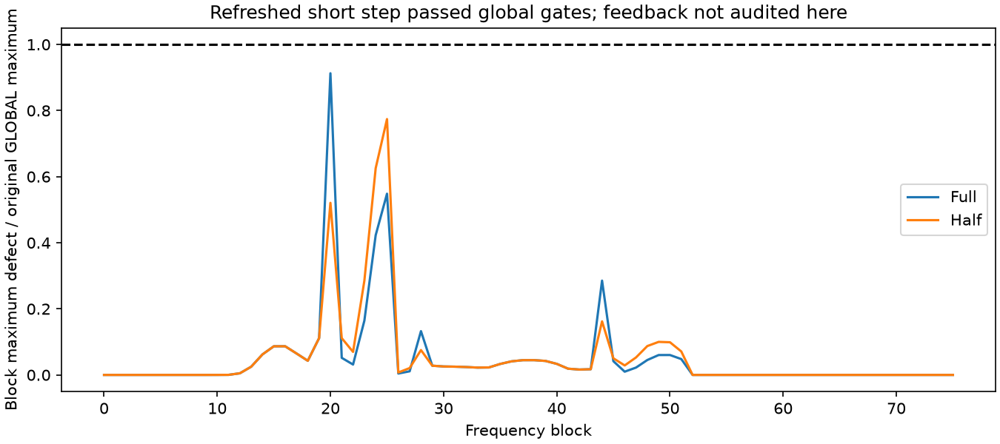

图中每块最大缺陷都除以原场的全域最大缺陷，横虚线为原最大值。短步最高峰在第20块，低于1；半步的最高峰在另一块。因此不能把“半步的最高点更低”解释成每个块都同等改善。核心外输入逐位保持，但其输出因全域耦合而变化，图中的核外峰并不违反这一输入约束。

接下来区分三个问题。第一，辐射缺陷是否变小并通过既定检验？本次已经给出肯定的实验结果。第二，在固定物质x20上继续改善辐射后，率、净加热和物质响应是否还明显漂移？这要等正式反馈与八张map间隔的窗口比较。第三，物质响应残差本身是否接近零？即使第二问通过，一个稳定的非零残差仍需进一步的外层物质更新。固定x20并不妨碍计算新的物质响应残差；它只表示输入物质不变，不表示输出残差必然不变。

首阶段归档里“反馈对为0”只描述归档时点，不能据此断言运行中的78548还没有开始反馈。作业按协议已经进入第一轮；原七门和正气体热能域通过后，才继续后八张控制map与第二对反馈。第一对相对78161的差包括初值位移，第二对相对第一对的四种端点差，才用于判定八map漂移。所有差都除以冻结的r20，而不是用一个更大的新残差稀释比例。

本次进程回执未见失败或资源越限，峰worker约3.419GiB、父进程约2.21e9字节，读取时父stderr为空。Mac只独立重算小型统计和身份关系，没有重读所有大场或重解转移方程。学校的全点检查、真实映射与Mac的独立归约共同构成证据；不能把其中一层写成另一层已经执行。

只读CLI草稿实际deepseek-v4-flash[1m]。正式文字补充实际缺陷收益，限定“反馈为0”的归档时点，并纠正“没有新物质更新便没有新物质残差证据”的推论。物质接受仍20次、物理时间不变；本节没有宣称代表柱自洽或整盘强度已经得到。

## 57. 反馈窗口终于过门，为什么物质问题还没有结束

78548在1小时21分20秒内完成11张map和两对反馈。第2张之后的反馈对与第10张之后的反馈对，间隔八张完整映射。取前后两对的previous/final四种组合，对完整128层四分量向量作差，再除以冻结r20的对应范数；四组合最坏的L2、质量加权、最差单元比值分别为0.000176676、0.000509926、0.000148133，全部低于0.001。这一次内层辐射的改善终于产生了满足原诊断尺度的物质响应稳定窗口。

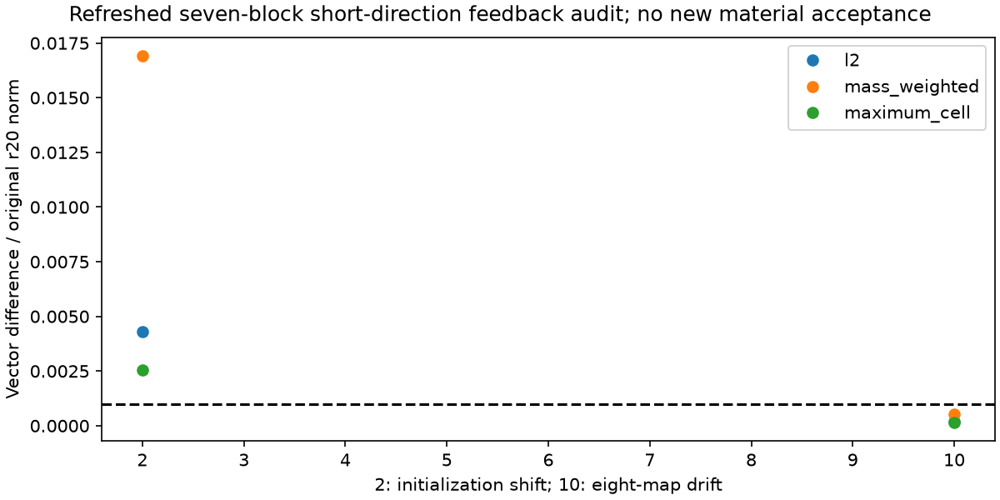

图左的2对应短步初始化后相对78161的位移，图右的10对应本轮八张map漂移，两者不是同一误差随时间下降的两个点，不能拟合收缩率或完成日期。此次独立审计覆盖3545文件、836个map进程和304个反馈进程回执，核对逐块反馈汇总、能量账本、物质身份和全部窗口组合。两轮原七门通过，四端点最低比气体热能约7.026e12 erg/g，仍为正。

为了理解“稳定但还没解完”，把当前物质响应残差记为 $R$，旧接受20时保存的响应残差记为 $r_{20}$。第一种量是当前残差本身的范数：L2、质量加权、最差单元分别为8.260386、0.282071、2.705712。这些值显著非零，物质输入与方程响应尚未一致。第二种量是 $R-r_{20}$ 的向量范数，依次为0.975956、0.102145、0.131268，表示在同一物质x20上改进辐射以后，计算出的响应已经偏离旧记录多少。第三种量是两对新反馈之间的向量差除以原r20范数，即本次过门的三个窗口比值。第一、第二、第三种量分别回答是否自洽、旧记录变化多少、近期是否稳定，不能互换。

尤其要注意，第二种量的质量范数约为原r20质量范数的39%。这不等于两个质量范数相差39%，因为向量方向也可能改变；更不能将其写成“当前物质残差只有0.102”。旧r20仍是保存的接受基准，本轮没有覆盖它。要判断下一条物质方向，必须保留这份历史差异和同期可信的控制反馈，不能换一个分母让过去失败的候选重新通过。

一次八张窗口过门还没有测到更长跨度的累计变化。下一实验直接从78548末映射后继继续固定x20，最多16张新map，在8、16张各做正式反馈。每个八张窗口必须按同样四组合、三范数、原r20尺度过门；此外，第16张反馈相对78548末反馈的累计漂移也必须过同门。原因可用一个简单例子说明：第一段变化0.0006，第二段同向变化0.0006，各段都小于0.001，但累计0.0012已经超过。因此只看逐段不足以排除缓慢的同向累积。

首段失败就停止，第二段和累计条件不是无限加算力的借口。两个窗口及累计通过之后，得到的仍是有限区间内的持续性见证，不能据此给未知真解写出严格误差上界。此后应在更可靠的控制辐射下重新测量物质方向的有限响应和噪声，再按原规则检验候选；本轮确认任务本身不写新物质候选、不接受第21次更新、不改物理dt或r20。

只读CLI草稿实际deepseek-v4-flash[1m]，开头曾将 $R-r_{20}$ 的L2约0.976用于说明残差自身非零，正式文字已改用 $R$ 自身的三个范数；同时保留四组合最坏值，而非只挑最后端点对。这次进展缩小了数值诊断的不确定性，尚未产生自洽代表柱、完整大气表或整盘观测强度。

## 58. 窗口确认通过之后，把计算重新用在物质方程上

78594用1小时24分35秒完成16张新map和两对正式反馈，Mac独立核对4296文件和1520个进程回执。两轮原七门全部通过，所有响应仍有正气体热能。每八张窗口的最坏质量加权漂移分别为0.000508796、0.000502919；累计16张为0.000954091，低于0.001门但只余4.59%裕量。L2的累计最坏比是0.000264409，不能把质量项的0.000954写成L2。

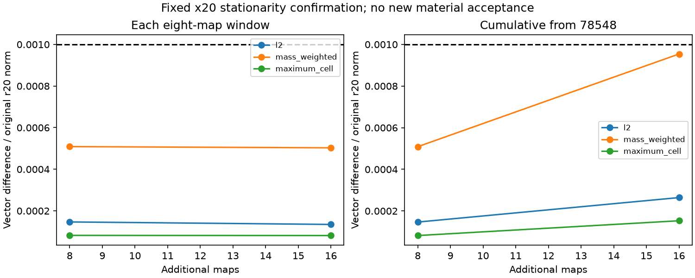

左图说明每段漂移过门，右图说明它们仍在累积。两段质量漂移几乎一样大，因此不能从“都通过”推出误差快速趋零，更不能按本轮速度预测大气完成时间。这轮只完成了事先限定的持续性确认。继续无止境地做相同控制map，会绕开尚未解决的物质方程。

把固定物质输入记为 $x$，给定数值辐射态后计算出的完整物质残差记为 $R(x)$。最新控制的残差三范数仍为8.260397、0.282133、2.705710，显著非零；改进内层没有直接解决外层。下一实验保持已接受物质 $x_{20}$、原残差 $r_{20}$ 和物理旧时间层不变，分别取原方向的热能分量与布居分量。把其中一条方向记为 $d$，数值幅度固定为 $\alpha=1/256$，试探输入为 $x_{20}+\alpha d$。这不是把物理时间步缩短为1/256。

控制和两个试探均从78594最新映射后继出发，在各自固定物质下做8张和16张map，再计算正式反馈。对照先过原门才继续方向。所谓同龄，指三组经历相同次数的映射，而非在相同钟表时刻输出。共同初值减少初始化历史差异，但物质一变，辐射算子也变；它不能保证三组误差相同或相减后消失。

每组反馈有previous和final两个端点。取候选端点 $a$ 和控制端点 $b$，定义

$$
S_{a,b}=R_{a}(x_{20}+\alpha d)-R_{b}(x_{20}).
$$

四个组合全部保留。必须先对128单元四分量向量相减，再计算L2、质量加权和最差单元范数；两个残差即使范数相同，也可能方向完全不同。$S_{a,b}/\alpha$ 是这一有限幅度下的方向响应，既含有限步长效应，也可能含两组不同的辐射误差，不能直接称为精确Jacobian作用。

可分辨性检查分两层。第一层把候选自身两个端点之差的范数，与控制自身两个端点之差的范数相加，再除以四个 $S_{a,b}$ 中最小的相应范数。第二层将第16张的四个信号与第8张的四个信号作全部16种向量差，取最大范数，再除以当前最小信号范数。每层三种比例均严格小于0.1才标记其通过；零信号直接记为不可分辨，不用floor造一个分母。这是观测到的散布和持续性诊断，不是未知真解的误差上界。

本批最多48map、6对反馈，8小时是资源硬限。它同时报告原16项接受门和相对同期控制的四组合收缩；即使测到清晰下降方向，也不自动把接受数20改成21。还需独立审计、确定候选和同态确认。原r20始终保留，不能把新控制覆盖过去的记录来使旧失败候选过门。

平台CLI草稿实际为deepseek-v4-flash[1m]。正式文字纠正了门数、范数列和“精确消除共同背景”的断言，并明确：学校已计算物质响应，Mac只审计其小工件，没有再解ODE或全场转移。现在取得的是更可靠的下一次物质诊断起点，尚未得到自洽代表柱或整盘观测强度。

## 59. 热能方向有清楚的信号，为什么仍然不能接受

78950的热能方向首轮八张map和正式反馈已完成。独立审计4309个文件、1216份map进程回执和304份反馈回执后，确认原16项门只通过13项：L2、质量加权、最差单元三个收缩门全部失败。气体热能保持为正，率、加热和原内层噪声门通过。因此这一轮遇到的是残差没有按接受规则共同下降，不能再用先前“目标热能为负”的解释代替当前诊断。

先把两个参照说清楚。原接受20时保存的残差是 $r_{20}$；当前固定物质重新算出的控制残差是 $R_{\mathrm{control}}$；沿热能分量作1/256数值试探后的残差是 $R_{\mathrm{thermal}}$。这是同一物理时间步内的三个记录，1/256没有改变物理dt。以下列出final端点的两种比值：

| 范数 | 热能/原r20 | 热能/同期控制 |
|---|---:|---:|
| L2 | 1.002450 | 0.991719 |
| 质量加权 | 1.068988 | 0.992253 |
| 最差单元 | 1.003179 | 1.002916 |

前一列三者都大于1，所以原三个收缩门失败；后一列前两者小于1，说明热能方向相对同期控制确实减少了总体及质量加权残差，但最差单元仍增加。这两个结论能同时成立，因为当前控制本身也已偏离旧r20。控制是固定物质的稳定性实验，检查原七门及漂移窗口，不能将它误判成一个失败的有限物质候选。旧r20不能被新控制覆盖，两种比较回答的是不同问题。

正式判断使用previous/final全部四组合，并非只选表中final比值。四组合给出的L2改善范围为0.803%至0.828%，质量加权改善0.736%至0.775%，最差单元增加0.292%至0.293%。在端点选择范围内，这三种变化的符号都没有改变。

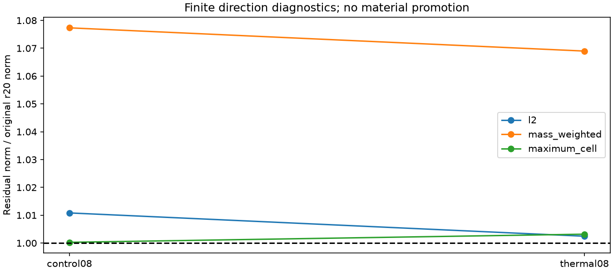

再问：这些变化是否只是内层辐射尚在变化造成的？本节沿用上一节的完整向量信号 $S_{a,b}$。四组合最小信号范数依次为0.168430、0.00702735、0.0648985；候选与控制各自端点散布之和除以相应最小信号，得到0.041079、0.045007、0.040228，均小于0.1。于是按已声明的端点标准，信号可分辨。它只限制这对端点观察到的散布，不能证明更慢的漂移已消失；第16张相对第8张的全部16种信号差仍要另验。可分辨也不等于下降：一个清楚的上升方向同样可以测得很准。

最差单元还提供一个容易误读的细节。控制的最大值在零基编号2，热能试探的最大值在编号1，两个反馈端点均如此。各自最差单元中，气体能编码分量贡献残差平方的88.76%与83.30%，HeIII/HeI编码分量贡献8.53%与13.37%。由于比较的是两个不同单元，不能说“同一层的氦残差因加热从8.53%升到13.37%”，也不能把未核几何对应的编号解释成某个物理深度。此处证明的是最大值所在单元发生改变，还没有解释其微物理成因。

下一步继续原预算内的布居方向和16map持续性检查。若两个方向的信号都稳定，才研究能否组合出三个范数共同下降的方向，并对具体候选重新做真实反馈和同态确认。有限方向失败不证明模型无解；当前接受仍是20次非线性物质更新，不是20个物理时间步，也尚无自洽代表柱或整盘强度。

本次Mac审计另有一个独立程序缺陷：有限方向的比较数组不能直接写JSON。保留报错后仅将这些数组转为列表，严格非有限值检查和所有科学门不变；新增真实工件序列化回归，38项测试及本次完整审计通过。学校数值任务没有因此重跑。只读CLI草稿实际deepseek-v4-flash[1m]，正式文字纠正其对控制门的混用，明确最小信号的定义，并补上四组合与不同最差单元的解释边界。

## 60. 同一个布居试探，为什么一项噪声检查通过，另一项没有通过

布居方向首轮八张map提供了与热能方向不同的结果。相对同期控制，previous/final四种组合的三个残差范数全部下降：L2下降0.184%至0.202%，质量加权下降0.376%至0.408%，最差单元下降0.0569%至0.0594%。这些是完整物质残差的范数，不是辐射强度或物质响应本身的幅度。两个向量范数接近，也不单独证明向量彼此接近；方向差要通过完整向量相减来测量。

相对原r20，布居final的三个范数比却为1.008961、1.073268、0.999692。因此原16项门仍有L2和质量加权两个收缩门失败，另外14项通过。同期下降与历史门失败并不冲突，上一节已经说明两种参照的区别。新问题是：原内层噪声门通过，而本批新增的方向可分辨性门没有通过，这是否自相矛盾？

把候选的previous和final残差向量写成 $P_{p}$、$P_{f}$，控制对应写成 $C_{p}$、$C_{f}$。它们都是128单元、每单元四分量的编码残差，不是物质状态本身。原内层噪声门只有一个L2比值：

$$
\eta_{\mathrm{old}}=\frac{\|P_{f}-P_{p}\|_{2}}{\|P_{f}-r_{20}\|_{2}}.
$$

本次分子为0.00686585，分母为0.943450，比例0.00727738，小于0.1。新增诊断同时计入控制自身的端点变化，并用候选相对同期控制的信号作分母：

$$
\eta_{k}=\frac{\|P_{f}-P_{p}\|_{k}+\|C_{f}-C_{p}\|_{k}}{\min_{a,b\in\{p,f\}}\|P_{a}-C_{b}\|_{k}}.
$$

这里 $k$ 依次代表L2、质量加权、最差单元三种范数。新增L2分子为0.00686585加0.000112834，分母仅0.0644471，比例变成0.108285。质量加权和最差单元比例为0.103484、0.0945865；要求三者都严格小于0.1，所以整体不通过。两个定义的分子、分母和检查范数集合都不同，不能把它说成临时把同一阈值收紧，也不能凭这个差别宣布原公式有程序错误。

分母为何差这么多，可以用一个精确向量恒等式说明：

$$
P_{f}-r_{20}=(P_{f}-C_{f})+(C_{f}-r_{20}).
$$

右边第一项是同期方向信号，L2范数0.0644471；第二项是控制与旧记录的偏移，范数0.977275。原分母把这两种变化混在同一向量里。范数不按此式直接相加；三角不等式只给出原分母介于0.912828与1.041722之间，实测0.943450落在其中。由此可见，原检查中的大分母包含了较大的历史偏移，不能把0.00728解释成“布居扰动信号的噪声只有0.728%”。候选自身端点散布仍约0.00687，而同期方向信号要小得多。

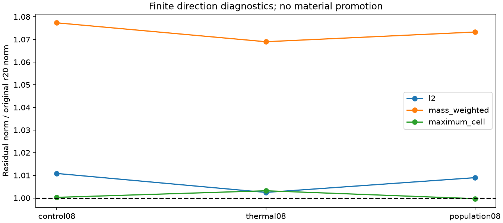

图中三个横坐标是不同实验，不是一条物质迭代轨迹。新增可分辨性门失败也不意味着观测到的下降必然会反转；准确结论是当前证据尚未达到预先要求的信号稳定程度。它既没有严格界定真实误差，也没有证明有限差商就是精确Jacobian。下一步保持原候选继续到16张map，比较当前和首轮的全部信号组合；没有通过之前，不根据这批差商选混合权重并宣称取得共同下降方向。

本次Mac独立审计6461文件及2280份进程回执，核对完整反馈、能量账本和候选身份；两端点最低比气体热能约6.85e12和6.87e12 erg/g，保持正值。没有新增物质接受；已有20次接受是同一物理步中的非线性更新，不是20个物理时间步。物理dt、原r20和科学门均保持。该结果仍不足以判断模型无解或给出整盘强度的完成日期。

只读CLI草稿实际deepseek-v4-flash[1m]。正式文字纠正了把残差范数称响应幅度、由范数接近推断向量接近、在三角不等式中把0.064447同期信号误换成0.006866端点散布，以及把16张map误写成“16门映射”等错误。文中两套比值与向量分解均重新对照实际数组计算，并保存了输入SHA。

## 61. 控制累计16张通过，给方向检验提供了什么条件

78950的控制组已完成16张map和两对正式反馈。Mac对8603个文件及3040份进程回执独立审计后，确认第二轮原七门、正气体热能、相邻八张窗口和累计16张窗口全部通过。仍按四种previous/final组合取最坏值，并始终用原r20归一化：

| 残差向量差的范数/原r20范数 | 第8至16张窗口 | 累计16张窗口 |
|---|---:|---:|
| L2 | 0.000121297 | 0.000234685 |
| 质量加权 | 0.000473481 | 0.000909978 |
| 最差单元 | 0.0000767184 | 0.000147527 |

累计质量项最接近0.001门，剩约9.00%的门裕量。这个百分比只表示诊断值距阈值多远，不能解释成距离未知真解尚差9%。首段八张的质量漂移0.000490227，第二段0.000473481，仅略有下降；因此本轮支持有限跨度内的控制稳定性，没有证明误差快速衰减，更不能给整个大气问题外推完成日期。

当前控制残差 $R$ 本身的三范数仍为8.260482、0.282197、2.705710。上表度量的是控制残差在两个窗口之间改变多少，这三个较大的数度量的是当前物质输入与方程响应相差多少。前者变小不强制后者趋零；固定点残差也不自动等于到未知解的状态误差。本轮没有新的物质接受，20仍是同一物理步内累计接受的非线性物质更新次数。

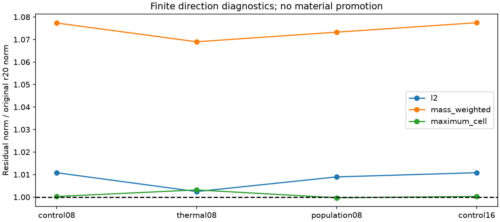

图的四个横坐标混合了控制、热能、布居实验及不同窗口，连线只帮助辨认同一范数，不能据它拟合一条收敛曲线。当前控制通过，意味着按已声明规则可以继续thermal16和population16的信号持续性测量；两个方向自身仍须通过各自端点检查和第8至16张的跨窗口检查。它不能代替原16项接受门，亦不能提前把第21次物质更新计为接受。

三个实验共享数值辐射初值，并分别经历相同次数的映射，但改变物质同时改变辐射算子，所以不同实验的数值误差不保证相等或相减后消失。Mac没有重解ODE或生成大辐射态；本节证据来自源身份、逐块反馈与能量账本核对，以及完整残差向量的独立归约。物理旧时间层、物理dt、x20和r20保持不变。

只读CLI草稿实际deepseek-v4-flash[1m]。正式文字将含混的“归一化差值”明确为完整向量差的范数，区分固定点残差与真实状态误差，并将无关的“20不是新增自由度”改为与物理时间步的区别。

## 62. 端点散布降下来了，为什么方向仍未通过持续性检查

热能方向第二轮16张map之后，相邻端点的表现明显改善，但还没有满足跨窗口要求。这里同时存在三个判决：原16项接受门仍13过、三个收缩门失败；当前端点可分辨性通过；第8至16张信号持续性未通过。原16门是在判热能候选，不是在重新判旧r20，也不是把接受计数20或21当门数。

| 方向信号诊断 | L2 | 质量加权 | 最差单元 |
|---|---:|---:|---:|
| 第8张端点散布/当轮最小信号 | 4.108% | 4.501% | 4.023% |
| 第16张端点散布/当轮最小信号 | 0.508% | 0.903% | 0.311% |
| 两轮16组合最坏变化/第16张最小信号 | 10.567% | 12.507% | 9.184% |

阈值始终为严格小于10%。第二行回答同一对反馈端点在本次方向信号尺度上相差多少；第三行回答两轮方向信号改变多少。端点差小不要求它们与八张map之前的信号接近。两轮端点比值的分母各用当轮最小信号，跨窗口比值用本轮最小信号；这些有限区间指标都不是到未知真解的严格误差界。

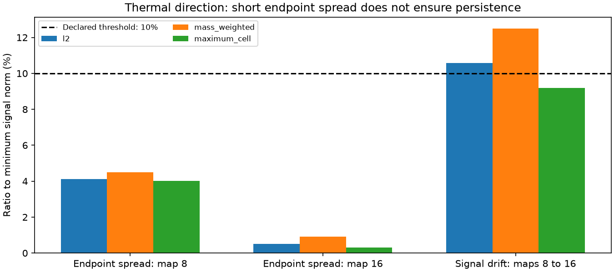

失败是否只是控制仍在漂移？把固定热能候选的物质残差记为 $P$，固定控制的残差记为 $C$，信号为 $S=P-C$。对任意已声明的两轮端点组合，有

$$
\Delta S=\Delta P-\Delta C.
$$

最坏L2组合中，候选变化范数0.0193023，控制变化0.000770975，实际信号变化0.0191266。候选变化约为控制的25倍。最坏质量组合的对应三个数是0.000976353、0.0000964606、0.000957728。必须先作向量差才得到第三个数，不能直接把前两个范数相减当成结果；但三角不等式确实保证

$$
\|\Delta S\|_{k}\ge\|\Delta P\|_{k}-\|\Delta C\|_{k}.
$$

上述L2下界除以当前最小信号0.1810106，质量下界除以0.00765762，仍均大于10%。即使控制变化沿最有利的方向抵消候选变化，这两组也不足以过门。因此控制漂移不能单独解释失败，固定候选自身在这八张map内的辐射和反馈变化更大。候选物质与物理dt没有改变；本分解尚未定位哪一种微物理过程导致这些变化。

还有一个需要保留的细节：若只比较两轮各自的final_vs_final信号，三个比例7.126%、9.018%、4.919%都小于10%。但协议要求当前四个信号与旧四个信号的全部16种组合，最坏L2和质量组合涉及首轮previous端点。不能事后删除这个合法端点或改为只验final，再把失败写成通过。当前端点比首轮稳定，是对近期变化的有用观察；未来另一个窗口是否稳定，仍需它自己的数据。

Mac本次核验10748文件、3800份进程回执及八份响应的向量分解，工件有限、气体热能正，原科学门未改。原批次还在运行population16，没有临时增加map预算。等最后一轮及完整归档审计结束，再判断下一次有界实验需要解决哪一种数值不确定性；目前不选新混合权重，不接受第21次物质更新，也不据此宣称模型无解。已接受20次是非线性物质更新，并非20个物理时间步。

只读CLI草稿实际deepseek-v4-flash[1m]。正式文字纠正了把热能候选门称为“r20原门”、把端点有限散布说成端点重合，以及含混的“二十一式重算”；三角不等式改为明确的必然下界，并把“信号不稳定”限定为本次预声明持续性条件未通过。

## 63. 两个方向的近邻噪声已可分辨，为什么还不能据此选新物质步

78950完整结束，48张map、6对反馈已独立审计。这一轮保持每组物质不变，让辐射继续松弛；不是又接受了48次物质更新。接受数仍为20，第21次尚未接受。

先定义比较对象。固定候选在一次反馈中的完整编码残差向量记为 $P$，同龄零位移控制的残差向量记为 $C$，方向信号为 $S=P-C$。先对512个编码分量作差，再计算L2、质量加权及最差单元范数，不能用两个标量范数相减替代。每个反馈对有previous/final两个端点，候选与控制组合成4个信号。端点散布指标以候选自身前后差范数加控制自身前后差范数为分子，以当轮4个信号中的最小范数为分母。它回答本次相邻端点的变化是否小于方向信号的10%，不回答八张map之后信号是否相同。

布居方向第16张的端点比例是4.596%、5.025%、3.231%，均小于10%。但第8→16张4乘4共16组合中，最坏跨窗口比例为81.331%、76.471%、64.256%，全部失败。最小信号从第8张0.064447/0.003383/0.028380，降为第16张0.040194/0.002152/0.019309。端点更接近与信号随窗口显著变化可以同时成立；不能只凭前者拟合一个稳定Jacobian。热能方向同样在第16张端点门通过，但跨窗口10.567%/12.507%/9.184%，前两项失败。

相对同期控制，布居候选的三个残差范数在全部4组合都略降；相对原r20的接受门却仍有L2与质量收缩失败。这两个结果不矛盾：前者的比较对象是已继续迭代的control，后者是始终冻结的原r20。我们保留二者，不用重新设定接受基准消除差别。本轮目标gas均正，也不能把接受失败解释成已证明模型不存在解。

下一轮只增加一个明确问题：从各自第16张后继态继续，较晚窗口能否满足同一信号尺度下的持续性条件？三个trial及原r20、旧物理层、物理dt和网格完全固定。先依次control、thermal、population各8张；全部通过晚期门，才依次再各8张。任一失败结束，总预算48张新map/6对反馈、8小时硬限。第一组反馈对应来源延续后的第24张，第二组对应第32张。不是时间推进到第24/32物理步。

控制用原r20作为范数分母，既查相邻8张窗口，也查从78950第16张起累计的变化，均要求三范数小于0.001。方向既查当前端点散布，也查相邻窗口和从第16张起累计的信号变化，全部端点组合、三个范数都须小于0.1。累计检查避免每个短窗口刚好过门、总变化却越来越大的情况。

更早78594至今的累计漂移仍完整计算，并保留原0.001阈值判决；它不控制本次局部窗口实验的派发。这里变的是新实验所问的时间窗口，原r20和物质接受门没有变。历史累计超门就写false，不能说“从78594起始终稳定”，也不能撤回已经观测到的8→16失败。即使24/32两个晚期窗口都通过，也只证明这两个受检窗口的有限变化符合预声明标准；它不是到未知真解的误差上界或下界，更不能保证以后必收敛。

完整包核验12894文件、732源码声明、4560进程回执；数组有限、gas正、资源门通过，审计图已目视。Mac没有重解ODE或大场。只有未来稳定的有限方向证据再经独立审计，才可另声明混合方向候选并真实重算，仍不能跳过原接受门与同态确认。

本节先由学校只读CLI起草，实际模型deepseek-v4-flash[1m]，再依据完整工件重写。已纠正草稿“下界式确认”“单点成立”和把P/C称为整个候选态的表述；没有严格界，也没有从这些数值定位唯一微物理机制。

## 64. 近期变化合格，历史累计却越界：两个判决为什么同时成立

79151是包含控制、热能和布居三组的实验；本次审完的是其中control组。它固定原物质态，只继续8张辐射map，相当于从78594末态起累计24张。固定物质并不意味着反馈立即不变：传给物质响应的辐射场仍在迭代，因此完整物质反馈残差向量仍可变化。

本轮最近16→24张变化按原r20归一，L2/质量/最差单元的最坏比值为0.000115647/0.000454903/0.000073534，均低于0.001；从78594末反馈起累计的三个比值为0.000336865/0.001313048/0.000212709，质量项失败。上一轮历史累计质量0.000909978尚过，本轮确实越界。不是换了分母，也不是同一判据自相矛盾；比较起点不同。

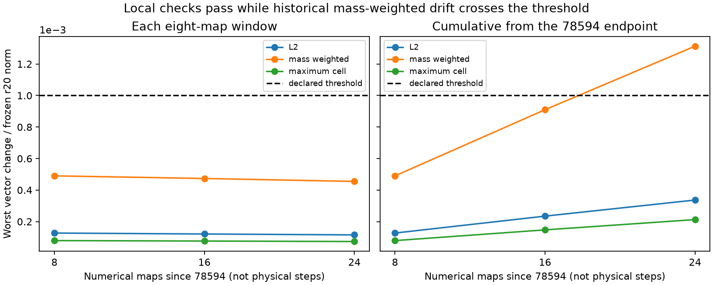

把对应端点的完整编码残差向量记为 $C_{n}$，数字表示从78594末态之后累计的数值map数，$C_{0}$ 为该历史端点。对任何固定选取的三个端点，向量严格满足

$$
C_{24}-C_{0}=(C_{24}-C_{16})+(C_{16}-C_{0}).
$$

范数一般不满足加法等式，因为两个变化向量可以同向、反向或改变分量方向；但一定满足三角不等式

$$
\|C_{24}-C_{0}\|_{k}\le\|C_{24}-C_{16}\|_{k}+\|C_{16}-C_{0}\|_{k}.
$$

其中 $k$ 表示所用的三种范数之一。程序实际保留每次反馈的previous/final两个端点，并对全部4组合逐范数取最大，不挑选有利端点。两段最坏质量比例之和约0.001364881，确实允许累计0.001313048出现。两个短区间各小于0.001，并不要求它们的累计量也小于0.001；图中局部变化略降而累计量升高，是已测有限区间的事实，不用于外推未来收敛率。

原七门全部通过、末端最低气体热能约 $7.02325\times10^{12}$ erg/g，因此这次累计门失败并不是负气体热能或反馈域越界。末map内部辐射残差约 $6.115\times10^{-7}$，但末物质残差三范数仍为8.260533/0.282229/2.705709。这两个残差衡量不同方程：场映射的相邻变化已经很小，不等于耦合物质固定点的残差已经消失。

新局部窗口协议在提交前就声明：历史累计门继续报告，控制本次派发的则是近期及从78950第16张起的累计窗口门。独立审计确认程序按此执行，历史判决为false；不改r20，不改旧失败。因此仍可在原预算内继续thermal/population的晚期诊断，第一项新晚期门失败即停。它不能支持“从历史起点全程稳定”，未来某次端点历史比较若又通过，也不能覆盖这次失败。两个方向的本批反馈尚未审完，没有第21次物质接受，更没有完整大气强度表。

本次核验2157文件、760份进程回执，数组有限、气体热能正、资源门通过，两幅图已目视；Mac没有重新求解ODE或大辐射场。学校无工具CLI先起草，实际模型deepseek-v4-flash[1m]。正式文字改正了把整个79151称为控制组，以及把“不满足加法等式”含混写成“不满足三角相加”的说法。

## 65. 热能方向的晚期信号开始稳定，为什么仍不能接受这一物质步

本轮thermal组完成8张新map，对应来源延续后的第24张。固定的是同一个热能试探物质态、原r20、物理旧层和物理dt，变化的只是逐步求精的辐射场。令候选的完整物质反馈残差为 $P$，同期控制的残差为 $C$，有限方向信号仍定义为 $S=P-C$。这个差描述同龄辐射求解条件下的候选效应；它并未直接回答候选残差本身是否足够小。

第24张附近的端点散布/最小信号三比例为0.490%、0.827%、0.442%。第16→24张全部16种端点信号组合的最坏变化/当前最小信号为3.772%、5.350%、3.370%。全部低于10%，这次预声明的晚期窗口通过。第8→16张的10.567%、12.507%、9.184%仍是前两项失败；较晚一段的结果并不否定较早那一段的实际变化。

还不能把当前两个通过字段算成两次确认：这是新run的第一轮，相邻窗口的起点和本批累计窗口的起点都在78950第16张。两个字段比较的是同一段数据。真正第二个窗口以及从第16张到第32张的累计检查，都需要后续实际反馈；首轮只通过热能组，也不能代表布居组通过。

现在分开两个问题。第一，候选效应随内层迭代的变化，在当前声明的有限窗口里是否小于信号的10%？本轮通过。第二，沿这一物质试探，三个残差范数是否都满足接受标准？本轮未通过。相对同期control，L2约下降0.84%、质量范数约下降0.80%，但最差单元范数在全部4组合均增加约0.296%。相对原r20的正式接受门仍13/16，失败的正是三个收缩门；最后三个残差范数为8.191076、0.279979、2.713729。不能选择前两项下降而忽略最差单元，也不能用较新的control替换原接受分母。

因此，“有限响应在本窗口内较稳定”与“这个单独试探满足共同收缩”是不同命题。前者让我们有条件继续检验方向信息，但不是到真算子的严格误差界；它也不保证读数没有共同偏差或以后不再变化。反过来，即使某次数值计算尚未分辨方向信号，真实方向也可能下降，不能把本次稳定性门说成真实下降的数学必要条件。我们要求它，是为了限制据此选择下一候选时的数值不确定性。

两个反馈响应的气体热能均为正，最低约 $7.00016\times10^{12}$ erg/g，所以本次没有物理域越界。这只验证这两个实际响应，不能推广成整个方向、所有步幅都合法。当前热能试探不能接受，也不证明它在未来所有混合方向中无用，更不证明模型无解。

决定仍是按原批次继续population8；三组首轮全部通过，才进行已声明的第二窗口。任一新晚期门失败就停，不增加预算，不接受第21次物质更新。control历史累计质量超门继续保留false，原物理时间层不动。平台CLI曾将“原三个收缩门失败”误说成晚期门触发停止；实际晚期字段为true，population已进入初始化。这个例子说明监督文字必须与协议和真实状态核对，不能由一句摘要替代判决。

Mac本次核验4309文件、1520份进程回执，数组有限、气体热能正、资源门通过，图已目视。学校无工具CLI草稿实际deepseek-v4-flash[1m]，正式文字纠正了把测量稳定说成物理下降的必要条件、把有限通过说成可信真值保证，以及把gas正推广成全方向合法性的说法。

## 66. 输入只改变布居，为什么尚未稳定的却主要是热能响应

79151已经正常结束，总24张新map，三组各8张；布居方向第16→24张的信号持续性三项失败，因此没有继续第二窗口。它的相邻端点散布只有2.37%、3.24%、1.24%，但八张map之间的方向信号变化达到30.34%、31.56%、18.91%。两个指标比较的对象不同，不能用前者替后者过门。

先区分输入和响应。population候选由原r20的三个布居编码分量构造，输入的气体热能编码保持原值；输入温度仍可能因粒子数改变而变化。这个候选一旦固定，辐射map只求精辐射场，并不在每张map后接受或更新物质。到指定反馈端点，程序才用辐射计算率和加热，再从同一物理旧时间层求目标物质响应。因此，输入只沿布居方向移动，不要求目标响应的变化也只落在布居分量。

将布居候选的完整物质残差记作 $P$，同龄控制的完整残差记作 $C$，信号为 $S=P-C$。它们都是512分量的编码残差，而非整个物质态，也不是三个标量范数。两轮比较严格满足

$$
\Delta S=\Delta P-\Delta C,
\qquad
\|\Delta S\|_{k}\ge\left|\|\Delta P\|_{k}-\|\Delta C\|_{k}\right|.
$$

每轮两个候选端点与两个控制端点组成4个信号；两轮比较覆盖全部16组合。对各范数实际最坏组合，右侧下界除以当前最小信号，分别为27.36%、27.65%、17.55%。这说明即使控制变化恰好沿最有利方向抵消候选变化，仍不足以把这几个组合压到10%以内。它排除了“只是控制漂移”这一单独解释，但没有给出到未知辐射固定点的误差界。

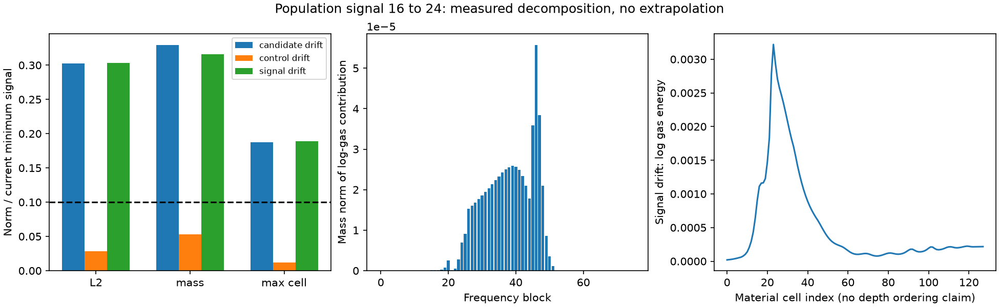

图左每一列使用该范数自己的最坏端点组合，因此三个范数可能对应不同组合。中、右图统一使用最坏质量组合。其信号变化的质量平方99.9638565%来自ln气体热能分量；完整布居分量仍参与范数，没有删除。这定位的是已测响应变化，不证明全部辐射误差都来自热过程。

继续沿能量账本往回追。对同一个固定候选，两轮物质响应从相同物理旧层出发，所以旧总能相消，剩余气体热能 $g$ 满足

$$
g_{\mathrm{new}}-g_{\mathrm{old}}
=\frac{\Delta t}{\rho}(Q_{\mathrm{new}}-Q_{\mathrm{old}})
 -(e_{\mathrm{ion,new}}-e_{\mathrm{ion,old}}).
$$

这里new/old指两轮反馈响应，不是两个新的物理时间层。$Q$ 是单位体积净加热率，$\Delta t Q/\rho$ 是比能，单位erg/g。各端点gas均正，所以可定义精确割线因子

$$
f=\frac{\ln(g_{\mathrm{new}}/g_{\mathrm{old}})}{g_{\mathrm{new}}-g_{\mathrm{old}}},
\qquad f\big|_{g_{\mathrm{new}}=g_{\mathrm{old}}}=\frac{1}{g_{\mathrm{old}}}.
$$

这不是线性化近似或floor。把76块的加热差分别乘以 $\Delta t f/\rho$，再加电离能差项，就能重建该组的热log变化；最后作population减control，得到方向信号的热log变化。两组逐层最大闭合误差约 $1.60\times10^{-15}$ 和 $1.36\times10^{-15}$。闭合验证的是账本恒等式及实现，不等于跨窗口数值稳定——本轮持续性门实际失败。

总热log质量范数为0.000551676852，电离能差对应项仅 $8.56\times10^{-13}$。较大频块贡献集中在46、47、45及相邻中频段；56–75块范数和上界相对总热项约 $9.06\times10^{-10}$。这不支持沿用早期cold诊断，把高频尾视为当前瓶颈；也不授权删掉高频尾。各块贡献可以相消，范数和只是一个三角上界，不能解释成正交误差预算或可消除比例。最差单元索引23在未核坐标前不作深浅归层。

下一试验固定同一population物质，使用它最后一张实际map的输入、输出和halo，只在34–40与41–47两组七块内求局部辐射修正。先逐位重放，再检验正性、实际残差减半、边界变化非增、独立半步仿射性及资源成本。选择这些块只是在本次账本评分下优先投入计算，不保证修正有效。局部halo冻结，跨组影响仍须全域真实映射验证。

局部试验不写全域候选、不做正式反馈、不增加物质接受。它必须通过自己的科学和资源门，不能用“没有新物质候选”免除验证；后续若形成物质候选，仍须原16门和同态确认。本轮gas正、同期control下三范数略降，都不改变相对原r20仍失败的事实，更不能证明模型有解或无解。

学校无工具CLI先起草，实际模型deepseek-v4-flash[1m]。正式文字纠正了“每张map更新物质响应”、把账本闭合归为跨窗口稳定，以及“局部探针不必过门”的歧义。完整审计核验6462文件、2280份进程回执，图已目视；Mac没有重新求解物质ODE或大辐射场。

## 67. 线性求解器尚未收敛，为什么它给出的有限修正仍可以有用

79296固定的是此前的population物质候选，改变的是辐射迭代初值。在34–40和41–47两个七块核心内，局部原算子实际缺陷的L2分别降至原来的1.6366%和8.4306%，最大绝对缺陷降至5.9753%和23.0552%；原局部收益、非负性、边界及成本门均通过。它没有更新物质，也没有新增正式H/He反馈。

两个GMRES都用完16次预算，返回info2、线性审核未通过。这句话应保留完整：内部线性修正问题尚未达到其收敛标准。与此同时，取已算出的有限修正，沿允许的非负步长构造辐射候选，再实际调用局部原映射，确实测到了上面的缺陷下降。内部求解精度与有限修正的实际收益是两个判决；近似修正可以有用，实际收益也不能倒过来把未通过的线性收敛门改为通过。

把局部原映射记为 $F$，原场为 $x$，修正后的候选为 $q$。这里“缺陷”是 $F(x)-x$ 或 $F(q)-q$，不是物质编码残差，更不是到未知真解的误差。本次线搜索比例等于1，所谓候选预测恰好落在已实际计算的端点，所以预测误差0缺乏独立检验价值。

程序另外构造 $h=(x+q)/2$，实际计算 $F(h)$，比较

$$
\frac{\|F(h)-[F(x)+F(q)]/2\|_{2}}{\|F(x)-x\|_{2}}.
$$

两个值约为 $3.78\times10^{-9}$ 和 $4.42\times10^{-9}$，低于预声明的 $10^{-6}$。这增加了一个不同输入点的实际算子检验，不是第三方实现，也不能保证所有可能的非线性或实现缺陷都会被发现。它只支持本次受检方向和端点间的仿射一致性。

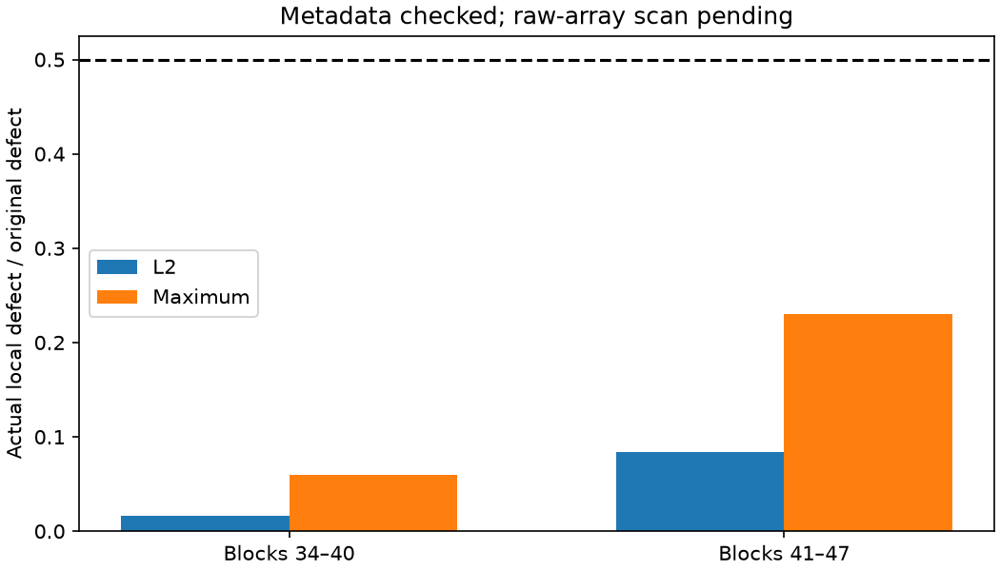

图对应的是固定局部halo的两项试验。halo指每个核心之外提供给局部算子的辐射输入，本次求局部修正时保持固定。若把两个核心同时放回完整频率域，一个核心的输出可以影响邻频区域，邻区又可能反作用回来；所以全域最大缺陷可能出现在未改输入的区域，局部最大缺陷下降并不排除这种情形。必须随后用全域原算子实测full与half，并保留全部频率。

在此之前先补一层数组证据。元数据审计核验了13文件、736源码声明、两个真实map逐位重放、过程退出和资源守卫，并重新判定原九门；它没有在Mac读取两份各1.879GB的local NPZ。默认4核任务将扫描保存的原/新数组，逐1792频率完整读取32角和4096深度，先做实际差值再累计平方和。Mac对小统计独立归约，是对范数和保存数组身份的交叉核验，不是又重放一次算子或半步。

两个worker峰值20729.38和20445.14MiB，约20.24和19.97GiB，均低于32GiB上限；整体作业墙钟23分12秒。资源通过、数组核验、实际局部收益、全域反馈稳定、物质收缩和整盘强度是不同层次的结论，不能跳级。当前只获得局部收益的证据，原20次物质接受及历史失败记录保持。

本节先由学校无工具CLI起草，实际模型deepseek-v4-flash[1m]，再独立核对。修正了MiB转GiB数值，将“第三方检查”改为不同输入点的实际检验，并删除“若有非线性这里就会先暴露”的保证式表述。原数组扫描及全域验证的结果需要各自的新证据。

## 68. 保存的数组与报告一致之后，还缺哪一环

79563已补上上一节的数组交叉核验：默认4核、16GiB，72秒正常结束，峰值5.27GiB，错误日志为空。学校扫描两个核心的1792频率，每频率保留32角和4096深度；从保存的两个强度数组实际相减，再累计平方。Mac接收每频率统计，用独立fsum重建总L2及逐点最大缺陷。Linf严格相等，L2相对先前报告最大差约 $4.60\times10^{-13}$，低于原定 $2\times10^{-11}$ 容差；读取前后源文件哈希不变。

这排除了“局部报告的收益与保存数组不一致”这一类问题。它没有在Mac重放原算子，没有重算半步，也没有测出到未知固定点的误差。GMRES内部线性收敛未通过的记录继续保留，不能用数组一致把那个判决改成通过。

下一环是把局部修正放回完整频率域。一个核心的局部算子计算时，核心外辐射输入保持不动；但全域算子会同时更新核心与邻区。因此必须把两组修正合成全步场，再构造半步场，分别实际求一次全域映射；所有9632频率都参与缺陷、正性和边界检查。新全步L2缺陷须至少降低20%，最大缺陷不得增加，半步须满足预声明的仿射一致性与非增门。只有这些结果出来，才能说局部收益是否传递到全域。

全域门通过后，驱动自动继续一个有上限的反馈实验。它保留population固定候选及control固定物质，两者分别推进到本轮第2和第10张map。连同一次半步验证，共最多21张map、4对反馈；任一派发门失败就终止后续阶段，不能把6小时墙钟上限当成保证完成时间。

第2张的反馈首先回答相邻端点能否分辨方向信号。信号是完整物质残差向量 $S=P-C$，其中 $P$ 属于population，$C$ 属于control。每组两个端点交叉给出4个信号，分母使用最小信号范数，三个原范数都不能省略。第10张再与第2张比较全部16个交叉差，回答八张map以后这个信号是否仍变化超过10%。这只有一个持续性窗口，不是两次独立稳定性确认。

修正前后的信号可以明显跳变，因为我们刻意改变了辐射迭代初值。那个跳变应记录，但不能拿来冒充“继续八张以后仍稳定”。control还从自己的末态出发，两组并非相同数值历史；同期取差不会自动消除所有辐射误差。原r20、物理时间步及历史失败不变，原16门继续逐项报告，物质接受仍为20。这个实验检验的是固定候选的全域收益与响应持续性，距自洽柱及整盘强度仍有明确的物质收缩、闭合和定义域验收工作。

本节经学校无工具CLI起草再核验，实际模型deepseek-v4-flash[1m]。删去了把GMRES未收敛直接扩展成所有局部判决未收敛的表达，将草稿歧义“第10相对2×16”改为第10与第2张之间全部16种端点组合，并明确扫描保存数组不等于重新保存或重算算子。

## 69. 同样分成76块，两种贡献比例为什么不能互换

79631已经给出上一节全域验证的答案：两张map完成，程序正常退出，但验证失败，没有进入反馈。full的L2缺陷比为0.96365583，只降3.63%，未达到0.8门；最大缺陷比仍为1。half仿射性通过，两个新态的边界谱L1下降，但bolometric非增门都失败。11项门是8过3未过，不是“程序正常退出所以实验通过”。

首先解释为什么局部可以降很多，全域却降很少。把实际辐射缺陷记作 $r=T(I)-I$，其第 $b$ 个互不重叠频块记作 $r_{b}$。这里的L2是网格强度缺陷的欧氏范数，不是物理能量。因为不同频块占据不同数组坐标，严格有

$$
\|r\|_{2}^{2}=\sum_{b}\|r_{b}\|_{2}^{2}.
$$

旧选区34–47只占原平方缺陷7.90015%。若其它区保持不变，即使这个选区全部清零，范数比也只能到

$$
\frac{\|r_{\mathrm{new}}\|_{2}}{\|r_{\mathrm{old}}\|_{2}}
=\sqrt{1-0.0790015243}\simeq0.95968665.
$$

这是明确条件下的预算计算，不能推广成任何算法的极限。实际34–47的平方缺陷已经大幅下降；区外33、48有反作用，其它区外输出没有变，24、25两个未选块仍占原平方缺陷的78.70%。全域最大缺陷也留在25块，所以原辐射残差逐位不变。

此前选择34–47的依据却是热响应变化。每块的热贡献向量 $h_{b}$ 都落在同一组物质单元上，两个频块可在同一单元产生反向贡献，因而通常只有

$$
\left\|\sum_{b} h_{b}\right\|\le\sum_{b}\|h_{b}\|.
$$

范数之和本身不会相消；相消发生在向量求和里。因此，选区占块范数之和65.69%，不等于占净热响应65.69%，更不等于占辐射缺陷平方65.69%。上一轮把热评分用于选区，却要求全域辐射L2下降20%，目标不匹配。这是实验设计需要纠正的地方，不应归咎于未定义的“物理复杂”，也不证明模型无解。

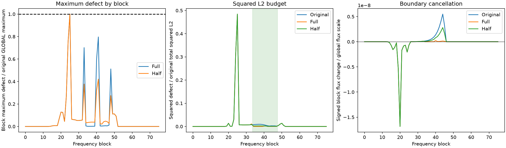

再看右图。每块的两侧出射边界积分通量在映射前后有带符号变化，记为 $\Delta F_{b}$；它不是物质单元的净加热率。程序的bolometric指标先加各块通量，再取映射前后总差的绝对值。原、half、full的 $\sum_{b}|\Delta F_{b}|$ 为883239.57、711062.36、538885.16，逐渐减小；但 $\sum_{b}\Delta F_{b}$ 为−161104.57、−333281.78、−505458.99，更加负。正变化减少，主要负变化仍在，抵消减弱，所以归一化净变化从 $9.84\times10^{-9}$ 增至 $3.09\times10^{-8}$。分母总通量约为 $1.637\times10^{13}$，两个总量求差与逐块差求和的归一化舍入差仅约 $10^{-16}$，不能解释这次上升。

下一探针根据当前全域实际缺陷重新选择两个同样宽度的七块核心：20–26及27–33。它们占当前平方缺陷95.95%，说明现在覆盖了主导预算，仍不保证局部修正能够消除这些缺陷。数值起点采用已拒绝但已实际映射的full场，物质、r20与物理时间步不变；“可作数值起点”与“可作接受解”是不同判断。逐位重放、局部正性、真实收益、独立半步及资源门照旧，成功后还要重新做全域验证，同时对照原79151参考，不能把旧失败藏在新基线后。

本次审核327文件、736源码声明及152过程回执，通过小统计独立归约和图形检查，没有在Mac重算全数组或转移算子。没有新正式反馈，所以不能宣称热响应持续性或物质收缩已经改善。学校无工具CLI草稿为deepseek-v4-flash[1m]；正式文字修正了“块范数之和本身受相消影响”的不准确表述，并将半步通过与全域L2失败明确分开。

## 70. 局部修正有效之后，为什么仍要保留两个全域参照

这一轮先解决了一个可直接验证的问题：在当前辐射场的主要缺陷区，有限的数值修正能否产生真实收益？79747选择20–26、27–33两个七块核心，它们覆盖当前全域缺陷平方和的95.9543%。在各自外侧辐射输入保持固定时，实际映射后的L2缺陷比分别为0.359958178和0.004932914，最大缺陷比分别为0.419064510和0.002330065，均过原先“至少减半”的门。这不是把旧缺陷乘上估计系数：修正后的场确实经过了局部转移算子。

但是，GMRES两例都只运行16次迭代，info为2，线性审计未通过。因此我们得到的是两个已验证有效的有限修正，尚未得到线性方程的收敛解。全步的预测误差恰好为0来自构造端点的恒等式；另一次独立半步映射给出的仿射误差/raw L2为9.19e-10和4.38e-9，才为沿这一方向的近似仿射性提供额外证据。它仍只适用于这两组固定外侧辐射输入的局部实验。

接着，79850在默认4核、16GiB中读取保存的原数组，逐一统计1792个频率组，每组保留全部32方向、4096深度。Mac以独立求和方式复核这些小统计：最大差精确一致，L2归约的最大相对差为1.4244e-12，小于事先声明的2e-11容差。作业65秒，峰值约5.27GiB。这一步验证“报告里的范数确实对应保存的数组”；它没有重新计算转移算子，也不能再次证明半步算子正确。算子重放、实际新映射、数组归约分别回答不同问题，不把三者混成一张通过证书。

下一步才把两个局部修正同时装入完整辐射场。记原79151辐射输入为 $x$，79631已经拒绝但实际映射过的数值起点为 $q$，本轮拼出的新全步为 $u$。当前物质固定时，完整映射记为 $T$，缺陷为 $R(z)=T(z)-z$。本次半步的定义是

$$
h=\frac{q+u}{2}.
$$

因此仿射性检验必须比较 $R(h)$ 与 $[R(q)+R(u)]/2$。因为先前34–47块已经使 $q$ 不同于 $x$，通常有 $h\ne(x+u)/2$；若拿 $x$ 替代 $q$ 来算半步误差，就把不同线段上的点放进同一个公式，制造了一个没有定义依据的“失败”或“通过”。新代码用专门测试拦住这个混淆。

另一方面，收益和边界非增必须同时对照两个参照。相对 $q$，检验本次修正是否有效；相对 $x$，检验连续两次修正有没有掩盖原先的退步。full的L2比相对两者都须不大于0.8，两套最大缺陷、half L2、辐射和边界门均保留，只有半步仿射性归属于当前线段。合计21门，全部通过才进入正式反馈。旧79631的失败记录不变，数值上可以继续改进它并不意味着科学上接受它。

后续任务已设置为足量但有停止条件的窗口：最多21张新映射、4对正式反馈，先control2和population2，再control10和population10。第2张反馈检查端点可分辨性，第10张检验跨八张映射的信号持续性；相对旧79151的首次跳变只记录为修正效果，不当作稳定性。全过程保留原物理时间步和r20，原16物质门与正气体热能仍须审查。全域或窗口失败就停止，不能直接推出柱大气无解；全部通过也还需要独立复核、同态确认和后续耦合柱验收，当前不能给出整盘强度完成时间。

本节参考学校无工具CLI草稿，实际模型为deepseek-v4-flash[1m]，再依据原工件独立修订；将草稿含混的“21次map4反馈”改成明确预算，并补全双参考与真实中点的数学区别。

## 71. 一个小的边界退步，如何暴露实验约束之间的不相容

79878给出了新的真实证据：把两组局部修正拼回完整网格后，全域L2缺陷相对原79151降至0.395425，最大缺陷降至0.902950；收益没有在跨区耦合中消失。21门通过19门，剩下的是full和half各自相对原参考的bolometric非增门，属于同类但两个独立判据。两者值为1.07424e-8和2.08082e-8，原值为9.84046e-9。程序因此没有计算反馈。数值很小不构成撤销预先判据的理由。

这次还暴露了一个设计遗漏。仍记原辐射场为 $x$，已经拒绝但可作数值起点的79631场为 $q$，新全步为 $u$。记两侧出射总通量为 $F$，映射的带符号通量差为 $D(z)=F[T(z)]-F(z)$，正通量归一化尺度为 $S(z)=\max(F[T(z)],F(z))$。旧非增门等价于 $|D(z)|\le\theta S(z)$。这里的 $D$ 是两次辐射迭代的边界通量差，不是物质加热率或物理能量缺口。

上一实验把半步定义为 $h=(q+u)/2$。若固定物质下的当前预测模型是仿射的，则 $2D(h)=D(q)+D(u)$。若full与half都过旧门，三角不等式给出必要条件

$$
|D(q)|=|2D(h)-D(u)|\le\theta[2S(h)+S(u)].
$$

在现有两方向、系数均处于0至1的范围内，预测通量尺度的最大值为 $M=1.6371650629\times10^{13}$，因此右侧不超过 $3\theta M=483313.81$；而 $|D(q)|=505458.99$，超过22145.18。这不是把失败圆整成成功的问题：在这个仿射预测模型及系数范围里，两道门本身已经没有同时满足的组合。

证据边界也必须说全。79878实际半步的带符号通量仿射误差是0.000607，远小于上述缺口；但这只检验了一条线段上的一个点，不能当作整个系数盒的统一非线性误差上界。因此我们证明的是仿射预测问题内不可行，尚未证明完整算子对所有候选均不可行，更没有证明大气模型无解。上一轮设计时应当先做这个必要条件检查，遗漏属于数值实验设计问题；旧实际失败判定仍然有效。

新的诊断把候选重新定义在原参考上。两条已有方向为 $d_{\rm A}=q-x$、$d_{\rm B}=u-q$，分别只改变34–47和20–33块；不增加方向数或移动核心。构造 $z=x+a d_{\rm A}+b d_{\rm B}$，半步明确取 $(x+z)/2$。对完整残差向量的仿射预测计算Gram矩阵，在系数盒内令预测 $D(z)=0$，再沿这条约束线最小化L2平方。交叉项必须保留，因为不同方向经全域映射后的残差支持区可能重叠，不能简单相加两个方向的L2。

这个操作没有把最终谱除以某个系数，也没有裁掉负值；它是在真实映射之前选择辐射数值初值。预测边界差为零不能证明物理能量平衡。新的4核任务80005只读六个已有场，最多两遍扫描，求并复核一组系数，0新map、0正式反馈、0生产候选大场、0接受态。即使预测通过，也必须重新声明并运行真实full/half检验，然后才可能进入物质反馈。原r20、物理时间步、率核和原物质门均保持。

本节基于独立审计的327文件、740份源码声明、152过程回执及真实边界账本。学校CLI草稿的实际模型是deepseek-v4-flash[1m]；正式文字把“同类一项失败”改为明确的两个失败门，并补全必要条件的模型前提与不适用范围。

## 72. 约束预测通过后，接下来真正要证实什么

80005完成了六个既有真实场的两遍扫描，用时519.17秒，峰值1.16GB，没有运行新的转移map。独立Gram归约得到 $a=0.4892755093069306$、$b=1$。边界中性约束线上，无约束L2极小值在 $a=0.92077$，但那里会要求 $b>1$；在原系数盒内，最优点位于 $b=1$ 的端点。这是有界优化的解，不是裁剪强度。

预测full/half的L2比分别为0.420816和0.693761，最大缺陷比为0.930431和0.709532；边界bolometric预测为2.108e-18和4.9202e-9，均小于旧门9.84046e-9。全步近于零来自候选约束的定义，绝不能拿它展示为真实数值解的能量闭合。Mac独立归约小统计、重求系数并核对浮点消减界后，八个预测门均通过，图如下。

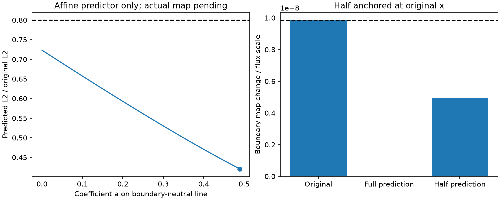

现在只差一个非常具体的检验，才有资格讨论新反馈：将该候选实际送入完整转移算子，再对以原 $x$ 为锚点的half做同样操作。新作业80052负责这个环节。它保留原 $x$ 的11门及旧 $q$ 的10个收益/边界比较，共21门；只把仿射性放在真实half所属的原 $x$ 线段上。若预测不成立，记录实际失败而不调系数；若全部成立，再运行预定的control和population反馈窗口。物理时间步、原r20与物质门没有变化，79878仍是被拒绝的历史实验。

学校无工具CLI草稿已核查；正式文字把“近零或由约束”的含混表述改为明确因果。当前没有新的真实反馈证据，不能说物质收缩或整盘强度已得到改善。

## 73. 算法检验失败之后，什么还能测，什么仍不能接受

先把对象分清。这里的物质候选始终是同一个固定布居试探，变化的是辐射求解的数值初值。记该固定物质的转移映射为 $T$，原辐射场为 $x$，新构造全步为 $z$，半步为 $h=(x+z)/2$。辐射缺陷是 $T(z)-z$；它小一些，并不直接证明物质目标响应更正确，因为加热包含频率积分和大项相消，还必须实际计算反馈。

80052已经给出两次真实全域映射。全步缺陷L2降至原场的0.420816，半步降至0.693761；最大缺陷比分别为0.930431和0.709532。因此L2有实测收益，但最大缺陷的改善小得多。半步仿射误差除以原L2为1.7124e-9，只说明这条线段上的算子响应很接近仿射；它不是最终辐射解误差的上界。

21道预注册门中20道通过，唯一失败是“半步边界谱变化不大于旧参考q”：半步为3.978024009e-8，旧q为3.537792840e-8，前者高12.4437%。原x的11门全部通过，全步相对两个参考的门也都通过，但这些事实不能抵消冻结协议的那个失败。80052按规则停止，只有2张map、0反馈，接受步数仍为20。

这次失败并非不可预见。80005已经预测出同一个半步谱变化；提交前却只核对了原x的8个预测门，遗漏了实际协议额外要求的旧q参考。这是我的实验设计遗漏。§72记录的是当时八门预测通过的范围，不是21门已经具有通过预期；不能用后来实际运行来掩盖预检缺口。今后的预检必须逐项对应实际门，并单列尚无法预测的项。

还要避免一种视觉误导。全步映射前后总通量均舍入为1.6371629564438709e13，因此总量相减打印为零；先逐块作差再求和却得到0.0002877563。后者除以通量仅1.75765e-17，属于两种归约可能保留不同尾数的尺度。逐块绝对变化之和仍为374488.25。这三个量可以同时成立：正负变化抵消、浮点总和相等、局部变化不为零。因此这个零不是物理能量闭合证明，也不是加热已经收敛。

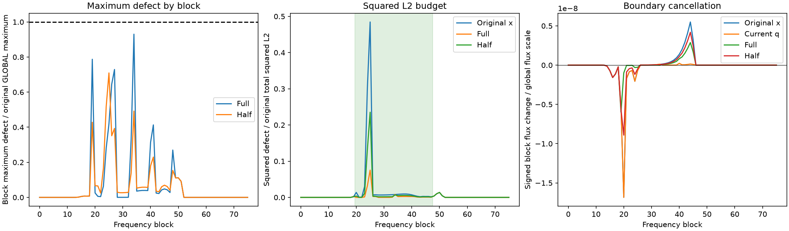

下一步不继续调整系数，而是改变要回答的诊断问题：以已有实际输出 $T(z)$ 作为新辐射数值种子，在同一物质候选上继续求解，再测量物质响应能否稳定。80052的算法选择门仍是失败；新目录并不能使它成功。允许进行诊断，只意味着在来源可追溯、物理域合法、没有自动晋级的前提下读取反馈，不意味着该初值已有生产资格。

新运行先让零步控制与布居候选各作2张连续真实map，再各计算一对反馈。控制残差记为 $C$、布居候选残差记为 $P$，先在完整512维向量上计算 $S=P-C$，之后才取L2、质量加权和最差单元范数。不能相减两个范数代替向量差。控制组还须满足原七门，以及窗口内和从79151末态累计的三范数漂移除以固定r20均小于0.001。

候选原16门逐项报告；只有3种物质残差收缩门失败允许在诊断范围内继续，其余13门中的率、加热、内层噪声、边界、身份、正布居和有限性任一失败都停止；目标气体热能非正也停止。首次信号端点散布必须小于0.1，才安排每支再增加8张map；第二窗口还要求跨8张的信号漂移小于0.1。最多20张新map、4对反馈，不在失败后追加同样预算。两支辐射初值历史不同，首次相对79151的变化只能称为修正跳变，不能冒充持续性。

物质态、物理旧时间层、原r20和物理dt始终不变，也不剪裁布居或加入温度floor。即使本诊断全部通过，仍只能说明这组有限窗口中的响应稳定，必须独立复核及后续资格检验才能讨论新的物质接受步，更不能直接宣告耦合柱或整盘 $I_{\nu}$ 完成。

本节先取得学校CLI草稿（实际模型deepseek-v4-flash[1m]），再由Codex核查。正式文本去掉了草稿中“诊断只要可解释”的宽泛说法，改列具体停止条件，也没有将小半步仿射误差一概解释成非舍入物理差异。

## 74. 试探信号已经稳定，为什么还不能接受下一步

80195完成了预定20张真实映射、4对反馈，两个诊断窗口均通过。第二窗口中，布居信号的质量加权端点散布为0.01608，跨八张映射的漂移为0.06512，都低于0.1。目标气体热能全部为正，原率、加热、内层噪声和边界门也通过；但原16门仍只有14门通过，L2与质量加权收缩失败。这里没有矛盾：一个可重复测得的响应，不必是相对冻结验收参考的下降响应。

要理解卡点，先分清三个对象。物质编码态记为 $x$，辐射场记为 $J$；这里的 $J$ 只是完整离散辐射数组的记号，不特指通常的角平均强度。给定物理旧时间层、辐射反馈和物质态后，H/He响应求解器得到目标物质态，其编码向量记为 $G(x;J)$。当前所测残差是

$$
R(x;J)=G(x;J)-x.
$$

理想的内层求解先在固定 $x$ 下得到合格辐射场，再用这个响应推进外层。实际求解只做有限次辐射映射，因此同一个 $x$ 配上不同数值历史的 $J$，可能得到不同的 $R$。这里的“历史”是求解器的初值和迭代路径；不能未经检验就解释成物理时间上的记忆效应。

旧接受记录保存的残差记为 $r_{20}$。80195同一物质态的零位移控制残差记为 $C$，布居试探残差记为 $P$。最后端点的质量加权范数满足

$$
\frac{\|C\|_{\rm M}}{\|r_{20}\|_{\rm M}}=1.077722386357,
\qquad
\frac{\|P\|_{\rm M}}{\|C\|_{\rm M}}=0.999411432003.
$$

第一项表示同态零步的残差长度比旧参考高7.7722%；第二项表示本次布居试探相对本次零步有约0.05886%的长度下降。这一点有限下降是真实计算结果，不能说它完全不存在；但它并未使P小于原r20，也未证明当前零步已成为合格的新验收参考。直接更换分母会改变验收问题，不能代替参考一致性的验证。

还必须区别两个长度之差与两个向量之差。质量加权范数满足反三角不等式，因此

$$
\frac{\|C-r_{20}\|_{\rm M}}{\|r_{20}\|_{\rm M}}
\ge
\left|\frac{\|C\|_{\rm M}}{\|r_{20}\|_{\rm M}}-1\right|
=0.077722386357.
$$

所以7.7722%甚至只是该完整向量差的一个下界，并不是辐射剩余误差的上界。相反，两个同样长但方向不同的向量，长度差可以为零，向量差却很大。本项目的窗口审查始终先减512个编码分量，再按L2、质量加权与每层四分量长度的最大值取范数。

## 75. 先证实同一输入能复现，再问两条迭代路径能否会合

下一步的第一项排查已由80542完成。它在默认4核内，把76727旧接受态与80195两窗口的10份已保存反馈重新送入同一H/He物质响应ODE。残差、温度、H布居、He布居、目标比物质能五类数组全部逐位复现；Mac独立验证23个工件、744份代码声明并比较原数组。最低目标剩余气体热能为6.2006846e12 erg/g；相位1367、物理步长889.419892762322秒不变。54秒是该Slurm作业墙钟，不是重新完成辐射求解的时间，因为它没有做新辐射map或新反馈积分。

这一步排除了一个具体可能性：当前物质响应实现对这些相同旧反馈已经给出不同结果。它没有排除共同存在的公式错误，也没有验证辐射反馈本身的严格精度。因此不能把“重放成功”扩大成“差异只可能有一个原因”。现有证据支持优先检查辐射数值历史，但下一项实验仍需独立作答。

新的双历史实验把物质态固定为同一个x20零步数组。historical支取生成旧r20时的原辐射输入；late支取80195零步的最新真实映射输出。两支使用同一个转移核、频率/角度/深度网格、物理旧时间层和步长。每支最多24张map，在16和24处各测一对反馈；总预算48张、4对反馈，32核128GiB，16个worker。不是让两支各自改物质，也不把响应目标当成已接受物质态。

首先，每对反馈必须通过原严格辐射、边界、率、加热、物理域与资源门。第16张处两支的差异只作记录，用后8张检查趋势；这项有限容许预先声明，并不豁免物理门。第24张处，既检查每支16到24的漂移，也检查两支24端点之间的差异。每种比较都有previous/final四种配对，不能挑一对最接近的端点。

具体地，记任一配对的完整响应差为 $d$，范数类型为 $k$；令 $s_{k}$ 为80195最后窗口四种P减C向量的该范数最小值。这是由已有审计数组冻结的三个尺度，而不是本轮临时选择的较宽分母。每个差都须满足

$$
\frac{\|d\|_{k}}{\|r_{20}\|_{k}}<10^{-3},
\qquad
\frac{\|d\|_{k}}{s_{k}}<0.1.
$$

第一项控制相对原参考的绝对数值漂移，第二项要求漂移小于已测布居信号的十分之一；两者必须同时满足。两支最终四种反馈配对还须通过原五项率/加热门。失败立即停，不靠续加同样预算或换尺度追求通过。

即便全部通过，也只得到在两个初值、两个有限窗口内的经验一致性。它不是严格的解误差上界；严格上界需要另外证明，例如已知可靠收缩常数并结合残差界，而不是给某个小数冠以“误差”之名。有限双历史也不能证明唯一解。输出最多标记参考校准具备进一步审查资格，r20不会自动替换，第21步不会自动接受。

历史80052的半步边界失败、80195的两项原收缩失败与79151的累计参考记录都保留。当前20个接受步只是在同一个物理时间层内进行的20次非线性更新。完成这次诊断之后，仍需明确的新参考迁移论证、外层耦合收敛、能量和分辨率验证，才能继续谈代表柱、环带/相位覆盖与整盘 $I_{\nu}$。

本两节参考学校无工具CLI草稿，实际模型为deepseek-v4-flash[1m]，再由Codex独立核查。正式文字修正了草稿“差异只能来自辐射历史”的过强因果判断、把严格误差界等同于sup范数的概念混淆，以及第一归一化分母写成差向量自身范数的公式错误。

## 76. 小的辐射更新，为什么可以伴随大的物质响应差

80554已经完成：historical支走24张新map，late支走16张，共40张和三对零步反馈。Slurm正常退出，但科学终态是历史支16→24窗口失败。后面的late24按预注册顺序没有执行。Mac独立核8878个工件文件、746条代码声明、3040份map和456份feedback进程回执，复核与学校判决一致。

这里要分清三个对象。物质态固定为$x_{20}$；一次辐射更新记为$T(I)$，只把当前辐射场$I$映射到下一辐射场；由辐射反馈再解物质方程所得的响应记为$G(x_{20};I)$。真正讨论的物质固定点残差是

$$
R(I)=G(x_{20};I)-x_{20}.
$$

因此，辐射的相邻更新$T(I)-I$、两条历史之差$I_{1}-I_{2}$、以及物质响应之差$R(I_{1})-R(I_{2})$，不是同一个量。前两者与物质响应差有不同的单位、归一化和算子作用，不能因为第一个量很小，就认定第三个量也必须很小。

一个可以完整算清的数值例子是$T(I)=\lambda I+b$。设其不动点为$I_{\star}$，则

$$
T(I)-I=-(1-\lambda)(I-I_{\star}).
$$

若$\lambda=0.999$，相邻更新只有当前误差的千分之一。此处的0.999是解释机制的例子，不是给本项目测出的本征值。即使算子严格仿射，小更新也不自动等于小误差；更不能在没有响应灵敏度界的情况下，把它当作物质残差误差界。学校CLI草稿曾把这层关系写反，正式讲义不采用那句推断。

## 77. 本轮已经量到什么，尚不能认定什么

三对零步反馈的原七门全部通过，六个端点目标气体热能都为正。这里没有重现“物质响应无正气体热能”的失败。问题出在更长的窗口和不同历史之间。

对historical的第24张与第16张端点，先减完整512维物质残差向量，再取L2、质量加权、最差单元范数。四种previous/final配对的最坏值除以原$r_{20}$同种范数，分别为0.010700834、0.022881250、0.006873500；三个门都要求小于0.001。若改用已冻结80195布居试探信号作为尺度，三个最坏比值为2.9850、3.8507、1.1624，均超过0.1。两个尺度检验都失败，不是选择另一个分母就能消除的问题。

两支各走16张新map时，历史间完整差向量的质量加权比最坏为0.36555536。只把historical推进至24张、仍与late16比较，这个数为0.34985882；它是不同迭代龄的附加诊断，不能冒充“两支24张已经会合”。两条支各走16张也不代表它们此前经历的总map数相同。

再把差异按编码分量拆开。每层四个编码分量的第一项是比气体热能的自然对数，后三项是H II/H I、He II/He I、He III/He I的布居比对数。对第$i$层和第$k$分量的差$\delta R_{i,k}$，质量加权平方贡献定义为

$$
w_{i,k}=\frac{m_{i}(\delta R_{i,k})^2}{\sum_{j,l}m_{j}(\delta R_{j,l})^2}.
$$

这里$m_{i}$是该层单位面积质量。H24−H16的final/final差中，第一分量的贡献为99.9660%；L16−H16中为99.9835%。这准确表示“编码响应差主要沿热能分量”，不表示“真实气体热能有99.98%的误差”。所有128层都纳入求和；代码单元编号尚不能直接当作光学深度。

现有证据支持的是：当前辐射历史依赖足以影响物质判决；旧参考仍不能迁移。它没有证明辐射问题有多个解，也没有证明H/He模型无解。接受20仍是同一物理时间层的20次非线性物质更新，第21次未接受，耦合柱与整盘$I_{\nu}$尚未完成。

## 78. 下一实验为何同时需要4核扫描和32核真实映射

取late最后一次真实map的输入、输出为$L,T(L)$，historical对应为$H,T(H)$。四个大数组留在学校，来源由保留端点清单和SHA确认。

4核任务先测

$$
D=H-L,\qquad D'=T(H)-T(L).
$$

比较$\lVert D'\rVert/\lVert D\rVert$以及$D'$在$D$方向上的投影，可以回答“这条实际历史差方向经过一次映射后有多大变化”。这是某条方向的测量，不是整个算子的谱半径，也不是严格真解误差界。扫描同时寻找一个全域标量$a$：

$$
Z=L+a(H-L),\qquad P=T(L)+a[T(H)-T(L)].
$$

$Z$是拟议输入，$P$只是拟议输出。系数预先限定在$[-8,8]$；必须同时保证两者的每个频率、方向、深度单元非负，再最小化预测缺陷$P-Z$。最后检查L2收益、Linf和出射边界变化。它不截断强度、不改物理时间步、不写生产候选，也不执行新map。全场无权L2只是数值目标，不是辐射能量积分。

32核任务独立构造非负中点$M=(L+H)/2$，用原转移核做一张完整76块map，再计算

$$
E=T(M)-\frac{T(L)+T(H)}{2}.
$$

$E$的L2和Linf分别除以两条来源各自的原始map缺陷尺度，四个比值都须不超过$10^{-6}$。不用大的总场强稀释误差。中点无需比late更接近不动点：这次的问题是该连线上的算子仿射一致性，不是接受加速候选。

若中点不一致，先定位来源、算子实现与内部数值容差，不能继续相信外推。若中点一致且4核扫描给出可行方向，独立复核后再给这个候选做真实full/half映射；若扫描无可行收益，则利用全频差场归属设计求解器诊断，不自动扩大系数范围或追加相同Picard预算。两个任务都不自动接受物质步，也不生成观测谱。

## 79. 这次分清了“算子不一致”和“选错了加速方向”

80823完成真实中点映射，四个仿射误差比最大为$2.29418\times10^{-9}$，远低于预设$10^{-6}$。因此，在这两个已存辐射态之间的中点，真实转移算子与两端输出的仿射插值一致。这个证据有明确范围：一条连线、一个中点、当前固定物质；不能证明所有扰动方向都满足同样精度，也没有新物质反馈可据以判断耦合改善。

另一项80826扫描量到了历史差的一次映射增益0.99195648。也就是说，当前完整历史差的无权L2长度经过一次映射后仅减少约0.804%。投影系数0.99193793、非平行分量比0.00611625补充了方向信息：输出差大体仍沿原差方向，但并非精确单一本征模。这些数字不能用作整个算子的谱半径或严格剩余误差界。

最小化单一方向上的预测缺陷后，所选系数为$-0.00809859$。预测L2和Linf分别降到原late端点的0.929345和0.924032，收益不够；边界谱L1变化却从$1.70605\times10^{-8}$升到$1.91362\times10^{-7}$。边界总通量变化也从$1.67852\times10^{-8}$升到$1.91351\times10^{-7}$。因此这条方向仍被拒绝，没有写入候选大态，没有真正映射这个候选。“算子在该中点一致”和“该方向值得采用”是两个独立问题，本次前者通过、后者失败。

再看差异在哪里：原late缺陷平方的92.0082373%集中在频率索引3072–3295的七个32组分片。这是对完整扫描统计的再次求和，修正了给CLI草稿时尚未核实的96%估计。索引不是Hz，也不是物理深度；这里按无权辐射缺陷平方分摊，不能改称能量损失百分比。全部频率仍保留在计算中，集中分布不授权删去其余频率。

两任务墙钟分别为9分18秒和18分47秒。Mac独立核验了小工件哈希、301个分片归约与76块原映射回执，未重新读取全套大辐射场。代码成功、算子局部一致、物质收敛和整盘强度完成仍是不同层级。

## 80. 从一个方向换成三个方向，约束放在求解之前

把late历史保留的三个相邻态记为$A,B,C$，满足两次已测映射$T(A)=B$、$T(B)=C$；historical历史对应记为$H,J,K$，满足$T(H)=J$、$T(J)=K$。锚点固定为$B$。新候选与其预测输出写成

$$
Z=B+c_{1}(A-B)+c_{2}(H-B)+c_{3}(J-B),
$$

$$
P=C+c_{1}(B-C)+c_{2}(J-C)+c_{3}(K-C).
$$

三个系数在全频率、全方向、全深度上统一使用。$P$仍是预测，绝不能直接贴上真实$T(Z)$标签。原缺陷为$C-B$，三个差缺陷由上式相减得到；全场内积组成小型Gram矩阵，用来最小化$\lVert P-Z\rVert_{2}^2$。只保留相对最大特征值超过$10^{-12}$的代数方向，不把不可分辨方向强行求逆。

仅最小化这个L2目标可能再次破坏边界量。于是先定义$\Phi(I)$为当前离散频率和角度测度下，两侧出射的积分通量。它对辐射强度是线性函数。新小系统同时施加

$$
\Phi(P)-\Phi(Z)=0.
$$

这条约束要求预测输入、输出之间的净出射通量变化为零；它不是大气物理能量守恒方程，更不是计算后把谱乘一个系数。CLI草稿把它称为“消去已知不变量方向”，这个称呼没有证据，正式解释不采用。

得到三个原始系数后，仍须扫描所有单元，为$Z$和$P$同时寻找非负的全局退步上界；仿射权重的绝对值之和最多17，再留10%的步长余量。退步以后边界等式未必仍为零，所以第三遍扫描重新计算完整full/half收益、正性、辐射与边界门，不依据小系统解直接宣布通过。

预测任一门失败即归档停止。全部通过才写入一个full候选和相对原late锚点的half，分别执行一张真实完整map，再判实际缺陷与真正半步的仿射误差。总预算最多一个提案、五遍场扫描、两张真实map、零反馈、零物质接受。它改变的是有限搜索空间，不是接受阈值，也没有声称能消除所有慢模。

本两节参考学校无工具CLI草稿，实际模型deepseek-v4-flash[1m]，由Codex独立修正比例、Picard方向描述和“不变量”说法。旧失败与原$r_{20}$保留；尚未有自洽耦合柱或整盘$I_{\nu}$。

## 81. “求出一个方向再缩短”为什么会错过可行域内的好解

80862已按第80节的协议执行完毕。原始小系统同时最小化预测缺陷并满足净出射通量变化等式，但尚未施加权重上限或逐单元正性；后者在得到方向后再检查。全场扫描显示原始候选及预测输出均非负，因此本次不是正性限制了步长。

真正起作用的是权重上限。沿用上一节的三个系数，候选是四个已知输入的仿射组合，其权重为

$$
w=(c_1,\,1-c_1-c_2-c_3,\,c_2,\,c_3),\qquad \sum_i w_i=1.
$$

原始最优点的$\sum_i|w_i|=332.18472575$，超过预设17。算法因此只沿该点与锚点之间的直线退步，最终保留原系数的0.0434802661，权重绝对值总和为15.4。注意缩小的是三个位移系数，不是把四个权重一律乘这个比例。若$e_B=(0,1,0,0)$表示锚点，则真正的权重回退为

$$
w(\beta)=(1-\beta)e_B+\beta w.
$$

这样权重之和才始终为1。学校CLI草稿写成$w(\beta)=\beta w$，会破坏仿射条件，正式讲义已纠正。

回退后的full预测缺陷L2仅降到原值0.9607763364，half为0.9803664832；其余九门通过，但没有达到full至少下降20%的要求。作业在13分30秒结束，没有写候选大态，也没有真实映射或新物质反馈。

这个失败只否定了该射线上选中的点。三维系数可行域中，其他位置可以重新分配三个方向的份额，同时满足相同权重上限。先求不受上限约束的最优方向再缩短，一般不等于直接在受限可行域中求最优。这是当前算法的具体局限，不是物理模型不存在解的证据。

## 82. 把系数上限放进同一个小优化问题，再用全场检验裁决

令$r=C-B$，令$d_i$为第80节三个差缺陷；预测缺陷就是

$$
R(c)=r+\sum_{i=1}^{3}c_i d_i.
$$

新的小问题同时最小化$\lVert R(c)\rVert_2^2$，并要求$\sum_i|w_i|\le17$和原来的净出射边界等式。物质状态、四个已测映射、系数上限和接受门全部保持不变。

这组权重的可行多面体顶点可写为$9e_i-8e_j$，其中$i\ne j$：正权重总量最多9，负权重绝对值总量最多8，二者之差为1。与边界等式平面相交后，在整个切片内寻找二次极小，而非只检查一条射线。求解器枚举小单纯形并给出凸二次型的切平面下界，检查所得点与下界的差距。

独立审计另用70位十进制的KKT方程求解。当前活跃面是$c_1+c_3=-8$（代码从0编号，记为`c0+c2=-8`），所得乘子符号支持这个点是存储Gram所定义问题的受限最优点。预测L2比为0.7781085682；沿同一方向再取0.9，代数预测约0.7838889。权重上限17并未提高，原0.8门也未降低。

权重L1是限制输入误差相消放大的数值护栏：若每份输入误差的同一范数都不超过$\epsilon$，线性组合误差最多为$\sum_i|w_i|\epsilon$。它不是物理守恒量，也不直接给出转移方程真解的误差界。70位算术只核实存储的小矩阵，不能恢复此前大场积分中已产生的舍入误差。

新的系数仍可能造成负强度、较大的最差单元残差或边界谱变化；净通量约束本身不能保证逐频谱稳定，而且0.9回退后等式一般不再严格为零。因此新批次先重新扫描全场正性，再重算完整full/half十门；全部通过才各做一张真实map，最终核十二门。任一预测门失败即停，不追加系数尝试。即使真实映射通过，也还没有新H/He反馈或物质接受，不能据此宣称自洽大气完成。

本两节经无工具CLI草稿后独立复核：纠正“原小系统已含正性约束”、四个权重整体缩放及不清楚的缺陷归一化公式。实际CLI模型为deepseek-v4-flash[1m]；原报告和失败判决均保留。

## 83. 净出射通量变稳定了，为什么逐频谱门反而失败

80925完成了第82节的全场预测检验，耗时9分9秒。full、half的缺陷L2比确为0.7838888994、0.8595247273；full超过20%的收益要求，half也满足非增要求。全场正性、最差单元、辐射残差与净出射通量门通过。但full、half边界谱L1是原late的6.10275885、3.45106361倍，两项均违反非增门。因此没有写出候选大态，也没有做真实map、反馈或物质更新。

这里必须分清“各频率变化的绝对值之和”和“总通量变化的绝对值”。令$\mathcal F_g$为第$g$组的两侧出射通量，已经包含频宽和角度积分测度，单位为$\mathrm{erg\,cm^{-2}\,s^{-1}}$；它不是每Hz的$F_{\nu}$。令$\Delta\mathcal F_g$为同一候选的预测输出减输入，$S$为这两个状态总出射通量的较大者。当前两个边界量分别是

$$
B_{\rm spec}=\frac{\sum_g|\Delta\mathcal F_g|}{S},\qquad
B_{\rm bol}=\frac{|\sum_g\Delta\mathcal F_g|}{S}.
$$

分母相同，差别完全来自先取绝对值还是先求和。原late的两者比为1.01639738，full则为62.0285193。于是full可以在净变化降低至原来的约0.1时，使逐频绝对变化总量增至约6.1倍：不同频组变化相互抵消得更强。这是由完整边界归约直接得到的事实，不必假定某个具体频段为正或为负；频率归属需要下一批保存的完整边界谱才能判断。

这个62倍不是能量损失倍数，不是实际时间演化中的谱重排，也不是相对转移方程真解的误差。此处比较的仍是线性组合候选与其预测映射。full的$B_{\rm spec}=1.04115815\times10^{-7}$绝对值虽小，但不满足预先约定的相对非增门；不能根据结果临时把这条门撤掉。我们现在知道的是：把总通量这一条线性约束加入优化，仍没有控制所有频组的变化。

## 84. 先判断逐频谱门是否允许合格方向，再决定是否做真实映射

继续在同一空间盲试另一组系数，会再次消耗全场扫描却无法说明这个空间究竟还能否达到目标。下一项诊断先读取六个来源态的完整9632组边界谱，把这部分信息保存成小NPZ；之后只计算小矩阵和系数多边形，不再生成大辐射态。

沿用第82节的三系数$c$及权重上限17，并固定raw净边界变化为零的等式平面。把原late每组的变化记为$r_g$，把三个差缺陷的边界投影记为$D_{gi}$；二者使用同一固定通量尺度无量纲化。full和half取$t=0.9$及$t=0.45$，于是预测边界差是

$$
v_g(c,t)=r_g+t\sum_{i=1}^{3}D_{gi}c_i.
$$

等式平面要求$\sum_{g}[r_g+\sum_{i}D_{gi}c_i]=0$。所以在这个平面上，$\sum_{g}v_g=(1-t)\sum_{g}r_g$与$c$无关。输入总通量本来就是$c$的仿射函数，而输出减输入的总量固定，因此原分母$\max(F_{\rm in},F_{\rm out})$在这里也是仿射函数。把这个分母除以上述同一固定通量尺度，记为无量纲的$S_t(c)$，逐频谱门就能写成

$$
\sum_g|v_g(c,t)|\le B_{\rm lim}S_t(c),
$$

其中$B_{\rm lim}$是原late边界L1乘原有舍入裕量$1+10^{-10}$。没有重新归一化物理谱，也没有改变原门。

怎样利用这条约束？先在权重多面体与等式平面的交集中，求full缺陷平方最小点。如果该点违反谱门，取它的逐频符号$s_g=\operatorname{sign}v_g$。对任意别的点都有$\sum_{g}s_gv_g\le\sum_{g}|v_g|$，因此一切合格点必然满足

$$
\sum_{g}s_gv_g(c,t)\le B_{\rm lim}S_t(c).
$$

两边都是系数的仿射函数，这就是可以保留合格点、排除当前违反点的一条线性不等式。full和half各自检查，必要时各增加一条，再在剩余多边形上求极小。这里截取的是系数可行域，不是裁剪负强度或删除频率。

在精确算术下，每轮多边形仍包含全部满足这些谱门的点，所以其最小缺陷是合格集合的乐观下界。实际程序保存每轮多边形、切平面、二次值、支撑下界与舍入余量，之后必须独立复核。full的比较量是L2比：下界若仍大于0.8，便能排除本等式平面、权重上限和0.9规则内的20%收益候选；若使用缺陷平方比，则门对应0.64，不能拿平方比直接和0.8比较。

最多64轮。退化、空多边形、数值停滞或额度耗尽均保留未决状态；若找到满足谱门的代数点，也仍欠全场正性、Linf与真实映射检验。这种有限空间诊断不能证明整个三方向空间没有候选，更不能证明物理大气不存在解。对存储Gram的算术复核也不等于辐射真解的严格误差界。

本批预算为默认4核、16GiB、一小时硬限、一次全场读取、零map、零反馈、零物质接受。若以后确有待验证候选，再使用32核执行原转移映射。当前仍停在同一物理时间层的20次已接受物质更新，原$r_{20}$未替换，尚无可用于整盘观测谱的自洽大气$I_{\nu}$。

本两节参考无工具CLI草稿，实际模型deepseek-v4-flash[1m]，再经独立修订：补齐频组积分测度，区分预测差与真实时间演化，纠正“缺陷平方下界与0.8比较”的错误，并限定可行性结论的空间范围。证据见`handoff/evidence/20260929-x20-spectral-lecture-review.json`。

## 85. 乐观情况也达不到目标，才有理由排除整个登记范围

第84节诊断已在81453执行完成，只用4分36秒，没有做新map。第一次极小的L2比为0.7817417796，但full、half谱L1分别超过门6.7537、3.7726倍。由该点生成两条必要谱切面后，新的L2乐观下界升至0.9347076429，超过0.8。独立审计把权重上限展开成16条符号不等式，用70位算术重新枚举可行顶点，得到相同结论；并未复用生产程序的多边形截取与极小化函数。

令$G$为真正满足全部接受门的系数集合，$R$为加入这两条必要切面后保留的较大集合。合格点必然满足必要条件，所以$G\subseteq R$。令$q(c)$为full缺陷平方与原late缺陷平方之比。它由已存Gram定义，是凸二次函数；在任一点$c_{0}$的梯度支撑面给出

$$
q(c)\ge q(c_{0})+\nabla q(c_{0})^{\mathsf T}(c-c_{0}).
$$

在$R$的所有顶点上求右侧的最小值，就得到整个$R$上的有效下界。独立计算得到0.8736783776451，大于目标平方门0.64；因此$R$内任意点都达不到目标，包含于其中的$G$更达不到。这个判断同时依赖集合包含、目标凸性和支撑下界的数值核验，不能仅凭“这是较大集合”就断言任意计算出来的数都是下界。

最后选点仍使full谱门超出约4.93%，所以它本身不是合格候选。这不妨碍上述排除：证据是整个较大集合的下界已经太高，而不是“试了一个点，它失败了”。反过来，若乐观下界低于门，也只能说明尚未排除，不能自动说存在合格点。

本结果仅限raw净边界变化为零的等式平面、权重上限17和既定0.9/0.45步长。该等式是求解器额外加入的限制，原接受门只要求净通量变化足够小且相对原late非增。因此下一项应在完整三维系数空间中检查有无剩余可能，同时继续保留原接受门。已有六谱和Gram足够做小规模必要条件诊断；无需立刻重读六个9.41GiB检查点。

具体可先用权重多面体顶点求出边界分母的全域上界，将谱门放宽成容易验证的必要条件。若这个更宽松问题的下界仍超过0.8，就能排除完整三维空间中同上限、同步长的合格候选；若未排除，则要恢复全部原门逐项检验，不能直接采用放宽问题的解。这项下一诊断尚未执行。

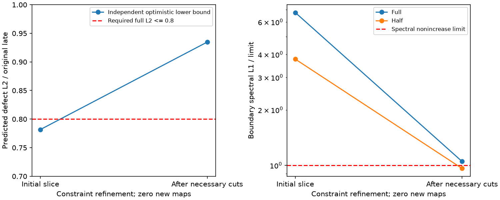

图中横轴是系数约束的两次求解，不是新辐射map或物理时间。右图给出当次极小点的谱门比，左图给出整个放宽集合的下界。70位证书针对保存的小数据，不是辐射真解误差界；第21物质步仍未接受，也不能由此判断物理大气无解。无工具CLI草稿实际模型deepseek-v4-flash[1m]，正式文本修正了“界的有效性只依赖集合包含”的不完整表述。

## 86. 完整三维空间也达不到目标，为什么这比一次优化失败更有信息

第85节提出的小数据诊断已经完成。去掉额外净边界等式以后，仍固定旧三个方向、raw权重L1上限17及full/half系数比例0.9/0.45。这里缩放的是相对锚点的位移系数；四个仿射权重不能全部直接乘0.9，否则权重之和不再为1。

完整多面体上，full和half边界分母的全域上界分别为1.0056891543456374和1.002844577172819，单位是原late出射通量尺度。用这个上界代替各点的真实分母，谱门只会变宽松。再暂时省略正性、最差单元和bolometric条件，得到的集合仍包含原来一切可能合格的点。因此，这个宽松集合若已经没有足够收益，原合格集合也不可能有。

两轮约束计算后，生产LP对偶方法给出的L2乐观下界为0.8777201062987，独立70位三维顶点枚举得到0.8777201062989。这里L2值指预测缺陷范数除以原late缺陷范数，已经无量纲化；不是有单位的场强范数。对应平方下界约0.7703925850013，高于0.64，L2下界高于0.8。最后取到的点仍不满足谱门，但排除结论来自整个较大集合的下界，不要求该点先成为物理合格候选。

这个结论比“优化器报告失败”更具体：在已保存小数据定义的模型内，旧三个方向、同上限和同步长无法完成20%收益目标。它没有证明别的方向无效，更没有证明静态或动态大气无解。由于物质和原$r_{20}$都没变，此处也没有新增耦合收敛证据。

本轮第一次计算曾被自身检查器拦下：LP返回一个约$1.8741\times10^{-13}$的正对偶乘子。问题是符号不满足证明条件，而非“数太小就不可靠”；同样小的非正乘子并不违反条件。修订版把正的数学乘子置零，保存修改前后两组，并把由此产生的全部残差计入下界。设系数约束为$A c\le b$，选取任意非正乘子$y$，则

$$
(A^{\mathsf T}y)^{\mathsf T}c\ge y^{\mathsf T}b.
$$

若目标梯度与$A^{\mathsf T}y$之差为$e$，权重约束又保证$|c_i|\le9$，就有

$$
\nabla q(c_{0})^{\mathsf T}c\ge y^{\mathsf T}b-9\sum_i|e_i|.
$$

加上第85节支撑面的常数项，就是修正后的下界。这样不需要假装LP对偶在机器算术中精确成立；补偿会使界更保守。被改变的是证明变量和界的计算，不是辐射强度、热能、布居或接受门。第二次计算在新目录完成，第一次失败证据保留。

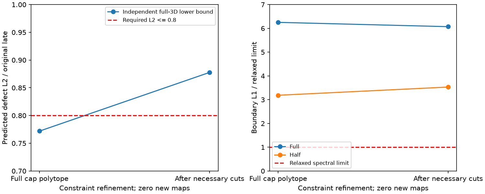

## 87. 用四张原映射测量一条更长的方向，而不是继续重复旧空间搜索

旧空间已被上述诊断排除，下一项应改变可测的搜索方向。81647使用32核、128GiB和16个映射worker，从已保留的late16出发，最多依次算到late17、18、19、20；没有物质反馈。这里的编号是同一冻结物质状态下的辐射迭代次数，不是轨道相位或物理时间层。

旧锚点$B$对应late15，旧输出$C$对应late16。新输入$X$取late19，其真实映射输出$Y$取late20。于是可以增加一个输入方向$X-B$和它对应的差缺陷

$$
d_{\rm new}=(Y-X)-(C-B).
$$

这条输入方向跨四次原迭代，可能在相同权重上限下提供更长的位移。但它也可能与旧方向近似相关，或使边界谱门仍然失败；在测量前不能宣称有用。四张完成后，将原六态加新两态做一次全频率扫描，形成5×5缺陷Gram和八条完整边界谱。原4×4子块必须与已审旧数据复现一致，防止在扩展过程中悄悄换了锚点、算子或物质状态。

本批只收集这些数据，尚不生成外推候选。后续需独立核验四张真实map及304份worker回执、端点血缘、全频组归约和可分辨性，再做扩展空间的有界判断。物理步长、原$r_{20}$、接受数20以及全部原接受门保持不变，不能把四张原映射完成写成自洽大气完成。

本两节经无工具CLI草稿后独立修订。首次CLI只输出拟调用工具的文本，没有形成草稿，未执行其中命令；重试正文的实际模型为deepseek-v4-flash[1m]。正式文本修正了对偶符号失败原因、L2归一化及位移系数与仿射权重的区别。

## 88. 长方向的价值，应由可达的候选与门来判断

第87节的81647已经完成，总墙钟37分31秒。四张原映射、304份worker回执、626份小工件及全部9632频率组的归约已独立核验。新增的第五行、第五列属于缺陷Gram，而系数只有四个：Gram第一基向量是锚点缺陷，其余四个是方向引起的缺陷变化。四方向Hessian的70位LDL主元为正，但条件数约$6.42\times10^{11}$。这意味着求系数可能对微小数值扰动敏感，不能仅凭优化器退出成功接受结果，也不能把小特征方向直接删去后仍声称测了原问题。

把四个输入方向依次记为$U_i-B$，其中$U_i$为$A,H,J,X$；它们已知的真实映射输出$V_i$依次为$B,J,K,Y$。对一组系数$c_i$，构造

$$
I_t=B+t\sum_{i=0}^{3}c_i(U_i-B),
\qquad
\widehat{\mathcal T(I_t)}=C+t\sum_{i=0}^{3}c_i(V_i-C).
$$

第二式是利用已测输入输出对形成的预测，不等于已经计算了新输入的真实映射$\mathcal T(I_t)$。预测缺陷是第二式减第一式；用它的全场内积组成Gram，就能在不再次读取几十GiB大态的情况下快速筛选系数。小数据保留了全部9632组边界谱和全场内积，不能把“小”误解为删掉了困难频率。

旧三方向空间的排除不约束新增的第四方向。即便新方向与旧方向接近，它的长度也可能使固定权重上限下的可达位移增加；但“更长”不自动意味着更准确或更符合物理。实际四维必要条件诊断64轮后给出L2下界0.762989，低于门0.8，因此没有排除这个空间。最后full谱门比却为1.0000000000020055，程序保留预算耗尽状态，没有把这个超门圆整为通过。下界回答“所有合格点至少有多大缺陷”，取到的点回答“这一个点能否过门”，两者不是同一命题。

## 89. 怎样找到一个有余量的点，而不把门改宽

随后另做一次内部点搜索：仍用原四方向、权重上限17和$t=0.9,0.45$，只是把搜索时的边界谱与bolometric目标乘0.98，并将权重半空间收紧$10^{-7}$。这里是要求搜索点比原门再低约2%，不是减少98%，也不是改动原科学接受标准。最终点依然必须按原门重新验算。

得到的raw系数约为$(-7.885546,0.110744,-0.114454,8.889256)$，五个仿射权重为

$$
w=\left(c_0,1-\sum_i c_i,c_1,c_2,c_3\right),
\qquad \sum_i|w_i|=16.9999999<17.
$$

full与half缩放的是相对$B$的位移系数，而不是把全部五个权重同时乘0.9或0.45。后一种做法会破坏权重之和为1。负的仿射权重只是组合方式，是否产生负强度必须另逐单元检查，不能从权重符号直接判定，也不能发现负强度后把它裁成零。

独立70位复算得到full、half预测L2比分别0.764603与0.880945；full需要≤0.8，half只要求相对原缺陷不增。边界谱L1相对原变化之比分别0.973728与0.835950，bolometric之比分别0.632434与0.183783。这些比值没有物理单位，原强度和通量并未被重新归一化。全9632组预测谱非负，全部可由小数据判定的原门均通过。

本轮还暴露了一个复现尺度问题。这台ARM Mac的`longdouble`实际只有float64精度，两个大通量相消后得到的half bolometric约$3.08\times10^{-9}$，与70位复算的绝对差约$9.25\times10^{-18}$。若要求复现误差小于这个微小净量再乘$10^{-9}$，会把正常的相消舍入判成不一致。现把复现余量写在原通量与系数放大的尺度上，并逐项保存差值；真正科学门仍以70位结果独立判断。这里调整的是跨算术精度的复现检查，不是把一个未过物理门的候选改成通过。原始失败记录仍保留。

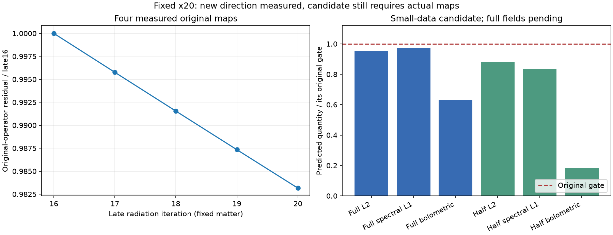

右图每项除以自身原门，所以full L2柱是0.764603/0.8，而不是0.764603本身。左图是已实际执行的原映射，右图是尚需真实映射检验的预测，不能把两张图连接成一条已经验证的加速收敛曲线。

## 90. 完整场预测、真实映射、耦合大气是三道不同的检验

81679于2026年9月30日09:08:45在anode17开始，32核、128GiB、16workers。首先扫描固定物质单柱的全部$9632\times32\times4096$强度单元。这里“完整场”只指这个频率、方向、深度网格，不是整个盘，也不是已经收敛的辐射—物质解。

截至09:18的运行报告，301个分片的完整场预测门全部通过：full/half L2比为0.764603/0.880945，Linf比为0.808067/0.904034，强度最小值为0，辐射残差、边界谱和bolometric均过原门。0来自允许的黑尾等零强度单元；程序没有用floor把负值补成0。此时作业正在写出候选。这是平台预测报告的进展，完整小归档与实际map的独立审计仍待完成。

之后full和half各执行一次原算子，得到真实输出。真实输出可能不同于第88节的线性组合预测，因此所有原门必须重算。还需检查半步真实缺陷是否接近原端点与full端点真实缺陷的平均值；其差的L2及Linf都除以原缺陷尺度，并要求≤$10^{-6}$。这只能验证本段的仿射近似，不能当作全空间定理。

即使这两张映射全部通过，最多说明这一次固定物质辐射加速有实际收益。它还没有重算H/He正式反馈、证明内层误差足够小、接受第21个物质步或完成耦合柱，更没有覆盖全盘环带和轨道相位来生成可用的$I_{\nu}$表。本批预算为最多两张map、零反馈、零物质步；physical old、phase1367、$dt=889.419892762322\,{\rm s}$和原$r_{20}$完全不变。

以上三节参考无工具CLI草稿后独立修订，实际模型deepseek-v4-flash[1m]。草稿中“谱被截断”“长方向更贴近物理”“完整场就是整盘解”等说法没有证据或概念错误，已全部纠正。代码/图/复算/CLI审阅证据见`handoff/evidence/20260930-x20-expanded-*`，执行报告见`handoff/linux-runs/2026-09-30-x20-expanded-candidate-and-validation.md`。

## 91. 真实映射已经验证加速收益，收益的对象到底是什么

第90节的81679已于2026年9月30日09:49:17完成，墙钟40分32秒。这里真正改变的是送给原辐射算子的输入强度；原物质状态、边界条件和原映射程序没有换成近似程序。但“算子没变”本身不能保证不同输入之间满足线性关系，所以仍需真实计算，而不能用组合出来的预测代替它。

固定物质状态后，把原辐射映射记为$\mathcal T$，输入强度数组记为$I$。定义辐射缺陷

$$
d(I)=\mathcal T(I)-I.
$$

它表示再执行一次原映射会改变多少，并不是已知的$I-I_\ast$；$I_\ast$是未知的不动点。除非另有经过验证的稳定性或收缩界，不能把缺陷范数当作距离真解的误差上界。这里的数组覆盖全部$9632\times32\times4096$单元，全场L2为所有单元平方和的平方根，Linf为全部单元绝对值的最大值；这两种诊断范数不是辐射能量积分。

原锚点为$B$，full输入为$I_f$，half输入为$I_h=(B+I_f)/2$。真实计算得到

$$
\frac{\|d(I_f)\|_2}{\|d(B)\|_2}=0.7646030652102698,
\qquad
\frac{\|d(I_h)\|_2}{\|d(B)\|_2}=0.8809454916579785.
$$

full将这一次映射的L2缺陷降低约23.54%，达到预先要求的至少20%收益。half的作用包含检验方向与局部仿射近似，因此它的原门只是缺陷非增，不要求也降低20%。full/half的Linf比分别0.8080673和0.9040337，说明收益没有靠让最大全场绝对变化恶化来换取。

再定义半步仿射差

$$
\epsilon_h=d(I_h)-\frac{d(B)+d(I_f)}{2}.
$$

实测$\|\epsilon_h\|_2/\|d(B)\|_2=2.1243\times10^{-9}$、$\|\epsilon_h\|_\infty/\|d(B)\|_\infty=2.2942\times10^{-9}$，都低于原门$10^{-6}$。它说明这一条已测线段上的仿射预测与真实映射十分接近，不证明任意物质状态或任意方向都如此，也不提供全算子谱半径。

边界谱L1变化相对原变化的full/half比为0.973728/0.835950，bolometric变化比为0.632434/0.183783；所有原真实门通过。这里比较的是输入与输出之间的变化，不能把0.632434解读为辐射总功率减少36.76%。原物理强度未被重新归一化，程序没有通过裁剪负值或补floor制造通过。

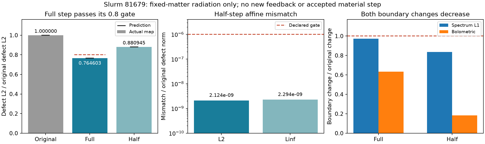

左图预测与真实值几乎重合，中图显示半步仿射差，右图显示边界变化相对原变化的比。它们是同一候选的有限试验，不是一条已经验证的长期收敛曲线。自身尺度归一化的最差频块仍为block74，full/half约0.14324/0.14332；全局残差虽已约$4.4\times10^{-7}$，却不能据此抹掉这个频块。接下来必须检验完整反馈对这种残余变化的敏感性。

这些结论来自Mac对328个小工件、152个worker回执、789个来源声明以及301个分片覆盖的全频率统计量的独立核验。大场和原算子在学校计算，Mac没有下载每份9.41GiB大态或重跑native核。独立核验的范围是工件完整性、血缘、统计归约和原门复算；不能把这个范围夸大为第二台机器重新解了一遍转移方程。

## 92. 下一步要测物质响应是否稳定，而不只看辐射缺陷下降

辐射缺陷变小后，真正需要回答的是：由辐射得到的光致电离、复合与加热，再经原物质响应计算得到的完整残差，是否也足够稳定。以前80554出现过原相邻反馈门通过、但隔八张map的物质残差仍明显漂移的情况；因此再看一对相邻态不能排除慢漂移。

81769于10:30:11在anode06启动，使用32核、128GiB和16个worker，6小时硬上限。它使用两个起点：accelerated取81679 full的真实映射输出，historical取80554 historical24的保留输出。这是两种有共同血缘的数值初值，不是两套独立物理大气。两者固定同一个$x_{20}$、physical old、phase1367、$dt=889.419892762322\,\mathrm{s}$与原$r_{20}$。

每支最多新增16张原map，顺序为accelerated8、historical8、accelerated16、historical16。第8与16张处各取两态进行正式反馈，共最多32张map、4对反馈。这里“同龄”只表示从各自起点新增的map数相同，不表示两支累计迭代龄相同。每个反馈对仍须先过原相邻辐射门、原七项反馈门与正物质响应域。

把一份物质残差按128个物质单元、每单元4个既定编码分量写成$r_{ia}$。对任意差向量$v$，使用的三种范数明确为

$$
N_2(v)=\sqrt{\sum_{i=1}^{128}\sum_{a=1}^{4}v_{ia}^2},
\qquad
N_m(v)=\sqrt{\frac{\sum_i m_i\sum_a v_{ia}^2}{\sum_i m_i}},
\qquad
N_{\max}(v)=\max_i\sqrt{\sum_a v_{ia}^2}.
$$

$m_i$是冻结的单元柱质量权重，程序单位为$\mathrm{g\,cm^{-2}}$；质量只用于第二种范数。第三种是最差单元的四分量欧氏范数，不是某一个编码分量的绝对最大值，也不是辐射Linf。所有分量均使用原编码定义，不能临时改成更有利的能量或温度变量。

例如，对同一分支的16与8窗口，分别用previous与final两个端点构造四个完整差向量

$$
v_{pq}=r^{(16,p)}-r^{(8,q)},
\qquad p,q\in\{\mathrm{previous},\mathrm{final}\}.
$$

先减512维向量，再算三种范数。若先算各自范数再相减，两个大小相同、方向相反的残差甚至会得到零，这会丢掉最重要的方向变化。

每个$k\in\{2,m,\max\}$及每个端点组合都要满足

$$
\frac{N_k(v_{pq})}{N_k(r_{20})}<10^{-3},
\qquad
\frac{N_k(v_{pq})}{S_k}<0.1.
$$

$S_k$是80195中布居扰动与控制组四种端点组合的响应差范数的最小值，已由80554声明冻结。第一个分母约束相对旧基准的漂移；第二个分母要求漂移不能淹没正在分辨的布居扰动信号。两条门是并列约束，不能因为其中一条好看就忽略另一条，也不能用本轮新残差替换分母。

第16张时还对两条初值的端点做同样的四组合比较，并检验四组跨支反馈的原电离、复合和加热门。原物理域、程序、资源或相邻反馈质量失败即停；八张窗口或跨支漂移失败则记录失败，但让另一支完成同龄点，避免只留下不对齐的比较。完成配对实验不等于门已通过。

只有四对原反馈、两支16−8窗口、16时跨初值向量差和跨反馈门全部通过，才得到待独立复核的有限窗口校准资格。即使如此，也不自动替换$r_{20}$、接受第21次物质更新或宣布严格内层误差界。accepted20仍是同一物理步内的非线性更新次数，不是20个轨道相位；耦合柱、全盘局域大气表以及可用于观测积分的$I_\nu$仍未完成。

本批参照80554的40张map、3对反馈共3小时10分，先估3—4小时；I/O、重复哈希与反馈成本可能使实际时间变化。这个估计只到本批窗口诊断，不到最终整盘光谱。

本两节先取得无工具CLI草稿，实际模型为deepseek-v4-flash[1m]，再独立修订。修订重点是：原算子没变并不逻辑保证仿射关系；缺陷不是严格真解误差；三种物质范数必须分别定义；边界变化之比不是总功率之比。草稿、图、完整数值与执行报告保存在`handoff/evidence/20260930-x20-expanded-validation-*`及`handoff/linux-runs/2026-09-30-x20-true-map-audit-and-feedback-windows.md`。

## 93. 首对反馈通过以后，为什么还必须等较长窗口

81769的accelerated分支已完成前8张原map及第一对正式H/He反馈。先把“两个结果接近”说清楚：这里首先比较的是同一分支中相邻两个辐射输入态所产生的反馈，不是两条不同初值分支的比较，也不是与未知真解的比较。令它们的完整物质残差为$r_p,r_f$，小的$N_k(r_f-r_p)$只说明这两个残差接近；两者完全可能一起停留在离零很远的位置。哪怕相隔8张map的差也小，有限窗口的实测仍不自动产生对真解的严格误差界。

首对反馈的七项原门经独立核验全部通过。光致电离三个分量的比较量最大为$3.79853\times10^{-8}$，原子、直接和formal加热的比较量约$1.69407\times10^{-6}$。这些量沿用原反馈定义和尺度；它们不是整个光谱的相对误差，也不能解释成某个物质单元对真实加热率的误差。

能量账本给出两端最小目标气体热能分别为$7.02270154\times10^{12}$和$7.02271079\times10^{12}\,\mathrm{erg\,g^{-1}}$，均为正。核验逐层重做了“旧总物质能量加$dt\,Q/\rho$得到目标总能量，再减新电离能得到可用气体热能”的账本关系，同时检查编码后的目标与残差一致。这里证明的是当前固定$x_{20}$下这两个反馈响应合法；不能撤销早期不同候选产生非正热能的历史结果。

完整残差本身仍不小。两端质量加权范数为0.2825585302和0.2825606638，而冻结的$N_m(r_{20})=0.2619104205$。它们彼此非常接近，并不等于残差接近零。独立计算的相邻两端完整向量差，在L2、质量加权、最差单元三尺度上除以原$r_{20}$范数，分别为$6.48861\times10^{-6}$、$2.58490\times10^{-5}$和$4.16877\times10^{-6}$；除以冻结80195响应信号则为0.0018100、0.0043501和0.0007050。该相邻比较满足原比较尺度，但依然不是16−8窗口。

再与旧80554 late16反馈的两端作四种组合，先减完整512维向量，再对每种范数取四组合的最大比值，结果如下：

|范数|完整差/原$r_{20}$|完整差/冻结80195信号|
|---|---:|---:|
|L2|0.0007106511|0.1982371|
|质量加权|0.0028152686|0.4737822|
|最差单元|0.0004360057|0.0737342|

第一列的比较门为0.001，质量项超门；第二列的比较门为0.1，L2和质量项超门。因此，相邻端点的接近确实不能替代与较远参考态的比较。但旧late16并不是加速seed本身的反馈，两者之间还包含改变数值初值的步骤；这份差不能冒充本轮纯迭代16−8漂移，不能据此推算每张map的漂移率，也不能单凭它判定加速改变了物理方程。

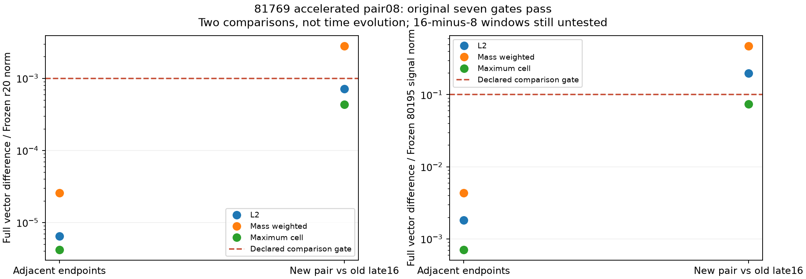

图中横轴是两种比较，不是时间。每个点都先对完整向量作差，再按第92节的三种范数计算；右侧点另取新旧端点四组合中的最大值。图没有通过相减标量范数抵消方向变化，也没有把超门项隐藏起来。

这正是驱动预先区分停止条件的原因。原七门、物理域或资源故障会立即停止；此处与旧参考的差超门只作诊断记录，允许历史初值分支完成自己的同龄检查点。接下来仍须取得两条分支各自16−8的四组合差、第16张时两支之间的四组合差和跨支率/加热门。当前只审计了一对反馈，没有评估这些最终条件，也没有接受第21次物质更新。

本次独立复核涵盖2156个小工件、608份map worker与152份feedback worker回执、全部9632频率组的逐块反馈归约和能量账本。Mac没有重算大辐射态、native核或物质ODE；率门复用了原定义，完整残差三范数和比较另作独立归约。原始归档、审计工具及证据见`handoff/audit_tools/review_x20_accelerated_pair08.py`和`handoff/evidence/20260930-x20-81769-accelerated08-review.json`。

本节参考无工具CLI草稿后独立修订，实际模型deepseek-v4-flash[1m]。草稿把长期窗口稳定说成能据此给出真解误差界，这一推论没有证据，已删除；同时纠正了把同一分支相邻端点说成不同初值比较，以及路径、SHA和数学公式的格式。有限窗口通过最多提供待独立审查的校准资格，不自动成为大气或整盘$I_\nu$解。

## 94. 两种初值各自过了原反馈门，为什么彼此仍对不上

历史初值分支也完成了第8张检查点及正式反馈。两条分支各自的原七门均通过，历史分支两个目标响应的最小气体热能为$6.7670342\times10^{12}$和$6.7748391\times10^{12}\,\mathrm{erg\,g^{-1}}$，均合法。但这并没有使两种初值的反馈可互换。必须分别比较三个对象：同一分支相邻态的率与加热；同一分支相邻态的完整物质残差；两条分支之间的完整残差与率/加热。

加速分支相邻加热比较为$1.69407\times10^{-6}$，历史分支为$1.46304\times10^{-4}$，都低于原$10^{-3}$门。然而，历史分支相邻两端的完整残差差，除以原$r_{20}$的L2、质量加权和最差单元范数，分别为0.0009038123、0.0022923492和0.0004964990，质量项超出0.001。除以冻结80195信号则为0.2521196、0.3857800和0.0839644，前两项超出0.1。因而“原反馈门通过”连“完整物质残差的相邻变化已足够小”都不能一概替代；两者检查的量与尺度不同。

对两条分支的第8张端点作四种组合，完整差向量的三种最大归一化范数为

$$
\max_{p,q}\frac{N_k(r_{H,8,p}-r_{A,8,q})}{N_k(r_{20})}
=(0.09248446,\ 0.33649423,\ 0.04539989).
$$

三个分量都超过0.001；除以冻结响应信号得到$(25.79866,56.62869,7.67771)$，也全部超过0.1。这里0.3365是“两个编码残差之差的质量加权范数，相对原$r_{20}$同一范数”的比，不是物理温度误差33.65%，也不是未知真解的相对误差。

跨初值的光致电离和复合率仍通过原门，但四种端点组合的原子、直接及formal加热全部未过；最大的加热比较量为0.022998925，约为原0.001门的23倍。由此可见，小的电离率变化与合法物质状态没有消除加热响应的历史依赖。现在只能确认这些有限迭代端点仍依赖数值初值，不能推断物理问题有多个解。

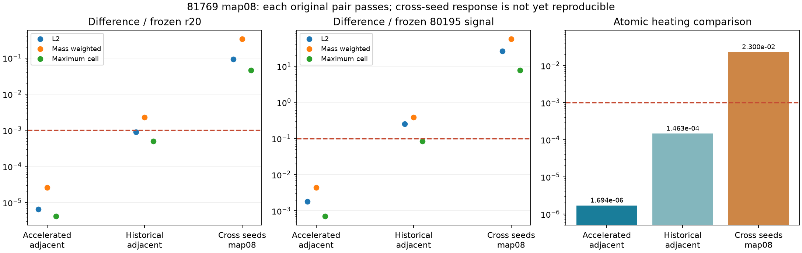

图的三类横坐标分别是加速分支相邻比较、历史分支相邻比较、第8张的跨初值比较，不是一条随时间演化的曲线。左、中图使用完整512维残差差，右图使用原加热比较定义；跨初值点取所有四种previous/final组合中的最大值。

为了进一步定位差异，只取$H8$ final与$A8$ final的完整残差之差$\Delta r$，将质量加权平方范数按编码分量分解：

$$
f_a=\frac{\sum_i m_i(\Delta r_{ia})^2}{\sum_{i,b}m_i(\Delta r_{ib})^2}.
$$

实测$f_0=0.9998518534$。核对`GroundStateLogSimplexCodec`后，第0分量是以$\mathrm{erg\,g^{-1}}$为数值单位的气体热能对数，即可写成$q_0=\ln[u_g/(1\,\mathrm{erg\,g^{-1}})]$；其余三项为$\ln(x_{\mathrm{HII}}/x_{\mathrm{HI}})$、$\ln(x_{\mathrm{HeII}}/x_{\mathrm{HeI}})$和$\ln(x_{\mathrm{HeIII}}/x_{\mathrm{HeI}})$。因此99.985%描述的是这一个端点组合的**编码差平方范数份额**。它不是温度差百分比，不是能量预算份额，也不是说某个单元承担了99.985%的差。单元索引126、127贡献较大，但未结合几何映射前，不把它们称为表层或深层。

当前证据为后续诊断指向了气体热能响应，却没有判定哪条分支更接近真解。即便历史分支的标量残差范数更接近原$r_{20}$，也不能用“看起来接近旧数值”代替物理正确性。最终仍按第92节完成两条16−8窗口和第16张跨初值比较；第8张失败在原协议中是测量结果，保持原值并继续配对，不修改门。

本轮4305个工件、1216份map worker与304份feedback worker回执完成独立核验；76个自然块共同覆盖9632个频率组，并非每块都计算9632组。审计确认了向量差和失败门的复算一致，不是说这些失败门已经通过。审计没有重做Mac上的大场、native核或物质ODE。报告和原始数值见`handoff/evidence/20260930-x20-81769-cross08-review.json`。

本节参考无工具CLI草稿后独立修订，实际模型deepseek-v4-flash[1m]。修正了草稿中“76块乘9632频率”的错误说法，以及将“审计复算一致”混写成“全部向量差通过”的歧义；第8张检查点也没有被改名为已测的八张长窗口。

## 95. 加速分支的八张窗口通过了，究竟推进了哪一步

现在加速分支A16与A8之间的窗口已通过独立复算。这两个检查点来自**同一条加速分支**，不是两种初值。物质候选、物理旧时间层、相位1367和物理步长889.419892762322秒保持不变；8和16是辐射迭代次数，previous/final也是迭代端点，不是两个新的物理时刻。此处要回答的是：再做八张原映射后，反馈给物质的完整响应是否改变得足够小。

记A16的两端残差为$r_{A,16,p}$，A8的两端为$r_{A,8,q}$，其中$p,q\in\{\mathrm{previous},\mathrm{final}\}$。对每个范数$N_k$单独计算

$$
D_k=\max_{p,q}N_k(r_{A,16,p}-r_{A,8,q}),
\qquad k\in\{2,m,\max\}.
$$

然后分别除以原$r_{20}$的同一范数和冻结信号$S_k$。三种范数具有各自的尺度，不能先把三种未经归一化的范数混取一个最大值，再共用分母。实测为：

|比较量|L2|质量加权|最差单元|必须小于|
|---|---:|---:|---:|---:|
|$D_k/N_k(r_{20})$|0.00005709038|0.00022780547|0.00003668572|0.001|
|$D_k/S_k$|0.01592544|0.03833743|0.00620403|0.1|

所有组合通过。这是比“相邻两张很接近”更长的有限窗口证据。原七门也通过，两端最小目标气体热能为$7.0227556\times10^{12}$和$7.0227598\times10^{12}\,\mathrm{erg\,g^{-1}}$，没有通过裁剪获得合法响应。

但“响应变化小”和“物质自洽”仍是两个问题。A16两端残差的质量加权范数为0.28257529和0.28257734，而原基准范数为0.26191042；这些残差并未接近零。窗口检验测量的是两个残差向量之间的距离，不是它们到零点的距离。一个几乎不动、但明显非零的残差，正是“内层响应稳定，却还需要外层物质更新”的可能状态；在决定更新之前，还要确认内层响应不受数值初值影响。

因此当前要分开保留三个判定：A16相邻反馈的原门通过；A16−A8的同支窗口通过；A16与H16的跨初值一致性尚未评估。此前A8与H8的加热比较约0.023、超原门约23倍，不能因新窗口通过而删除，也不能把旧cross8结果冒充尚未完成的cross16结果。只有历史支16−8窗口及最终跨支比较也完成并通过，才有预先定义的有限窗口校准资格；即使取得资格，也不自动替换$r_{20}$或接受第21次物质更新。

此次累计核验6447个小工件、1824份map worker和456份feedback worker回执，未在Mac重跑大辐射场或物质ODE。原始数值和范围见`handoff/evidence/20260930-x20-81769-accelerated16-review.json`。审计范围是A16/H8，不是完整32张实验；最终资格仍为未评估。可用于整盘积分的自洽$I_\nu$尚未得到，也没有模型无解的证据。

本节先取得无工具CLI草稿，再独立纠错。实际模型deepseek-v4-flash[1m]；草稿错误地把A8/A16当成两种初值，把本次同支窗口说成跨初值检验，还混合了三种未经归一化的范数。以上定义、表格与解释已按实际代码和工件重新核定，草稿不作为科学结论来源。

## 96. 完整批次结束：窗口稳定、跨初值一致与热能差来源

81769于13:28:07正常结束，32张映射和4对正式反馈完成。四对原七门、八个响应的正气体热能检查通过，最终有限窗口校准资格却失败。原因现在是已测事实：A16−A8窗口通过，H16−H8窗口和H16−A16跨初值比较均失败。原七门确实检查了相邻反馈质量与合法物理响应，但没有替代较长窗口和不同初值间的比较。

对每种范数，分别取四种previous/final端点组合的最大完整向量差，并使用原冻结尺度：

|比较|除以原$r_{20}$：L2、质量加权、最差单元|除以冻结信号：同一顺序|
|---|---|---|
|A16−A8|0.00005709、0.00022781、0.00003669|0.015925、0.038337、0.006204|
|H16−H8|0.00757290、0.02015232、0.00396268|2.11247、3.39144、0.67014|
|H16−A16|0.08697303、0.32048409、0.04379666|24.26124、53.93434、7.40658|

第一组门为0.001，第二组门为0.1。因此只有第一行全过。cross16最大原子加热比较为0.02186829，仍是原0.001门的约22倍。它比cross08的0.02299893小，但两个检查点不足以提供可靠的完成时间预测。原子率门过、气体热能正也没有消除这项差异。

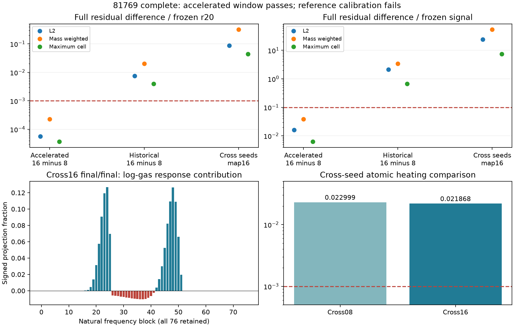

图上排使用完整编码残差的三种范数；下排左图是下面定义的带符号热能响应贡献，右图是原加热比较量。它们测量不同对象，不共享百分比解释。尤其上排横坐标是三种比较，不能连接成一条随时间演化的收敛曲线。

为了追查热能差，先固定一个端点组合，并在同一物质单元内比较两支。旧物质能量、密度和物理步长相同，因而账本给出

$$
\Delta u_g=\frac{dt}{\rho}\sum_{b=0}^{75}\Delta Q_b-\Delta u_{\rm ion}.
$$

$Q_b$是第$b$个自然频块的原子净加热，单位为$\mathrm{erg\,s^{-1}\,cm^{-3}}$；乘$dt/\rho$后是$\mathrm{erg\,g^{-1}}$。$u_{\rm ion}$是新布居的比电离能。这里的差统一取H减A，不混入旧物质态之间的差。

编码残差的第0分量是气体热能对数，其差并不等于热能差本身。因为两端气体热能均正，可在每个单元定义对数割线

$$
k_i=\frac{\ln(u_{H,i}/u_{A,i})}{u_{H,i}-u_{A,i}},
\qquad k_i=1/u_{A,i}\quad\text{当 }u_{H,i}=u_{A,i}.
$$

于是每块贡献$c_{b,i}=k_i,dt\,\Delta Q_{b,i}/\rho_i$与电离能贡献$c_{{\rm ion},i}=-k_i\Delta u_{{\rm ion},i}$严格相加成$\Delta q_{0,i}=\ln(u_{H,i}/u_{A,i})$。这不是微小扰动近似，也没有调节系数强行闭合；割线由实际两个端点唯一确定。

再把每个贡献投影到总差方向：

$$
w_b=\frac{\sum_i m_i\Delta q_{0,i}c_{b,i}}{\sum_i m_i(\Delta q_{0,i})^2}.
$$

电离能项用同样定义。所有项相加为1，但单项可以为负，甚至大于1，因为不同项可以抵消。若总差为零，份额未定义，应记为null。这是编码差方向上的无量纲投影，不是频块的物理光度占比，也不是发射效率。

cross16 final/final的最大贡献来自频块24、48、23、47、49、22、46、25，其投影依次约为0.12694、0.12635、0.11936、0.10932、0.10883、0.09069、0.08204、0.06974。图保留了中间频块的负贡献；若只画最大正项，会隐藏抵消。电离能项的投影约$-1.44\times10^{-10}$，这个组合的发射项逐位一致，分解对数闭合误差约$1.56\times10^{-15}$。这些结果将差异定位到辐射净加热响应，不能单凭它们指认热物理方程有错，或判定哪条辐射分支是真解。

下一步只扫描既有大场，令$d=H-A$，$e=[T(H)-H]-[T(A)-A]$。这样$d+e=T(H)-T(A)$，可以直接测量同一个差场经过已执行原映射后改变多少。报告$\|e\|/\|d\|$和$1+\langle d,e\rangle/\langle d,d\rangle$；后一个量只是沿当前差场的投影，不能称为严格谱半径。这里采用数组欧氏内积，没有加入频率、角度或体积积分权重，也不能称为物理能量范数。该扫描不新增map或物质步，目标是为下一次数值策略提供证据，而非再次盲延长迭代。

完整审计见`handoff/evidence/20260930-x20-81769-final-review.json`，逐频块四端点分解见`20260930-x20-81769-energy-decomposition.json`。本节先取得无工具CLI草稿（deepseek-v4-flash[1m]），再独立改正了将原七门仅描述成流程自洽、把投影数字含混称为电离能项等表述。当前仍未接受第21次物质更新，未替换$r_{20}$，也没有全柱或整盘自洽$I_\nu$。

## 97. 为什么两种初值的差异消退得这么慢，以及该怎样利用这个方向

82039的只读扫描已完成，用时5分21秒、峰值内存约367MiB，没有执行新的辐射映射。它读取了第8与第16个检查点的两支输入和既有真实输出。两检查点均处在同一个物理时间步、同一个固定物质候选$x_{20}$；这里的8和16不是轨道相位，也不是物理时刻。

先区分三个向量。$d=H-A$是两支辐射场的差，不是任一支的原映射缺陷。$r_A=T(A)-A$、$r_H=T(H)-H$分别是原映射缺陷，它们的差为$e=r_H-r_A$。直接展开便得到

$$
T(H)-T(A)=d+e.
$$

因此，$\|d+e\|/\|d\|$直接测量这两支在本次原映射后还剩多少差异。我们没有假设差异严格遵循几何衰减，也没有假设$d$是算子本征向量。范数采用原加速诊断沿用的数组欧氏内积，没有频率、角度或体积积分权重，不能解释为辐射能量。

|检查点|$\|e\|/\|d\|$|$1+\langle d,e\rangle/\langle d,d\rangle$|$\|d+e\|/\|d\|$|
|---|---:|---:|---:|
|map08|0.0091035232|0.9925054712|0.9925189250|
|map16|0.0084123987|0.9928871912|0.9928973516|

最后一列说明差场范数单map分别只下降约0.7481%和0.7103%。中间列是映射后差场在原差场方向上的投影；两列并非严格相同，说明还存在改变方向的分量。因此不能把0.9929直接叫作严格谱半径，也不能拿它计算一个有保证的完成日期。这里得到的是两个实际端点上的一步测量。

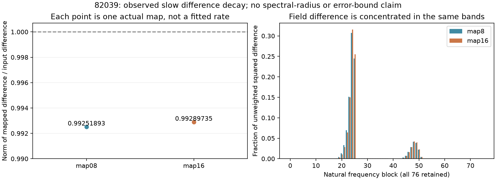

第16张时，块24与25分别占全场差平方范数31.579%和25.547%。先前主导热能编码差的八个块22–25、46–49，在这里合计占91.120%。两个独立诊断因而定位到了同一组频率区域：一边是反馈后物质热能编码的差，一边是原辐射场本身的差。两个“份额”的分母和权重不同，不能混成能量占比；相同频率区域也不证明哪个分支更接近真解。

这条慢变化方向可以用于下一次有界预测，但需要补齐信息。若试探

$$
q=A+\alpha(H-A),\qquad
p=T(A)+\alpha[T(H)-T(A)],
$$

则预测缺陷为$p-q=r_A+\alpha e$。其平方范数为

$$
\|r_A+\alpha e\|^2
=\|r_A\|^2+2\alpha\langle r_A,e\rangle+\alpha^2\|e\|^2.
$$

82039测量了$d$与$e$，却没有测量决定此最小化的$\langle r_A,e\rangle$；因此仅凭“差场保留99.29%”不能算出有根据的修正系数。下一扫描补测这个交叉内积，并逐单元建立$q\ge0$、$p\ge0$的可行区间。在已声明的$[-8,8]$范围内选一个有界最优系数，再乘0.9安全系数。此处限制的是一个全局系数，不是把负强度逐点裁掉。

随后第二遍扫描完整场，检验唯一候选是否将欧氏缺陷L2至少降低20%，最大缺陷不增，以及两项边界变化均小于0.001且不增。失败就保留失败，不能事后换门或任意试更多系数。$p$仍只是仿射预测；物理设置相同本身不证明$p=T(q)$，所以预测通过后还必须另做真实映射验证。

这一阶段没有改变物质基准$r_{20}$，没有新物质步或反馈，也不取代81769历史窗口与跨初值加热比较失败的事实。独立审计保存在`handoff/evidence/20260930-x20-82039-review.json`，完整受控预测协议为`handoff/protocols/x20-matched-chord-proposal-v1.md`。本节经过无工具CLI草稿后独立修订（deepseek-v4-flash[1m]），明确纠正了草稿将两支场差称为原算子残差的歧义。

## 98. 一条慢变化方向为什么仍不足以消除原映射缺陷

82083已经完成，程序耗时约658秒，父进程峰值内存约756MiB。它完成的是预测检验，没有执行候选真实映射。将第97节的二次式记为

$$
f(\alpha)=g_{00}+2\alpha g_{01}+\alpha^2g_{11},
\qquad g_{00}=\langle r_A,r_A\rangle,\quad g_{01}=\langle r_A,e\rangle,\quad g_{11}=\langle e,e\rangle.
$$

实际复算得到$g_{00}=5.2614189692\times10^{-10}$、$g_{01}=1.0063290915\times10^{-8}$、$g_{11}=9.9492099721\times10^{-7}$。因为$g_{11}>0$，对所有实系数求导，唯一最小点是$\alpha_*=-g_{01}/g_{11}=-0.0101146633181$。配方后得到

$$
\min_{\alpha\in\mathbb R}\frac{\|r_A+\alpha e\|}{\|r_A\|}
=\sqrt{1-\frac{g_{01}^2}{g_{00}g_{11}}}=0.8980763681>0.8.
$$

直觉是把$r_A$分成平行于$e$与垂直于$e$的两部分。调节一个系数只能消除平行部分，正交部分仍留下原范数的约89.8%。两支差场每次映射衰减得慢，并不保证其缺陷差方向与当前缺陷充分对齐。因此这次失败不能靠同一条直线上换一个系数解决。

本次系数界与全场非负约束的交集为$[-8,1]$。在最优点乘0.9安全系数后，唯一候选取$\alpha=-0.0091031969863$，预测L2比为0.8991527965，Linf比为0.8920066529。后者通过不增门，前者没有达到20%下降要求。边界L1变化从$1.1499201\times10^{-8}$增至$1.1748227\times10^{-7}$，总通量变化从$4.4679836\times10^{-9}$增至$1.1745068\times10^{-7}$，分别增大10.22倍与26.29倍。它们都低于绝对门0.001，却违反另一个独立条件“不增”；不能选较好看的门宣布通过。

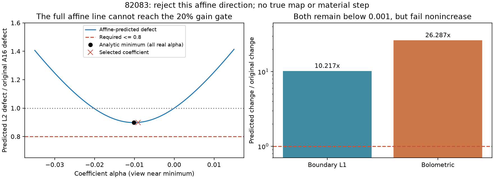

左图只是最小点附近的展示，解析最小值已覆盖所有实系数，并非靠有限网格排除其他系数。该结论约束的是$p-q=r_A+\alpha e$这个仿射预测；未知的真实$T(q)-q$并未在本批求值。于是合理决策是拒绝这条预测方向、不花算力计算这个候选的真实映射。不能进一步说真实算子在任意场都达不到收益门，或物理大气不存在。

下一步将两支第8到第16张的历史变化加入。令$A=A_{16}$，取三个输入方向$H_{16}-A_{16}$、$A_8-A_{16}$、$H_8-A_{16}$；对应缺陷差分别为$e_1=r_{H16}-r_A$、$e_2=r_{A8}-r_A$、$e_3=r_{H8}-r_A$。扩大后的预测是$r_A+\sum_{j=1}^3\alpha_j e_j$。读取已有八个输入/输出场便能计算$r_A,e_1,e_2,e_3$的完整4×4Gram，不需要先追加map。

这批只收集证据，不选系数。三方向可能近乎相关，矩阵中的小差异可能受归约精度影响；必须审计完整分片、检查病态性，不能删掉小特征值就宣称问题解决。即使扩大的预测空间能达到0.8，也只是必要条件：全场非负、边界变化、有限系数和真实算子验证仍要逐项通过。8和16仍是同一物质候选的迭代编号，不是物理时间。

审计覆盖301个Gram分片、301个预测分片、四条9632组边界谱、762项代码和19项来源声明；Mac没有重新读取约9.41GiB的大场，场身份依据学校端流式SHA与前序审计。报告为`handoff/linux-runs/2026-09-30-x20-82083-review-and-window-basis.md`。本节参考无工具CLI草稿（实际deepseek-v4-flash[1m]）后独立复算、修订，纠正了内存字段误译与可行区间含义。原$r_{20}$未换，第21次物质更新未接受，自洽整盘$I_\nu$仍未取得。

## 99. 扩大方向后的收益、系数预算和真实验证顺序

82166只读扫描在7分47秒内结束，八个既有输入/输出场的身份、完整301片统计与八条边界谱都通过独立审计。它没有做新的原映射，也没有推进物质。原来的一个修正方向不够，现在检验三个方向的组合能否更好地消除缺陷。

令$E$的三列分别为第98节的$e_1,e_2,e_3$，定义$H=E^TE$、$b=E^Tr_A$。则预测平方缺陷为

$$
f(\boldsymbol\alpha)=\|r_A\|^2+2b^T\boldsymbol\alpha+\boldsymbol\alpha^TH\boldsymbol\alpha.
$$

保存的$H$经80位LDL分解得到三个正主元。因此，对这个保存矩阵定义的问题，无约束唯一最小点满足$H\boldsymbol\alpha=-b$。三个系数为$(-0.0247854,-22.2052461,0.0202317)$，最低范数比为0.2311678，明显低于单方向的0.8980764。几何意义是：增加方向后，允许消除$r_A$在更大子空间上的投影，正交剩余变小。

但最小值不是可直接使用的候选。将场组合写成四个既有场的仿射权重，其权重和为1，而绝对值总和必须满足已注册上限17。上面的无约束点需要45.46006，超预算。因此拒绝它的原因明确是违反数值控制条件；不能笼统说它“几何上不可信”，更不能从大系数推断物理错误。

原始$H$的无穷范数条件数约$4.04\times10^6$。这个数反映求解的敏感性，但同时受到基底长度差异与方向相关性影响。不能仅凭未归一化矩阵的条件数就断言三方向近乎共线。高精度LDL保留了所有方向，减少小矩阵求解额外产生的舍入；它没有重新高精度求辐射场，也没有消除Gram输入本身的误差。

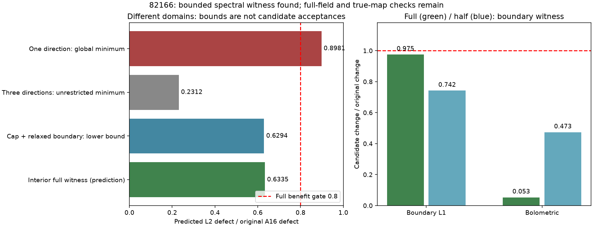

图左四条横柱有不同含义。前两条是不同空间的无约束最小值；第三条是有限系数与向外放松边界约束下的对偶下界；第四条是一个具体点的预测值。它们不是时间序列，不能连成收敛曲线。右图分别给出唯一候选full和half的边界变化，红线表示原变化大小。

加入系数上限和边界条件后，必要条件检查在52轮停为优化器未决。独立对偶下界为0.62941494，低于0.8，只说明未排除希望；它不证明可行点存在。末点的放松边界比为1.000000000041，仍在边界外，不能把显示位数舍入成1后宣布通过。全部52轮切平面与对偶余项已独立复算并保留。

随后另行声明一次内部搜索：仍保持原验收门，但把搜索用边界额度收紧至98%，把系数上限向内收1e−7。只从已记录末点出发，最多200步，实际20步得到唯一raw系数

$$
c=(-0.0418170013731,\,-7.9581829486269,\,0.0346929929605).
$$

四个仿射权重按H16、A16、A8、H8排列为$(c_1,1-\sum c_j,c_2,c_3)$，绝对值总和16.9999999。full与half采用$0.9c$和$0.45c$，70位独立重算结果为：

|检查对象|full|half|
|---|---:|---:|
|预测L2缺陷/原缺陷|0.63348607|0.81199253|
|边界L1变化/原变化|0.97511407|0.74213391|
|总通量变化/原变化|0.05304144|0.47347942|

full要求L2比不超过0.8，half只要求不增，所以两者都通过各自要求。边界谱也非负，两个边界指标均小于绝对门0.001且不增，9个小数据门全部通过。这里的“见证”指一个已经具体给出、并逐项核验这些小数据约束的点；它比“下界没排除”更强，却仍不意味着所有物理约束已检查。

下一步必须用全部频率、角度和深度检验预测场$q,p$：深层能否出现负强度、最大单元缺陷是否增大、完整场归约是否与小矩阵预测一致。只有全场预测通过后，才计算真正的$T(q)$，检查它是否接近$p$以及full/half一致性。真实辐射验证之后还要检查H/He反馈、较长窗口和原耦合物质残差。这些环节有先后依赖；不能把第一个成功的预测直接跳接成整盘$I_\nu$。

本节依据`20260930-x20-82166-review.json`及window-feasibility、window-candidate两份独立审计。CLI草稿实际deepseek-v4-flash[1m]，其中将0:0误写成异常、将旧失败下界写成看似可用、过度解释条件数等错误已独立纠正。当前原$r_{20}$仍冻结，第21次物质更新尚未接受；这次进展是找到值得完整验证的辐射候选。

## 100. 全场预测通过以后，为什么还必须计算两张真实映射

82187用7分29秒检查了完整9632频组、32方向、4096深度的预测场。独立审计逐片重组全部301片，11项预测门全部通过。full和half的L2缺陷分别降至原A16的0.633486与0.811993，最大单元缺陷降至0.689582与0.844791；四个候选/预测场的最小强度均为0，没有负值。这里没有把负数改为0；仅凭全局最小值等于0，也不能进一步断言所有零的具体位置和成因。

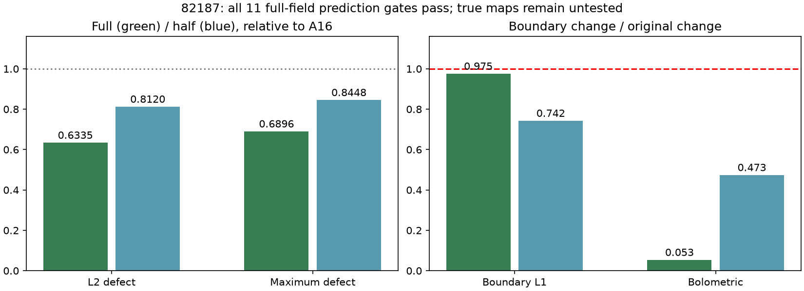

原场的最大缺陷除以全场强度尺度为$4.13366\times10^{-7}$，full与half分别为$2.85043\times10^{-7}$、$3.49204\times10^{-7}$。这些数很小，但它们测的是相邻映射或仿射预测的缺陷，不是场距真解的严格误差。慢收敛方向能让缺陷很小而场仍与不动点有距离；前面的跨初值反馈差异已经说明不能混淆这两件事。

目前用已有真实输入输出对构造了

$$
q=A+\sum_jc_j(X_j-A),\qquad
p=T(A)+\sum_jc_j[T(X_j)-T(A)].
$$

82187检查的是$q,p$及$p-q$。真实算子验证则要把$q$重新送入原代码，得到$T(q)$。若$T$在此范围完全仿射，两者理论上相等；但原实现的迭代精度、状态依赖和浮点运算是否在本次候选上保持这种一致性，需要实际测量。不能因物质固定就跳过，也不必先断言该算子一定非线性。

下一批只计算两个输入：完整位移$q_f=q$和半位移$q_h=(A+q_f)/2$。它们共用同一物质$x_{20}$、物理旧时间层、相位1367、步长889.419892762322秒与原$r_{20}$。特别是当前基准是A16及其真实输出，不能把旧程序中其他历史态的数组索引直接搬来。

真实缺陷定义为$R_f=T(q_f)-q_f$、$R_h=T(q_h)-q_h$、$R_A=T(A)-A$。首先按原门检查full的L2至少下降20%、half不增，两者最大缺陷和边界变化不增。其次计算

$$
D_h=R_h-\tfrac12R_A-\tfrac12R_f.
$$

要求$D_h$的L2、Linf分别除以$R_A$的对应范数不超过$10^{-6}$。这检验原输入、full与half之间的中点一致性。仅此还不能排除两个真实输出共同偏离旧方向预测，因此另外直接计算

$$
E_f=T(q_f)-p_f,\qquad
E_h=T(q_h)-p_h,\qquad
p_h=\tfrac12T(A)+\tfrac12p_f.
$$

两种误差在L2和Linf上也都以原A16缺陷归一化，分别要求不超过$10^{-6}$。这里是额外检查，没有放宽原门，也没有用调整后的尺度替换$r_{20}$。

32核批次限2小时、16个worker、最多两张真实map；源码、输入、候选SHA与worker回执都冻结保留。真正运行完成之前，这些只是执行和验收约定。即使全部通过，结论也仅是“本次固定物质的辐射加速经真实算子验证”；之后还需H/He反馈、较长窗口与原耦合物质残差。它不会自动成为第21次已接受物质更新，更不是整盘角分辨$I_\nu$表。

独立审计见`handoff/evidence/20260930-x20-82187-review.json`；本机核了1528条代码声明（含继承重复项）与20条来源声明，未重算大场。讲义参考无工具CLI草稿（实际deepseek-v4-flash[1m]）后独立修订，纠正了草稿将零无依据称为截断产物的说法。所有历史反馈和耦合失败仍保留。

## 101. 真实映射通过了，但反馈窗口为什么仍不能跳过

82214已经完成，Slurm墙钟43分36秒。独立审计核了325份小工件、152份worker回执和完整频组统计，16项门全部通过。这里的进展可以准确表述为：上一节构造的辐射候选，实际送入原算子后，仍具有预期的缺陷下降和边界稳定性。它没有改变物质$x_{20}$、物理旧时间层、相位1367或步长889.419892762322秒。

先把三个对象分开。$T$是固定物质条件下的一次辐射更新规则；$q$是辐射场；$R(q)=T(q)-q$是映射缺陷。如果存在不动点$q_*$，真解误差是$q-q_*$。场、缺陷和场误差具有相同单位，但含义不同；$T$本身是算子，不是第三个同类数值。小缺陷并不自动给出小真解误差，除非另有足够强的稳定性或收缩界。此前两种辐射初值产生不同物质响应，正是必须保留这个区分的实际理由。

本次full的真实L2缺陷为原A16的0.63348607，最差分量为0.68958190；half对应0.81199253和0.84479095。full要求L2至少减少20%，half只要求不增，二者均过各自门。边界谱L1变化为原来的0.97511407与0.74213391；总通量变化为0.05304146与0.47347941。后两项比较的是相邻场的边界变化，不是辐射光度本身降低到这些比例。

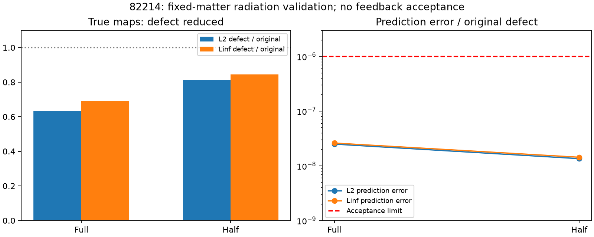

还要确认预测$p_f,p_h$没有“算对了诊断、算错了算子”。实际误差定义为$E_f=T(q_f)-p_f$、$E_h=T(q_h)-p_h$。它们的L2分别除以原缺陷$R_A$的L2，为$2.48901\times10^{-8}$和$1.35078\times10^{-8}$；Linf分别除以$R_A$的Linf，为$2.60492\times10^{-8}$和$1.43270\times10^{-8}$，均低于$10^{-6}$。分母不是“基准预测误差”，而是冻结的原映射缺陷。中点一致性量$R_h-(R_A+R_f)/2$也过门。这验证本次有限候选的预测一致性，不证明整个算子空间都仿射。

下一批因此可以采用真实输出$T(q_f)$作辐射初值。另一支采用81769历史分支第16张map的真实输出，两支物质状态完全一致。这两个数值初值有关联，并不是统计独立样本；但仍可以测试本次有限迭代后物质反馈是否残留初值依赖。这个跨初值反馈比较与前面的仿射一致性量是不同实验，不应都叫affinity检验。

每支各续16张map，在新增第8和第16张时，对连续两个辐射端点重做正式H/He反馈和物质响应。每条分支内部比较16对8的四种端点组合，两条分支之间比较同一窗口的四种组合。先对完整512维物质残差向量作差，再计算L2、质量加权和最差单元四分量范数，同时除以冻结$r_{20}$及原80195响应信号，不能用两个标量范数相减代替。已有七个反馈门与正气体热能条件仍逐项执行。

为何同时需要窗口和跨初值？一条分支的8到16变化很小，只说明这段有限迭代的变化小；两个初值最后仍可能停在相隔较远的位置。反过来，两个初值暂时接近，也不能排除两者随后一起漂移。因此两条窗口、跨初值完整向量以及率和加热比较都必须保留。只有全部过门，才得到可继续独立审查的有限窗口校准资格；仍不能自动替换$r_{20}$或接受第21次物质更新。

本批上限32张map、4对反馈、6小时，32核128GiB、16worker；原反馈质量、物理域、程序或资源硬失败立即停，普通窗口漂移失败保留并完成另一支配对端点。旧同规模批次约3小时只是运行计划参考，不是自洽大气交付时刻。自洽代表柱、全盘状态覆盖及角分辨$I_\nu$仍是后续不同层次的工作。

本节依据`20260930-x20-window-validation-review.json`。无工具CLI草稿实际模型为deepseek-v4-flash[1m]；独立修订纠正了“缺陷与真解误差单位不同”“预测误差使用自身作分母”及把跨初值反馈等同affinity的错误，原草稿保留。审计工具路径类型错误已单独记录并修复，数值数据与科学门未改。

## 102. 第一对反馈通过：什么稳定了，什么仍没有解决

82273的加速分支完成8张新map后，两个相邻辐射端点都已计算正式H/He反馈。不可变归档在Mac独立复核：原七项门全部通过，两个目标物质响应的最小气体热能分别为$7.0227469\times10^{12}$、$7.0227482\times10^{12}\ \mathrm{erg\,g^{-1}}$，都为正。这说明本次物质响应没有越出正热能域；它并不说明响应已经等于输入物质。

反馈稳定性比较中的`volume_l1`是无量纲的相对变化。对两个深度数组$A_i,B_i$，代码计算

$$
\delta_{V,1}(A,B)=
\frac{\sum_i\Delta z_i\,|B_i-A_i|}
{\sum_i\Delta z_i\,\max(|A_i|,|B_i|)}.
$$

这里分母先在每个深度取较大绝对值，再求和；它不同于先各自求和后取最大。多分量率分别计算，不能先把分量抵消。此次光致电离相对差的最大分量为$9.84264\times10^{-9}$，总复合为$2.50017\times10^{-11}$，原子、直接与形式加热均约$4.07686\times10^{-7}$，都低于$10^{-3}$。这些是相对差，没有光致电离率或加热率本身的单位。

然而，同样两个端点的物质残差质量范数约为0.282833，而原$r_{20}$的质量范数为0.261910。当前范数约为原值的1.079885倍，仍明显非零。物质残差在这里表达“本次辐射驱动的物质响应与冻结输入$x_{20}$不一致”；两个相邻端点给出几乎一样的非零残差，完全可能发生。换句话说，一次测量重复得很稳定，并不意味着测得的偏离已经消失。

还必须分清两个不同的“变化”。第一种是本对previous与final的完整512维残差向量差；第二种是本对与旧81769 accelerated pair16的差。二者都先作向量差，再分别计算L2、质量加权、最差单元的四分量范数。质量范数结果如下：

|比较|差向量范数/原$r_{20}$范数|差向量范数/冻结响应信号|
|---|---:|---:|
|本次两个相邻端点|$6.14956\times10^{-6}$|0.00103491|
|本次与旧A16，四端点组合最大值|0.00299219|0.50355671|
|参考门|0.001|0.1|

前者全部低于门，后者超过门。这没有矛盾：相邻端点非常接近，并不要求它们接近更早的反馈。新旧比较跨过了82214辐射加速及后续8张map；因此，它不是本轮第16张与第8张的窗口漂移，也不是直接测量加速初值本身的反馈。不能单凭这个差异指定新旧哪一个正确，更不能把它当成已证明物理无解。

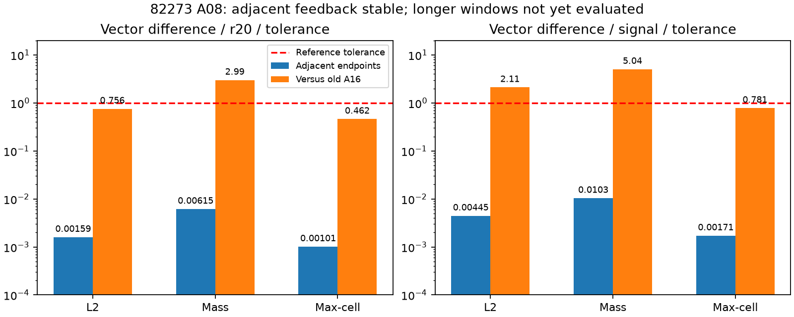

图中每个柱值又除以相应参考门，所以红线1表示过门边界。蓝色是相邻端点，橙色是相对旧A16；每个指标均保留四端点组合中的最大值。三个位置是三种范数，不是深度、频率或时间。图不显示光度，也不据这些柱子推算完成时间。

当前只有四对预算中的第一对完成独立审计。第8张的跨初值比较、两支各自16−8窗口和第16张的跨初值率/加热检验仍是后续必需证据。最终校准资格因此记录为`null`，含义是尚未评估；不能把它写成失败，也不能由首对通过补成成功。原$r_{20}$、步长和物理旧时间层不变，仍只有20次已接受的同一物理步内非线性更新。

审计核了2154份文件、608份map进程回执和152份反馈进程回执；原率门复用原核，完整向量归约独立完成，Mac没有重新积分物质ODE或辐射大场。CLI草稿实际模型为deepseek-v4-flash[1m]；本节纠正其将`volume_l1`说成具有体积积分量纲的错误。结论限定为“首对相邻反馈与响应合法性通过”，自洽代表柱和整盘$I_\nu$尚未得到。

## 103. 两条历史各自过门，为什么相互之间仍不一致

82273的A、H两支都完成了8张新map及相邻两态正式反馈。A从经过真实映射检验的加速输出起跑，H延续既有辐射历史；物质状态$x_{20}$、物理旧时间层、步长与反馈定义完全相同。两对原七门分别通过，四个目标气体热能都为正。但两种初值产生的物质响应仍明显不同。

这里需要准确区分“反馈率比较”和“物质响应向量比较”。原七门中的率/加热项检查光致电离、复合与三种加热的深度加权相对变化；它们不是逐点误差门。随后物质响应求解产生128个单元、每单元4个编码变量，共512个残差分量。三个范数是对这同一个512维向量的不同归约，并不是向量只有三个分量。

设$v_{ia}$为第$i$个单元的第$a$个编码残差，$m_i$为单元质量，则本项目实际计算

$$
\|v\|_2=\left(\sum_{i,a}v_{ia}^2\right)^{1/2},\qquad
\|v\|_m=\left(\frac{\sum_i m_i\sum_a v_{ia}^2}{\sum_i m_i}\right)^{1/2},\qquad
\|v\|_{\mathrm{maxcell}}=\max_i\left(\sum_a v_{ia}^2\right)^{1/2}.
$$

最后一项是最差单元的四分量欧氏范数。此前A08图将其误标为`Linf`，现已修正为`Max-cell`。计算程序和JSON一直使用上式，旧数值与判决没有改变。辐射大数组的逐分量Linf是另一种量，仍沿用其原定义。

比较两组物质响应时，先算$v^{(1)}-v^{(2)}$再取范数。不能用$\|v^{(1)}\|-\|v^{(2)}\|$替代；后者会丢失向量方向差异。本次A的final质量残差为0.2828331，H为0.2650308，虽然H的范数较小，也不能因此认定H是真解或把它提升为基准。

以质量范数为例，完整差向量的结果如下，跨组均保留previous/final四种组合并取最大：

|对象|差向量范数/原$r_{20}$范数|差向量范数/冻结80195响应信号|
|---|---:|---:|
|A相邻端点|0.00000614956|0.00103491|
|H相邻端点|0.00210915|0.35495003|
|两支相互比较|0.30724441|51.70622858|
|参考门|0.001|0.1|

A相邻比较通过；H相邻比较已经超过参考尺度；跨初值差异则更大。H原七门仍过并不矛盾：其相邻原子加热相对变化约$1.42505\times10^{-4}$，低于$10^{-3}$；但这个率级条件并不数学上保证经过物质响应后完整编码向量差也小于另一套更严格的尺度。本结果支持“当前物质反馈对辐射历史仍敏感”，尚未单独证明敏感性的全部成因。

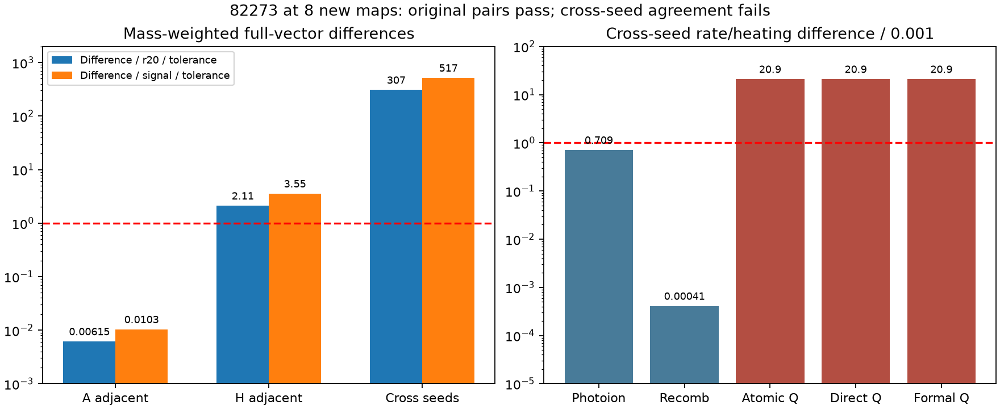

图左将质量差再除以对应参考门。H相邻两柱约为门的2.11和3.55倍，跨初值为307和517倍。图右是跨初值的率/加热检验：光致电离与复合仍通过，三种加热相对差均约0.0209307，为$10^{-3}$门的20.93倍。它们是归一化诊断差，不能读成整盘光度的变化比例。

在final/final跨初值差中，质量平方范数的99.9861%位于$q_0$，即log gas thermal energy分量。这只是差向量由哪些编码变量组成的定位，不是气体能量份额、发射光度份额，也不是误差的严格上界。

继续跑剩余窗口的理由来自预先声明的实验设计：第8张跨初值比较用于测量，只有第16张以及两支各自16−8变化齐备后，才评估最终资格。现在继续的是已授权的32张总预算，不是看到失败后临时延长或改门。当前资格仍为`null`，跨初值失败照实保留；没有第21次物质更新，没有新的基态替换，也没有模型多解或无解的证明。

本节依据`20260930-x20-82273-cross08-review.json`，核4303份文件、1216份map与304份反馈回执。CLI草稿实际deepseek-v4-flash[1m]，其把A对旧反馈的差误作A相邻差、把512维响应写成三分量、把深度加权率门写成逐点门等错误已独立纠正。

## 104. 一条分支八张后几乎不变，究竟验证了什么

82273的加速支A已完成第16张。第8张与第16张各自保留previous/final两份正式反馈，比较时共有四种端点组合。对每种组合，先取128单元×4编码变量的完整残差向量差，再分别计算上一节定义的三种范数；不能对三个标量范数相减。

设固定物质输入为$x_{20}$，辐射场为$J$，由该辐射计算的编码物质响应残差记为$R(J;x_{20})$。这里有两个不同问题：

$$
\text{窗口漂移：}\quad \left\|R(J_{16};x_{20})-R(J_8;x_{20})\right\|,
\qquad
\text{耦合残差：}\quad \left\|R(J_{16};x_{20})\right\|.
$$

前者询问“再算八张后，得到的响应改变多少”；后者询问“这个响应距离当前物质输入所要求的一致状态还有多远”。本次A支窗口质量差除以原$r_{20}$质量范数，四组合最大为$5.7625814\times10^{-5}$，低于0.001；除以冻结80195响应信号为0.00969786，低于0.1。L2与Max-cell在两套尺度上也全部通过。因此可以说：在这段有限窗口内，A支的响应变化满足了预先声明的稳定条件。

但A16 final的质量残差为0.282836994，原$r_{20}$质量范数为0.261910420。后一个数字是固定参照范数本身，不是把前一个数字归一化后的结果。二者之比仍大于1。窗口差很小并没有让耦合残差变成零；只有在可信辐射反馈之上继续求解物质固定点，才可能消除这类不一致。当前并没有接受第21次物质更新。

另一个常见误读是把“相邻稳定”称为“前后两态自洽”。本次相邻加热差约$4.32089\times10^{-7}$，质量响应差/r20约$6.63429\times10^{-6}$，确实小，但它们仅说明相邻测量接近，不能证明任一端点已是耦合解。两次相近的偏差仍然可以一起偏离目标。有限窗口也不能排除更长时间尺度的缓慢变化，因此不是剩余误差的严格上界。

本节证据是`20260930-x20-82273-accelerated16-review.json`所绑定的A16/H8不可变快照，核6445文件、1824份map回执和456份反馈回执；三对原七门与六个气体热能正值检查均通过。该快照尚无H16，最终校准资格为`null`；最终跨初值一致性需另审。这里的16、8是固定物质下的数值迭代次数，不是物理时间步。

CLI草稿实际模型为deepseek-v4-flash[1m]。本节独立纠正了“归一后r20”“变化小说明没走偏”“相邻两态已自洽”三处表达。它们不是代码数值错误，但会把数值稳定性误讲成物理解的正确性。

## 105. 完整实验结束后，为何暂时停止增加map

82273已于2026年9月30日23:20:42结束，用时3小时10分38秒。两支各16张，合计32张辐射map、4对正式反馈；没有新物质更新。完整归档独立审计通过，8588文件、2432份map进程回执和608份反馈进程回执齐全。四对各自原七门通过，八个响应的目标气体热能均正。但最终参考校准资格为`false`。

这里没有互相冲突的判决。原七门检查各对反馈率/加热及相关物理合法性；最终资格还要求同支16−8窗口和跨初值一致。加速支A的窗口通过是一个真实结果，不能因为最终失败便叫它“假象”。历史支H的窗口没有通过；跨初值差也仍大。以质量范数为例：

|完整向量差，四组合最大|除以原$r_{20}$范数|除以冻结信号|
|---|---:|---:|
|A16−A8|0.000057626|0.009697861|
|H16−H8|0.018604568|3.130966888|
|H16−A16|0.291428384|49.044546823|
|相应门|0.001|0.1|

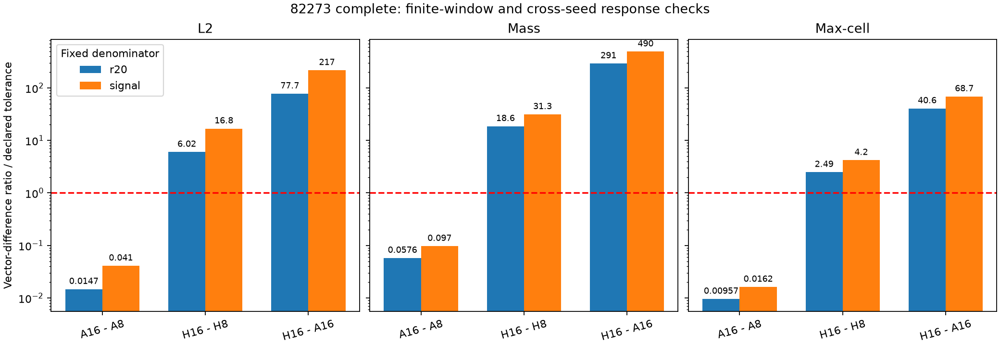

图上每根柱又除以表中相应门，所以红线1才是合格边界。跨初值的质量项超过门约291倍、490倍；不是说物理光度相差291倍。三种加热相对差约0.01983051，低于第8张的0.02093070，但仍为0.001门的19.83倍。光致电离与复合比较通过，不能据此省略加热失败。

为何既不能选A，也不能选H？A的有限窗口稳定未证明其剩余误差小；H16的残差质量范数0.265540确实小于A的0.282837，但这个排序未证明哪一份辐射反馈更接近目标固定点。共同物质状态下两份反馈尚未一致，提前指定其中一个为“真值”会把尚未控制的内层差异带进后续物质更新。目标气体热能为正只保证这一项物理域条件，不能解释成“更新方向正确”。

逐频块能量账本还能缩小排查范围。固定物理旧时间层、密度与步长时，两响应之差满足

$$
\Delta u_g=\frac{\Delta t}{\rho}\sum_b\Delta Q_b-\Delta u_{\rm ion}.
$$

把各项通过正气体能量的对数割线映到$q_0=\log u_g$，再按质量内积投影到总$q_0$差，可逐块核对闭合。cross16 final/final的编码差质量平方范数约99.9863%在$q_0$；主要投影块仍为24、48、23、49、47、22、46、25。发射项逐位相同，电离能项的投影约$-1.15\times10^{-10}$，对数闭合误差约$2.37\times10^{-15}$。这是编码差的有符号分解，不能当作辐射功率或能量份额；负贡献完整保留。

因此下一项计算先不增加map，而读取已经保存的两支输入输出：记差场$d=H-A$，记残差差$e=[T(H)-H]-[T(A)-A]$，则映射后的差场为$d+e$。扫描直接测量$\|d+e\|/\|d\|$与$1+\langle d,e\rangle/\langle d,d\rangle$，并保留76频块，回答“当前这份差异经过一次真实映射还剩多少”。后一项是沿$d$的投影，只有额外条件成立才可解释成特征值；当前并没有那些证明。数组欧氏内积也不是物理能量内积。

扫描用默认4核、16GiB、1小时硬预算，只读8份既有场，不生成候选、不追加反馈。结果再与82039的旧端点同定义统计比较。旧端点不能代表这次经过新加速和16张演化后的差场；本次复测的必要性就在这里。它将帮助选择下一项有限数值策略，不能自行给出自洽大气或模型无解结论。

本节依据完整审计和`20260930-x20-82273-energy-decomposition.json`。CLI草稿实际deepseek-v4-flash[1m]；已纠正“正热能说明方向正确”“A窗口通过只是度量假象”和“范数小不等于残差小”的错误表述。科学边界是反馈尚未得到可信共同校准，而非已经证明物理模型不存在解。

## 106. 为什么知道“每次只降0.655%”仍不能直接算加速系数

只读扫描82396已完成并独立复核，用时12分钟，无新增map、反馈或物质步。两条辐射历史分别为A、H，原映射为$T$。定义各支映射残差$r_A=T(A)-A$、$r_H=T(H)-H$，以及两支差场$d=H-A$、残差差$e=r_H-r_A$。于是

$$
T(H)-T(A)=d+e.
$$

$d$表示两支距离多远，$r_A$表示A距原映射不动点的缺陷；它们不是同一个量。本次第16张测得$\|d+e\|/\|d\|=0.9934512446$，即一次映射仅消去当前差场范数约0.6548755%。旧81769端点的同定义比值为0.9928973516，消去约0.7102648%。这些是不同端点上的实测作用，不能当作固定不变的收敛率外推数百张后的时间。

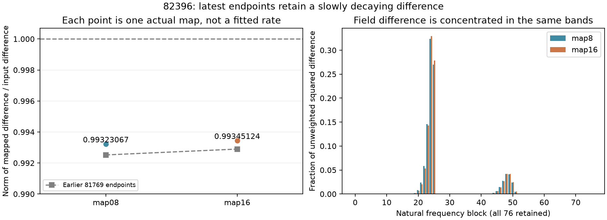

图左实点来自当前82273端点，灰色方点来自旧81769端点；map8、map16是各轮数值窗口编号，不表示相同总历史长度或物理时间。图右保留全部76块。块22–25、46–49合计占最新第16张差场平方范数92.9755%，与先前热响应差的重要频率区域一致。这只是定位上的对应，不能读成它们贡献92.9755%的能量或光度。

为何不直接乘$1/(1-0.99345)$？这个数字来自$d$的一次作用，既未证明$d$是本征向量，也没有给出待修正的$r_A$在各方向上的投影。即使暂时只考虑一个仿射预测方向

$$
q(\alpha)=A+\alpha(H-A),\qquad p(\alpha)=T(A)+\alpha[T(H)-T(A)],
$$

预测缺陷也应写为$p-q=r_A+\alpha e$。若忽略正值域与系数边界，它的欧氏平方范数最优条件给出

$$
\alpha_*=-\frac{\langle r_A,e\rangle}{\langle e,e\rangle},\qquad \langle e,e\rangle>0.
$$

82396只收集了$\langle d,d\rangle$、$\langle d,e\rangle$、$\langle e,e\rangle$，缺少分子$\langle r_A,e\rangle$。因此已知衰减缓慢并不能决定校正方向和幅度。若$e=0$，上式不定义；不能加一个人为小数到分母后照算。即便算出$\alpha_*$，还须满足候选强度非负、系数幅度约束以及其他原科学门。$p$此时只是预测，尚未证明等于$T(q)$。

下一项单遍扫描补齐最新A16、H16、A8、H8四份缺陷组成的4×4Gram，并保留每32频组的全部统计。因此既能重组一个全局矩阵，也能按76自然频块重组局部矩阵，比较统一系数和分频块系数是否存在值得验证的有界下降方向。各局部仿射组合仍要求系数绝对值和不超过17；不通过丢弃小方向或强度裁剪制造改善。它只读8份已有大场，不写候选、不增加反馈或物质更新。

矩阵收集完成仍需独立核验；预测可行也必须再做全场和真实映射验证。当前支持的结论是“残留历史差异消退很慢，且需要当前残差投影才能设计下一步”，不是“大气已经收敛”或“模型不存在解”。本节依据`20260930-x20-window-difference-82396-review.json`，CLI草稿实际deepseek-v4-flash[1m]；独立补全了上述定义与推导，没有把射线作用升格为谱半径。

## 107. 从一个共同加速系数，走到有界的分频块预测

82441已完成并通过独立审计。它没有产生新辐射态，而是把最新四对输入输出的残差内积补齐。现在可以回答上一节尚不能回答的问题：在这些已有方向构成的范围内，预测缺陷最多能下降多少？这里的“缺陷”始终是固定物质下的辐射映射缺陷$T(J)-J$，不是512维物质响应残差。

以A16为锚点，另外三个输入为H16、A8、H8。设它们的缺陷差为$e_1,e_2,e_3$，锚点缺陷为$r_0$，预测目标为

$$
\left\|r_0+\sum_{j=1}^3\alpha_j e_j\right\|_2^2
=\begin{bmatrix}1&\boldsymbol\alpha^T\end{bmatrix}
G\begin{bmatrix}1\\\boldsymbol\alpha\end{bmatrix}.
$$

每组仿射权重为$w=(1-\sum_j\alpha_j,\alpha_1,\alpha_2,\alpha_3)$，要求$\sum_i|w_i|\le17$。权重有符号，允许外推；上限限制的是外推组合幅度，并不自动保证每个辐射强度非负。

此前让所有频率共用三个系数。此次比较另一种数值策略：按76个既有自然频块分别选三个系数，但每组权重仍满足同一上限。每块都保留全部角度和深度，不删频率，不改变物质、物理步长或原传输核。自由度增加可以改善二次预测，但也必须重新检查全场与真实映射，不能预设分块组合仍给出精确算子输出。

本次把每个已存binary64矩阵元素视为它所代表的精确有理数，用原样矩阵求解；没有截小特征值或加正则化。另一段不调用求解器的代码，用精确主子式和凸支撑面独立验证最优性。在凸二次问题中，一个可行点的目标值是上界，梯度在约束多面体上的最小支撑值给下界；两者相等，便是这个存储矩阵问题的最优性证书。这仍不消除产生矩阵时的浮点累加误差，也不是原场或物理模型的精确误差界。

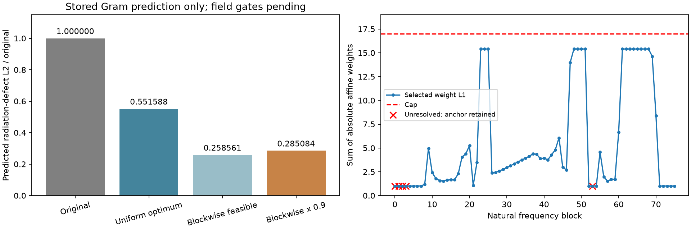

统一系数的最优预测L2比为0.5515885。逐块求解中，65块最优性获证，6块Gram全零；另5块0、1、2、3、53出现非正Hessian主元，无法按该严格凸求解路径判定。它们保留原锚点，即三个系数全为零，原残差贡献全部计入。这5块占原缺陷平方范数约$3.6883\times10^{-29}$，很小，但“小”不是把它们删掉或把失败改成成功的理由。

因此不能称为“76块总最优”。能说的是：在未解决块保持锚点的这份可行系数组合下，二次预测L2比为0.2585609；每块系数再乘精确的0.9，预测比为0.2850841。图中“可行”仅指系数约束可行。真正全场程序将把这些系数正确舍入为binary64，逐单元检查候选及预测输出，再对照矩阵预测。

下一批4核计算只检查这一份候选和half：强度是否有限非负、full缺陷L2比是否不超过0.8、half是否不增、最差分量Linf及边界谱是否满足原门。负强度直接保留并拒绝，不能裁剪成零。即使这些预测门全过，还需要32核full/half真实映射以及随后的正式反馈，才能判断这条数值策略是否真正推进了原问题。

这里没有新物质更新，也没有自洽大气或整盘$I_\nu$。本节来自`20261001-x20-82441-bounded-gram-analysis.json`和独立verification；CLI草稿实际deepseek-v4-flash[1m]，主要数据核对一致，本节补足了上下界证书、有限精度范围、未解决块保留及真实映射条件。

## 108. 总残差下降，为什么候选仍会被拒绝？

82472把上一节的系数放回完整场检查，结果正常执行结束，但候选失败。第65频块的4个连续片中，full输入和预测输出出现负强度，half没有。第一片最负约$-5.904\times10^{-56}$，锚点该片尺度约$3.253\times10^{-55}$。绝对数很小，却相当于局部尺度的18%，不是可以忽略的相对舍入扰动。辐射强度非负是逐单元条件；全局平方和再小，也不能抵消一个单元的负强度。

此次完整扫描保留全部301片，独立审计用源Gram、边界谱和实际舍入系数重算，与扫描统计一致。因此有证据说“这份外推系数不合法”，没有证据说“传输代码崩溃”或“物理大气不存在”。原生产判定只评估非负门，其余门没有补记为通过。

先试一个无需重读大场的修改：仅第65块改用已经测过的half，其余块保持full。拼接原统计得到全场缺陷L2比0.285084、Linf比0.293662，说明内部缺陷确实可下降。但边界L1变化从$6.864247\times10^{-9}$升到$1.385397\times10^{-8}$，总通量相对变化从$1.805044\times10^{-9}$升到$9.022950\times10^{-9}$，仍违反原“不增加”条件。这是新拼接方案的筛查，不是改写82472未评估的门。

这里两类量观察的是不同对象。内部L2把所有频率、方向、深度的映射缺陷平方累加；边界指标先把出射角积分得到每组表面谱，再检查其变化。对输入/预测输出边界谱$F_g$、$P_g$，本实验采用

$$
B_{L1}=\frac{\sum_g|P_g-F_g|}{\max(\sum_g P_g,\sum_g F_g)},\qquad
B_{\rm bol}=\frac{|\sum_g(P_g-F_g)|}{\max(\sum_g P_g,\sum_g F_g)}.
$$

这里的谱数组已含原几何规定的频组宽度。后者允许正负变化相消，前者先取绝对值。因此内部平方和下降不必带来边界变化下降，更不必保持原有的通量抵消。此次没有因边界变化绝对小而放宽“不增加”门，也没有为已知失败的拼接方案再启动扫描。

接着把边界条件放进选点过程。记每块锚点为$A_b$，上述已测非负端点为$C_b$，只考虑

$$
Q_b(t_b)=(1-t_b)A_b+t_b C_b,\qquad 0\le t_b\le1.
$$

预测输出用相同$t_b$插值。这一范围在精确算术下保持两个端点的非负性，并保持原仿射权重上限17；实际浮点运算仍须逐单元重验。用76个$t_b$降低总平方缺陷，同时限制完整边界谱及总通量变化，不删除任何频块。

这次SLSQP只允许一个起点和200次迭代，最后达到迭代限，优化没有收敛。内部还要求比原边界变化留5%余量，但末点的L1内部约束有约$1.8557\times10^{-7}$的归一化超量，不能说严格达到内部余量。原失败记录完整保留，没有延长该次搜索，也没有把末点叫作最优解。

另一个可独立回答的问题是：这个有限末点是否满足原科学预测条件？最优性要求证明没有更好的点；候选可行性只要求这个点满足既定条件。后者不依赖优化器宣布收敛，但必须直接检查。独立程序核对范围、来源、精确有理数系数上限，并用80位Decimal复算，得到full/half L2比0.422420/0.668799；边界L1为$6.521033\times10^{-9}$/$5.829203\times10^{-9}$，总通量指标为$1.714791\times10^{-9}$/$1.759918\times10^{-9}$，均低于原锚点。

因此另立的判断仅是“这个有限点值得做一次全场预测检查”。它没有改写优化失败，也没有接受辐射态。下一次4核全场检查实际非负、Linf和所有原门；通过并独立复核后，才做32核真实映射，再检查正式反馈。当前仍固定x20、原物理旧层、物理步长和r20，0新物质更新，尚无可用于整盘观测的自洽$I_\nu$。

本节依据82472独立审计、block65拼接筛查、失败优化记录和另立可行性记录。CLI草稿实际deepseek-v4-flash[1m]；独立审阅删除了无依据的“放宽必须同时新增门”说法，补明具体未评估门、两种范数、内部余量与原科学门，以及预测和真实映射的区别。

## 109. 全场预测通过后，还缺哪一次真正的检验？

82486已完成上一节留下的检查。候选和预测输出的所有单元都有限非负；full/half缺陷L2比为0.422420/0.668799，Linf比为0.499136/0.646831。边界L1和总通量变化均低于原锚点，全部11项预测门通过。独立审计重组了301片统计，并从原Gram和边界谱复算，结果一致。这比“优化器给出一组系数”多了一层实际全场证据，但没有改变上游优化尚未收敛的事实。

现在必须区分两个看似相同的输出。固定物质态后的原辐射传输算子记为$T$；$A$是锚点输入，$S_1,S_2,S_3$是另外三个旧输入。此前真实计算已给出$T(A)$和$T(S_j)$。对每个频块$b$，我们构造

$$
q_b=A_b+\sum_{j=1}^{3}c_{bj}(S_j-A)_b,
\qquad
p_b=T(A)_b+\sum_{j=1}^{3}c_{bj}[T(S_j)-T(A)]_b.
$$

$q$是新输入，$p$是旧输出的组合预测。82486检查的是$q$、$p$以及$p-q$。它没有把$q$放进原传输程序求$T(q)$。尤其系数随频块变化时，不能仅凭某个固定物质近似具有线性性质，就推定原离散算子一定对这种分块组合成立；频率耦合、边界处理和数值停止条件都必须由实际运算检验。

下一批32核任务先按同一顺序重建$q$和$h=(A+q)/2$，然后分别调用原程序得到$T(q)$、$T(h)$。八场与系数用于构造输入和预测；真正映射不是再次组合八场，而是让原算子作用于两个新输入。仍使用原物质态、物理旧层、相位1367、物理步长889.419892762322秒和原r20。

首先检查真实缺陷$T(q)-q$是否达到原收益、非负、Linf和边界要求。随后直接检验预测偏差。例如full的两个比值为

$$
\epsilon_{2}=\frac{\|T(q)-p\|_2}{\|T(A)-A\|_2},
\qquad
\epsilon_{\infty}=\frac{\|T(q)-p\|_\infty}{\|T(A)-A\|_\infty}.
$$

两者都要求不超过原协议的$10^{-6}$，half也作同样检查。这是“除以原缺陷范数”，不是把原缺陷从误差中减掉。另核真实half缺陷与两端真实缺陷平均之差，防止只看full而漏掉局部响应不一致。

这批最多两张map，零正式反馈、零物质步。若通过，获得的是“这一份逐块候选在原传输算子下确有可复现的加速收益”，仍不是辐射不动点误差界。之后还要检验完整H/He率和加热反馈是否对内层误差稳定，再检验物质残差，才能讨论耦合大气。当前结果既不能报整盘$I_\nu$完成，也不能推断模型没有自洽解。

本节依据`20261001-x20-boundary-prediction-82486-review.json`。CLI草稿实际deepseek-v4-flash[1m]；独立改正了“去除原缺陷”的歧义以及“真实map把系数作用到八场”的错误描述，没有把预测通过写成模型已经自洽。

## 110. 真实映射已出现偏差：先证明差异，再追查原因

本节记录82503的中途证据，尚不是终态审计。full真实map已经完整提交76块，随后half也完成映射，任务仍在扫描完整场并核验来源。full的边界L1变化为$1.32193447\times10^{-8}$，高于锚点的$6.86424702\times10^{-9}$；总通量变化也增加。尽管radiation指标仍低于$10^{-4}$，这不够通过全部原门，因此暂不推进正式反馈。

可以先用已有块统计证明预测不一致，无须在Mac重读大场。记同一个新输入$q$的真实缺陷为$u=T(q)-q$，预测缺陷为$v=p-q$。两者相减，输入$q$严格消去，留下真正关心的预测误差$T(q)-p$。逆三角不等式给出

$$
\|T(q)-p\|_\infty
\ge\left|\|T(q)-q\|_\infty-\|p-q\|_\infty\right|.
$$

这个关系在每个频块上也成立。第25块真实缺陷最大值为$5.99276797\times10^{-7}$，预测只有$3.02268772\times10^{-9}$，所以该块预测误差至少为$5.96254109\times10^{-7}$。除以冻结的原锚点缺陷Linf，下界为57.9277，而允许值只有$10^{-6}$。第24块也给出相近下界。无需知道最大误差发生在哪一个角度或深度，已有信息就足以排除“预测与真实输出仅差微小舍入”的说法。

这证明的是这份逐块预测不可靠，不证明物理模型无解。下一步还要区分：原算子本身的非线性、频率间耦合、具体离散处理，或来源及实现问题。当前的来源检查和有限性检查没有发现故障，但不能把“尚未发现”写成对所有实现细节的证明。

一个必须检查的数学机制是乘法与传输的顺序。仅在固定物质算子可以写成$T(x)=Lx+b$的条件下，设$\Delta_j=S_j-A$，$D_j$表示按频块乘上不同系数，则

$$
T\!\left(A+\sum_jD_j\Delta_j\right)
-\left[T(A)+\sum_jD_jL\Delta_j\right]
=\sum_j(LD_j-D_jL)\Delta_j.
$$

先改变每个频块的幅度再传输，未必等于先传输再按输出频块改变幅度。全局常数系数可以移过线性算子；频率相关系数没有这个一般保证。代码中的Doppler频率搬移会涉及不同频区间的重叠，因此这是一条需要定量检验的解释方向。现有中途数据还没有证明它就是全部原因，也没有证明原算子在此处严格仿射。

当前应做的是让已授权的两张真实map检验完成、保存全部失败证据并独立审计；不能用先前预测通过来绕开真实映射失败，也不能靠放宽门继续反馈。是否存在更合适的数值加速方式，与这一个候选失败是两个问题。

本节依据`20261001-x20-82503-interim-mismatch.json`，CLI草稿实际deepseek-v4-flash[1m]；独立核对逆三角关系、原分母和条件性交换子后补充来源、量级及证据边界。

## 111. 终态确认后，为什么转向统一全局系数？

82503已经终态结束，完整小归档独立审计通过：325个文件、152个worker回执、两张全频map的来源、物质身份和频率归属均核验。16项门中4过、12未过。full/half真实缺陷L2比为5.6470/2.8937，Linf比为58.2213/29.3319，均比原锚点大；真实输出与预测的Linf差分别为原缺陷的58.2086/29.1043倍。第110节的中途下界与完整结果相容。

通过的half关系需要准确解释。其检验对象是向量

$$
[T(h)-h]-\frac{[T(A)-A]+[T(q)-q]}{2},\qquad h=\frac{A+q}{2}.
$$

它的L2和Linf除原缺陷只有约$5\times10^{-9}$。这支持本次方向上的仿射关系，不表示half缺陷的范数恰好等于full的一半；锚点缺陷仍在平均式里，且范数不能穿过向量加法。half比full小，也不能变成“比原锚点更好”。两支边界不增加门均失败，因此不进入正式反馈。

下一步保留已有八场，先把系数限制为全场统一三个数。若固定物质算子确为仿射，标量系数可以与线性部分交换；这避免了频率相关乘法的一个额外问题。但单纯追求内部L2仍不够：此前已认证的全局Gram最优系数乘0.9后，预测L2比约0.5822，却使边界变化增加。这个方案在小工件阶段就被筛掉，没有再读大场。

因此新求解把边界条件直接放入三个全局系数的约束中。仍使用原Gram、完整9632组边界谱和系数上限17；Cholesky只用于改变变量尺度，不删除方向、不修补矩阵。边界归一化的分母原为输入与输出总通量的较大者，这次用输入总通量构造更保守的搜索条件，并在原边界指标内留2%的内部目标余量。一个零起点、最多200迭代，本次在25迭代结束；原始约束约有$1.5\times10^{-13}$的数值超量，如实保留，不把它写成精确最优性证书。

再将得到的系数乘精确0.9后舍入，独立程序不用优化器重算目标、系数上限与全部边界谱。新候选的full/half预测L2比为0.795393/0.895744，边界条件也通过。它不像失败的逐块预测那样显得改善巨大，但这不是选择它的理由；理由是它同时满足已查的预测条件，且没有频块之间切换系数。full很接近0.8门，仍可能在实际检查中失败。

下一次4核任务只做这份全局候选及half的完整场检查。实现保存76行相同系数，只是复用现有读场接口，不能再次让不同频块选择不同数值。全场非负和Linf通过后，仍须32核真实映射，之后才谈反馈。没有物质更新，没有放宽原门，也尚未得到自洽大气或整盘$I_\nu$。

本节依据82503终态审计和全局候选的独立审查。CLI草稿实际deepseek-v4-flash[1m]；独立改正“两块map”为“两张全频map”，并删除“half缺陷确实减半”的错误概括，改写为明确的向量平均关系。

## 112. 统一系数通过全场预测，下一步究竟要验证什么

82512在2026年10月1日03:45:07–03:52:25运行，4核、16GiB申请，墙钟7分18秒；程序435.113秒，峰值RSS885141504B，stderr为空。它只读取已有八个场，计算一组候选及其半步的预测统计，没有计算新的传输映射，没有正式反馈或物质更新，没有写新的`.dat`。独立审计未修改程序即完成真实产物复核，来源哈希、全301片统计、原系数和80位Decimal归约一致。11项预测条件全部通过；监督CLI原文误写12项，原文保留并已更正。

这一步新增的证据是：小矩阵里看起来可行的候选，在完整9632频组、32方向、4096辐射深度上也没有负值，并满足最大单元变化和边界条件。不能说它“没有新增信息”，但它确实没有提供新的$T(q)$求值。下面两列都是预测量，不是真实映射后的实测缺陷：

|相对固定A16原缺陷的范数比|full|half|
|---|---:|---:|
|L2|0.7953925559764894|0.8957443959338434|
|Linf|0.8150734868532127|0.9075367430895402|

full的L2上限为0.8，余量只有约0.00461；这里保留精确数值和原门槛，不把边缘结果改写为明显成功。full/half的边界L1变化为$6.188309736\times10^{-9}$、$5.663480826\times10^{-9}$，原锚点为$6.864247013\times10^{-9}$；频率积分总通量变化为$1.772553539\times10^{-9}$、$1.788798951\times10^{-9}$，原锚点为$1.805044372\times10^{-9}$。这些是相邻场之间的相对变化，不能当作能量闭合误差或真实解误差界。`bolometric`也不是新加了某个“热辐射”过程。

为何统一系数值得做真实检验？记$A$为锚点，$S_j$为三个保留输入场，$c_j$为对所有频率相同的标量。候选和预测分别为

$$
q=A+\sum_{j=1}^{3}c_j(S_j-A),\qquad
p=T(A)+\sum_{j=1}^{3}c_j[T(S_j)-T(A)].
$$

若固定物质下的实际算子恰为仿射算子，$T(x)=Lx+b$，则$T(q)=p$，即使$L$耦合不同频率也成立。上一轮的频率相关系数对应对角乘法$D_j$；它一般不能与$L$交换，因此组合旧输出不一定等于新输入的真实输出。统一系数消除了这个额外的代数障碍，却没有证明实际数值算子严格仿射。半步构造$h=(A+q)/2$，仍要独立比较$T(h)$与$[T(A)+T(q)]/2$。

新小数组回归特意使用跨频组搬移的仿射算子：统一系数时预测相容，逐块改变系数时预测失配，同时保留块交界和短尾。这个测试证明实现能辨别次序问题，不是对真实Doppler转移核的物理验证。

真正决定能否推进的是下一批两张真实map：使用32核、16个worker、128GiB申请，full和half各运行一次原映射，最多2小时，零反馈、零物质更新。首先检查原残差收益、最差单元、边界和half关系；再把$T(q)-p$以及对应half误差的L2/Linf除以固定锚点缺陷的对应范数，均须不超过$10^{-6}$。不是把两个标量范数相减，也不是重新选择一个较大分母。共16门，任何一项失败都保留原判定。

4核预筛主要是读取已有场和归约，实际峰值小于1GiB；32核用于有16个并行worker的新传输映射。资源分工按计算内容决定。即使两张真实map全过，它也仅为局部辐射加速提供证据；正式双种子反馈窗口、物质固定点、耦合柱、跨相位和环带的大气表、整盘$I_\nu$仍是后续不同的验收步骤。本次没有物理无解或最终完工日期的证据。

依据：`handoff/evidence/20261001-x20-global-prediction-82512-review.json`及新协议`handoff/protocols/x20-global-boundary-validation-v1.md`。CLI草稿由实际模型`deepseek-v4-flash[1m]`生成，原文和独立纠正记录另存，不把CLI解释代替数值证据。

## 113. 真实映射相容之后，为什么还要测正式反馈

82515在2026年10月1日04:31:44–05:16:46完成两张真实map，墙钟45分02秒，使用32核、128GiB申请和16个worker；程序2689.145507秒，父RSS1006174208B，152个worker回执最大3584528KiB，stderr为空。完整归档包含325个文件；独立审计程序未经修改即通过此次真实工件检验，核对778条源码声明、trial/native物质身份、来源、频率覆盖、向量统计和边界舍入。原始工件保持不变。16项真实映射条件全部通过。

|以原A16缺陷对应范数为分母|full|half|
|---|---:|---:|
|真实缺陷L2比|0.795392556008557|0.8957443959492912|
|真实缺陷Linf比|0.8150734929204012|0.9075367464602007|
|真实输出减预测的L2比|3.23708385135141e-8|1.8122849563522067e-8|
|真实输出减预测的Linf比|3.1010074965723685e-8|1.9549829869695368e-8|
|边界L1变化相对原值|0.9015278313978241|0.8250694946217066|
|总通量变化相对原值|0.9819999005008802|0.9910000162642212|

half真实缺陷减去两个端点缺陷平均，L2和Linf比为$5.13291\times10^{-9}$和$4.71892\times10^{-9}$。实际输出减预测误差也低于$10^{-6}$原门。系数在求值之前已经冻结；这是用新$T(q)$检验旧场组合预测，不是拿新输出重新拟合。82503逐块候选曾有约5.59的full预测误差比，此次统一系数则约$3.24\times10^{-8}$。下面图中，两轮候选不同但归一化锚点相同；这个对照支持统一系数在当前方向、当前幅度上的适用性，不能唯一锁定上一轮失败机制或证明算子全域仿射。

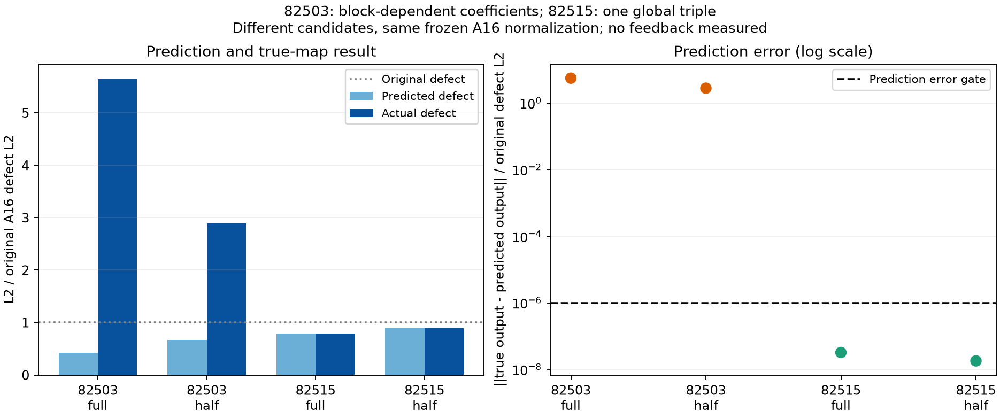

图的左栏比较预测缺陷和真实缺陷，右栏按对数尺度显示真实输出减预测的误差。右栏的虚线是预测误差验收门；左栏的1只表示原缺陷水平，不是full收益门0.8。所有点保留，无裁剪或人为底值。

下一步缺的是反馈证据。辐射场数组L2下降20.46%，并不意味着气体净加热、物质残差或剩余解误差也下降20.46%。率和加热包含频率、方向、深度权重；净加热还可能是较大吸收与发射项之差。当前两张map没有计算新的正式反馈。因此必须让真实后继态进入原反馈流程，而不是凭辐射数组范数接受物质步。

新加速初值取82515 full的真实输出$T(q)$；历史对照取82273保留的$T(H_{16})$。两种初值有共同数值历史，不能称为统计独立样本。它们具有同一物质$x_{20}$、物理旧时间层、$r_{20}$、相位1367和物理步长889.419892762322秒。两支各最多16张map，在第8、16张各计算一对正式反馈；调度顺序为加速8、历史8、加速16、历史16，共最多32张map、4对反馈、零物质更新，申请32核128GiB、16worker、6小时。

最终检查对象是反馈产生的完整512维物质残差向量，不能把两个标量范数相减。两支各自16−8的窗口差，以及第16张跨初值的全部previous/final组合，其L2、质量范数和Max-cell都须同时满足相对$r_{20}$不超过0.001、相对冻结80195有限信号不超过0.1；跨初值率和加热原门也必须通过。原七门、正气体热能或资源失败立即停止；仅窗口漂移未达门时，仍完成对照支同龄端点，以免拿不同迭代预算比较。

82273旧加速pair16的反馈只作来源对照，不能冒充新种子的反馈。即使此次双窗口全过，也只得到有限窗口校准资格；是否足以重估物质更新方向还须独立判断。它不自动接受第21次物质更新，不完成耦合柱、整个环带表或整盘$I_\nu$。若失败，先分析具体反馈差，不自动再追加相同的32张。讲义CLI原稿实际由`deepseek-v4-flash[1m]`生成，其中“一次拟合”等不准确说法已经独立纠正。

## 114. 首对反馈通过：三种“差异”必须分别说明

82518的加速支已完成8张map和一对正式反馈；07:13:22历史支只完成4张，还没有本轮跨初值比较。首对独立审计通过，覆盖2154文件、608个map和152个feedback进程回执、原物质身份和完整512维响应；原七门全过，两端最低气体热能约$7.0228\times10^{12}\,\mathrm{erg\,g^{-1}}$，均为正。净加热三种计算路径的相邻变化约$5.6393\times10^{-7}$。这些是已完成端点的有效证据，不是整批结束。

第一种差异，是本次pair08的previous与final响应相减。其L2、质量、Max-cell比值分别为$[2.1903\times10^{-6},8.7195\times10^{-6},1.4555\times10^{-6}]$，都低于0.001；相对冻结80195信号的最大指标为0.0014674，低于0.1。它说明这两个相邻反馈变化小，并不单独给出距离最终辐射解的误差界。

第二种差异，是本次加速A8与旧82273加速A16的反馈比较，保留四种previous/final组合。各范数比的最大值如下：

|归一化分母|L2|质量范数|Max-cell|
|---|---:|---:|---:|
|冻结$r_{20}$的对应范数|8.9228667e-5|3.5613595e-4|5.9701075e-5|
|冻结80195信号的对应范数|0.02489046|0.05993420|0.01009622|

这里的$r_{20}$分母是三个不同数值：$[8.1720065579,0.2619104205,2.7050011166]$，分别对应三种范数。不能把质量范数0.2619用于所有列。第二种比较名为`from_prior_feedback`：旧pair16只是已审来源对照，绝不是新加速种子的反馈，也不能代替新种子的正式计算。它说明新加速支与旧加速端点的反馈接近，不是在检验本次历史支。

第三种差异，才是本次加速A8与本次历史H8的比较。当前历史支尚未完成，因此`cross_history={}`表示尚无这组结果，不能填零，更不能借第二组通过就宣布第三组通过。两支16−8窗口及cross16同样尚未完成，`reference_calibration_eligible=null`应读作“未评估”，不是失败，也不是通过。

当前加速pair前后物质残差的质量范数是0.2828629400和0.2828636376，大于冻结$r_{20}$质量范数0.2619104205。正气体热能、相邻反馈接近与物质固定点残差足够小是不同条件；不能因为前两者成立就接受第21次物质更新，或把较大的新残差用作分母掩盖差异。

因此维持原32map、4pair预算及配对顺序。原反馈七门、物理域或资源失败仍立即停止；单纯窗口漂移失败按原协议完成同龄对照再判。运行中的数值核与门槛不改。此时可以说“加速支首对正式反馈通过且与旧加速端点接近”，不能说“两种初值已经一致”“大气自洽”或“整盘$I_\nu$完成”。学校监督CLI和讲义草稿中的分母、来源关系与收敛措辞已独立纠正，原文和修订依据一并保存。

## 115. 两条迭代轨迹各自变化小，为什么仍不能接受同一大气解

82518两支的第8张正式反馈已经独立复核。加速支和历史支都通过原七门：五项率/加热相邻一致性、内层配对就绪和物质响应物理域。历史支最低气体热能约$6.91\times10^{12}$ erg/g，全部正值。这排除了本次反馈中出现负气体热能的故障，但没有检验完物质残差向量的一致性。

记固定物质基态为$x_{20}$，给定辐射端点$J$所得物质残差为$R(J;x_{20})$。同一支相邻两个辐射端点给出的差为

$$
\Delta R_{\rm adjacent}=R(J_{\rm final};x_{20})-R(J_{\rm previous};x_{20}).
$$

跨支则比较$R(J_H;x_{20})-R(J_A;x_{20})$，并保留previous/final的全部四种组合。这里的512维是128个物质单元各四个编码分量，不是512个轨道时刻。先减向量，再分别取L2、质量加权范数和单元四分量长度的最大值；不能用两个标量范数相减。三种范数各有自己的$r_{20}$和冻结80195信号分母。

历史支H8的相邻差，除对应$r_{20}$后的三值为[0.00058559,0.00193968,0.00023760]，其中质量范数超过0.001门。除对应有限信号后的三值为[0.16335,0.32643,0.04018]，前两种超过0.1门。其相邻加热差只有0.00013277且原加热门通过，两者仍相容：加热门度量加热数组的相对变化，物质向量门度量物质响应在固定残差和有限试步信号尺度上的变化，分子、权重、响应映射与分母都不同。七门通过不能替代后一个检验，也不能把三个范数一概写成全部失败。

跨支差更大。全部四组合取各指标最大，除$r_{20}$后三值为[0.0732381,0.2763143,0.0388023]；除有限信号后三值为[20.4299,46.5010,6.5620]。跨支光电离与复合门通过，但三种加热差最大约0.018783，超过0.001门。直觉上，两条轨迹可以各自缓慢移动，同时相隔较远；小步幅没有提供到目标点距离的上界。这里尚未证明任一轨迹已收敛，因此也没有证明存在两个物理解。

旧82273的cross16质量差/r20为0.2914284，新实验cross8为0.2763143。种子和累计迭代年龄不同，这个对照不能把改善唯一归因于新加速方法，也不能推算再多少张就会通过。新A8对旧A16的小差异同样不能冒充新A8对新H8的一致性。

按实验开始前的约定，cross8只测量，不提前作最终校准判决。接下来完成两支第16张，检查各自16−8窗口与cross16；本轮总预算仍为32张map、4对正式反馈、零物质更新。跨支差失败仍要完成匹配端点，原七门或物理域故障则停止。当前校准资格为未评估，不替换基态，不接受物质21。即使最终取得有限窗口资格，也还需耦合物质固定点、定义域扩展和观察者接入，才能交付可用的整盘$I_\nu$。

依据为`20261001-x20-82518-h08-review.json`。学校CLI与讲义草稿实际模型为deepseek-v4-flash[1m]；独立审阅纠正了把七门只说成速率门、混淆来源对照与相邻差，以及把四个组合误说成四项速率门等表述，原文和纠正记录均保留。

## 116. 加速支通过八张窗口之后，离判定还缺什么

82518加速支第16张的正式反馈已独立复核。原七门全部通过，最低气体热能约$7.02\times10^{12}$ erg/g。本节新增的是同一支第16张与第8张之间的完整物质残差向量比较：两个反馈对各含previous/final，四种端点组合均保留。它检验这两个检查点之间的漂移，不是对区间内每个中间端点逐一验收。

四组合各指标最大值，按L2、质量加权、Max-cell顺序，除原$r_{20}$对应范数为[0.0000189905,0.0000759945,0.0000126919]；除冻结80195有限试步信号为[0.00529744,0.01278914,0.00214636]。全部低于原0.001和0.1门。这比只看第16张反馈对自身相邻差提供了更长间隔的测量证据，但仍没有给出到精确解的距离。

同一审计还有两类比较：A16反馈对自身的相邻变化，以及新A16对旧82273加速A16的来源对照。三者都通过，它们共享相同的冻结归一化尺度，区别在于相减的端点集合。相邻比较不是重复执行同一输入的噪声实验；来源对照也不是本轮A16对H16。必须看清比较对象，不能见到三个passed就以为三种初值都一致。

旧82273加速支八张窗口的质量差/r20为$5.76258\times10^{-5}$，本轮为$7.59945\times10^{-5}$。两者都在门内，但新值略大，不能叙述成加速方法改善了所有指标。此前真实辐射缺陷的20.46%下降也不能搬到物质响应上：它们是不同数组、不同权重与不同响应映射的量。

更关键的是，第8张跨支差仍失败，历史支第16张尚待审计。只有历史支16−8窗口和cross16的完整向量、率与加热全部通过，才能判定本次有限窗口校准资格。当前资格仍为未评估。新A16物质残差质量范数为0.2828690，本身也不是小到可宣布物质固定点收敛的证据；冻结r20的0.2619104不替换。

因此继续原预算中的历史支，不新增物质更新。若最终跨支仍不一致，下一步要解释其反馈差，不能靠选择变化较小的支宣布得到大气解。耦合柱、定义域强度表与整盘$I_\nu$仍需各自的验收。本节依据`20261001-x20-82518-a16-review.json`；CLI草稿实际deepseek-v4-flash[1m]，关于重复性、整个区间和不同分母的错误表述已独立纠正。

## 117. 正常完成的82518，为什么仍然不能校准物质响应

82518完成32张map和4对反馈，耗时3小时14分37秒；所有原七门与正气体热能检查通过，但最终校准失败。A支16−8窗口质量差/r20仅0.00007599，H支则为0.0170531，两支第16张之间为0.2615051。后两项超过0.001门；cross16差/有限信号为44.0087，超过0.1门。cross16光电离与复合门通过，三种加热差约0.0177642，超过0.001门。不能挑A支稳定或H支标量残差较小来判哪支是真解。

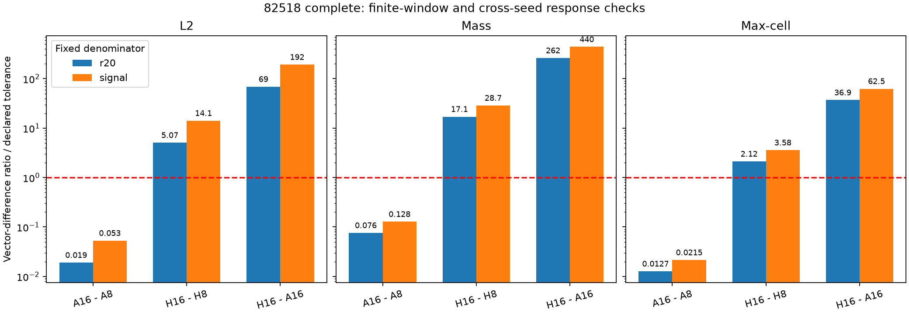

图的纵轴把各指标再除以其门槛，所以红线1表示恰好达到门；不是把物质残差本身画成误差。三种范数和两套冻结分母都保留。A窗口通过是真实有限窗口证据；它没有提供到精确解的距离上界。

差异几乎全部位于编码气体热能分量q0：该分量占cross16 final/final完整差向量质量加权平方范数的0.9998661。这里平方的是残差分量，再乘单元质量权重，绝不是“质量平方份额”或辐射能量份额。固定物质、密度和物理旧层下，逐块净加热差满足

$$
\Delta u_g=\frac{dt}{\rho}\sum_b\Delta Q_b-\Delta u_{\rm ion}.
$$

用正气体能之间的精确对数割线把各项映射到q0差，再与原响应比较。本次对数闭合误差约$1.98\times10^{-15}$；发射项逐位相同，电离能投影约$-9.8\times10^{-11}$。主要有符号投影来自块22–25和46–49，负项也保留。这里确定了当前差异的来源，并没有证明怎样修改迭代必然消除它。

## 118. 针对加热慢变化筛方向，而不是再堆32张map

令$g(J)=dtQ(J)/\rho$，单位erg/g。取各反馈对的previous和final，它们确实是同一次映射的输入与输出，由保留端点哈希连接。定义

$$
d=g(H)-g(A),\qquad e=[g(T(H))-g(H)]-[g(T(A))-g(A)].
$$

于是映射后的差正是$d+e$。82518第16张的质量范数比$\|d+e\|/\|d\|=0.9934872$；一次映射只消除了所测差范数的一小部分。这是加热响应层面的有限测量，不是全辐射算子的特征值、谱半径或收敛定理。不能用它直接预测离真解多远或何时完成。

还可以在观测到的方向上拟合相邻加热缺陷。令$r_A=g(T(A))-g(A)$，在质量内积下，最小化$\|r_A+\alpha e\|$的无约束系数为

$$
\alpha_*=-\frac{\langle r_A,e\rangle_m}{\langle e,e\rangle_m}.
$$

本次为$-0.00462135$，小目标预测比为0.405625。但是负系数会外推；它没有证明辐射强度非负、边界通过或真实反馈按预测变化，因此不据此提交真实映射。

另一条可检验路线是仅用历史支自身保留方向。取82518H16为锚点，82273H16、81769H16和82518H8为三个历史点；每一点使用previous→final真实对，而不是final→mapped_final。各源物质和算子一致，累计历史不同。较长跨度不保证更有用：单用最老方向的小目标预测比约0.9513，单用较近方向约0.8037。

将三个方向一起纳入原仿射权重绝对值和上限17，小加热目标的受限最小比为0.6815665。我们对存储的binary64诊断向量用精确有理数构造Gram，再独立检查行列式和凸支撑平面证书；证书只针对这个明确的小二次问题，不是物理算子的全域最优性。raw系数为[-8,1.9909828822,0]，乘精确0.9再舍入后为[-7.2,1.7918845940,0]，小目标预测比0.7089541。

这个历史方案同样含负权重，没有天然的正性保障。选择它只是为了检验历史方向能否改善历史支，而非把接近A作为拟合目标；它也不是统计独立验证。下一批用4核16GiB、至多1小时读取8个已有场，核full与half的完整非负性、原辐射L2/Linf与边界门，不写新大态、不计算新map或物质响应。任何门失败就保留拒绝，不能因加热小目标改善而放宽。即使预测全过，也还要独立审计和真实映射，最终更不能绕过物质固定点、耦合柱及整盘$I_\nu$的验收。

本节依据终态审计、加热差诊断与历史方向screen-v2；v1保留，v2增加算子config来源绑定而不改变系数。学校CLI实际deepseek-v4-flash[1m]的草稿已独立纠正术语和证据边界，原文及纠正记录保存。

## 119. 次正规数负值：很小仍要分清原因

82686的完整301分片筛查拒绝了上一节的历史外推。起始频组9440与9472两片出现负强度，最小值分别约为$-5\times10^{-324}$和$-10^{-323}$，即binary64最小正次正规数的负1倍和负2倍。正式非负门失败后，其余正式门未求值；原分片统计仍被保存，不能把未求值写成通过。

小量级本身不能判别原因。先将四个已存源值与全局系数当作精确有理数，比较下面表达式的精确符号，而不是再做一遍同样的浮点运算：

$$
q=v_{0}+\sum_{j=1}^{3}c_{j}(v_{j}-v_{0}),\qquad q_{1/2}=\frac{v_{0}+q}{2}.
$$

82740对全部已发现负点去重后的源四元组做Fraction计算；Mac用独立整数通分复核分子和分母。9440片input/output分别3926/3826点，9472片分别67150/82880点，共157782点。它们的精确$q$全部为负，精确$q_{1/2}$全部为正。这排除了“仅当前表达式的计算顺序把非负精确组合算负”这一解释；不能据此排除源场本身已有的离散或舍入误差，更不能推论原连续物理解为负。

该证据只覆盖原存储负点。原存储零点可能隐藏精确负数；half的存储最小值为零，并不是全场精确非负证书。82740用4核完成，程序191.323秒，峰值RSS约0.541GiB，没有新增map、反馈或物质步；旧场字节与原拒绝判决都保留。

## 120. 下一步是改变候选场的全局步长

把原方向的三个系数统一乘1/2，得到$[-3.6,0.8959422969941027,0]$。这改变的是候选强度值，频率、角度和深度坐标不变，绝不是“只换坐标”。所有点按同一个全局方向更新，没有删点、截断负值或逐点修补。

新full与half在精确代数上是原方向的1/2与1/4。实际计算按原表达式重算；浮点运算不满足任意结合律，因此不能假设新full逐位等于旧half。下一批仍读全部9632×32×4096域，使用同一历史锚点和原11门；不能因为旧负点的half为正，就跳过新候选全场验证。若预测合格，再检查真实算子输出、预测误差、边界和反馈；这条证据链尚未走完，物质固定点、耦合柱和整盘$I_{\nu}$均未完成。

本节CLI草稿的实际模型为deepseek-v4-flash[1m]。独立审阅纠正了“回溯只换坐标”、原外推与后续回溯时序、精确证书的证据范围及“其余门”与“其余统计量”的区别；草稿和纠错记录分别保存。

## 121. 82743通过的是候选资格，82765检验的是实际响应

82743完成了减半方向的完整301片筛查。Mac用80位十进制重新归并已存分片统计，并核对源文件和运行源码；没有以80位精度重算整张辐射场。原11门全部通过，四个预测场的存储最小值均为零。相对同一历史锚点，full/half缺陷L2为0.7348836971/0.8608821008，Linf为0.8791315575/0.9395082408。边界L1由原$5.2414187\times10^{-6}$降至$2.1298761\times10^{-6}$与$3.6855432\times10^{-6}$。

这里的“通过”指候选资格。令$B$为锚点输入，$V_{j}$为其余三个历史输入，$T$为原辐射映射，$c_{j}$为已冻结系数。我们已有四个真实输入输出对，据此构造

$$
q=B+\sum_{j=1}^{3}c_{j}(V_{j}-B),\qquad
p=T(B)+\sum_{j=1}^{3}c_{j}[T(V_{j})-T(B)].
$$

$p$只是组合历史输出所得预测；目前尚未计算新的$T(q)$。预测可用于筛选候选、给出待检验的改善幅度、与真实输出比较；但不能直接作为新的真实输出或正式反馈输入。统一标量系数避免了额外逐频块乘法次序问题，也没有证明物理算子在所有输入上仿射。

归一化锚点必须跟候选来源一致。本次来自82518历史支map16保存的previous→final：它们分别是第15次map的输入、输出。目录名map16标识保存时点，不表示这对数据一定对应第16次map；后者是final→mapped_final。新驱动通过SHA连接明确使用manifest第一行，回归测试会拒绝后一对，防止把真实改善率算在错误分母上。

82765于10月1日12:04:20启动：32核、128GiB、16worker、最多2小时，full和half各一次原map。保留原16项真实验收，包括原残差和边界、相对锚点收益、真实输出减预测输出、以及half真实缺陷与两端平均的相容性。已有物质状态x20、物理旧层、r20和dt保持不变，不计算反馈或接受物质21。依据类似两map实验估计约45分钟，这是运行成本参考；当前尚不能预测自洽柱、全域强度表或整盘$I_{\nu}$何时完成。

本节依据已审小包与启动收据。CLI草稿实际模型deepseek-v4-flash[1m]；独立审阅将“预测族自洽”改为候选资格，并纠正了“任何后续判据不能使用预测”和“80位重算整场”的潜在误读。原文与纠错JSON均保存。

## 122. 真实传输通过了，为什么还必须检查加热反馈

82765已经实际计算两个候选的原映射。全部16门经Mac独立统计审计通过，325个工件与152个worker回执一致。full的缺陷L2比为0.734883697141828，Linf比为0.879131557469944：相对同一历史锚点分别降低26.51%和12.09%。half对应0.860882100796438与0.939508240837062。真实输出减仿射预测的L2比仅约$4.13\times10^{-10}$和$2.47\times10^{-10}$；这验证了本次候选的预测准确性。

这些量有三个不同问题。第一，令当前辐射场为$J$，原映射为$T$，缺陷是$d(J)=T(J)-J$：它测量再执行一次原映射会改变多少。第二，若$J_{\,}$是未知固定点，误差是$J-J_{\,}$。在线性化成立的局部，$d(J)\simeq[D T(J_{\,})-I](J-J_{\,})$；若某慢方向的映射特征值接近1，很大的误差也可能对应很小的缺陷。没有逆算子控制或收缩界，不能把缺陷降低26.51%称为真实误差也降低26.51%。第三，预测误差是$T(q)-p$，它衡量历史组合对新映射的预测是否准确，也不是前两者。

尤其要避免读错数组：`l2_ratios`的最后一项约$10^{-10}$是half真实缺陷与两端平均之间的一致性误差，不是候选固定点缺陷变成了原来的$10^{-10}$。场L2也不是辐射能量积分；物理能量还需要频率、角度、深度或体积等对应积分测度。

大气耦合还要求辐射反馈正确。不同频组和层位在净加热中具有不同权重，加热又包含相消；一个降低全场L2的方向不必同时降低物质响应误差。因此下一步保持物质x20、物理旧层、dt及r20不变，只让82765的full真实输出作为新初值继续16map，在8和16处各积分一对正式反馈。检查新的8map窗口漂移，也与保存的82518 A16两端点比较；完整512维残差先相减再取三种范数，不能用两个残差标量范数相减替代。

为什么暂不重跑A支？已审的A16−A8有限窗口满足现有门，可以作为本轮冻结参照，避免把预算再次花在同一段验证上。但这不证明A是真解，也不证明继续推进A不会出现更慢漂移。新实验只有一支被重新计算，不能称为新的双支同龄试验；若新支与保存A相容，仍须结合历史来源和进一步验证决定能否校准。驱动因此不自动迁移基态、不接受物质21。物质固定点、收敛耦合柱、全域强度表与整盘$I_{\nu}$仍是后续不同层级的目标。

本节CLI草稿实际模型为deepseek-v4-flash[1m]。草稿错误地把half一致性小量当成候选缺陷降幅，又把缺陷称为到未知固定点的距离；两项均已根据数组定义和算子关系纠正，并保留原文和独立纠正记录。

## 123. 相邻两态一致，为什么八张之后还在变化

82989完成16张map，两次正式反馈分别位于map8和map16。每次反馈都取相邻两个、已有原映射残差证明的输入态；原七门两次都通过。这回答的是每次相邻变化是否足够小。它没有回答将map16反馈与map8反馈比较时是否也足够接近：很多小变化可以在八次迭代中累积。因此必须分别保留相邻pair检查、16−8长窗口和与保存参考A16的差异，不能把三者合成一个“收敛”标签。

新的16−8窗口，四种previous/final组合中的最大差除以冻结r20，三个范数依次为0.00332250、0.01243288、0.00173207，均超过0.001门。除以冻结80195信号则为0.926815、2.092331、0.292916，也都超过0.1。这里的三项是L2、质量范数和Max-cell；不是三个物理分量或三个通道。先减完整512维向量再求范数。

与保存A16的四组合最大加热差由map8的0.01341786降至map16的0.01267317，门仍为0.001。最大质量差/r20从0.19838468降到0.18732678。这说明本轮方向确实在缩小这些可测差异，但尚未消除它们。A支没有重新演化，仍只是保存参照；不能据此宣布A正确、H错误，也不能由两点推论继续迭代必定过门或永远不过门。

下一条选择利用这次计算留下的信息，而不是立即重复相同16张。对每个历史相邻辐射对，将原子净加热转成单位质量能量增量$dt\,Q/\rho$，再取后端减前端的128维向量。取新H16为锚点，新H8、旧82518H16和82273H16为三个方向，按质量内积构造小Gram。这个目标关注物质响应敏感的加热变化，不以A支为拟合终点，也不把气体对数残差强行视为辐射场的线性函数。

原权重绝对值和上限17内，小二次问题解为$[0,-8,4.2158110361]$；沿原安全因子0.9选$[0,-7.2,3.7942299325]$。质量加权加热缺陷的预测比为0.2392648。精确有理数证书只保证存储诊断向量对应的小问题，不能保证真实连续物理系统、更不能保证外推强度非负。

因此先用默认4核读取八个既有大场，检查固定网格的全频、全方向、全深度正性及原残差/边界门，不写新大态或新增map。只有这一步通过才考虑32核真实映射。这是有界的信息获取安排，不是“再迭代一定无用”的物理结论。任何失败仍保留，不用裁剪、减小物理dt或替换r20使其消失。

本节CLI草稿实际deepseek-v4-flash[1m]。独立审阅删除了“继续map救不了窗口失败”和“结构性偏差已确立”等证据不足的断言，并纠正了三范数、检查时点及保存参考的定义；原文与修订记录入库。

## 124. 这次half也为负，不能把上次的处理机械重复

83063在完整301片筛查中被非负门拒绝：9440片full输入/预测输出的最小值均约$-1.5\times10^{-323}$，9472片均约$-4\times10^{-323}$；half的两种场在两片中均约$-10^{-323}$。这些是本次结果。旧82686的full最小值是约$-5\times10^{-324}$和$-10^{-323}$，不可串用。七文件小包及来源/源码由Mac独立复核，其他正式门未求值。

小量级没有回答负号来自哪里。需区分三个对象：已经舍入的源场binary64值；将这些已存值和已存系数当作精确有理数得到的外推组合；按指定浮点表达式实际算出的组合。精确组合为负能排除“仅该表达式运算舍入把非负精确组合算负”，却不能排除源场自身误差，也不能称连续物理解为负。

本次half也负，只能否定该half候选满足存储非负门；不能推出所有更小正步都失败。设单个坐标锚点为$v_{0}\geq0$，原full方向增量为$d$，同方向缩放后为$v_{0}+t d$。若$d<0$，精确非负性要求$t\leq v_{0}/(-d)$；若$d\geq0$，该坐标没有这个上界。特别地，$v_{0}=0,d<0$会禁止沿此方向的任何正步，但仍不意味着其它方向或物理解不存在。

83075仅在原两片中，分别对full/half输入和预测输出四类全部存储负点做源四元组精确符号与局部上界诊断。四类可以包含同一坐标，不能累加冒充独立点数。已存零点及其它片未被该精确诊断覆盖；即便所有检查到的上界都正，也须重新检验完整候选，不能把局部上界当成全场证明。本批不生成新场、不跑map或反馈、不自动减半。

CLI实际deepseek-v4-flash[1m]草稿误把本次full最小值归给旧实验，已按原报告纠正；原文和独立纠错记录保留。

## 125. 精确上界给出候选选择，不给出全场通行证

83075在两片上完成了四类存储负点的精确诊断。Mac另用整数通分检查每个源四元组和系数的full/half组合，复核符号、舍入值与局部上界。full两种场的378346个存储负点，其精确full组合全部为负；half两种场的162224个存储负点，其精确half组合也全部为负。两组可能对应重叠坐标，不把两组数相加冒充独立点数。这排除了“仅最后这次表达式舍入把非负精确组合算负”，但仍没有证明源数据完全无误。

所有检查到的负点中，原方向非负步上界的最小值为0.26355809157294，未发现0上界。这里不是对整个辐射场取最小值：存储零点和其它频组未纳入该精确诊断。若在那里存在更紧约束，这个局部上界就不能保护新候选。

所以新选择是同一全局方向的1/4步，它小于已检查的最紧上界，系数从$[0,-7.2,3.7942299325]$变为$[0,-1.8,0.9485574831]$。这只是有证据支持的候选选择，不是保证通过。full和half按新系数直接重算，分别对应原方向1/4与1/8；浮点表达式不保证任意代数重组逐位相同，故仍要完整扫描301片并应用原11门。

$q(t)=v_{0}+t d$在每个坐标随$t$是仿射函数。$d<0$才随$t$减小，$d=0$不变；不同坐标有不同根。我们改变的是全域统一候选步长，而不是物理dt、某些频点或负值本身。原full/half拒绝仍保留；新扫描不写场、不做map/反馈/物质步。只有完整候选筛查通过后，才讨论真实映射检验。

CLI实际deepseek-v4-flash[1m]草稿使用了不存在的“t切片”说法，并泛称随t单调越零；已改为实际频组分片与逐坐标方向斜率，原文和纠正记录保留。

## 126. 非负已经通过，为什么仍不进入真实映射

83080把原83063方向统一缩到1/4，完整301片的四种候选场最小值均为0，存储非负门通过。完整步L2比为0.82026834，相当于缺陷范数减少约17.97%；但预定门要求比值不大于0.8，即至少减少20%，所以候选仍被拒绝。half的L2比0.90793350通过的是非增门，不要求它也达到0.8。Linf比为0.89995935和0.94997967，通过各自非增门；边界谱和总通量变化另有独立门，也通过。总计11门中的10门通过，不能平均成一个整体通过。

这里的门用来决定是否值得支付下一次真实映射的成本，不是自然界的存在性定理。拒绝0.82027既不表示它没有数值改善，也不表示模型没有解。保持原门能让后续不同候选的收益比较具有相同尺度，不能因为这次接近就将门改成0.83。

继续把同一方向缩小，是否还有希望？取原方向参数$t=0,1/8,1/4$三点的平方L2统计，作二次插值$S(t)=a t^{2}+b t+c$。83075给出的已查负点必要上界是70368744177664/266995195471695，约0.26355809。插值模型在该区间的最小L2比仍为0.81108532；达到0.8的较小根约0.28006874，反而越过已知上界。因此本轮不再盲试同方向的其它小步。但这个判断只对统计插值成立：实际场表达式的舍入误差尚没有严格界，不能把它写成实际浮点候选绝对不可行的证书；局部必要上界也不是全场充分条件。

下一步需要调整方向，而不只是长度。四对历史场各定义$r_{j}=J_{j,\mathrm{final}}-J_{j,\mathrm{previous}}$，锚点为82989H16，其余为82989H8、82518H16、82273H16。构造$b=[r_{0},r_{1}-r_{0},r_{2}-r_{0},r_{3}-r_{0}]$及$G_{ij}=\sum b_{i}b_{j}$。该矩阵记录这些方向在完整辐射数组上的长度和夹角，能预测不同系数组合的缺陷平方范数。它使用数组Euclidean内积，不是辐射能量，也不同于128维加热增量$dt\,Q/\rho$的质量加权Gram。

83104只收集该完整矩阵和逐组边界谱，不求系数、不写新场、不做map或物质更新。独立归并并核对与83080统计的差异后，才能把辐射收益、加热目标及已查点的非负必要约束共同纳入方向选择。新方向仍需全场原11门和真实映射验证。物质accepted20、原r20及整盘强度尚未就绪的状态保持。

CLI草稿实际模型为deepseek-v4-flash[1m]。它将Linf比描述为“在边界门内”，已分开纠正；同时明确full与half的L2门不同。原稿和独立修订记录保留。

## 127. 把已发现的负值约束带回方向选择

83104完成了当前四对辐射场的完整Gram。Mac独立复核301片的16项内积、八场边界谱、极值与来源；用该矩阵复算此前三个步长的平方L2，和83080直接筛查相对差分别为零、约$9.1\times10^{-15}$和$-1.6\times10^{-14}$，绝对值最大约$1.6\times10^{-14}$的相对差。这是三个已测位置的一致性检查，不是所有系数下的舍入误差保证。仅求纯辐射无约束最小值会得到约0.32375的比值，但仿射权重绝对值和约80.45，超过预定17，不能直接采用。

为何不能只降低其中一个量？辐射数组L2衡量整个场的相邻映射缺陷；加热质量范数衡量128个物质单元对相邻辐射态的加热增量差。它们关注不同的线性组合，并有不同单位。新小问题将各自平方范数除以各自锚点平方，再取等权平均。因此两个目标都无量纲，同时保留两者各自的预测比，不能只汇报平均值掩盖一项变坏。这是数值搜索目标，不是新的能量定义或物理闭合。

负值也能提供下一次选择所需的信息。对已发现负值位置，四个源值记为$v_{0},v_{1},v_{2},v_{3}$。新系数需要满足$v_{0}+\sum_{j=1}^{3}c_{j}(v_{j}-v_{0})\geq0$。83075保存的源四元组去重后有9种，化成线性不等式后有7条不同约束；加上权重上限对应的14条面，共21条。这里只归并同一不等式，不删除失败坐标。原四类点有重叠，四元组数也不是物理单元数。这些约束只覆盖已查信息，其它位置仍须全场检验。

精确有理求解得到原系数$[-5.7460525855,-2.2539474145,1]$。独立核验正定性、所有不等式及KKT条件：非负约束乘子与目标梯度恰好平衡，活跃约束取等号，因此在这个凸小问题中不能再沿可行方向降低目标。证书只属于已存矩阵和已列约束，不扩展到整个物理解。取统一0.9安全因子并舍入成binary64后，再核实际系数满足已知不等式，得到$[-5.1714473269,-2.0285526731,0.9]$。

此时辐射L2预测比约0.54011，加热质量缺陷预测比约0.40479；后者不是正式加热一致性门，更不是物质残差。83111只用默认4核完成原11门full/half全场筛查。它不写候选大场，不做map或物质更新；全过并独立审核后才使用32核做真实映射。原物理dt、x20和r20保持。

本节CLI草稿实际模型为deepseek-v4-flash[1m]；数据和结论边界已独立复核，并将约束及证书适用范围展开说明，原稿保留。

## 128. 缺陷减小，边界变化仍可能越过锚点

83111的全场非负和缺陷收益通过：full的L2比约0.54011，half约0.71225，四个候选场最小值均为0。但原11门有两个失败，均在full的边界变化上。边界L1从锚点约$1.49447\times10^{-6}$升到$1.79394\times10^{-6}$，总通量变化也从约$1.49446\times10^{-6}$升到$1.79364\times10^{-6}$。这些数都小于绝对门0.001，却约为锚点的1.20倍。原判据同时要求绝对变化足够小、且相对锚点不增加；两者缺一不可。

边界带符号的全局通量增量，从锚点约正24463324变成full约负29365153，说明积分量越过零点并在另一侧增大了绝对值。half约为负2450914，离零明显更近。这里的数采用原核积分单位；我们比较同定义的增量，没有重新定义能量。全局积分的符号不代表每个频组都同号，也不证明物质温度或整层大气发生过冲。

half的边界L1和总通量变化分别约为锚点的0.14614和0.10018倍，而且L2比0.71225已经满足作为完整候选的0.8收益门。这给出了具体选择依据：将83111原系数记为$c_{\mathrm{old}}$，令$c_{\mathrm{new}}=c_{\mathrm{old}}/2$，得到$[-2.5857236635,-1.0142763365,0.45]$。这不是看到失败便无条件减半，而是在独立核实失败机制、half正性及收益之后的新决定。83111原完整步拒绝仍保留。

新full使用锚点加各方向乘$c_{\mathrm{new}}$，只缩放一次；旧half使用一半锚点加一半旧full。在精确实数运算中它们相同，但浮点求值次序不同，不保证逐位相等。因此要重新扫描新full与新half的全部301片，不能直接继承旧half的通过标签。默认4核任务仍只筛查，不写新辐射大场、不做map/反馈/物质更新；只有原11门和独立审计通过，才进入32核真实映射。

CLI草稿实际模型为deepseek-v4-flash[1m]。提示和草稿均曾在列出新系数后使用未区分旧新的c/2，存在重复减半歧义；这里已显式区分新旧系数。代码实际只执行一次除2，防错测试已核。原稿及修订记录保留。

## 129. 通过预测门后，要对新辐射输入真正求一次映射

83131全场重新筛查通过原11门。full与half的L2比分别为0.71224640、0.84794224，Linf比分别为0.83093461、0.91545283，四个候选场最小值均为0。边界谱和总通量变化也低于锚点。Mac独立复核七文件、源码、来源和全部301片统计；此前83111完整步的两个边界失败仍作为历史拒绝保留，没有被这次成功覆盖。

这些检查使用的$q$是历史辐射输入的仿射组合，$p$是对应历史映射输出的同权重组合。物质背景和原映射算子$T$都没有更换。若冻结算子确为仿射、源对完全满足它且运算精确，则可推得$p=T(q)$；但实际代码有浮点运算、内部求解精度和状态传递，因此仍须把新$q$实际交给原算子，测出$T(q)$，不能把代数组合直接当作已经完成的新求值。

真实计算后要分开三种比较。$T(q)-q$是候选的真实映射缺陷，决定候选本身是否更接近不动点；$T(q)-p$是预测与真实结果的差异，检验这次外推预测是否可信；full/half输出的仿射一致性则检查同一方向两种步长之间的算子关系。后两者即使极小，也不能证明第一项极小，更不能证明到未知固定点的距离已经足够小。

新作业83514使用32核、128GiB和16个worker，full与half各做一张真实map，最多两张、零反馈与零物质更新，硬限两小时。源锚点取82989H16的previous→final，对应iteration15；final→mapped_final是另一张映射，不能串用。正确trial先落盘再初始化，并核其逐位物质状态及native相位1367、物理dt889.419892762322秒，防止默认迁移回旧0.0625候选。

原16个真实验证门保留。结束后还要独立复核候选输入、152个worker回执、真实输出、边界与归档。即使全部通过，它也只证明固定物质下本次真实映射验证成功；正式加热反馈、物质收敛、耦合柱、全域大气强度与整盘观测谱仍分别需要后续证据。accepted20及原r20不变。

CLI草稿实际模型为deepseek-v4-flash[1m]。独立审阅纠正了“旧系数在旧物质上闭合”及“新物质被映射”的表述，并将预测误差、仿射一致性与真实缺陷逐一定义；原稿和纠正记录保留。

## 130. 真实辐射加速有效以后，为什么仍须重新计算物质反馈

### 130.1 本次检验的对象是光子辐射转移算子

这里的辐射是H/He连续谱的光子辐射。固定物质状态x20后，记一次完整辐射映射为$T$。历史锚点输入记为$u_0$，输出为$T(u_0)$；本次锚点来自82989 H16清单的previous→final，即第15张映射。第16张的final→mapped_final是另一对，不能互换。

我们把同一物质背景下四对历史输入、输出按相同全局权重组合，得到新输入$q$及预测输出$p$。因此$q$不是锚点$u_0$，$p$也不是重新求解得到的$T(q)$。83514真正运行了完整步和半步各一张map，才获得实际输出。

### 130.2 三个很小或有所下降的数，回答的是三个不同问题

真实缺陷$T(q)-q$问：这个新辐射输入经过原算子之后还会改变多少？以锚点缺陷的L2为分母，完整步与半步分别为0.712246404339和0.847942236413。完整步减少约28.775%，但仍保留约71.225%的锚点缺陷；不能说它已经收敛到零。

预测误差$T(q)-p$问：用历史输出线性组合，能否准确预报新输入的一次真实输出？同一锚点缺陷尺度下，完整步和半步的L2比分别约为$6.03\times10^{-10}$和$3.69\times10^{-10}$。它支持本次组合的预测一致性，却没有测量新输入到未知固定点的距离。

半步仿射一致性问：半步真实输出与锚点、完整步真实输出之间是否符合预定仿射关系？其L2比约$1.54\times10^{-10}$。这不是半步缺陷；半步缺陷仍是上面的0.847942。即使某个离散算子几乎精确地满足线性关系，它的固定点迭代也可能收敛很慢，二者不矛盾。

### 130.3 全部16门通过，给了什么资格

83514的真实缺陷、边界变化、原辐射残差及预测一致性全部通过原16门。Mac核验325个工件、152个worker回执、源码与来源，并从301片小统计用80位十进制重新归并；没有在Mac读取或重新计算大辐射场。实际两张map分别约156秒、152秒；42分54秒整作业还包括候选构造、读取、哈希和全域比较，不能把整作业时间当作单map时间。

这些证据允许把完整步的真实输出作为新辐射初值。它们还没有给出新的光电离、复合、净加热和物质响应稳定性。辐射数组的L2为全数组平方和尺度，净加热则来自带物理权重的积分并可能包含大项相消；前者下降不保证后者按同比例下降。

### 130.4 下一实验把三个比较分开

新作业84026于10月2日23:27:36开始，使用32CPU、128GiB、16worker，最多16张map，在第8和16张各做一对正式反馈。初值只能是83514完整步的真实输出，不能拿预测$p$代替。四小时是硬资源上限，不是科学收敛时间承诺。

第一，比较新支16与8的物质响应窗口，判断继续内层求解时反馈还漂移多少。每个窗口有previous/final两个端点，四种配对都要保留。对每一对先计算完整512维向量之差，再求L2、质量加权、Max-cell三范数；分母仍是原r20和冻结80195信号。

第二，比较新支与加速前82989 historical pair16，测量加速实际改变了什么。这不是“与真解比较”，也不要求向保存A靠近来选择系数。

第三，比较新支与保存的82518 A16，包括完整物质响应差以及四种端点组合的率和加热检查。A没有在这次重新演化，其过去窗口稳定不构成剩余误差界；本次也不是两条分支同时重新跑相同预算的实验。

### 130.5 哪些失败立即停止，哪些只记录

原七门、正气体热能等物理域、资源或来源完整性失败，立即停止并保存结果。单纯窗口或跨保存参考差异不过门，按协议完成已经声明的第二窗口，随后停止，不自动追加map。x20、物理相位1367、dt889.419892762322秒、能量定义及r20全部固定。accepted20表示同一物理步内已接受20次非线性更新；本实验不接受第21次更新，也不推进新的物理时间层。

最终仍须区分有限辐射窗口、正式反馈稳定、合格基态校准、耦合柱收敛、全域大气表及整盘$I_
u$。当前的进展是第一类候选已通过真实算子验证，开始检验它对反馈稳定性的作用，尚不能给出最终强度的可靠完成时间。

讲义依据83514独立审计和84026启动回执整理。学校CLI草稿实际模型为deepseek-v4-flash[1m]；其中“中微子输运”、把$q$当锚点、未分清三个窗口比较等错误已独立修正，原文和纠正清单均保留。

## 131. 相邻反馈通过，却仍不能接受新的物质步

### 131.1 先把三种对象分开

本轮物质背景仍是$x_{20}$。设在给定辐射场$I$和冻结旧物理时间层下，原物质响应给出的目标编码状态为$\Phi(I)$，则物质响应残差为$R(I)=\Phi(I)-x_{20}$。这里$x_{20}$在所有16张map中固定，物理时间步也没有改变；反复计算的是辐射映射，反馈时才重新评价$R$。

单个端点的$\|R(I)\|$描述该端点所对应的物质响应偏离固定背景多少。两个端点的$\|R(I_{b})-R(I_{a})\|$描述辐射场改变时，物质响应判定改变多少。两者不是同一个数，也不能用$\|R(I_{b})\|-\|R(I_{a})\|$替代后者，因为向量可能转向而长度几乎不变。

84026 map16final的三个残差范数是8.241171873、0.273938591、2.705709767；它们属于第一类。16−8窗口属于第二类，每次比较完整512维向量，即128单元乘4个编码分量，再计算L2、质量加权和Max-cell三个范数。这三者不是三种物理通道；Max-cell先将每个单元的四分量平方求和，再对单元范数取最大。

### 131.2 原七门到底确认了什么

第8张和第16张各有一对相邻反馈。原七门分别检查光电离变化、总复合变化、原子净加热变化、直接加热变化、形式解加热变化、内层pair-ready及物质响应物理域。两对七门均通过，意味着这两对相邻态满足已经声明的检查，而且响应没有离开正气体热能等物理域。来源、trial/native和块所有权校验则是独立的完整性证据，不能代替上述七个数值条件。

相邻变化小不能限制更长迭代区间的累计变化。慢模每步可以改变很少，却在八次迭代之间留下不能忽略的差异。本轮四种previous/final组合的16−8最大漂移，除以原r20三范数后，分别为0.00190712、0.00740378、0.00108804，均未通过0.001门；除以冻结80195信号后为0.531993、1.245983、0.184001，也未通过0.1门。不能挑最大单元范数中某个较小组合宣布窗口通过。

### 131.3 改善是真实测量，仍不是误差界

上一轮82989的16−8窗口三项最大/r20为0.00332250、0.01243288、0.00173207。本轮均减小，说明此次辐射加速之后，同样八张间隔上的物质响应漂移减弱。这里比较的是两个有限窗口；我们没有证明收缩常数在以后保持，也没有测得未知固定点的位置。

对保存82518 A16的四组合最差原子加热差异，在本轮map8为0.00839987，到map16为0.00796354，均仍高于0.001。光电离与总复合比较通过，三种加热比较未通过。保存A未在本轮重算，它的历史窗口稳定也不能证明A就是准确解。因此，“与A的差异减小”是跨历史一致性改善，不能直接变成“距离真解更近”的证书。新的残差范数没有替换原r20，本轮仍是accepted20、0个新物质更新。

### 131.4 一个与物理结论独立的运行记录缺口

84026的完整归档经过逐文件SHA和独立归并，4297工件、875直接来源、792源码条目、1216个map及304个反馈回执一致。程序记录约5401秒并保存了最终数值摘要。Mac没有重算大场或物质ODE。

但是，监督器没有捕获Slurm终态。10月5日重连时，scontrol已查不到84026，sacct无记录；退出前快照只显示RUNNING，不能补写COMPLETED或最终退出码。我们保留“数值产物完整、调度终态未验证”两个独立字段。下一作业在Python子进程返回后另写batch-exit回执，它补充的是子进程返回码；只有真实调度回执才能证明Slurm终态。

### 131.5 下一次扫描检验什么

新扫描选取84026 H16/H8、82989 H16、82518 H16四组previous到final映射。H16取iteration15，H8取iteration7。以第一组缺陷$r_{0}$为锚点，将其余缺陷与$r_{0}$之差作为三个方向，计算完整4×4 Gram矩阵，并保存八场边界谱和极值。

Gram记录这些辐射缺陷方向的数组内积，帮助判断它们是否相近、是否能组合降低缺陷；它不是带物理能量测度的积分。当前仅采集统计，尚不选系数、不写新dat、不计算新反馈、不推动物质。下一阶段仍须原cap17及完整非负、边界、缺陷收益检查，保存A也不作为拟合目标。没有足够证据给出最终自洽大气或整盘$I_{\nu}$的完成时间。

讲义依据84026独立审计整理。CLI实际模型deepseek-v4-flash[1m]的草稿将七门通过归因于同源、混淆单端点残差与窗口差、误称源码条目为来源；均已独立纠正，原文和纠正记录保留。

## 132. 降低内部缺陷时，为什么必须同时约束边界

### 132.1 先明确这次组合的对象

物质仍固定为$x_{20}$。本次四对辐射场依次为84026 H16、84026 H8、82989 H16、82518 H16，每对都是清单的previous到final；H16对应第15张映射，H8对应第7张。设第$j$对输入为$I_{j}$，原算子输出为$T(I_{j})$，缺陷为$r_{j}=T(I_{j})-I_{j}$。第一对是锚点$j=0$。三个全局系数$c_{j}$对所有频率、方向和深度一视同仁，定义组合输入和预测输出：

$$
q=I_{0}+\sum_{j=1}^{3}c_{j}(I_{j}-I_{0}),\qquad
p=T(I_{0})+\sum_{j=1}^{3}c_{j}[T(I_{j})-T(I_{0})].
$$

因此$p-q=r_{0}+\sum_{j=1}^{3}c_{j}(r_{j}-r_{0})$。Gram矩阵记录这四个缺陷基的数组内积，使这个组合的平方范数成为三系数的二次函数。85744完成301片统计；Mac独立重建全部16项Gram和八场边界谱。这里没有在新输入$q$上运行算子，故$p$仍是预测，不能写成已经测得的$T(q)$。

### 132.2 为什么仅优化两种内部量不够

我们还从同四对反馈取128层净原子加热，计算$e_{i}=\Delta t\,Q_{i}/\rho_{i}$，单位erg/g。固定质量权重后，以相邻端点的$e$差构建第二个Gram。辐射数组范数与这种加热范数单位不同，因此先各除以锚点平方范数，再等权相加；这是无量纲数值选向目标，不是新的能量方程，也不是正式加热稳定性判据。

仿射组合实际使用四个权重$[1-\sum c_{j},c_{1},c_{2},c_{3}]$，其绝对值之和不得超过17。仅此约束得到的安全方向预测辐射缺陷比0.4718、加热缺陷比0.0842，却使小边界L1由锚点的$1.5491\times10^{-7}$增到$4.0118\times10^{-7}$。half也变差。这不是矛盾：内部数组平方范数、质量加热平方范数与表面谱变化测量不同的方向和权重；降低前两者不蕴含第三者下降。这条方向已留档，未提交全场扫描。

### 132.3 边界约束如何真正进入小问题

记频组$k$的表面通量贡献为$F_{k}(q)$和$F_{k}(p)$。表面积分对场线性，但以下指标含绝对值和归一化，整体不是线性函数：

$$
B_{1}=\frac{\sum_{k}|F_{k}(p)-F_{k}(q)|}{\max[\sum_{k}F_{k}(q),\sum_{k}F_{k}(p)]},\qquad
B_{\rm bol}=\frac{|\sum_{k}[F_{k}(p)-F_{k}(q)]|}{\max[\sum_{k}F_{k}(q),\sum_{k}F_{k}(p)]}.
$$

我们固定锚点处哪个端点总通量较大，并添加不等式保证它在新组合中仍占优。固定的是这个分支，分母数值仍随系数变化。总通量绝对值条件可拆成两条线性不等式。频组L1保留所有9632项，若当前解违反它，就把该解各频组差值的符号组成一条必要支持平面；最多添加24条，超出就停止。

本次添加3条后，解满足完整L1条件。Gram正定、全部不等式可行、乘子非负、互补及梯度条件均用精确有理数核验，所以原解是该存储小模型、所选归一化分支内的全局最优。这个结论不覆盖另一分支，更没有证明整个辐射场逐点非负。计算使用的是已存储的数值，证书不会消除上游场求解和分片统计的舍入误差。

### 132.4 安全方向通过了什么，还缺什么

精确原解统一乘0.9，再存为binary64系数：[-6.846213173701946,-0.3537868262980542,0.0659556218584672]。实际存储系数也重新检查，不能只验证未舍入的原解。full预测辐射缺陷比0.58656、加热缺陷比0.39179；half分别0.78459、0.69575。full/half小边界L1分别$1.29496\times10^{-7}$、$7.31817\times10^{-8}$，都小于锚点；总通量变化也不增。

下一步完整扫描对$q,p$及half两场逐点检查非负，再按原定义检查整体L2/Linf、辐射与边界门，共11门。小边界谱的线性组合与完整大场运算后再积分可能存在舍入差异，所以不能免除这次检查。旧83075负点来自别的源元组，不能拿它们给本次新源出正性证书。全场筛查若通过，还必须另做真实映射$T(q)$，再比较真实缺陷$T(q)-q$与预测误差$T(q)-p$。

### 132.5 当前结论的边界

85744有真实COMPLETED0:0回执；84026缺失调度终态的事实仍保留。这一轮完成了统计复核和小问题选向，尚无新map、反馈或物质更新，accepted20不变。新的有限筛查不是自洽大气或整盘$I_{\nu}$交付，也不足以外推其完成时间。

本节基于独立审计、两份小问题证书和新协议。学校CLI草稿实际模型为deepseek-v4-flash[1m]；将L1说成线性泛函、混淆锚点与归一化分支、把全局KKT证书说成局部保证、把所有11门说成逐点检查等表述均已独立纠正。

## 133. 全场筛查通过之后，为什么还要计算两次真实映射

### 133.1 小问题、完整扫描和真实映射是三次不同的计算

上一节的小QP只负责选三个全局系数。把这三个系数代入八个已保存源场，可在每一个频率、方向和深度位置构造候选输入$q$与预测输出$p$。85778确实在学校读取全部八场，扫描9632×32×4096个位置，记录301片统计；它不只是看小矩阵，也没有拿几个代表点代替全场。

但是，$p$仍来自历史输出的组合。真正的新输出必须把$q$交给原辐射算子，计算$T(q)$。此前没有做这件事，所以完整扫描测得的缺陷是$p-q$，不能把它改称为已经测得的$T(q)-q$。

### 133.2 本次11门通过的具体含义

full和half的预测缺陷L2相对锚点分别为0.5865597261、0.7845850311；Linf比为0.7038852089、0.8519426044。full满足0.8收益门，half满足原非增门；二者的原辐射残差和边界绝对/非增条件也通过。四个组合场的存储计算最小值都是零，未发现负点，包括次正规范围也没有豁免。

学校事后核对所有声明源、代码和字段哈希；真实Slurm回执为COMPLETED0:0。Mac另外核验806代码、18项直接来源、小问题证书以及全部301片统计的80位归并。Mac未重新读大场或求物质ODE，不能把这部分审阅写成第二次独立辐射计算。浮点组合全场非负也不等于每个点都有精确有理正性证书。

### 133.3 下一次实测必须区分三个差

真实映射后的第一项是$T(q)-q$：新输入在原算子作用下仍会改变多少。第二项是$T(q)-p$：历史组合对真实输出的预测有多准。第三项是半步真实输出与预定仿射关系的偏差：它检查半步与完整步、锚点之间是否符合该关系。后两项很小，也不能把第一项当成零；更不能据此得到到未知固定点的距离。

新实验使用32核、128GiB、16worker，在固定$x_{20}$、相位1367和物理步长889.419892762322秒下，full/half各一次map，总共最多两次。候选trial必须先写入再初始化，逐位核对物质编码及原基态，防止初始化函数换回默认0.0625候选。两支各有76个worker回执，连同原16门、源链和资源限制一起检查。

### 133.4 通过后的下一道问题仍是物质反馈

两次真实映射若通过，才有证据用其真实输出安排下一次有界正式反馈窗口。此次全场筛查没有重新计算光电离、复合或净加热响应；小QP的加热缺陷比0.39179仍只是选向诊断。accepted20和原r20保持，不接受第21次物质更新，不把有限窗口称为收敛耦合柱、全域大气表或整盘$I_{\nu}$。

讲义依据85778独立审阅及下一协议整理。学校CLI草稿实际模型deepseek-v4-flash[1m]曾把全场筛查说成仅小QP表达式检查，并省略“Mac未重读大场”的主体；已纠正，草稿和核对记录均保存。

## 134. 真实映射通过，为什么仍需正式反馈窗口

85800已经把上一节的候选送进原辐射转移算子，full和half各完成一次真实映射，并通过完整独立审阅。现在有三种不同对象：候选输入$q$、由已有八个场按同一组全局系数组合出的预测$p$、重新运行原算子得到的$T(q)$。这次做的事情，就是直接核对猜测的后继态$p$是否接近实际后继态$T(q)$，以及实际后继态是否比原锚点更接近自身不动。

首先是**真实缺陷**$T(q)-q$。如果它严格为零，$q$就是本固定物质背景下该离散算子的固定点。非零但变小，说明一次映射前后的变化减小；若没有算子收缩常数或其他可靠误差估计，不能把缺陷大小直接当成到未知固定点的距离。本次full的数组欧氏L2缺陷是锚点缺陷的0.5865597261，half为0.7845850311。分母固定为84026H16第15张previous→final的缺陷，未换成更有利的尺度。这些是辐射数组的范数，不是气体热能或512维物质残差。

其次是**预测误差**$T(q)-p$。full和half对应的L2比为$1.9244\times10^{-9}$、$1.0475\times10^{-9}$，分母仍是同一个锚点缺陷。它们说明这次对实际后继态的仿射预测十分接近直接计算结果。预测准与解已经收敛是两个不同问题：假如一次迭代本来还会明显改变场，即使把这次改变预测得完全正确，真实缺陷仍然可以很大。本次实际full缺陷比0.5866与预测误差比约$10^{-9}$正好展示了这个区别。

第三是**half仿射一致性**。half不是降低分辨率，而是沿同一候选方向只走一半：$q_{h}=0.5J_{0}+0.5q$。full、half均使用9632频率组、32方向和4096辐射深度。代码实际归并的差是

$$
[T(q_{h})-q_{h}]-0.5[T(J_{0})-J_{0}]-0.5[T(q)-q].
$$

它的L2比为$2.3697\times10^{-10}$，检验这次沿线段的缺陷是否满足预期的仿射关系。输出数组`l2_ratios`按锚点、full、half、一致性误差排列；最后一个数不是half的缺陷，也不能说half已收敛到$10^{-10}$。原16门还包含Linf、原辐射残差、边界谱L1、总通量以及预测一致性等条件，本次全部通过。

为什么随后仍要计算正式反馈？因为气体感受到的是辐射经过原子截面、频率积分和净加热相消后形成的率与能量交换，再由这些量决定物质响应。辐射欧氏缺陷下降不自动给出这些量的误差界。此前保存参考与另一辐射历史之间的加热门仍未通过；这次尚未从新输出计算一对正式反馈。因此需要在**同一个物理时间步、同一个固定$x_{20}$背景**下继续检查内层迭代稳定性，而不是先跨到下一物理时间步。

下一实验只使用85800 full的真实输出作种子，最多再做16张map，在第8和第16张分别计算一对正式反馈。三项比较分别回答三个问题：16−8看新历史在这个有限窗口里变化多少；对84026的原端点看本次加速后响应移动多少；对保存的82518A16看与另一已保存历史仍相差多少。保存A没有重新演化，也没有被证明为真解。这三个比较不能互相替代。所有比较继续使用原$r_{20}$和冻结80195信号尺度，保留完整512维向量、全部四端点组合及各自最差指标。

本次作业真实终态为COMPLETED0:0。Mac核对325工件、795源码、33直接小来源、八个外部场清单、152份worker回执及全部301片80位统计，没有重读学校大场。84026来源缺失的调度终态仍保持未知；其数值工件已独立核验，两类证据分开保留。当前仍是2张真实map、0新正式反馈、0新物质步，accepted20不变。下一窗口也不自动接受物质第21步，更不能把代表柱局部迭代检查当成整盘$I_{\nu}$已可用。

## 135. 同对反馈通过，为何保存参考的一致性仍然失败

85821从85800 full真实输出继续迭代，在第8张map后得到首对正式反馈。两端点处于同一固定物质背景、同一物理时间步；标签previous和final表示迭代端点，不能理解成推进了两个物理时间层。Mac已独立审阅该冻结归档的2154个工件、608份映射和152份反馈进程回执，复算全部512维响应向量差；没有重读大辐射场或重算物质ODE。

先看原七门。五项率/加热一致性门比较两端点，另外还有内层辐射端点就绪和物质响应物理域。本次七门都通过，两个响应的最小剩余气体能均约为$7.0202\times10^{12}$ erg/g。同对净原子加热差为$1.99917\times10^{-5}$，三种光电离分量中的最大差为$8.12760\times10^{-7}$。这说明当前这对端点满足原来的局部判据，尚未给出后续迭代的误差界。

响应向量有128个单元，每个单元4个编码量，共512维。先相减，再分别计算L2、质量加权和Max-cell范数；这三项是同一向量的三种度量，不是三种物理通道。Max-cell是最大的单元四分量欧氏范数。当前同对差除以原$r_{20}$三范数为$[7.6470\times10^{-5},2.9874\times10^{-4},4.3638\times10^{-5}]$，均小于0.001；除以冻结80195信号后为$[0.02133,0.05027,0.00738]$，也均小于0.1。分母没有换成新残差。

另一项比较是对84026加速前的historical第16张反馈。把双方previous/final端点两两组合，再对四种组合逐项取最差值，所得相对$r_{20}$三范数为$[0.01601,0.06188,0.00900]$。这些量描述加速后响应移动了多少，并不是新支第16张减第8张的窗口差。后一个窗口此时尚不存在。

第三项比较是对保存82518A16。其四组合最差响应差为$r_{20}$的$[0.01453,0.05706,0.00854]$，全部未过0.001门。四组合最差净原子加热差为0.0038112184，直接及形式加热差也约为0.0038112184，均大于0.001。每个组合的光电离和总复合门通过，三个加热门失败。这些加热数字属于保存82518A的比较，不能移到84026那一项。

率的volume L1分子是宽度加权的逐点绝对差；分母先在每个点取两端绝对值的最大值，再加权积分。多个分量各算比值后取最大，不能先把分量或积分合并以改变尺度。相邻变化小而跨保存参考差异较大，在逻辑上并不矛盾：两者回答的比较对象不同。现有数据不单独确定造成差异的原因，也不证明保存参考是真解或不是真解。

下一步是完成原定16张map、两对反馈，再审16−8窗口；没有扩大预算。保存A没有重新计算，校准资格仍为false，accepted20和0新物质步保持。作业此时仍在运行，数值归档通过与Slurm终态分开记录；来源84026缺失的终态不补造。学校CLI实际模型deepseek-v4-flash[1m]，原稿中的比较归属和光电离分量误述已独立纠正。

## 136. 85821完整窗口：同对通过为何仍不能接受物质步

85821于2026年10月6日01:16:21至03:06:29真实COMPLETED0:0，完成16张映射、第8/16张后各一对正式反馈，0物质步。独立审阅核了4297工件、887来源、796源码、1216映射及304反馈回执；Mac未重算大场或物质ODE。accepted20维持，来源84026的调度终态仍未知。

### 136.1 三种比较各自回答什么

同对比较，是第8张或第16张保存的previous和final两个相邻辐射端点分别驱动物质响应，再检查该对自身的率、加热、物理域和内层门。两对原七门都通过，说明这种相邻端点变化在原门内；它不回答隔8张映射以后响应是否仍稳定。

新16−8窗口则把map16两个端点与map8两个端点作四组合比较。令$R(I)$为固定物质候选$x_{20}$、固定物理旧层和步长下，由辐射场$I$得到的512维物质残差；每个组合先计算$R(I_{b})-R(I_{a})$，再求L2、质量加权及Max-cell三个范数。512是128个单元乘4个编码分量，三个范数不是三个物质通道，不能将两个标量范数相减。

四组合逐范数最大值除以原r20为[0.0006788143,0.0026529181,0.0003882998]。与0.001相比，L2和Max-cell通过，质量范数失败。除以80195原四P−C构造的冻结信号为[0.1893561,0.4464602,0.0656665]；与0.1相比，L2和质量范数失败，Max-cell通过。整体窗口仍失败。这里是同一物理时间步内的迭代窗口，不是改变物理时间步。

### 136.2 保存参考与加速前态必须分开

新H16对保存82518A16的最大/r20为[0.01392511,0.05470271,0.008195648]。最大净原子加热差从map8的0.00381121839变为map16的0.00365390345，仍超过0.001；直接和形式加热也失败，光电离与总复合通过。原加热比较先逐空间单元取两端点绝对值的较大者，再以原单元宽度加权积分构成分母，不将分母冻结为一个参考场，也不加floor。

保存A未重算，不能称新匹配双支实验；既未证明它是真解，也未证明它不是真解。加速前84026H16是另一比较对象，不能把0.0036539归给它。新H16对84026H16的最大/r20为[0.01660504,0.06423100,0.009344707]，衡量加速前后变化，不是新16−8窗口。

### 136.3 改善提供方向信息，不提供剩余误差界

新窗口比84026上一窗口小，但相邻或有限窗口差并不等于距未知固定点的距离。仅凭这两个窗口不能外推最终ETA。定位统计中，final16−final8这一组合的质量范数平方有99.9824%来自第一编码分量；这是该组合的贡献分析，不是四组合上界，也不允许将单元编号直接解释为几何深度。

下一步只收集85821H16/H8、84026H16、82989H16四对previous→final的全场Gram与边界谱。H16的输入输出取iteration15，H8取iteration7。令各对辐射缺陷为$r_{j}$，四基为$r_{0}$和三个$r_{j}-r_{0}$。Gram保存这些方向的内积与夹角信息，是未加权数组几何，不是辐射能量。之后才用同四对已存反馈构造加热质量Gram、分别无量纲化并评估联合方向；不能套旧来源的系数或负点约束。

诊断预算4CPU16GiB1h，0map/反馈/物质、无新dat，不选择候选，不拟合保存A，不改cap17。新统计独立审阅通过仍不保证候选全场非负；任何新候选还需原11门和真实full/half原16门。本轮未取得参考校准资格，未接受21，也未完成耦合柱或整盘$I_{\nu}$。

学校CLI实际deepseek-v4-flash[1m]；草稿把超阈值数字写成通过，并混淆同对与16−8，已逐项纠正。学习讲义采用Mac独立审计，原草稿与review均保留。

## 137. 85856：小模型的最优方向为什么仍需全场检验

85856在2026年10月6日03:20:18–03:34:01真实COMPLETED0:0。学校一次扫描新八场的全部301片，Mac核验九文件小包、798项源码和835项来源，再以80位归并全部16项Gram、八边界谱和极值；Mac没有重读大场。四对是85821H16/H8、84026H16、82989H16的previous→final。H16取iteration15、H8取iteration7，85821H16的final是2cc86c87…，不是map16输出c26d6e5e…。85821真实终态已核，84026调度未知仍保留。

### 137.1 先定义场，再定义系数和缺陷

令第$j$对输入为$x_{j}$、输出为$y_{j}$，锚点是$j=0$的85821H16。用三个全局系数$c_{j}$定义候选输入与仿射预测输出：

$$
q(c)=x_{0}+\sum_{j=1}^{3}c_{j}(x_{j}-x_{0}),\qquad
p(c)=y_{0}+\sum_{j=1}^{3}c_{j}(y_{j}-y_{0}).
$$

$c$才是三维系数向量，$q$和$p$都是完整辐射数组。$T(q)$则是固定$x_{20}$物质、旧物理层、物理步长和算子下，对候选输入做一次真实辐射映射得到的输出。本阶段尚未构造完整$q,p$或计算$T(q)$；只利用已保存的方向内积与边界谱求解小问题。因此$p-q$是预测缺陷，$T(q)-q$是真实缺陷，$T(q)-p$是预测误差，三者都不能直接称为到未知固定点的距离。

令$r_{j}=y_{j}-x_{j}$，则$p-q=r_{0}+\sum c_{j}(r_{j}-r_{0})$。四基为$r_{0}$和三个$r_{j}-r_{0}$。Gram保存它们的未加权数组内积，描述幅度和方向的关系；它不是按物理积分定义的辐射能量或守恒量。三方向Hessian正定、条件数约5880.45；无约束纯辐射最优预测比约0.3187，但四个仿射权重$[1-\sum c_{j},c_{1},c_{2},c_{3}]$的L1为30.0613，超过原cap17，不能采用。

### 137.2 联合目标与正式加热门有什么区别

从同四对已保存正式反馈取净原子加热率$Q$，用原物理步长和密度计算$h=\Delta t Q/\rho$，单位erg/g。这里对存储binary64数值做精确有理运算，避免小诊断中的中间舍入；没有改动物理能量定义。取每对相邻端点的$h$差，再按原128单元质量构造加热Gram $G_{h}$；辐射Gram记为$G_{r}$。令$w=[1,c_{1},c_{2},c_{3}]$，小目标为

$$
J(c)=\frac12\left(\frac{w^{\mathsf T}G_{r} w}{(G_{r})_{00}}+
\frac{w^{\mathsf T}G_{h} w}{(G_{h})_{00}}\right).
$$

两项各除锚点缺陷平方，所以目标无量纲；等权是一项明确的诊断设计选择，不是从物理方程推出的唯一权重。这个加热质量缺陷不等于正式率比较、16−8物质响应窗口或保存参考加热门，也没有用保存A作为拟合目标。原r20和冻结80195信号没有变化。

### 137.3 最小目标也可能违反边界

仅有cap17时，统一0.9后的方向为[-6.4835160773,-0.7164839227,0.1299308978]，小辐射/加热缺陷比约0.4351/0.07638。但full边界L1=1.2512e-7、总通量相对变化=1.0274e-7，分别大于锚点1.0050e-7和3.8865e-8。因此它被拒绝直接提交。half两项非增并不能豁免full失败。

接着加入原边界非增约束。边界分母仍是输入/输出总通量较大者；固定锚点占优的分支，并加条件使它继续占优，不能把这个分母冻结成常数。总通量绝对差给出两个线性不等式；频谱L1是全部9632项绝对值之和，是凸的分段线性函数，必要时加入精确支持平面。本次精确解直接满足完整L1条件，新增切面为0；没有近似或遗漏暗频组。

原解[-7.3554116591,-0.6445883409,0.0707214052]在活跃面[8,14]上，精确KKT核验可行性、非负乘子、互补与梯度条件。正定性使原解成为所选分支内存储仿射小模型的唯一最优解；纯cap问题的最优性仅针对cap可行域，不要把两种证明范围混在一起。乘0.9并存成binary64后，新方向是[-6.619870493208708,-0.5801295067912914,0.06364926467589747]。它被重新检查可行性，不声称缩放后仍是最优点。

| 小模型诊断 | full | half |
|---|---:|---:|
| 辐射缺陷L2比 | 0.4379931654 | 0.6891454844 |
| 加热质量缺陷比 | 0.0833847760 | 0.5335825034 |
| 边界L1 | 9.3078903471e-8 | 8.4544582006e-8 |
| 边界总通量相对变化 | 3.8864745918e-9 | 2.1375575067e-8 |

full是这个新系数，half才再除2；网格分辨率和物理时间步都不变。0.08338属于新方向小加热缺陷，不能与纯cap的0.07638或85821对保存A正式加热差0.0036539互换。

### 137.4 哪些问题还没有回答

所选边界分支的最优性不排除另一分支存在更好解；更不证明每个内部频率、角度、空间元素都非负。精确小模型基于已存浮点统计，亦不构成完整场表达式的严格舍入误差界。下一步候选必须单独审阅原11门全场筛查，再通过真实full/half原16门，之后才讨论新的有界反馈窗口。

本轮0map/反馈/物质，没有新dat或新Slurm作业，accepted20不变；85821窗口和保存参考加热失败保留。保存A没有重算，不推断其真伪，不宣称校准、耦合柱或整盘$I_{\nu}$完成。学校CLI实际deepseek-v4-flash[1m]；草稿混淆了$q,p,T(q)$并误说精确支持平面是近似，以上已按证书和源码独立修正，原文保留。

## 138. 85859：全场预测通过以后，为什么仍要算真实映射

85859在2026年10月6日04:12:02–04:24:41真实COMPLETED0:0。学校完成全部301片扫描，Mac首次独立核九文件包、810项源码、18项直接小来源和同源精确证书，再以80位归并全部统计。程序747.24秒，峰值RSS约927MB，日志为空。Mac没有重读八个大场或重算物质ODE。

### 138.1 四个对象与三种差不能混淆

锚点是85821H16的previous→final，即iteration15的输入$x_{0}$与输出$y_{0}$；另外三对依次来自85821H8、84026H16、82989H16。$c$是三个全局系数，$q,p$则都是9632频组、32方向、4096空间点的完整辐射数组：

$$
q=x_{0}+\sum_{j=1}^{3}c_{j}(x_{j}-x_{0}),\qquad
p=y_{0}+\sum_{j=1}^{3}c_{j}(y_{j}-y_{0}).
$$

$q$是候选输入；$p$把已有输出按同一系数组合，称仿射预测输出。它不等于已运行真实算子的结果。固定物质$x_{20}$、旧物理层、步长和转移算子后，真实映射输出记为$T(q)$。本次算的是$p-q$；下一阶段才会测$T(q)-q$和$T(q)-p$，分别是真实缺陷与预测误差。这三种差都不能自动解释为到未知固定点的距离。

full直接用$c=[-6.619870493208708,-0.5801295067912914,0.06364926467589747]$。half的输入按原表达式$q_{h}=0.5x_{0}+0.5q$构造，预测输出相应为$p_{h}=0.5y_{0}+0.5p$。物理步长889.419892762322秒、相位1367和网格不变；half不是一半分辨率或一半物理时间步。

### 138.2 原11门实际检查了什么

四个生成场$q,p,q_{h},p_{h}$在全部301片中都没有负值，四个最小值均为0。full预测缺陷L2比必须不大于0.8，half的L2与两支Linf须相对锚点非增；另有两支原内部辐射残差门、边界L1和总通量相对变化的绝对门与非增门。原内部residual不是独立守恒证明。所有判据保持原定义和容限，没有忽略暗频组、裁剪负点或添加floor。

| 筛查指标 | full | half |
|---|---:|---:|
| 预测缺陷L2比 | 0.43799316541672434 | 0.6891454844264917 |
| 预测缺陷Linf比 | 0.5356181539081477 | 0.7678090769540739 |
| 原内部residual | 1.0666733125686427e-6 | 1.5292025790322663e-6 |
| 边界L1 | 9.307890349103319e-8 | 8.454458204414819e-8 |
| 总通量相对变化 | 3.886474585241298e-9 | 2.137557506333879e-8 |

锚点边界L1为1.0049998574582324e-7，总通量相对变化为3.886461796314009e-8。本次原11门全部通过，只取得预测资格。上一阶段小加热质量缺陷比0.08338没有在本次升级为正式加热稳定性判据；85821原16−8窗口及保存参考加热门仍失败。

### 138.3 全场检查的范围与精确证书的范围

学校在内存中逐片构造四个场并检查全部元素，没有写候选dat。Mac核验的是归档字节、来源和全部分片统计，不能说Mac重新算过这些大场。本次浮点表达式的全场非负已经检查；但尚无精确有理全域非负证书或覆盖表达式的严格舍入界。这里要求非负，零值合法，不应偷换成处处严格大于零。

八源SHA和inode/size/mtime前后一致，数值提交ac39c86前后clean。watch保存的真实Slurm终态与shell保存的childexit0是两条不同证据；随后scontrol清除作业不抹去已存原始终态。来源85821的真实终态已核，而84026的调度未知仍保留false/null。

### 138.4 下一次检验仍是有界实验

独立审阅后，下一阶段方案为full/half各一次真实映射，在32CPU、128GiB、16worker和2小时硬限下检查原16门；提交前仍需新协议、来源/trial/native、两端测试和完整PRE-RUN。每支76块，共152worker回执，0新反馈与0物质步。半步仿射一致性误差和预测误差即使很小，也不等于真实缺陷或未知解误差。

本次accepted20不变，不换原r20或80195信号。全部真实门通过以后才另行决定新的有界正式反馈窗口；不自动校准、接受21或宣称耦合柱和整盘$I_{\nu}$完成。学校CLI实际deepseek-v4-flash[1m]，原稿中的对象、判据和落盘范围误述已独立纠正，原文与review保留。

## 139. 85861：真实缺陷下降以后，还缺哪一步检验

85861于2026年10月6日04:41:01–05:51:18真实COMPLETED0:0。学校完成full/half各一次真实映射；Mac首次独立核325工件、799项源码、34项直接小来源、152份worker回执，再归并301片统计，原16门全过。本次没有新正式反馈和物质更新，因此结论仍限于固定物质背景上的转移映射。

### 139.1 锚点、候选输入与真实输出

四对输入输出依次为85821H16、85821H8、84026H16和82989H16的previous→final。记第一对为$x_{0},y_{0}$，它们是85821H16清单中iteration15的原输入与输出。这里$x_{0}$不是85861的full输入；85861的输入是新构造的$q$：

$$
q=x_{0}+\sum_{j=1}^{3}c_{j}(x_{j}-x_{0}),\qquad
p=y_{0}+\sum_{j=1}^{3}c_{j}(y_{j}-y_{0}).
$$

三个全局系数为$c=[-6.619870493208708,-0.5801295067912914,0.06364926467589747]$。含负系数，这是仿射组合，不是凸组合，也不是表示half的标量。$p$由已有输出组合得到；原转移核对$q$实际计算的输出是$T(q)$。85861 full的state_0对应$q$、state_1对应$T(q)$，后者SHA为64992a047808bc99eed6463d11fba4cff655970b426f1141ee2efbdf164135de。

half输入为$q_{h}=0.5x_{0}+0.5q$，预测为$p_{h}=0.5y_{0}+0.5p$。两支使用同一网格、物质$x_{20}$、原物理旧层和889.419892762322秒物理步长；half不是半个物理时间步或一半分辨率。候选trial先写再init，并逐位核验，与native物质镜像和相位1367一致。

### 139.2 三种差各自回答一个问题

真实缺陷$T(q)-q$衡量一次映射改变量；预测误差$T(q)-p$衡量已有输出的仿射组合预测是否准确。第三种差为：

$$
T(q_{h})-\left[0.5y_{0}+0.5T(q)\right].
$$

它核验锚点到full候选之间的half仿射一致性，使用原锚点输出和本次两支真实输出。有限浮点误差下它很小，与固定背景转移的仿射结构相符；不能由这个小数宣称到未知解的距离很小。若要将缺陷转成固定点误差界，还需要适用的稳定性或收缩界，本轮没有提供。

| 对原锚点缺陷归一化的量 | full | half |
|---|---:|---:|
| 真实缺陷L2比 | 0.43799316541626593 | 0.6891454844260803 |
| 真实缺陷Linf比 | 0.5356181530970169 | 0.7678090765034457 |
| 预测误差L2比 | 3.517713240732378e-9 | 1.9185153515635243e-9 |
| 预测误差Linf比 | 5.497664612936512e-9 | 2.974146429949261e-9 |

half仿射一致性L2比为4.387550144768473e-10、Linf比为6.308795457468129e-10。这两个数是审计数组的最后一列，不能拿来替代half真实缺陷0.6891/0.7678。上述辐射L2为数组Euclidean范数，Linf为元素最大值；不是能量范数，也不同于物质512向量的质量范数或Max-cell。

### 139.3 原16门与独立审阅的边界

四个缺陷收益/非增门、两支原内部辐射与边界共六门、half仿射一致性两门、full/half预测误差L2/Linf四门，共16门全部独立复算通过。full L2原门仍为不大于0.8，half非增；边界还须满足原绝对门，不能只看相对锚点降低。

边界谱L1相对锚点比依次为full 0.9261583749699049、half 0.8412397416901023；总通量变化相对锚点比分别0.10000033076773784、0.5500009046213512。两张原内部residual分别1.0666733109532914e-6、1.5292025781347754e-6；这是原核判据，不是独立守恒证明或正式加热门。

学校真实计算与Mac独立审阅各有范围。Mac检查归档字节、源码git show、全部worker/块频率归属、trial/native和八场身份回执，并以Decimal的80个十进制有效位重归并全部301片统计；没有重读大场或重算物质ODE。八个大场SHA绑定既有审计清单，不称Mac重新计算全场。学校源码HEAD、工作树和来源前后一致。

程序4197.54秒，Slurm1小时10分17秒；单张full/half映射166.44/194.79秒。整体还含来源哈希、初始化、候选构造和比较，不把这两个短时间当作整个任务成本。父RSS1042059264B，最大worker3601644KiB，stderr为空，152份进程回执成功。后来scontrol清除作业记录，不否认watch已保存的真实COMPLETED0:0。84026的调度终态仍未知，其已完成的数值来源审计与这个缺口分开保留。

### 139.4 为什么下一步需要正式反馈窗口

辐射缺陷下降尚未回答内部率、加热以及物质响应是否稳定。计划以本次真实full输出为新初值，在同一固定$x_{20}$下最多16张新map，第8/16张后各计算一对正式反馈。新16−8、相对加速前85821H16、相对保存82518A16是三类不同问题；每类物质向量比较都先相减，再计算previous/final的四种端点组合，保留各范数最大值。

保存A没有重算，不构成新匹配双支实验。原85821窗口与跨保存A加热失败继续保留；新小QP加热诊断不能代替正式加热门。新阶段须独立协议、来源和预算审查及两端测试后才提交，4h硬限、最多两对反馈、0物质更新。原七门/物理域/资源/来源失败停止；单纯漂移失败不自动扩预算。

本次accepted20、原r20及80195冻结信号不变，没有校准资格、没有接受21，也没有完成耦合柱或整盘$I_{\nu}$。本轮没有作图。学校CLI实际deepseek-v4-flash[1m]；原草稿混淆锚点与新候选、系数与half分数，并遗漏已给真实缺陷数值，以上已按代码及审计独立改正，原文保留。

## 140. 85875首轮：加热门通过以后，为什么还不能说响应稳定

85875使用85861 full真实输出$T(q)$作为唯一辐射初值，在同一物理步内固定$x_{20}$、相位索引1367及889.419892762322秒物理步长。计划最多16张映射，第8与第16张后各做一对正式反馈。本节只审已冻结的8map、1pair。Mac独立核2154工件、895项小来源、800项源码、608份映射和152份反馈进程回执；没有重读大场或重新积分物质ODE。

### 140.1 一致性必须先说明比较哪两个对象

“同对”是第8张后保留的previous和final两个辐射端点所产生的反馈与响应。它检查相邻端点是否相近。“对加速前85821H16”比较本次首对和加速前历史第16张后的那一对，记录加速前后的响应移动。“对保存82518A16”则比较本次首对与旧accelerated分支保存的参考。后两种比较各有previous/final四种组合，须逐范数取四组合最大。

第四个问题是本次新支第16张后与第8张后的差。它必须等第二对反馈，不能把同对差或相对旧实验的差叫作新16−8窗口。保存A没有重算，既不是新匹配双支实验，也没有被证明为真解或非真解。

### 140.2 率加热的相对差与响应向量的相对差

对某一率或加热数组$A,B$，原核使用

$$
\epsilon(A,B)=\frac{\sum_{i}w_{i}|B_{i}-A_{i}|}{\sum_{i}w_{i}\max(|A_{i}|,|B_{i}|)}.
$$

$w_{i}$是原深度单元宽度。先逐点取绝对差或max，再求加权和；多分量分别计算并取最大，全零情况沿用原核，不加floor。分子已取绝对值，因此不同深度正负差不能在分子中抵消。这个相对加权L1量也不是“两个净积分相减”的通量预算。

物质响应残差是512维向量，由128cells×4编码分量组成。比较时先取$\Delta=R_{\rm B}-R_{\rm A}$，然后求L2、质量范数和Max-cell；三种范数不是三个通道。特别是

$$
\|\Delta\|_{\rm mass}=\sqrt{\frac{\sum_{i}m_{i}\sum_{a}\Delta_{i,a}^{2}}{\sum_{i}m_{i}}},\qquad
\|\Delta\|_{\rm cell}=\max_{i}\sqrt{\sum_{a}\Delta_{i,a}^{2}}.
$$

Max-cell不是逐分量Linf。每种范数分别除以冻结$r_{20}$的对应范数，以及冻结80195四组P−C完整向量差中该范数的最小值。原$r_{20}$本身是512维残差；[8.172006557889262,0.2619104204778557,2.705001116611826]是它的三种范数，不能把这三个数说成$r_{20}$向量。

因此率加热门和响应向量门测量不同对象，归一化分母也不同。一个通过不能推出另一个通过。本轮没有构造由率误差到响应误差的严格放大界，也没有定位造成差异的具体模式；不能把这种分离直接归因于符号抵消、某个慢模或系统偏差。

### 140.3 数据到底通过了什么

原七门全过：五项率/加热一致性、内层端点就绪和物质响应物理域。previous/final最小剩余气体能分别为7.023011837146031e12、7.023020960724531e12 erg/g。同对净原子加热差为1.837018575906142e-6。

| 完整向量差 | 三范数 / 原r20 | 三范数 / 冻结80195信号 |
|---|---|---|
| 同对previous−final | 8.20050e-6, 2.70939e-5, 4.26448e-6 | 0.00228754, 0.00455963, 0.000721179 |
| 对85821H16，四组合最大 | 0.0112723, 0.0438727, 0.00641566 | 3.14443, 7.38335, 1.08497 |
| 对保存82518A16，四组合最大 | 0.00276606, 0.0110698, 0.00178574 | 0.771595, 1.86293, 0.301992 |

各行依次为L2、质量、Max-cell。同对通过原0.001/0.1门，另外两行三范数全部失败。相邻两端点靠近，只表明当前同对散布小，不能由此排除尚未检查的漂移或噪声。

对保存82518A16，四组合最大净原子加热差为0.0007169984845110993，直接和形式加热分别0.0007169984845135885、0.0007169984845131742，都低于原0.001门。每个组合的光电离、总复合及三个加热门均通过。上次85821pair16对同一保存参考的最大净原子加热差0.003653903449307644仍保留为历史失败；这次诊断确实改善了，但尚未通过响应向量门，也没有给出剩余误差界。

正式加热volume_l1与85856小QP的加热比0.08338定义不同，不能互换。物质残差final三范数[8.260077222013738,0.2819754805441744,2.705709415773808]也不能拿来替换原$r_{20}$分母。

### 140.4 未完成的检验仍按原预算进行

独立审阅未见NaN/Inf、负气体热能或资源失败，最大worker4044144KiB低于6GiB。程序仍RUNNING；completed_experiment=false、numerical_artifacts_complete=false表示整个16map实验尚未结束，并不否定首轮8map1pair审阅。最终来源/种子前后核验、第二对反馈和新16−8窗口还需终态审阅。来源84026的调度未知保持false/null。

只继续已声明的第二窗口，不扩预算、不自动恢复、不接受21。accepted20、原$r_{20}$和80195信号不变；保存参考没有重算，reference_calibration_eligible仍false。未完成耦合柱或整盘$I_{\nu}$，不外推最终耗时。本轮没有新图。学校CLI实际deepseek-v4-flash[1m]；原稿关于绝对值积分会符号抵消、三范数即$r_{20}$向量、未证实的系统偏移等错误已独立纠正，原文和审阅记录保留。

## 141. 85875完整窗口：短窗口稳定和两种历史一致是两个判据

85875于2026年10月6日08:13:24真实COMPLETED0:0，完成固定$x_{20}$下16张映射和两对正式反馈，0物质更新。Mac首次最终独立审阅4297工件、895项小来源、800项源码，以及1216份映射和304份反馈进程回执，确认两对原七门、物理域及完整性均通过。学校计算与Mac审阅各有范围：Mac重组完整响应向量与率统计，没有下载或重算大辐射场，也没有重算物质ODE。

### 141.1 三种范数和两种尺度必须保持定义

每个物质响应残差$R$由128个单元、每单元4个编码分量构成，共512维。比较两端先求$\Delta=R_{\rm B}-R_{\rm A}$，然后计算

$$
\|\Delta\|_{2}=\sqrt{\sum_{i}\sum_{a}\Delta_{i,a}^{2}},\qquad
\|\Delta\|_{\rm mass}=\sqrt{\frac{\sum_{i}m_{i}\sum_{a}\Delta_{i,a}^{2}}{\sum_{i}m_{i}}},\qquad
\|\Delta\|_{\rm cell}=\max_{i}\sqrt{\sum_{a}\Delta_{i,a}^{2}}.
$$

质量范数包含总质量分母；Max-cell是在每个单元内先取四分量Euclidean范数，再在单元间取最大，不是512个分量的最大绝对值。也不能先分别取$R_{\rm A}$和$R_{\rm B}$的标量范数再相减。

每种差范数各除以两个冻结尺度。第一套是原$r_{20}$的对应范数[8.172006557889262,0.2619104204778557,2.705001116611826]，门为0.001；第二套是80195原四组P−C完整向量差按该范数取最小，门为0.1。$r_{20}$仍是512维向量，上面三个数只是它的范数。不能用本次较大的物质残差重设分母。两套比值都是无量纲诊断；原辐射residual同样有其独立定义，不能仅凭数值小就替代响应门。

### 141.2 三类比较出现不同结论

新H16−H8检查本批两个反馈窗口之间的变化。新H16对85821H16记录加速前后的响应移动。新H16对保存82518A16检查当前响应与保存参考是否相容。后两项不是新16−8窗口；保存A也没有在85875中重新演化。

每类比较都保留previous/final四种端点组合，并对每种范数取四组合最大：

| 比较 | L2、质量、Max-cell / 原r20 | L2、质量、Max-cell / 冻结信号 | 结论 |
|---|---|---|---|
| 新H16−H8 | 7.33292e-5, 2.50012e-4, 3.67493e-5 | 0.0204553, 0.0420746, 0.00621478 | 全过 |
| 新H16对85821H16 | 0.0113107, 0.0440485, 0.00644842 | 3.15512, 7.41294, 1.09051 | 全失败 |
| 新H16对保存82518A16 | 0.00271531, 0.0108727, 0.00175328 | 0.757439, 1.82977, 0.296503 | 全失败 |

例如新窗口最大的质量/r20为0.000250012，低于0.001；质量/信号为0.0420746，低于0.1。保存参考的相应两项却为0.0108727和1.82977，仍超门。一个支在有限八张窗口内变化小，与不同历史的响应接近，是两个条件。

第16张后同对散布也通过：/r20为[8.14872e-6,2.85077e-5,4.29157e-6]，/信号为[0.00227310,0.00479757,0.000725759]。它只比较同一对两个相邻端点，不能替代上表第一行。第16张原辐射residual约9.964e-7也不是上表的物质响应比值。

### 141.3 加热门已过，响应门仍须单独判断

率或加热的原相对L1比较为

$$
\epsilon(A,B)=\frac{\sum_{i}w_{i}|B_{i}-A_{i}|}{\sum_{i}w_{i}\max(|A_{i}|,|B_{i}|)}.
$$

$w_{i}$是原深度单元宽度，不是上面的质量权重。分子先取绝对差，不能正负抵消；分母逐点max后积分，不能改成两个积分的max。多分量率分别计算，原核判断全部分量。

本次新H16对保存A16，四组合的净原子、直接、形式加热最大分别为0.0007044419769780546、0.0007044419769795064、0.0007044419769791565，都低于0.001；光电离与总复合也通过。这里是三种加热定义，不是三种响应范数。map8的最大净原子加热差为0.0007169984845110993，本次有所减小；上次85821对同一保存A的0.003653903449307644失败仍保留。

同对H16净原子加热差为1.9234343102706383e-6。两端最小气体比能约7.02308e12 erg/g，均为正。final响应残差范数[8.260097305294313,0.28198837679161487,2.705709330833803]是当前残差，不是新$r_{20}$。

率加热与响应比较使用不同数组、不同分母，前者过门不推出后者过门。本次没有建立从率差到响应差的严格误差传播界。单个final/final组合中，第一编码分量占窗口质量范数平方约0.999462、占保存参考差约0.999781；这只是定位，不能当作四组合上界、物理光度份额或某种唯一成因的证明。

### 141.4 新的实验应重新计算两种历史

本批数值产物完整、两对原七门和新窗口通过，但reference_calibration_eligible仍false。有限窗口不是剩余误差界，也不说明保存A或当前H哪一个是真解，更不证明存在多解。保存A曾经窗口通过，同样不保证它的端点已经是固定点。

下一项设计从82518 accelerated和85875 historical各自map16的真实mapped_final保留态开始，两支各16张新map，第8/16张后各做正式反馈，共32map、4pair、0物质更新。mapped_final是iteration16输出；原反馈final是iteration16输入，不能互换。新实验要同时检查两支新16−8窗口、新16端点跨支四组合响应，以及跨支原五类率/加热门。

匹配新增map预算不等于累计历史年龄相同，也不把共享来源的两支变成独立随机初值。本阶段只有新协议设计，没有新提交；独立入口、审阅器、两端测试、来源/trial/native预检和完整PRE-RUN尚须完成。6小时是拟定新实验硬限，不是预测工期，失败不自动追加。

POST-RUN检查未见NaN/Inf、物理域、资源或来源故障；程序7098.86秒，Slurm1小时59分16秒，父RSS248303616B、最大worker4045276KiB、stderr空。watch保存真实终态后，调度器后续清除记录不否认原回执；84026旧调度未知仍false/null。本轮没有新图。accepted20、原$r_{20}$与冻结信号不变，不自动校准、接受21或宣称耦合柱和整盘$I_{\nu}$完成。

学校CLI实际deepseek-v4-flash[1m]。原草稿漏写质量范数总质量分母、将Max-cell写成逐分量Linf、把volume_l1称为“质量体积”并混淆三加热与三范数，已按原核独立改正；原文和纠错证据保留。

## 142. 85889首对：重新演化A以后，旧参考的有限漂移有了实测

[V] 85875中H的新16−8窗口已过，而对保存82518A16的响应仍不一致。保存A没有在那次实验中重新演化，因此需要问：从A自己的真实后继态继续计算，它的响应会怎样变化？85889为两种历史各给16张新增map预算，并在各自第8/16张后计算正式反馈。新增预算相同不代表累计历史年龄相同，也不把共享来源的两支变成独立随机初值。

[A] A种子取82518A16的mapped_final，H种子取85875H16的mapped_final；它们都是原iteration16的真实输出，不能替换成原反馈final输入。固定$x_{20}$、物理旧层/base/$r_{20}$、phase1367和dt889.419892762322秒。本轮归档仅含新A8的一对反馈，H正在初始化；后续仍按A8、H8、A16、H16的原顺序执行，总32map、4pair、0新物质步。

### 142.1 同对散布、旧端点漂移和新窗口是不同问题

[V] 同对previous−final比较新A8两个相邻反馈端点，反映当前同对散布。新A8对旧82518A16则保留两对的previous/final四种组合，反映从旧参考继续演化后的有限响应变化。新A16−A8尚未出现，新A与新H的跨支反馈也未出现；不能用前两项代替后两项。

[V] 响应残差$R$有512个编码分量，即128个单元各4分量。先求完整差向量$\Delta=R_{\rm B}-R_{\rm A}$，再算

$$
\|\Delta\|_{2}=\sqrt{\sum_{i}\sum_{a}\Delta_{i,a}^{2}},\qquad
\|\Delta\|_{\rm mass}=\sqrt{\frac{\sum_{i}m_{i}\sum_{a}\Delta_{i,a}^{2}}{\sum_{i}m_{i}}},\qquad
\|\Delta\|_{\rm cell}=\max_{i}\sqrt{\sum_{a}\Delta_{i,a}^{2}}.
$$

[V] $m_{i}$为原单元质量权重；质量范数必须含总质量分母，Max-cell不是逐分量Linf。三种范数不是三种分量。它们各除原$r_{20}$的对应范数，或除80195原四P−C完整向量差的对应范数最小值；门为严格小于0.001和0.1。冻结信号是[0.02929545590160747,0.0015563020846738518,0.015995237347141762]，不能换成最新残差。

### 142.2 新A8对旧A16已经比较，结果全部过门

[V] 下表三项依次为L2、质量、Max-cell；对旧端点一行是四组合逐范数最大。

| 比较 | 三范数 / 原r20 | 三范数 / 冻结信号 |
|---|---|---|
| 新A8同对 | 1.93249e-6, 7.78780e-6, 1.30104e-6 | 0.000539070, 0.001310610, 0.000220022 |
| 新A8对旧82518A16 | 1.78567e-5, 7.18544e-5, 1.20041e-5 | 0.004981138, 0.012092388, 0.002030040 |

[V] 两行全部过门。第二行质量/r20为7.18544e-5，高于该行L2/r20的1.78567e-5；不能用后者冒充三范数最大。A从自己旧端点继续演化后的首次有限响应变化已经实测较小，但这既不是新16−8窗口，也不是对真实固定点的距离或剩余误差界。final残差范数[8.261896315886469,0.28287416389100956,2.705709253956985]不是新$r_{20}$，也不能用端点范数相减来得到表中的差。

[V] 原七门均通过，两端最小气体比能约7.0228082e12和7.0228072e12 erg/g，均正。同对净原子、直接、形式加热volume_l1约为4.97755e-7；光电离与总复合门也过。原volume_l1的分子是宽度加权绝对差，分母是逐点max后加权求和，不能正负抵消或改求和顺序。这里的加热是同对比较；本次对旧A的四组合只审响应差，不能将同对加热门冒充新旧A四组合加热门。

### 142.3 首对通过以后仍须等待哪些证据

[V] Mac首次真实E2E核2154工件、979小来源、801源码、608map与152feedback进程回执，并把20个dat身份绑定既有审计。没有下载或重算大场，也没有重算物质ODE。完整512维差和原冻结信号独立归并一致，原数组未见NaN/Inf或物理域失败，最大worker4045164KiB低于6GiB。没有新图。

[O] completed_experiment=false表示整批尚未完成，首对本身已经审过。reference_calibration_eligible=null表示尚未评估。声明和审阅中的双支实验标志描述运行设计，新A反馈确实已计算，但当前归档没有H反馈，不能把这些标志解释成两支都完成。祖先84026的调度未知仍保留；当前85889也还没有终态。

[O] 只完成已经声明的其余窗口，不扩预算或自动续交。最终还需两支新16−8及新16跨支四组合响应、跨支五类率/加热与终态完整性检查。全部通过也只可能得到有限校准候选资格；accepted20、0新物质步、baseline不替换，不宣称校准成功、物质21、耦合柱或整盘$I_{\nu}$完成。

[V] 学校CLI实际deepseek-v4-flash[1m]。草稿漏写冻结信号按四组取最小、将L2最大冒充三范数最大，并把已存在的同对响应差说成仅在旧参考比较中存在，已按审计逐项修正；原稿与纠错记录保留。

## 143. 85889首轮双支：各自有限漂移小，仍不等于两种历史一致

[V] 85889现已获得新A8与新H8的正式反馈，各支都从自己的真实种子新增8张map。两对原七门与正物理域通过，对各自旧端点的响应变化也通过，但两支新端点之间的响应仍超门；跨支五类率和加热门反而全部通过。这些比较检验不同数组与尺度，必须分别解释。

[A] A种子是82518A16的mapped_final，H种子是85875H16的mapped_final，都是原iteration16的真实输出，不是原反馈final输入。固定$x_{20}$、物理旧层/base/$r_{20}$、phase1367、dt889.419892762322秒与原转移/率/响应核。匹配的是新增map数，不是累计历史年龄；共享来源的两支也不是独立随机初值。

### 143.1 先区分四种有限比较

[V] 同对散布比较本次每支previous与final两个相邻端点。对自己旧pair16比较的是新A8与82518A16，或新H8与85875H16。新跨支比较新H8与新A8，双方反馈都是本实验新计算。另存的新H8对保存82518A16仍是旧参考诊断，reference_recomputed=false；不能借新A8已重算就改写这项诊断。

[V] 响应向量512维，即128单元各4个编码分量。每个组合先对完整向量求差，再算L2、质量、Max-cell三种范数；质量范数含总质量分母，Max-cell为单元内四分量欧氏长度的最大值，不是逐分量Linf：

$$
\|\Delta\|_{\rm mass}=\sqrt{\frac{\sum_{i}m_{i}\sum_{a}\Delta_{i,a}^{2}}{\sum_{i}m_{i}}},\qquad
\|\Delta\|_{\rm cell}=\max_{i}\sqrt{\sum_{a}\Delta_{i,a}^{2}}.
$$

[A] 第一套分母保持原$r_{20}$的三范数[8.172006557889262,0.2619104204778557,2.705001116611826]；第二套是80195原四P−C完整差向量各范数的最小值[0.02929545590160747,0.0015563020846738518,0.015995237347141762]。分别要求严格小于0.001与0.1。下面三项依次为L2、质量、Max-cell，跨对均保留previous/final四组合并逐范数取最大。

| 比较 | 三范数 / 原r20 | 三范数 / 冻结信号 |
|---|---|---|
| 新A8对自己的旧A16 | 1.78567e-5, 7.18544e-5, 1.20041e-5 | 0.00498114, 0.01209239, 0.00203004 |
| 新H8对自己的旧H16 | 7.36165e-5, 0.000262679, 4.02159e-5 | 0.02053543, 0.04420628, 0.00680103 |
| 新H8对新A8 | 0.00267635, 0.01072136, 0.00172834 | 0.74657142, 1.80430063, 0.29228434 |
| 新H8对保存旧A16 | 0.00266060, 0.01065781, 0.00171770 | 0.74217910, 1.79360590, 0.29048581 |

[V] 前两行全部通过，后两行全部失败。新H8同对/r20为[8.23005e-6,2.98652e-5,4.63412e-6]，/信号为[0.00229578,0.00502602,0.00078369]，也通过；A同对结果见142节。这些是有限差异小，尚无本批新16−8窗口，不能因此说两支已经收敛或内部窗口稳定。

### 143.2 为什么加热门通过不能替响应门作答

[V] 新H8对新A8四组合净原子、直接、形式加热volume_l1最大分别0.0006948074637450962、0.0006948074637451187、0.000694807463744769，均小于0.001；光电离和总复合门也全部通过。对旧保存A16的三个加热最大约0.000690742，五类门同样通过。前者是真实新跨支比较，后者仍依赖保存参考。

[A] 原率比较的分子是宽度加权绝对差，分母是逐点max后加权求和：

$$
\epsilon(A,B)=\frac{\sum_{i}w_{i}|B_{i}-A_{i}|}{\sum_{i}w_{i}\max(|A_{i}|,|B_{i}|)}.
$$

[V] 宽度权重不是响应质量范数的质量权重，绝对差不能正负抵消；没有另加floor。三种加热定义也不是三种响应范数。本轮没有从这些率差到完整响应差的严格误差传播界，故加热过门不推出响应过门。每支对自己的旧端点只计算了响应差，不能把新跨支加热门套到那两项比较。

[V] H8两个响应端点的最小气体比能约7.0231247e12与7.0231289e12 erg/g，A8两端也正。H8 final响应残差范数[8.260120389160065,0.28200289844196197,2.7057093122657023]不是新$r_{20}$。仅新H8 final减新A8 final这一组合，质量范数平方第一编码分量占0.9997864762；这只帮助定位，不是四组合上界、物理光度份额或因果证明，单元索引也不是几何深度。

### 143.3 通过审计与通过科学判据分开

[V] Mac首次该冻结归档E2E核4303工件、979小来源、801源码、20dat既有审计绑定、1216map和304feedback回执，完整512向量与冻结信号独立归并一致。未读大场或重算物质ODE，原数组未见NaN/Inf或物理域失败；最大worker4045164KiB低于6GiB，父RSS记录258977792B，没有新图。

[O] 此时completed_experiment=false表示整批未结束，reference_calibration_eligible=null表示最终资格未评估。两支第8张反馈都已重算是事实，但两支第16张反馈、新16−8、新16跨支和运行后全部来源SHA尚待。首轮跨支失败保留，也不据此证明多解、哪个历史是真解、噪声原因或永远不能收敛。

[O] 协议允许在原七门、物理域、内层、资源和完整性通过时，完成已声明第16张的两支端点以审查纯漂移失败；这不授权额外32张。最终全部门通过并独立审阅也只可能给有限校准候选资格，不自动校准、替换baseline或接受21。accepted20、0新物质步保持，不宣称耦合柱或整盘$I_{\nu}$完成，不外推ETA。祖先84026的调度未知不由后代结果补写。

[V] 学校CLI实际deepseek-v4-flash[1m]。草稿把小同对/旧端点变化概括成“两新支内部稳定”、把比值称为r20三范数，已分别限定为有限比较通过和差范数除冻结范数；补充实测跨支五类门、完整性与资源证据，原稿及独立纠错保留。

## 144. 85889新A16−A8窗口通过：有限窗口与跨历史一致性分别作答

[V] 本次冻结归档含A8、H8、A16三对，24张map的结果。A16同对、新A16−A8、A16对自己旧82518A16三项响应比较均通过。只有第二项是本批新八张窗口；这些是不同端点之间的比较，不是统计独立的三个响应实验。当前包没有H16反馈，不能写“两支窗口全过”，也不能把跨8失败写成跨16失败。

[A] 固定$x_{20}$、原物理旧层/base/$r_{20}$、phase1367、dt889.419892762322秒及原转移/率/响应核。A和H分别从已审82518A16、85875H16的真实mapped_final输出启动，不是从旧反馈final输入启动。两支仅匹配新增map预算，共享来源历史，不是独立随机初值或累计年龄匹配。

### 144.1 三项通过各自说明什么

[V] 512维响应为128单元各4个编码分量。先对完整向量作差，再分别求L2、质量范数和Max-cell；质量范数有总质量分母，Max-cell不是逐分量Linf：

$$
\|\Delta\|_{\rm mass}=\sqrt{\frac{\sum_{i}m_{i}\sum_{a}\Delta_{i,a}^{2}}{\sum_{i}m_{i}}},\qquad
\|\Delta\|_{\rm cell}=\max_{i}\sqrt{\sum_{a}\Delta_{i,a}^{2}}.
$$

[A] 原$r_{20}$三范数[8.172006557889262,0.2619104204778557,2.705001116611826]不变。冻结信号是80195原四P−C完整差向量逐范数的最小值[0.02929545590160747,0.0015563020846738518,0.015995237347141762]。分别要求差范数除对应分母严格小于0.001与0.1，不把等号当通过。

[V] 下表每组三项依次为L2、质量、Max-cell；跨对均保留previous/final四组合，逐范数取最大。这些数字是比值，不是$r_{20}$本身。

| 比较 | 三范数 / 原r20 | 三范数 / 冻结信号 |
|---|---|---|
| 新A16同对 | 1.84606e-6, 7.45220e-6, 1.24480e-6 | 0.000514961, 0.001254132, 0.000210511 |
| 新A16−新A8窗口 | 1.69928e-5, 6.85440e-5, 1.14504e-5 | 0.004740156, 0.011535292, 0.001936414 |
| 新A16对自己旧82518A16 | 3.29134e-5, 0.000132607, 2.21534e-5 | 0.009181229, 0.022316530, 0.003746432 |

[V] 三行都通过。第一行检查本对相邻端点，第二行检查本批第8张到第16张后的反馈差，第三行检查相对旧实验反馈对的累计变化。同名“16”不能把新旧状态等同。新A16 final残差范数[8.26190589403389,0.2828790792762092,2.7057092578010713]仍是端点残差，不是新分母或窗口差。

[O] 有限窗口通过没有给出其后所有映射的尾项界，也没有证明A更接近未知真解。本轮不据窗口与旧端点差的量级推断最终收敛时间。

### 144.2 同对加热、跨8失败与差异定位

[V] A16同对净原子、直接、形式加热volume_l1分别约4.750079175e-7，五类率/加热门同对全部通过。这里是无量纲归一化差，不是具有能量单位的“体积L1加热量”；三种加热也不是三种响应范数。分子为宽度加权绝对差，分母为逐点max后加权和，没有正负抵消或新增floor。

[V] A16两端最小气体比能为7.022800011888361e12和7.022798985935834e12 erg/g，均正。窗口和对旧端点的四组合只比较响应，不能把同对加热门套到这些跨对比较。

[V] 已审新H8对新A8四组合最大/r20仍为[0.0026763500,0.0107213635,0.0017283384]，/信号为[0.74657142,1.80430063,0.29228434]，全部失败；其五类率/加热门全部通过。它是第8张的新跨历史比较，不是新H16对A16。H8对保存旧82518A16仍是另一项reference_recomputed=false的诊断，见143节。

[V] 仅新A16 final减新A8 final这一组合的质量范数平方为2.5321495498639055e-10，其中第一编码分量占0.9999657797810056。143节的0.9997864762038381属于新H8 final减新A8 final跨支组合，不能把它也叫八张窗口。两项都只定位单个组合，不是四组合上界、光度份额或因果证明；单元索引不是几何深度。

### 144.3 本次审计覆盖什么，最终仍缺什么

[V] 首次本归档E2E核6445工件、979小来源、801源码git show9555a78、20dat既有审计绑定、1824map和456feedback回执。完整向量与冻结信号独立归并通过，三对原七门全过，未见NaN/Inf、物理域或资源故障。最大worker4045164KiB低于6GiB，父RSS记录258977792B；Mac未读大场或重算物质ODE，无新图。

[V] 12:32:34实时Slurm仍RUNNING，A16完成，H14完成且第15张active。实时进度不改变冻结包只有H8的审阅范围。生产准备时全部来源SHA及metadata已核；仍待的是运行后检查。学校代码9555a78保持冻结，硬限15:15:59，原32map/4pair预算不扩展。

[O] H16−H8、新H16对新A16、最终来源SHA/stat/HEAD/clean和真实调度终态尚待；reference_calibration_eligible=null表示未评估，completed_experiment=false表示全批未结束。来源85821/85875真实终态保留，祖先84026调度未知保持。即使最终全部通过也仅可能给有限校准候选资格，仍需独立审阅；accepted20、0新物质步、baseline不替换，不自动校准、接受21或宣称耦合柱/整盘$I_{\nu}$完成。

[V] 学校CLI实际deepseek-v4-flash[1m]。已将“独立响应”改为不同端点比较，将“体积L1加热量”改为无量纲归一化差，分开跨8与A窗口的定位，并明确准备SHA已过、运行后SHA待。watch草稿误称两支16−8及跨16已有结果，也已按冻结范围纠正；原文与独立审阅记录保留。

## 145. 85889终态：各支新窗口通过，仍不足以校准两种历史

[V] 85889于2026年10月6日13:02:37真实Slurm COMPLETED 0:0，3小时46分38秒内完成32map/4pair；完整归档首次独立E2E通过。四对原七门均过、八个响应端点气体热比能为正。但最终reference_calibration_eligible=false：A、H各自新16−8窗口都小于原门限，新H16对新A16的响应差仍超门限。运行完成与科学资格分别回答不同问题。

[A] 原$x_{20}$、物理旧时间层、base/$r_{20}$、phase1367和dt889.419892762322秒固定。A/H分别从各自已审旧iteration16真实mapped_final启动，匹配新增16张map，而非累计历史或独立随机初值。accepted20始终是同一物理步中的20次非线性更新，本批没有新的物质更新。

### 145.1 三类有限比较不能合并成一条“稳定”结论

[A] 先对完整512维向量作差，再求L2、质量和Max-cell三范数。512是128单元×4编码分量，三范数并非三分量。质量范数为质量加权平方和除总质量再开根，Max-cell是单元四分量欧氏长度的最大。它们的数值大小依赖向量和权重，不能笼统说质量范数必然远小于L2。

[A] 原$r_{20}$三范数是[8.172006557889262,0.2619104204778557,2.705001116611826]；冻结信号由80195全部四个P−C端点组合的完整向量差逐范数取最小，为[0.02929545590160747,0.0015563020846738518,0.015995237347141762]。不是“四个物理分量取最小”。差范数分别除原尺度，严格要求<0.001及<0.1，不换分母或放行等号。

[V] 下表每格依次L2、质量、Max-cell，跨对为previous/final四组合逐范数最大。

| 比较 | 三范数 / 原r20 | 三范数 / 冻结80195信号 | 判定 |
|---|---|---|---|
| 新A16−新A8窗口 | 1.69927702212e-05, 6.85440443752e-05, 1.14504200273e-05 | 0.00474015595288, 0.0115352923191, 0.00193641383916 | 全部通过 |
| 新H16−新H8窗口 | 7.45548868526e-05, 0.000274242450309, 4.29785562892e-05 | 0.0207971852812, 0.046152322342, 0.00726822867518 | 全部通过 |
| 新H16对新A16 | 0.00263336280005, 0.0105524777558, 0.00170041704859 | 0.734580070835, 1.77587880485, 0.287562473462 | 全部失败 |
| 新A16对自己旧82518A16 | 3.2913373375e-05, 0.000132607407739, 2.21534376284e-05 | 0.00918122947007, 0.0223165298443, 0.00374643227987 | 全部通过 |
| 新H16对自己旧85875H16 | 0.000139770176658, 0.000506741429148, 7.8560312281e-05 | 0.0389890774898, 0.0852796266797, 0.0132855629354 | 全部通过 |
| 新H16对保存旧82518A16 | 0.00260261055181, 0.0104282809918, 0.0016796328641 | 0.726001690107, 1.75497770408, 0.284047599563 | 全部失败 |

[V] 前两行是两支新16−8窗口，第三行才是新跨16一致性。各自对自己旧pair16的通过是另外两项响应比较，不能把同对、窗口、对旧反馈六项都叫“新窗口”。新H对保存旧A的最后一行仍是reference_recomputed=false；新A/H本批两支正式反馈均重算，是另一个reference_recomputed=true的实验。保存A从未因此成为真解。

[O] 新跨16的差较跨8有限减小，但全部三范数的两种归一化仍失败；最小的Max-cell/信号也有0.28756，大于0.1。两点不能外推最终收敛时间、给出尾项界或证明多解/无解。两支各自有限变化小，也不等于两支彼此相近。

### 145.2 加热门为什么不能替响应门作答

[V] 新跨16四组合最大光电离/总复合volume_l1为2.9954511e-5、7.1118543e-9，净原子/直接/形式加热均约0.00068402814，五类率/加热门全过。新H16对保存旧A的三加热最大约0.00067610083，其余两率也过。H16同对三加热约2.06962304e-6且五类门过。它们是无量纲归一化差，不是绝对加热量。

[A] volume_l1分子为各点宽度加权绝对差，分母为先逐点取两态绝对值的max再加权求和；没有正负抵消或新floor。物质响应则经过布居更新、能量收支及编码，再以质量等范数和固定尺度判断。两套定义不同，不能从加热门通过推出响应门通过。本次新16−8和各自对旧反馈只审响应，并未计算它们的跨对率门。

[V] H16两个端点最小气体热比能7.023149045876734e12、7.023150758957287e12 erg/g均正；final响应残差范数[8.260146045692839,0.28201882743435985,2.705709311680377]仍不是新$r_{20}$。

[V] 单个H16 final−H8 final差的质量范数平方4.097185203792556e-9，第一编码分量占0.9995995034850307；单个H16 final−A16 final差对应7.595838978750193e-6、0.9997912671563702。前者是窗口，后者是跨支，不能都叫窗口；二者都不是四组合上界、光度份额或因果证明。

[A] 原codec第一编码分量为气体热比能的自然对数，不是单独的温度对数。原响应核先用同一旧层加上固定dt乘净原子加热率再除密度，得到目标总物质比能；响应布居的电离能再参与热能/温度恢复。$Q$的单位为erg/s/cm3，$dtQ/\rho$为erg/g。残差是编码响应减冻结$x_{20}$，所以相同试态下两残差相减可消去$x_{20}$。这是源码所实现的代数关系，仍需逐单元数据才能诊断跨支差异如何形成。

### 145.3 本批预算关闭，下一项先诊断小工件

[V] 首次完整E2E核8588工件、979小来源、801源码和20dat旧审计绑定，2432map/608feedback回执、频率所有权/trial/native/全向量及冻结信号全部通过。学校全部来源SHA、20场inode/size/mtime、两种子和HEAD/clean前后核验通过；Mac没有重新读大场或重算物质ODE。最大worker4045164KiB、父RSS258977792B均低于6GiB；stderr空，无新图。

[V] watch在13:03:23保存真实COMPLETED。batch退出回执本身只证明Python退出，独立scontrol证明Slurm终态，两者不矛盾。source85821/85875真实终态保留，祖先84026仍未知，不能由后继成功补写。

[O] 32map/4pair预算关闭，不自动追加、恢复、续交、校准或接受21；baseline_replaced=false、accepted20、0新物质步、strict_error_bound=false。下一项先读已收小工件的逐单元能量、半网格反馈与编码关系，之后再独立决定新诊断协议；本轮尚未给出耦合柱、大气表或整盘$I_{\nu}$。学校CLI草稿实际deepseek-v4-flash[1m]，六项比较、四P−C组合、范数大小、跨支/旧参考及信号范围的误述已独立纠正，原稿保留。

## 146. 加热门通过为何仍能留下物质响应差：85889逐单元核对

### 146.1 先识别能量变量和共同旧层

[A] 第一编码是气体热比能的自然对数$\ln u$，不是温度对数；布居通过粒子数影响热能与温度的关系。原响应的目标总物质比能为$E_{\rm old}+dtQ/\rho$，然后扣除响应布居对应的电离比能$I$恢复$u$。$Q$是erg/s/cm3，$dtQ/\rho$是erg/g。比较端点时固定的是dt、密度和旧物理层，$Q$正是被比较的变化量，不能说它也固定。

[V] 本阶段只读已收小NPZ：八端点、跨8/跨16及两支新16−8各四组合，共16比较；没有大场、ODE、新map、新反馈或物质步。16子层算术均值、256父层和前128半网格数组逐位复现，原三范数及冻结r20/80195归一化复现。

[A] 共同旧层消去后，令$h=dtQ/\rho$，有$\Delta u=\Delta h-\Delta I$。对两个正热能端点，令$g$为对数割线系数，相等时取解析极限$1/u$，则：

$$
\Delta\ln u=g\Delta h-g\Delta I.
$$

这是实际两端点的代数关系；$g$也由这两个端点决定，不能把两项说成独立改变加热/电离后得到的因果响应。范数不是可直接相加的百分比。

### 146.2 数组告诉了我们什么

[V] 八端点目标能量与恢复能量最大对称相对误差分别1.833e-16、1.401e-16；编码绝对差3.553e-15；16比较的对数恒等差最大6.796e-15。跨16四组合中第一分量占完整512维质量范数平方约99.9791%。加热项与该分量的质量范数比约1.000000000087，电离项比约7.31e-10。因此，在本次存储端点的代数账目中，加热增量差几乎复现热能对数差。小电离差来自大数相减，无严格舍入界，不把打印位数当作物理精度，也不把布居从完整物理问题中排除。

[V] 四组合top5均为零基索引123至127，合计约26.05%；剩余单元仍有约74%。原质量分数区间为[0.9052051159,1]，指从表面累计的单侧质量坐标，并非几何深度。图的横轴是质量坐标、纵轴之一才是完整向量的质量范数平方份额；二者不要混淆。

[V] final/final组合单元126的H减A加热增量差约−6.079e10 erg/g，两支热比能约1.329e13和1.323e13 erg/g，热能对数差约−0.004586。这一实例说明需要检查局部量，不能只看全域加热门。

### 146.3 结论边界与下一项

[A] 原volume-L1加热门与局部$dtQ/\rho$、对数编码、质量范数使用不同权重和归一化，前者通过不能单独推出后者通过。本阶段没有增加或改变物理定义。两支窗口响应通过而新跨16响应失败仍保留；跨8/跨16及原同对五类率的既有通过也保留。新窗口本阶段只附加净原子加热诊断，没有新算全部五类率门。

[V] 8项测试和修复文本元数据读取后的真实小工件E2E通过，首次失败日志保留；标准matplotlib图已经逐幅查看，CSV为LF，全部128单元及四组合保留。学校CLI实际deepseek-v4-flash[1m]，草稿误把Q说固定、把五率通过限定为跨16、把坐标与范数份额混写，已独立纠正。

[O] 下一项只核已存全部76频块的小NPZ及其加总，寻找加热差的频段分布，不能据此直接宣布辐射误差成因。85889预算关闭，不恢复、扩预算或接受21；accepted20、0material、baseline_replaced=false、strict_error_bound=false。局域耦合柱及整盘$I_{\nu}$仍未完成。

## 147. 全频块保留后，为什么主要贡献可以超过一

### 147.1 块工件已经完成频率积分

[A] 原worker按共动核心频组唯一所有权计算反馈。每组16点正权求积先给出组平均连续系数，再用真实组宽积分；块的净原子加热已经是吸收功率减发射功率，单位erg/s/cm3。把76块归并时直接相加，不能再乘组宽。本次只审小工件，未重算辐射强度、原子率或物质ODE。

[V] 四个map16端点共304块，9632组每组恰好一次覆盖；全部10字段原顺序加总和half归并均逐位复现。1229次归档来源核验涉及1227个不同路径，另核频率模板/master链。canonical块只将formal字段替换为独立common工件，原子字段与legacy逐位相同。真实频率范围为0.1至5000eV；不能用块编号代替频段。

### 147.2 份额是有符号内积，不是独立误差占比

[A] 对块$b$，以原half加热差定义$v_{b}=gdt\Delta Q_{b,\rm half}/\rho$，令$v=\sum_{\rm bv}_{b}$。$g$仍为同一实际两热能端点的对数割线。定义有符号投影$p_{b}=\langle v_{b},v\rangle_{m}/\langle v,v\rangle_{m}$，各项可正可负；总和为1是代数关系，不是修补数据后的归一化。它不是范数平方的独立份额、光度百分比或因果份额。

[V] 四组合中，35.6003至48.9899eV的49/50块合计投影0.629505至0.630898；9.95959至13.66808eV的24/25块为0.521748至0.523503。两组已超过1，但全部正投影和为1.407882至1.411655，另有−0.411655至−0.407882的负投影抵消。负项没有被删掉，其余全部76块也都保存。所有块范数之和/总范数约1.8847至1.8932，是方向和抵消的诊断，不能叫条件数或误差上界。

[V] 全块之和复现前轮加热对数项，最大绝对差2.443e-15。四组合所有half发射块数组逐位相同，净加热差与吸收差只留下最大8.1713e-14 erg/s/cm3的归并/相减浮点不一致。反馈输入物质试态固定，故存储发射相同；不要把随后算出的响应布居当成这一固定输入。这里支持的是存储积分的吸收差定位，尚非辐射解误差的成因证明。

### 147.3 看图和下一项都要保留边界

[V] 新图上方显示全部频块的有符号投影，下方显示final/final的全部128单元。色块是已积分块贡献，不是每eV谱密度，不能再按图中色块面积积分；质量坐标不是几何深度。16项相关测试和首次真实频块E2E通过，CSV为LF且包含38912行，图已逐幅查看。

[O] 块25跨氢阈值，不能据块区间把整个贡献指认为单一吸收过程。下一项只从已有map8与map16的小块做全频、有符号的有限窗口变化对照；不从两点外推最终收敛时间，不拟合保存A，不提交新Slurm或再加32map。原两支窗口响应通过、跨16响应失败和跨16五类率通过都保留，accepted20、0material、baseline_replaced=false、strict_error_bound=false。

## 148. 有限窗口变小以后，为什么仍不能外推收敛

### 148.1 四组合与16个四元组的区别

[A] A16−A8和H16−H8分别比较同一支的新窗口，每边previous/final两种，故各有四组合。H8−A8和H16−A16分别比较同龄两支，也各有四组合。研究两次跨支差之间的变化，需要选择A8、A16、H8、H16，故一共16个端点四元组。它们全在同一物理步内，不是16个物理时间步。

[A] 先用$h_{b}=dtQ_{b,\rm half}/\rho$，单位erg/g，表示每块加热比能。定义跨支差$C_{8}=h_{\rm H8}-h_{\rm A8}$、$C_{16}=h_{\rm H16}-h_{\rm A16}$，窗口$W_{\rm A}=h_{\rm A16}-h_{\rm A8}$、$W_{\rm H}=h_{\rm H16}-h_{\rm H8}$，则$C_{16}-C_{8}=W_{\rm H}-W_{\rm A}$。这个恒等式逐块逐单元核对；不能用范数相减替代向量差。

[A] 每对热能对数贡献还乘各自割线$g$，它依赖实际端点。不同对的逐块加热对数归因不能直接套上面共同线性坐标的恒等式。完整对数端点差仍能望远镜消去，两件事应区分。

### 148.2 全部频块显示的有限变化

[V] 本轮新增审map8并复核map16，共608块、8端点，各10字段原顺序求和及half归并均逐位复现。2457来源记录对应2453独立路径。A窗口加热对数质量范数为1.3961e-5至1.7952e-5，H窗口5.5865e-5至7.1812e-5；它们是加热对数项的单一质量范数，不是完整512向量的三范数。A各块范数和/总范数约1.518至1.522，H约4.795至4.865，H有更强的方向抵消，不能只看总变化就断言各频段均小。

[V] 跨8/跨16的主要同向频段仍为35.6003至48.9899eV和9.95959至13.66808eV。全部正负块都保留；有符号投影含交叉项，不是独立范数平方份额或光度份额。频块已积分，不能再乘频段宽度，也不能据块25跨氢阈值而把整块归给单一过程。

[V] 全部16四元组中，跨16/cross8的加热比能差质量范数比0.980901至0.987634，有限降低约1.24%至1.91%；变化向量范数/原跨8范数0.013292至0.020110。两个跨支向量的质量内积余弦0.9999798至0.9999880，说明这个有限窗口方向接近，尚不能证明本征慢模或渐近收敛率。

[V] 变化在cross8方向的投影为−0.019119至−0.012378；A窗口和H窗口在同一方向均有负投影，但跨支变化是H窗口减A窗口，不是绝对值相加。变化向量自己的正投影和约2.940至3.180，负投影和−2.180至−1.940，抵消仍强。该方向诊断不改r20或80195，也不是拟合保存A。

### 148.3 数值复现和解释边界

[V] 首次E2E发现重新结合乘除导致极小中间乘积舍入不同；保留失败日志并恢复原顺序，用逐位检查替代该处相对比较，未裁剪或删除极小数。新增回归测试后23项测试通过，第二次E2E及独立逐单元内积复核通过。图包含全部76块和全部端点搭配；CSV保存块摘要，NPZ保存全部128单元数组。

[V] 更正讲义147一处摘要：cross16净项差对吸收差的8.17124e-14 erg/s/cm3是final/final数值，四组合最大应为旧完整JSON已有的8.88178e-14；本轮全部16比较最大9.94760e-14。旧前缀保留，此处明示纠错，原门和结论不变。half发射数组相同的声明仍不扩展为所有fine发射相同。

[O] 两支窗口响应通过、跨16响应失败和跨16五类率通过仍有效，本轮没有新增窗口五率通过声明。有限下降与方向接近不提供最终收敛时间、剩余误差界或哪支是真解。下一项先核当前两支同源差场与真实缺陷能否由现有工件约束，再审阅独立有界诊断协议；不恢复已关闭预算，不追加32map，不校准或接受21。

## 149. 六场统计核心已测试：合成一致性不等于真实场收敛

这一步准备回答“当前两支辐射场差与各自真实缺陷怎样关联”，但还没有读取真实六场。已有关系是$T(A_{\rm P})=A_{\rm F}$、$T(A_{\rm F})=A_{\rm M}$，H同理；没有额外计算$T(A_{\rm M})$或$T(H-A)$。正式物质反馈仍只在P/F端点。

扫描核心从六场直接形成五基底，保存完整Gram；同时为四种P/F组合直接形成差场、缺陷差、映射后差与两支自身缺陷，并保存直接矩。两条算术路径相互核对，可以发现组合、归并或浮点顺序错误。它们消费同一批场，所以这种对照不是独立转移求解，更不是新的物理守恒检验。无权网格内积也不等于频率、角度和体积加权的辐射能量。

合成测试使用已知映射$T(x)=0.5x+4$。两个输入的常数项相消，映射后差恰好是输入差的一半，因此四组合的差范数比和方向投影应为0.5。实际129×2×3小场、5片、2块，两端JSON保存后再独立审阅均复现0.5，全部基底Gram和直接矩一致；每端读111456B合成数据。另用逐元素Decimal计算核对Gram、用非平行差检验有符号内积。这些是可解释的实现验证，不是85889真实算子的收缩率。

浮点精度必须实测。此次Mac longdouble的nmant=52、maxexp=1024，学校为63、16384，均使用FE_TONEAREST。先按固定binary64顺序做差，再提升后相乘累积；若两个非零因子的乘积变成零，代码拒绝。最小binary64非零差平方在Mac触发拒绝，在学校可保存非零。不能把“测试通过”误写成两端极小数都算得一样。Decimal80表示80位十进制小统计归并，不是80bit硬件，也不能恢复未保存的大场信息。

冻结的$64N\epsilon_{\rm LD}$规则按绝对项和检查归约及全部主子式，结合实测基底重建差检查直接矩。先逐点限制重建差，防止错误系数产生的大误差掩盖错误；另有故意改错系数的拒绝测试。它是内部数值一致性门，不是严格舍入界或物理误差门；失败时不得扩大阈值或修补矩阵。零范数比值为null，不造分母。完整场前、中、后SHA及文件身份一致后才返回完成；截断、替换、缺片、超资源或停止请求均拒绝完成。

最终Mac47项测试、学校隔离目录36项测试通过。这里的峰值内存约40MB只对应小样例，不是生产32组分片预算的验证。生产来源封装、Slurm/信号/终态/归档和实际分片资源测量尚未完成，因此还不能提交全场统计。85889原预算保持关闭；本轮0真实dat读取、0新Slurm/map/反馈/物质步，accepted20和原失败门保持。

## 150. 来源绑定、单片资源预检和全场统计不是同一份证据

85889的两支有限窗口响应通过，而跨支响应仍失败。本轮没有增加映射或物质步，工作是把已写好的六场统计核心接到可审阅的运行入口。当前仍没有新的全场Gram。

来源绑定首先回答“这些数组究竟对应哪次计算”。我们实际重读并核了326个不同小来源及801份原提交源码；两支P→F与F→M分别绑定已完成的第15、16张真实映射，正式反馈端点仍是P/F。所有试态数组、原物理旧层、base和r20也按冻结来源核验。Mac和学校的实际小工件结果一致；本地文件定位不同不等于物理来源不同。

但来源有层级。此次核的是归档中的native身份记录，没有重新配置当前native环境；原压缩包的SHA绑定已审回执，未在本轮重新读其payload；六个真实大场也没有读内容、刷新SHA。这些未核层级必须明列，不能用“来源全过”合并掉。

资源预检回答另一个问题：“按真实分片形状运行这个统计内核，会占用多少资源？”新方案固定首32个频率组，这是一片，不是32片。生产shape中每场该片33554432B，六场做一次完整统计、再重读同片核SHA，计划402653184B。它保留全部五基底Gram和四组合直接矩，不挑正项、主要频段或好看的方向；但只读这一片，就不能证明其余9600组的内容、全场动态范围或301片的总墙钟。不得把一次片耗时乘301称为实测完成时间。

本轮仅运行合成33×2×3例子，每端实际读18432B。两端全部片矩和片SHA一致，独立审阅器用80位十进制Decimal核小矩。合成RSS约33.3MB和29.5MB，不是生产32组工作集的内存证明。Mac最终102项测试、学校91项通过，验证了错误来源、损坏矩、信号/资源停止、调度身份和归档拒绝路径；它们没有验证真实转移方程的新解。

运行入口用独占目录保留失败，信号只请求在检查点停止；底层调用不一定立即返回，Slurm硬限提供最后约束。子进程退出码只说明Python如何结束，真实COMPLETED或失败必须另由调度回执证明。即使代码能保存failure，SIGKILL也可能只留下started和部分日志，不能许诺每种异常都有完整报告。

独立审阅发现，低I/O的单片方案不刷新全场SHA，尚不满足原六场协议的实际六SHA前置要求。因此本轮决定不提交。下一步必须先明确并实现全场SHA前置核验的有界读量和墙钟预算，再冻结修订协议；不能说“只是资源测试”就自动免除原要求。单片资源预检成功也不自动授权完整统计。

全场统计最终能提供的是当前已存离散场差与真实缺陷的联合关系。它不是物理模型验证、未知固定点距离或谱半径证明，也不判断哪支是真解。accepted20和所有原物理门保持不变。

## 151. 六场内容认证与单片资源测量：为什么要分清三个层次

本节记录2026年10月6日独立资源作业86061的准备与启动。它于16:57:05在anode03启动，冻结提交82aea66，4CPU、16GiB、单节点，Slurm30分钟。写本节时尚无完整结果，不能把RUNNING或分配成功称为资源预检通过。原85889的32张映射预算已经关闭，本次不增加映射、正式反馈、物质ODE或物质步。

第一层是来源身份。原六场是两支各自的previous、final、mapped_final；前两者经过iteration15映射相连，后两者经过iteration16相连。正式pair16反馈只消费previous/final。已有小反馈量无法重建完整差场与缺陷的交叉内积，因此才设计独立只读扫描；首32组的统计只能先回答资源和实现问题，不能代表全部9632组。

第二层是内容认证。v1只重读同一片，首片以外的文件内容即使改变，也可能完全不影响这两个片SHA。因此v2在首片统计之前核六个完整场SHA，并逐个与原声明比较；统计之后再核六个完整场SHA和文件身份。合成负路径特意只修改第33组，要求在统计前拒绝。这使“本轮没变”和“内容等于已审来源”两个问题分别有证据，不用文件大小或mtime代替内容哈希。hash实现按声明长度流式读取，额外尾字节亦拒绝。

第三层是有限资源。单場10099884032B，六场全SHA两遍121198608384B，首32组两遍402653184B，总逻辑场payload为121601261568B。归档前后两次另计607755804B，小来源与源码读取另计。这些数描述程序成功走完整条读取链所取得的payload字节，不是物理磁盘读量或缓存命中率。程序1500秒检查预算，硬限1800秒，USR1提前300秒；普通停止可留出清理窗口，但底层阻塞或硬杀仍可能不留下failure，必须依靠外部调度终态。

当前native核验也有范围。两支镜像物质数组按dtype、shape和bytes比较，phase1367、物理dt889.419892762322及9632组、32角、4096层、76块所有权均通过；配置期间拒绝任何dat打开。顶层declaration没有固定模板，但已认证的config.sources有它的原大小和SHA；沿此来源再核旧模板、物质、频率master及两个trial，共6个runtime数据来源。不是给当前文件生成一个新SHA就宣称它正确，也没有让旧模板里的历史物质条目覆盖当前x20。801份当前原源码仍与9555a78相同。

两端最终合成与负路径测试：Mac133项1.09秒；学校隔离122项4.32秒，生产checkout同步后全133项10.75秒。合成33×2×3场每端读37440B，全部片统计和前后全SHA一致。学校当前native与归档两次核验19.446秒、峰值309293056B；这不是生产首32组内核的RSS。Mac与学校longdouble精度不同，已有极小数拒绝/保留的差异不因这些普通合成一致而消失。

独立审阅不能照抄CLI意见。草稿因缺少helper上下文，把已经实现的预期SHA比对、归档读取、PINS、stat与线程核验说成缺失；还把1500秒停止到1800秒硬限的300秒窗口误称零余量。已逐项核源码和真实产物纠正。另采纳单节点校验与生产消费方完整性要求：独立审阅必须拒绝failure或部分目录，核外部来源绑定、阶段文件、finished和真实Slurm COMPLETED0:0，不能只看一个看似正常的result。

即使86061完成，也只会新增该次全SHA认证与一个固定片的资源事实。无权网格Gram不是能量、光度或质量范数；单片时间不能乘301冒充完整实测，单片不能提供全场慢模、谱半径、剩余误差或ETA。完整扫描需要资源结果和独立科学审阅后的另一次决定；accepted20、baseline_replaced=false、reference_calibration_eligible=false、strict_error_bound=false继续保持。

## 152. 86061完成后，资源证据到哪里为止

86061已于2026年10月6日17:01:05真实COMPLETED0:0，Slurm总4分钟。程序235.575879秒，峰值RSS1893228544B，固定首32组内核26.206695秒；两者是整体与一个阶段，不能混称单片耗时。六场全SHA前核95.984355秒、后核77.069329秒，前后均与已审原声明相同；源码、当前native、物质试态和归档后核也通过。此次读取场内容进行SHA，但没有在Mac下载任何dat。

身份认证与统计测量的覆盖范围不同。正常逻辑场payload121601261568B，归档前后607755804B，另有小来源与源码；不把这些数当设备磁盘I/O。完整SHA说明六场字节仍是原来源。数值统计只消费固定首32组：完整五基底Gram、四个P/F组合的直接矩、绝对乘积和、极值和误差项都保留，但其余9600组没有本次统计。无权网格内积不能变成辐射能量、光度或质量范数，更不能把首片Gram冠以全场之名。

Mac收到126643B的15文件小包，逐成员大小SHA、无链接/无dat与真实调度回执均核过；独立Decimal80审阅首次通过。结果明确production_resource_preflight_complete=true，full_field_statistics_complete=false，full_scan_authorized=false。完成资源预检与完成科学任务是不同判定；原跨16物质响应失败没有因资源成功而消失。

下一步的工程问题是如何在原预算内保留全部证据。26.21秒是这一次首片统计的实测，尚无证据保证全部301片在原3300秒程序期限完成。先审阅哪些向量和内积确实是同一表达式、能否复用，以及临时数组和重复计算的成本；任何优化都须保留binary64差的运算顺序、longdouble乘积归约、全部直接矩、误差与极小数拒绝，并另做一致性验证。不能为了速度删直接矩、丢极小数或改容差；也不能把首片时间简单乘301称为完整实测或收敛ETA。

本次一次性资源预算已关闭，不重交、不自动提交完整扫描。accepted20、0新map/feedback/ODE/material、baseline_replaced=false、reference_calibration_eligible=false、strict_error_bound=false保持；无慢模、谱半径、剩余误差界或哪支真解的新结论。

## 153. 从95次内积到72个候选计算，究竟证明了什么

86061已完成的资源试验中，首32组统计内核耗时26.206695秒；全域9632组按32组分成301片，当时只计算了其中一片的统计。全场SHA读取认证其余内容，却不提供其Gram。本轮先只读审计原统计代码，不读取真实dat，也不提交新作业。

原核有五个5×5矩阵：五基底的Gram，以及四个P/F组合各自的直接矩。每矩阵已只算上三角15项，共75次dot；20项重建误差平方再调用20次dot，总数95。AST清单保留减法的树结构、binary64到longdouble的提升，以及乘积的操作数顺序，得到57个不同矩阵乘积和15个不同重建表达式。独立按矩阵的新增项核数为15、9、12、12、9；重建新增为5、4、4、2。因此仅复用这些相同结果的候选执行数是72，少23次。这个约24.2%是调用数比例，不是墙钟下降、提速上界或301片完成时间。

重复表达式为何能够成为候选？HF−AF既是基底第0项，也是AP/HP组合的映射后差、AF/HF组合的输入差，原代码的减法和提升路径完全相同。但缺陷差先在binary64计算两支自身缺陷，再相减；把它换成longdouble基底组合属于另一条舍入路径，不能只凭代数恒等式替代。相同表达式清单也不是实际新核已逐位相同的证明：还需排除别名写入、错误缓存键、跨片陈旧缓存和跳过异常检查。

优先考虑片内的标量结果缓存，输出矩阵的全部槽位仍保留；缓存命中仍检查停止与资源。源强度和原本只算一次，不能宣称把它从四次降为一次；可以考虑移出组合循环的是相同逐点bound及其最大值。重建误差仍按原零初始化、系数顺序计算或复用完全相同的结果，不能因为代数上为零就直接写零。

缓存也有代价。在学校当前longdouble占16字节的平台，4194304元素的一片数组占64MiB；15个长浮点向量共960MiB，57个乘积数组共3648MiB。这些是总数组payload，不是新增内存或RSS预测；原核也已持有基底与直接向量。故只缓存内积标量，不积存乘积数组；向量缓存需控制生命周期，不能凭旧RSS1893228544B声称新核一定满足6GiB门。

Mac与学校各四项静态测试和完整清单字节对照已通过，但尚无新浮点或速度测量。学校CLI草稿实际deepseek-v4-flash[1m]，86.47秒；其“32/301组”“960MiB全为新增”“23/95是上界”及将逐点bound泛称全局尺度等措辞均已独立纠正。下一阶段另命名核，在每个平台分别对照旧核全部数值摘要与binary64位模式，并保留独立Decimal、极小数拒绝、错误系数与伪大误差的负路径。Mac和学校longdouble范围不同，不能强求所有极小结果跨平台相同。

本轮没有优化生产核，没有新资源协议或Slurm预算。旧85889和86061预算关闭；完整扫描仍未授权。accepted20、0新map/feedback/ODE/material、baseline_replaced=false、reference_calibration_eligible=false、strict_error_bound=false；原跨16响应失败与五率通过的不同判决保持。工程复用不提供新的物理收敛证据。

## 154. 复用核两端验证通过，为什么还不能提交全场统计

上一节的95→72是静态候选。本轮已另写单片复用核，并在Mac与学校实际计数确认：75个矩阵内积和20个重建内积变为57+15次执行，全部原输出槽位仍存在。新核没有生产扫描入口；原扫描器、独立Decimal审阅器和旧物理代码字节不变。

真正要守住的是舍入路径。缓存键保留binary64减法的有序树结构，缺陷差仍先算两支自己的binary64差，再以binary64相减，随后提升longdouble。dot仍调用旧乘法、非零因子乘积变零拒绝、signed和absolute完整数组归约，未换BLAS、scratch缓冲或平方捷径。重建摘要的键还包含系数及基底：FF的输入差虽与PP的映射差相同，若系数被改坏就必须重新检查并拒绝，不能吃到旧缓存的成功摘要。该负路径已实际通过。

所有缓存只活在当前函数调用，共享中间数组只读，核不修改输入；调用期间输入仍须由调用者保证不被外部改动。缓存命中继续检查停止/资源；入口、重建和出口增加检查，故停止时刻不要求与旧核完全一样。源强度和本来就只算一次，本次减少的是同一bound及其最大值的重复形成，不改逐点数值门。

两端最终各83项测试通过：43项新核、36项旧核、4项静态审计，Mac0.40秒、学校4.80秒。覆盖布局C/F/反向stride，1/31/32/33/129组，随机宽动态、抵消、signed zero、极小值与近上溢；同平台原/新全部摘要和binary64位模式一致。独立逐单元Decimal oracle另外核五个小矩阵全部signed/absolute项；一般随机浮点样例用原核对照，不把有限测试说成所有输入的数学证明。输入坏值、错误系数、伪大误差、缓存命中停止和时间/RSS入口拒绝均保留。

固定合成映射$T(x)=0.5x+4$使用129×2×3数组，有5片/2块。测试夹具复制旧scan的代码对象并单独绑定新片函数，生产入口不变；原/新各实读111456B合成.bin，每端共222912B。JSON往返独立Decimal80审阅通过，四组合范数比与方向投影均0.5；学校五份小JSON再送Mac核SHA和独立审阅。这是受限合成适配的证据，不能称新的生产流式入口已验收。

本合成例子的两端统计相同，仍不能抹去平台差别：Maclongdouble为nmant52/maxexp1024，学校63/16384。最小binary64差平方在Mac仍拒绝、学校仍保存非零；这是保留拒绝域，绝不是忽略极小量。两端NumPy2.5.2、FE_TONEAREST代码0；不拿longdouble未定义padding字节比较出假差异。

工程代价仍待实测。第一版缓存15个binary64差及15个longdouble向量，整片结束才释放；若按学校生产片的存储大小算，两类payload为480+960MiB，另有192MiB六源及临时量。它们不是新增内存或RSS预测。小合成进程RSS为Mac33062912B、学校31457280B，更不能代替真实单片内存门；少23次dot也不能直接写成提速24.2%。

学校CLI首次带源码审阅110.898秒超时，原日志保留；第二次精简事实草稿14.803秒返回，实际deepseek-v4-flash[1m]，已独立纠正数组payload的措辞。第二次不冒充完整CLI源码审计，源码与数值证据另由Codex读审和独立数值检查核查。本轮0真实dat读取/下载、0新Slurm/map/feedback/ODE/material，学校生产82aea66仍clean。

下一步先制定并独立审阅新的有界资源预检协议，核当前来源与native、前后六SHA、资源及失败/终态证据；本轮没有新job预算，也不恢复86061或自动提交301片、扩大原3300秒/Slurm1小时预算。accepted20、baseline_replaced=false、reference_calibration_eligible=false、strict_error_bound=false保持，原跨16响应失败与五率通过均不改变。

## 155. 复用核验证之后：资源协议仍需独立闭合

两端83项合成测试验证了新旧片核在已测样例上的等价，尚没有新核的真实资源测量。现有v2驱动仍固定调用旧核，不能直接再提交。新协议先固定首32/9632组，即301片中的第一片，只调用新核一次；旧86061的完整小摘要经大小和SHA绑定后作数值比较基准，不重新运行旧核。原95到72次dot的减少仍不是墙钟提速实测。

“相同文件SHA”和“实际参与计算的字节”必须接上：首片从原句柄读入不可变bytes，hash后同一bytes经frombuffer交给统计，后核仍从原句柄重读。六场前后完整SHA、小来源/native/归档与代码前后核继续保留。未来完整slab摘要须逐字段和十进制字符串相等，包括零符号，并另做Decimal80矩审阅；新旧一致也不能排除共同错误。若不一致，可能是实现、封装、环境或来源问题，不能预先只归因环境。

计划4CPU、16GiB、单进程/线程1，程序1500秒、Slurm1800秒、RSS小于6GiB。场payload121601261568B和原归档前后607755804B是逻辑读取量，小来源另计。总预算允许有界失败，不保证设备读速、阻塞I/O能及时退出或单片一定成功。已知缓存数组payload也不是RSS上界。阶段计时须区分读/hash/统计和来源检查；旧26.21秒只是跨job历史参照，单片乘301不能叫完整实测或收敛ETA。

成功还需要新job真实COMPLETED0:0、childexit0、完整阶段和无failure，由运行目录外的调度观察回执及提交job ID交叉核。SHA不能把程序自报成功变成调度证据。当前新驱动/独立审阅器尚未实现，协议判定DO NOT RUN生产；下一步是显式封装与两端小合成/负路径，随后独立PRE-RUN决策。本轮0新Slurm/真实dat/map/反馈/ODE/物质，accepted20不变；原跨16响应失败而五类率通过的区别仍保留。

## 156. 显式资源驱动验证了哪一段证据链

复用核本身已经过上一阶段的小合成检验。本轮增加显式资源驱动、Slurm脚本、严格JSON合约、归档收件器和独立审阅入口；旧核与旧封装字节不改。新驱动直接调用复用slab一次，不再依赖合成FunctionType接线。六全场SHA前核后，首片从各自打开的句柄读成不可变bytes，先算片SHA，再由同一bytes形成只读binary64数组交给核；后核仍从这六个句柄seek(0)重读。全场SHA使用各自独立读取阶段，不能混称全程只有六次打开。

历史比较使用固定86061小文件的大小SHA与原独立审阅记录，生产入口没有替换历史pin或精度的选项。完整slab的键、长度、顺序、数值字符串与零符号逐项相等；类型检查不把bool当整数。新旧一致仍可能有共同错误，因此独立Decimal80矩审阅继续执行。小JSON采用有界句柄读取，拒链接、前后源替换、重复JSON键和非有限值；调度文本重复键也拒绝。

最终Mac与学校各132项测试通过，耗时0.55秒和5.46秒，其中58项新封装、43项既有复用核、31项v2相关测试。一次测试原先把拒绝已有收件目录的FileExistsError误写成ValueError，代码当时已正确拒覆盖；修正为精确异常断言，失败日志仍留存。收件的链接、越界路径、重名成员、损坏内容及bool大小等负路径也实际通过。

独立小样例为33×2×3，原probe读取18432B，新显式driver读取37440B，各端这一条E2E合计55872B合成.bin；这不是全部测试总读量。完整slab在同平台新旧相等，此样例跨平台也相等；学校小包在Mac重核每成员后再次独立审阅。回执中的job900001明确是synthetic，测试走execute、21个场阶段和共同审阅/归档路径，没有运行真实Slurm，也没有执行生产review_run的全部真实来源/native/28阶段验收。不能把合成闭合提升为生产预检已经成功。

最终小E2E进程RSS为Mac35438592B、学校32243712B；NumPy2.5.2，Maclongdouble 52/1024、学校63/16384。这些小量不预测真实首片峰值或速度。95→72仍只是少23次dot，不是快24.2%。未来生产固定学校算术环境；Mac测试用合成参考，极小数跨平台拒绝域不强求相同。

资源和调度证据也有边界。代码保存monotonic阶段偏移、耗时、已知payload速率与进程累计peak RSS，后者不是独立阶段峰值。程序/包内“成功”不能证明Slurm终态；未来审阅需外部提交job ID和运行目录外调度观察回执，再核实际COMPLETED0:0、childexit0、全部阶段与无failure。哈希只绑定字节，不能将自洽假回执变成真实调度证据。

学校无工具CLI对事实和关键摘录用55.384秒生成草稿，实际deepseek-v4-flash[1m]。采纳有界小文件读取与重复调度键加固；纠正其0.51秒写成51秒、integer已拒bool却称待确认、单次核调用被说成无独立核验等措辞。该次只是摘录与讲义审阅，未冒称完整CLI源码审计。

本轮0真实dat读取/下载，0新Slurm/map/feedback/ODE/material；学校生产82aea66保持clean，只有隔离夹具。生产仍DO NOT RUN：下阶段须对冻结的新生产封装做来源/native/依赖前置核及完整PRE-RUN，必要的完整生产验收测试也要闭合，才独立决定一次资源Job。85889/86061预算已关闭，不恢复、不自动全扫301片。accepted20、baseline/calibration/strictbound=false；原窗口响应过、跨16响应失败而跨16五率过保持，HHe尚未完成。

## 157. 前后相等之外，还要核固定来源：复用预检的生产验收准备

本轮把独立审阅入口的检查补到完整28阶段。数值摘要仍来自固定SHA的86061小JSON；测试新job900002、时间和阶段明确虚构，不是新Slurm、不是复用首片资源测量。这样的测试能回答“审阅器会不会接受这类错误回执”，不能回答“学校是否真的完成新计算”。

实际发现三个缺口：前后native记录若一起改错网格组数、runtime依赖SHA或打开路径，旧独立审阅器仍接受。两份错误记录相等不能认证来源。生产live_check本来有源核验，此次补的是审阅器：网格计数须为真整数9632/32/4096/76；六项runtime完整清单和native打开路径另与固定历史result的字节SHA所认证内容严格比较，物理验证/严格界仍须false。再显式排除已关闭85889与86061作为新job。原核、复用核、驱动和物理定义均不改。

第一次新测试11过3失败，原日志保留；最终两端150项通过，其中18项为新生产入口验收。测试通过是对这些输入的反应证据，不证明所有错误均已排除。history虽复制到run目录，四份文件仍须匹配代码内固定大小和SHA；位置相同不代表可以任意改写。首片范围也由历史完整摘要比较固定到0/32。学校CLI草稿漏看这两条调用依赖，已独立纠正，不能照抄为阻塞问题。

另有独立真实来源准备：学校全程拒绝打开dat，前后核326小来源、801原源码、两支trial镜像dtype/shape/bytes、六runtime和native几何，归档前后实际读607755804B且SHA一致。耗时30.259764秒、RSS313552896B；Mac重新核绑定并与学校比较，只移除物理小文件存放位置，其他来源完全相同。这里没有映射、反馈、ODE或物质推进；六真实场仅stat，旧SHA不能冒充新全SHA。

这些证据使下一步的单次有界资源决策可以具体审查，但尚未证明生产峰值或速度。完整PRE-RUN仍需冻结与安全同步、实际环境和提交前状态；未来新Slurm必须先核六全SHA，再用已哈希的同一不可变首片bytes调用新核一次，随后原句柄片重读、后六全SHA及源链重核。真实外部调度终态、child退出和独立Decimal80共同决定结果，SHA本身不证明调度查询发生。

固定首32组只是301片之一，原26.2067秒仅历史参照，不作全场ETA或提速承诺。accepted20、跨16响应失败/五率通过、baseline/calibration/strictbound=false均保持；本阶段尚无新的物理结论、图或正式大气完成声明。学校CLI实际deepseek-v4-flash[1m]、54.734秒，审阅器全文与driver主入口之外的依赖未给全文，不能冒称完整所有源码审计。

## 158. 同一首片的新核实测：资源资格、数值等价与物理结论分开

86191在学校实际运行19:48:02–19:52:07，Slurm终态COMPLETED、退出0:0。程序242.353934秒、峰值RSS2356056064B，单节点4CPU/16GiB、单进程线程1，满足本次1500秒/6GiB程序限制。外部观察器原始scontrol、提交job86191、包内原字节副本和child退出0相互绑定；程序自身不认证调度，因此finished的scheduler字段为false并不构成冲突。

这次预检不仅看程序是否退出，还检查来源和本片数值。六场前全SHA用93.528225秒且全部通过，才读首32组；新核计算19.577683秒，输入来自已哈希的同一不可变bytes，再由原句柄seek重读该片；六场后全SHA用75.883856秒，也全部一致。原场dev/inode/size/mtime_ns/ctime_ns前后一致，当前native、原物理old/base/r20及完整试态镜像、runtime和源码均核过。

新旧完整slab的结构、类型、全部统计十进制字符串和零符号严格相等，不仅是缓存键相等；另有原独立Decimal80小矩审阅。NumPy记录longdouble的nmant63/maxexp16384，nmant不含隐含位，不能误说只有63位总有效精度；Decimal80指80位十进制审阅精度，不是对原统计精度的升级或严格误差下界。它们共同支持此首片实现等价和数值一致性，仍不证明完整物理解。

逻辑field payload为121601261568B；原85889小产物归档每遍303877902B，两遍合计607755804B。归档不是单片辐射场，也不需要与六场读量相等。小源/runtime等另有读取；程序payload速率不是设备吞吐。前后哈希耗时不同，尚无受控测量能把差别直接归因于页缓存。

旧86061首片26.206695秒，新首片19.577683秒；但新整程序242.353934秒还长于旧235.575879秒。异时两个作业不能给受控加速比例。若额外假设每片成本都相同，乘301可作规划警示，却不是全场实测、严格超时证明或收敛ETA。当前没有足够证据批准原3300秒/Slurm1小时的完整扫描；30分钟单片预检属于另一独立范围，没有扩大全扫预算。

真实独立生产审阅首次通过28阶段和50普通JSON/日志小包。只首32/9632组有本次完整矩，其余9600组只经全SHA；production_resource_preflight_complete=true只指此资源预检。86191预算关闭，下一步先只读审计剩余有序乘积与临时数组成本；任何新优化都需保留原表达式/归约及极小值处理，先两端验证，再单独资源决策，不自动重交或全扫。

0新map、反馈、ODE或物质步；accepted20、原窗口响应过/跨16响应失败/跨16五率过不变。响应与率是不同门，不能用一个通过项消去另一个失败项。尚无全场慢模、谱半径、严格误差界或HHe完成结论。学校无工具CLI实际deepseek-v4-flash[1m]，49.265秒；其关于线性外推反证、归档字节、缓存键和精度的误读已独立纠正，原稿保留，本次没有新增图。

## 159. 先省未使用的结果：复用核剩余成本的静态清单

86191之后，本轮只读源码并核固定SHA，没有重读真实场或运行数值核。剩余57个不同有序矩阵乘积中，15个是同一表达式乘自身、42个是非对角；另有15个完整不同重建误差平方，总计72次dot。每次通用dot都算乘积、下溢布尔判定、signed sum、绝对值数组及absolute sum，共144次求和。重建只取dot返回的第一项，所以有15个绝对乘积和算完后被丢弃。

这里的优化线索来自使用关系，不是从数学上把小差当零。第一版候选只针对这些未使用结果：仍形成原delta乘自身，仍检查非零因子乘积是否变零，仍用同布局全数组longdouble求和；只省未消费的abs数组和第二次归约。调用数144降到129只是静态计数，不是速度或精度证明。矩阵对角的两种求和数学值相同，也必须另验零符号、布局、舍入和异常语义，不能在第一版同时混入。

学校单片4194304元素，longdouble存储16字节时每个数组64MiB，布尔数组4MiB。72个乘积加72个绝对值数组的累计payload是9216MiB；下溢表达式3比较和2个按位and，共360个布尔结果，累计1440MiB。这些不是同时存活的内存，也不是峰值RSS、allocator调用次数或设备流量。其它缓存、formed/delta、bound/identity等还有独立生命周期。当前只有19.58秒的slab总计时，没有组件profile，不能用数组计数给每个环节分配耗时比例。

scratch缓冲属于另一种候选：它复用存储，却仍需要计算乘积和遍历数据，且可能引入别名或C/F/stride布局变化。分块归约、BLAS/einsum替换、FMA重结合、大Gram抵消替代直接小差都不在本轮范围。先把一个候选的等价性说清楚，再评价速度，不能为了减少数组省掉极小值拒绝门。

两端静态测试各9项通过，Mac0.15秒、学校2.32秒；六代码SHA与完整静态清单相同。它们验证了静态枚举和源码篡改拒绝，不是新平方实现的数值验证。下一项另命名仅重建平方辅助候选，先小合成两端完整摘要、binary64差位模式、独立Decimal80、C/F/反stride、抵消/零符号/极小量及异常路径，保持输入字节和flag不变；Mac极小差平方拒绝、学校非零保持。

新数值候选尚未实现，原生产核和协议未改，无新Job预算，完整301片仍未授权。accepted20、跨16响应失败/五率通过不变，不产生新的HHe物理结论。学校CLI实际deepseek-v4-flash[1m]，34.869秒；其草稿把0.15秒写成15秒、72加72数组说法含糊已纠正，原稿保留。本轮无图。

## 160. 只删未使用的平方归约，怎样验证行为边界

本轮另建square候选，保留旧scanner和reuse全部字节。重建误差是直接差向量减去按原系数顺序形成的基底组合；这个差仍要真实形成，不能因为代数恒等就预先置零。旧代码对它调用通用dot并只取第一返回值，却同时计算了绝对乘积和。新辅助仍用delta乘自身、原errstate、原非零因子乘积变零拒绝和同布局全数组longdouble求和，只省去未使用的abs数组和第二次求和。

57个矩阵内积没有改动；15个不同重建平方改为单次求和，实际调用计数为129，旧版144。这不是提速实测，也不说明整个slab有多少时间用于归约。主体AST核除调用替换外相同，源码新增helper和docstring；AST结构相同不叫源码逐字相同。缓存按一次slab调用建立，不跨片累计，输入调用期间保持不变仍是原契约。

删除没有消费的结果仍可能改变诊断行为：归约溢出时旧版两个sum可能各发一次警告，候选一次。本轮对warn/raise/ignore、非有限、乘法溢出和极小量核验已测警告类别及拒绝类别，不能说警告次数完全不变。学校CLI草稿把一般dot的正负抵消风险套到平方，提出“signed sum正常而abs sum单独溢出”。这个理由不成立：有限实数自乘后的每个乘积非负，平方和没有正负抵消。一般矩阵dot的双归约仍保留。原稿及独立纠错都保存，不据此修改或放宽数值门。

最终Mac149项0.64秒、学校149项4.93秒通过，其中70项新候选、43项reuse、36项原核。覆盖C/F/反stride、多种小shape、binary64差位模式、完整摘要与零符号、独立Decimal80矩及平方oracle、极小/近溢出/非有限、输入字节与flag不改、缓存隔离、错误系数/伪大误差、缓存命中停止及时间/RSS路径。测试耗时不是生产性能比较；首次Mac144项0.68秒的日志也保留，无测试失败。

固定129×2×3合成映射为半倍输入加4，显式调用两候选slab，5片2块完整摘要同原scan，独立审阅四组合范数比和方向投影均为0.5。原scan提供小.bin文件的三遍证据111456B；再读共享不可变bytes37152B供两候选，每端本条E2E共148608B，不是全套tests的读量。候选JSON明确其文件证据继承原scan，因此不是新的生产驱动E2E。没有FunctionType或生产monkeypatch。

学校八代码SHA同，五JSON大小SHA收件后Mac再次独立review通过，且这个样例的所有slab跨平台同。SHA验证传输字节，不是缓存产生的因果保证；完整JSON含路径和环境，不声称整份跨平台字节相同。Mac longdouble nmant52/maxexp1024、学校63/16384，NumPy2.5.2和nearest0；最小binary64差平方Mac拒绝、学校非零保持。37位十进制输出不是37位可靠精度，有限样例相同也不能泛化所有极小量。

小E2E峰值Mac32751616B、学校31064064B，不能外推生产RSS。学校生产仍4b02 clean未同步，本轮0真实dat读取下载、0新Slurm/map/反馈/ODE/物质。85889/86061/86191预算均关闭，完整301片仍DO NOT RUN。下一项只先另立15矩阵对角共享结果的独立约定，scratch/out=暂缓；任何生产预检仍须独立协议及完整PRE-RUN。accepted20、跨16响应失败/五率通过、baseline/calibration/strictbound false保持，HHe未完成。学校CLI实际deepseek-v4-flash[1m]，84.184秒，仅审阅候选全文和提供事实，不是生产性能审计。本轮无图。

## 161. 对角自乘共享结果：先冻结资格与停止检查

上一轮square只省掉重建误差中未使用的绝对值归约；本轮只设计矩阵自乘的另一个候选，没有新数值实现或测试。57个不同矩阵乘积中，15个来自同一有序表达式与自身相乘。下一候选拟把一次平方和作为signed与absolute两个结果，其余42个非对角仍调用原dot，15个重建平方也保持。成功路径若成立，求和从129到114，乘积仍72次；少求和不是提速实测。

共享资格必须来自相同有序表达式键，不能因为两个数组碰巧相等、地址相同或代数上等价就合并。每个键固定binary64减法树及随后longdouble提升。缓存仍按一次slab建立，命中执行原check；异常不写入结果缓存。数学上有限实数平方逐项非负，没有一般内积中的正负抵消，但这不能代替NumPy布局、对齐、归约与零符号的实际对照。布局不会让有限实数平方变负；风险在执行与序列化是否符合原契约。

源码审阅发现一个容易被优化顺带改变的行为：原自乘调用两次vector，两次都执行停止检查。即使第二次取得同一缓存向量，也必须保留调用及check顺序；测试应在两次取数之间要求停止，确保候选仍拒绝。两次decimal_text也保持，避免一次混入多个优化。原errstate、非零乘积变零拒绝、完整longdouble归约不省，不能改用np.square或分块求和。

新约定要求以后两端C/F/转置/反stride/偏移view，记录内部乘积和abs产物的dtype、shape、strides及对齐标志；完整slab结构/顺序/全部字符串含零号、binary64位模式与独立Decimal80逐单元矩核共同检查。极小值、乘法及总和溢出、NaN/Inf、warn/raise/ignore、错误系数、伪大误差、输入不写、缓存隔离和资源停止都在门内。重复警告次数减少可如实记录，不能声称任意call/log回调副作用等价。Mac最小binary64差平方拒绝、学校非零保持，不比较longdouble padding。

这些目前全是新变体的验收计划，不是已测结果。两端实施前后核代码SHA，学校只在隔离夹具执行；小JSON收件核大小SHA后由原Decimal80审阅器可复现复核，显式合成接线也不冒称生产驱动E2E。学校CLI全文审阅100秒超时，原稿保留，SSH与HEAD/clean正常；精简摘要第二次12.394秒成功，实际deepseek-v4-flash[1m]，不说完整源码审计已过。其草稿“布局使平方非负性失真”“仍触动42原dot”“114sum无提速”分别纠正为归约待验、42原路径不改、未测提速；小JSON审阅也不是仅人工判断。

本轮只保存协议、报告、来源pins和独立审阅，旧核、旧讲义前缀及生产保持不变，无新图、真实dat或Slurm。85889/86061/86191预算关闭，完整301片DO NOT RUN。下一项按约定另命名小合成实施，scratch/out=等暂缓；生产仍须另立有界协议、来源核和完整PRE-RUN。accepted20、跨16响应失败/五率通过、baseline/calibration/strictbound false不变，HHe未完成。

## 162. 对角共享已验：数值结果、警告与平台精度分别核对

本轮实现另名diagonal候选。gram缓存未命中且两个有序表达式键相同时，先按原顺序取两次vector，再调用已冻结square辅助，将一个平方和分别序列化成signed和absolute。两次取数不是多余装饰：每次都有停止检查，第二次取数前要求停止仍须拒绝。相同数组值但不同表达式键不共享，反向有序键也不合并；失败不能写入结果缓存。

数学上有限实数平方逐项非负，因此两个精确平方和相同；浮点执行还需核布局、零号、归约和异常。本轮保留原delta乘自身、errstate、非零乘积变零拒绝和完整longdouble sum。42个其余dot及15个重建平方保持，实际为42dot加30平方辅助，共72乘积、114sum，比square129少15个abs数组和求和。调用数降低不能推出耗时降低，更不能直接批准301片全扫。

最终两端各245项通过，Mac0.76秒、学校5.03秒，包含96新项及149既有项。完整摘要字符串含零号、结构/顺序、binary64减法树位模式、独立Decimal80全矩及平方、错误系数/假大误差、输入不写/缓存隔离、极小/近溢出/非有限和资源停止均核。新增测试钩子直接捕获原dot和共享辅助交给sum的数组，五种C/F/转置/反stride/偏移布局下product及abs产物的布局和数值对照通过；JSON另记录重建中间布局与135种输入/警告组合，不把两类证据混称。

删除一次归约也会减少警告：求和溢出warn时原dot产生2次RuntimeWarning，共享辅助1次，两者最后都拒绝非有限序列化。raise/ignore拒绝类别也核过，不能说所有诊断副作用完全相同，call/log回调未认证。Mac的longdouble为nmant52/maxexp1024、学校63/16384，NumPy2.5.2、nearest0。最小binary64差平方在Mac拒绝、学校非零保持，这个差异本身不是可以抹掉的噪声，也不比较longdouble填充字节。

显式小样例129×2×3、T(x)=0.5x+4产生5片2块，两候选完整摘要同原scan，独立审阅四组合范数比和方向投影均0.5。原scan三遍合成文件读111456B，再共享只读bytes读37152B，每端该E2E148608B，非全部tests读量。候选只显式计算slab，借用原scan文件证据外壳，尚非生产驱动。小E2E RSS为Mac33423360B、学校32636928B，不能预测生产峰值。

收件脚本首次把跨平台整个review对象都要求相同，触发了保留的失败。实际完整slab字符串相同，唯一review差异是按平台epsilon推导的归约容差：Mac约2.728e-12、学校约1.332e-15。最终学校review在Mac原样复现，各平台容差仍由原审阅器计算，其余字段严格同；没有修改数值门。两端11代码在冻结执行前后核SHA；首Mac239测试发生在命名清单保存前，随后239复验和补强245有前后核，不能回写首次前置记录。

学校CLI实际deepseek-v4-flash[1m]，17.846秒，仅审gram分支和给定事实。其“缺浮点实测”应收窄为缺受控生产性能实测，极小差异已经验证；“旧301片关闭”应改为旧三个Job预算关闭、完整301片从未获本阶段授权。草稿和独立纠错保存，旧讲义前缀不改，无新图。

本轮0真实dat读下载/Slurm/map反馈ODE物质，学校生产4b02 clean未同步。下一项只先设计独立有界资源协议，核显式生产接线、来源、资源与终态；不能从245项合成通过直接提交或重交86191。完整301片DO NOT RUN，scratch/out=等暂缓，accepted20、跨16响应失败/五率通过、baseline/calibration/strictbound false保持，HHe未完成。

## 163. 从小合成走向资源预检：先绑定真正执行的核

diagonal两端245项通过之后，本轮只写独立资源协议，没有新数值实现或测试。现有reuse driver仍调用reuse.slab_statistics，旧contract和review只认旧身份，不能换一个import就把86191资源资格移给新核。下一实现将另命名driver、contract、receipt和reviewer，使用独立version4身份，显式调用diagonal一次；导入的square辅助和全部传递项目依赖也必须冻结。114次sum只是计数，不保证新资源预检更快。

拟定只统计首32/9632组，即1/301片，其余组只做完整SHA。先六全场SHA全部过，再从首片原句柄读不可变bytes、先hash、同bytes构成只读数组交核；之后同句柄seek重读和六全场后SHA，再核来源/native/归档/代码。正常field payload121601261568B、归档前后607755804B，小来源和代码另计，都是应用层读量而非设备流量。单节点4CPU16GiB、线程1、Slurm1800秒/程序小于1500秒/RSS小于6GiB都是拟定上限，当前没有新Job预算。

新旧比较继续使用86061四个固定小JSON，包括probe、result、真实terminal和review。本轮实际核四文件大小SHA合计66216B，没有重跑旧真实审阅。新摘要要求完整类型、字典键序、列表长度/顺序及所有原字符串含零符号相等，再作原Decimal80审阅。旧exact函数的dict.keys比较只核集合，因此新版本需要明确键序检查；不能误说旧核数值因此错误。两端默认np.geterr实查同为divide/over/invalid的warn及under的ignore，新协议固定并核验该入口策略，不能静默改环境，call/log副作用仍未认证。

学校CLI全文协议审阅53.875秒，实际deepseek-v4-flash[1m]。其“只有三个历史工件”漏了review，已纠为四个；“合成只按epsilon、不覆盖精确比较”与已有完整slab字符串对照及未来封装验收门不符。草稿提醒的实际导入来源和外部提交关联值得补强：实施时核模块真实origin在冻结checkout内并匹配SHA，外部提交记录另绑定sbatch字节、命令参数、commit、run路径和返回JobId，再与scontrol的Command/WorkDir及完整运行证据对应。终态成功不是密码学执行证明，也不能单独证明物理正确。

新协议仍要求完整来源链、28阶段、独立外部新job终态、child0、无failure和白名单小包核验。已关闭的85889/86061/86191不能冒新job；信号、超时、RSS或摘要不符均保留，不换片、不恢复、不自动续交。两端完整bundle备份verify，新文格式核、旧讲义前缀保留，无新图。下一项只是另命名实施及两端小合成封装验收；之后完整PRE-RUN才可独立决定一次新资源Job。完整301片仍DO NOT RUN，accepted20、跨16响应失败/五率通过、baseline/calibration/strictbound false保持，HHe未完成。

## 164. 对角共享的version4封装：合成验收完成，生产资格仍待核

本阶段把已验对角共享核接入另名资源驱动，只显式调用一次diagonal.slab_statistics。数值核与旧生产文件不改。新contract补字典键顺序，保持类型、列表、全部十进制字符串及零号严格比较；固定86061四份历史小JSON，再独立Decimal80审阅。square辅助也是冻结依赖，不能只核diagonal文件。

“磁盘上有正确文件”还不等于进程从该文件导入。新版把实际module的file/spec origin与冻结checkout路径及SHA对应，拒外部同名模块；运行前后检查NumPy错误策略，不静默seterr。独立审阅CLI同样检查自身项目依赖来源。它仍是可审阅的来源链，不是对任意恶意进程的密码学证明。

调度COMPLETED0:0也不能单独证明数值执行正确。另传外部submission，把sbatch大小SHA、argv/exports、commit/job/run、code/binding内容摘要和started实际参数、scontrol Command/WorkDir/可用SubmitTime关联；六场根目录也绑定WorkDir。内容摘要使用明确的紧凑JSON编码，由独立传入对象重算，不能误叫任意格式原文件的SHA。本轮的调度与28阶段生命周期回执都是明确虚构的测试数据，真实新ticket尚未产生。

最终Mac384项2.28秒、学校384项7.24秒通过，包含108项新封装/生产审阅、245项既有四核和31项v2。首轮foreign-origin夹具空清单提前拒绝的问题已修，原失败日志保留；没有放宽数值断言。前后同时伪造runtime/native、漏square、错版本/旧job/键序/零号/错误策略、信号与资源以及部分目录等都拒绝。学校运行在隔离目录，生产checkout没有同步。

33×2×3解析仿射样例实际走新execute、单片驱动、归档收件和独立审阅。每端该E2E旧probe18432B加新driver37440B，共55872B合成.bin；这不是整套测试总读量。学校35成员小包及外部小文件先核大小SHA，Mac再审通过，完整slab和片/全SHA在该样例跨平台相同。Mac38699008B、学校36175872B只是小E2E峰值RSS，不能预测真实首片或全场。LD52/1024与63/16384的极小差异保持，不能泛化所有输入逐位等价。

1686份代码和9历史JSON的1695文件属于隔离测试清单；六份diagnostics代码未在该fixture中。下一次生产冻结必须枚举完整tracked清单，新增八文件后拟为1692份py/sbatch。CLI实际deepseek-v4-flash[1m]，42.2822705秒，只审contract/driver全文及给定事实；其“只与ticket自报SHA比较”的疑问已按独立对象重算源码纠正。

本轮0真实dat读取下载、0Slurm/map/反馈/ODE/物质。114sum只是调用数，尚无生产性能或受控加速证据。下一项是真实来源前置、完整代码冻结和具体PRE-RUN，再独立决定一次新资源预算；旧85889/86061/86191预算关闭，不能重交或全301片。accepted20、原物理dt/能量/r20/80195不变，baseline/calibration/strictbound仍false，跨16响应失败而五率通过，HHe未完成。

## 165. 对角共享资源作业之前：真实来源与实际导入路径

小合成通过只说明已测样例和拒绝路径符合约定，不能保证生产配置实际导入相同文件。本轮补上真实来源前置：先完整备份，再将已提交68a950fa经bundle verify/fetch/ff-only同步学校，冻结全部1692份tracked Python/sbatch，核真实native导入后的113个项目模块file/spec origin与普通文件SHA。113是实测载入数量，不是协议硬编码，也不覆盖任意系统库。

来源准备全程禁止打开.dat，六个大场仅stat；326份小来源、801份原源码、六项runtime和两支trial镜像完整数组前后重核，phase1367与dt889.419892762322保持。旧归档303877902B前后两次SHA共607755804B逻辑payload，与大场读取分开。43.79秒和RSS316153856B属于这个配置/来源过程，不能解释为新核首片速度或Slurm生产峰值。

学校14JSON共1090322B按外部清单逐大小SHA收件，Mac又实际重建binding，用10.01秒核同326小源/801源码；除物理文件local_path外与学校严格相同。当前runtime和native打开路径还对固定86061历史记录核同，避免前后同时错误却彼此一致。学校生产checkout的384测试22.13秒通过，但合成作业号、时标和28阶段模拟仍不是真实Slurm执行。

未来首片是32频组、32方向、4096层，每场binary64字节数32×32×4096×8=33554432B。读取和原句柄重读计payload；对已经在内存的bytes求SHA不再次计文件读取。完整摘要逐字符串含零号相同与Decimal80矩一致性审阅是两道门，后者按冻结数值容差核，不能称严格数学舍入证明。实际新作业仍需六全SHA前后、一次新核、完整28阶段、外部提交关联和真实终态；本轮这些尚未执行。

来源前置现已通过，提交资格及生产资源资格仍未授予。下一步是当次ticket/observer衔接与完整启动PRE-RUN的独立决定，不从合成或本来源检查自动扩预算。旧85889/86061/86191关闭，全301片禁跑，accepted20及跨16响应失败/五率通过保持。本阶段没有新的物理演化结果，HHe仍未完成。

## 166. 对角共享首片的真实资源验收：86290

86290在anode05以单节点4CPU、16GiB、线程1运行，2026年10月6日23:49:16–23:52:19实际COMPLETED0:0。程序181.18492660298944秒，峰值RSS2276249600B，单次首片核18.40569040738046秒，childexit0，stdout/stderr均空。这里的时间和RSS是本次实测；与旧86191、86061比较才属于异时历史参照，不能据此归因于对角共享或称受控加速。

这次检验的对象仍是85889保存的六个P/F/M场。先核六全场SHA，耗时61.75694387964904秒；首32组从六个原句柄读取不可变bytes并先hash，同一bytes形成只读数组供新核一次，再用原句柄seek重读，最后六全场SHA耗时62.912629161030054秒。完整slab的类型、键序、列表和所有十进制字符串（包括零号）与固定86061一致，再经独立Decimal80矩核。这不是只看程序退出或几个近似范数，也不是严格数学舍入误差证明。

1692份代码前后SHA、114个实际加载项目模块file/spec origin、326小源、801原源码、6runtime、两native/trial全数组和原old/base/r20均核过。phase1367、物理dt889.419892762322及9632组/32方向/4096层/76块不变。114是本进程观察数；前置配置进程的113不应当成固定门。整个Job只在首32组产生新统计，其余9600组只有全SHA读取；121601261568B场payload与607755804B归档payload是应用层逻辑读量，不是磁盘设备流量。

外部提交ticket先于结果保存，含固定sbatch命令、六个CHORD参数、脚本大小SHA、code/binding内容摘要和原始返回的新JobId；实际scontrol的Command、WorkDir、SubmitTime再与其核对。独立observer终态及原始查询stdout/时间已核，52个普通小工件整包及成员核后由Mac首次真实review_run通过。压缩包329899B不是52个成员未压缩字节之和。finished或batch中的schedulerfalse表示程序不自证调度，不能误读成外部真实终态未通过；反过来，COMPLETED单项也不保证数值正确。

额外汇总中“跨节点五项stat必须相同”的假设被拒：本次dev46、旧基准47、登录节点48；inode、大小、两个时间戳相同。本Job内五项前后都相同且六全SHA通过。保留这个失败并修正说明，没有改验收门或把不同观察值写成相同。

本次一次预算已经关闭。资源和同源首片摘要通过，不等于全301片统计、物质校准或物理收敛；单片时间乘301只在恒定片成本假设下供规划，不是全扫实测或严格超时证明。下一项仅审查独立分片并发设计，先要求确定的归并顺序、频组恰好一次、父子总RSS及失败全停约束，未实现、未测也未授予新Job。原单片表达式和完整归约不能为速度改变。

本节基于实际小工件和独立审阅；学校无工具CLI只根据事实与摘要起草，实际deepseek-v4-flash[1m]，其关于终态、包大小和实测性质的误读已独立纠正。accepted20、0新map/反馈/ODE/物质步、baseline/calibration/strictboundfalse保持；原跨16响应失败与五率通过仍是不同定义的结论。HHe尚未完成。

## 167. 用户授权十倍响应容差：仍需一次有界双支检验

2026-10-07用户选择先放宽十倍。新的探索性一致性要求为：完整512维响应向量先逐分量相减，再取L2、质量加权和Max-cell范数；所有previous/final四组合相对原r20严格小于0.01，相对冻结80195原四P−C信号严格小于1.0。质量范数仍除以总单侧质量后开方，Max-cell仍为每单元四编码分量的欧氏范数最大值。门限不是更改能量、物理dt或分母。

放宽的是允许差异，不是消除差异。旧跨16质量比0.01055248和1.77587880仍超过新门；旧两支各自窗口通过不等于两种历史彼此一致。信号门放宽到1.0允许接近原试步信号量级的差异，所以即使未来通过，也不能继承旧严格精度保证或直接称自洽大气。

另名方案由各自85889第16张真实输出继续8张map，各在新第8张后做一对正式反馈，总16map/2pair/0物质。新pair8与旧pair16的输入窗口相隔8张；新H8与新A8才是本次匹配比较。原七门已经包括五类率/加热门，另两项为内层准备及物质物理域；这些保持原值，跨支五率也必须过。accepted20表示继承的同一步内20次已接受更新，new_material_steps=0才是本次新增计数。

本地65项测试最终1.20秒通过，原小响应重新独立归并；没有本次真实map或反馈结果。学校CLI三个疑问经源码核对纠正，原稿保留。当前是实现准备，学校验收、当次PRE-RUN和独立POST-RUN仍需完成；不接受21、不替换基线、不扩大旧作业预算。

本阶段后续学校65tests19.06秒通过，来源配置原门通过；两端原始trial逐位同，额外Mac重新decode有末位差异，已单独保留，未改学校逐位门。Job86304已于10月7日00:26:05启动，固定16map/2pair/4h，当前尚待实际终态及独立审阅；不能把启动成功写成探索门已过。

## 168. 86304 首支窗口通过，还不是双支一致

新A8从85889的A支第16张真实输出继续8张映射，再作一对正式反馈。Mac独立审阅2154工件、608映射块和152反馈块回执通过，原七门全过，两响应端点气体热能为正。本次没有新增接受的物质更新。

窗口比较是新A8对旧85889A16：每对各有previous/final两个端点，必须计算全部四组合的完整512维差向量，再取L2、质量和Max-cell范数。质量范数以单元质量加权并除总质量后开方；Max-cell是128单元各自四编码分量欧氏范数的最大值，不是最大单分量。

四组合逐范数最大/r20为[1.6275517385501242e-05, 6.573605785293889e-05, 1.0979118772571572e-05]，/冻结80195信号为[0.004540077316224964, 0.011062735649054899, 0.0018567107129877564]。原0.001/0.1与新0.01/1.0都通过。这里的“最大”仅覆盖这四个实际比较，不是剩余误差上界。

同对五率已通过，其中三类加热约4.56e-7；它们比较本次一对端点，不可说成跨8张窗口五率也已检验。原七门、正性、守恒、物理dt和能量定义均未放宽。

H支尚在运行，新H8对新A8的匹配比较尚未独立审阅。整体探索资格因此保持None，既不提前通过，也不因缺少终态判失败。A支稳定不能指定A为真解；十倍探索门即使最终通过，也不能自动校准、接受21或完成自洽大气。accepted20、newmaterial0、基线不替换保持。

本节依据实际部分审计；学校CLI仅起草所给事实讲义，其最大元、上界及两条历史等误述已独立纠正，原稿留存。

## 169. 十倍响应容差下，双支一致性仍未通过

86304完成两支各8张新映射、共两对反馈，实际Slurm运行2小时14分5秒，COMPLETED0:0。4304工件、1216映射块与304反馈块经Mac完整独立审阅通过，学校前后来源核、trial/native与原七门均过。这说明执行和证据完整，并不等于自洽大气完成。

每对有previous/final两个端点；跨对必须计算全部四组合完整512维差向量，再取L2、质量、Max-cell范数。质量范数是单元质量加权平方和除总质量后开方；Max-cell是各单元四编码分量欧氏范数的最大值。先形成端点差，不把端点各自的范数相减。

新A8、H8各自对旧85889同支16的8张窗口，均通过原0.001/0.1严格门。然而新H8对新A8四组合逐范数最大/r20为[0.0025870457147245353, 0.010369149917138719, 0.0016701017790539583]，/冻结80195信号为[0.7216598580098618, 1.7450265225114456, 0.2824357700452394]。十倍门0.01/1.0下L2与Max-cell通过，质量两项仍失败；整体探索资格false。旧严格失败也保留。

质量/r20只超门限约3.69%，但质量/原信号仍超约74.50%，不能据第一项接近门限就说“基本收敛”。两支各自小变化，也不自动证明两支趋向同一个解；有限观察不能给出剩余误差或收敛ETA。

原同对五率、匹配跨支四组合五率均过；跨支最大净原子加热volume-L1约0.000672305，小于原0.001。加热率门与完整物质响应门的归一化和范数不同，前者通过不替代后者。各自窗口这里只审响应，不把同对五率附会给窗口。

另列新H8对保存旧85889A16，质量探索门也失败。保存参考本次未重新演化，不能替代新H8对新A8，更不是旧82518。四端点气体热能均正，物理dt、能量定义、原r20和80195分母未改。

本次预算关闭，accepted20表示同一物理步内20次已接受非线性更新；没有新增物质接受，校准与基线替换仍false。后续先审已有小证据并制定独立有界方案，不自动重交或进一步放宽。这些证据尚不能宣布自洽H/He大气或整盘光谱完成。

学校CLI只依据审计事实起草，worker峰值抄错等已独立纠正；真实最大worker4045600KiB，父峰值RSS257642496B，程序7984.898秒与Slurm8045秒分别记录。

## 170. 门限距离与有限窗口下降不能混为一谈

86304对85889的已审小JSON作同组合对照，跨支质量差四组合最大只下降约1.7373%；各组合质量下降1.7358%至1.7548%。这些是差向量范数在两批之间的有限变化，不是两批差向量之差的范数，也不是可外推的收缩率。

十倍探索要求同时满足相对原r20小于0.01、相对冻结80195信号小于1.0。对质量范数而言，它们分别要求原范数小于0.00261910420478和0.00155630208467，后者更严格。当前跨支四组合最大质量差约0.00271578841480，因此相对当前差值还需降低超过约42.6943%才能越过信号门。

“比门限高74.50%”的分母是门限，“需降低42.69%”的分母是当前值，两者没有矛盾。这一必要代数距离不能除以本次1.74%就得到可信map数，也不能用指数外推得到ETA，因为尚无可持续收缩或严格误差证据。

下一项独立约定只设计已有小响应的方向诊断：旧、新两批的A/H各有previous/final，合计8个端点、16个四元组。用完整512向量直接算跨支差的变化，并核它等于H的移动减A的移动；保留各支有符号质量投影。范数不可代数相减，投影也不是光度或因果份额。

本轮只做标量摘要比较并以Decimal复核，新的向量诊断尚未实施；其来源大小SHA、物理身份、小合成与独立逐单元核验须先完成。它也不能提供辐射大场的真实缺陷Gram或转移谱半径。预算保持关闭，accepted20、新物质0、校准和基线替换false，不把规划当成新生产授权。

## 171. 跨支差的有限方向：两支都移动，跨支差有所缩小

本次只读8份既有响应：85889两支pair16、86304两支pair08各previous/final。旧H、旧A、新H、新A各有两种端点选择，因此完整比较是16四元组。每个残差512维，对应128单元和4编码分量，第一分量为气体热比能的对数编码差，不是温度对数。

旧跨支差是旧H减旧A，新跨支差是新H减新A。两者之差D也等于H支移动减A支移动。必须先做完整向量减法，不能用两个范数相减代替D的范数。质量内积是逐单元四分量乘积和乘质量，再除以总质量；g/cm²权重单位在分子分母约去。

16四元组的新旧跨支质量范数比为0.9790204至0.9860870，即有限下降约1.3913%至2.0980%。余弦为0.9999706至0.9999825，说明本次两个差向量方向很接近。这个范围与上节同标签4组合约1.74%的下降不是同一比较集合，各范围极值也不必对应同一四元组。

D对旧跨支差的有符号质量投影为−0.0210083至−0.0139303；H移动投影为−0.0258633至−0.0201574，A为−0.00624125至−0.00483685。两支都沿旧差的负方向移动，H移动更多，H减A仍给出负投影。投影是内积除以旧差平方范数，不能称光度、因果份额或把两支移动范数相加。

D的质量范数除以旧差范数为0.0151050至0.0223083。它与跨支差范数的下降比例不同，因为向量变化也包含垂直于旧差的部分。方向接近和一次有限下降仍不能证明持续收缩、辐射本征慢模、谱半径、剩余误差或ETA，也不能指定A或H为真解。

36项合成测试通过，实际来源首次诊断通过。独立审阅重新绑定8响应与原质量来源，逐单元重建向量并用Decimal80检查752项标量；两条D路径在本次存储数据上逐元素相同。预先冻结的数值一致性容差不是严格舍入界。全零合成摘要曾因空列表max失败，修为null并保留日志，未放宽数值门。

原质量来源17.16MB在此前提问后获本轮“继续”的单文件例外，其固定SHA已核，其余NPZ小文件限制保持。没有新Slurm、dat读取下载、map、反馈ODE或物质接受。十倍探索质量门仍失败，当前差到冻结信号门仍需降低超过约42.69%；不将该距离除以有限下降比例推算map数。accepted20、新物质0、校准与基线替换false保持。

下一步先核当前86304辐射端点来源和映射关系，确定还缺什么可检验证据，再设计独立有界试验；本诊断没有自动授予生产预算。学校CLI仅依据短事实起草，已纠正把范围两端称作两支等误述，原稿保存。

## 172. 86304的辐射端点已经存在，缺的是它们的联合统计（2026-10-07）

P、F、M是三个完整辐射场快照，不是交叉内积。每支86304从旧85889的M开始，完成8次映射；当前P为第7张输入，F为第7张输出兼第8张输入，M为第8张输出。因此T(P)=F、T(F)=M。正式反馈用P/F计算物质响应，512维响应向量属于编码物质空间；它和辐射场空间不同。没有T(M)也不妨碍研究现有P/F两次真实映射的缺陷。

本次实际核了323份小JSON记录，含304份第7/8张频块回执；每次9632核心组无重无漏。旧M→新种子→连续8张→当前P/F/M与反馈来源闭合，指定JSON前后大小SHA一致。没有读取dat或重读trial数组；trial只绑定原已完成审阅的SHA，不能把这种绑定说成重新核过全部数组。当前六个大场声明已保存，但本次没有重新验证磁盘上的大场内容或stat。

A/H第8张的原归一化最大变化分别为1.8285791605181406e-7与8.994307432793613e-7。它们来自所有块最大变化除最大强度尺度，有明确的原内层判据意义；不等于L2缺陷、物质r20或距离真解的误差。小最大值和边界、频率积分保留不了完整场的联合方向，所以现有小工件不足以恢复辐射交叉内积。旧86290只核过85889首32组，不能当新86304全场统计。

下一问题可以精确定义：四个P/F组合的d=H−A，rA=T(A)−A，rH=T(H)−H，e=rH−rA，dprime=T(H)−T(A)。直接比较d与dprime的范数，并检查e对d的有符号投影。即使四组合范数比都小于1，也仅是这些端点的有限映射事实，不能给出谱半径、持续收缩、剩余误差或ETA；比值目前尚未实测。无需计算T(H−A)或T(M)，也不把A当真解。

本轮只立下一项来源适配与小合成约定，未实现新适配器或启动生产。所有旧预算关闭，301片扫描仍DO NOT RUN，accepted20、新物质0、原十倍探索质量门失败保持。学校CLI仅依据给定事实起草；其把“辐射端点”误定义为交叉内积、把物质响应混为T的辐射输出、把待测范数比写成已知，以及“端点不可及”的表述均已独立纠正，原草稿留存。

## 173. 来源适配与小合成通过，不等于当前辐射场已经测过（2026-10-07）

新86304来源适配器只读JSON，把旧M种子、新8张映射链、当前P/F/M、正式P/F反馈和304块回执连起来。实际320份小源前后大小SHA核过；相对上轮323记录少旧终态审计和两旧config，范围明确。trial只绑定既有审计字节，未重新读数组/native/dat。独立审阅器不导入适配器，用上轮冻结独立来源核查作外部基准，重新核所选小源字节和输出。两者共享科学来源；“独立审阅”不等于来源互不相关或全归档重审。

最终Mac/学校35项测试分别0.19/3.70秒通过，原33项记录保留。分支、种子、断链、端点互换、频组缺重、错SHA、链接及非有限JSON等拒绝路径闭合；另8种审阅输出篡改也拒绝。未改旧核或容差，学校只在隔离目录运行。

固定六个129×2×3合成.bin用T(x)=.5x+4。新接线显式调用已冻结diagonal核，旧scan只提供小文件证据；五片完整统计一致，Decimal80逐单元全矩signed/abs每端专用E2E1250项通过，另核四组合Linf。原scan三遍111456B加新共享buffer37152B，每端该E2E148608B是合成逻辑读量，不是生产IO或整套tests总读量。学校三个小JSON核SHA收件后，Mac复现独立审阅，两端五片完整统计串同。

反向、不平行、抵消、零、错误系数、伪大重建误差、极小及溢出均覆盖。零分母保持null；Mac最小差平方拒绝、学校非零保持。合成比值.5只说明这条固定解析映射的接线和归并可复现，不是86304当前场比值，也不提供谱半径、剩余误差或ETA。小有理fixture逐项相等不能推广为所有浮点的严格误差证书。

本轮0新Slurm/dat读取下载/map反馈ODE物质，accepted20及十倍质量门失败不变。适配器和小合成已实现，生产driver、当前native/真实六场SHA刷新、资源验收、全场统计和新生产预算仍未取得。下一项先写具体有界资源/统计协议并独立审阅，不能直接把旧86061摘要门或旧85889首片资源资格套给86304。

## 174. 当前六场的首片资源约定：局部统计如何不冒充全场结论

本轮只是86304首片协议设计，没有新生产计算。新小来源适配通过后，仍须独立核当前trial/native、物理旧层与配置、实际模块来源和新作业内六场前后SHA。源job86304与未来执行资源探针的新job必须分开；旧85889首片数值不能拿来要求新场逐字符串相等。

拟议只统计首32/9632频组，即301片中的第一片。六场两遍全SHA加首片读取和原句柄重读合计121601261568B逻辑payload，原两归档前后绑定另915885482B，其他小源另列。4CPU16GiB、1800秒Slurm和1500秒程序上限均为未授予的方案。读量不是设备I/O，单片时间不能承诺全扫完成；六源bytes约201MB也不是总RSS。

没有当前真实首片真值基准时，冻结核和事前合成逐单元oracle、实际来源及执行链、独立Decimal80摘要一致性各自承担不同检查。Mac不读真实dat，摘要PSD和重建恒等式通过不能被写成已逐单元重算真实内积。原完整扫描review要求全域覆盖，新首片review必须另核局部范围，不能改shape来骗过完整入口。

首片局部四组合比值与全场H1分开，global_h1保持null。零分母比值null不算通过，也不混进六原场极值。即使将来首片资源验收通过，仍不触发全301片或新增映射；accepted20和已有十倍质量门失败不变。本轮没有新大气收敛、真解、谱半径、误差界或ETA证据。

## 175. 当前86304首片资源封装：合成验收与真实资格的间隔

本阶段把当前源job86304与未来执行job分开，固定第7/8张P→F→M及旧M种子；完整生产来源仍须另行准备。新封装先核六完整SHA，再把首32组的同一不可变bytes送入冻结diagonal核一次，原句柄重读片SHA，最后核六完整SHA。全SHA认证场字节，统计仍只有[0,32)；不能由此得到全9632组的方向判决。

独立审阅保留真实9632×32×4096形状和首片读量，不借旧86061摘要或补假300片。Decimal80审阅真实生产摘要时只核内部矩与重建一致性；本轮逐单元oracle仅针对33×2×3合成六文件。两端114项测试通过，无skip或门限调整；完整review_run的900002、时标和铺设矩明确虚构，返回生产资格false。小execute与小包往返另已实际测试。

合成映射$T(x)=0.5x+4$给出四组合映射差范数比0.5，这不是当前86304辐射测量。驱动读取37440B，oracle额外读取9504B，专用E2E合计46944B；先前metadata漏计后者，原记录保留并更正。它也不是全部tests总读量。父进程历史峰RSS、进程树瞬时样本和结束子进程rusage是不同量，不能相加冒充同时峰值。

新live接口已实现完整trial、物理old/base/r20、当前native镜像与独立runtime预期检查，但真实来源清单尚未生成、学校native未刷新。下一阶段先冻结具体输入与有界来源读取约定，再决定是否运行该前置；本轮无真实dat读/stat/下载、无新Slurm/ticket/map/反馈/ODE/物质。global_h1保持null，全301片DO NOT RUN，accepted20和十倍质量门失败不变。实现和合成通过尚未提供自洽大气、谱半径、真解或误差/时间界。

## 176. 来源声明闭合与真实配置的边界

本轮只整理86304来源准备。343个不同路径的既有声明一遍59981776B，两归档一遍457942741B，因此现live一次显式认证577906293B，前后两次1155812586B。这里没有新的真实来源认证或native配置。生成器实际读取9份既有小JSON并核前后SHA；1713份当前源码也实际读取并核SHA，单遍14239395B。不能像CLI草稿那样把源码这一项也说成仅按元数据推算，或把全部实测概括成几乎为空。

显式认证payload不是总读量。native会再次打开模板、old、master和trial；NPZ可能seek、读头、解压并复制数组，open次数乘压缩大小不能代表实际read字节或RSS。old全2048相位与镜像、几何规划均需内存。拟120秒和1GiB只是后续拒绝上限，没有授予实际运行资格，也不是可完成的性能保证。

静态审查有四项前置缺口：Mac收件逻辑路径在学校的staging尚未核；旧native审计只有布尔结果，新逐数组dtype/shape/SHA必须从独立冻结trial字节先派生；现hook在pipeline导入后才active；原配置还会resolve warm seed路径，可能触及真实dat元数据。只禁止open不能推出零stat。新的声明清单expected_native=null且使用不可执行schema，保持真实配置DO NOT RUN。

下一项先补上述接口和有界计量，做小合成与故障注入，再独立决定首次实际来源检查；生产首片预算仍需后续完整PRE-RUN。没有新辐射方向、全场H1、物质接受或误差界结论。accepted20/newmaterial0、十倍跨支质量响应失败保持。学校CLI全文请求55.1214秒超时；短事实重试10.0127秒实际deepseek-v4-flash[1m]成功，只是事实讲义审阅，不是完整源码或性能审计。

## 177. 输入能力的局部验收与进程保护的缺口

本轮只完成来源准备的输入组件。标准库先审ZIP/NPY头，再对完整数组字节生成指纹；四个物理数组按第一轴整行镜像，保持分量轴与字节顺序。独立NumPy oracle另行构造镜像，核十数组和四镜像。两端50项测试通过，Mac0.21秒、学校4.27秒，拒绝路径包括链接、错SHA、非法头、非有限量、超额及伪资格。CLI草稿将这些证据概括成“机械可跑”过弱：它们包含有限样例上的独立值核验和故障拒绝，但范围仍只是合成组件。

专用NPZ为2193B，staging源认证与目标重读4386B，不能冒全部测试或底层I/O。字节流计量确实记录接口实际返回的字节，包含seek后的重复读取；它尚未接入原native loader，也不是磁盘流量。头部数组payload预约不含全部解压、复制和环境加载，不能把预约上限称RSS保证。

显式reader在元数据系统调用前词法拒dat，并以目录句柄和O_NOFOLLOW控制已声明的小来源路径。但直接os.stat仍能绕过这个接口，Python audit hook不能替代全进程保护。原native导入和配置还需要另名适配与导入前访问边界；禁止所有stat会阻断正常路径解析，也不能当成功方案。当前native_configuration无条件硬拒，合成true字段不能放行。

原exact_trial、physicalold/r20关联、真实几何、实际native读取及时间RSS停止器尚未接线验收。因此本轮未生成真实expected_native，未实际staging343来源，也未刷新真实NPZ/native或触及真实dat。下一项继续独立实现和合成验证这些缺口；真实准备预算与生产首片预算分别后审，不能把部分接口通过升级为提交资格。accepted20、新物质0和十倍跨支质量门失败不变。学校CLI14.1223秒实际deepseek-v4-flash[1m]仅按给定事实写讲义，不是源码/性能审计。

## 178. 从显式读取接口到进程封锁：可用范围必须实测

上一节的安全读取函数只约束主动调用它的代码。本轮增加操作系统级封锁：学校Linux在环境预载之后、合成项目模块执行之前安装seccomp白名单，未放行的系统调用在执行前拒绝。新建14字节文件、符号链接、硬链接和不存在路径的open/stat/lstat/readlink/libc.open，以及目录访问、导入期stat、未知模块导入、fork和exec，共25条小探测被拒。正常模块直接从核过SHA的内存源码执行。它证明这段边界有实际作用，尚未证明解释器启动和环境预载全生命周期受保护，也未验证全部真实项目导入依赖。

Mac的结果不同。18条返回权限拒绝，另外7条返回EINVAL或ENOENT，不能据此认证所有元数据调用都在执行前拒绝。原失败日志保留，最终回执中的资格仍为false；让探测程序完整记录失败，不等于放宽保护门。学校第一次则在封锁后的ZIP解码因cp437惰性编码未预载而失败，显式预载该环境依赖后通过，未改变科学输入。

正常NumPy合成例的NPZ为352字节，解出4×3个binary64数、数组本体96字节。MeteredBytes实际向消费者返回358字节，包含ZIP重复读取；文件大小不是累计读取量。这只测了新内存接口到NumPy，不是原native文件loader或设备I/O，解压和复制的完整累计量仍须另接。两端数组SHA相同，仅限这个小例子。

两端各15项测试通过，另测RSS一字节故障门、0.15秒定时信号和忽略信号后外层3秒SIGKILL。ru_maxrss在检查点报告历史峰，足以拒绝已经发生的超额，不能称为阻止瞬时超额的硬内存上限。生产120秒、1GiB和外层150秒封装尚未接线。学校正常小进程峰RSS31457280字节、Mac36257792字节，不是未来真实native的峰值预测。

这次确有新的实现和失败路径证据，但完整准备尚未完成。下一步仍须认证环境预载、冻结完整内存导入闭包，再另名接原exact_trial、原数值操作和独立expected指纹，同时计量实际loader、解压与复制并接停止器。真实来源不能在这些步骤之前试跑。本轮真实dat读取与stat、NPZ/native刷新、归档payload、Slurm、map、反馈及新物质步均为0。accepted20和十倍跨支质量响应失败保持；失败可以支持有范围的数值判断，不能被包装为已得到自洽大气。

## 179. 原项目模块封锁后导入与内存trial校验的实际接线

本轮把前两节的输入接口和封锁器接到原项目代码。静态闭包有188条模块记录，空operations namespace由引导器建立，其余187条交内存导入器；两端封锁后实际执行151个原项目模块，并核loader、file和spec origin。这个闭包覆盖原exact_trial与原_full_column入口，尚不代表所有未来native配置路径。源码按外部冻结bytes执行，学校只重定位逻辑来源根目录，不重写科学函数。

子进程-I -S阻止用户site、pth和PYTHONPATH启动加载，环境包从显式目录预载。但环境预载在OS封锁之前，解释器启动、共享库映射及环境所有输入还没有完整访问认证。学校CLI草稿把它误写成“环境加载仍处于封锁状态”，这里明确纠正：是封锁前，不是封锁中。Mac不存在路径的ENOENT仍不能当全部元数据访问在执行前被拒的证明；学校封锁后的本轮stat/open/readlink则均为EPERM。

合成例只取两相位、128半列单元。原exact_trial直接核零control试态，原_full_column给出均匀单位层宽的整数边界；新四镜像保持旧copy与concatenate顺序。独立expected先用标准库从合成NPZ原字节产生，再核新loader解码的12个数组和四镜像。另一个不导入adapter/native的审阅器重新解析小NPZ并核逐行镜像。四种trial篡改被原身份或decode门拒绝；没有真实旧层、base、r20刷新，也没有把合成通过冒充真实Mac decode逐位通过。

这里有三种不同计量。NPZ文件2765字节，新loader压缩输入接口返回2545字节，ZIP解压成员返回26136字节，显式物化累计预约142387字节。seek可跳过部分容器并重复读别处，所以接口返回不必大于文件长度。独立原字节oracle另有10180字节接口返回和63536字节payload预约。这些不能合并称为“内存使用量”，也不包含全部环境、ZIP内部缓冲和原科学函数临时分配，更不是设备IO。

新增测试两端各21项通过；学校四小工件187432字节先SHA大小核后独占收件，再独立审阅。最终Mac内部1.09315秒、峰RSS170246144字节，学校10.08554秒、138219520字节，仅代表这个小例子。外层20秒包含解释器启动，但不是生产150秒封装验收。局部变量错误和惰性process导入缺失的原失败日志保留，修复没有改旧科学核。

下一步有了可复用的实际接线，仍须补完整context/master/stencil/76块规划适配、原native临时量范围、环境启动访问边界及生产停止封装。生产native_configuration保持拒绝。本轮真实NPZ/native刷新、dat读取与stat、归档payload、Slurm、map、反馈、ODE和物质步均为0；accepted20、新物质0、十倍跨支质量门失败不变。组件核验不能替代真实准备资格或最终自洽大气。

## 180. 认证内存old/master到原context的76块规划

本轮新增另名context适配，原源码未改。原_context两处文件读取改为已认证old/master数组，其余柱几何、相位选择、边界速度、32方向求积和128核心组分块保持原表达式与顺序，由AST逐节点核对。先验证形状、有限性、正密度面质量时间步和频率域，再调用原_full_column及原频率函数；这不是重写转移核，也没有执行map或反馈。

两端合成例只含两相位128半列单元，master有9632组，实际规划76块而不分配全辐射场。独立标准库从NPY原字节核完整镜像、整数柱边界、零速度和全部频组所有权，再核0到3阶角矩。另25项测试覆盖移动柱的边界速度符号、相位和子层复制、错误域及停止检查，Mac0.96秒、学校14.87秒。原trial入口本轮不重跑；实际导入93项目模块，来自189条静态包中交给内存导入器的188条记录。

附加的全context跨平台逐位比较失败并保留。原求积产生的mu有6个元素不同，最大绝对差1.1102230246251565e-16；weight有32个元素不同，最大1.942890293094024e-16。两端分别通过事先固定的角矩检查，其余context与meter相同。没有修改求积或放宽原检查，也不能把这种小差异改写为全context逐位相同，更不能推广为真实非零速度配置全部等价。

合成NPZ共16016字节，压缩接口实际返回15896字节，解压成员93472字节，显式预约329572字节。三种量定义不同，且尚未覆盖原科学函数全部临时量或ZIP内部buffer。Mac内部0.90384秒、峰RSS176291840字节；学校2.33482秒、143642624字节，仅这次规划。外层25秒不是生产150秒封装；旧identified_live_bytes规划表达式也不是实际分配量。

环境预载仍发生在封锁前，-I -S不等于全生命周期OS访问保护。Mac本次执行成功，但没有证明与学校相同的全部路径拒绝能力；CLI草稿的“已被拒绝”不应理解成Mac练习失败。学校167个fixture文件前后SHA同，四工件1027185字节核后由Mac独立审阅，六种回执篡改被拒。

这次推进了具体context子路径，完整native worker接线、环境启动边界、全部临时量范围和生产停止封装还须实施。真实NPZ刷新、dat stat或读取、归档payload、Slurm、map、反馈、ODE和新物质步均为0。accepted20和十倍质量门失败保持；完整准备和HHe任务均未完成。

## 181. 准备子进程的停止事实与生产接线边界

新增独立 supervisor，默认外层150秒，stdout/stderr合计上限8MiB，独占目录保存启动意图、前缀日志和终态；截止或父停止信号触发进程组SIGKILL。原120秒/1GiB StopGuard须由可信子程序安装。父截止触发不等于内核回收严格零延迟，也不能由通用argv接口推断内部guard一定安装，更不构成文件访问沙箱。

两端各18项新测试通过，Mac0.70秒、学校2.68秒；8类标准库小例核正常、RSS拒绝、时间/USR1、忽略信号强杀、部分失败、父信号与输出洪泛。正常使用默认上限但只运行约0.03/0.06秒；没有实跑150秒或分配1GiB。学校36小文件23559B首次原始暂存后另取外部大小SHA，全核后第二次独占认证收件。初次独立审阅误用Mac的SIGUSR1编号30核Linux10，失败保留；修为外部指定平台后审阅通过，没有重跑子进程。四类回执篡改被拒。

完整native配置尚未接线。原_configure_worker只替换模板和加载器，数值context与四镜像在后续生成；下一步须显式连接已验数组、原exact_trial和原几何规划，避免旧warm-seed路径解析。ZIP内部buffer/科学临时量、环境启动保护与固定生产停止入口仍需实现验收。此次0真实数据刷新、0新Slurm/map/反馈/物质；accepted20、十倍质量响应失败保持，不能称自洽大气或完整准备完成。
