# 从 Zanazzi--Ogilvie 偏心 TDE 盘到远方观测光谱：一份逻辑闭合的项目讲义

> [!abstract] 这份讲义回答什么
> 本项目保留 Zanazzi--Ogilvie（下文简称 **ZO**）解析偏心盘作为唯一源模型，逐层补上从
> 源场到远方频率分辨通量所必需的几何和辐射闭合。它已经给出 optical/UV 的条件性
> $F_{\nu}(i,\phi_{\rm obs}-\varpi)$、黑体诊断量、偏振与无量纲进动光变；它尚未给出
> 物理可信的 X-ray 谱。这里的“条件性”表示结论依赖已经逐项写明、且通过适用域检查的
> 闭合，并不表示可以任意调整参数。Phase 5A 还把同一结果转换为带红移、距离和前景消光的
> 观察者系 $F_{\lambda}$；Phase 6 则在 corrected ZO 曲面上给出归一化的条件性谱线响应，
> 但不声称预测真实 Halpha 光度。Phase 7A 进一步检验静态 H/He 大气能否替代
> modified-blackbody；官方控制通过，但 12 个实际代表柱均未产生可接受大气谱。Phase 7B1
> 已建立完整轨道周期柱和守恒布居控制，Phase 7B2 又回收一维频率--角度转移的真空、纯
> 吸收、保守散射和静态极限；Phase 7B3 已加入可追溯 H/He 基态光致电离、总辐射复合和
> 静态 opacity 耦合；Phase 7B4a 又加入 H I、He I、He II 碰撞电离、详细平衡三体逆率与
> 固定背景松弛控制；Phase 7B4b 已把同一组率放回规定 ZO 周期中面，并隐式、自洽地更新
> 电荷中性的电子密度；Phase 7B4c 又接入可关闭的规定 Planck 场和逐相位光致电离率，并
> 通过零场与热详细平衡控制；Phase 7B4d 再在固定 $T,\rho$ 的受照板层中闭合
> $J_{\nu}$--基态布居--连续 opacity 固定点；Phase 7B4e 又用同一基态截面闭合 Milne
> 束缚--自由发射、Kirchhoff 自由--自由发射和固定温度能量账本；Phase 7B4f 再联立逐深度
> 温度、规定加热根和热稳定性；Phase 7B4g 随后保持 ZO 总耗散不变扫描有限沉积柱，并分别
> 检验 Compton 与线完全逃逸边界。有限柱存在稳定静态根，但其连续谱相对局域黑体差异大；
> Phase 7B4h 随后建立 ZO 约束的有限 $n=3$ 密度柱、中面对称边界和两种受控耗散律。静态
> 热根存在，但 12 个代表柱都只能在 $H_{\rm static}/H_{\rm ZO}=0.292$--$0.356$ 时匹配
> 压力，不能保持 ZO 几何。Phase 7B4i 因而在同一 ZO 拉格朗日半柱上联立有限步压缩功、
> 规定耗散、H/He 基态电离能与 Rosseland 扩散。周期能量账本已闭合到约 $10^{-12}$，但
> 128 对 256 相位的误差仍约 $0.85\%$，8 对 12 个半柱单元的人口误差可达 $0.331$。
> Phase 7B4j 随后建立完整轨道共享的自适应拉格朗日质量网格，并把时间参考提高到 1024
> 相位点。自适应 16 对 24 单元的逐点人口误差仍为 $0.05576$，512 对 1024 相位的人口误差
> 仍为 $1.281\times10^{-3}$。Phase 7B4k 的双网格误差估计仍不能让逐点前沿与柱积分同时
> 收敛；但 1024 对 2048 相位的温度/能流和人口误差已为 $2.418\times10^{-4}$、
> $3.991\times10^{-4}$，时间门通过。Phase 7B4l 随后实现保守线性子单元、H/He 人口
> 单纯形限制和总比能温度反演。制造前沿误差改善约 $1.9$ 倍，柱积分量和前沿位置在 32
> 有效深度时通过；但逐点 $T/\kappa_{\rm R}$ 与人口误差仍为
> $1.520\times10^{-2}$、$0.1132$。Phase 7B4m 随后用 N=32 pilot 的嵌入式守恒缺陷排序
> 可变子单元；该排序对独立 N=64 有限参考实际误差的 Spearman 相关为 $0.9912$。N=60 是
> 首个通过 $10^{-3}$ 全指标门的预声明预算，N=62 的逐点人口误差为
> $4.448\times10^{-4}$。Phase 7B4n 随后完成真正的 64×1024 联合有限参考；1024 相位下
> N=62 对 N=64 的空间门继续通过，但 N=64 的 512 对 1024 最大 He III 差为
> $1.087\times10^{-3}$，联合时间门轻微失败。Phase 7B4o 随后独立完成 64×2048 有限
> 参考；1024 对 2048 最大逐点人口差降为 $2.887\times10^{-4}$，全部联合时间指标和
> 前沿状态门通过。Phase 7B4p 随后完成冻结非局域形式解；形式解守恒和时间轴通过，但正式
> 角度、频率、深度与准静态门失败。263 对 519 频点最大速率差仍为 $0.3688$，且
> $\max(t_{\rm diff}/P_{\rm orb})=0.7379$。Phase 7B4q 已进一步完成阈值显式正权求积、
> 独立 N128×1024 动态物质参考和分离的辐射子网格。N64 动态逐点物态及未加密形式解失败；
> N128 上每物质单元 16 对 32 辐射子单元的最大误差为 $3.602\times10^{-4}$，160 对 304
> 频率节点和 16 对 24 角阶也通过。Phase 7B4r 又独立完成 N128×2048 周期物质参考；
> 1024 对 2048 最大逐点人口差为 $2.911\times10^{-4}$，全部联合时间指标通过且前沿状态
> 零错配。Phase 7B4s 又实现全隐式 ALE 辐射储能核；N128×2048 的 10/60 eV 双频
> 周期 pilot 在第二周期逐位闭合，最大能量账本残差为 $1.424\times10^{-9}$。但最大
> 垂向速度为 $0.00803c$。Phase 7B4t 随后实现完整 Lorentz 射线变换、阈值对齐守恒
> 频率组和正性批量源迭代；153 个物理组的实际呼吸控制失败，303 组以
> $7.735\times10^{-4}$ 通过，且最大系统 $\beta\tau=6.554\times10^{3}$ 否决未经验证的
> 一阶速度展开。Phase 7B4u 随后在 168 个真实物态上检验 H/He 多群 opacity、Milne
> 发射、光致率、复合率和净加热；604 组以 $1.0093\times10^{-3}$ 轻微失败，1205 组以
> $2.5271\times10^{-4}$ 通过。Phase 7B4v 已把完整 Lorentz 碰撞源与 ALE 储能和移动
> 界面通量写入同一后向 Euler 残差；零速度、刚体平移、同源呼吸与
> $\beta\tau=2$ 动态扩散四力控制均通过。但 1205 组在三个真实一步物态上的最大动态
> 原子率误差为 $1.2829\times10^{-2}$。Phase 7B4w 随后检验 H/He 阈值局域 P0；精确
> 阈值、正组宽、不规则网格移动平衡和算子控制通过，三个真实一步状态首次同时低于
> $10^{-3}$ 时需 18105 个物理组，超过预声明的 4814 组效率上限。精度通过但效率失败，
> Phase 7B4x 随后实现普通对数 P1；2408 组最大宽度变化误差仍为
> $2.4547\times10^{-3}$。Phase 7B4y 再联合阈值局域边界与 P1；2265 组误差为
> $3.4545\times10^{-3}$，没有优于普通 P1。Phase 7B4z 又实现普通对数 P2；1604 组、
> 4812 自由度把最大速度误差降到 $7.5063\times10^{-4}$，但最大宽度变化/H I 率仍为
> $2.5472\times10^{-3}$，且保留了非单调算子失败点。Phase 7B5a 随后真正把
> $y=\ln\nu$ 作为守恒坐标并保存 $Q=\nu I_{\nu}$；解析 Doppler 平移、Jacobians 和移动
> 平衡通过，但 2408 组最大宽度变化/H I 率仍为 $2.4569\times10^{-3}$，与普通 P1 只差
> 约 $0.09\%$，且 153 组冷表层残差失败点被保留。Phase 7B5b 又只按已知 H I 率核
> 重分配固定 log-P1 网格；三档聚焦比例的网格、移动平衡和实际算子门全部通过，但最高
> 4816 自由度的最大宽度变化/H I 率误差仍为 $2.1329\times10^{-3}$--
> $5.6739\times10^{-3}$，无一通过。Phase 7B5c 随后固定失败候选做有符号频段定位：
> 两个移动状态的绝对差主要位于 $13.60$--$13.71\ {\rm eV}$ H I Doppler 阈值带，
> 最冷表层却主要位于 $13.71$--$24.59\ {\rm eV}$。末态参考谱压缩误差仅约
> $10^{-12}$--$10^{-10}$，动态余项主导；三态无统一主导区。Phase 7B5d 又实施匹配
> 候选/参考的一因子控制：ALE 宽度变化与散射不是稳定主因，
> $D=1$ 和关闭真实吸收/热发射都使两个移动状态误差降低 $99.9\%$ 以上。瓶颈指向
> Lorentz--真实连续碰撞交互。Phase 7B5e 随后分别关闭强度、消光和发射率 Lorentz
> 支路；只有完整算子与 no intensity Lorentz 的三态方程通过，后者使两个移动误差降至
> 完整值的 $1.424\%$/$1.331\%$。消光/发射率关闭因残差失败不能用于因果分类。
> Phase 7B5f 又证明同一解析输入的一次强度搬移 H I 率差只有
> $3.17\times10^{-8}$--$2.38\times10^{-7}$，能量差低于 $5.4\times10^{-13}$；
> 单次搬移不是主因。Phase 7B5g 的固定点截面显示最大速度/最大宽度分别到第 2/8 次才
> 超过最终误差的 $50\%$，最终相对第 0 次放大 $1.79\times10^{4}$/$3.12\times10^{4}$。
> Phase 7B5h 随后用逐位复现的单步账本证明，同输入离散注入在两个移动状态中最低仍占
> 绝对分量和的 $95.3\%$；已有误差传播不是主因。
> Phase 7B5i 再证明频率分区项稳定占 $60.1\%$--$64.3\%$，同分区 P1--P0 项仍占
> 约 $36\%$--$40\%$，同成本 4816 组 P0 也有两个失败截面。下一门固定 P0 审计
> 非拟合分区。Phase 7B5j 已证明预算内三种 P0 分区均失败；率核与 Doppler 锚点只在
> 9632 组通过，普通对数仍失败，锚点也没有稳定优选。Phase 7B5k 已确认率核与 Doppler
> 锚点在 9632/19264 组连续通过，有限高分辨率 P0 参考得到确认；但原 4816 组效率门
> 仍失败，资源审计不授权改预算。Phase 7B5l 已关闭守恒局域多分辨率组件门：严格
> 1--2--4 层级、P0 守恒传递、能量/H/He 联合指标和 4816 叶账本均通过；但解析控制谱
> 不能替代独立实际动态验证。Phase 7B5m 已只用 $n=0,2,4$ 的 9 个训练状态冻结 4814
> 叶网格，并在 $n=1,8$ 的 6 个留出状态独立验证。训练最坏 H I 率误差为
> $6.45865\times10^{-4}$，但最大宽度变化 $n=8$ 留出点为
> $1.003468\times10^{-3}$，严格失败；9632 组 master 在同一点通过。
> Phase 7B5n 的新协议因预注册 $n=12$ 状态不存在而在可行性门关闭，且没有事后改点。
> Phase 7B5o 随后排除旧病例，用六个全新几何病例的初始/收敛态检验精确 4816 叶
> 1--2--4 网格；协议、参考源、算子和 9632 master 均通过，但候选 He II 最坏误差为
> $1.000546\times10^{-3}$，仍严格失败。Phase 7B5p 已在冻结最坏状态上各用 5 个
> 全新进程测量 4816/9632 单单元资源；9632 的中位/最大峰值 RSS 为
> $190.44/191.50\,\mathrm{MiB}$，算子增量内存和单步时间约为 4816 的 $2.04/1.94$ 倍。
> Phase 7B5q 又完成完整固定点资源包络：投影收敛源/默认初值需 29/43 次迭代，9632
> 的最高峰值为 $209.44\,\mathrm{MiB}$，两种初值最终强度只差约 $2\times10^{-10}$。
> 用户随后批准 9632 新预算和单单元角度--辐射子网格门。Phase 7B5r 的 16/24 方向、
> 16/32 子单元和联合 16×16/24×32 比较分别以 $5.448\times10^{-3}$、
> $1.482\times10^{-2}$、$9.589\times10^{-3}$ 失败，所以频率预算已采用，但角度--深度
> 生产配置仍为空。Phase 7B5s 随后加密到 24/32/48 方向和 32/64 子单元；32/48 方向、
> 32/64 子单元及联合 32×32/48×64 的最大误差分别为 $1.221\times10^{-3}$、
> $7.626\times10^{-3}$、$6.428\times10^{-3}$。资源门通过，但科学门全部失败，主要瓶颈
> 是辐射深度离散。Phase 7B5t 随后确认旧迎风为一阶，并以特征分区角求积和守恒单元
> 特征积分把角度、两档深度和联合误差全部降到 $1.74\times10^{-4}$ 以下；正式接受
> 9632 组、32 方向、16 子单元的单单元生产配置。正式全轨道收敛和物质反馈
> 仍未实现。激发态与总复合级联也仍未实现，因而
> 仍无 NLTE 输出谱，也不能进入 UVOT 或替换 Phase 4。
> 独立动力学支路的 Phase 5B3d 还检查了期刊、Crossref、arXiv v2 源包、GitHub 与
> Zenodo：没有找到 Fig. 6/7 的公开求解器或原始数组，论文只承诺按合理请求共享。
> 唯一一封作者请求已于 2026-08-30 发出，当前等待回复；$\Phi\mapsto t$ 仍未授权。

导航：[[eccentric_tde_observer/lecture/项目讲义/README|讲义入口]] ·
[[eccentric_tde_observer/lecture/项目讲义/00_document_map|全部 Markdown 文档地图]] ·
[[eccentric_tde_observer/docs/obsidian_linking_standard|双链与证据规范]] ·
[[eccentric_tde_observer/lecture/项目讲义/下一步研究路线|下一步研究路线]]

## 0. 阅读规则：四类证据不能混写

- `[L]`：论文或标准教材已经给出的方程、定义或结论；
- `[A]`：为了完成“源到观测”映射而新增的闭合、近似或诊断定义；
- `[V]`：当前代码、测试或输出文件实际验证的结果；
- `[O]`：尚未闭合的问题，不能写成模型预言。

同一结论可能同时带两个标签，例如 `[L/A]` 表示公式骨架来自文献，但把它用于当前偏心盘
是本项目的新闭合。项目的代码注释、拒绝域和输出规范见
[[eccentric_tde_observer/docs/code_conventions|代码规范]]。本讲义的初稿由 Claude 按
[[eccentric_tde_observer/lecture/AI任务简报/claude_lecture_brief|讲义任务书]]生成，正式文本已由 Codex
逐项对照代码、阶段报告和 JSON 输出修订；Claude 的文字不是额外科学证据。

首次进入正文前先约定缩写：SED 是谱能量分布（spectral energy distribution）；LTE 是
局域热力学平衡，NLTE 是不强制物质布居服从局域热平衡的非 LTE 处理；GR 是广义相对论，
GRRMHD 是广义相对论辐射磁流体力学；AB 是以单位频率通量密度定义的测光星等制。后文的
Stokes 参数、Jacobian（坐标面积变换因子）和光深均在首次进入计算时再给出操作定义。

> [!info] 本讲义怎样解释公式和图片
> 每组公式后都给出“式中”和“出处”：前者说明符号与单位，后者区分文献关系和本项目闭合。
> 每张图按三个问题阅读：**怎么看**（坐标、曲线、阴影分别是什么）、**验证了什么**（代码
> 实际支持的结论）、**不能证明什么**（适用域之外禁止怎样解释）。图中出现的高频曲线只要
> 没有通过热化或收敛门，就只能是诊断线，不能称为 X-ray 预言。

---

## 1. 先建立整条因果链

### 1.1 科学问题

ZO 已经给出一个被冲击加热、沿嵌套椭圆轨道运动并发生垂向呼吸的 TDE 盘。其论文把局域
有效温度当作黑体温度并对整盘积分，得到 face-on SED。这个量没有回答：给定观察者倾角
$i$、观察者方位 $\phi_{\rm obs}$ 和进动相位 $\varpi(t)$，远方实际收到的
$F_{\nu_{\rm obs}}$ 是什么。`[L/O]`

本项目要检验的是：**不加入自由盘风时，偏心盘自身的非轴对称温度、厚度、投影、角分布和
自遮挡，能否产生可观测的 optical/UV 与 X-ray 相对强度、$T_{\rm bb}$、
$R_{\rm bb}$ 和进动相关变化？** `[A]`

### 1.2 数学流程图

```mermaid
flowchart LR
  A["[L] ZO/OL 源场<br/>e(a), varpi(t), Sigma, j, H, T_eff"]
  B["[A] 垂向闭合<br/>rho=(Sigma/H) f(z/H)"]
  C["[A] 光球与三维表面<br/>tau_es=2/3, z_ph, normals"]
  D["[A] 局域辐射<br/>blackbody -> thermalization -> modified blackbody"]
  E["[A] 观察者传递<br/>visibility, g^3, limb law, Stokes, image Jacobian"]
  F["[V] 观测量<br/>F_nu, F_lambda, colors, T_bb, R_bb, Q/U, phase harmonics"]
  H["[V/O] Phase 7A 静态 H/He 审计<br/>official controls pass; actual columns 0/12"]
  I["[V] Phase 7B1<br/>prescribed orbit + conservative rate control"]
  J["[V/O] Phase 7B2<br/>frequency-angle transfer controls"]
  K["[L/A/V/O] Phase 7B3<br/>traceable H/He continuum controls"]
  L["[L/A/V/O] Phase 7B4a<br/>collisional kinetics controls"]
  M["[A/V/O] Phase 7B4b<br/>charge-neutral orbital kinetics"]
  N["[A/V/O] Phase 7B4c<br/>prescribed radiation-population coupling"]
  O["[A/V/O] Phase 7B4d<br/>fixed-slab J_nu-population feedback"]
  P["[A/V/O] Phase 7B4e<br/>ground-state Milne emission and energy ledger"]
  Q["[A/V/O] Phase 7B4f<br/>prescribed-heating temperature balance"]
  R["[A/V/O] Phase 7B4g<br/>finite deposition-column static gate"]
  S["[A/V/O] Phase 7B4h<br/>hydrostatic-table admission gate"]
  G["[A/V/O] Phase 7B4i<br/>periodic dynamic energy column"]
  T["[A/V/O] Phase 7B4j<br/>adaptive depth and time audit"]
  U["[A/V/O] Phase 7B4k<br/>two-grid and 2048-phase audit"]
  V["[A/V/O] Phase 7B4l<br/>conservative retained subcells"]
  W["[A/V/O] Phase 7B4m<br/>front-aware variable subcells"]
  X["[A/V/O] Phase 7B4n<br/>joint 64-depth, 1024-phase reference"]
  Y["[A/V/O] Phase 7B4o<br/>joint 64-depth, 2048-phase time gate"]
  Z["[V/O] Phase 7B4p<br/>frozen non-local transfer audit"]
  AA["[V/O] Phase 7B4q<br/>threshold quadrature and split depth grids"]
  AB["[A/V/O] Phase 7B4r<br/>N128 2048-phase time gate"]
  AC["[A/V/O] Phase 7B4s<br/>implicit ALE radiation storage"]
  AD["[A/V/O] Phase 7B4t<br/>Lorentz groups and positive iteration"]
  AE["[A/V/O] Phase 7B4u<br/>H/He multigroup continuum gate"]
  AF["[A/V/O] Phase 7B4v<br/>coupled Lorentz-ALE operator"]
  AG["[A/V/O] Phase 7B4w<br/>threshold-local P0 accuracy and cost"]
  AH["[A/V/O] Phase 7B4x<br/>uniform-log P1 frequency moments"]
  AI["[A/V/O] Phase 7B4y<br/>threshold-local P1 gate"]
  AJ["[A/V/O] Phase 7B4z<br/>uniform-log P2 frequency moments"]
  AK["[A/V/O] Phase 7B5a<br/>conservative log-frequency P1"]
  AL["[A/V/O] Phase 7B5b<br/>H I rate-kernel monitor grid"]
  AM["[A/V/O] Phase 7B5c<br/>signed H I rate-error localization"]
  AN["[A/V/O] Phase 7B5d<br/>dynamic one-factor controls"]
  AO["[A/V/O] Phase 7B5e<br/>Lorentz component controls"]
  AP["[A/V/O] Phase 7B5f<br/>single-pass intensity Lorentz audit"]
  AQ["[A/V/O] Phase 7B5g<br/>source-iteration feedback audit"]
  AR["[A/V/O] Phase 7B5h<br/>one-step injection-propagation split"]
  AS["[A/V/O] Phase 7B5i<br/>partition and within-partition P1-P0 split"]
  AT["[A/V/O] Phase 7B5j<br/>prescribed P0 partition audit"]
  AU["[A/V/O] Phase 7B5k<br/>adjacent high-resolution convergence"]
  AV["[A/V/O] Phase 7B5l<br/>conservative multiresolution component gate"]
  AW["[A/V/O] Phase 7B5m<br/>frozen-grid holdout failure"]
  AX["[A/V/O] Phase 7B5n<br/>preregistered state unavailable"]
  AY["[A/V/O] Phase 7B5o<br/>joint He II holdout failure"]
  A --> B --> C --> D --> E --> F
  A --> H --> I --> J --> K --> L --> M --> N --> O --> P --> Q --> R --> S --> G --> T --> U --> V --> W --> X --> Y --> Z --> AA --> AB --> AC --> AD --> AE --> AF --> AG --> AH --> AI --> AJ --> AK --> AL --> AM --> AN --> AO --> AP --> AQ --> AR --> AS --> AT --> AU --> AV --> AW --> AX --> AY
  AY -.future table.-> D
```



这条链的逻辑方向不能反过来：观测者模块只消费 ZO 源场，不能通过选择风参数、裁剪无效
状态或重标定温度来“修复”源模型。`[A]`

### 1.3 各阶段检查点关闭了什么缺口

| 阶段  | 输入               | 新输出                                                  | 该阶段暴露的失败                        |
| --- | ---------------- | ---------------------------------------------------- | ------------------------------- |
| 1   | ZO 源场            | 面积测度、三维光球、投影、自遮挡、基础 $F_{\nu}$                          | 典型高偏心源几乎全盘不满足局域薄柱；严格域没有 X-ray   |
| 2   | 严格域表面            | Doppler/引力频移、有效光深、能量守恒 modified-blackbody            | 0.3 keV 全盘自由--自由有效薄；高频只是形式尾部    |
| 3   | Phase 2 局域谱      | H/He 非灰失效门、临边昏暗、Stokes、弱场直接像、再处理约束面                  | LTE 布居不能给 X-ray；当前偏振和 GR 仍是条件闭合 |
| 4   | 动态呼吸解与 Phase 3 谱 | 静态 annulus 接口、准静态判据、倾角--相位--频率图谱、$t/P_{\rm prec}$ 光变 | 已发表 NLTE 表零覆盖；大部分轨道相位不满足准静态条件   |
| 5A  | Phase 4 的 $F_{\nu}$ 图谱 | 红移、光度距离、每 Å 的 $F_{\lambda}$ 与前景消光                       | 尚未卷积真实仪器响应，也不是事件拟合                |
| 5B1 | ZO/OL 的 $e\to0$ 三维偏心方程 | 自由边界线性本征模、独立强--弱验证、GR 与物理时标审计 | 高偏心非线性模尚未复现，严格域源仍无 day 轴 |
| 5B2 | ZO 三维呼吸与 OL Hamiltonian | 非线性局域核、非交叉域、线性极限和独立偏导 | 只是局域核，尚无全局本征模 |
| 5B3--5B3c | 三维/二维全局 BVP 与 published Fig. 6/7 | 分支延续、二维非线性、印刷符号和矢量边界审计 | 方程内部门通过，published 数值仍未复现 |
| 5B3d | 期刊、DOI、arXiv、GitHub 与 Zenodo | 公开来源响应哈希、源包成员和作者请求发送记录 | 没有公开求解器/原始数组；2026-08-30 已发送请求并等待回复，时间轴关闭 |
| 5B4 | 严格域高偏心方程自洽候选 | 候选频率、周期账本和 $e(a)$ 模形兼容门 | 候选模形与常偏心 atlas 相差超过 $62\%$ |
| 6   | corrected ZO 几何和速度场 | 三种受控权重、$g^4$ 线能流、双峰诊断、倾角--相位动态谱                  | 没有 NLTE 线发射率、自吸收或绝对等效宽度             |
| 7A  | Phase 4 准静态子集       | 12 个真实代表柱、TLUSTY 208 H/He 控制、直接 LTE 与续接审计             | 实际柱接受数为 0；尚无谱可替换 modified-blackbody |
| 7B1 | Phase 7A 代表柱半长轴     | 精确轨道时间、ZO 周期背景、守恒布居核、解析两态与分层收敛                 | 尚无物理原子率、辐射转移或 NLTE 谱                 |
| 7B2 | Phase 7B1 规定背景旁的控制板层 | 频率--角度形式解、保守散射、时间推进、ZO 高光深压力测试                 | 尚无物理 opacity、速度频率耦合、耗散闭合或 NLTE 谱 |
| 7B3 | Phase 7B2 转移核与固定控制背景 | Verner H/He 基态截面、总辐射复合、守恒稳态、静态 opacity 耦合 | 尚无激发态、碰撞过程、能量方程、轨道耦合或 NLTE 输出谱 |
| 7B4a | Phase 7B3 原子率与 Phase 7B1 守恒核 | Voronov 碰撞电离、三体详细平衡、固定松弛、ZO 中面时标与收敛 | 尚无激发态、轨道率推进、$J_{\nu}$--布居或能量闭合 |
| 7B4b | Phase 7B4a 基态率与 Phase 7B1 周期中面 | 电荷自洽后向欧拉、周期稳定态、初值独立性、轨道时间步与源网格收敛 | 无辐射控制与 LTE 差异巨大；尚无 $J_{\nu}$--布居、激发态或能量闭合 |
| 7B4c | Phase 7B4b 周期求解器与 Phase 7B3 光致截面 | 规定 Planck 场、逐相位光致率、零场回归、热详细平衡和稀释扫描 | $W$ 未由转移决定；尚无自洽 $J_{\nu}$--布居、激发态或能量闭合 |
| 7B4d | Phase 7B2 转移核与 Phase 7B4c 基态率 | 固定 $T,\rho$ 板层的 $J_{\nu}$--布居--opacity 固定点、透明/LTE/能量门和四轴收敛 | 无一致复合连续发射、激发态、能量方程或轨道周期辐射耦合 |
| 7B4e | Phase 7B4d 固定板层与同一组基态截面 | Milne 束缚--自由发射、Kirchhoff 自由--自由发射、光子率恒等式和固定温度能量账本 | 温度仍规定；无激发态、总复合级联或轨道周期辐射耦合 |
| 7B4f | Phase 7B4e 连续发射与 Phase 7B1 单面耗散 | 逐深度温度根、热稳定性、规定沉积根拓扑与无根门 | 完整耗散在当前薄层无根；频率误差仍约百分级，耗散深度未知 |
| 7B4g | Phase 7B4f 温度求解器与有限质量柱 | 顶帽沉积、Compton/线边界、逐深度稳定根、连续谱差异门 | 固定密度双真空板层不是静力大气表；谱差大，暂缓 UVOT |
| 7B4h | ZO 的 $m_{0},H,Q$ 与 Phase 7B4g 路线门 | 有限 $n=3$ 密度柱、中面对称边界、两种耗散律、H/He Rosseland 静力门 | 12 个代表柱均不能保持 ZO 厚度；转入周期动态柱 |
| 7B4i | Phase 7B1 时间底座与 7B4h 有限柱 | 压缩功、基态电离能、周期 Rosseland 扩散、初态与能量账本 | 守恒基础通过；时间和深度人口未达到生产收敛 |
| 7B4j | Phase 7B4i 周期解与显式质量边界 | 共享轨道自适应质量网格、固定/自适应深度对照、1024 相位时间审计 | 局部前沿改善但柱平均量恶化；深度和时间人口门仍失败 |
| 7B4k | Phase 7B4j 的局部/积分权衡 | 12/24 双网格误差、严格嵌套深度网格、2048 相位时间审计 | 1024 相位时间门通过；单值深度单元仍不能同时收敛前沿和柱积分 |
| 7B4l | Phase 7B4k 的空间表示失败 | 保守线性子单元、物理域限制、总比能反演、16/32/64 有效深度审计 | 制造前沿和守恒通过；固定 2 子单元仍不能收敛逐点局域状态 |
| 7B4m | Phase 7B4l 的固定子单元局域失败 | pilot 嵌入式守恒缺陷、可变 2/4 子单元、56/60/62 对有限 64 层审计 | N=60、62 通过有限参考空间门 |
| 7B4n | 分离空间/时间门不能代替联合解 | 三色 Jacobian、整周期检查点、64×512、62×1024、64×1024 独立重解 | 空间门通过；最表层 He III 时间差 $1.087\times10^{-3}$，联合门轻微失败 |
| 7B4o | 7B4n 的高深度时间门轻微失败 | 64×2048 独立周期解、512--1024--2048 直接时间审计 | 1024 对 2048 全指标通过；联合有限深度--时间门关闭 |
| 7B4p | 7B4o 仍采用局域 Planck--Rosseland 辐射闭合 | 冻结全轨道非局域形式解、局域闭合偏差、四轴收敛与扩散时标门 | 时间与形式解通过；正式角度、频率、深度和准静态门失败 |
| 7B4q | 7B4p 的阈值频率与深度门失败 | 阈值显式正权求积、独立 N128 动态物质参考、稀疏界面解和辐射子网格 | 冻结形式数值底座通过；N128 时间门和辐射储能仍开放 |
| 7B4r | 7B4q 只有 N128×1024 物质参考 | 独立 N128×2048 周期解、1024 对 2048 联合门和最差误差定位 | N128 有限物质时间门通过；动态辐射储能仍开放 |
| 7B4s | 7B4r 物质轨道与 7B2 显式静止网格核 | 全隐式 ALE 储能、逐频率能量账本、网格速度审计和双频周期 pilot | 数值核门通过；$0.00803c$ 速度项、全频正式网格和物质反馈仍开放 |
| 7B4t | 7B4s ALE 核与 7B4q 阈值求积底座 | 完整 Lorentz 射线、阈值对齐守恒频率组、正性批量源迭代与动态扩散门 | 组件门通过；实际连续系数多群收敛、Lorentz--ALE 联立和物质反馈仍开放 |
| 7B4u | 7B4t 频率控制体与 7B4e H/He 连续微物理 | 组内正权连续系数、原子率、净加热和 168 个真实物态收敛 | 1205 组通过；Lorentz--ALE 联立和物质反馈仍开放 |
| 7B4v | 7B4s ALE 核、7B4t Lorentz 搬移与 7B4u 多群物质源 | 完整碰撞源--ALE 同残差、制造平衡、四力、真实一步频率加密 | 算子门通过；1205 组动态原子率门失败，生产频率表示未选定 |
| 7B4w | 7B4v 动态频率失败与 7B4q 超阈值坐标 | 阈值局域有限体积 P0、任意边界守护组、三状态精度与效率门 | 18105 组精度通过但超过 4814 组上限；生产表示未选定 |
| 7B4x | 7B4w 的 P0 斜率缺失 | 守恒可实现 P1 频率矩、两个 Gauss 节点和完整 Lorentz--ALE 联立 | 2408 组最大宽度变化误差 $2.4547\times10^{-3}$；生产表示未选定 |
| 7B4y | 7B4x 普通 P1 动态 H I 率失败 | 阈值局域边界与 P1 联合、三状态精度和成本门 | 2265 组误差 $3.4545\times10^{-3}$；未优于普通 P1 |
| 7B4z | 7B4x/7B4y 的 P1 预算内失败 | 守恒可实现 P2、三/四点 Gauss 投影、独立 Lorentz--ALE 和同成本门 | 1604 组最大速度通过，最大宽度变化仍为 $2.5472\times10^{-3}$；未选生产表示 |

详细阶段记录从 [[eccentric_tde_observer/docs/phase1_baseline|1A]] 到
[[eccentric_tde_observer/docs/phase5a_observer_frame_flambda|5A 观察者系 $F_{\lambda}$]]
和 [[eccentric_tde_observer/docs/phase6_line_response|Phase 6 条件性谱线响应]]
、[[eccentric_tde_observer/docs/phase7b4g_finite_deposition_column|Phase 7B4g 有限沉积柱静态门]]
、[[eccentric_tde_observer/docs/phase7b4h_hydrostatic_table_gate|Phase 7B4h 静力表准入门]]
、[[eccentric_tde_observer/docs/phase7b4i_periodic_dynamic_energy|Phase 7B4i 周期动态能量柱]]
、[[eccentric_tde_observer/docs/phase7b4j_adaptive_dynamic_convergence|Phase 7B4j 自适应深度与时间审计]]
、[[eccentric_tde_observer/docs/phase7b4k_error_estimated_dynamic_convergence|Phase 7B4k 双网格误差与 2048 相位审计]]
、[[eccentric_tde_observer/docs/phase7b4l_conservative_subcell_reconstruction|Phase 7B4l 保守子单元重构]]
、[[eccentric_tde_observer/docs/phase7b4m_front_aware_variable_refinement|Phase 7B4m 前沿感知可变细化]]
、[[eccentric_tde_observer/docs/phase7b4n_joint_depth_time_reference|Phase 7B4n 联合深度--时间参考]]
、[[eccentric_tde_observer/docs/phase7b4o_high_depth_time_reference|Phase 7B4o 高深度时间参考]]
、[[eccentric_tde_observer/docs/phase7b4p_frozen_nonlocal_transfer|Phase 7B4p 冻结非局域转移审计]]
、[[eccentric_tde_observer/docs/phase7b4q_threshold_quadrature|Phase 7B4q 阈值求积与分离深度网格]]
、[[eccentric_tde_observer/docs/phase7b4r_n128_time_reference|Phase 7B4r N128 时间参考]]
、[[eccentric_tde_observer/docs/phase7b4s_implicit_ale_radiation|Phase 7B4s 隐式 ALE 辐射储能]]
、[[eccentric_tde_observer/docs/phase7b4t_mixed_frame_group_gate|Phase 7B4t Lorentz 频率组门]]
、[[eccentric_tde_observer/docs/phase7b4u_multigroup_continuum_gate|Phase 7B4u 多群连续系数门]]
、[[eccentric_tde_observer/docs/phase7b4v_mixed_frame_ale_gate|Phase 7B4v 完整混合系 ALE 门]]
、[[eccentric_tde_observer/docs/phase7b4w_threshold_frequency_groups|Phase 7B4w 阈值局域 P0 门]]
、[[eccentric_tde_observer/docs/phase7b4x_p1_frequency_moments|Phase 7B4x 普通对数 P1 门]]
、[[eccentric_tde_observer/docs/phase7b4y_threshold_p1_gate|Phase 7B4y 阈值局域 P1 门]]
、[[eccentric_tde_observer/docs/phase7b4z_p2_frequency_moments|Phase 7B4z 普通对数 P2 门]]
、[[eccentric_tde_observer/docs/phase7b5a_log_frequency_p1_gate|Phase 7B5a 对数频率 P1 门]]
、[[eccentric_tde_observer/docs/phase7b5b_rate_kernel_grid_gate|Phase 7B5b H I 率核网格门]]
、[[eccentric_tde_observer/docs/phase7b5c_signed_rate_error_localization|Phase 7B5c 率误差定位]]
、[[eccentric_tde_observer/docs/phase7b5d_dynamic_operator_controls|Phase 7B5d 动态控制]]
、[[eccentric_tde_observer/docs/phase7b5e_lorentz_component_controls|Phase 7B5e Lorentz 分量控制]]
、[[eccentric_tde_observer/docs/phase7b5f_single_pass_intensity_transform|Phase 7B5f 单次强度搬移]]
、[[eccentric_tde_observer/docs/phase7b5g_fixed_point_feedback_audit|Phase 7B5g 固定点反馈审计]]
、[[eccentric_tde_observer/docs/phase7b5h_recurrence_decomposition|Phase 7B5h 单步注入--传播分解]]
、[[eccentric_tde_observer/docs/phase7b5i_partition_representation_split|Phase 7B5i 分区--P1/P0 拆分]]
、[[eccentric_tde_observer/docs/phase7b5j_prescribed_partition_audit|Phase 7B5j 非拟合 P0 分区审计]]
、[[eccentric_tde_observer/docs/phase7b5k_high_resolution_convergence|Phase 7B5k 高分辨率相邻收敛]]
、[[eccentric_tde_observer/docs/phase7b5l_multiresolution_component_gate|Phase 7B5l 多分辨率组件门]]
、[[eccentric_tde_observer/docs/phase7b5m_actual_multiresolution_validation|Phase 7B5m 独立实际态验证]]
及 [[eccentric_tde_observer/docs/phase7a_static_annulus|Phase 7A 静态环带审计]]
和 [[eccentric_tde_observer/docs/phase7b_periodic_column|Phase 7B1 周期柱控制]]
及 [[eccentric_tde_observer/docs/phase7b2_transfer_controls|Phase 7B2 转移控制]]
和 [[eccentric_tde_observer/docs/phase7b3_atomic_continuum|Phase 7B3 原子率与静态耦合]]
及 [[eccentric_tde_observer/docs/phase7b4a_collisional_kinetics|Phase 7B4a 碰撞动力学控制]]
和 [[eccentric_tde_observer/docs/phase7b4b_orbit_coupled_kinetics|Phase 7B4b 轨道耦合动力学]]
及 [[eccentric_tde_observer/docs/phase7b4c_prescribed_radiation_kinetics|Phase 7B4c 规定辐射耦合]]
和 [[eccentric_tde_observer/docs/phase7b4d_coupled_slab|Phase 7B4d 固定板层自洽反馈]]
及 [[eccentric_tde_observer/docs/phase7b4e_continuum_emission|Phase 7B4e 基态连续发射与能量账本]]
和 [[eccentric_tde_observer/docs/phase7b4f_temperature_balance|Phase 7B4f 规定加热温度平衡]]
均可由文档地图进入。

---

## 2. 坐标、源场和三种“光度”

### 2.1 轨道坐标

- $a$ 是半长轴，单位 cm，用来标记一条椭圆轨道；
- $E\in[0,2\pi)$ 是偏近点角，数值网格不重复 $2\pi$ 端点；
- $e(a)$ 是偏心率；当前主参考源取常数 $e=0.6$；
- $\varpi(t)$ 是近心点经度；观察者相对相位定义为
  $\Phi=\phi_{\rm obs}-\varpi(t)$；
- 局域半径为 $r=a(1-e\cos E)$，并有
  $\mathrm dM/\mathrm dE=1-e\cos E$，其中 $M$ 是平近点角。`[L]`

### 2.2 ZO 提供的源量

- $j(a,E)$：Ogilvie--Lynch canonical 面积 Jacobian 的无量纲部分；
- $\Sigma(a,E)$：面密度，单位 ${\rm g\,cm^{-2}}$；
- $H(a,E)=H^\circ(a)h(E)$：质量加权尺度高度，单位 cm；
- $T_{\rm eff}(a,E)$：由局域耗散与辐射冷却关系给出的有效温度，单位 K。`[L]`

在一般偏心盘中 $e=e(a)$、$\varpi=\varpi(a,t)$，需要同时满足相邻轨道不自交判据。
本项目的参考族取常偏心、无扭转，因而不能用来代表任意径向偏心剖面。`[L/A]`

### 2.3 Erratum corrected 面积是唯一正式基准

ZO 2020 原论文 Eq. (56) 错误使用

$$
\mathrm dA_{\rm old}=a\,j\,\mathrm da\,\mathrm dE .
$$

把椭圆真正嵌入 Cartesian 平面，
$x=a(\cos E-e)$、$y=a\sqrt{1-e^2}\sin E$。ZO 2022 Erratum Eq. (5)
证明其几何面积正是正式辐射面积：

$$
\mathrm dA_{\rm corr}=\mathrm dA_{\rm xy}
=a\,j(1-e\cos E)\,\mathrm da\,\mathrm dE .
$$

二者在 $e\to0$ 时相同；在 $e>0$ 且 $T_{\rm eff}$ 随 $E$ 变化时，局域权重不同，
所以 SED 也不同。正式计算只走 corrected 路径；旧式只保留为 pre-Erratum 历史回归，
不用重标定把差异消掉。`[L/V]` 公式审计见
[[eccentric_tde_observer/docs/phase1_baseline|1A face-on 基线]]与
[[eccentric_tde_observer/docs/phase1b_geometry|1B 几何与投影]]。

> [!info] 式中与出处：Erratum 面积元
> $\mathrm dA_{\rm old}$ 是 pre-Erratum 历史式；$\mathrm dA_{\rm corr}$ 是 ZO 2022
> Erratum Eq. (5) `[L]`，并与 Cartesian Jacobian 独立一致 `[V]`。corrected 面积是正式基准。
> $\mathrm dA_{\rm xy}$ 是嵌入 Cartesian 平面后的几何面积元；三者单位都是
> ${\rm cm^2}$。$a$ 和 $\mathrm da$ 的单位
> 是 cm，$E$ 与 $\mathrm dE$ 是无量纲角变量，$j$ 是 Ogilvie--Lynch 偏心坐标的无量纲
> Jacobian 因子。


**怎么看。** 上图比较数值面积积分与等温圆环的解析 Planck 谱；两条曲线重合。下图是
逐频相对误差，量级接近机器精度。彩色频带只是标出 EUV/软 X-ray 的位置，不表示这个
等温夹具在这些频段具有 TDE 物理意义。

**验证了什么。** 面积相对误差为 $-2.2\times10^{-16}$，最大逐频相对误差约
$4.4\times10^{-16}$，频率积分对 Stefan--Boltzmann 结果的相对误差约
$4.1\times10^{-6}$。因此 `[V]` 黑体谱的频率与面积归一化正确。

**不能证明什么。** 这是 $e=0$、等温、face-on、无遮挡、无频移的解析夹具；它不验证
偏心 ZO 源、三维光球或观察者高频谱。


**怎么看。** 左上是嵌套椭圆网格；右上显示
$\mathrm dA_{\rm corr}/\mathrm dA_{\rm old}=1-e\cos E$，在 $e=0.8$ 时从近心点的 $0.2$
变到远心点的 $1.8$。左下三条方位曲线与平面盘解析投影 $\cos i$ 重合；右下误差随
$N_{\rm E}^{-2}$ 下降。

**验证了什么。** `[V]` 圆盘极限、解析椭圆总面积、$\cos i$ 投影和约二阶的周期网格
收敛都通过。这说明两种面积元的局部差异不是符号约定，而会真实改变非均匀温度场的权重。

**不能证明什么。** 平面盘的 $\cos i$ 控制不含光球高度和自遮挡，不能外推为厚盘的
方向响应。

### 2.4 真实通量、等效光度与本征光度

1. **真实观察者通量** $F_{\nu}$，单位
   ${\rm erg\,s^{-1}\,cm^{-2}\,Hz^{-1}}$，是远方探测器每单位面积收到的量；
2. **各向同性等效光度** $L_{\nu,\rm iso}=4\pi D^2F_{\nu}$，是观察者假设各向同性后
   指派的量，不等于非球对称源的本征辐射功率；
3. **本征双面光度**对局域各向同性黑体为
   $L_{\nu,\rm 2face}=2\pi\int B_{\nu}(T)\,\mathrm dA$。

corrected 面积上的 $4\pi\int B_{\nu}\mathrm dA_{\rm corr}$ 是 face-on 各向同性等效
基准；$2\pi\int B_{\nu}\mathrm dA_{\rm corr}$ 是双面本征量。显式 Cartesian/像平面
观察者积分使用等价几何面积并输出 $F_{\nu}$，三者在代码和报告中不混名。`[L/V]`

---

## 3. 文献分别提供什么，又没有提供什么

### 3.1 ZO 与偏心盘动力学

[[markdown_papers/2009.06636v2|Zanazzi 与 Ogilvie 2020]] 给出 TDE 偏心盘的解析源模型：
低效圆化、嵌套椭圆轨道、冲击加热参数 $\mathcal V$、面密度与尺度高度标度、垂向呼吸
方程、$T_{\rm eff}$ 以及 corrected face-on SED。论文也明确指出其辐射结果依赖扩散、LTE
和局域热近似，近心点高能辐射可能被高估，倾角和盘厚度可能遮挡高能区域。`[L]`

[[markdown_papers/1812.05942v1|Ogilvie 与 Lynch 2019]] 提供偏心盘 Hamiltonian 理论、
Jacobian、非自交条件、三维呼吸动力学和一致进动本征模。`[L]`

[[markdown_papers/2011.02219v1|Lynch 与 Ogilvie 2021：动态结构]]进一步研究非绝热呼吸、
近心点 nozzle、辐射冷却和应力处方的失效，并给出本项目采用的 $n=3$ 有限支撑垂向
剖面。[[markdown_papers/2101.01221v1|Lynch 与 Ogilvie 2021：磁场]]说明相干磁场会改变
高偏心呼吸和稳定性；当前代码没有磁流体闭合，所以该效应保留为开放问题。`[L/O]`

上述论文都没有给出任意观察者方向的非灰 $F_{\nu}$、三维光球、自遮挡、NLTE 大气或
完整 GR ray tracing。`[O]`

### 3.2 辐射转移与大气

Rybicki--Lightman 教材提供 Planck 函数、LTE 源函数、自由--自由吸收、散射、有效光深和
$I_{\nu}/\nu^3$ 不变量等基础关系。`[L]`

[[markdown_papers/Cunningham_1975_ApJ_202_788|Cunningham 1975]] 的关键作用是把局域
出射强度、频移和远方像平面立体角分开，形成 disk-to-observer transfer function 的
架构。本项目只实现了可升级的弱场直接像，不声称复现 Kerr 传递函数。`[L/A]`

[[markdown_papers/astro-ph_0602499|Davis 与 Hubeny 2006]] 给出静态盘环带的
$(T_{\rm eff},m_{0},Q)$ 坐标，其中 $m_{0}=\Sigma/2$、$Q=g_{z}/z$，并求解 NLTE、
金属 opacity 与 Compton 过程。它的表格面向更高温、更强垂向重力的圆盘环带，不可外推到
当前低温动态偏心柱。`[L/V]`

[[markdown_papers/1510.08454v1|Roth 等 2016]] 说明 TDE 再处理介质中的电子散射、
吸收、He II 光电离和离化状态如何控制 X-ray 到 optical 的再处理。它是判断“为何 LTE
He II 光深不等于可信 X-ray 谱”的依据，不是本项目引入自由包层的许可。`[L]`

[[markdown_papers/Dai_et_al_2018_A_Unified_Model_for_TDEs|Dai 等 2018]]把方向依赖作为
TDE 统一图景的重要因素，但其基础是 GRRMHD 流和风；本项目只借用“观测方向必须显式建模”
这个问题意识，不把模拟输出替代 ZO 源。`[L]`

### 3.3 观测与项目边界

[[markdown_papers/2202.08268v2|Wevers 等 2022]] 和
[[markdown_papers/Charalampopoulos_et_al_2022_A_Detailed_Spectroscopic_Study_of_TDEs|Charalampopoulos 等 2022]]
用于说明 TDE 的多历元光谱和非轴对称结构可能提供观测约束。
[[markdown_papers/Roth_Kasen_2018_What_Sets_the_Line_Profiles_in_TDEs|Roth 与 Kasen 2018]]
讨论线轮廓形成；本项目不把连续谱任务改成宽发射线拟合。`[L]`

[[markdown_papers/2601.22388v1|2601.22388]]讨论黑洞并合最大熵猜想，与本项目没有共同的
源模型或观测转移问题；它只因位于论文文件夹而出现在索引中，不支持任何 TDE 结论。`[O]`

---

## 4. 第一阶段：从二维源到三维可见表面

### 4.1 为什么必须新增垂向密度

ZO 给出 $\Sigma$ 和 $H$，但没有给出三维 $\rho(z)$。为了定义光球，最小闭合写成

$$
\rho(a,E,z)=\frac{\Sigma(a,E)}{H(a,E)}f\!\left(\frac zH\right),
\qquad \int_{-\infty}^{\infty}f(\zeta)\,\mathrm d\zeta=1 .
$$

代码比较两个归一化选择：

$$
f_{\rm G}(\zeta)=\frac{e^{-\zeta^2/2}}{\sqrt{2\pi}},
$$

以及 LO 2021 Appendix A 的 $n=3$ 有限支撑剖面

$$
f_{3}(\zeta)=\frac{35}{96}\left[1-(\zeta/3)^2\right]^3,
\quad |\zeta|<3,
$$

区间外 $f_{3}=0$。后者同时满足单位柱和单位二阶矩。把它接到固定 ZO 源上仍是新增闭合，
而不是 ZO 唯一指定的密度。`[L/A]` 见
[[eccentric_tde_observer/docs/phase1c_vertical|1C 垂向闭合]]。

> [!info] 式中与出处：垂向密度闭合
> $\rho$ 是质量密度，单位 ${\rm g\,cm^{-3}}$；$\Sigma$ 是双面总面密度，单位
> ${\rm g\,cm^{-2}}$；$H$ 是质量加权尺度高度，单位 cm；$\zeta=z/H$ 和 $f(\zeta)$
> 均无量纲。归一化积分保证沿 $z$ 积分恰好回到 $\Sigma$。$\rho=(\Sigma/H)f$ 的分离
> 形式和 Gaussian 选择是本项目的最小闭合 `[A]`；有限支撑 $n=3$ 剖面来自
> [[markdown_papers/2011.02219v1|Lynch 与 Ogilvie 2021 Appendix A]] `[L]`，但把它接到
> 当前 ZO 源仍属于 `[A]`。

### 4.2 灰光球只定义几何，不证明热化

上表面柱光深为

$$
\tau(\zeta)=\kappa\Sigma\int_{\zeta}^\infty f(u)\,\mathrm du,
$$

并以 $\tau_{\rm es}=2/3$ 定义 $z_{\rm ph}=H\zeta_{\rm ph}$。当前几何 opacity 取
$\kappa_{\rm es}=0.34\ {\rm cm^2\,g^{-1}}$。这是散射光球约定；散射不创造或销毁光子，
因此 $\tau_{\rm es}=2/3$ 不能证明 $I_{\nu}=B_{\nu}$。`[A]`

$2/3$ 来自平行平面灰 Eddington 大气的
$T^4(\tau)=\frac34T_{\rm eff}^4(\tau+\frac23)$：在 $\tau=2/3$ 处
$T=T_{\rm eff}$，并与 Eddington--Barbier 所指向的“一量级光深出射层”一致。`[L]`
本项目只借用它定位几何表面。所谓“灰”是求高度时令 $\kappa$ 不依赖频率，因而所有频率
共用同一 $z_{\rm ph}$；它不表示无颜色，也不表示散射光深就是热化光深。散射占优时，真实
$\tau_{\rm eff}(\nu)\simeq1$ 面可以更深且随频率变化。`[A/O]`

> [!info] 式中与出处：灰光球
> $\tau$ 是从高度 $z=H\zeta$ 到上方无穷远的无量纲光深；$\kappa$ 是质量不透明度，
> 单位 ${\rm cm^2\,g^{-1}}$；$u$ 是垂向积分的无量纲哑变量；$z_{\rm ph}$ 是所选上光球
> 高度，单位 cm。$\tau=\int\kappa\rho\,\mathrm dz$ 是标准辐射转移定义 `[L]`；固定
> $\kappa_{\rm es}$ 并以 $2/3$ 定位散射光球是本项目的灰几何闭合 `[A]`。


**怎么看。** 左上给出无量纲密度与上方剩余柱；右上把总灰光深映射成
$z_{\rm ph}/H$，基准点 $\kappa\Sigma=3400$ 对应 $z_{\rm ph}/H\simeq3.55$；左下显示
$H$ 与 $z_{\rm ph}$ 沿偏近点角的变化；右下是由此生成的三维上表面。

**验证了什么。** `[V]` 密度归一化、半柱质量和 $\tau=2/3$ 反演都达到浮点精度，说明
“$\Sigma,H\rightarrow\rho\rightarrow z_{\rm ph}$”这条数值链本身闭合。

**不能证明什么。** 右下只是散射光球几何，不是热化面；该图没有求解吸收、散射源函数
或 NLTE，因此不能据此宣称局域黑体成立。

### 4.3 三角表面、投影与自遮挡

光球顶点写成

$$
\boldsymbol r(a,E)=
\left(a(\cos E-e),\ a\sqrt{1-e^2}\sin E,\ z_{\rm ph}(a,E)\right),
$$

再旋转 $\varpi$。周期四边形拆成三角形，叉积给出每个面的法向和面积。观察者方向为

$$
\hat{\boldsymbol n}_{\rm obs}=
(\sin i\cos\phi_{\rm obs},\sin i\sin\phi_{\rm obs},\cos i).
$$

无遮挡积分用

$$
F_{\nu}=\frac1{D^2}\sum_{k,\mu_{k}>0}
I_{\nu,k}\,\mu_{k}\,\Delta A_{k},
\qquad \mu_{k}=\hat{\boldsymbol n}_{k}\!\cdot\!\hat{\boldsymbol n}_{\rm obs}.
$$

射线模式把表面投到像平面；同一像素或求积点被多个三角形覆盖时，只保留深度最大的交点。
像平面面积已经包含投影，不能再乘一次 $\mu$。背面最前交点可以遮挡，但不发射。`[A]`
实现和第一张频谱见 [[eccentric_tde_observer/docs/phase1d_raytrace|1D Newtonian 射线]]。

实现顺序是“全三角形投影覆盖检查 → 重心插值交点深度 → 取最大深度面 → 再判断该面是否
朝向观察者”。因此背向前景面仍参与遮挡。对穿过遮挡边界的源三角形，自适应求积用四个
子重心和三个近顶点探针判别：全可见直接积分、全遮挡丢弃、混合则继续四分；最大细分深度
必须通过可见面积和谱量收敛检查，而不是事后重归一化。`[A/V]`

> [!info] 式中与出处：表面和观察者通量
> $\boldsymbol r$ 是光球顶点位置，三个分量单位均为 cm；$x,y$ 来自标准 Kepler 椭圆
> 参数式 `[L]`，$z_{\rm ph}$ 来自前述新闭合 `[A]`。$i$ 是从盘角动量轴量起的倾角，
> $\phi_{\rm obs}$ 是盘平面内观察者方位，$\hat{\boldsymbol n}_{\rm obs}$ 是无量纲单位
> 视线向量；这是本项目的坐标约定 `[A]`。通量式来自
> $F_{\nu}=\int I_{\nu}\,\mathrm d\Omega$ 的远场离散化 `[L/A]`：$D$ 为距离（cm），
> $I_{\nu,k}$ 为比强度（${\rm erg\,s^{-1}\,cm^{-2}\,Hz^{-1}\,sr^{-1}}$），
> $\Delta A_{k}$ 为表面面积（${\rm cm^2}$），$\mu_{k}$ 是法向与视线夹角余弦。


**怎么看。** 左上用绿色标出发射的最前表面、红色标出位于最前但背向观察者的遮挡面；
右上检查不同射线数下的可见面积与四个频率；左下比较 face-on 和两个近 edge-on 方位的
$\nu L_{\nu}$；右下显示射线结果相对无遮挡积分的频率依赖。

**验证了什么。** `[V]` 深度缓冲能让背向前景面遮住后方发射面，并能在人工温度夹具中
产生颜色相关遮挡；频率积分仍回收可见投影面积对应的 Stefan--Boltzmann 能流。

**不能证明什么。** 该图使用人为设定的 $T_{\rm eff}\propto r^{-3/4}$ 热点和极端
$i=89^\circ$，不是 ZO 参考源；它验证的是算法机制，不是 TDE 的 X-ray/optical 结论。

### 4.4 数值采样为什么需要两层审计

高偏心 ZO 源的近心点热点极窄。均匀像素可能完全漏掉热点，产生“看似收敛、实际没采到”的
高频结果。Phase 1F 改为在源三角形内自适应细分可见性混合单元；随后又发现源表面网格在
热点和遮挡边界相交处会成为第二个误差源。`[V]` 见
[[eccentric_tde_observer/docs/phase1e_zo_reference|1E ZO 源审计]]和
[[eccentric_tde_observer/docs/phase1f_adaptive_surface|1F 自适应积分]]。


**怎么看。** 上排从 ZO 呼吸解和 $H/r,z_{\rm ph}/r$ 进入源 SED；中排比较 pre-Erratum
与 Cartesian 面积权重，并画出第一版方向谱；下排尝试把进动相位转换成 optical、EUV 和
X-ray 响应。

**验证了什么。** 这张历史图首先暴露了两个事实：典型 $(e,\mathcal V)=(0.8,1)$ 源的
$z_{\rm ph}/r$ 大范围超过 1；高频辐射集中在很窄的近心点区域，因此观察者积分极易漏采。

**不能证明什么。** `[O]` 当前脚本已经不再生成这张文件，且其中 EUV/X-ray 观察者曲线
后来被证明没有通过射线与源网格收敛。保留它是为了说明研究判断怎样被推翻，不能引用其
高频相位振幅。下面的审计图才是 Phase 1E 的当前可复现结论。


**怎么看。** 第一行显示 $e=0,0.4,0.8$ 的垂向呼吸和内轨道厚度；第二行给出已收敛的
corrected 源 SED 及 corrected/pre-Erratum 局部面积权重差；第三行左侧直接画出高频射线
随像素数跳变，右侧则显示已收敛的 optical 进动响应。

**验证了什么。** `[V]` ZO Eq. (35) 呼吸解、历史质量回归、源端 corrected SED 和 optical
相位曲线通过收敛；同时，高频射线在增加像素时出现数量级跳变，因此被明确扣留。

**不能证明什么。** 图中的源端波段光度不是任意观察者方向的预言；特别是源端
$L_{\rm X}/L_{\rm UVopt}$ 不能替代经过投影、遮挡和频移后的观测比值。未收敛的 EUV/X-ray
观察者谱没有交付。


**怎么看。** 上排比较自适应积分后的谱、方向传递比和细分深度；下排分别检查细分深度、
源表面网格，并把自适应结果与均匀像素射线叠加。虚线或着色高频区表示没有达到严格门槛。

**验证了什么。** `[V]` 源三角形内自适应细分修复了均匀像素漏掉窄热点的问题，并把
大部分方向和 optical 频率的误差压低；它还把“像平面已收敛但源网格未收敛”识别为独立
误差源。

**不能证明什么。** $\Phi=90^\circ$ 的高频结果仍对源网格敏感，最后一步可发生量级变化；
因此图中相应曲线只诊断热点与遮挡边界的耦合，不能作为 X-ray 预言。

### 4.5 第一阶段最重要的物理失败门

典型参考点 $(e,\mathcal V)=(0.8,1)$ 中，两种垂向闭合都有超过 $99\%$ 的 corrected
面积满足 $z_{\rm ph}/r\ge1$。换成有限支撑剖面并没有修复局域平面平行柱。`[V]`
[[eccentric_tde_observer/docs/phase1g_vertical_closure|1G 闭合敏感性]]说明这不是 Gaussian
无限尾造成的假象。


**怎么看。** 上排先比较两种归一化密度、剩余上柱和 $z_{\rm ph}/H$；下排再比较
$z_{\rm ph}/r$、闭合敏感的方向谱和源网格收敛。$n=3$ 剖面在 $|z/H|=3$ 截止，
Gaussian 则有无限尾。

**验证了什么。** `[V]` 有限支撑剖面把平均光球压低，但
$z_{\rm ph}/r\ge1$ 的 corrected ZO 2022 面积分数只从 $99.35\%$ 降到 $99.20\%$；因此典型
参考源的局域薄柱失败不是 Gaussian 尾部的人为产物。

**不能证明什么。** 高频泄漏对两种闭合和源网格都很敏感。两条高频方向谱的差异证明
闭合不确定性重要，不能反过来当成可观测的闭合判别预言。

Phase 1H 扫描 $0\le e\le0.9$、$0.01\le\mathcal V\le10$。保守“严格薄柱”筛选要求
两种闭合中 $z_{\rm ph}/r\ge0.3$ 的面积都不超过 $1\%$。703 个点中只有 49 个通过，
且 ZO 常用的 $0.1\le\mathcal V\le10$ 范围内没有点通过。`[A/V]` 见
[[eccentric_tde_observer/docs/phase1h_validity_domain|1H 适用域]]。


**怎么看。** 四幅热图依次给出 corrected bolometric 光度、最高有效温度、最小
$\kappa\Sigma$ 和 $n=3$ 三维表面积相对投影面积，横轴为 $e$、纵轴为圆化效率
$\mathcal V$。白虚线 $\mathcal V=0.1$ 只是 ZO 常用范围的标记，不是硬边界。

**验证了什么。** `[L/V]` 扫描重现 ZO 源端随 $e,\mathcal V$ 的解析标度，同时量化
了温度升高、柱光深和表面几何复杂度怎样共同变化。

**不能证明什么。** 高 $T_{\rm eff,\rm max}$ 只说明源端局部耗散强，不保证该区域满足薄柱、
热化或观察者收敛条件，因此不能直接等同于 X-ray 可见。


**怎么看。** 六幅热图给出 Gaussian 和 $n=3$ 闭合中 $z_{\rm ph}/r$ 超过 $0.3$ 或 1
的面积比例、两闭合之差以及源 $H/r$ 失败比例。黑线是“失败面积等于 $1\%$”的工作
等值线，白虚线仍是 $\mathcal V=0.1$ 标记。

**验证了什么。** `[V]` 703 个参数点中只有 49 个同时通过两种闭合的严格筛选，且
$0.1\le\mathcal V\le10$ 内没有通过点；网格复算表明这一结论不是分辨率假象。

**不能证明什么。** $z_{\rm ph}/r<0.3$ 和失败面积 $<1\%$ 是透明的项目筛选 `[A]`，
不是文献给出的薄盘定理；未通过意味着当前局域柱模型不能用，不等于真实三维厚盘不存在。

为继续验证观察者链，早期阶段选择了通过严格筛选的参考点
$(e,\mathcal V)=(0.6,0.01)$。Erratum 后重算又确认 $(0.65,0.01)$ 通过，故不再把
$e=0.6$ 称为最高偏心严格点；Phase 6 只把 $e=0.65$ 用作边界敏感性案例。两点均低于 ZO
典型效率范围，所以后续结果是**严格域条件预言**，不是对典型源的无条件结论。
$e=0.6$ 参考点在 $i\le75^\circ$ 没有直线自遮挡，并有
$L_{\rm X}/L_{\rm UVopt}\sim10^{-37}$。`[V]` 见
[[eccentric_tde_observer/docs/phase1i_strict_domain_spectra|1I 严格域光谱]]。


**怎么看。** 上排依次比较不同倾角的实际 $\nu F_{\nu}$、$i=75^\circ$ 的不同相位以及
$n=3$/Gaussian 闭合比；下排给出四个频率的相位响应和单黑体 $T_{\rm bb},R_{\rm bb}$。

**验证了什么。** `[V]` 参考点 $(e,\mathcal V)=(0.6,0.01)$ 在 $i\le75^\circ$ 的
可见/无遮挡面积比为 1，因此这里的相位变化来自非轴对称温度场与投影，而不是自遮挡；
两种垂向闭合的 optical 差异只有百分数级。

**不能证明什么。** 该点低于 ZO 常用效率范围，且谱在 X-ray 前已指数截止。图中的早期
$T_{\rm bb}\simeq(3.14$--$3.21)\times10^4$ K 使用 0.002--0.1 keV 的宽拟合窗和局域
黑体；Phase 2--4 改用完全热化的 optical 窗并加入谱硬化，得到约
$(1.8$--$2.1)\times10^4$ K。两组数不能在不说明拟合窗和局域谱闭合时直接比较。

这里出现项目的第一条核心判断：产生强高温区的典型高偏心源没有通过局域光球有效性门；
通过有效性门的裸盘又没有 X-ray。不能用任意风参数把这条张力改名为成功。`[V/O]`

---

## 5. 第二阶段：频移和可热化的局域谱

### 5.1 弱场频移

轨道运动取 Newtonian Kepler 椭圆速度；光球的垂向速度取

$$
v_{z}=z_{\rm ph}\frac{\mathrm d\ln h}{\mathrm dE}\frac{\mathrm dE}{\mathrm dt}.
$$

定义 $g=\nu_{\rm obs}/\nu_{\rm em}$，当前混合阶近似为

$$
g=\frac{\sqrt{1-2GM_{\bullet}/(rc^2)}}
        {\gamma[1-\boldsymbol\beta\cdot\hat{\boldsymbol n}_{\rm obs}]} .
$$

真空中 $I_{\nu}/\nu^3$ 不变，故

$$
I_{\nu_{\rm obs}}=g^3 I_{\nu_{\rm em}}(\nu_{\rm obs}/g).
$$

对黑体有精确恒等式 $g^3B_{\nu/g}(T)=B_{\nu}(gT)$；这里的 $gT$ 只是观察者谱的
等价写法，不表示源温度真的改变。`[L/A]`

严格参考源中 $g=0.9591$--$1.0404$。光学通量只受百分数级频移影响，但 Wien 尾会
指数放大小的 $g$ 差异。频移仍不能把缺少的 X-ray 光子创造出来。`[V]` 见
[[eccentric_tde_observer/docs/phase2a_weakfield_frequency_shift|2A 弱场频移]]。

> [!info] 式中与出处：弱场频移
> $v_{z}$ 是光球的垂向速度（${\rm cm\,s^{-1}}$）；$h(E)$ 是 ZO 的无量纲呼吸函数，
> $\mathrm dE/\mathrm dt$ 是偏近点角变化率（${\rm s^{-1}}$）。该速度形式来自沿 ZO
> 呼吸解对 $z_{\rm ph}\propto h$ 求物质导数 `[L/A]`。$g$ 是无量纲频移因子；$G$、
> $M_{\bullet}$、$r$、$c$ 分别为引力常数、黑洞质量、局域半径和光速；
> $\boldsymbol\beta=\boldsymbol v/c$，$\gamma=(1-\beta^2)^{-1/2}$。$g$ 的分子是
> Schwarzschild 静止引力红移，分母是狭义相对论 Doppler 因子；把它们与 Newtonian
> 椭圆速度和直线射线相乘是弱场混合闭合 `[A]`。$I_{\nu}/\nu^3$ 不变量来自
> Rybicki--Lightman/Liouville 定理 `[L]`。


**怎么看。** 上排依次比较不同倾角的频移后谱、$i=75^\circ$ 相位谱，以及频移后/无频移
通量比；下排显示可见面 $g$ 的范围和加权平均、四频率相位响应、黑体诊断随相位变化。

**验证了什么。** `[V]` 严格源的 $g$ 范围为 $0.9591$--$1.0404$；在 optical 中
趋近与远离区域大体抵消，影响为百分数级，而在 Wien 尾同一小频移可被指数放大。
$g\to1$、$e\to0$ 和 $g^3B_{\nu/g}(T)=B_{\nu}(gT)$ 控制均通过。

**不能证明什么。** $gT$ 只是把频移后的黑体写成等价温度，不是源温度变化；频移不会创造
缺少的高能光子，且该混合近似没有 Kerr 自旋、弯曲多像和光行时。

### 5.2 自由--自由、散射与有效光深

最小吸收闭合采用完全电离 H/He、$g_{\rm ff}=1$ 的自由--自由吸收

$$
\alpha_{\nu}^{\rm ff}\propto T^{-1/2}n_{e}
\sum_{i} Z_{i}^2n_{i}\nu^{-3}(1-e^{-h\nu/kT}),
\qquad \kappa_{\nu}^{\rm ff}=\alpha_{\nu}^{\rm ff}/\rho,
$$

并与 $\kappa_{\rm es}$ 合成。定义
$\kappa_{\rm tot}=\kappa_{\nu}^{\rm abs}+\kappa_{\rm es}$，则

$$
\boxed{\tau_{{\rm eff},\nu}=
\int\rho\sqrt{3\,\kappa_{\nu}^{\rm abs}\kappa_{\rm tot}}\,\mathrm dz
=\int\rho\sqrt{3\,\kappa_{\nu}^{\rm abs}
\left(\kappa_{\nu}^{\rm abs}+\kappa_{\rm es}\right)}\,\mathrm dz .}
$$

电子散射通过增加光子的行程提高被吸收概率，但本身不负责热化。`[L/A]`

垂向温度暂用灰 Eddington 关系

$$
T^4(\tau_{\rm es})=\frac34T_{\rm eff}^4(\tau_{\rm es}+2/3).
$$

> [!info] 式中与出处：吸收、散射和热化
> $\alpha_{\nu}^{\rm ff}$ 是自由--自由体吸收系数（${\rm cm^{-1}}$），
> $\kappa_{\nu}^{\rm ff}=\alpha_{\nu}^{\rm ff}/\rho$ 是质量吸收系数
> （${\rm cm^2\,g^{-1}}$）；$T$ 为 K，$n_{e},n_{i}$ 为电子和离子数密度
> （${\rm cm^{-3}}$），$Z_{i}$ 是离子电荷数，$h,k$ 是 Planck 与 Boltzmann 常数。
> 该比例式来自 Rybicki--Lightman 的热自由--自由关系 `[L]`；完全电离 H/He 和
> $g_{\rm ff}=1$ 是 `[A]`。$\tau_{{\rm eff},\nu}$ 是无量纲有效光深，
> $\kappa_{\nu}^{\rm abs}$ 与 $\kappa_{\rm es}$ 分别为吸收和电子散射不透明度；根号形式是
> 散射介质的标准热化尺度 `[L]`，以 $\tau_{\rm eff}=1$ 定位热化层是项目约定 `[A]`。
> 最后一式是灰 Eddington 温度关系 `[L]`，在这里仅提供垂向温度闭合 `[A]`。

在每个表面元的局域 Planck 峰频处，所有柱都可达到 $\tau_{\rm eff}=1$，得到
$f_{\rm col}=T_{\rm th}/T_{\rm eff}=1.540$--$1.656$。但全盘可靠热化只到约
$10^{15}$ Hz；在 0.3 keV，全部柱的自由--自由有效光深都小于 1。`[A/V]` 见
[[eccentric_tde_observer/docs/phase2b_atmosphere_audit|2B 热化审计]]。


**怎么看。** 左上是中面有效光深的面积分位数；右上显示满足
$\tau_{{\rm eff},\nu}\ge1$ 的 corrected ZO 2022 面积分数，红虚线标出 0.3 keV；左下是由局域
谱峰热化层得到的 $f_{\rm col}(a,E)$；右下把 $f_{\rm col}$ 对 $T_{\rm eff}$ 作图，颜色
编码平均 $\log_{10}\Sigma$。

**验证了什么。** `[V]` 局域谱峰在全部表面元上可热化并给出
$f_{\rm col}=1.540$--$1.656$；$5\times10^{14}$ 与 $10^{15}$ Hz 全盘通过，而到
$5\times10^{15}$ Hz 只约 $46.7\%$ 面积通过，0.3 keV 处为 0。垂向网格收敛优于当前
物理闭合误差。

**不能证明什么。** $\tau_{\rm eff}\ge1$ 不是 NLTE 大气解；右下只说明硬化因子由所选
热化闭合导出，不是经验拟合，也不能把颜色编码误读成已经建立了普适的
$f_{\rm col}(T,\Sigma)$ 标度律。

### 5.3 局域能量守恒 modified-blackbody

局域谱取

$$
I_{\nu,\rm em}=f_{\rm col}^{-4}B_{\nu}(f_{\rm col}T_{\rm eff}),
$$

从而逐表面元满足

$$
\pi\int_{0}^\infty I_{\nu,\rm em}\,\mathrm d\nu
=\sigma T_{\rm eff}^4 .
$$

> [!info] 式中与出处：能量守恒的谱硬化
> $f_{\rm col}=T_{\rm th}/T_{\rm eff}$ 是无量纲颜色修正因子，$T_{\rm th}$ 是项目在
> 局域谱峰处由 $\tau_{\rm eff}=1$ 得到的热化层温度；$B_{\nu}$ 是 Planck 比强度，
> $\sigma$ 是 Stefan--Boltzmann 常数。color-corrected/diluted blackbody 的结构是盘大气
> 文献中的常用近似，可参照 [[markdown_papers/astro-ph_0602499|Davis 与 Hubeny 2006]]
> 对真实盘大气与谱硬化的讨论 `[L]`；本项目由灰热化层决定 $f_{\rm col}$ 并使用
> $f_{\rm col}^{-4}$ 保持逐元 bolometric 能流，属于 `[A]`，积分等式由代码验证 `[V]`。

这个 $f_{\rm col}$ 由热化层求得，不是自由拟合参数；$f_{\rm col}^{-4}$ 把能量从低频
重新分配到高频，而不制造额外总光度。`[A/V]` 见
[[eccentric_tde_observer/docs/phase2c_modified_blackbody|2C modified-blackbody]]。

在全盘热化的 $5\times10^{14}$ 和 $10^{15}$ Hz，$i=75^\circ$ 的相位最大/最小
分别约 2.291 和 2.039。保守 optical 黑体诊断为
$T_{\rm bb}=1.80$--$2.03\times10^4$ K、
$R_{\rm bb}=0.75$--$2.04\times10^{14}$ cm。X-ray 数学尾部仍是失效域中的形式外推。
`[V/O]` 第二阶段的边界汇总见
[[eccentric_tde_observer/docs/phase2_complete|第二阶段完成报告]]。


**怎么看。** 上排给出不同倾角、不同相位的 $\nu F_{\nu}$，并画出 modified-blackbody
相对局域黑体的通量比；黑虚线约为保守的全盘热化上限，橙色区表示部分表面已有效薄。
下排给出频率相关相位响应、只在 $5\times10^{14}$--$10^{15}$ Hz 拟合的
$T_{\rm bb},R_{\rm bb}$，以及标题明确标成“不是预言”的形式 X-ray/optical 尾部。

**验证了什么。** `[V]` $f_{\rm col}^{-4}$ 使每个表面元严格保持
$\sigma T_{\rm eff}^4$；在完全热化的 optical 窗，$i=75^\circ$ 的最大/最小为
$2.291$ 和 $2.039$，保守黑体诊断为 $T_{\rm bb}=1.80$--$2.03\times10^4$ K、
$R_{\rm bb}=0.75$--$2.04\times10^{14}$ cm。

**不能证明什么。** $>10^{15}$ Hz 的结果逐渐进入闭合敏感区；最右下 X-ray 比只是
在失效局域谱上积分得到的形式数，不能发表为 $L_{\rm X}/L_{\rm opt}$。


**怎么看。** 左上直接比较局域黑体与 modified-blackbody；右上给出全盘热化面积分数；
左下比较两种闭合的颜色相关进动振幅；右下只在完全热化 optical 窗给出黑体诊断。

**验证了什么。** `[V]` 图把第二阶段的正面结论压缩为“optical/近 UV 可作条件预言”，
并显示谱硬化会移动峰值和改变相位振幅，但不改变局域总能量。

**不能证明什么。** 阴影区和 0.3 keV 红线位于有效光深失败区；它们是失效边界，不是
隐藏的高能预言。Phase 2 的 $5\times10^{14}$ Hz 振幅小于 Phase 3/4 的 2.805，后者
还加入了能量归一化临边昏暗和弱场直接像，二者口径不同。

---

## 6. 第三阶段：非灰失效门、角分布和观察者传递

### 6.1 H/He LTE 非灰审计不是 NLTE X-ray 谱

Phase 3A 用 Saha 平衡计算 H I、He I、He II 布居，加入 H I/He II 氢样束缚--自由边和
可开关的 He I 阈值近似。其目标是问“哪些频率对离化布居敏感”，而不是产生新的
$I_{\nu}$。`[A]`

形式 LTE 计算在 0.3 keV 可以得到很大的 He II 有效光深，但强高能辐照会把 He II
推向 He III；此时 LTE Saha 布居可能严重高估束缚态和吸收。Roth 等 2016 正说明离化状态
决定软 X-ray 再处理，因此“大 LTE 光深”是需要 NLTE 的警报，不是 X-ray 成功。`[L/V/O]`
垂向网格收敛很好，而源网格对边附近中位光深的最大变化仍为 $4.15\%$，也只支持把它
作为域审计。见 [[eccentric_tde_observer/docs/phase3a_non_gray|3A 非灰失效门]]。

### 6.2 临边昏暗必须保持半球能流

定义发射角余弦 $\mu=\hat{\boldsymbol n}_{\rm surf}\cdot\hat{\boldsymbol n}_{\rm ray}$。
采用能量归一化 Eddington 角律

$$
I_{\nu}(\mu)=\frac34(\mu+2/3)I_{\nu,\rm iso},
$$

因为

$$
2\int_{0}^1\frac34(\mu+2/3)\mu\,\mathrm d\mu=1.
$$

> [!info] 式中与出处：临边昏暗
> $\mu=\hat{\boldsymbol n}_{\rm surf}\cdot\hat{\boldsymbol n}_{\rm ray}$ 是发射角余弦；
> $I_{\nu,\rm iso}$ 是同一局域谱的各向同性比强度。线性 Eddington 角律来自灰大气近似
> `[L]`；前因子 $3/4$ 及第二个积分式保证半球能流与各向同性版本相同，是本项目显式采用并
> 验证的归一化 `[A/V]`。

它只重分配方向，不改变局域半球总能流。若外部辐照造成温度反转和临边增亮，该闭合失效。
`[L/A]`

### 6.3 Stokes 偏振的条件含义

Stokes $I,Q,U$ 分别记录总强度和两个线偏振分量。局域偏振度采用保守半无限电子散射
大气的 Chandrasekhar 拟合

$$
p(\mu)=\frac{0.1171(1-\mu)}{1+3.582\mu}.
$$

> [!info] 式中与出处：条件偏振
> $p$ 是无量纲局域线偏振度，乘 100 后为百分数；$\mu$ 的定义同上。该有理函数是对
> Chandrasekhar--Sobolev 半无限、保守电子散射大气数值解的有理拟合，具体形式见
> [Viironen 与 Poutanen 2004 Eq. (41)](https://arxiv.org/abs/astro-ph/0408250) `[L]`，
> 不是 ZO 给出的量。把该平面平行拟合逐元应用到偏心曲面，并把电矢量投到共同像平面后
> 叠加 Stokes $Q,U$，是本项目观察者闭合 `[A]`；$I,Q,U$ 使用相同谱通量或比强度单位。

每个表面元的电矢量垂直于射线--法向子午面，然后在共同像平面基底中叠加 $Q,U$。
如果 $I=0$，偏振度无定义，代码直接拒绝而不是设成零。当前没有吸收稀释、Faraday
旋转、磁场或 GR 平行移动，因此偏振是角闭合下的条件预言。`[L/A/O]`

严格参考源在 $5\times10^{14}$ Hz 的未分辨偏振范围约
$0.0013\%$--$5.95\%$。`[V]` 见
[[eccentric_tde_observer/docs/phase3b_angle_polarization|3B 角分布与偏振]]。

### 6.4 Cunningham 式架构与当前弱场直接像

观察者积分写成

$$
F_{\nu_{\rm obs}}=\frac1{D^2}\sum_{k}
\Delta A_{{\rm image},k}\,g_{k}^3
I_{\nu_{\rm em}}(\nu_{\rm obs}/g_{k},\mu_{{\rm em},k}).
$$

这里 $\Delta A_{\rm image}/D^2=\mathrm d\Omega_{\rm obs}$；局域强度、频移和像平面
Jacobian 被分别保存。当前用 Schwarzschild 弱场直接像关系映射源顶点，只保留直接像，
不含 Kerr 自旋、多像、光行时、returning radiation 或弯曲射线再次穿盘。若像三角形折叠
或奇偶翻转，代码拒绝该状态。`[L/A]`

> [!info] 式中与出处：Cunningham 式观察者传递
> $\Delta A_{{\rm image},k}$ 是远方像平面面积（${\rm cm^2}$），除以 $D^2$ 后就是
> 观察者立体角；$g_{k}$ 是第 $k$ 个像元的频移；$\mu_{{\rm em},k}$ 是发射系角余弦。
> 把局域强度、$g^3$ 和像平面立体角分开的架构来自
> [[markdown_papers/Cunningham_1975_ApJ_202_788|Cunningham 1975]] `[L]`；当前
> Schwarzschild 弱场直接像映射、只留直接像和拒绝折叠是 `[A/V]`，不是完整 Kerr
> transfer function。

严格参考源 $2GM/(rc^2)=2.64\times10^{-4}$--$2.14\times10^{-3}$，弱场像面积相对
直线投影只增加 $0.021\%$--$0.193\%$。$M/r\to0$ 时像坐标、面积和谱都回到
Newtonian 结果。`[V]` 见
[[eccentric_tde_observer/docs/phase3c_gr_transfer|3C Cunningham 式弱场传递]]。

### 6.5 为什么这里只给再处理约束面

若未来散射主导层的
$\epsilon=\kappa_{\rm abs}/\kappa_{\rm tot}$，要求
$\tau_{\rm eff}=1$ 至少需要

$$
\tau_{\rm tot,\rm min}=\frac1{\sqrt{3\epsilon}},\qquad
\Sigma_{\min}=\frac{\tau_{\rm tot,\rm min}(1-\epsilon)}{\kappa_{\rm es}},
$$

$$
M_{\min}=4\pi R^2C\Sigma_{\min},\qquad
t_{\rm diff}=\frac{\tau_{\rm tot}\Delta R}{c}.
$$

同时必须满足

$$
L_{\rm seed}\ge\frac{L_{\rm rep}}{Cf_{\rm abs}},\qquad
\dot Mv\le\tau_{\rm mom}\frac{L_{\rm seed}}c .
$$

> [!info] 式中与出处：再处理层只作为约束
> $\epsilon=\kappa_{\rm abs}/\kappa_{\rm tot}$ 是吸收占总不透明度的比例；
> $\tau_{\rm tot,\rm min}$、$\Sigma_{\min}$、$M_{\min}$ 分别是达到热化所需的最小总光深、
> 面密度（${\rm g\,cm^{-2}}$）和覆盖质量（g 或 $M_{\odot}$）；$R$、$\Delta R$ 和 $C$
> 是层半径、厚度和覆盖因子；$t_{\rm diff}$ 是扩散时间。$L_{\rm seed}$、$L_{\rm rep}$、
> $f_{\rm abs}$ 分别是种子光度、被再处理光度和吸收份额；$\dot Mv$ 是动量流率，
> $\tau_{\rm mom}L_{\rm seed}/c$ 是允许的辐射动量供给。有效光深、扩散、能量和动量关系
> 是标准守恒约束 `[L]`，Roth 等 2016 说明离化状态为何决定 $\epsilon$ `[L]`；把这些式子
> 只用作下界而不实例化自由风是项目边界 `[A]`。

在 $R=10^{14}$ cm、$\epsilon=10^{-6}$、$C=1$ 时，
$M_{\min}=0.1073M_{\odot}$，且
$t_{\rm diff}/(\Delta R/R)=22.29$ day。真实 $\epsilon$ 由 NLTE 离化态决定，不能自由选择；
当前也没有通过有效性门的 X-ray seed，所以能量闭合无法检验。项目只保存约束面，不实例化
盘风。`[V/O]` 见
[[eccentric_tde_observer/docs/phase3d_reprocessing_constraints|3D 再处理约束]]。

### 6.6 第三阶段可发布和不可发布的量

`[V]` 在明确的 modified-blackbody、角律与弱场直接像下：

- $T_{\rm bb}=1.788\times10^4$--$2.086\times10^4$ K；
- $R_{\rm bb}=5.84\times10^{13}$--$2.27\times10^{14}$ cm；
- $i=75^\circ$、$5\times10^{14}$ Hz 的相位最大/最小为 2.805；
- 同频条件偏振为 $0.0013\%$--$5.95\%$。

`[O]` 仍不可发布物理 $L_{\rm X}/L_{\rm opt}$。这四个量的适用条件和失效门见
[[eccentric_tde_observer/docs/phase3_complete|第三阶段完成说明]]。


**怎么看。** 九个面板按三行组织：第一行是条件方向谱、相位谱和颜色相关调制；第二行是
未分辨偏振、偏振相位响应和弱场弯曲像/直线像之比；第三行是 H/He LTE 有效光深失效门、
有效深度分布和最小热化质量约束。

**验证了什么。** `[V]` 在严格参考源与明确角闭合下，optical/UV 的
$F_{\nu}(i,\Phi)$、$T_{\rm bb},R_{\rm bb}$、相位调制和条件偏振都已频率分辨；弱场像面积
只比直线像大 $0.021\%$--$0.193\%$。图还验证代码能保存 Stokes 量和未来大气表所需的
传递接口。

**不能证明什么。** 左下/中下的 LTE H/He 大光深对离化布居高度敏感，只是“必须做
NLTE”的失效警报；右下是任何未来再处理层的质量下界，不是已经加入的包层。图中的 X-ray
方向谱仍沿用 Phase 2 的形式局域尾部，不能转成物理 $L_{\rm X}/L_{\rm opt}$。

---

## 7. 第四阶段：为什么“接一张静态大气表”仍不够

### 7.1 Davis--Hubeny 静态 annulus 坐标

静态环带需要三个结构坐标：

$$
T_{\rm eff},\qquad m_{0}=\Sigma/2,
\qquad Q=\frac{g_{z}}{z}.
$$

但 ZO/OL 的 $H(a,E)$ 是受迫呼吸解，柱在轨道上一般不处于垂向静力平衡。为了量化
静态表何时可能近似成立，项目分别定义潮汐重力和压力所需的瞬时等效重力。`[L/A]`

令 $n=\sqrt{GM_{\bullet}/a^3}$、$u=1-e\cos E$，则

$$
Q_{\rm tidal}=\frac{GM_{\bullet}}{r^3}=\frac{n^2}{u^3},
$$

而由 ZO 呼吸方程得到

$$
Q_{\rm pressure}=Q_{\rm tidal}+\frac{\ddot H}{H}
=n^2j^{-(\gamma-1)}h^{-(\gamma+1)}.
$$

把 $Q_{\rm pressure}$ 作为静态表的 $Q$ 是瞬时共动闭合，不是文献已经证明的等价关系。
它的时间尺度失效指标定义为

$$
\epsilon_{\rm dyn}=
\frac{|\mathrm d\ln H/\mathrm dt|}{\sqrt{Q_{\rm pressure}}}.
$$

> [!info] 式中与出处：动态柱到静态 annulus 的桥
> $m_{0}=\Sigma/2$ 是单侧质量柱（${\rm g\,cm^{-2}}$）；$Q=g_{z}/z$ 是静态 annulus
> 的线性垂向重力系数（${\rm s^{-2}}$）。这三个表坐标来自
> [[markdown_papers/astro-ph_0602499|Davis 与 Hubeny 2006]] `[L]`。
> $n=\sqrt{GM_{\bullet}/a^3}$ 是平均运动（${\rm s^{-1}}$），$u=1-e\cos E$、$j$、$h$
> 和绝热指数 $\gamma$ 无量纲；$Q_{\rm tidal}$ 是瞬时潮汐系数，$Q_{\rm pressure}$ 是
> ZO 呼吸方程所需的等效压力重力。前两式的动力学骨架来自 ZO/Ogilvie--Lynch `[L]`；
> 把 $Q_{\rm pressure}$ 当成静态表的瞬时输入，以及定义无量纲
> $\epsilon_{\rm dyn}$ 比较呼吸变化率与垂向响应率，是本项目的接口与失效诊断 `[A]`。

只有 $\epsilon_{\rm dyn}\ll1$ 时，背景呼吸变化才比柱的垂向响应慢。代码不把较大的
$\epsilon_{\rm dyn}$ 裁到有效范围。`[A]`

### 7.2 参数范围和零覆盖结论

严格参考源得到：`[V]`

- $T_{\rm eff}=8.15\times10^3$--$3.87\times10^4$ K；
- $m_{0}=104$--$834\ {\rm g\,cm^{-2}}$；
- $Q_{\rm tidal}=9.91\times10^{-14}$--$5.08\times10^{-11}\ {\rm s^{-2}}$；
- $Q_{\rm pressure}=6.21\times10^{-14}$--$2.39\times10^{-9}\ {\rm s^{-2}}$；
- $Q_{\rm pressure}/Q_{\rm tidal}=0.300$--$47.1$；
- $\epsilon_{\rm dyn}=0$--$2.00$。

只有 $12.9\%$ 的 corrected ZO 2022 面积满足 $\epsilon_{\rm dyn}<0.1$，$35.3\%$ 满足
$<0.3$，$72.8\%$ 满足 $<1$。Davis--Hubeny 2006 已发表表的范围为
$T_{\rm eff}\ge10^5$ K、$m_{0}\ge316\ {\rm g\,cm^{-2}}$、
$Q\ge10^{-4}\ {\rm s^{-2}}$；三维联合覆盖当前源的面积严格为 0。`[L/V]`

项目提供 `AngleResolvedAnnulusTable` 接口，要求 $T_{\rm eff},m_{0},Q,\mu,\nu$ 全部在
定义域内、轴严格递增、强度严格正且有限，并保存 provenance；轴外查询直接报错。当前接口
没有填入伪造的 NLTE 强度。`[A/V]` 见
[[eccentric_tde_observer/docs/phase4a_annulus_bridge|4A 动态柱到 annulus 大气]]。

代码还计算总中面柱的 Compton $y$ 上限 $0.0069$--$2.10$，只有约 $0.27\%$ 面积的
上限大于 1。这个量使用总柱深度，不能代表谱形成层的实际 Compton 化，也没有产生
Compton 谱。`[A/V/O]`

结论不是“缺一张表”，而是“需要覆盖低温、极低 $Q$、外部辐照并能响应周期呼吸的动态
NLTE 柱”；静态自定义表至多先覆盖准静态面积子集。`[O]`

---

## 8. 观察者图谱：现在已经有怎样的光谱图像

### 8.1 图谱的自变量与数据产品

Phase 4B 采用频率 $10^{14}$--$10^{16}$ Hz、倾角
$0,15,30,45,60,70,75^\circ$，相对相位 $0^\circ$--$345^\circ$（步长 $15^\circ$，
不重复 $360^\circ$），距离 $D=100$ Mpc。每个格点输出
$F_{\nu},I,Q,U$、偏振度、$T_{\rm bb},R_{\rm bb}$ 和带通诊断。`[A/V]`

主图为 `outputs/phase4_complete_summary.png`；频谱、诊断、谐波和无量纲光变分别保存在
`phase4_atlas_spectra.csv`、`phase4_atlas_diagnostics.csv`、
`phase4_atlas_harmonics.csv`、`phase4_dimensionless_lightcurve.csv`。字段说明见
[[eccentric_tde_observer/docs/phase4b_observer_atlas|4B 观察者图谱]]。

### 8.2 理想 AB 带通的精确定义

当前只使用两个单位响应的对数 top-hat：optical 为
$4\times10^{14}$--$8\times10^{14}$ Hz，near-UV 为
$8\times10^{14}$--$1.5\times10^{15}$ Hz。光子计数 AB 平均定义为

$$
\langle f_{\nu}\rangle=
\frac{\int f_{\nu} R(\nu)\,\mathrm d\nu/\nu}
     {\int R(\nu)\,\mathrm d\nu/\nu}.
$$

> [!info] 式中与出处：理想 AB 带通
> $f_{\nu}$ 是输入通量密度（${\rm erg\,s^{-1}\,cm^{-2}\,Hz^{-1}}$），$R(\nu)$ 是
> 无量纲系统响应，$\mathrm d\nu/\nu$ 是光子计数的对数频率权重。该平均形式来自标准
> synthetic photometry/AB 定义 `[L]`；当前两个单位响应 top-hat 的边界是项目展示选择
> `[A]`，没有代表任何实际望远镜。

它们不是 Swift/UVOT、ZTF、LSST 或 XMM 的真实响应，因此不能直接拿当前 AB 数字拟合目录
测光。`[A]`

### 8.3 如何阅读结果

图谱给出：`[V]`

- ideal optical AB（100 Mpc）为 18.54--21.26 mag；
- ideal NUV--optical 为 $-0.568$--$-0.382$ mag；
- $T_{\rm bb}=1.783\times10^4$--$2.082\times10^4$ K；
- $R_{\rm bb}=5.85\times10^{13}$--$2.27\times10^{14}$ cm；
- $i=75^\circ$ 时 $5\times10^{14},10^{15},2\times10^{15}$ Hz 的相位最大/最小
  约为 2.805、2.416、1.639。

face-on 相位不变；倾角增大后，非轴对称温度场、表面法向、临边昏暗和 Doppler 共同产生
颜色相关调制。在严格参考源中直线可见面积与无遮挡面积之比始终为 1，所以这组有效图谱的
调制**不是**自遮挡造成的。它不能回答“典型厚盘的强自遮挡能否解释 X-ray 变化”，因为
典型厚盘已经在局域光球层失效。`[V/O]`


**怎么看。** 上排先比较 $Q_{\rm pressure}/Q_{\rm tidal}$、准静态指标和当前源在
Davis--Hubeny 表坐标中的位置；中排是 optical 相对通量、NUV--optical 颜色和条件偏振的
倾角--相位热图；下排是 $T_{\rm bb}$、$R_{\rm bb}$ 热图与 $i=75^\circ$ 的无量纲光变。

**验证了什么。** `[V]` 已发表 annulus 表对当前源三坐标联合覆盖为 0，只有 $12.9\%$
面积满足 $\epsilon_{\rm dyn}<0.1$。观察者图谱同时给出随 $i,\Phi$ 变化的通量、颜色、
偏振与黑体量；$i=75^\circ$ 的 optical 光变最大/最小约 2.8，且可见/无遮挡面积比恒为 1，
所以调制来自温度非轴对称、投影、角律和 Doppler，而不是遮挡事件。

**不能证明什么。** 图上 Davis--Hubeny 红/橙虚线是已发表表的下界，不表示稍作外推即可
适用；静态表既不覆盖低 $T_{\rm eff}$、极低 $Q$，也不响应快速呼吸。颜色热图使用理想
top-hat，不是实际仪器测光；$t/P_{\rm prec}$ 也不是以天为单位的已预测时间轴。

### 8.4 从相位到时间

图谱是 $F_{\nu}(i,\Phi)$，其中 $\Phi=\phi_{\rm obs}-\varpi(t)$。当前没有解出绝对
$P_{\rm prec}$，因此时间表写成 $t/P_{\rm prec}$。只有外部理论或观测给出
$\varpi(t)$ 后，才能映射到天数；代码不会自行猜一个周期。`[A/O]`

### 8.5 高倾角拒绝门

$i=80^\circ$、相位 $90^\circ$ 首次出现活动顶点 $\mu<0$。这表示“单值上光球 +
顶点平面平行角律”不再能一致描述该方向。代码不把 $\mu$ 裁成 0，而是拒绝该倾角进入
全相位图谱；后续需要面级角转移或多值光球。`[V/O]`

### 8.6 数值误差与物理系统误差要分开

源网格 $33\times512\to65\times1024$ 的图谱最大变化为 $9.05\times10^{-4}$；
相位点 12--24 的一阶谐波最大变化为 $6.27\times10^{-5}$；圆盘方位控制最大变化为
$1.99\times10^{-4}$。这些数值误差远小于局域大气、角律和动态 NLTE 缺失带来的系统
误差。`[V/O]`

### 8.7 从 $F_{\nu}$ 到观察者系 $F_{\lambda}$

Phase 5A 把参考距离 $D_{\rm ref}=100$ Mpc 处的方向图谱转换成带宇宙学红移、光度距离
和前景消光的每 Å 波长通量。这不是只把横轴从 Hz 改为 Å：谱密度变量变化会带来
Jacobian，红移还会改变取样的源静止系频率。`[L/A]` 详细实现见
[[eccentric_tde_observer/docs/phase5a_observer_frame_flambda|5A 观察者系 $F_{\lambda}$]]。

Hogg 的谱通量关系写成

$$
F_{\nu,\mathrm{obs}}(\nu_{\rm obs})=
(1+z)\left(\frac{D_{\rm ref}}{D_{\rm L}}\right)^2
F_{\nu,\mathrm{ref}}[(1+z)\nu_{\rm obs}] .
$$

每 Å 的波长通量为

$$
F_{\lambda,\mathrm{obs}}=
F_{\nu,\mathrm{obs}}\frac{c}{\lambda_{\rm cm}^2}\,10^{-8},
\qquad
\lambda_{\mathrm{\AA}}F_{\lambda,\mathrm{obs}}
=\nu_{\rm obs}F_{\nu,\mathrm{obs}} .
$$

前景消光算子为

$$
A_{\lambda}=E(B-V)\,k(\lambda,R_{\rm V}),
\qquad
F_{\lambda,\mathrm{att}}
=F_{\lambda,\mathrm{obs}}10^{-0.4A_{\lambda}} .
$$

> [!info] 式中与出处：观察者系波长谱
> $z$ 是红移，$D_{\rm L}$ 是光度距离，$\nu_{\rm obs}$ 是观察频率，
> $F_{\nu,\rm ref}$ 是 Phase 4 在 $D_{\rm ref}$ 处的谱。第一式来自
> [[markdown_papers/astro-ph_9905116_Hogg_distance_measures|Hogg 1999 Eq. (22)]] `[L]`；
> 平直 $\Lambda$CDM 中 $D_{\rm L}$ 的距离积分也取自该文。第二组中 $c$ 是光速，
> $\lambda_{\rm cm}$ 以 cm 表示，$F_{\lambda}$ 的单位是
> ${\rm erg\,s^{-1}\,cm^{-2}\,\mathrm{\AA}^{-1}}$，$10^{-8}$ 完成每 cm 到每 Å 的
> 单位换算；$\lambda F_{\lambda}=\nu F_{\nu}$ 是变量变换的标准 Jacobian `[L/V]`。
> 第三组中 $A_{\lambda}$ 与色余 $E(B-V)$ 的单位是 mag，$R_{\rm V}=A_{\rm V}/E(B-V)$，
> $k=A_{\lambda}/E(B-V)$；消光曲线来自
> [[markdown_papers/astro-ph_9809387_Fitzpatrick_extinction|Fitzpatrick 1998 Appendix A]]
> `[L]`，代码选用自然三次样条端点是 `[A]`。


**怎么看。** 两个面板都取 $z=0.05$、$D_{\rm L}=222.29$ Mpc，横轴是观察者波长
$1000$--$20000\ \mathrm{\AA}$，纵轴是每 Å 的 $F_{\lambda}$。左图不加前景消光；
右图取 $E(B-V)=0.03,R_{\rm V}=3.1$。五条曲线对应 face-on 及四个不同倾角--相位方向。

**验证了什么。** `[V]` 图把方向依赖直接写成观测者常用的 $F_{\lambda}$；倾角主要改变
归一化，相位同时改变归一化与曲率。前景消光在短波端更强，并在约 2175 Å 附近留下曲线
结构。未消光与消光后峰值分别约为 $7.03\times10^{-16}$ 和
$4.72\times10^{-16}\ {\rm erg\,s^{-1}\,cm^{-2}\,\mathrm{\AA}^{-1}}$。代码验证
$\lambda F_{\lambda}=\nu F_{\nu}$、频率/波长积分守恒，以及红移后 bolometric 通量只按
$(D_{\rm ref}/D_{\rm L})^2$ 缩放，残差在浮点精度内。

**不能证明什么。** 这些参数只用于演示，`event_fit=false`；宿主消光设为零，也没有
卷积 Swift/UVOT 或其他真实有效面积。该图继承 Phase 4 裸盘局域谱的适用域，只能用于
optical/UV 条件预测，不能把波长图的短波外推当成 X-ray 结果。`[A/O]`

### 8.8 Phase 5B1：相位为什么还不能直接换成天数

Phase 4--6 的横轴使用 $\Phi=\phi_{\rm obs}-\varpi(t)$。要把它变成 day，不能只套单个
测试粒子的 GR 进动式，而要证明不同半长轴的盘环通过压力通信构成一个无扭曲全局本征模。
Phase 5B1 先关闭最可检验的 $e\to0$ 线性极限。正式弱形式求解

$$
\mathbf{K}\boldsymbol{e}=\omega\mathbf{M}\boldsymbol{e},
$$

并在内外边界施加线性化 ZO Eq. (43)：

$$
(2\gamma-1)a\frac{\mathrm{d}e}{\mathrm{d}a}
+(4\gamma-3)e=0.
$$

相同边值问题另由强形式射击法从头积分，不复用有限元矩阵。详细推导、公式来源和数值表见
[[eccentric_tde_observer/docs/phase5b1_linear_apsidal_mode_gate|Phase 5B1 报告]]。`[L/V]`


**怎么看。** 四个面板把 $a_{\rm out}/a_{\rm in}$ 从 1.3 增到 4，纵轴统一按内边界
偏心率归一。虚线是 pressure only，实线是 pressure + GR；二者在当前
$\delta_{\rm GR}=0.030565$ 基准下几乎重合。

**验证了什么。** `[V]` 四个最低阶模都无节点并从内向外单调下降，盘越宽，外边界相对
偏心率越小。GR 把无量纲频率稳定向前移约 $0.019$--$0.023$，但没有明显重塑线性模。

**不能证明什么。** `[O]` 图中的 $e(a)/e(a_{\rm in})$ 是线性振幅形状，不是
$e_{\rm in}=0.6$ 的非线性解；曲线重合也不表示 GR 是统一刚体项。


**怎么看。** 左图显示 64--512 个径向节点下的无量纲频率；右图把每个有限元结果与完全
独立的强形式射击根比较，黑色点线是预声明 $3\times10^{-6}$ 门。

**验证了什么。** `[V]` 512 点最坏强--弱相对差为
$1.907752\times10^{-6}$，256 对 512 点最坏频率变化为
$5.753100\times10^{-6}$。最宽盘收敛最慢，但仍同时通过两个门。矩阵对称、质量矩阵
正定、统一外加进动只平移频率而不改本征函数也分别通过。

**不能证明什么。** `[O]` 数值收敛只证明线性离散忠实于所选方程和边界，不证明 ZO 的
非线性 Hamiltonian、冷却或真实盘的长期相干性已经闭合。


**怎么看。** 左图在 $\widetilde{\omega}=0.1$ 下比较两条物理频率账本：蓝柱从 ZO
Eqs. (9)--(12)、(39) 直接计算，橙柱照录 Eq. (48) 的印刷系数。右图是局域 GR 无量纲
进动率随半长轴的下降。

**验证了什么。** `[V]` 直接账本给出 $5.755353\times10^{-4}\ {\mathrm{cycle}\,day^{-1}}$，
Eq. (48) 给出 $5.755849\times10^{-3}\ {\mathrm{cycle}\,day^{-1}}$，比值为
$10.000862$。同一直接账本能以 $1.62\times10^{-4}$ 相对差回收 Eq. (40) 的
$\delta_{\rm GR}$ 系数。局域 GR 率则从 $a_{\rm in}$ 的 $0.030565$ 降到
$4a_{\rm in}$ 的 $9.55155\times10^{-4}$。

**不能证明什么。** `[L/V/O]` 左图不是允许任选的两个模型。代码暂以定义式量纲账本为
审计基准，同时把 Eq. (48) 的十倍差异保留为开放文献问题；在非线性 ZO Figs. 6--7
复现和再次交叉核查前，不把任何一个高偏心相位周期写成 day。

Phase 5B1 当时只授权进入局域非线性核；Phase 5B2 已继续完成该授权工作。`[V]`

### 8.9 Phase 5B2：先证明局域非线性核，再求全局高偏心模

全局 ZO Eq. (38) 的系数不是偏心率的简单函数。定义

$$
f=e+a\frac{\mathrm{d}e}{\mathrm{d}a},
\qquad
q=\frac{f-e}{1-ef},
$$

局域 Jacobian 为

$$
j(E)=\frac{1-ef-(f-e)\cos E}{\sqrt{1-e^{2}}}.
$$

每个 $(e,f)$ 都要先求完整周期呼吸 $h(E)$，再积分 ZO Eq. (34) 得到 $F(e,f)$。详细
算法和误差账本见
[[eccentric_tde_observer/docs/phase5b2_nonlinear_hamiltonian_gate|Phase 5B2 报告]]。`[L/V]`


**怎么看。** 颜色图覆盖 130 个 $0\le e\le0.9$、$-0.75\le q\le0.75$ 非交叉状态。
每个色块都独立求了三维呼吸，不是把线性公式外推到高偏心。

**验证了什么。** `[V]` $F$ 在扫描域内从 $3.122276$ 到 $4.095870$，同时依赖 $e$ 与
$q$。高偏心负梯度区的曲率与正梯度区明显不同，说明 Eq. (38) 的
$F_{e},F_{f},F_{\rm ef},F_{\rm ff}$ 必须由非线性核给出。

**不能证明什么。** `[O]` 这只是局域验证面，不是全局 BVP 插值表；颜色最低处不等于
本征解，也没有给出 $\widetilde{\omega}$。


**怎么看。** 左图以对数轴显示圆盘、常偏心 $e=0.6$ 和两个 $e=0.9$ 梯度状态的
$h(E)$；右图画相同状态的 $j(E)$。所有 Jacobian 均保持正值。

**验证了什么。** `[V]` 最薄扫描状态达到 $h=6.820037\times10^{-7}$，仍由
$u=\ln h$ 的正变量变换直接求得，没有 floor。$q$ 的符号会重排 Jacobian 的轨道相位
分布，并改变极强近心点压缩。

**不能证明什么。** `[O]` 绝热呼吸的极小 $h$ 不是已计算的光球高度；冷却、辐射压力
反馈、磁场和非局域转移都尚未写入这个局域 Hamiltonian。


**怎么看。** 左图是非线性 $F$ 减去与 OL Eq. (44) 相容的二次展开；黑虚线为四阶参考。
右图是三种状态的五点偏导向量随步长减半的变化，门槛为 $10^{-5}$。

**验证了什么。** `[V]` 小振幅余项斜率为 $4.006739$，明确回收
$(5\gamma-9)e^{2}$ 的正确线性极限；偏导最坏变化为
$3.770135\times10^{-6}$。粗/细垂向 ODE 容差的最坏 $F$ 差仅
$1.570610\times10^{-11}$，周期边界残差不超过 $7.230642\times10^{-13}$。

**不能证明什么。** `[O]` 五点局域偏导通过不等于正式插值表通过；Phase 5B3 仍要用
留出点比较“表插值导数”和“直接呼吸五点导数”，再求全局边值问题。

Phase 5B3 已继续完成全局 BVP，但结果触发了新的文献基准阻塞：方程内部门通过，
ZO Figs. 6--7 文献门失败。因此严格域连续谱和线核仍保持 $t/P_{\rm prec}$ 或 $\Phi$
轴。[V/O]

### 8.10 Phase 5B3：为什么“数值收敛”仍不能直接换成天数

将 $x=a/a_{\rm in}$ 与 $f=e+a\,\mathrm{d}e/\mathrm{d}a$ 代入 ZO Eq. (38)，可得一阶系统

$$
\frac{\mathrm{d}e}{\mathrm{d}x}=\frac{f-e}{x},
$$

$$
\frac{\mathrm{d}f}{\mathrm{d}x}
=
\frac{
F_{e}-(f-e)F_{\rm ef}+3F_{f}
-\dfrac{\delta_{\rm GR}e}{x(1-e^{2})^{3/2}}
+\dfrac{\widetilde{\omega}x^{3/2}e}{\sqrt{1-e^{2}}}
}{
xF_{\rm ff}
}.
$$

新代码用严格不外推的 $G(e,q)$ 表恢复全部偏导，并分别用射击法和配点 BVP 求双端
$F_{f}=0$ 的无节点支。解析二次 Hamiltonian 控制回收 Phase 5B1 的
$\widetilde{\omega}=1.8088649$；真实表两档加密的最大频率变化只有
$4.094735\times10^{-8}$，直接五点偏导留出差不超过
$6.597846\times10^{-5}$。详细账本见
[[eccentric_tde_observer/docs/phase5b3_nonlinear_apsidal_benchmark_gate|Phase 5B3 报告]]。[V]


**怎么看。** 黑线是原始矢量 Fig. 6 的 $\lambda_{e}=0.2$ 路径，蓝线是三维 Eqs. (34)/(38)
解，橙线是二维线性控制。左、右分别是 $a_{\rm out}/a_{\rm in}=1.3,3$。

**验证了什么。** [V] 三维解满足方程、边界、线性极限和表收敛，却比 published 本征函数
下降更快。二维控制较接近黑线，但不能同时回收两组 published 频率。

**不能证明什么。** [O] 不能仅凭曲线接近就断言原作者实际使用二维 Hamiltonian；公开
arXiv 源包没有数值代码。


**怎么看。** published、三维非线性、三维线性和二维线性频率并列；柱的正负表示相反
进动方向。

**验证了什么。** [V] 三维非线性值 $1.7336723,1.4764669$ 连续接近三维线性值
$1.8088649,1.5342577$，而 Fig. 6 标注为 $-0.71,0.13$。这不是表分辨率误差。

**不能证明什么。** [O] 频率差还不能定位为分支跟踪、Hamiltonian 路径或有限差分偏导中
哪一个未公开实现细节。


**怎么看。** 左图向右是 $e_{\rm in}\to0$，中图向左是窄环极限。

**验证了什么。** [L/V] published 基模曲线在两个极限发散；独立 Eq. (44) 的无节点自由
边界支却有限，发散属于更高节点支。不能为迁就图形而破坏已经回收的圆盘极限。

**阶段判断。** [O] Phase 5B3 方程内部门通过、文献基准门失败。下一步只做 published
分支反演或取得原作者代码；不开始 day 轴 atlas。

### 8.11 Phase 5B3a：反演以后，差异缩小了吗

没有。Phase 5B3a 不是再调一次求解器，而是沿 Fig. 7 的横轴把 published 曲线和三维
Eq. (38) 无节点分支放在相同 $e_{\rm in}$ 上逐点比较。18 个三维解全部为正频率，
$\widetilde{\omega}=1.3917313$--$1.7880953$；published 曲线却包含负频率并跨过零。
全部解的最大外边界残差为 $3.79\times10^{-10}$。[L/V]

定义

$$
\Delta\widetilde{\omega}
=
\widetilde{\omega}_{\rm pub}
-
\widetilde{\omega}_{\rm 3D}.
$$

三组差异用

$$
\Delta\widetilde{\omega}
=
\frac{A}{e_{\rm in}}+B
$$

描述时，$R^{2}=0.9672$--$0.9956$。这符合“小的绝对偏导误差被频率项中的
$e_{\rm in}$ 除大”的形状，但它只是一项 [A] 诊断，不能反推究竟是
$F_{e}$、$F_{f}$、二维/三维选择还是未公开差分路径。[A/O]


**怎么看。** 左图虚线圆点是原始 Fig. 7 矢量路径的数字化值，实线方点是三维 Eq. (38)
连续解；右图乘上 $e_{\rm in}$，用来检查纯 $1/e_{\rm in}$ 偏差是否会变成水平线。

**验证了什么。** [V] 三维无节点支在 $e_{\rm in}=0.10$--$0.30$ 没有向 published 支
弯折。右图缓慢而非剧烈变化，说明差异含明显的 $1/e_{\rm in}$ 分量。

**不能证明什么。** [A/O] 右图并不严格水平，不能把全部差异归因于一个常量偏导误差，
也不能据此修改 Hamiltonian 迎合图形。


**怎么看。** 横轴是 $a_{\rm out}/a_{\rm in}-1$，纵轴是频率绝对值。蓝线为独立强形式
无节点支；橙、紫线为一、二节点 Galerkin 支。

**验证了什么。** [V] 环宽缩到 $10^{-3}$ 时，无节点支仍只有
$\widetilde{\omega}\simeq2.13$；高阶支则发散到 $10^{6}$--$10^{7}$。强形式与 Galerkin
无节点值最大相对差仅 $4.15\times10^{-6}$。

**不能证明什么。** [O] 这排除了“正确无节点线性支本来就必须发散”，却仍不能从一张
published 图唯一重建原作者程序的分支索引。

以 $\widetilde{\omega}_{\rm guess}=-3,-0.7,0,2,5$ 做的初值审计也保留了失败：
窄盘五次都收敛到同一正频率，宽盘有三次 Newton 路径离开 Hamiltonian 表域而被拒绝。
失败点没有被外推、裁剪或删除，但它们也不能证明负频率解绝对不存在。[V/O]

**阶段判断。** [O] Phase 5B3a 排除了“简单初始猜测”和“正常无节点分支延续”两种解释，
却没有唯一定位 published 实现差异。$\Phi$ 仍不能正式换成天数。完整数表和边界见
[[eccentric_tde_observer/docs/phase5b3a_published_branch_inverse_audit|Phase 5B3a 报告]]。

### 8.12 Phase 5B3b：完整二维非线性能补上 published 差异吗

不能。Phase 5B3 中的橙色控制只是二维线性方程，因此还存在一个必须排除的可能：
在 $e_{\rm in}\simeq0.192$ 时，完整二维非线性压力是否会把逆行频率显著推向 published
曲线。Phase 5B3b 从 [[markdown_papers/1812.05942v1|Ogilvie & Lynch 2019]]
Eqs. (33)/(B4) 恢复

$$
F^{(\mathrm{2D})}
=
\frac{1}{\gamma-1}
\frac{1}{2\pi}
\int_{0}^{2\pi}
(1-e\cos E)
j^{-(\gamma-1)}
\,{\rm d}E,
$$

其中

$$
j
=
\frac{1-ef-(f-e)\cos E}{\sqrt{1-e^{2}}},
\qquad
f=e+a\frac{{\rm d}e}{{\rm d}a}.
$$

这里 $1-e\cos E$ 是平均异常角到偏心异常角的 Jacobian，不能省略。[L]

完整公式在圆盘点的数值 Hessian 回收到

$$
F_{\rm ee}=\frac{2}{3},
\qquad
F_{\rm ef}=-\frac{1}{6},
\qquad
F_{\rm ff}=\frac{2}{3},
$$

相对误差为 $3.17\times10^{-8}$。两档 Hamiltonian 表的最大频率相对变化为
$1.12\times10^{-7}$，六个直接偏导留出点的最大误差为 $5.74\times10^{-5}$。[V]


**怎么看。** 左上比较 published、二维线性、完整二维非线性和完整三维非线性频率；
右上与左下是两个 Fig. 6 模形；右下专门放大二维非线性减二维线性的修正。

**验证了什么。** [V] 完整二维非线性相对二维线性最多只改变
$2.13\times10^{-3}$。四个半径比的完整二维频率仍全为负，published 频率差最少仍有
$0.2167$，最大为 $0.5022$。因此二维非线性不能产生 published 曲线的跨零行为。

**不能证明什么。** [O] 这个排除实验没有找到原作者代码中的具体差异，也不能把二维
Hamiltonian 设为正式 ZO 源；它只说明 Phase 5B3 的 published 失配不是“漏掉二维
非线性”。

**阶段判断。** [L/V/O] 二维非线性候选原因已关闭，published 基准和绝对时间轴仍开放。
完整公式、收敛表和比较见
[[eccentric_tde_observer/docs/phase5b3b_full_2d_nonlinear_diagnostic|Phase 5B3b 报告]]。

### 8.13 Phase 5B3c：论文里两种二阶径向符号会改变结论吗

会改变频率符号，但仍不能复现 published 分支。ZO 2020 主文 Eq. (38) 写

$$
-
\left(
2ae_{a}+a^{2}e_{\rm aa}
\right)
F_{\rm ff},
$$

附录自由边界推导却印成

$$
-
\left(
2ae_{a}-a^{2}e_{\rm aa}
\right)
F_{\rm ff}.
$$

因为 $f=e+ae_{a}$，恒等式

$$
af_{a}=2ae_{a}+a^{2}e_{\rm aa}
$$

支持主文加号作为正式基线。[L] Phase 5B3c 仍把附录减号字面实现成独立诊断 BVP，
以免只凭代码阅读排除它。

两档 Hamiltonian 表下，附录路径收敛到
$\widetilde{\omega}=-1.6386321$ 和 $-1.2467438$，而 published 为
$-0.7170616$ 和 $+0.13$。它在宽盘的频率差为 $1.3767$，模形最大差为
$0.3274e_{\rm in}$。[V]


**怎么看。** 左上并列四种频率路径；右上和左下比较模形；右下蓝色误差棒是 Fig. 6
原始 PDF 矢量折线的 2--4 点端点切线，三角和方块是三维、二维 $F_{f}=0$ 所需的自由根。

**验证了什么。** [V] 附录减号不能解释 published。published 的两个外端首段切线接近
三维自由根，但两个内端切线与三维根至少相差 $0.122$ 和 $0.146$。源文件中 Fig. 6
caption 还把已正确写过的 $a_{\rm out}/a_{\rm in}$ 在频率说明中倒写了一次。

**不能证明什么。** [A/O] Matplotlib 矢量折线经过路径简化，切线只是有限区间估计，
不能独自证明原始未简化数值数组违反边界条件。图也不能确定未公开代码采用了附录符号、
有限 taper 或其他路径。

**阶段判断。** [L/V/O] 主文/附录符号不一致是真实文献问题，但不是 published 分支的
数值解释。不改变正式源的内部原因排除已接近穷尽；继续枚举任意符号会转成事后拟合。
完整账本见
[[eccentric_tde_observer/docs/phase5b3c_printed_equation_path_audit|Phase 5B3c 报告]]。

### 8.14 Phase 5B3d：公开来源为什么仍不能关闭 published 基准

Phase 5B3c 之后，继续试任意方程符号或边界已经会变成对 published 曲线的事后拟合。
Phase 5B3d 因此改查原作者数值实现是否已经公开。[A/O]

机器审计逐项记录期刊正文、Crossref DOI 元数据、arXiv v2 源包、GitHub 仓库查询和
Zenodo 查询的响应哈希。[V] 结果为：

- 期刊 Data Availability 只声明底层数据可向通讯作者合理请求；[L]
- Crossref relation 为空，注册链接只有论文 PDF；[V]
- arXiv 源包共 28 个文件，包括 7 个论文源、17 个 PDF 图和 4 个其他文件，没有
  Python、Matlab、Mathematica、Fortran、C/C++、Julia、R、shell、Makefile 或 notebook
  数值源；[V]
- 标题、DOI 尾码和 arXiv ID 的 GitHub/Zenodo 查询都为零。[V]

公开的 Fig. 6/7 PDF 矢量图足以做已有的数字化审计，却不包含原始数组、BVP 程序、初值、
延续策略或求解器版本。因此“公开入口没有找到”不等于“私有实现不存在”，也不证明论文
结果错误。[O]

项目已于 2026-08-30 按用户授权发送唯一一封 Fig. 6/7 数值材料请求，收件地址、主题、
发送时间和消息 ID 哈希记录在
[[eccentric_tde_observer/docs/zo2020_author_source_request_draft|Fig. 6/7 作者请求及发送记录]]。
当前等待作者回复；外部材料返回或新动力学基准获批前，$\Phi\mapsto t$ 仍未授权。完整
机器证据见
[[eccentric_tde_observer/docs/phase5b3d_public_source_availability_audit|Phase 5B3d 报告]]。

### 8.15 Phase 5B4：为什么算出周期后，旧 atlas 仍没有 day 轴

现有严格域 atlas 使用

$$
\mathcal V=0.01,
\qquad
\frac{a_{\rm out}}{a_{\rm in}}=2,
\qquad
e_{\rm atlas}(a)=0.6.
$$

Phase 5B4 在相同 $\mathcal V$ 和径向范围上求自由边界三维本征模。三档 Hamiltonian 表、
射击--配点互证和六个高偏心直接偏导留出点最终全部通过；被 $31\times61$ 表触发的
$1.866\times10^{-3}$ 偏导失败也被保留，完整矩形域加密到 $41\times81$ 后才降到
$2.774\times10^{-4}$。[V]

直接 Eqs. (9)--(12)、(39) 账本给出

$$
t_{\rm ecc}=3891.3693\ {\rm day},
\qquad
\delta_{\rm GR}=0.7794829.
$$

于是两个 equation-self-consistent candidate 为：

| $e_{\rm in}$ | $\widetilde{\omega}$ | candidate period |
|---:|---:|---:|
| $0.60$ | $1.640149718$ | $14907.29\ {\rm day}$ |
| $0.65$ | $1.559376886$ | $15679.46\ {\rm day}$ |

它们约为 40.8--42.9 年，但只能标为候选。Eq. (48) 印刷归一化会给出恰好短约十倍的周期，
而 Phase 5B1/5B4 的直接账本都不支持把这两个归一化任选其一。[L/V/O]


**怎么看。** 左图把本征模除以内边界偏心率；黑虚线是旧 atlas 的常偏心源。右图是同一
候选的轨道非线性 $q$。

**验证了什么。** [V] $e_{\rm in}=0.60$ 的候选到外缘只剩 $e_{\rm out}=0.2171$，
$e_{\rm out}/e_{\rm in}=0.3619$；边界案例也只有 $0.3722$。相对常偏心形状差超过
$62\%$。

**不能证明什么。** [O] 这不否定常偏心源作为受控连续谱实验；它只否定“把另一个
$e(a)$ 状态的本征周期贴到旧几何上”。


**怎么看。** 左图是候选无量纲频率；右图把直接 Eq. (39) 与 Eq. (48) 印刷周期并列。

**验证了什么。** [V] $e_{\rm in}$ 从 $0.60$ 增至 $0.65$ 只让直接候选周期增加约
$5.18\%$；真正的大差异来自十倍物理归一化，而非该偏心率边界敏感性。

**不能证明什么。** [L/O] 较短的橙柱不能因为更像 TDE 时间尺度就被选择；published
分支和 Eq. (48) 均未被方程账本闭合。

**阶段判断。** [V/O] 我们现在有“方程自洽候选周期”，但没有“可分配给现有 atlas 的
正式 ZO 周期”。若以后接受该候选为新基准，必须从 $e(a)$ 源场开始重建有效域、连续谱、
观察者图谱和线核，而不是只改横轴。完整报告见
[[eccentric_tde_observer/docs/phase5b4_strict_domain_candidate_timescale_gate|Phase 5B4 报告]]。

### 8.16 Phase 5B5：怎样让时间钟拒绝错误的源模形

只有公式

$$
\Phi(t)
=
\left[
\Phi_{0}
+
\frac{\widetilde{\omega}}{t_{\rm ecc}}(t-t_{0})
\right]_{2\pi}
$$

还不够，因为 $\widetilde{\omega}$ 与 $e_{\rm mode}(a)$ 是同一个本征解的两部分。若代码只
接收频率，它仍可能把候选频率错配给常偏心源。5B5 对离散的
$(a/a_{\rm in},e)$ binary64 数组计算 SHA-256；只有源与本征模指纹完全相同，才创建时间
钟。[L/A/V]


**怎么看。** 左图的黑虚线是现有常偏心 atlas，彩色曲线是两个候选本征模。两类源的
指纹不同，因此接口不是给出警告后继续，而是拒绝构造旧 atlas 时间钟。右图实线给出
模形匹配候选从 $0^\circ$ 到 $345^\circ$ 的相对天数；点线是 Eq. (48) 印刷归一化审计，
没有被采用。[V/O]

直接账本周期仍为 $14907.294$ 和 $15679.464\,\mathrm{day}$，相位--时间往返误差为
$8.88\times10^{-16}\,\mathrm{rad}$。CSV 已给出 15 度相位网格，但每一行都标为
`existing_constant_e_atlas_row=false`。因为没有给定 $t_{0}$ 的日历历元，它也是相对时间
模板而不是某个 TDE 的 MJD。[V/O]

这一步完成了安全的 $\Phi\leftrightarrow t-t_{0}$ 数值接口，却没有完成旧观察者图谱的
day 轴。后者要求先明确采用方程自洽候选，再用完全相同的 $e(a)$ 从源端重跑有效域、连续
谱、atlas 和线核。完整证据见
[[eccentric_tde_observer/docs/phase5b5_mode_matched_time_axis|Phase 5B5 报告]]。

### 8.17 Phase 5B6：怎样从本征模真正重建候选源

用户批准采用方程自洽候选后，不能只把旧常偏心源的时间轴改成候选周期。ZO 的轨道
Jacobian 和垂向呼吸同时依赖 $e(a)$ 与

$$
f(a)=e+a\frac{{\rm d}e}{{\rm d}a}.
$$

Phase 5B4 已冻结 $q=(f-e)/(1-ef)$，因此 5B6 直接反解

$$
f=\frac{q+e}{1+qe},
$$

不对 $e(a)$ 数值微分，也不做插值、clip 或事后重归一化。接口同时绑定 $(a,e)$ 和
$(a,e,q)$ 的 binary64 SHA-256 指纹；任一数组改变一个 representable step 都会拒绝。
[A-candidate/V]


**怎么看。** 图 (a) 显示两条候选偏心率都从内缘向外下降，说明它们与旧常偏心 atlas
是不同的源。图 (b) 中每个半长轴的 Jacobian 上下包络始终严格为正，没有用裁剪掩盖
轨道交叉。图 (c) 比较近心点和远心点的 $H/r$：近心点压缩最强，远心点较厚。图 (d)
给出同一 ZO Eq. (55) 闭合下的 $T_{\rm eff}$；较高内缘偏心使近心点温度更高，但这仍
不是 NLTE 大气谱。[L/V/O]

在 $256\times128$ 原生网格上，两条候选的 $j$、$H$、$\Sigma$ 和 $T_{\rm eff}$ 均
有限且为正；$e_{\rm in}=0.65$ 的 Gaussian 闭合中，满足 $z_{\rm ph}/r\geq0.3$ 的
corrected 面积分数为 $8.10\times10^{-3}$，仍低于当前 $1\%$ 工作门。这个结果只关闭
首次接口检查，径向、偏近心点和表面三角网格收敛仍须在下一阶段独立完成。旧常偏心源
保持不变，继续作为历史回归和圆盘极限控制；候选不是 published benchmark。完整证据见
[[eccentric_tde_observer/docs/phase5b6_equation_self_consistent_candidate_source|Phase 5B6 报告]]。
[A/V/O]

### 8.18 Phase 5B7：怎样确认候选有效域不是网格偶然

5B6 的首次 $256\times128$ 检查只说明接口能运行，不能说明接近 $1\%$ 工作阈值的
面积分数已经收敛。5B7 固定同一 $(e,q)$ 候选，不插值或重拟合，分别使用原生径向节点
$N_{a}=33,65,129,256$ 和偏心近点角节点
$N_{\rm E}=64,128,256,512$。后者同时把显式表面三角数加密到 $261120$。[A/V]


**怎么看。** 图 (a) 的黑虚线是 $1\%$ 工作门。$e_{\rm in}=0.60$ 和两条 polytrope
曲线为零；最敏感的 $e_{\rm in}=0.65$ Gaussian 曲线收敛到 $0.0081109$。图 (b)
显示表面积与投影面积之比稳定，末两级最大相对差为 $9.29\times10^{-7}$；图 (c)
中的 “floor” 只是报告最小总垂向光深，不是代码添加的数值 floor，其值稳定在
$42.21$ 与 $40.87$。图 (d) 显示表面斜率也随两条加密轴稳定。[V]

对最敏感面积分数，把径向与 $E$/表面三角最后两级的绝对变化保守相加：

$$
f_{\rm conservative}
=
f_{\rm finest}
+
\left|\Delta f_{a}\right|
+
\left|\Delta f_{\rm E}\right|
=
0.0081965
<
0.01.
$$

因此两条候选关闭当前 `[A-domain]` 有效域收敛门。这个 $1\%$ 仍是透明的工作判据，
不是文献定理；结论也不把候选升级为 published benchmark。完整证据见
[[eccentric_tde_observer/docs/phase5b7_candidate_validity_convergence|Phase 5B7 报告]]。[A/V/O]

---

## 9. Phase 6：corrected ZO 曲面允许怎样的双峰线核

### 9.1 这不是完整物理线谱

谱线模块只消费既有 corrected 曲面、速度、可见性和弱场频移。对归一化窄线，观察者谱为

$$
F_{\nu_{\rm obs}}^{\rm line}
=\frac{1}{D^2}\int_{\rm visible}g^3
I_{\nu_{\rm em}}^{\rm line}
\left(\frac{\nu_{\rm obs}}{g},\mu_{\rm em}\right)
\,\mathrm dA_{\rm image},
$$

delta 线的频率积分因变量变换多出一个 $g$，故总线能流按 $g^4$ 加权。三种权重分别是
uniform `[A-control]`、$\sigma_{\rm SB}T_{\rm eff}^{4}$ `[A-proxy]` 和完全电离极限的
$\int n_{e}n_{i}\,\mathrm dz$。Halpha 的
$\lambda_{0}=6562.8\ \mathrm{\mathring A}$ 只定义展示横轴；换成 Hbeta 或 He II 只改变
运动学核的波长标尺，不代表它们具有相同发射率或光深。详细定义与 CSV 入口见
[[eccentric_tde_observer/docs/phase6_line_response|Phase 6 报告]]。

当前线强度角律取局域各向同性 `[A]`，$\mu_{\rm em}$ 只通过投影像面积进入。逐面元氢热宽
定义在发射系，并用 $\sigma_{v,\rm obs}=\sigma_{v,\rm em}/g$ 映射到展示速度轴；均匀高斯
敏感性扫描则明确是在观察者速度空间施加的控制卷积。

### 9.2 八张图怎样共同回答问题


**怎么看。** 有限 bin 的解析 arcsine 核与一百万点数值环在双角峰处重合。
**验证了什么。** `[V]` 概率 $L_{1}$ 差为 $9.64\times10^{-4}$；face-on Newtonian 环只落在
$v=0$ 的一个 bin。**不能证明什么。** 无展宽角峰只是运动学积分奇点，不是真实线转移。


**怎么看。** $e=0$ 从 face-on 窄核连续变为倾斜双角峰。
**验证了什么。** `[V]` 圆盘旋转本身产生双峰；方位变化的平均谱差仅
$2.03\times10^{-4}$。**不能证明什么。** 正式弱场曲线有小的 beaming 和统一红移，不能
要求每个 bin 完全镜像。


**怎么看。** 行方向增加倾角，列方向移动近心点相对方位；近心热区在红蓝侧之间轮换。
全部 atlas、诊断图和动态谱使用固定均匀高斯展宽
$\sigma_{v}/v_{\rm K}=0.02\approx124\ \mathrm{km\,s^{-1}}$，不是 delta 线。
**验证了什么。** `[V]` 在 $(e,\mathcal V)=(0.6,0.01)$ 上，双峰、不对称、质心漂移和
线翼变化同时出现。**不能证明什么。** 每条线均独立归一化，不能读取 Halpha 光度或等效宽度。


**怎么看。** uniform、热功率和 EM 在同一方向给出不同峰高与线翼。
**验证了什么。** `[V]` 168 个方向中三者分别有 107、162、155 个通过当前双峰门，故双峰
并非只属于一个代理。**不能证明什么。** 权重差异说明真实峰形仍依赖未闭合的线发射物理。


**怎么看。** 在观察者速度空间施加的均匀高斯 $\sigma_{v}/v_{\rm K}$ 从 0 增到 0.5 时，角峰被
抹平且中央谷填充；$0.02$ 是主图谱工作点。它与逐面元的
$T_{\rm gas}=T_{\rm eff}$ 氢热展宽测试分开。
**验证了什么。** `[V]` 选定控制在 0.3 仍双峰、0.5 已合并；若假设
$T_{\rm gas}=T_{\rm eff}$，氢热宽仅为 $8.2$--$17.9\ \mathrm{km\,s^{-1}}$。
**不能证明什么。** 合并区间不是普适临界值，温度等同也是工作假设 `[A]`。


**怎么看。** 四图分别显示峰间距、红蓝峰比、质心和谷深。
**验证了什么。** `[V]` 相位能让峰比跨过 1、质心跨过 0，并改变峰间距和谷深。
**不能证明什么。** 空白代表诊断未通过，不是删除失败点；二元分类阈值是
`[A-classification]`。


**怎么看。** 固定 $i=60^\circ$ 时，两条亮脊随 $\Phi$ 周期性交换。
**验证了什么。** `[V]` 进动可造成峰强反转、质心漂移和峰间距变化；其他倾角或权重还可
跨越单峰/双峰门。**不能证明什么。** 该图纵轴是相位，不是天数；本选定序列自身 24/24
保持双峰。


**怎么看。** 左面板是同一源与方向的连续谱，右面板是单独归一化的线核。
**验证了什么。** `[V]` 两个模块共享 corrected 几何、可见性和频移，但线核没有被任意贴到
连续谱上。**不能证明什么。** 两个面板的高度不能导出线连续谱比或绝对等效宽度。

### 9.3 数值边界与科学判断

全图谱的 $g^4$ 线能流残差不超过 $5.6\times10^{-16}$，逐 bin 中心的
$\lambda F_{\lambda}=\nu F_{\nu}$ 在浮点精度内成立；uniform、$i=45^\circ$ 控制中
$e=10^{-5}$ 连续回到 $e=0$ 线核。相对变化定义为
$|x_{\rm coarse}/x_{\rm fine}-1|$。源网格加密后的峰比与质心变化分别为
$4.10\times10^{-3}$ 和 $1.94\times10^{-4}$；速度网格最后一级的峰间距、峰比和质心变化
分别为 $5.08\times10^{-3}$、$1.43\times10^{-2}$ 和 $2.59\times10^{-5}$。因此质心达到
$10^{-3}$ 目标，峰位置和峰高尚未达到，报告必须保留实际 $0.5\%$ 与 $1.4\%$ 误差。`[V]`

严格源的可见/无遮挡面积比恒为 1，故另用解析双层方块检验真实自遮挡边界：蓝侧 $g^4$
能流分数的误差随自适应深度从 $7.27\times10^{-2}$ 降至
$6.91\times10^{-4}$。这验证遮挡求积，而不把合成夹具冒充 TDE 线谱。`[V]`

> 双峰本身不能证明偏心性；圆盘旋转也可以产生双峰。更有区分力的是红蓝峰不对称、质心、
> 线翼以及它们随近心点方位和进动相位的关联变化。

当前缺少 NLTE 能级布居、线自吸收、光致电离、电子散射重分布、时间依赖气体温度和真实
仪器线扩散函数。因此当前 ZO 几何允许双峰，但双峰是否成为真实观测预言取决于尚未闭合的
线发射和线转移物理。没有加入自由盘风或任意 $r^{-q}$ 发射率。`[O]`

---

## 10. Phase 7A：静态 H/He 大气为什么还没有替代 modified-blackbody

### 10.1 本阶段不是“换一个谱函数”

运动学和相对论传递可以作用于任意局域共动谱。只要局域大气给出
$I_{\nu,\rm em}$，观察者仍使用

$$
I_{\nu,\rm obs}(\nu_{\rm obs})
=g^{3}I_{\nu,\rm em}(\nu_{\rm obs}/g).
$$

因此 modified-blackbody 与 Doppler/弱场 GR 在变换规则上并不矛盾；真正的不确定性是
modified-blackbody 的局域谱形、热化深度和角分布是否代表低温、极低 $Q$ 的 ZO 大气。
Phase 7A 的目标正是先用静态 annulus 对这个局域闭合做基准，而不是改观察者传递。`[L/A]`

### 10.2 代表柱与接受门

只在 $\epsilon_{\rm dyn}<0.1$ 的严格准静态子集选点。完整 $65\times1024$ 源网格中有
21,970 个点通过、44,590 个点未通过；该子集占全源 corrected 面积 $12.9165\%$、
bolometric 功率 $6.7358\%$、光学控制带功率 $7.2760\%$。`[V]`

12 个代表柱是在
$\left(\log_{10}T_{\rm eff},\log_{10}m_{0},\log_{10}Q\right)$ 空间中按 corrected 面积、
bolometric 功率和光学控制带权重共同选出的真实 medoid，不是人为平均参数。一个 TLUSTY
模型只有同时满足

$$
\max\left|\frac{\delta\psi}{\psi}\right|<10^{-3},\qquad
\left|
\frac{\int F_{\nu}\,\mathrm d\nu}
{\sigma_{\rm SB}T_{\rm eff}^{4}}-1
\right|<10^{-2}
$$

并实际生成可解析的谱文件，才可接受。灰初值即使有形式谱，也不能越过结构收敛门。`[A/V]`

### 10.3 软件控制通过，实际柱未通过

官方 H/He 控制中，LTE 与由 LTE 重启的 NLTE continuum 模型最终最大相对改变量分别为
$1.03\times10^{-4}$ 和 $4.53\times10^{-4}$，能量残差分别为
$4.10\times10^{-4}$ 和 $4.32\times10^{-4}$，均通过。因此二进制、原子输入、
$F_{\nu}=4\pi H_{\nu}$ 转换和重启链本身可工作。`[V]`

但 12 个实际代表柱的灰初始化均有 $H_{\rm rad}/H_{\rm gas}=7.32$--$8.57$，直接 LTE 的
最终最大相对改变量为 $2.16\times10^{16}$--$6.44\times10^{27}$，接受数为 0/12。
代表柱 03 固定 $T_{\rm eff}$ 与 $m_{0}$、只从安全高 $Q$ 向目标续接，最后可接受点仍在
$Q=91.296\,Q_{\rm target}$；下一小步失稳，目标直接解也失败。`[V]`


**怎么看。** 左上显示严格子集在 $T_{\rm eff}$--$Q$ 平面的两个分支及 12 个真实 medoid；
右上把 corrected 面积、bolometric 与光学控制带簇权重并列；左下把灰辐射压尺度比和直接
LTE 迭代失败放在同一代表柱编号上；右下沿横轴 $Q/Q_{\rm target}$ 展示代表柱 03 的全部
续接检查点。

**验证了什么。** `[V]` 求解器并非在所有问题上失败；它通过官方 LTE/NLTE 控制，并在
较高 $Q$ 得到能量闭合的续接模型。实际 ZO 参数却没有一个代表柱越过接受门，且受控续接
尚离目标重力约两数量级。

**不能证明什么。** `[O]` 该结果不证明所有静态解在数学上不存在，也不证明
modified-blackbody 已经正确或错误；它只阻止我们把当前灰初值或失败迭代包装成更好的大气
谱。金属、外部辐照、Compton、耗散随深度分配和时间依赖 NLTE 仍未闭合。

正式数据、图中四个面板和续接路径的逐项解释见
[[eccentric_tde_observer/docs/phase7a_static_annulus|Phase 7A 静态环带可行性审计]]。

---

## 10.5 Phase 7B1：为什么先做周期柱数值底座

Phase 7A 的静态失败意味着不能直接铺设 annulus 谱表，但它不自动提供动态解。Phase 7B1
先选择代表柱 03 所在半长轴，并用精确开普勒时间关系

$$
M=E-e\sin E=nt
$$

把 ZO 的 $\Sigma(E),H(E),T_{\rm eff}(E)$ 和 $Q(E)$ 放在一个完整周期上。有限 $n=3$
剖面的同源背景为

$$
\rho(E,\zeta)=\frac{\Sigma(E)}{H(E)}f(\zeta),\qquad
v_{z}(E,\zeta)=\zeta H(E)\frac{\mathrm d\ln H}{\mathrm dt}.
$$

4001 点垂向积分回收 $\Sigma$ 的最大相对残差为 $9.33\times10^{-15}$，周期时间步之和回收
$P$ 的相对残差为 $2.22\times10^{-16}$。代表柱虽然在 $E=0$ 有
$\epsilon_{\rm dyn}=0$，但沿完整轨道最高达到 1.9999；转向点瞬时速度为零不能替代整轨道
动态审计。`[L/A/V]`

率方程按

$$
\frac{\mathrm d\boldsymbol n}{\mathrm dt}=\mathbf R(t)\boldsymbol n,\qquad
R_{i j}\ge0\ (i\ne j),\qquad
\sum_{i} R_{i j}=0
$$

推进，输入若违反非负跃迁或粒子守恒就直接拒绝。相邻生成元平均后使用矩阵指数，并逐周期
收敛，不裁剪负布居、不加 floor、不逐步重归一化。用解析两态控制

$$
\frac{\mathrm dx}{\mathrm dt}
=\frac{0.5+0.4\cos M-x}{\tau_{\rm rel}}
$$

扫描 $\tau_{\rm rel}/P=0.01,0.1,1,10$，最大粒子守恒残差为
$6.22\times10^{-15}$；1024 点主网格的最大解析误差为 $6.65\times10^{-4}$，并随最后三级
网格加倍约按二阶下降。`[A-control/V]`


**怎么看。** 左上是实际 ZO 的 $H$、$T_{\rm eff}$ 和表面能流随真实 $t/P$ 的变化；右上
并列 $H/c$、$\tau_{\rm es}H/c$ 代理和 $1/\sqrt{Q_{\rm pressure}}$；左下显示四档响应
时标怎样产生振幅抑制和相位滞后；右下把数值点直接叠到解析振幅/相位曲线上。

**验证了什么。** `[V]` 非均匀偏近点角网格已经正确变成轨道时间，规定垂向背景守恒质量，
率方程保持非负和粒子数，并回收解析周期解。

**不能证明什么。** `[O]` 两态率是数值控制，不是氢电离或真实能级布居；图中没有
$I_{\nu}$、没有 NLTE 连续谱，也没有证明 modified-blackbody 正确。ZO 只给出
$\sigma_{\rm SB}T_{\rm eff}^{4}$ 的总表面能流，尚未给出唯一的耗散深度分布。

完整公式、四面板逐图说明和 CSV/JSON 入口见
[[eccentric_tde_observer/docs/phase7b_periodic_column|Phase 7B1 报告]]。`[A/V/O]`

## 10.6 Phase 7B2：先证明转移核，再接原子物理

Phase 7B2 在固定一维板层上求解

$$
\frac{1}{c}\frac{\partial I_{\nu}}{\partial t}
+\mu\frac{\partial I_{\nu}}{\partial z}
=\chi_{\nu}\left(S_{\nu}-I_{\nu}\right),
$$

$$
S_{\nu}=\epsilon_{\nu}B_{\nu}
+\left(1-\epsilon_{\nu}\right)J_{\nu},
\qquad
J_{\nu}=\frac{1}{2}\int_{-1}^{1}I_{\nu}\,\mathrm d\mu.
$$

它保留频率和角度两个维度，但当前频率组彼此独立，且介质静止。也就是说，这一步建立的是
将来承载真实 opacity 和布居耦合的数值骨架，不是已经完成的动态 NLTE 柱。`[A/V/O]`

对无外部入射、等温纯吸收板层，顶部解析能流为

$$
F_{\nu}^{\rm out}
=2\pi B_{\nu}\left[\frac{1}{2}-E_{3}(\tau_{\nu})\right].
$$

代码逐角度回收解析强度；64 阶角求积在 $\tau=1$ 的能流误差为
$2.53\times10^{-4}$，2049 点频率积分回收 Stefan--Boltzmann 能流的误差为
$6.84\times10^{-6}$。线性源函数的深度误差随网格加倍约下降四倍。`[V]`

纯散射测试要求

$$
F_{\rm R}+F_{\rm T}=F_{\rm in}.
$$

代表柱 03 的实际单侧电子散射光深是 $\tau_{\rm es}=199.099$。1024 个深度单元、32 阶
角求积下，反射分数为 0.993295，透射分数为 0.006705，总能流相对残差为
$1.21\times10^{-11}$。但透射分数从 512 到 1024 单元仍变化 $2.59\%$；守恒通过不等于
每个小分量都已收敛。`[V/O]`


**怎么看。** 左上把纯吸收数值谱叠到解析谱；右上显示散射光深增加时反射升高、透射降低，
二者之和保持 1；左下把角、深度、频率和高光深散射角求积四条收敛轴分开；右下并列高光深
小透射分量的深度误差与时间解趋近静态解的误差。

**验证了什么。** `[V]` 形式解、散射源函数线性系统和时间碰撞--输运分裂通过真空、纯
吸收、保守散射及静态极限；时间静态误差在 2048 个深度单元时为
$4.96\times10^{-4}$。所有控制保持非负，不使用 `nan_to_num`、任意 clip 或 floor。

**不能证明什么。** `[O]` 左上 Planck 形状是解析输入，不是模型从原子布居中算出的新谱；
实际 ZO 光深只用于灰散射压力测试。物理频率依赖 opacity、H/He 率、垂向速度的
$O(v/c)$ 频率--角度项和耗散深度分布都未加入。因此 modified-blackbody 仍未被替代。

完整方程、边界、表格和逐图说明见
[[eccentric_tde_observer/docs/phase7b2_transfer_controls|Phase 7B2 报告]]。`[L/A/V/O]`

## 10.7 Phase 7B3：从可追溯原子率到静态频率耦合

Phase 7B3 首先把旧 He I 氢样敏感性近似与新正式路径分开。正式路径采用 Verner 等
（1996）的 H I、He I、He II 基态光致电离截面：

$$
\sigma(E)=\sigma_{0}
\left[(x-1)^{2}+y_{\rm w}^{2}\right]
y^{P/2-11/2}
\left(1+\sqrt{\frac{y}{y_{\rm a}}}\right)^{-P},
$$

$$
x=\frac{E}{E_{0}}-y_{0},
\qquad
y=\sqrt{x^{2}+y_{1}^{2}}.
$$

H I、He I、He II 的阈值分别为 $13.60$、$24.59$ 和 $54.42\ {\rm eV}$。阈值以下截面
严格为零，超过作者表给出的 $50\ {\rm keV}$ 上限则拒绝外推。`[L/V]`

每个靶粒子的光致电离率是

$$
\Gamma_{i}=4\pi\int_{\nu_{0,i}}^{\infty}
\frac{\sigma_{\nu,i}J_{\nu}}{h\nu}\,\mathrm d\nu.
$$

由于 $\sigma_{\nu,i}$ 在离化边不连续，数值积分必须从每个 $\nu_{0,i}$ 单独开始；若把
阈值以下的零点和阈值处非零点直接连成梯形，会引入假的三角面积。显式分段后，2049 点
频率网格相对 8193 点参考的最大率误差为 $2.02\times10^{-4}$。`[V]`

辐射复合采用 Verner--Ferland 总率：

$$
\alpha_{\rm r}(T)=a
\left[
\sqrt{\frac{T}{T_{0}}}
\left(1+\sqrt{\frac{T}{T_{0}}}\right)^{1-b}
\left(1+\sqrt{\frac{T}{T_{1}}}\right)^{1+b}
\right]^{-1}.
$$

He I 正式使用 $3\ {\rm K}<T<10^{6}\ {\rm K}$ 内误差更小的低温分支；超出该域直接报错。
给定外部 $J_{\nu}$ 后，当前只解 H I/H II 与 He I/He II/He III 的光致电离--辐射复合
稳态，并同时满足

$$
n_{\rm e}=n_{\rm H\,\rm II}+n_{\rm He\,\rm II}+2n_{\rm He\,\rm III}.
$$

稀释 Planck 控制的最大相对电荷残差为 $3.18\times10^{-16}$。另用同一 Saha 因子构造
$\alpha_{i}^{\rm DB}=\Gamma_{i}/S_{i}(T)$，回收 Saha 分数到
$1.11\times10^{-16}$；这组逆率只验证详细平衡代数，不冒充文献物理复合率。`[A/V]`

LTE 控制 opacity 为

$$
\kappa_{\nu}^{\rm abs}
=\kappa_{\nu}^{\rm ff}
+\kappa_{\nu}^{\rm H\,I}
+\kappa_{\nu}^{\rm He\,I}
+\kappa_{\nu}^{\rm He\,II},
\qquad
\kappa_{\nu}^{\rm es}=\frac{n_{\rm e}\sigma_{\rm T}}{\rho}.
$$

把它接入等温纯吸收板层后，64 阶角求积相对解析
$2\pi B_{\nu}[1/2-E_{3}(\tau_{\nu})]$ 的最大归一化绝对误差为
$1.98\times10^{-4}$。代表柱 03 的新有效光深曲线在 257 与 513 个垂向点之间的
$L_{2}$ 相对误差为 $3.02\times10^{-7}$。`[V]`


**怎么看。** 上排依次是基态光致电离截面、总辐射复合率和外加稀释 Planck 场下的守恒
电离稳态；下排依次是带 Verner opacity 的等温纯吸收解析对照、真实 ZO 代表柱的有效光深
审计，以及频率、角度、垂向三条独立收敛轴。图内标题、坐标轴和图例均使用英文。

**验证了什么。** `[L/V]` H/He 基态连续谱数据有明确文献和官方参数表来源；离化边分段
积分、粒子数、电荷、构造型详细平衡、opacity--transfer 接口及三条网格轴均通过相应门槛。

**不能证明什么。** `[A/O]` 面板 (c) 的 Planck 场、面板 (d) 的等温板层以及面板 (e) 的灰
Eddington 温度都是输入。当前没有激发态、bound--bound、碰撞电离、三体复合、金属、
耗散深度和气体能量方程，也没有把物理率放回轨道周期，因此没有产生可替代
modified-blackbody 的 NLTE 输出谱。

完整参数、六面板逐图分析和 CSV/JSON 入口见
[[eccentric_tde_observer/docs/phase7b3_atomic_continuum|Phase 7B3 报告]]。该阶段留下的碰撞
动力学缺口已由下一节的 Phase 7B4a 控制补上；激发态、能量反馈和 $v_{z}/c$ 轨道耦合仍
保持开放。`[O]`

## 10.8 Phase 7B4a：碰撞动力学先过关，再进入轨道推进

Phase 7B4a 只补上基态 H/He 的碰撞动力学，不提前求一个“完整 NLTE 谱”。电子碰撞电离
采用 Voronov（1997）总率拟合：

$$
C_{i}(T)=A_{i}
\frac{1+P_{i}U_{i}^{1/2}}{X_{i}+U_{i}}
U_{i}^{K_{i}}\exp(-U_{i}),
\qquad
U_{i}=\frac{\Delta E_{i}}{k_{\rm B}T}.
$$

H I 和 He I 的最低有效电子温度是 $k_{\rm B}T=1\ \mathrm{eV}$，He II 是
$3\ \mathrm{eV}$，三者上限均为 $20\ \mathrm{keV}$。代码在域外报错；没有复制旧
Fortran 的指数下溢硬置零。`[L/V]`

与碰撞电离相反的三体复合先由同一组基态 Saha 因子构造：

$$
n_{i}n_{\rm e}C_{i}
=n_{i+1}n_{\rm e}^{2}\beta_{i}^{\rm DB},
$$

$$
\beta_{i}^{\rm DB}(T)=\frac{C_{i}(T)}{S_{i}(T)}.
$$

它只是一组 LTE 详细平衡控制，不是独立三体复合数据库。只保留这对正逆过程时，H、He 的
三条 Saha 比值以 $4.44\times10^{-16}$ 的最大相对误差得到回收。加入 Phase 7B3 的
总辐射复合后，下降率变成

$$
d_{i}=n_{\rm e}\alpha_{i}^{\rm RR}+n_{\rm e}^{2}\beta_{i}^{\rm DB},
$$

因此只有在足够高密度下，三体项才压过辐射复合并渐近回到 Saha。$10^{5}\ \mathrm{K}$
密度扫描从 $n_{\rm H}=10^{8}$ 到 $10^{30}\ \mathrm{cm^{-3}}$，最高密度处的最大离子分数
差降到 $4.04\times10^{-13}$；该极端密度只用于极限验证。`[A-control/V]`

固定局域状态的率方程采用

$$
\frac{\mathrm d\boldsymbol n}{\mathrm dt}
=\mathbf R\boldsymbol n,
\qquad
\boldsymbol n(t)=\exp(\mathbf R t)\boldsymbol n(0).
$$

率矩阵的每列求和为零，非对角元非负。代码直接用矩阵指数传播，不裁剪负布居或在每一步
重归一化。两态氢解析松弛的最大绝对误差为 $3.12\times10^{-13}$，H/He 粒子数的最大
相对残差同为 $3.12\times10^{-13}$。`[A-control/V]`


**怎么看。** 面板 (a) 是三种靶离子的 Voronov 碰撞电离率；(b) 是由 Saha 因子构造的三体
逆率；(c) 是 $10^{5}\ \mathrm{K}$ 下碰撞电离、总辐射复合和三体逆率共同决定的密度序列；
(d) 显示该序列向碰撞--三体 Saha 控制的高密度渐近；(e) 是固定电子密度率矩阵从全中性
初态松弛；(f) 是规定 ZO 中面状态上的局域松弛时间与轨道周期之比。图内文字均为英文。

**验证了什么。** `[L/V]` 碰撞率有可追溯表参数和有效域；三体逆率的详细平衡、粒子数、
电荷、固定率解析松弛和高密度 LTE 极限都已通过。灰温度/LTE 中面控制下，H 与 He 的最慢
局域松弛时间最高分别是轨道周期的 $3.16\times10^{-10}$ 和
$6.62\times10^{-8}$。这表明该规定中面的基态碰撞动力学很快。

**不能证明什么。** `[A/O]` 面板 (f) 的中面温度和电子密度是灰 Eddington/LTE 输入；没有
低密度表层的自洽 $J_{\nu}$、气体温度或激发态。局域率快不等于连续谱已经形成，也不等于
整条轨道已经完成时间依赖 NLTE 推进。


**怎么看。** 左图给电荷中性二分根相对 128 次参考的电子密度误差；48 次已达
$1.78\times10^{-15}$。右图给 ZO 完整轨道 H/He $\log_{10}t_{\rm relax}$ 曲线相对 2048
相位点参考的误差；1024 点分别为 $1.45\times10^{-5}$ 和
$1.59\times10^{-5}\ \mathrm{dex}$。`[V]`

**数值边界。** 52 次二分与参考在双精度下相同，对数图没有显示这个零值；CSV/JSON 保留
原始零，未用 floor 替换。轨道相位收敛只验证规定背景诊断，不是 Phase 7B4b 的时间步
收敛。`[V/O]`

完整推导、逐面说明和输出索引见
[[eccentric_tde_observer/docs/phase7b4a_collisional_kinetics|Phase 7B4a 报告]]。其局域率现已由
下一节的 Phase 7B4b 放回周期背景。`[V]`

## 10.9 Phase 7B4b：电荷自洽的轨道耦合基态动力学

Phase 7B4b 只回答一个受控问题：把 Phase 7B4a 的基态 H/He 碰撞电离、总辐射复合和
详细平衡三体逆率放回 Phase 7B1 的规定 ZO 周期中面后，布居是否能守恒、收敛并形成稳定
周期解？本阶段严格令

$$
\Gamma_{\rm H I}=\Gamma_{\rm He I}=\Gamma_{\rm He II}=0,
$$

所以它是**无外部光致电离控制**，不是受辐照 NLTE 大气。温度仍取灰 Eddington 中面值，
密度仍取 $n=3$ 归一化柱的中面值；这两者都是规定输入。`[A-control]`

### 10.9.1 为什么必须同时更新电子密度

氢和氦离子分数决定电子密度，而电子密度又进入所有碰撞与复合率。每一步必须同时满足

$$
n_{\rm e}
=n_{\rm H}x_{\rm H II}
+n_{\rm He}\left(x_{\rm He II}+2x_{\rm He III}\right).
$$

给定试探的 $n_{\rm e}^{n+1}$，代码用后向欧拉求新布居：

$$
\left(\mathbf I-\Delta t\,\mathbf R^{n+1}\right)
\boldsymbol x^{n+1}=\boldsymbol x^{n}.
$$

氢有闭式两态更新；氦先消去 $x_{\rm He II}=1-x_{\rm He I}-x_{\rm He III}$，再解守恒的
二维系统。外层只对上式的电荷中性残差做物理区间内二分。这个结构没有 `clip`、floor、
`nan_to_num` 或事后重归一化。碰撞电离率正比于当前电子密度，因此完全中性、无辐射状态
是严格吸收支；生产计算从正的瞬时稳态开始，并用另一组正初值独立复核。`[A/V]`

### 10.9.2 周期解与物理解读

生产初值一周收敛，另一组正初值两周收敛；两条最终周期解的最大离子分数差为
$4.44\times10^{-16}$。周期边界残差为 $3.33\times10^{-16}$，最大电荷残差为
$4.26\times10^{-16}$，最大 H/He 粒子数残差为 $3.33\times10^{-16}$。`[V]`

H II 分数沿轨道位于 $0.99916$--$0.99999$；He I、He II 和 He III 分数分别跨越
$2.04\times10^{-6}$--$0.0690$、$0.0256$--$0.9855$ 和
$8.24\times10^{-5}$--$0.9744$。动力学周期解与逐相位瞬时无辐射稳态的最大分数差只有
$3.57\times10^{-7}$，相对电子密度滞后不超过 $3.16\times10^{-8}$。这验证了当前规定
中面中基态动力学近似瞬时跟随。`[V]`

但是，瞬时无辐射稳态与同一温度、密度下 LTE 分数的最大差达到 $0.99909$，电子密度相对
差最大为 $0.0896$。这不是时间积分失败：LTE 的辐射详细平衡需要光致电离等逆过程，而本
控制把所有 $\Gamma_{i}$ 明确设为零。当前结果因此告诉我们：**缺失辐射过程远比轨道时间
滞后重要**，不能把这条无辐射曲线解释成真实中面电离历史。`[V/O]`


**怎么看。** 面板 (a) 给规定的 ZO 中面温度和数密度；(b) 对照动态、瞬时无辐射稳态与
LTE 的氢分数；(c) 给氦的三个电离态；(d) 把很小的动力学滞后与很大的缺失辐射差异放在
同一诊断中。所有图内标题、坐标和图例均使用英文。

**验证了什么。** `[V]` 动态曲线与瞬时无辐射稳态几乎重合，同时保持周期边界、元素粒子数
和电荷；这说明隐式求解器能处理极快局域率而不破坏守恒。

**不能证明什么。** `[A/O]` 与 LTE 的大差异不证明真实气体“严重非 LTE”，因为本阶段主动
删除了辐射逆过程，也没有解 $J_{\nu}$、激发态或能量方程。它证明的是零辐射控制不可以被
误当成物理大气。

### 10.9.3 三条独立收敛轴

非线性纯氢控制有 Riccati 方程解析解。1024 个后向欧拉步的最大误差为
$1.52\times10^{-5}$，相邻加密误差比趋近 2，符合一阶时间离散。实际 ZO 轨道中，2048
相对 4096 个时间子步的最大分数误差为 $1.10\times10^{-9}$；源相位网格 1024 相对 2048
点的最大 RMS 分数误差为 $1.09\times10^{-5}$。`[V]`


**怎么看。** 左图是非线性纯氢解析题的后向欧拉误差；中图只改变每个 ZO 源区间的动力学
子步数；右图只改变用于插值规定背景的源相位点数。三条轴没有混在一个“总分辨率”里。

**阶段判断。** `[V/O]` Phase 7B4b 已关闭“能否守恒地把现有基态率推进一周”的数值问题；
其留下的规定辐射场接口已由下一节 Phase 7B4c 完成。自洽 $J_{\nu}$--布居迭代仍未开始。
完整公式、分支处理、CSV 和 JSON 见
[[eccentric_tde_observer/docs/phase7b4b_orbit_coupled_kinetics|Phase 7B4b 报告]]。

## 10.10 Phase 7B4c：规定辐射场与基态周期布居耦合

Phase 7B4c 规定

$$
J_{\nu}(t)=W B_{\nu}[T_{0}(t)],
$$

再用 Verner H I、He I、He II 基态截面计算

$$
\Gamma_{i}(t)=4\pi\int_{\nu_{i}}^{\nu_{\max}}
\frac{\sigma_{i}(\nu)J_{\nu}(t)}{h\nu}\,\mathrm d\nu.
$$

$T_{0}$ 仍是规定的灰 Eddington 中面温度，$W$ 不是由几何或转移方程求出的；所以本阶段
只验证辐射场到布居的接口。能量网格显式包含三条离化边，正式 2049 点相对 8193 点的
最大光致率误差为 $4.50\times10^{-4}$。`[L/A/V]`

### 10.10.1 零场和热详细平衡

物理率敏感性路径使用

$$
u_{i}=\Gamma_{i}+n_{\rm e}C_{i},
$$

$$
d_{i}=n_{\rm e}\alpha_{i}^{\rm RR}+n_{\rm e}^{2}\beta_{i}^{\rm DB}.
$$

$W=0$ 与显式零光致率的 Phase 7B4b 路径逐点完全相同，最大分数差为 0。另为热极限构造

$$
\alpha_{i}^{\rm rad,DB}=\frac{\Gamma_{i}[B_{\nu}(T)]}{S_{i}(T)},
\qquad
\beta_{i}^{\rm DB}=\frac{C_{i}}{S_{i}},
$$

使逐跃迁严格满足 $u_{i}/d_{i}=S_{i}/n_{\rm e}$。瞬时稳态相对 LTE 的最大分数误差为
$2.22\times10^{-16}$，动态周期解相对逐相位 LTE 的最大差为 $2.52\times10^{-12}$。
构造型辐射逆率只用于验收，不替换文献总辐射复合率。`[A-control/V]`

### 10.10.2 规定场敏感性

保留 Verner--Ferland 总复合率并扫描 $W=0$ 以及 $10^{-10}$ 到 $1$ 的逐十倍序列时，
H 始终接近全电离，He III 轨道平均分数则从 $0.60972$ 增至 $0.99913$。完整周期布居相对
零场的最大变化达到 $0.99776$；相反，动态解相对同一 $W$ 瞬时稳态的滞后始终低于
$3.57\times10^{-7}$。这说明辐射闭合比当前中面反应时标重要，但不能据此选择某个物理
$W$。`[A-sensitivity/V/O]`


**怎么看。** 面板 (a) 是 $W=1$ 的三条逐相位光致率；(b) 对照瞬时和动态热详细平衡与
LTE；(c) 展示五个代表 $W$ 的动态 He III；(d) 比较相对零场变化和有限率滞后。图内所有
标题、坐标与图例均为英文。

**验证了什么。** `[V]` 光致率能进入同一电荷自洽周期求解器，同时保持零场、Saha 极限、
正初值独立性、元素粒子数和电荷。$W=10^{-4}$ 的两组正初值最终周期解差为
$6.66\times10^{-16}$。

**不能证明什么。** `[A/O]` 图中 $W$ 是受控扫描量，不是盘几何或辐射转移的输出；曲线
不能被当作真实中面电离史，更不能被转成 NLTE 连续谱。


**怎么看。** 左图分别加密 H I、He I、He II 光致积分；中图固定源节点、只细分轨道时间步；
右图重新构造 ZO 源相位网格。1024 点时间步相对 2048 点误差为 $1.08\times10^{-9}$，
1024 点源相位网格相对 2048 点 RMS 误差为 $1.04\times10^{-5}$。`[V]`

**阶段判断。** `[V/O]` 规定辐射场接口已经通过，且下一节 Phase 7B4d 已把转移输出
$J_{\nu}$ 接回固定板层的基态布居和 opacity。它仍没有形成最终 NLTE 输出谱。完整证据见
[[eccentric_tde_observer/docs/phase7b4c_prescribed_radiation_kinetics|Phase 7B4c 报告]]。

## 10.11 Phase 7B4d：固定板层中的 $J_{\nu}$--基态布居--opacity 固定点

Phase 7B4d 第一次闭合以下非线性回路：

$$
\boldsymbol x^{(k)}
\longrightarrow \chi_{\nu}^{(k)}
\longrightarrow J_{\nu}^{(k)}
\longrightarrow \Gamma_{i}^{(k)}
\longrightarrow \boldsymbol x_{\rm eq}^{(k)}.
$$

显式基态布居给出

$$
\chi_{\nu}^{\rm bf}
=n_{\rm H}x_{\rm H\,\rm I}\sigma_{\rm H\,\rm I}
+n_{\rm He}x_{\rm He\,\rm I}\sigma_{\rm He\,\rm I}
+n_{\rm He}x_{\rm He\,\rm II}\sigma_{\rm He\,\rm II},
$$

$$
\chi_{\nu}^{\rm es}=n_{\rm e}\sigma_{\rm T},
\qquad
n_{\rm e}=n_{\rm H}x_{\rm H\,\rm II}
+n_{\rm He}\left(x_{\rm He\,\rm II}+2x_{\rm He\,\rm III}\right).
$$

这里 $\sigma_{i}$ 是 Phase 7B3 的 Verner 基态截面。每次转移后重新计算

$$
\Gamma_{i}(z)
=4\pi\int_{\nu_{i}}^{\nu_{\max}}
\frac{\sigma_{i}(\nu)J_{\nu}(z)}{h\nu}\,\mathrm d\nu,
$$

再联立碰撞电离、文献总辐射复合、三体详细平衡控制和电荷中性求新布居。`[L/A/V]`

主控制固定 $T=4.0\times10^{4}\ \mathrm K$、
$\rho=10^{-10}\ \mathrm{g\,cm^{-3}}$、
$m_{\rm slab}=10^{-4}\ \mathrm{g\,cm^{-2}}$；上边界入射为
$10^{-6}B_{\nu}(1.5\times10^{5}\ \mathrm K)$，下边界无入射。内部热源严格取零，避免在
缺少一致复合连续发射时用 $B_{\nu}(T)$ 伪装闭合。因而这是固定状态的受照吸收/散射控制，
不是 ZO 面元大气。`[A-control/O]`


**怎么看。** 左上比较三条 H/He 离化边的 $J_{\nu}$ 衰减，右上给最终基态离子分数；左下
是用最终布居重算的累计消光光深，右下比较完全中性和完全电离两种初态的固定点残差。图内
标题、坐标和图例均为英文。

**验证了什么。** `[V]` $54.42\ \mathrm{eV}$ 的 He II 连续边总光深为 3.5635，因此该平均
强度向深层下降约两个数量级；He III 分数在固定归一化深度 $x=0.2,0.5,0.8$ 分别为
0.67468、0.46591 和 0.24960。两个极端初态都在 16 次 Picard 迭代内达到容差，最终布居
最大差为 $7.78\times10^{-12}$。主解固定点、转移能量和相对电荷残差分别为
$5.76\times10^{-12}$、$7.29\times10^{-16}$ 和 $1.56\times10^{-16}$。

**不能证明什么。** `[A/O]` 当前吸收的辐射能没有通过气体能量方程和一致复合连续发射
返回辐射场。图中的深度电离结构不能当作实际 ZO 环带，更不能直接输出为优于
modified-blackbody 的大气谱。


**怎么看。** 上排分别比较固定深度布居和透射能流的频率、深度、角度收敛；左下展示
欠松弛只改变迭代次数，右下从精确透明极限连续增加 opacity 反馈。布居比较固定在
$x=0.2,0.5,0.8$，没有用随网格移动的第一单元冒充同一空间点。

**验证了什么。** `[V]` 513 个频率基点相对 2049 点参考的最大绝对布居差为
$7.42\times10^{-5}$；16 个深度单元相对 64 单元为 $6.27\times10^{-4}$；16 阶角度求积
相对 32 阶为 $1.28\times10^{-3}$。对应透射能流相对差为
$1.22\times10^{-4}$、$2.89\times10^{-6}$ 和 $1.26\times10^{-4}$。角度离散是当前局域
布居诊断的主误差，未被隐藏。$\omega=0.3$ 到 1 的最终解差仅
$1.22\times10^{-11}$。

**三个严格控制。** `[A-control/V]` 零 opacity 时透射能流分数严格为 1；纯吸收的最大
能量残差为 $3.59\times10^{-16}$；双侧同温 Planck 边界和构造型详细平衡逆率从 LTE
初态一步保持固定，最大布居误差为 $7.66\times10^{-18}$。

**阶段判断。** `[V/O]` 固定 $T,\rho$ 的 $J_{\nu}$--基态布居--opacity 数值回路已关闭。
后一小步已由 Phase 7B4e 的纯辐射基态 Milne 控制完成；仍不能从这里跳到最终 X-ray 谱。
完整证据见
[[eccentric_tde_observer/docs/phase7b4d_coupled_slab|Phase 7B4d 报告]]。

## 10.12 Phase 7B4e：基态 Milne 连续发射与固定温度能量账本

7B4e 用同一个基态光致截面同时生成率、净消光和发射。若

$$
S_{i}(T)
=\left.\frac{n_{i+1}n_{\rm e}}{n_{i}}\right|_{\rm LTE},
$$

则束缚--自由净消光和自然复合连续发射写成

$$
\chi_{\nu,i}^{\rm bf}
=\sigma_{i}(\nu)
\left[
n_{i}
-\frac{n_{i+1}n_{\rm e}}{S_{i}(T)}
\exp\left(-\frac{h\nu}{k_{\rm B}T}\right)
\right],
$$

$$
\eta_{\nu,i}^{\rm bf}
=\sigma_{i}(\nu)
\frac{n_{i+1}n_{\rm e}}{S_{i}(T)}
\frac{2h\nu^{3}}{c^{2}}
\exp\left(-\frac{h\nu}{k_{\rm B}T}\right).
$$

在 LTE 中两者之比严格回到 $B_{\nu}(T)$。自由--自由发射另取
$\eta_{\nu}^{\rm ff}=\chi_{\nu}^{\rm ff}B_{\nu}(T)$；电子散射仍是相干散射。`[L/V]`

这里有一个重要边界：Phase 7B3 的文献复合率是包含激发态通道的**总**辐射复合率，而
当前只实现了基态复合连续发射。两者不能强行配对。因此 7B4e 使用直接到基态的纯辐射
Milne 子网络，不含碰撞电离和三体复合；否则还必须同时记入碰撞电离能的气体能量交换。
这使本阶段成为严格控制题，而不是 7B4d 全网络的最终升级。`[A-control/O]`

局域辐射净加热定义为

$$
q_{\rm rad}(z)
=4\pi\int
\left[
\chi_{\nu}^{\rm abs}J_{\nu}
-\eta_{\nu}^{\rm th}
\right]
\,\mathrm d\nu,
$$

并检查

$$
F_{\rm bottom}-F_{\rm top}
+\int q_{\rm rad}(z)\,\mathrm dz
=0.
$$

温度固定时所需恒温项是 $q_{\rm thermostat}=-q_{\rm rad}$。它只是诊断，不代表模型已经
知道真实加热机制。`[A-control/V/O]`


**怎么看。** 左上是每个对数能量区间的入射、顶面向外和底面向外能流；右上是基态离子
分数；左下并列辐射净加热和固定温度所需的反号恒温项；右下比较完全中性与高温 LTE 两种
允许初态的 Picard 残差。图内全部文字为英文。

**验证了什么。** `[V]` 正式展示采用 2049 个频率基点、16 个深度单元和 16 阶半区间
角求积。顶面向外、底面向外和气体净吸收分别占入射能流的 0.0752506、0.9234955 和
0.00125389；三者之和为 1。相对边界能量残差、光子率恒等式残差和固定点残差分别为
$7.42\times10^{-16}$、$2.79\times10^{-15}$ 和 $6.63\times10^{-12}$。

**不能证明什么。** `[A/O]` 左上曲线是固定 $T,\rho$、纯辐射基态网络的有限能段控制谱，
不是 ZO 面元出射谱，更不是可直接传播到远方观察者的 NLTE X-ray 谱。H/He 布居也不能与
7B4d 逐值比较，因为两阶段使用的率闭合不同。


**怎么看。** 左上叠加 LTE Planck 函数和 Milne 热源；右上比较三种离子的
$\Gamma_{i}[B_{\nu}]/S_{i}$ 与直接 Milne 复合率；左下分别加密频率、深度和角度；右下
显示有限能段的能量分配与反号恒温项。

**验证了什么。** `[V]` LTE 源函数、$J_{\nu}$ 和详细平衡率的最大相对/归一误差分别为
$2.86\times10^{-16}$、$1.43\times10^{-16}$ 和 $1.11\times10^{-16}$。1025 到 2049
频率基点时最大布居差为 $8.15\times10^{-5}$，顶/底出射能流相对差为
$6.28\times10^{-4}$ 和 $8.58\times10^{-5}$；净加热作为小差值的相对差为 2.55%。
分离扫描中 2049 到 4097 点把净加热差降到 $4.33\times10^{-3}$。16 到 32 层和 16 到
32 阶角求积的最大能量诊断差分别为 $3.38\times10^{-4}$ 和 $4.07\times10^{-3}$。

**为什么新增半区间角求积。** 单侧入射在 $\mu=0$ 处不连续。若直接取全区间
Gauss--Legendre 节点再丢掉负半球，半球一阶矩收敛较慢。新接口分别在 $[-1,0]$ 和
$[0,1]$ 上求积，精确回收每个半球的零阶与一阶矩；原接口没有被改写。`[V]`

**阶段判断。** `[L/A/V/O]` 同截面基态连续发射、Kirchhoff/LTE、光子率和固定温度能量门
已经通过，但温度本身仍是输入。该缺口现已由 Phase 7B4f 的规定加热温度根控制接续；完整
推导、逐图说明和 CSV 入口见
[[eccentric_tde_observer/docs/phase7b4e_continuum_emission|Phase 7B4e 报告]]。

## 10.13 Phase 7B4f：规定加热、逐深度温度与无根门

7B4f 不再把温度固定，而是求

$$
q_{\rm heat}(z)
+4\pi\int
\left[
\chi_{\nu}^{\rm abs}J_{\nu}
-\eta_{\nu}^{\rm th}
\right]\,\mathrm d\nu
=0.
$$

每次改变 $T(z)$ 都重新求 $J_{\nu}$、基态 H/He 布居、净束缚--自由消光和连续发射；没有
冻结辐射场的局部冷却函数近似。温度使用 $\ln T$ 作为未知量，温度界只定义声明域；若解停
在边界或只有非零最小残差，代码明确拒绝。`[A/V]`

规定的一面耗散通量来自

$$
F_{\rm diss}=\sigma_{\rm SB}T_{\rm eff}^{4}.
$$

Phase 7B1 近心点给出 $T_{\rm eff}=36496.09\ {\rm K}$ 和
$F_{\rm diss}=1.0060\times10^{14}\ {\rm erg\,s^{-1}\,cm^{-2}}$。若在固定密度层内均匀按
几何深度沉积，则 $q_{\rm heat}=F_{\rm diss}/L$。ZO 没有给出该垂向分配，因此它是明确的
`[A-deposition]`，不是源模型新增定义。`[L/A/V]`


**怎么看。** 左上扫描等温总净加热随温度和耗散沉积分数的变化；右上是零机械加热时的
逐深度温度；左下是 H II、He II、He III 基态电离分数；右下把温度闭合谱与固定
$40000\ {\rm K}$ 控制谱并列。所有图内文字为英文。

**验证了什么。** `[V]` 零机械加热的逐深度温度为 $4.105\times10^{4}$--
$4.436\times10^{4}\ {\rm K}$，局域和全局能量相对残差分别为 $3.28\times10^{-14}$ 与
$2.95\times10^{-17}$；另一组 $80000\ {\rm K}$ 初温回到同一剖面。温度增长矩阵的最大
特征值实部为 $-1.474\ {\rm s^{-1}}$，当前控制内热稳定。

等温扫描中，沉积 $0$、$10^{-6}$、$10^{-5}$ 和 $3\times10^{-5}$ 倍近心点单面通量时，
稳定根依次为 $4.1903\times10^{4}$、$4.5455\times10^{4}$、$9.2107\times10^{4}$ 和
$3.8312\times10^{5}\ {\rm K}$；$10^{-4}$ 与完整单面通量均无根，没有发现多根。当前
温度上界处的基态连续冷却最多只平衡 $7.67\times10^{-5}$ 倍 ZO 通量。`[V]`

**不能证明什么。** `[A/O]` 当前板层柱质量只有 $10^{-4}\ {\rm g\,cm^{-2}}$，而 Phase 7B1
真实单面柱质量为 $585.59\ {\rm g\,cm^{-2}}$。把完整耗散压入薄层无根，只否定极浅沉积，
不能证明所有静态大气无解，也不能直接要求动态 NLTE。零机械加热控制谱与固定温度谱的总
出射通量只差约 $0.20\%$，但它没有承载 ZO 耗散，不能据此批准 UVOT 仪器层或替换 Phase 4。


**怎么看。** 左上和右上分别显示逐深度温度与顶/底出射能流的直接加密；左下显示稳定性
差分步长的 ppm 变化；右下显示根数随规定沉积分数的变化。最左的零机械加热点只因对数横轴
显示在 $10^{-7}$，CSV/JSON 中仍是严格零。

**验证了什么。** `[V]` 深度 8 到16 的温度差和顶部能流差为 $2.04\times10^{-4}$、
$2.38\times10^{-4}$；角度 8 到16 为 $3.93\times10^{-3}$、$5.06\times10^{-4}$；频率
257 到513 仍为 $1.15\times10^{-2}$、$7.75\times10^{-3}$。稳定性差分步长改变只造成亚
ppm 的增长率变化。能量方程残差远小于这些离散化误差，二者没有混写。

**阶段判断。** `[A/V/O]` 温度求解器、稳定根和无根门已经关闭；完整耗散无根结论比频率
误差大约四个数量级，足以决定下一步不是 UVOT，也不是立即动态化，而是先扫描有限沉积柱
质量，并补上最可能改变能量门的 Compton 与激发态/线冷却。完整报告见
[[eccentric_tde_observer/docs/phase7b4f_temperature_balance|Phase 7B4f 报告]]。

## 10.14 Phase 7B4g：有限沉积柱、静态根与连续谱路线门

7B4g 保持 Phase 7B1 的近心点单面通量

$$
F_{\rm ZO}=1.0060\times10^{14}\ {\rm erg\,s^{-1}\,cm^{-2}}
$$

不变，只改变耗散分布所占质量柱。固定密度控制中的质量坐标和顶帽加热为

$$
m(z)=\rho(z-z_{\rm top}),
\qquad
q_{\rm dep}=\rho\frac{F_{\rm ZO}}{m_{\rm dep}}
\quad (0\leq m<m_{\rm dep}).
$$

跨越沉积边界的单元使用解析重叠比例，所以离散积分严格回到 $F_{\rm ZO}$，没有事后重
归一化。板层总柱等于 $m_{\rm dep}$，两面都是真空边界；这使它成为“能否存在静态根”的
控制，而不是盘面到中面的正式大气。`[A-deposition/V]`

附加 Compton 能量项采用 Thomson 一阶形式

$$
q_{\rm C}
=
\frac{n_{\rm e}\sigma_{\rm T}}{m_{\rm e}c^{2}}
4\pi\int J_{\nu}(h\nu-4k_{\rm B}T)\,{\rm d}\nu,
$$

并比较 H I/He II 碰撞激发线冷却的关闭与全部逃逸上边界。每次改变温度都重算
$J_{\nu}$、布居与 opacity；线项没有激发态统计平衡或逃逸转移，Compton 项也没有做频率
重分布。`[L/A/V/O]`


**怎么看。** 左上是不同 $m_{\rm dep}$ 的等温净加热曲线；右上在
$3\ {\rm g\,cm^{-2}}$ 分别开关 Compton 和线边界；左下比较连续基线与全部边界打开后的
逐深度温度；右下把规定加热、连续交换、Compton 和线损失按平均沉积归一后并列。

**验证了什么。** `[V]` $0.3$--$1.25\ {\rm g\,cm^{-2}}$ 到温度上界仍净加热；最低采样
稳定柱为 $1.5\ {\rm g\,cm^{-2}}$，根温度 $2.122\times10^{6}\ {\rm K}$；随柱质量增加，
$2$、$2.5$、$3$、$4\ {\rm g\,cm^{-2}}$ 的根依次降至 $1.116\times10^{6}$、
$6.843\times10^{5}$、$4.696\times10^{5}$ 和 $2.784\times10^{5}\ {\rm K}$。
$5\ {\rm g\,cm^{-2}}$ 从下界起已净冷却，表示根低于声明域，不是静态无解。

参考柱的连续等温根为 $4.8953\times10^{5}\ {\rm K}$；仅 Compton 改到
$4.8918\times10^{5}\ {\rm K}$，线完全逃逸改到 $4.5883\times10^{5}\ {\rm K}$，两者同时
为 $4.5850\times10^{5}\ {\rm K}$。Compton 只贡献约 $-3.3\times10^{-4}F_{\rm ZO}$，线
上边界约为 $-3.22\times10^{-2}F_{\rm ZO}$，没有改变根数。`[V]`

逐深度联合解为 $4.542\times10^{5}$--$4.629\times10^{5}\ {\rm K}$；局域和全局能量残差
分别为 $1.15\times10^{-9}$ 和 $9.88\times10^{-10}$，最大热增长率
$-0.167\ {\rm s^{-1}}$。只计平动内能的热时间为 $2.73\ {\rm s}$，即轨道周期的
$6.55\times10^{-7}$。当前参考根因此没有触发动态门。`[A-timescale/V]`

**不能证明什么。** `[A/O]` 参考柱仅占实际单边柱的 $0.512\%$，密度固定且两面为真空。
其顶部通量约为局域黑体的一半，主要因为能量可从两面逃逸，不能解释成盘面光度自然减少。
真实静力密度、中面对称边界和耗散剖面仍未实现。


**怎么看。** 左上分别加密频率、深度、角度和初温；右上比较四个微物理根；左下给出柱
质量--温度平面中的净加热符号；右下把有限柱和局域 ZO 黑体分别按自身积分归一化后比较
$\nu F_{\nu}$ 形状，虚线标出 H I 阈值。

**验证了什么。** `[V]` 频率 $65$ 到 $129$ 基点使温度剖面变化 $9.95\times10^{-3}$，
深度 $4$ 到 8 为 $5.41\times10^{-4}$，角度 $4$ 到 8 为 $2.34\times10^{-3}$；另一组初温
回到同一根。归一化谱形 $L_{1}$ 距离为 $1.239$，氢阈值以上能流比例为 $0.757$，而局域
黑体为 $0.351$；$\nu F_{\nu}$ 峰从 $11.37\ {\rm eV}$ 移到 $43.97\ {\rm eV}$。

预先声明的 `[A-classification]` 要求谱形距离大于 $0.2$ 且峰能量比大于 2；谱形阈值改为
$0.1$ 或 $0.3$ 均保持“大差异”。该差异远大于百分级频率误差，所以路线门选择有限静力
大气表，而不是 UVOT。`[A-classification/V]`

**阶段判断。** `[V/O]` 静态近似没有失败，不进入周期动态 NLTE；连续谱差异又不允许先做
UVOT。下一阶段必须加入静力密度、来源明确的耗散结构和中面对称边界，形成禁外推有限大气
表；该表通过后才能替换 Phase 4。完整结果见
[[eccentric_tde_observer/docs/phase7b4g_finite_deposition_column|Phase 7B4g 报告]]。

## 10.15 Phase 7B4h：静态热根存在，但保持 ZO 几何的静力表失败

7B4h 不再使用固定密度双真空控制柱，而是把 ZO 已有的单面柱质量 $m_{0}$、尺度高度 $H$ 和
共动垂向重力 $Q$ 映射到有限 $n=3$ 柱：

$$
\rho(z)=\rho_{\rm c}
\left[1-\left(\frac{z}{3H}\right)^2\right]^3,
\qquad
\frac{{\rm d}P_{\rm req}}{{\rm d}z}=-\rho Qz.
$$

从上表面到中面的质量坐标为

$$
m(z)=\int_{z}^{3H}\rho(z')\,{\rm d}z',
\qquad
\rho_{k}=\frac{\Delta m_{k}}{\Delta z_{k}}.
$$

下半柱由上半柱镜像，所以中面边界不是人为照明，而是精确对称。每个单元以
$\Delta m_{k}/\Delta z_{k}$ 定义密度，离散质量直接回到 $2m_{0}$，没有事后重归一化。`[A/V]`

两种预先声明的耗散律分别是单位质量均匀

$$
q_{m}=\frac{\sigma_{\rm SB}T_{\rm eff}^4}{m_{0}}
$$

和局域体积耗散随所需支撑压力变化

$$
q_{\rm vol}=C_{\rm P} P_{\rm req}.
$$

$C_{\rm P}$ 在求解前由单面 ZO 通量唯一固定；第二种是受控 $\alpha$ 型代理，不是可拟合的自由
发射率指数。`[A-control]`

深层温度使用

$$
\frac{{\rm d}F}{{\rm d}m}=-q_{m},
\qquad
\frac{{\rm d}T^4}{{\rm d}m}
=\frac{3\kappa_{\rm R}F}{4\sigma_{\rm SB}}
$$

积分。$\kappa_{\rm R}$ 由同一组 H I、He I、He II 基态 Milne opacity、自由--自由和
Thomson 散射在 LTE H/He 布居下迭代。它是深层扩散门，不是最终角分辨连续谱。`[L/A/O]`


**怎么看。** 左上比较 12 个代表柱的压力匹配厚度与绿色 $0.8$--$1.2$ 几何保持区；右上
扫描代表柱 03 的试探厚度并寻找最深层压力根；左下并列固定 ZO 厚度与压力匹配厚度的整柱
压力比；右下显示两种耗散律的扩散温度和 H/He Rosseland opacity。

**验证了什么。** `[V]` 单位质量均匀耗散得到
$H_{\rm static}/H_{\rm ZO}=0.292$--$0.334$，压力加权耗散得到 $0.313$--$0.356$；两者
几何保持通过数均为 0/12。固定 $H_{\rm ZO}$ 的质量加权压力残差为 $0.673$--$0.726$；
缩薄后降到 $0.028$--$0.061$。因此静态热结构可以近似支撑一个更薄的柱，却不能在不改变
ZO 的 $H(a,E)$ 时成为 Phase 4 大气表。

**不能证明什么。** `[O]` 这不证明加入金属、激发态和 line blanketing 后的所有静力方案
数学上无解；也不能把反求的薄柱回写为新的 ZO 源。它证明的是：在当前可追溯 H/He 物理
闭合下，几何保持的静态后处理没有通过预先声明的门。


**怎么看。** 上排分别加密半柱深度与 H/He Rosseland 频率；左下跟踪完整压力剖面残差；
右下跟踪 $\max(g_{\rm rad}/g)$，水平线 1 是局域辐射加速度等于重力。

**验证了什么。** `[V]` 代表柱 03 从 64 到 128 个半柱深度点时，厚度比相对变化
$1.63$--$1.99\times10^{-4}$；从 129 到 257 个基础频点时变化
$4.05$--$4.34\times10^{-4}$。$\max(g_{\rm rad}/g)$ 收敛在 1.13--1.19，表明压力匹配
薄柱仍带有密度反转或动态响应信号，路线切换不是粗网格伪影。`[V/O]`

低分辨率全柱的直接 Milne 辐射--布居--温度控制在加入碰撞电离和三体复合后确实找到热根：
顶面通量/目标为 1.000000169，全局能量残差为 $1.69\times10^{-7}$。因此正确表述是
“静态热根存在，但保持 ZO 几何的静力表失败”，而不是“静态方程完全无解”。`[V]`

**阶段判断。** `[V/O]` Phase 4 替换和 UVOT 都不获准。下一步进入 Phase 7B4i 周期动态柱，
先联立 ZO 已有 $H(E)$ 与垂向速度对应的压缩功、相位依赖能量和 H/He 布居，再检查逐周期
守恒、初态独立性和网格收敛；尚不能预称完整动态 NLTE 谱。完整结果见
[[eccentric_tde_observer/docs/phase7b4h_hydrostatic_table_gate|Phase 7B4h 报告]]。

### 10.16 Phase 7B4i：周期能量守恒通过，但生产网格未收敛

7B4i 不再把每个轨道相位当成互不相关的静态环带。半柱使用从表面到中面的固定拉格朗日
质量坐标 $x=m/m_{0}$；严格参考源在所选半长轴上满足 $m_{0}$ 沿轨道恒定，因此相邻相位
确实推进同一批物质。`[V]`

每个单元的比总能量为

$$
e=e_{\rm gas}+e_{\rm rad}+e_{\rm ion},
$$

并满足

$$
\frac{{\rm d}e}{{\rm d}t}
=
-P\frac{{\rm d}}{{\rm d}t}\left(\frac{1}{\rho}\right)
+q_{m}
+\frac{\partial F}{\partial m}.
$$

式中 $e_{\rm ion}$ 显式包含 H I、He I 和 He II 的逐级电离势能；$P$ 同时含气体与辐射
压力；$q_{m}$ 是 Phase 7B4h 已声明的两种受控耗散之一；$F>0$ 指向盘面表面。有限步
压缩功直接用相邻密度和梯形压力计算，不把某一相位的 $\dot H/H$ 当成整步平均。`[A/V]`

当前辐射率采用局域受困热场

$$
J_{\nu}=B_{\nu}(T),
$$

并用同一基态 Milne 正反过程推进 H/He 布居。Rosseland opacity 每一步随温度和布居更新，
表面使用灰 Eddington 真空边界，中面严格取 $F=0$。这是动态灰连续谱基础，不是非局域
频率依赖 NLTE 转移。`[A]`


**怎么看。** 左上是 ZO 规定的尺度高度和深部密度；右上是 $T_{\rm eff}$、表层单元和深部
单元温度；左下比较 ZO 瞬时耗散与两种耗散律的动态出射；右下跟踪表层/深部 H II 与 He III。

**验证了什么。** `[V]` 动态温度范围为 $1.21\times10^{4}$--$1.08\times10^{5}\ {\rm K}$；
均匀耗散的出射/瞬时输入通量范围为 $0.9904$--$1.0073$。H 几乎完全电离，但表层 He III
在低温轨道段强烈复合，形成数值上必须解析的电离前沿。两种耗散律在当前灰闭合下出射差别
很小。

**不能证明什么。** `[A/O]` 约 1% 的灰热记忆不能外推成非灰谱边附近也只有 1%；图中的
布居也不能生成真实 H$\alpha$、He II 线或 X-ray 谱。


**怎么看。** 左上是累计耗散、出射和压缩功；右上是动态出射与瞬时 ZO 通量之比；下排分别
给温度/通量/opacity 相对误差和人口绝对误差。深度比较在各网格共同覆盖的固定拉格朗日
质量坐标上进行，没有直接比较位置不同的首单元。

**验证了什么。** `[V]` 两个不同正初态最终温度相差 $9.22\times10^{-9}$、人口相差
$6.25\times10^{-9}$；最大局域能量残差为 $1.08\times10^{-11}$，周期账本残差为
$2.14\times10^{-12}$，电荷和粒子数残差不超过 $3.33\times10^{-16}$。因此周期吸引子和
守恒实现通过。

**暴露了什么。** `[V/O]` 128 对 256 相位的温度/通量误差约 $8.90\times10^{-3}$、人口
误差约 $1.57\times10^{-2}$；8 对 12 个半柱单元的相应误差约 $3.22\times10^{-2}$ 和
$0.331$，且深度序列不单调。65 对 257 个频率基点的误差较小，约为
$9.32\times10^{-4}$ 和 $4.27\times10^{-3}$。当前主网格因此不是生产大气网格。

正式运行没有把 Voronov 碰撞率外推到其声明温度域以下。由于表层温度低于 He II 拟合下限，
7B4i 主算例只启用 Milne 辐射率；低温碰撞数据仍是开放输入。`[V/O]`

**阶段判断。** `[V/O]` 周期动态能量和基态人口的第一道基础门通过，但 Phase 4 替换、UVOT
和完整 NLTE 谱仍不获准。下一小阶段先解决自适应拉格朗日深度和更高时间分辨率收敛；之后
才把局域 Planck--Rosseland 闭合替换为非局域频率依赖动态转移。完整推导和数据见
[[eccentric_tde_observer/docs/phase7b4i_periodic_dynamic_energy|Phase 7B4i 报告]]。

### 10.17 Phase 7B4j：共享自适应网格改善前沿，但生产门仍失败

7B4j 保留 Phase 7B4i 的所有物理闭合，只改变离散网格。半柱质量分数仍为
$x=m/m_{0}$。先由 12 单元 pilot 周期解构造三个轨道最大梯度包络：
$|\partial\ln T/\partial x|$、$|\partial\ln\kappa_{\rm R}/\partial x|$ 和
$|\partial X_{\rm HeIII}/\partial x|$。每个包络分别归一化为单位积分，再与一个常数基线
相加：

$$
M(x)=1+G_{\ln T}(x)+G_{\ln\kappa_{\rm R}}(x)+G_{X_{\rm HeIII}}(x).
$$

网格边界满足

$$
\frac{\int_{0}^{x_{j}}M(x)\,{\rm d}x}
{\int_{0}^{1}M(x)\,{\rm d}x}
=\frac{j}{N}.
$$

这组边界在全部轨道相位共享，保持拉格朗日单元身份；三个梯度项没有可调权重，常数项防止
网格全部挤到表面。`[A/V]`


**怎么看。** 左上给三个归一化梯度包络和总监视函数；右上给 8、12、16、24 单元的共享
质量边界。下排把固定和自适应网格分别画出，圆点是柱平均误差，方点是固定质量坐标上的
逐点误差。

**验证了什么。** `[V]` 24 单元网格的质量分数宽度从 $2.7223\times10^{-3}$ 到
$0.15821$，等分残差为 $2.78\times10^{-17}$。自适应网格在 8、12、16 单元都同时改善
温度/opacity/能流和人口的逐点指标；16 单元人口误差是固定网格的 $0.3467$。29 个具有
唯一 He III 半电离前沿的相位没有状态错配，最大前沿质量分数误差为
$2.121\times10^{-3}$。

**暴露了什么。** `[V/O]` 自适应网格在三个共同分辨率上都恶化柱平均指标；16 对 24 单元
的逐点温度/opacity/能流联合相对误差仍为 $5.989\times10^{-3}$，人口绝对误差仍为
$0.05576$。这说明当前单一梯度监视函数把自由度集中到表面前沿，却没有同时控制整柱积分。
因此不能把“逐点改善”写成“所有量收敛”。


**怎么看。** 左上比较 128、512、1024 相位点的动态出射/瞬时 ZO 能流，右上比较柱平均
He III；下排分别画温度/能流最大相对误差和人口最大绝对误差。

**验证了什么。** `[V]` 误差随 128、256、512 相位加密单调下降。512 对 1024 相位的
温度/能流误差为 $7.313\times10^{-4}$，已低于预先声明的 $10^{-3}$ 目标。

**不能忽略什么。** `[V/O]` 同一比较的人口误差为 $1.281\times10^{-3}$，仍高出目标约
$28\%$。右上曲线目视重合并不等于最大范数已经通过。该时间审计只用 4 个半柱单元，作用
是隔离时间误差；它不是联合深度--时间生产解。

**阶段判断。** `[V/O]` 自适应网格构造通过，局部前沿解析确实改善，但深度和时间人口仍
没有同时达到生产门。下一小阶段必须用嵌套网格误差估计同时约束逐点和柱积分量，并用
1024 对 2048 相位或高阶误差估计验证时间解；随后才允许进入非局域动态转移。完整数据见
[[eccentric_tde_observer/docs/phase7b4j_adaptive_dynamic_convergence|Phase 7B4j 报告]]。

### 10.18 Phase 7B4k：时间门通过，空间表示门失败

7B4k 不再只看状态梯度，而用同一轨道上的嵌套 12/24 单元解直接估计空间误差。四个误差
分量分别约束点态温度/opacity、点态人口、单元平均温度/opacity 和单元平均人口，并各自
归一化为单位积分 $E_{k}(x)$。为了保留原固定网格 $x_{j}=(j/N)^{2}$ 的表面解析分辨率，
正式监视函数写为

$$
M(x)
=
f_{\rm base}b(x)
+\frac{1-f_{\rm base}}{4}\sum_{k=1}^{4}E_{k}(x),
$$

其中主算例取 $f_{\rm base}=1/2$，并检查 $1/3$ 和 $2/3$。32 单元主网格由 $M(x)$ 的
等分位点产生，8 和 16 单元网格严格抽取其边界。开发初版的均匀质量基线会破坏原 $x^{2}$
表面分辨率，已依据失败审计替换为解析幂律基线；正式结果没有用任意 floor 修复 $x=0$。
`[A/V]`


**怎么看。** 左上是四个双网格误差分量与解析基线，右上是严格嵌套的 8/16/32 单元边界；
下排分别比较温度/opacity 和人口的点态最大误差与柱平均误差。

**验证了什么。** `[V]` 监视函数和嵌套边界构造通过，32 单元网格的质量分数宽度为
$3.1598\times10^{-3}$--$7.5836\times10^{-2}$，等分残差为 0。two-grid 16 相对 fixed
16 把逐点人口误差从 $0.1615$ 降到 $0.1346$，但柱平均人口误差从
$1.858\times10^{-3}$ 增到 $2.267\times10^{-3}$；相对 gradient 16，它改善柱积分，
却把逐点人口误差从 $0.05072$ 增到 $0.1346$。

**暴露了什么。** `[V/O]` 改变 $f_{\rm base}$ 只沿同一局部--积分权衡移动，没有一个
16 单元候选同时支配 fixed 和 gradient 网格。fixed 24 的柱平均人口误差已为
$3.755\times10^{-4}$，逐点人口误差却仍达 $0.07771$。这表明当前单值深度单元无法同时
表达穿过单元的尖锐 He 前沿及其守恒积分；下一步应改变单元内微物理表示，而不是继续选择
监视权重。


**怎么看。** 上排比较 512、1024、2048 相位的表面能流和柱平均 He III；下排是相对 2048
相位参考的温度/能流相对误差与人口绝对误差。该计算固定 4 个半柱单元，只隔离时间误差。

**验证了什么。** `[A-classification/V]` 1024 对 2048 相位的温度/能流误差为
$2.418\times10^{-4}$，人口误差为 $3.991\times10^{-4}$，都低于预先声明的
$10^{-3}$；因此 1024 相位时间目标通过。512 相位人口误差仍为
$1.438\times10^{-3}$，说明 7B4j 的轻微失败是可解析的离散误差，不是单个坏 bin。

**阶段判断。** `[V/O]` 时间门通过不等于联合参考通过。深度生产门仍失败，所以 Phase 4
替换、UVOT 和非局域动态转移继续不获准。后续 Phase 7B4l 已建立严格回收单元质量、粒子
数、电荷、内能和面通量的保守子单元重构，其结果见下一节。7B4k 的完整定义、数据和
逐图说明见
[[eccentric_tde_observer/docs/phase7b4k_error_estimated_dynamic_convergence|Phase 7B4k 报告]]。

### 10.19 Phase 7B4l：保守子单元改善表示，但局域空间门仍失败

7B4l 保留既有 ZO 背景和周期动态方程，只把每个父质量单元内的单值状态换成真实保留的
有限体积子单元。独立重构变量为

$$
\boldsymbol{q}
=
\left(
u_{\rm tot},
x_{\rm HII},
x_{\rm HeII},
x_{\rm HeIII}
\right),
$$

而父单元 $j$ 内子单元 $s$ 的状态写为

$$
\boldsymbol{q}_{j,s}
=
\overline{\boldsymbol{q}}_{j}
+
\theta_{j}\boldsymbol{\sigma}_{j}
\left(x_{j,s}-x_{j}\right).
$$

minmod 斜率和公共凸限制因子 $\theta_{j}$ 保证 H/He 布居留在人口单纯形内，并要求
$u_{\rm tot}-u_{\rm ion}>0$。子单元温度不是直接插值，而是从

$$
u_{\rm tot}
=
u_{\rm ion}
+
\frac{3}{2}k_{\rm B}
\left(
\frac{n_{\rm nuc}+n_{e}}{\rho}
\right)T
+
\frac{4\sigma_{\rm SB}}{c\rho}T^{4}
$$

的唯一正根反演。质量坐标上的线性增量按子单元质量加权后严格相消，所以父平均总比能、
物种数和电荷都被回收；父面之间的内部子单元通量散度则望远镜相消。子单元之后由求解器
独立推进，因此这是新增真实自由度，不是免费高阶近似。`[A/V]`


**怎么看。** `(a)` 对照解析 He III 前沿、父单元常数和受限子单元；`(b)` 让前沿从表面
扫到中面；`(c)` 给凸限制因子；`(d)` 给父平均和总比能--温度往返残差。图内文字全部为
英文。

**验证了什么。** `[V]` 8 个父单元各保留 4 个子单元时，平均绝对误差从
$3.1146\times10^{-2}$ 降到 $1.6394\times10^{-2}$，最大绝对误差从 $0.26744$ 降到
$0.13844$，改善倍数分别为 $1.900$ 和 $1.932$。能量反演最大温度相对误差为
$1.323\times10^{-16}$；父平均与动态限制守恒残差处于浮点舍入量级。

**不能证明什么。** `[A/O]` 制造前沿只是离散表示控制；它不证明固定子单元数足以解析实际
ZO 周期中的移动电离前沿，也没有新增激发态或非局域辐射物理。


**怎么看。** `(a)` 放大参考解梯度最强相位的 He III 前沿；`(b)` 比较表面能流响应；`(c)`
是逐点温度/opacity 与人口误差；`(d)` 是柱平均量和半高前沿位置误差。虚线是预先声明的
$10^{-3}$ 目标。

**验证了什么。** `[V]` 父单元 8、16、32 各保留 2 个子单元，对应 16、32、64 个有效深度
自由度。32 相对 64 单元时，表面能流、柱平均 $T/\kappa_{\rm R}$、柱平均人口和前沿位置
误差分别为 $1.392\times10^{-4}$、$3.131\times10^{-4}$、$5.755\times10^{-4}$、
$4.471\times10^{-4}$，且没有前沿状态失配；这些积分或位置量通过。

**暴露了什么。** `[V/O]` 同一比较的逐点 $T/\kappa_{\rm R}$ 相对误差仍为
$1.520\times10^{-2}$，逐点人口绝对误差仍为 $0.1132$，所以正式空间门失败。时间轴的
1024 对 2048 门虽已在 7B4k 通过，也不能替代联合空间--时间参考。下一阶段只能做前沿感知
的可变子单元细化和嵌入式保守误差估计；非局域动态转移、Phase 4 替换和 UVOT 仍不获准。

第一次守恒报告曾用对称相对误差除以接近零的单个离化级，放大了约 $10^{-16}$ 的舍入差。
正式报告对总元素粒子数用相对残差、对单级布居用绝对残差；初态按声明输入重构，已保存的
动力学限制残差只换算成严格上界并标记 `dynamics_recomputed=false`。这是诊断归一化修正，
不是修改物理解或重跑后挑选结果。完整数据见
[[eccentric_tde_observer/docs/phase7b4l_conservative_subcell_reconstruction|Phase 7B4l 报告]]。

### 10.20 Phase 7B4m：前沿感知变量网格关闭有限参考空间门

7B4m 不再改变全局监视权重，而是让 32 层 pilot 解自己回答“父单元内部还有多少未表示
结构”。对任一场 $q$，先把 pilot 子单元限制到父平均

$$
\bar q_{\rm P}
=
\frac{1}{\Delta x_{\rm P}}
\sum_{k\in P}q_{p,k}\,\Delta x_{k},
$$

再用 7B4l 的守恒线性算子延拓回同一个 pilot 网格，得到 $\widehat q_{p,k}$。如果
$q_{p,k}$ 与 $\widehat q_{p,k}$ 差异大，说明单个父平均不能表达 pilot 已经看见的局部结构。
热力学量使用 $\ln T$ 与 $\ln\kappa_{\rm R}$ 的缺陷，H II 与 He III 使用人口绝对缺陷；
逐父单元排序量是四者除以 $10^{-3}$ 后的最大值。`[A/V]`

若 16 个父单元中有 $K$ 个从 pilot 的 2 个子单元加密到 master 的 4 个子单元，则

$$
N_{\rm eff}=2(16-K)+4K=32+2K.
$$

正式预算在运行前固定为 $K=12,14,15$，即 $N_{\rm eff}=56,60,62$。所有候选都严格保留
pilot 边界；被加密处使用真正由动态求解器推进的 4 个有限体积自由度。初态统一从 16 层
父状态保守延拓到 64 层 master，再按变量边界合并总比能和 H/He 人口；温度由合并后的总
比能反演，而不是直接平均。`[A-classification/V]`


**怎么看。** `(a)` 是四个限制--再延拓缺陷；`(b)` 是逐父单元最大指标，红色表示该父单元
在一周某相位包含 He III 半电离前沿；`(c)` 画 56、60、62、64 层的真实质量边界；`(d)`
只把已知 64 层场合并到候选网格，检查纯表示误差。图内文字全部为英文。

**验证了什么。** `[V]` 最大父平均残差为 $8.27\times10^{-13}$，低于
$2\times10^{-12}$ 守恒容差；10 个父单元遇到过 He III 前沿，最高缺陷位于表层父单元 1。
更关键的是，排序验证使用未施加 7B4m 加密的 N=32 pilot 对有限 N=64 参考的实际逐父单元
误差，得到

$$
\rho_{\rm S}=0.99118,
\qquad
p=1.09\times10^{-13}.
$$

加密后的残余误差不用于这项相关，因为“先按指标加密、再把变小的误差与原指标相关”会把
数值干预和预测能力混在一起。

**不能证明什么。** `[A/O]` `(d)` 的 reference-assisted control 使用了参考场，只能验证
预算和合并算子，不能作为动态空间门。排序相关也不能证明 N=64 是连续极限，更没有加入
新的原子能级或辐射转移物理。

三个正式候选分别独立重解 64 相位、71 个实际频率点的完整周期。N=56、60、62 的运行时间
为 $1065.0$、$1223.1$、$1328.3\ \mathrm s$；有限 N=64 参考为
$1449.2\ \mathrm s$。三者都在 2 个周期内闭合，周期残差为
$4.72\times10^{-9}$、$4.50\times10^{-9}$、$4.28\times10^{-9}$，能量账本残差均低于
$1.4\times10^{-13}$，初态与动态限制守恒全部通过。`[V]`


**怎么看。** `(a)` 放大 He III 梯度最强的相位 18；`(b)` 比较动态出射与瞬时 ZO 单面
通量；`(c)` 是逐点热力学和人口误差；`(d)` 是表面通量、柱平均量与前沿位置误差。黑色
虚线都是预先声明的 $10^{-3}$ 目标。

**验证了什么。** `[V]` N=56 的唯一失败项是逐点人口误差
$1.066\times10^{-3}$。N=60 是首个全部指标通过的测试预算；N=62 的表面通量、逐点
$T/\kappa_{\rm R}$、逐点人口、柱平均 $T/\kappa_{\rm R}$、柱平均人口和 He III 前沿位置
误差依次为

$$
2.685\times10^{-6},
\quad
3.703\times10^{-4},
\quad
4.448\times10^{-4},
\quad
6.429\times10^{-5},
\quad
6.428\times10^{-5},
\quad
1.286\times10^{-6},
$$

并且 64 个相位中前沿状态错配数为 0。因此 N=62 对当前有限 N=64 参考通过空间门。

**需要保留的非理想趋势。** `[V]` 逐点 $T/\kappa_{\rm R}$ 误差从 N=56 到 N=62 由
$3.683\times10^{-4}$ 轻微升至 $3.703\times10^{-4}$，所以不是全部指标严格单调；人口、
积分量、通量与前沿位置则随预算下降。N=62 相对 N=64 只快约 $9.1\%$，这项方法当前的
主要价值是可解释地关闭前沿空间门，不是数量级加速。

**阶段判断。** `[A-classification/V/O]` Phase 7B4m 空间门通过，Phase 7B4k 的 1024 对
2048 相位时间门也已通过，所以只授权下一微阶段执行 64 深度、1024 相位联合周期参考。
两个分离门不能冒充联合解已经完成；在联合参考实际通过前，非局域频率依赖动态转移、
Phase 4 大气替换和 UVOT 仍不获准。完整公式、表格与产物见
[[eccentric_tde_observer/docs/phase7b4m_front_aware_variable_refinement|Phase 7B4m 报告]]。

### 10.21 Phase 7B4n：联合参考完成，但高深度时间门轻微失败

7B4n 首先解决一个计算可靠性问题。隐式能量残差 $R_{j}$ 只依赖本层和相邻两层温度，因此

$$
\frac{\partial R_{j}}{\partial\ln T_{k}}=0,
\qquad |j-k|>1.
$$

把温度列按索引模 3 分色后，一次基准函数值和三次同色扰动即可构造完整三对角 Jacobian；
随后仍使用原来的精确 trust-region 求解器。每完成一个整轨道周期，脚本才保存可恢复末态，
不保存未闭合的相位片段。`[A-control/V]`


**怎么看。** `(a)`、`(b)` 分别比较独立 dense 与三色 N=64、64 相位解的表面能流和 He III
最敏感剖面；`(c)` 汇总六项数值差异；`(d)` 比较当前机器运行时间。图内文字全部为英文。

**验证了什么。** `[V]` 最大差异为 $4.578\times10^{-9}$，前沿状态零错配，远低于预声明
$10^{-6}$ 数值等价门；运行时间从 $1449.2\ \mathrm{s}$ 降到 $117.3\ \mathrm{s}$，加速
12.35 倍。第一次直接交给稀疏 LSMR 的开发路径在第 8 相位达到函数评估上限且没有完成
周期，因此没有作为正式结果保留。

三个正式独立解为 64×512、62×1024 和 64×1024。它们均在 2 周期内闭合，周期残差分别为
$5.337\times10^{-10}$、$4.907\times10^{-10}$、$4.492\times10^{-10}$；运行时间为
$699.3$、$1140.0$、$1176.3\ \mathrm{s}$。初态与父网格限制守恒全部通过，周期能量账本
残差为 $1.98$--$4.39\times10^{-12}$。`[V]`


**怎么看。** `(a)` 是 N=64 的 512 与 1024 相位动态通量；`(b)` 是 1024 相位下 N=62 与
N=64 的最强 He III 前沿；`(c)` 把全部预声明时间/空间指标放在同一 $10^{-3}$ 门下；`(d)`
分开画周期初末状态残差和周期能量账本。

**验证了什么。** `[A-classification/V]` 空间轴继续通过：N=62 对 N=64 的逐点
$T/\kappa_{\rm R}$、逐点人口和前沿位置误差为 $3.748\times10^{-4}$、
$4.508\times10^{-4}$、$1.028\times10^{-6}$，前沿状态零错配。时间轴的通量、逐点
$T/\kappa_{\rm R}$、柱平均量和前沿位置也都通过；唯一失败是逐点人口
$1.087\times10^{-3}$。

该时间失败定位到最表层 He III：轨道相位 $0.98885$、质量分数中心
$7.899\times10^{-4}$，512 与 1024 解分别为 $0.21157$、$0.21048$。H II 最大差只有
$6.22\times10^{-8}$。所以失败来自回到近心点前快速移动的 He 电离结构，不是非有限值或
单个被删除的坏 bin。`[V/O]`


**怎么看。** `(a)` 是 64×1024 的二维温度场；`(b)` 是完整周期内移动的 He III 前沿；
`(c)` 是出射能流相对瞬时 ZO 耗散的热记忆；`(d)` 是柱平均 H II 与 He III 的周期响应。

**能说明什么。** `[V]` 这个联合有限参考已经真实完成，并展示了深度分辨的温度和电离
记忆；它不是把两个旧解拼接出来的表示控制。

**还不能说明什么。** `[A/O]` 当前仍是局域 $J_{\nu}=B_{\nu}(T)$、Rosseland 扩散和 H/He
基态闭合，不是多级 NLTE 输出谱。更重要的是，512 对 1024 的 He III 差比生产门高约
$8.7\%$，所以不能以“看起来很接近”为理由授权非局域转移。下一微阶段必须在同一 N=64
网格直接计算 2048 相位，并比较 1024 对 2048。完整表格与复现入口见
[[eccentric_tde_observer/docs/phase7b4n_joint_depth_time_reference|Phase 7B4n 报告]]。

### 10.22 Phase 7B4o：64×2048 关闭联合有限时间门

7B4o 不新增物理闭合，而是在同一 N=64 深度网格和 71 个实际频率点上独立求解 2048 相位
周期参考。它从与 7B4n 相同的 16 层父初态守恒延拓，不从 1024 相位结果热启动。首周期
只作为完整周期检查点；第二周期后残差降到 $4.114\times10^{-10}$，初态与限制守恒通过，周期能量账本残差为
$1.111\times10^{-11}$。总运行时间为 $2269.4\ \mathrm{s}$。`[V]`

时间比较把较粗的独立解周期插值到较细参考的真实轨道时间相位。对热力学量使用最大相对
误差，对 H II/He III 使用最大绝对误差；柱平均量和 He III 半电离前沿另行保留。1024 对
2048 的结果为：表面能流 $1.660\times10^{-4}$，逐点 $T/\kappa_{\rm R}$
$3.505\times10^{-5}$，逐点人口 $2.887\times10^{-4}$，柱平均热力学
$2.910\times10^{-5}$，柱平均人口 $3.923\times10^{-5}$，前沿位置
$3.486\times10^{-5}$，前沿状态错配 0。全部严格低于预声明的 $10^{-3}$ 门。`[V]`


**怎么看。** `(a)` 叠加 512、1024、2048 三个独立高深度解的出射/瞬时 ZO 能流；`(b)`
放大近心点前最表层 He III 的快速回升；`(c)` 同时保留 512 对 1024 的失败柱和 1024 对
2048 的通过柱；`(d)` 分开画周期状态残差与能量账本。

**验证了什么。** `[A-classification/V]` 最大逐点人口差缩小 3.77 倍，且其他连续指标的
有限误差缩减为 2.81--3.29 倍。最大 He III 差仍位于轨道相位 $0.98875$、最表层质量
分数中心 $7.899\times10^{-4}$，说明加密解决的是已知快速物理响应区，不是通过删除坏点
得到门槛结果。缩减因子不等同严格渐近收敛阶，2048 相位仍是有限参考。


**怎么看。** `(a)` 是 64×2048 温度场；`(b)` 是 He III 移动前沿；`(c)` 是出射能流相对
瞬时 ZO 加热的周期热记忆；`(d)` 是质量加权 H II 与 He III 响应。图内文字全部为英文。

**能说明什么。** `[V]` N=62 对 N=64 的高时间空间门与 N=64 的 1024 对 2048 时间门
现在同时通过，联合有限深度--时间生产门关闭，下一微阶段获准实现非局域、频率依赖动态
转移。

**还不能说明什么。** `[A/O]` 当前仍采用局域 $J_{\nu}=B_{\nu}(T)$、Rosseland 扩散和
H/He 基态，不是多能级 NLTE 输出谱，不能替换 Phase 4 或进入 UVOT。完整数据、公式和复现
入口见 [[eccentric_tde_observer/docs/phase7b4o_high_depth_time_reference|Phase 7B4o 报告]]。

### 10.23 Phase 7B4p：冻结非局域形式解揭示两重门槛

7B4p 没有直接把局域 Planck--Rosseland 柱替换成动态 NLTE，而是先冻结 7B4o 的
$\rho(m,t)$、$T(m,t)$ 与 H/He 基态布居，将半柱镜像为两侧真空的完整对称柱，并逐相位求解

$$
\mu\frac{\partial I_{\nu}}{\partial z}
=
\chi_{\nu}\left(S_{\nu}-I_{\nu}\right),
\qquad
S_{\nu}
=
\epsilon_{\nu}B_{\nu}
+
\left(1-\epsilon_{\nu}\right)J_{\nu}.
$$

LTE Kirchhoff、对称能量、纯相干散射与高光深扩散控制均达到 $10^{-12}$--$10^{-16}$；
2048 相位最大形式解能量残差为 $5.813\times10^{-13}$。这证明求解器守恒，却不自动证明
71 频点、4 方向和 N=64 已经收敛。`[V]`


**怎么看。** `(a)` 中冻结非局域通量相对瞬时 ZO 加热为 0.8238--1.3883，而原动态扩散
通量只在 0.9886--1.0086；冻结物质态显然不是新的周期平衡。`(b)` 使用
$t_{\rm diff}\simeq3\tau_{\rm R}H/c$，峰值达到 $0.7379P_{\rm orb}$，约 35.5% 相位高于
预声明的 0.1 准静态门。`(c)` 的质量加权频带能量比为 0.9848--0.9925，但逐点比可达
0.7767--1.4022；只看柱平均会掩盖局域误差。`(d)` 的局部辐射失衡最高为规定机械加热的
48.61 倍。


**怎么看。** `(a)` 是 $\nu F_{\nu}/F_{\rm bol}$ 的归一化诊断谱形，`(b)` 是绝对表面
$\nu F_{\nu}$；它们都来自未通过频率门的 71 点探索文件，不是观察者预测。`(c)` 显示
电子散射底和 H/He 离化边跃迁，解释了宽对数梯形网格为何难以稳定光子数率。`(d)` 的质量
加权光致率接近局域值，也不能代替逐点与频率收敛。


**四条轴。** `[A-classification/V/O]` 1024 对 2048 的时间轴通过，最差辐射加热误差为
$7.426\times10^{-4}$。角度 4 对 12 失败，但 12 对 16、16 对 24 分别降到
$1.448\times10^{-4}$、$6.626\times10^{-5}$，说明高角阶可以关闭。频率轴最严重：在相位
0.5 的 71、135、263、519 实际点序列中，263 对 519 的 bolometric 通量误差仅
$5.521\times10^{-5}$，但最大原子速率误差仍为 $0.3688$。N=62 对 N=64 的最大非局域
积分量差为 $3.013\times10^{-3}$，来自 He II 光致电离率。

**结论。** `[V/O]` 本阶段同时发现数值门与物理门：阈值频率求积和更高独立深度参考尚未
关闭；即使关闭，扩散时标仍要求保留辐射储能。下一微阶段必须先重构跨 H I、He I、He II
离化边的分段加权求积并建立 N>64 参考，再授权含辐射记忆的非局域动态求解。Phase 4
替换和 UVOT 继续关闭。完整定义见
[[eccentric_tde_observer/docs/phase7b4p_frozen_nonlocal_transfer|Phase 7B4p 报告]]。

### 10.24 Phase 7B4q：把频率阈值、物质深度和辐射深度拆开

7B4p 的失败不是“再把普通对数网格加倍”就能可靠解决。Milne 自发复合率在离化边右侧有
最低温边界层，因此 7B4q 以

$$
u
=
\log_{10}\left[
1+\frac{E-E_{\rm th}}{k_{\rm B}T_{\min}}
\right],
\qquad
T_{\min}=5000\ {\rm K},
$$

为每个 H I、He I、He II 阈值建立独立正权 Gauss--Legendre 求积。节点不落在阈值本身，
频率权重由 $w_{\nu}=w_{\rm E}/h$ 显式传给能量矩、光致率与复合率。常数、阈值阶跃、最低温
Milne 边界层、Planck 能量矩和 LTE 详细平衡控制的最大误差为
$3.48\times10^{-12}$。`[A/V]`


**怎么看。** `(a)` 的三种颜色是 88、160、304 个正权节点，竖虚线是三个基态离化边；
阈值右侧节点自动变密。`(b)` 的虚线是 $2\times10^{-8}$ 控制门，五个控制全部远低于它。

**验证了什么。** `[V]` 旧 263 对 519 点非单调速率差来自不合适的求积坐标，而不是必须
无限增加普通对数点数。160 对 304 的新正式最大误差为 $1.554\times10^{-12}$。

**不能证明什么。** `[O]` 求积详细平衡通过不表示真实柱处于 LTE，也不补上激发态与总复合
级联。

第二个关键步骤是建立独立 N128×1024 动态物质参考。它从同一 N16 父初态直接守恒延拓，
逐位保留 N64/N16 边界，不从完成的 N64 解热启动。两周期后残差为
$4.193\times10^{-10}$，最大守恒残差 $8.969\times10^{-16}$。但是 N64 对 N128 的逐点
温度/opacity 误差为 $1.338\times10^{-2}$，逐点布居误差为 $0.1435$，N64 没有通过。

更意外的是，N64 对 N128 的冻结非局域通量最大相差 $0.2043$。把 N64 单元只做同物性
质量二分，通量就从 $1.0971\times10^{12}$ 降到 $9.1141\times10^{11}$
$\mathrm{erg\,s^{-1}\,cm^{-2}}$，几乎回到真实 N128 的 $9.1096\times10^{11}$。这证明主误差
来自含散射 $J_{\nu}$--$S_{\nu}$ 耦合的辐射深度离散。物质网格负责表示 $T$、$\rho$ 和布居，
辐射子网格负责表示同一父单元内的 $J_{\nu}$ 与 $S_{\nu}$ 梯度，两者必须分开。`[V]`

新稀疏界面强度系统与旧 dense $\Lambda$ 方程逐项等价；真实 N128 相位 0.5 的 bolometric
通量相对差约 $3\times10^{-14}$，但运行时间降到 $4.91\ {\rm s}$。因此可以在每个 N128
物质单元内使用 8、16、32 个同物性辐射子单元做直接收敛，而不伪造新的物质结构。`[V]`


**怎么看。** `(a)` 是 N64/N128 动态表面通量误差，单独看它会错误批准 N64；`(b)` 显示
He III 差集中在表层移动前沿；`(c)` 是物质差与未加密形式解差混在一起时的 $10$--$20\%$
通量误差；`(d)` 单独加密辐射子网格，8 对 32 失败，16 对 32 在全部 12 个代表相位通过。

**验证了什么。** `[V]` 16 对 32 子单元的最大误差为 $3.602\times10^{-4}$，最差量是
相位 0.5 的 bolometric 通量与净辐射加热；最大能量账本残差为
$2.399\times10^{-12}$。

**不能证明什么。** `[O]` N128 只完成 1024 相位周期解；尚未有独立 N128×2048 时间参考。
图 `(b)` 只在 N64 单元中心显示插值差，不能替代联合稠密探针得到的 $0.1435$ 最大布居差。


**怎么看。** 绿色柱通过 $10^{-3}$，红色柱失败。N64 的表面通量和柱平均量通过，但逐点
物态、He III 前沿、未加密形式转移都失败。新正式配置的 16 对 32 辐射子网格、160 对 304
频率节点和 16 对 24 角阶分别达到 $3.602\times10^{-4}$、$1.554\times10^{-12}$ 和
$1.156\times10^{-6}$。

**阶段定位。** `[A/V/O]` 当前获准的只是冻结形式解数值底座：N128 物质单元、1024 相位、
每物质单元 16 个辐射子单元、160 个阈值节点和 16 阶角求积。Phase 7B4p 的
$\max(t_{\rm diff}/P_{\rm orb})=0.7379$ 没有改变；下一阶段仍必须处理 N128 时间门与辐射
储能，不能把本阶段叫作动态 NLTE 大气或观察者连续谱。完整表格与复现入口见
[[eccentric_tde_observer/docs/phase7b4q_threshold_quadrature|Phase 7B4q 报告]]。

### 10.25 Phase 7B4r：N128 时间轴也必须独立重算

7B4q 的 N128×1024 物质参考关闭了比 N64 更高的深度轴，但不能借用 N64×2048 证明 N128
时间轴。7B4r 因此从同一 N16 静态父初态直接守恒延拓到 N128×2048，不从 N128×1024
终态热启动。两个完整周期后残差降到 $3.839\times10^{-10}$，最大初态/限制守恒残差为
$9.063\times10^{-16}$。`[V]`

比较时把 1024 相位候选周期插值到 2048 个参考相位。表面能流、逐点温度/opacity、柱平均
量和 He III 半电离前沿都使用预声明的 $10^{-3}$ 门；离子分数采用绝对误差，正量采用相对
误差。结果为：

| 指标 | N128 的 1024 对 2048 |
|---|---:|
| 表面能流 | $1.660\times10^{-4}$ |
| 逐点温度/opacity | $3.511\times10^{-5}$ |
| 逐点人口 | $2.911\times10^{-4}$ |
| 柱平均温度/opacity | $2.913\times10^{-5}$ |
| 柱平均人口 | $3.926\times10^{-5}$ |
| He III 前沿位置 | $3.417\times10^{-5}$ |
| 前沿状态错配 | 0 |

最差人口差位于相位 $0.98895$ 的最表层 He III，不是被平均掉的失败点。`[V]`


**怎么看。** `(a)` 的 1024/2048 能流曲线几乎完全重合；`(b)` 放大近心点前最表层
He III 的陡峭跃迁；`(c)` 的六个联合指标全部位于 $10^{-3}$ 虚线下；`(d)` 显示两个
独立 N128 解的周期残差和能量账本均通过。

**验证了什么。** `[V]` N128×1024 可以作为当前有限局域闭合物质候选，N128×2048 是
独立时间参考。表层快速电离前沿仍是最敏感量，但没有越过门槛。

**不能证明什么。** `[O]` 两个解都保留局域 Planck--Rosseland 动态闭合；本图不含辐射
储能，也不能证明非局域动态连续谱已经收敛。


**怎么看。** `(a)` 是完整轨道温度场；`(b)` 显示 He III 前沿在半柱质量坐标中的周期移动；
`(c)` 保留出射能流相对瞬时 ZO 耗散的相位滞后和约百分之一幅度；`(d)` 显示 H 基本完全
电离，而柱平均 He III 在约 $0.60$--$1.00$ 间变化。

**阶段定位。** `[A/V/O]` N128 有限物质深度--时间门现已关闭，下一微阶段获准建立含辐射
储能的动态非局域耦合器。但 Phase 7B4p 的
$\max(t_{\rm diff}/P_{\rm orb})=0.7379$ 没有改变；Phase 4、UVOT 和 Cloudy 仍未获准。
完整误差定位和复现入口见
[[eccentric_tde_observer/docs/phase7b4r_n128_time_reference|Phase 7B4r 报告]]。

### 10.26 Phase 7B4s：辐射记忆必须在移动质量柱上守恒推进

Phase 7B4p 已经证明最大扩散时间可达 $0.7379P_{\rm orb}$，因此把每个轨道相位分别求成
静态形式解会删除辐射记忆。另一方面，Phase 7B2 的时间依赖控制核采用真实光速显式迎风；
在 Phase 7B4r 的 N128 完整双面物质柱上，最小 CFL 时间步只有 $0.7098\ {\rm s}$，一个
轨道至少需要 $5.86\times10^{6}$ 个输运步；正式 16 倍辐射子网格更需约
$9.38\times10^{7}$ 步。7B4s 因而先建立全隐式动态转移核，而不是直接
生成一条新 SED。`[V]`

#### 10.26.1 固定质量坐标为何仍需要移动网格方程

N128 的深度坐标是固定分数质量坐标：第 $j$ 个单元在所有相位代表同一批物质，但其物理
厚度 $\Delta z_{j}$ 会随 ZO 呼吸改变。若直接把相邻相位的同一数组下标当成同一空间体积，
辐射能会随体积改变而凭空产生或消失。[L/A]

静止介质实验室系方程为

$$
\frac{1}{c}\frac{\partial I_{\nu}}{\partial t}
+\mu\frac{\partial I_{\nu}}{\partial z}
=
\chi_{\nu,\mathrm a}\left(B_{\nu}-I_{\nu}\right)
+\chi_{\nu,\mathrm s}\left(J_{\nu}-I_{\nu}\right).
$$

对边界速度为 $w$ 的移动控制体，7B4s 实际离散

$$
\frac{
\Delta z_{j}^{n+1}I_{\nu,m,j}^{n+1}
-\Delta z_{j}^{n}I_{\nu,m,j}^{n}
}{\Delta t}
+\left[\left(c\mu_{m}-w\right)I_{\nu,m}^{n+1}\right]_{j+1/2}
-\left[\left(c\mu_{m}-w\right)I_{\nu,m}^{n+1}\right]_{j-1/2}
=
c\Delta z_{j}^{n+1}
\left[
\chi_{\nu,\mathrm a}\left(B_{\nu}-I_{\nu,m}^{n+1}\right)
+\chi_{\nu,\mathrm s}\left(J_{\nu}-I_{\nu,m}^{n+1}\right)
\right].
$$

这里 ALE 是 arbitrary Lagrangian--Eulerian 的缩写；关键不是名字，而是界面通量使用相对
速度 $c\mu_{m}-w$。时间、输运、吸收、发射和各向同性相干散射同时进入后向 Euler 稀疏
线性系统，所以时间步不再受真实光速 CFL 稳定性限制。[L/A/V]

#### 10.26.2 能量账本如何检查

逐频率柱辐射能定义为

$$
\mathcal E_{\nu}
=
\frac{4\pi}{c}\sum_{j}J_{\nu,j}\Delta z_{j},
$$

物质从该频率辐射场吸收的净功率为

$$
\mathcal Q_{\nu,\mathrm{mat}}
=
4\pi\sum_{j}
\chi_{\nu,\mathrm a,j}
\left(J_{\nu,j}-B_{\nu,j}\right)
\Delta z_{j}.
$$

每个时间步都验证

$$
\Delta\mathcal E_{\nu}
+\Delta t
\left(
\mathcal F_{\nu,\mathrm{ALE,R}}
-\mathcal F_{\nu,\mathrm{ALE,L}}
+\mathcal Q_{\nu,\mathrm{mat}}
\right)
=
\mathcal R_{\nu}.
$$

纯散射在角积分中不应改变总辐射能；因此散射控制同时检查线性系统和离散角求积，而不是
只检查强度看起来是否平滑。[V]

#### 10.26.3 第一张图：解析控制与周期闭合


**左上怎么看。** 周期真空平流在 32、64、128 单元上的最大误差从
$1.581\times10^{-3}$ 降到 $9.992\times10^{-5}$。这验证了无 opacity 时信息沿离散方向
传播，而不是被碰撞源项伪造。[V]

**右上怎么看。** 长时间隐式解与独立静态特征线形式解的最大差从 N128 的 $0.05064$
降到 N512 的 $0.01498$。有限体积与分层常源函数特征线的空间离散不同，所以这里要求
加密后一致趋近，不把有限 N 差异裁掉。[V]

**左下怎么看。** 均匀吸收后向 Euler 解析误差、移动网格几何守恒误差和纯散射能量误差
分别为 $8.88\times10^{-16}$、$1.78\times10^{-15}$、$7.47\times10^{-14}$。[V]

**右下怎么看。** 双频 pilot 第一周期相对初态改变 $0.0883$；第二周期端点与起点逐位
一致。最大逐步能量账本残差为 $1.424\times10^{-9}$，低于 $2\times10^{-8}$ 门。[V]

#### 10.26.4 第二张图：ZO 柱运动为何不能忽略


**左上怎么看。** 单侧柱厚度从 $4.074\times10^{12}\ {\rm cm}$ 伸展到
$1.541\times10^{14}\ {\rm cm}$；这不是微小网格扰动。[V]

**右上怎么看。** ZO 解析呼吸速度与相邻端点 ALE 速度几乎重合，最大值约
$0.00803c$。S16 最小 $|\mu|=0.019855$，所以现有角节点尚未出现网格速度反转光线传播
方向，但 $v/c$ 已高于 $10^{-3}$ 精度目标。[V/O]

**左下怎么看。** 五次幂近心点聚集使时间步跨越约十四个数量级。接近机器分辨率的最小步
只是采样设计，不是新的物理时间尺度；隐式步在这里接近恒等映射。[A/V]

**右下怎么看。** 单步单元宽度最多改变 $0.902\%$，但表层最细网格边界的位移可达相邻
单元宽度的 $1.141$ 倍。只复制同下标强度既不守恒，也可能跨越多个细单元。[V]

#### 10.26.5 第三张图：双频 pilot 回答了什么


**左上怎么看。** 10 eV 与 60 eV 的原始单色 $F_{\nu}$ 对轨道相位响应完全不同。60 eV
远心点值极小；图中只有两个独立频率，禁止把它们连线或积分成 SED。[A/V]

**右上怎么看。** 表层 10 eV 的 $J_{\nu}/B_{\nu}$ 为 $0.495$--$61.2$，表明来自深层的
非局域辐射可远大于局域表层 Planck 场；60 eV 为 $0.9976$--$1.0028$，被强局域吸收/发射
耦合锁近 $B_{\nu}$。[V]

**左下怎么看。** 中面 10 eV 的 $J_{\nu}/B_{\nu}$ 仍有约 $5\%$ 偏离，60 eV 几乎局域。
同一物质柱的频率行为不同，说明单一颜色修正或单一稀释因子不能普遍代替非局域转移。[V]

**右下怎么看。** 所有相位的离散能量残差保持在门限以下；双面出射的最大相对不对称只有
$3.70\times10^{-14}$，说明对称柱没有被线性求解器破坏。[V]

#### 10.26.6 为什么通过后仍不能画正式动态连续谱

ALE 的 $w$ 只负责移动体积的几何守恒，不等于物质源项已经做 Lorentz 变换。当前仍缺：[O]

1. 速度引起的频率漂移和角度像差；
2. 辐射压力在柱压缩/膨胀中的功交换；
3. 全 160/304 频率、16/24 方向和 16/32 辐射子单元收敛；
4. 动态 $J_{\nu}$ 对温度、H/He 布居和 opacity 的反馈；
5. 激发态、总复合级联和 Compton 频率重分布。

因此 Phase 7B4s 的正确结论是：**隐式动态非局域转移的数值骨架已经通过，正式动态谱仍未
授权。** 下一小阶段先做混合系速度项与可扩展全频求解器，再恢复所有正式收敛轴；不能
现在进入 UVOT、Cloudy 或 Phase 4 替换。完整机器可读判定和复现入口见
[[eccentric_tde_observer/docs/phase7b4s_implicit_ale_radiation|Phase 7B4s 报告]]。
`[A-classification/V/O]`

### 10.27 Phase 7B4t：移动物质源项需要频率控制体，而不只是积分节点

Phase 7B4s 的 ALE 通量已经使用 $c\mu-w$，但这只处理移动网格几何；物质吸收、发射和
散射仍按静止介质计算。要把实验室系强度送入局域物质共动系，必须同时变换频率、方向、
角测度和谱强度。[L/O]

定义

$$
D
=
\frac{\nu_{0}}{\nu}
=
\gamma\left(1-\beta\mu\right),
\qquad
\mu_{0}
=
\frac{\mu-\beta}{1-\beta\mu},
$$

则

$$
\frac{I_{\nu}}{\nu^{3}}
=
\frac{I_{\nu_{0}}}{\nu_{0}^{3}},
\qquad
\mathrm d\mu_{0}
=
\frac{\mathrm d\mu}{D^{2}}.
$$

频率积分后才得到灰算法中的 $I_{0}=D^{4}I$。Jiang 2021 采用完整 Lorentz 变换，但论文
展示的是频率积分离散纵标；本项目的 H/He 阈值连续谱还必须解决非灰频率搬移，不能把灰
结论直接外推为“160 频率已经完成”。[L/A]

#### 10.27.1 第一张图：完整 Lorentz 关系与实际呼吸控制


**左图怎么看。** 蓝线使用实际最大 ZO 边界速度
$\max(|w|/c)=8.029\times10^{-3}$，橙线额外使用 $\beta=0.17$ 做压力控制。当前速度下
S16 的能量矩误差为 $2.220\times10^{-16}$，四项中的最大误差为通量矩的
$5.023\times10^{-15}$；压力控制中 S4
失败，S8 降到 $8.032\times10^{-13}$。这验证的是完整辐射张量 boost，不只是某一条
Doppler 公式。[V]

**中图怎么看。** 阈值对齐频率组从 40、78、153 加密到 303 个物理组。解析
$I_{\nu}\propto\nu^{1.3}$ 的最大积分误差从 $2.823\times10^{-3}$ 单调降到
$3.303\times10^{-4}$。逐组谱密度误差下降更慢，说明积分守恒通过不能替代逐频率检查。
[A/V]

**右图怎么看。** 最强单步网格变化相位的完整柱速度关于中面对称，表层单元达到
$|\beta|=7.207\times10^{-3}$。这是 N128×2048 规定轨道的真实呼吸剖面，不是为了控制题
手工指定的刚体平移。[V]

把每个局域共动系都设为同一各向同性解析幂律场，再经过实验室频率--角度表示和逆变换：
153 组的最大共动 $J_{\nu_{0}}$ 误差为 $1.157\times10^{-3}$，保留为失败；303 组降到
$7.735\times10^{-4}$，通过 $10^{-3}$ 门。门限没有改动。[V]

#### 10.27.2 为什么 160 个 Gauss 节点不能直接搬移

Phase 7B4q 的正权节点求的是

$$
\int f(\nu)\,\mathrm d\nu
\simeq
\sum_{k}w_{k}f(\nu_{k}).
$$

权重 $w_{k}$ 不是频率单元宽度。Doppler 变换必须知道目标组边界映到源频带后的重叠：

$$
\overline{I}_{0,g}
=
\frac{D^{4}}{\Delta\nu_{0,g}}
\int_{\nu_{0,g-1/2}/D}^{\nu_{0,g+1/2}/D}
I_{\nu}\,\mathrm d\nu.
$$

因此本阶段新增显式阈值边界和由最大 $D$ 决定的守护带。任何映射越出给定组域都直接
报错，不复制端点，不用 clip 或 floor。[A/V]


**左图怎么看。** 蓝色 Gauss 权重和橙色有限体积组宽虽然量纲都可写成 eV，却承担不同
数学任务；“节点数相近”不构成可互换证据。[V]

**中图怎么看。** 值为 1 的部分是 $0.1$--$5000\ {\rm eV}$ 物理积分带；两侧值为 0 的
频率组只供 Lorentz 查询使用，不进入物理能流积分。[A/V]

**右图怎么看。** 303 个物理组在真实呼吸速度和 S16 下的共动平均误差逐频率低于
$10^{-3}$。H/He 阈值附近的结构保留在图中，没有删除不利频率组。[V]

#### 10.27.3 正性批量隐式迭代与动态扩散门

逐频率稀疏 LU 在 256 个物质单元的验证步上很稳健，但正式 16 倍辐射子网格会有
10485760 个总强度未知量。普通 BiCGSTAB 在最强呼吸步 breakdown；重启 GMRES 在接近零
的高能强度上产生负的舍入级分量。因为项目禁止事后裁剪，本阶段改用正性保持的对称源
迭代：每个深度解析消去局域各向同性散射，再做前后空间扫掠，并把 160 个频率批量推进。
[A/V]

局域方程

$$
d_{m}I_{m}-qJ=R_{m},
\qquad
J=\frac12\sum_{m}w_{m}I_{m}
$$

给出

$$
J
=
\frac{
\frac12\sum_{m}w_{m}R_{m}/d_{m}
}{
1-q\frac12\sum_{m}w_{m}/d_{m}
}.
$$

分母若非正直接拒绝，不靠强度修补保持正性。[V]


**左图怎么看。** N128×160×S16 最强呼吸步中，批量源迭代约 $6.4\ {\rm s}$，稀疏 LU
约 $3.1\ {\rm s}$。新路线当前更省 LU 填充风险，但在物质网格上并不更快；图没有把
“迭代”包装成性能胜利。[V/O]

**中图怎么看。** 三根柱分别把两种求解器的最终解差、源迭代线性残差和能量账本残差
除以各自验收门；它们都低于水平虚线 1。原始值依次为 $1.76\times10^{-14}$、
$1.89\times10^{-10}$ 和 $7.72\times10^{-10}$，最小强度为零而非负值。该图没有为
接近机器零的高能端差值设置显示 floor。[V]

**右图怎么看。** He II 阈值附近完整柱总光深达到 $9.094\times10^{5}$，系统尺度
$\beta\tau$ 达到 $6.554\times10^{3}$，局域单元最大值也达到 $250.3$。因此即使
$\beta<10^{-2}$，未经动态扩散渐近验证的一阶速度展开仍不能获准。[L/V/O]

#### 10.27.4 本阶段到底通过了什么

Phase 7B4t 通过的是三个组件门：[V]

1. 完整 Lorentz 射线、角测度和辐射张量解析控制；
2. 303 个阈值对齐物理频率组的守恒搬移与实际呼吸频率--角度控制；
3. 正性批量源迭代在 N128×160×S16 压力步与稀疏 LU 等价。

它没有把三个组件联立成完整混合系 ALE 算子，也没有重跑 16/32 辐射子网格和 2048 相位
全轨道。下一微阶段必须先把 303/604 频率组的 H/He opacity、Milne 发射、光致率和净加热
对静态 160/304 求积重新收敛，再将 Lorentz 碰撞源与 ALE 输运放入同一隐式残差。动态
$J_{\nu}$ 反馈温度和基态布居更在其后。[O]

所以当前仍不授权正式动态 SED、Phase 4 替换、UVOT、Cloudy 或真实原子线形成。完整数据、
公式和复现入口见
[[eccentric_tde_observer/docs/phase7b4t_mixed_frame_group_gate|Phase 7B4t 报告]]。
`[A-classification/V/O]`

### 10.28 Phase 7B4u：运动学通过的频率组不一定能承载真实微物理

Phase 7B4t 的 303 组结论只问：经过 Doppler 搬移和角像差后，能否回收一个规定解析
谱。真实 H/He 物质源还包含离化边、Boltzmann 指数和 $1/\nu$ 光子数权重；它们可能要求
更细的频率组。[A/O]

有限体积组保存

$$
\overline I_{g}
=
\frac{1}{\Delta\nu_{g}}
\int_{g}I_{\nu}\,\mathrm d\nu.
$$

若组内强度按常数表示，频率积分的物质交换才近似为

$$
\int_{g}
(\chi_{\nu}I_{\nu}-\eta_{\nu})\,\mathrm d\nu
\simeq
\Delta\nu_{g}
(\overline\chi_{g}\overline I_{g}-\overline\eta_{g}).
$$

这说明为什么不能简单在组中心查询 opacity：中心值没有保持组内 $\chi_{\nu}$ 与
$I_{\nu}$ 的协方差。7B4u 因而在每个 H/He 阈值对齐组内再做正权 Gauss--Legendre
积分，同时把组内 $I_{\nu}$ 固定为组平均；这正是未来多群输运实际采用的谱表示。[A/V]

#### 10.28.1 第一张图：从 303 组运动学门到 1205 组微物理门


**左图怎么看。** 横轴是物理频率组数，纵轴是相对 584 节点静态参考的最大尺度归一化
误差。153、303、604、1205 组的最大误差分别为
$1.4419\times10^{-2}$、$3.7871\times10^{-3}$、
$1.0093\times10^{-3}$、$2.5271\times10^{-4}$。误差近似随组宽平方下降。[V]

**中图怎么看。** 蓝柱是 160/304 个 Gauss 积分节点；橙柱是可做 Doppler 搬移的有限体积
频率组。前者以很少节点高精度完成静态积分，却没有组边界；后者必须同时表示谱密度和守恒
搬移。604 组略高于 $10^{-3}$ 虚线，不能因“只差 $0.9\%$ 的门槛”而批准。[V]

**右图怎么看。** 21 个相位乘 8 个固定质量深度共 168 个真实物态全部进入热图。最坏点
是最低温表层，而不是最大速度步。这说明只做一个动力学压力相位会漏掉原子微物理的最坏
状态。[V]

#### 10.28.2 第二张图：最坏低温表层究竟难在哪里


最坏状态为

$$
\Phi=0.50390,
\qquad
T=9363.6\ {\rm K},
\qquad
\rho=2.4951\times10^{-14}\ {\rm g\,cm^{-3}}.
$$

**左图怎么看。** 黑线是 584 节点真实吸收，橙色虚线和蓝色点线是 604/1205 组平均；
三条离化边跳跃都被保留。彩色线贴合黑线，说明组内 coefficient 积分本身没有失败。[V]

**中图怎么看。** 发射率跨越约 300 个数量级的指数尾；代码保留接近浮点零的真实值，
没有用显示或计算 floor 抬高高能尾。604 组的轻微失败来自组内谱斜率与物质系数的乘积，
不是发射率被裁剪。[V]

**右图怎么看。** H I、H II、He I、He II、He III 五个基态离化级全部保留。该点以
He I 为主，He III 极小；恰是这种低温阈值层要求更细的谱表示。[V]

组内 16 阶与 32 阶求积的最大差仅为 $8.954\times10^{-16}$，所以增加组内节点不能挽救
604 组；必须增加真实频率控制体。1205 组因此成为下一阶段正式候选。[V]

#### 10.28.3 本阶段授权边界

Phase 7B4u 关闭了多群连续系数门，但没有产生动态谱：[A-classification/V/O]

1. 153、303、604 组失败值全部保留；
2. 1205 组通过 opacity 作用量、Milne 发射、光致率、复合率和净加热联合门；
3. 下一阶段获准把 1205 组完整 Lorentz 物质源与 ALE 储能/界面通量写入同一残差；
4. 仍未授权 2048 相位全轨道、温度--布居反馈、Phase 4 替换、UVOT 或 Cloudy。

完整机器判定与复现入口见
[[eccentric_tde_observer/docs/phase7b4u_multigroup_continuum_gate|Phase 7B4u 报告]]。

### 10.29 Phase 7B4v：完整 Lorentz--ALE 算子通过，但 1205 组动态频率门失败

Phase 7B4v 把实验室系 ALE 储能与移动界面通量、共动系 H/He 吸收/发射/相干散射，以及
两次完整 Lorentz 频率--角度搬移写入同一后向 Euler 残差。强度、发射率和消光分别服从

$$
\frac{I_{\nu}}{\nu^{3}},
\qquad
\frac{\eta_{\nu}}{\nu^{2}},
\qquad
\chi_{\nu}\nu
$$

三个不变量，所以三者不能机械共用强度的 Doppler 幂次。[L/A/V]

一次碰撞往返使用三层显式频率定义域：1205 个物理实验室组、1207 个一次变换共动碰撞组
和 1209 个两次变换实验室守护组。守护组不进入物理频带积分；任何越界查询直接失败，不做
端点外推、`clip`、floor 或事后重归一化。[A/V]

#### 10.29.1 第一张图：算子、四力和账本门


**左上怎么看。** 零速度回归、刚体平移共动平衡和单元同源呼吸的制造解误差分别为
$3.810\times10^{-14}$、$3.846\times10^{-15}$ 和 $1.534\times10^{-14}$。这证明 ALE
网格速度与物质 Lorentz 速度在离散式中没有被混为同一量。[V]

**右上怎么看。** 动态扩散控制取 $\beta=0.05$、纯相干散射光深 $\tau=40$，即
$\beta\tau=2$。S4/S8/S16 的能量四力误差均低于 $6.3\times10^{-13}$，动量四力误差低于
$2.8\times10^{-14}$；该结果不依赖一阶 $v/c$ 展开。它验证完整四力变换，不代表 S4 已是
实际大气的正式角分辨率。[V/O]

**左下怎么看。** 最冷真实表层的 1205 组一步计算把全局联立残差和频带积分能量账本都闭合
到约 $10^{-11}$。方程能稳定求解并不等于频率表示已收敛。[V]

**右下怎么看。** 约 $600\ {\rm eV}$ 的高能尾已经进入 `float64` 次正规强度范围，所以逐组
相对残差可接近 1；图中没有设置显示 floor，也没有删掉这些组。与此同时全局尺度归一化
残差和总能量账本仍约为 $10^{-11}$。两种诊断回答不同问题，必须同时报告。[V]

#### 10.29.2 第二张图：真实移动状态暴露 P0 组内表示失败


**左图怎么看。** 最冷系数表层、最大单元速度和最大宽度变化三个真实一步状态都与
38496 组有限参考比较。1205 组最大误差依次为 $1.874\times10^{-4}$、
$5.020\times10^{-3}$ 和 $1.2829\times10^{-2}$；后两个状态没有通过 $10^{-3}$ 门。
9625 组在最大宽度变化状态仍有 $1.437\times10^{-3}$，也失败。[V]

**中图怎么看。** 1205 组最显著的误差来自 H I 光致电离率，而总辐射能、He 率和净加热
通常更小。7B4u 的静态组平均系数通过，只证明分段常数强度作用于静态参考时足够；动态
Doppler 往返后，组内 $J_{0,\nu}$ 与阈值截面的协方差仍未得到表示。[V]

**右图怎么看。** 19249 组在三个单元状态上相对 38496 组有限参考低于 $10^{-3}$，但成本
近似随组数增长。三个单元状态既不是连续频率极限，也不是全柱/全轨道覆盖，所以不能据此
选择约两万组作为生产配置。[A-classification/V/O]

#### 10.29.3 本阶段授权边界

Phase 7B4v 必须保留两层结论：[A-classification/V/O]

1. 完整 Lorentz--ALE 算子门通过：制造平衡、动态扩散四力、正性、全局残差和能量账本均通过；
2. 1205 组动态频率表示门失败：三个真实一步状态的最坏原子率误差为
   $1.2829\times10^{-2}$；
3. 19249 组只相对有限 38496 组单元参考通过，不获生产选择；
4. 当前正式动态频率组数为“未选定”；
5. S16/S24、16/32 辐射子网格、2048 相位全轨道、温度--布居反馈、Phase 4 替换、UVOT
   与 Cloudy 均不获准。

7B4v 当时把下一数值问题限定为守恒 P1/频率矩重构或阈值局域子组；后者现已由 7B4w
完成并因效率失败排除为生产 P0 表示。完整机器判定见
[[eccentric_tde_observer/docs/phase7b4v_mixed_frame_ale_gate|Phase 7B4v 报告]]。[O]

### 10.30 Phase 7B4w：阈值局域 P0 精度通过，但没有降低生产成本

7B4v 的失败项集中在动态 H I 光致电离率，因此 7B4w 先检验物理位置明确的局域加密，
而不是立刻改变 ALE 方程。频带仍是 $0.1$--$5000\ {\rm eV}$，在 H I、He I、He II
阈值处精确分段；每段左边界 $E_{k}$ 右侧使用

$$
u=\log_{10}\left[1+\frac{E-E_{k}}{E_{\rm s}}\right],
\qquad
E_{\rm s}=k_{\rm B}(5000\ {\rm K})=0.4308666631\ {\rm eV},
$$

并在 $u$ 上等距布置有限体积边界。映回能量的关系是

$$
E=E_{k}+E_{\rm s}\left(10^{u}-1\right).
$$

因此离化边右侧自动变细，远离阈值后逐渐变粗。三个阈值是频率控制体边界，不只是组内
Gauss 求积节点。任意物理边界外再加入一次共动碰撞查询和一次返回实验室系所需的两层
Lorentz 守护组；守护组不进入正式频带积分。[A/V]

#### 10.30.1 阈值局域网格图


**左图怎么看。** 横轴为光子能量，纵轴为局域组宽；三条竖虚线标记 H/He 基态离化边。
每条曲线在阈值右侧重新落到小组宽，证明自由度确实聚集到截面不光滑处。64、256、1024
面板/变换 decade 分别展示加密层级。[V]

**右图怎么看。** 横轴改为物理组数，三条曲线分别是最小、中位和最大组宽。568、1134、
2265、4527、9053、18105 个物理组都保留精确阈值和严格正组宽。图同时说明局域分辨率仍
需要全局自由度，不能只看阈值旁最小组宽而忽略总成本。[V]

**验证与边界。** 2265 组不规则网格的移动共动热平衡误差为
$2.0802\times10^{-13}$，全局联立残差为 $2.1990\times10^{-13}$，总能量账本残差为
$6.3956\times10^{-17}$。Planck 控制比较同一正权节点求和的两种记账方式，是积分恒等式，
不是相对连续 Planck 积分的独立精度证明。[V]

#### 10.30.2 三个真实一步状态与两道门


**左图怎么看。** 三条彩线仍对应最冷系数表层、最大单元速度和最大宽度变化；横虚线是
$10^{-3}$ 精度门，竖虚线是预声明 4814 组效率上限，黑叉是 1205 组普通对数 P0 基线。
最冷表层从 568 组起就通过；最大速度在 9053 组通过；最大宽度变化直到 18105 组才降到
$5.7070\times10^{-4}$。所以三状态联合精度门首次在 18105 组关闭。[V]

**中图怎么看。** 首次通过点的误差按辐射能、H I、He I、He II 光致率和净加热拆开。
决定性单元仍是最大宽度变化，决定性量仍是 H I 光致电离率；总能量与 ALE 账本不是瓶颈。
[V]

**右图怎么看。** 一单元运行时间随组数增加。18105 组在三个状态分别约为 $0.32$、
$0.35$、$0.67\ {\rm s}$；这些成本尚未乘以 N128 深度、角度/辐射子网格和 2048 相位，
不能据一单元可运行就授权全轨道。[V/O]

#### 10.30.3 为什么局域加密没有解决 P0 瓶颈

在最大宽度变化状态，相近成本的误差为：[V]

| 表示 | 物理组数 | 最大误差 |
|---|---:|---:|
| 普通对数 P0 | 4814 | $3.3462\times10^{-3}$ |
| 阈值局域 P0 | 4527 | $3.3326\times10^{-3}$ |
| 普通对数 P0 | 9625 | $1.4374\times10^{-3}$ |
| 阈值局域 P0 | 9053 | $1.5876\times10^{-3}$ |
| 普通对数 P0 | 19249 | $5.3179\times10^{-4}$ |
| 阈值局域 P0 | 18105 | $5.7070\times10^{-4}$ |

阈值局域 P0 能在正确物理位置加密，但与相近成本普通 P0 的最坏误差几乎相同。真正缺失
的是每组内部动态谱斜率：P0 只保存组平均 $\overline I_{g}$，Doppler 往返后无法表示
$J_{0,\nu}$ 与阈值截面的组内协方差。继续把 P0 加到约两万组只是暴力逼近，不是成本
可接受的表示升级。[V/O]

#### 10.30.4 本阶段授权边界

1. 阈值几何、正组宽、不规则移动平衡和 Lorentz--ALE 算子门通过；
2. 三个真实状态相对 38496 组有限参考的 $10^{-3}$ 精度门在 18105 组通过；
3. 18105 超过 4814 组效率上限，阈值局域组件门失败；
4. 38496 组是有限离散参考，不是连续真值；
5. 当前生产频率表示仍为“未选定”；
6. 下一小阶段只获准实现守恒 P1/频率矩；全轨道、物质反馈、Phase 4 替换、UVOT 和
   Cloudy 继续不获准。[A-classification/V/O]

完整机器判定与数据表见
[[eccentric_tde_observer/docs/phase7b4w_threshold_frequency_groups|Phase 7B4w 报告]]。

### 10.31 Phase 7B4x：P1 保留组内斜率，但最大宽度变化状态仍失败

P1 在每个真实频率控制体中保存组平均和一次矩

$$
\bar q=\frac{1}{\Delta\nu}\int q_{\nu}\,{\rm d}\nu,
\qquad
m=\frac{1}{\Delta\nu}\int q_{\nu}x\,{\rm d}\nu,
$$

其中

$$
x=\frac{2(\nu-\nu_{\rm c})}{\Delta\nu},
\qquad
q_{\nu}(x)=\bar q+3mx.
$$

整组非负要求 $3|m|\leq\bar q$。如果投影越界，limiter 保持 $\bar q$ 不变、只收缩
$m$；因此频率积分能量不变。两个 Gauss 节点 $x=\pm1/\sqrt{3}$ 精确积分 P1 碰撞乘积，
但节点不冒充有限体积边界。[A/V]

强度、发射率和消光分别按

$$
\frac{I_{\nu}}{\nu^{3}},
\qquad
\frac{\eta_{\nu}}{\nu^{2}},
\qquad
\chi_{\nu}\nu
$$

做守恒 P1 Lorentz 搬移。零速度时两个频率节点逐个回到独立定常 ALE 解；频率常数的移动
共动平衡误差为 $5.6557\times10^{-16}$。[V]

#### 10.31.1 普通对数 P1 精度图


**左图怎么看。** 最冷表层在 153 组已降到 $8.9265\times10^{-5}$；最大速度随组数
加密，在 2408 组达到 $9.0435\times10^{-4}$；最大宽度变化同一档仍为
$2.4547\times10^{-3}$，没有穿过黑色 $10^{-3}$ 门。[V]

**右图怎么看。** 2408 组的误差分量中，最大宽度变化/H I 光致电离率是唯一明显越门的
决定项。辐射能、通量、He 率与净加热都更小，所以失败不能归因于总能量账本。[V]

#### 10.31.2 残差、limiter 与成本图


**左上与右上怎么看。** 153 组冷表层联立残差为 $1.9889\times10^{-7}$，超过
$2\times10^{-8}$；该粗网格失败点被保留。303 组以上的联立残差和全部总能量账本通过。
[V]

**左下怎么看。** limiter 触发数并不单调，因为它同时受 Wien 尾、阈值系数投影、
Lorentz 交叠和固定点次数影响。它是透明诊断，不是独立误差估计。[V/O]

**右下怎么看。** 2408 组的一单元运行时间约为 $2.5$--$6.1\ {\rm s}$；这尚未乘以
N128 深度、正式角阶、辐射子网格和 2048 相位。[V/O]

普通 P1 因全部候选算子门和三状态频率门均失败，没有选择生产组数。完整定义见
[[eccentric_tde_observer/docs/phase7b4x_p1_frequency_moments|Phase 7B4x 报告]]。

### 10.32 Phase 7B4y：阈值局域边界与 P1 没有互补通过

7B4y 保持同一 P1 自由度，把普通对数边界换成 7B4w 的 H/He 阈值局域边界。最高候选是
2265 个物理组、4530 个频谱自由度，低于预声明的 4816 自由度上限。[A]

#### 10.32.1 联合路线精度图


**左图怎么看。** 最冷表层始终通过；最大速度在 2265 组仍为
$1.0069\times10^{-3}$；最大宽度变化为 $3.4545\times10^{-3}$。后者不仅越门，也高于
2408 组普通 P1 的 $2.4547\times10^{-3}$。[V]

**右图怎么看。** 决定项仍是最大宽度变化/H I 光致电离率。阈值显式对齐没有把这个动态
率误差转移成总能量或 He 误差。[V]

#### 10.32.2 成本与可实现性图


**左图怎么看。** 一单元成本随组数近似增长，最高档最大宽度变化状态约为
$5.7\ {\rm s}$。[V]

**右图怎么看。** 最大宽度变化状态的最终 limiter 触发到约 2200 次，说明动态曲率和阈值
宽组仍频繁触及线性可实现域；但是否由 limiter 主导仍是开放解释，正式失败证据是相对有限
参考的 H I 率误差。[V/O]

7B4y 的网格几何、移动平衡、残差、账本和非负性全部通过，但频率门失败。没有追加超预算
网格，也没有授权 S16/S24、16/32 辐射子网格、时间扫描、物质反馈或 Phase 4 替换。
下一种高阶或不同频率坐标表示必须作为新路线重新声明自由度、正性与解析门。[A/V/O]

完整定义见
[[eccentric_tde_observer/docs/phase7b4y_threshold_p1_gate|Phase 7B4y 报告]]。

### 10.33 Phase 7B4z：P2 改善一个压力点，但不能关闭生产门

P2 在每个频率控制体中保存组平均与两个 Legendre 矩：

$$
q_{\nu}(x)=\bar q+3m_{1}x+5m_{2}P_{2}(x),
\qquad
P_{2}(x)=\frac{3x^{2}-1}{2}.
$$

全组非负性通过解析检查端点与二次函数顶点。越界时只用共同因子缩放 $m_{1}$、$m_{2}$，
所以组平均和组积分能量不变。三点 Gauss 节点推进 P2 强度；散射系数与角平均强度的 P2
乘积投影到 $m_{2}$ 时最高为六次，因此用四点 Gauss 规则。Lorentz 搬移则在真实控制体
交叠区间上守恒积分零至二阶矩。[A/V]

零速度下三个节点分别回到独立定常 ALE 解；频率常数移动平衡误差、联立残差和总账本分别为
$5.6557\times10^{-16}$、$7.1261\times10^{-16}$ 和 $7.1658\times10^{-17}$。[V]

#### 10.33.1 P2 同成本精度图


**左图怎么看。** 横轴改用频谱自由度，便于与 P1 公平比较。最冷表层始终通过；最大速度
只有 1604 组、4812 自由度点穿过 $10^{-3}$；最大宽度变化在预算边界仍为
$2.5472\times10^{-3}$。[V]

**右图怎么看。** 最高候选中，越门的决定项仍是最大宽度变化状态的 H I 光致电离率。
总辐射能、通量、He 率和净加热没有共同越门，所以增加第二个矩没有解决阈值附近的动态率
积分。[V/O]

#### 10.33.2 P2 残差、limiter 与成本图


**左上与右上怎么看。** 粗分辨率冷表层残差失败被保留；最大速度 604 组还出现
$2.57\times10^{-4}$ 联立残差和 $5.57\times10^{-7}$ 总账本的非单调尖峰，随后在 1205、
1604 组恢复。这个点使“全部候选算子门”失败。[V]

**左下怎么看。** 实际状态最终 limiter 触发 228--1119 次。Wien 尾次正规数已用按组平均
无量纲化的等价公式处理，没有 floor；频繁触发仍说明 P2 曲率在 Lorentz 交叠与阈值系数
投影中经常触及可实现域。[V/O]

**右下怎么看。** 最高候选一单元约耗时 $9.7$--$23.9\ {\rm s}$，尚未乘以完整深度、角度、
辐射子网格和相位。失败后不再增加 P2 组数。[V/O]

同预算下，P2 最大速度误差优于 P1 的 $9.0435\times10^{-4}$，但最大宽度变化误差略差于
P1 的 $2.4547\times10^{-3}$。因此不能因某一状态改善就选择 P2。下一小阶段应单独测试
对数频率守恒坐标与 H I 率目标误差控制，而不是继续提高普通多项式阶数。[A/V/O]

完整定义见
[[eccentric_tde_observer/docs/phase7b4z_p2_frequency_moments|Phase 7B4z 报告]]。

### 10.34 Phase 7B5a：真正的对数频率守恒坐标仍未过门

Phase 7B4x 虽使用对数均匀边界，组内 P1 仍是 $\nu$ 的线性函数。7B5a 改为

$$
y=\ln\nu,
\qquad
Q(y)=\nu I_{\nu},
$$

使物理积分满足

$$
\int I_{\nu}\,{\rm d}\nu
=
\int Q\,{\rm d}y.
$$

在每个 $y$ 单元内保存 $\bar Q$ 与一次矩 $m$，重构

$$
Q(x)=\bar Q+3mx,
\qquad
x=\frac{2(y-y_{\rm c})}{\Delta y}.
$$

Doppler 映射成为 $y_{0}=y+\ln D$ 的平移；强度、发射率与消光分别变为

$$
Q_{\rm I,0}=D^{4}Q_{\rm I},
\qquad
Q_{\eta,0}=D^{3}Q_{\eta},
\qquad
\chi_{0}=\frac{\chi}{D}.
$$

光致率在节点上还原 $J_{\nu}=Q_{\rm J}/\nu$，并显式使用
${\rm d}\nu=\nu\,{\rm d}y$。移动共动常数 $Q_{0}$ 平衡误差为
$1.0350\times10^{-14}$，联立残差和总账本分别为 $5.9299\times10^{-16}$、
$1.1360\times10^{-16}$。[A/V]

#### 10.34.1 log-P1 同预算精度图


**左图怎么看。** 最冷表层在全部候选上通过；最大速度只在最高的 2408 组穿过
$10^{-3}$ 门；最大宽度变化状态仍停在 $2.4569\times10^{-3}$。曲线随分辨率总体下降，
失败不是一个坏频率 bin。[V]

**右图怎么看。** 4816 个频谱自由度下，唯一明显越门的量仍是最大宽度变化状态的 H I
光致电离率。能量、左右通量、He 率和净加热都更小，说明 Jacobian 与能量测度没有混淆。
[V]

#### 10.34.2 log-P1 算子、limiter 与成本图


**左上与右上怎么看。** 153 组冷表层联立残差为 $1.4082\times10^{-6}$，所以全部候选
算子门失败；该点总能量账本只有 $4.3475\times10^{-9}$，失败不是能量不守恒。[V]

**左下怎么看。** 实际状态最终 limiter 触发 405--2345 次，累计 7665--95750 次，且
不随组数单调。limiter 保持组积分，但频繁触发说明线性组内形状仍不足。[V/O]

**右下怎么看。** 一单元成本为 $0.17$--$5.92\ {\rm s}$；这还没有乘以正式深度、角度、
辐射子网格和相位数。门失败后没有进入全轨道。[V/O]

最关键的对照是：普通 P1 与 log-P1 在最大宽度变化状态上的误差分别为
$2.4547\times10^{-3}$ 和 $2.4569\times10^{-3}$，只差约 $0.09\%$。当控制体已经很窄时，
$\nu$ 内 P1 与 $\ln\nu$ 内 P1 局域等价；当前瓶颈更像是 H I 阈值加权泛函没有被离散
自由度直接控制。下一阶段不能硬编码参考率或事后校正，只能建立带独立守恒证明的目标泛函
表示。[A/V/O]

完整定义见
[[eccentric_tde_observer/docs/phase7b5a_log_frequency_p1_gate|Phase 7B5a 报告]]。

### 10.35 Phase 7B5b：H I 率核聚焦网格仍未过门

先澄清本阶段没有做什么。H I 光致电离率为

$$
\frac{\Gamma_{\mathrm{H\,I}}}{4\pi}
=
\int Q_{\rm J}(y)
\frac{\sigma_{\mathrm{H\,I}}(\nu)}{h\nu}
\,{\rm d}y.
$$

不能只把这个全局积分增加成一个“精确率变量”，因为频率依赖消光会立即要求新的积分

$$
\int
\chi_{\nu}(y)Q_{\rm J}(y)
\frac{\sigma_{\mathrm{H\,I}}(\nu)}{h\nu}
\,{\rm d}y,
$$

而 Lorentz 平移、发射、散射和 ALE 面通量还会继续生成不同权重。单个率矩不闭合，若直接
强制它等于高分辨率参考，实质就是事后校正。[V/O]

7B5b 因此保留可输运的 $Q=\nu I_{\nu}$ log-P1 场，只采用

$$
M_{f}(y)
=
(1-f)
+
f\frac{k_{\mathrm{H\,I}}(y)}
{\overline{k}_{\mathrm{H\,I}}},
\qquad
k_{\mathrm{H\,I}}(y)
=
\frac{\sigma_{\mathrm{H\,I}}(\nu)}{h\nu}
$$

重新分配固定频率组。$f=0.25,0.50,0.75$ 是预声明敏感性族，不是物理拟合参数。
13.60、24.59 和 $54.42\ {\rm eV}$ 始终为精确组边；H I 阈值以下分段在端点取左极限 0，
不会由梯形规则虚构半个跳变单元。[A/V]

#### 10.35.1 频率收敛图


**左图怎么看。** 最冷表层始终在 $10^{-3}$ 门下，最高预算误差约为
$1.61$--$1.84\times10^{-5}$；继续把组数挪向 H I 阈值没有必要。[V]

**中图怎么看。** 最大速度状态在 $f=0.25$ 和 0.50 的 2408 组结果分别为
$5.6819\times10^{-4}$ 和 $9.8357\times10^{-4}$，刚好通过；$f=0.75$ 却升到
$1.8692\times10^{-3}$。聚焦更强不保证目标率更准。[V]

**右图怎么看。** 最大宽度变化状态在三档最高预算上分别为
$2.1329\times10^{-3}$、$3.3565\times10^{-3}$、$5.6739\times10^{-3}$，主导分量
全是 H I 光致电离率。三条曲线随加密总体下降，但都未越门。[V]

#### 10.35.2 聚焦比例、算子与 limiter 图


**左上怎么看。** $f=0.25$ 相对均匀 log-P1 的决定性误差改善约 $13.19\%$，但仍高于门
2.13 倍；更强的两个聚焦比例反而更差。按照“至少相邻两档共同通过”的预声明规则，不会
从三点中事后挑出 $f=0.25$。[A-classification/V]

**右上怎么看。** $f$ 增大时，H I--He I 段由 638 组升到 1650 组，同时阈值以下与 He II
以上的谱覆盖明显变粗。动态 H I 率由全带输运、边界和碰撞共同决定，静态核最大的位置并不
等于全局离散误差的唯一来源。[V/O]

**左下怎么看。** 最高预算的联立残差约为 $10^{-11}$，远低于 $2\times10^{-8}$，全部
45 个实际候选算子门均通过。因此这次否定结论不是未收敛固定点造成的。[V]

**右下怎么看。** limiter 次数随 $f$ 非单调，和误差随 $f$ 的单调恶化不一致。现有证据
不能把失败简单归因于 limiter；下一小阶段必须输出有符号率误差随能量的累计曲线，定位
阈值附近、远端谱段和 Doppler 搬移各自的贡献。[V/O]

32768 对 65536 监视积分面板的最大组边相对差为
$4.8950\times10^{-10}$--$3.1462\times10^{-9}$；三档移动平衡误差低于
$5.10\times10^{-13}$，实际联立残差与总能量账本分别不超过
$5.251\times10^{-11}$ 和 $2.352\times10^{-10}$。网格与算子通过、频率精度失败这两件
事必须同时保留。[V]

完整定义见
[[eccentric_tde_observer/docs/phase7b5b_rate_kernel_grid_gate|Phase 7B5b 报告]]。

### 10.36 Phase 7B5c：移动状态的误差落在 H I Doppler 阈值带

7B5c 固定使用已失败的 $f=0.25$、2408 组候选，不再扫描聚焦参数。有符号 H I 率差为

$$
\delta r(y)
=
4\pi
\left[Q_{\rm J}^{\rm cand}(y)-Q_{\rm J}^{\rm ref}(y)\right]
\frac{\sigma_{\mathrm{H\,I}}(\nu)}{h\nu}.
$$

分析面板使用候选、38496 组 P0 参考和展示能段三套边界的并集；8/16 阶 Gauss 复算与
正式原生率的相对差不超过 $1.21\times10^{-14}$，求积加密差不超过
$4.16\times10^{-16}$。[V]

最大轨道速度定义

$$
D_{\max}
=
\sqrt{\frac{1+\beta_{\max}}{1-\beta_{\max}}}
=
1.00806,
$$

故 H I Doppler 阈值带为 $13.60$--$13.71\ {\rm eV}$。[A/V]

#### 10.36.1 有符号频段定位图


**左上怎么看。** 有符号误差只在 H I 阈值以上出现。最差宽度变化状态在阈值刚上方有强
负尖峰，之后出现较小的正负振荡；候选总体低估率，但不同能段会抵消。[V]

**右上怎么看。** 三态最终有符号相对误差为 $-1.6127\times10^{-5}$、
$-5.6819\times10^{-4}$ 和 $-2.1329\times10^{-3}$，逐位复现 7B5b。[V]

**左下怎么看。** 绝对被积函数差分别为参考率的 $1.0750\times10^{-3}$、
$1.3579\times10^{-3}$ 和 $2.9079\times10^{-3}$。最冷表层有 $98.50\%$ 的符号抵消，
所以小净误差不代表逐能段都精确。[V]

**右下怎么看。** 最大速度与最大宽度变化状态分别有 $61.94\%$、$90.59\%$ 的绝对差
位于 H I Doppler 带；最冷表层却有 $85.11\%$ 位于 $13.71$--$24.59\ {\rm eV}$ 的
H I shoulder。三态没有同一主导区，预声明的稳定定位门失败。[A-classification/V]

#### 10.36.2 末态压缩与动态余项图


参考 P0 末态谱先解析投影到同一 log-P1 网格，再写成恒等账本

$$
\Gamma^{\rm cand}-\Gamma^{\rm ref}
=
\left(\Gamma^{\rm proj,lim}-\Gamma^{\rm ref}\right)
+
\left(\Gamma^{\rm cand}-\Gamma^{\rm proj,lim}\right).
$$

**左图怎么看。** 末态压缩与 limiter 项只有约 $10^{-12}$--$10^{-10}$，动态余项几乎等于
总差。因此当前误差不是“2408 组无法表示最终参考谱”，而是在动态 Lorentz--碰撞--ALE
一步中累积出来。该分解是代数账本，不是唯一因果分解。[V/O]

**右图怎么看。** 参考投影 limiter 对率的相对改变最大仅 $1.63\times10^{-10}$；实际
末态位于可实现性边界的正强度组对 H I 绝对率差的贡献近零。limiter 不直接承载末态阈值
率差，但仍可能通过迭代路径间接影响结果，不能据此完全排除。[V/O]

下一阶段不获准立即设计新的固定基函数。必须在同一失败候选上分别做 $D=1$、固定几何宽度
和受控碰撞分支实验，拆分动态余项；这些关闭实验只用于定位，不能当作物理生产解。[A/O]

完整定义见
[[eccentric_tde_observer/docs/phase7b5c_signed_rate_error_localization|Phase 7B5c 报告]]。

### 10.37 Phase 7B5d：瓶颈是 Lorentz--真实连续碰撞交互

每个控制都同时重算 2408 组候选和 38496 组参考，比较

$$
\epsilon_{c}
=
\frac{
\Gamma_{\mathrm{H\,I},c}^{\rm P1}
-
\Gamma_{\mathrm{H\,I},c}^{\rm P0}
}
{\Gamma_{\mathrm{H\,I},c}^{\rm P0}}.
$$

五个 `[A-control]` 是完整算子、$D=1$、保留平均平移但去掉 ALE 宽度变化、关闭散射、
关闭真实吸收/热发射。它们只用于归因，不是物理生产解。[A/V]

#### 10.37.1 一因子误差与残差图


**左上与右上怎么看。** $D=1$ 和 no true absorption/emission 都把两个移动状态误差从
$5.6819\times10^{-4}$/$2.1329\times10^{-3}$ 降到约 $10^{-7}$；刚体 ALE 几乎逐位
保持完整误差，no scattering 仍保留明显负偏差。[V]

**左下怎么看。** 刚体 ALE 的误差比为 $1.0083$ 和 $0.9978$；no scattering 为
$1.3187$ 和 $0.7492$。它们没有同时越过绿色 50% 降低门。$D=1$ 与关闭真实吸收/发射
都降低超过 $99.9\%$，所以有两个必要控制而不是唯一算子。[A-classification/V]

**右下怎么看。** 全部候选联立残差最大 $7.19\times10^{-11}$，能量账本最大
$2.36\times10^{-10}$；匹配参考也全部通过。控制差不是未收敛算子制造的。[V]

#### 10.37.2 阈值能段响应图


**左图。** 最冷表层始终由 H I shoulder 主导；它的净误差本来就受强符号抵消控制。[V/O]

**中图与右图。** 完整、刚体 ALE 和 no scattering 在两个移动状态中继续把主要绝对差
放在 H I Doppler 阈值带。关闭 Lorentz 或真实吸收/发射后，阈值带比例从
$62\%$/$91\%$ 降到约 $2\%$--$7\%$，同时总误差下降三到四个数量级。[V]

因此可以排除 ALE 宽度变化和散射作为稳定主因；主误差需要 Lorentz 与真实连续碰撞同时
存在。但一因子关闭实验含非线性交互，不能说 Lorentz 公式或原子系数本身错误。下一步必须
分别控制强度、消光和发射率的 Lorentz 平移/振幅分支；只有出现唯一稳定分支，才允许设计
针对性保守修正。[V/O]

完整定义见
[[eccentric_tde_observer/docs/phase7b5d_dynamic_operator_controls|Phase 7B5d 报告]]。

### 10.38 Phase 7B5e：只有强度关闭响应通过自己的方程门

三个 `[A-control]` 分别把 $I_{\nu}/\nu^{3}$、$\chi_{\nu}\nu$ 或
$\eta_{\nu}/\nu^{2}$ 对应的 Doppler 因子替换为 1。每个控制都同时重算 P1 候选和
P0 参考。部分关闭不是协变物理模型，只能定位离散误差。[A/V/O]

#### 10.38.1 分量响应与不可接受控制


**左上与左下怎么看。** no intensity Lorentz 把最冷、最大速度和最大宽度误差分别降到
完整值的 $0.319\%$、$1.424\%$ 和 $1.331\%$。这说明候选--参考差对实验室系到共动系
强度平移高度敏感。[V]

**右下怎么看。** 完整算子与 no intensity 的三态联立残差均低于 $2\times10^{-8}$。
斜线标记的 no extinction 和 no emissivity 至少有一个状态失败；最大宽度状态的残差
分别达到 $1.64\times10^{-3}$ 与 $3.68\times10^{-2}$。把固定点容差收紧到
$10^{-14}$ 也不改变失败，故不能把它们的率差用于唯一性归因。[V/O]

#### 10.38.2 阈值带如何变化


有效的 no intensity 控制把最大速度状态的 H I Doppler 带绝对差占比从 $62\%$ 降到
$22\%$，最大宽度状态从 $91\%$ 降到 $44\%$；两者的 H I shoulder 相应升到
$77\%$ 与 $56\%$。总误差同步降低约 $98.6\%$--$98.7\%$。[V]

因此当前只能说“强度支路值得单独审计”，不能说强度 Lorentz 公式错误，也不能说消光或
发射率支路已经被排除。下一门只对同一个实验室输入谱执行一次强度 Lorentz 搬移；若它通过
$10^{-3}$，主误差才归入隐式碰撞反馈的累积过程。[A/V/O]

完整定义见
[[eccentric_tde_observer/docs/phase7b5e_lorentz_component_controls|Phase 7B5e 报告]]。

### 10.39 Phase 7B5f：一次强度搬移不是动态主误差

三个状态都从同一个解析 boosted Planck 实验室输入出发；P1 与 P0 只执行一次
$I_{\nu}/\nu^{3}$ 搬移，不推进碰撞、ALE 或固定点反馈。[A/V]

#### 10.39.1 单次搬移门


**左图。** 输入和输出能量差低于 $5.4\times10^{-13}$；最冷、最大速度、最大宽度的
P1/P0 H I 率差分别为 $2.38\times10^{-7}$、$3.17\times10^{-8}$ 和
$6.83\times10^{-8}$，全部远低于 $10^{-3}$ 门。[V]

**中图。** 单次率差没有完整动态步中稳定的大负偏差；其符号随状态改变，量级仅
$10^{-8}$--$10^{-7}$。[V]

**右图。** 单次绝对被积函数差有 $88\%$--$93\%$ 位于 H I shoulder，移动状态的
Doppler 带只占 $2\%$--$7\%$。完整动态步却由 Doppler 带主导，因此两者不是同一误差
模式。[V/O]

#### 10.39.2 原生组平均阈值谱


图中比较各自原生网格的搬移后组平均与解析 Planck 组平均，不做点值插值或平滑。log-P1
偏差主要集中于 H I 边附近，P0 保留小而平滑的有限组误差；这些局部结构积分后仍比完整
动态误差小至少约 68 倍，两个移动状态则小四个数量级。[V]

所以不应修改强度 Lorentz 公式。下一门应保存第 0、1、2、4、8 次及收敛固定点的 P1/P0
共动谱与 H I 率，定位真实吸收/热发射反馈何时放大误差。[A/V/O]

完整定义见
[[eccentric_tde_observer/docs/phase7b5f_single_pass_intensity_transform|Phase 7B5f 报告]]。

### 10.40 Phase 7B5g：误差随固定点递推放大

只读观察器保存第 0、1、2、4、8 次和收敛 P1/P0 状态；第 0 次逐位复现 7B5f，收敛状态
逐位复现 7B5e。[A/V]

#### 10.40.1 误差增长史


**上排。** 最大速度状态第 1 次只有最终误差的 $34.9\%$，第 2 次达到 $76.2\%$；最大
宽度状态第 4 次仍只有 $29.1\%$，第 8 次才达 $74.5\%$。两者没有共同的“第一更新即
定型”行为。[A-classification/V]

**下排。** 第 1 次后误差转负并继续增长；从第 0 次到收敛，最大速度和最大宽度分别放大
$1.79\times10^{4}$ 与 $3.12\times10^{4}$。所以应审计递推映射，而不是只拆第一步
吸收/发射。[V/O]

#### 10.40.2 阈值主导区迁移


最大速度的 Doppler 带占比从第 0 次 $7\%$ 增至第 2 次 $56\%$，第 4 次后稳定在
$62\%$。最大宽度从 $2\%$ 增至第 4 次 $81\%$、第 8 次 $89\%$ 和收敛 $91\%$。
阈值误差模式在迭代中形成并被继续放大。[V]

lab 饱和组在第一次更新后变成 0；最大速度共动饱和组也是 0，但误差仍放大四个数量级。
因此单一 limiter 计数不能解释递推增长。下一门应分离每步新注入误差 $b^{(n)}$ 与已有
误差传播 $\mathcal M^{(n)}\delta J^{(n)}$，仍不构造完整稠密 Jacobian。[V/O]

完整定义见
[[eccentric_tde_observer/docs/phase7b5g_fixed_point_feedback_audit|Phase 7B5g 报告]]。

### 10.41 Phase 7B5h：每步重新注入离散差，而非传播已有误差

在 P0 参考固定点的第 $n=0,1,2,4,8$ 次状态上，将同一输入守恒投影到候选 log-P1
网格。一次 P0 映射给出 $R_{n+1}$；从投影参考输入和候选实际输入分别执行一次 P1 映射，
把下一步 H I 率差严格写成新注入 $b^{(n)}$ 与传播 $p^{(n)}$ 之和。[A/V]

#### 10.41.1 单步率账本


**上排怎么看。** 蓝色实际下一步误差几乎被橙色同输入注入覆盖；绿色传播项明显更小。
15 个 P0/P1 下一截面都逐位复现原固定点历史，标量账本相对残差最大只有
$1.81\times10^{-16}$。[V]

**下排怎么看。** 图中不是除以可能发生抵消的实际误差，而是使用
$|b|/(|b|+|p|)$ 与 $|p|/(|b|+|p|)$。两个移动状态全部截面的注入比例都高于
$95.3\%$；传播最多为 $4.71\%$。[A-classification/V]

#### 10.41.2 注入误差的阈值区演化


最冷表层持续由 H I shoulder 主导。最大速度状态的 Doppler 带从 $40\%$ 增到
$62\%$；最大宽度变化状态从 $28\%$ 增到 $89\%$。所以每步新注入的谱形随输入状态
变化，不能把固定点增长简单理解为对初始误差的线性放大。[V/O]

这一结果否决当前优先做 Jacobian--vector 放大审计；下一门应加入同候选分区的 P0 和
同自由度 P0 控制，分开频率分区误差与组内表示误差。它仍不授权改 Lorentz 系数、选择
生产频率表示、恢复全轨道或替换 Phase 4。[A/V/O]

完整定义见
[[eccentric_tde_observer/docs/phase7b5h_recurrence_decomposition|Phase 7B5h 报告]]。

### 10.42 Phase 7B5i：频率分区项略占主导，但 P1--P0 项不可忽略

在同一个细 P0 输入上执行 38496 组 P0、2408 组 P0、同分区 2408 组 log-P1 和同成本
4816 组 P0 的一步映射。P0 投影用原生频率交叠积分守恒，不插值或重归一化。[A/V]

#### 10.42.1 分区与同分区 P1--P0 账本


**上排怎么看。** 频率分区项为负，同分区 P1--P0 项为正；蓝色总注入是两个较大分量
抵消后的结果。最大宽度第 8 次为
$-3.94\times10^{-3}+2.23\times10^{-3}=-1.71\times10^{-3}$。[V]

**下排怎么看。** 两个移动状态的分区项占绝对分量和的 $60.1\%$--$64.3\%$，越过
$50\%$ 主导门；P1--P0 项仍占约 $36\%$--$40\%$，不能忽略或称为纯组内斜率。
[A-classification/V/O]

#### 10.42.2 同成本与阈值区域


4816 组 P0 通过最大速度的全部截面，却在最大宽度第 4/8 次保留
$1.17\times10^{-3}$/$1.83\times10^{-3}$。因此同成本 P0 仍未关闭单步率门，也没有生产
选择。[V]


分区项和 P1--P0 项都随固定点从 H I shoulder 向 Doppler 阈值带迁移。两个项在同一
能区异号响应，说明总率通过并不自动意味着每个离散分量都小。[V/O]

15 个账本相对残差最大 $3.79\times10^{-16}$，8/16 阶率定位差最大
$3.51\times10^{-16}$。下一门固定 P0，比较普通对数、当前率核和由最大 Doppler 位移
唯一确定的阈值带分区；不扫描自由宽度，也不修 P1 算符。[A/V/O]

完整定义见
[[eccentric_tde_observer/docs/phase7b5i_partition_representation_split|Phase 7B5i 报告]]。

### 10.43 Phase 7B5j：预算内三种非拟合 P0 分区均失败

固定 P0，只比较普通对数、固定 $f=0.25$ 率核和由最大速度及 8 阶角求积唯一确定的
Doppler 像锚点；组数固定为 2408、4816、9632。[A/V]


最大宽度第 8 次仍是最坏点。4816 组普通对数、率核、锚点误差分别为
$2.75\times10^{-3}$、$1.83\times10^{-3}$、$1.79\times10^{-3}$，全部失败。9632 组
后二者刚刚通过，普通对数仍为 $1.15\times10^{-3}$。[V]


全 15 截面确认率核和锚点只在 9632 组通过；没有相邻两档共同通过，也没有预算内通过。
[A-classification/V]


Doppler 锚点降低了部分状态中误差落入阈值带的比例，但没有跨所有移动截面稳定优于率核。
因此不能事后选择锚点网格。当时下一门是加入 19264 组相邻层并测量实际时间/返回数组
占用；该门现已由 7B5k 完成，且没有自动修改旧效率门。[V/O]

完整定义见
[[eccentric_tde_observer/docs/phase7b5j_prescribed_partition_audit|Phase 7B5j 报告]]。

### 10.44 Phase 7B5k：有限高分辨率参考已确认，生产表示仍未选定

7B5k 不重新扫描任何分区参数，只保留 7B5j 在 9632 组通过的固定率核与 Doppler 像
锚点，并加入相邻的 19264 组。每个分区仍从同一个细 P0 输入投影，只执行一次固定点
映射，再以直接下一步共动平均强度复算 H I 率。[A/V]


黑虚线是 $10^{-3}$ 率门。两个移动状态在输入第 0 与第 8 次都随组数加密下降；最大
宽度第 8 次仍是最坏点。固定率核的阶段最坏误差由 $8.96\times10^{-4}$ 降至
$2.57\times10^{-4}$，Doppler 锚点由 $8.86\times10^{-4}$ 降至
$3.43\times10^{-4}$。[V]


全部 15 个状态--迭代截面在两档分辨率都通过。9632 组时 Doppler 锚点的阶段最坏误差
略小，19264 组时固定率核更小；这说明没有跨分辨率稳定优选，不能据图挑一个生产分区。
9632 组结果与 7B5j 逐浮点一致，最大绝对差为 $0$。[V/O]


组数加倍后，单单元求解中位时间增加到 $2.004$/$2.045$ 倍，返回 dataclass 直接持有
数组的占用从 $4.262\ {\rm MiB}$ 增至 $8.525\ {\rm MiB}$。把它线性乘以
$N_{z}=128$ 得到 $0.533/1.066\ {\rm GiB}$，但该数不含瞬时工作数组，绝不是进程峰值
内存或实测全柱代价。[A/V/O]

所以本阶段只确认“有限高分辨率 P0 参考存在”。原 4816 组效率门仍失败，且没有新的
用户批准时间/内存上限；不能把 9632 组改写成新预算。下一门只获准设计守恒、闭合、
无自由拟合带宽的局域多分辨率压缩，角度、辐射子网格、全轨道与物质反馈继续关闭。
[A/V/O]

完整定义见
[[eccentric_tde_observer/docs/phase7b5k_high_resolution_convergence|Phase 7B5k 报告]]。

### 10.45 Phase 7B5l：守恒局域多分辨率组件门已关闭

7B5l 沿用固定 $f=0.25$ 的 2408 组基网格，每个基组在 $\ln\nu$ 中二分为 4816 pilot，
再二分为 9632 master。三层严格嵌套并逐位保留 H I、He I、He II 阈值。[A/V]


蓝、橙、绿线是 1--2--4 层级，红线是 4816 上限内的可变叶网格。每个基组只能保留一个
粗叶或采用全部四个 master 子叶，所以细化 802 个父组后得到 4814 叶，剩余 2 个自由度
明确未用；没有不对称半块或自由带宽。[A/V]

粗细限制按 ${\rm d}\nu$ 宽度求父平均，延拓只复制父 P0 常数，因此父组频带积分严格
保持。组件指标把 master 相对父平均的能量 $L_{1}$ 缺陷与 H I、He I、He II 率缺陷
统一除以 $10^{-3}$ 后取最大值，不给三种原子率拟合权重。[A/V]


红点为 24 个实际温度--速度--角方向 boosted-Planck 控制谱上排序最高的 802 个父组。
最大控制指标只有 $0.188$，但控制谱是光滑解析输入，不含碰撞固定点动态结构；这张图只
验证排序可复现，不能证明实际动态 H I 率通过。[A/V/O]


四个粗细频带积分残差为 $4.48\times10^{-15}$--$7.04\times10^{-15}$，常数场往返为
$0$，8/16 阶指标差为 $1.65\times10^{-14}$。图从零显示严格零残差，没有用 floor
替代。[V]

组件门因此通过，但生产频率表示仍未选择。下一门必须预先划分互不重叠的实际训练和验证
截面：只用训练 master 谱冻结 4814 叶网格，再在验证截面复算率、能量和成本；验证失败
时不得重排网格或扩大预算。[A/V/O]

完整定义见
[[eccentric_tde_observer/docs/phase7b5l_multiresolution_component_gate|Phase 7B5l 报告]]。

### 10.46 Phase 7B5m：冻结网格未通过独立实际态验证

7B5m 先固定互不重叠的源迭代集合：[A]

$$
\mathcal{N}_{\rm train}=\{0,2,4\},
\qquad
\mathcal{N}_{\rm validation}=\{1,8\}.
$$

三个实际病例给出 9 个训练状态和 6 个留出状态。只有训练态的 9632 组一步输出进入联合
指标，生成 4814 叶网格后立即冻结。验证前后边界 SHA-256 相同，留出输出没有反馈给
排序、阈值或网格边界。[A/V]


蓝色窄带标出留出迭代 $n=1,8$。红线是冻结 4814 叶表示，绿线是嵌套 9632 组 master，
橙线是 7B5j 固定率核 4816 组。4814 叶在 9 个训练点全部通过，最坏误差为
$6.45865\times10^{-4}$；但 maximum width change 的终端留出点越过黑色 $10^{-3}$
目标。9632 组在全部 15 个截面通过，说明有限参考层仍有效。[V]


只看 6 个留出状态，唯一失败为 maximum width change、$n=8$。冻结 4814 叶、9632
组 master 和旧 4816 组固定率核误差分别为 $1.003468\times10^{-3}$、
$8.95887\times10^{-4}$ 和 $1.83484\times10^{-3}$。冻结网格只比目标高约
$0.347\%$，但预声明门不因接近而改变；也不能把该点加入训练后仍称为独立验证。[A/V]

一步截面有意只执行一次源迭代，所以其中间态能量账本和联立残差不能当作收敛门。正式
算子另在 4814/9632 组上求到固定点：六个控制均在 17--43 次迭代收敛，最大联立残差为
$3.37087\times10^{-11}$，最大相对能量账本残差为 $1.29983\times10^{-10}$，最小
强度为严格的 0。没有使用 floor、裁剪或事后归一化。[V]


冻结网格的单单元一步求解中位时间约 $0.0330\,\mathrm{s}$，返回数组为
$2.1304\,\mathrm{MiB}$；按 $N_{z}=128$ 线性外推为 $0.2663\,\mathrm{GiB}$。图右侧明确只
统计返回数组，不是含临时量和 Python 开销的进程峰值内存。[V/O]

结论必须分两层：4814 叶没有超过 4816 组预算，但完整效率门还要求独立留出全部满足
$10^{-3}$，所以它严格失败。生产频率表示没有选择，角度/辐射子网格、全轨道、物质反馈、
Phase 4 替换和 UVOT 均未获准。后续不得用当前留出集继续调这张网格；修改预算或表示族
都需要新的预声明门。可独立推进不依赖该频率生产表示的 ZO 拱点本征值审计。[A/V/O]

完整定义见
[[eccentric_tde_observer/docs/phase7b5m_actual_multiresolution_validation|Phase 7B5m 报告]]。

### 10.47 Phase 7B5n：预注册状态不存在，协议不作事后修补

7B5n 首次把每个父频带从原来的“1 或 4 叶”扩为严格嵌套的 1、2 或 4 个 P0 叶，并用
整数动态规划在

$$
\sum_{p} k_{p}=4816,
\qquad
k_{p}\in\{1,2,4\}
$$

下最小化开发集能量、H I、He I 和 He II 的归一化局域缺陷和。它同时冻结了六个新几何
分位病例与源迭代 $n=3,6,12$，协议 SHA-256 在运行前写入文档。[A]

实际打开验证时，`surface temperature q75` 的参考源迭代在 $n=11$ 已经收敛，所以预注册
的 $n=12$ 输入状态不存在。这里不能把 12 临时改成 10、删除该病例，或拿剩余五例报告
部分精度。7B5n 因此只得到“协议状态不可实现”的失败，没有候选通过/失败结论；六个病例
也不再具有独立留出资格。[V]

完整记录见
[[eccentric_tde_observer/docs/phase7b5n_preregistered_protocol|Phase 7B5n 报告]]。

### 10.48 Phase 7B5o：新初始态/收敛态联合门严格失败

7B5o 保留同一表示和 4816 预算，排除 7B5n 六个旧病例，另选表面温度 q40/q60、有符号
单元速度 q20/q80 和有符号宽度变化 q20/q80。每例不再猜固定迭代号，而验证按构造一定
存在的初始态和参考收敛态，共 12 个全新状态。[A/V]

冻结候选由 1408 个单叶、296 个双叶和 704 个四叶父带组成，总数恰为 4816。验证前后
边界哈希一致；六个参考源求解在 17--152 次迭代收敛，正式候选/master 算子、投影和
8/16 阶率求积控制也全部通过。[V]


四个面板分别是总能量、H I、He I 和 He II 的绝对相对误差。9632 组 master 在全部
状态通过黑色 $10^{-3}$ 门。4816 叶候选的能量、H I 和 He I 最大误差分别为
$2.3174\times10^{-4}$、$8.2423\times10^{-4}$ 和 $2.7800\times10^{-4}$；但右下角
`signed width change q80` 的收敛态 He II 达到 $1.0005463\times10^{-3}$。黑叉明确
标出这唯一失败点；它只比门槛高约 $0.0546\%$，仍不能舍入成通过。[V]


上图显示开发目标把四叶细化主要放在约 1--13 eV、20--35 eV 和 55--65 eV；这些区域
覆盖热谱弯曲与 H/He 连续边。约 100 eV 以上多数父带保留单叶。下图是被选层级仍保留的
开发集局域缺陷，解释自由度分配但不替代独立留出结果。[A/V]


候选和 master 的单单元中位一步时间分别为 $0.04070\,\mathrm{s}$ 和
$0.07689\,\mathrm{s}$，返回数组为 $2.1313\,\mathrm{MiB}$ 和
$4.2624\,\mathrm{MiB}$。按完整 256 深度单元线性外推约为 $0.5328\,\mathrm{GiB}$ 和
$1.0656\,\mathrm{GiB}$，但这仍不是进程峰值内存。[V/O]

结论是：新表示比 7B5m 更完整地通过能量、H I 和 He I，却仍未通过预注册 He II 联合门；
生产频率表示没有选择。接下来若保持 4816 上限，必须另立表示族和全新留出；若明确批准
9632 新预算，才可把已经通过的 master 带入角度--辐射子网格单单元门。全轨道、物质反馈、
Phase 4 替换和 UVOT 仍未获准。[A/V/O]

完整定义见
[[eccentric_tde_observer/docs/phase7b5o_initial_converged_validation|Phase 7B5o 报告]]。

### 10.49 Phase 7B5p：冻结单单元资源审计

7B5p 不再修改频率表示，也不把已暴露的最坏状态当作新科学留出。它在运行前冻结
`signed width change q80` 收敛源、4816 候选边界哈希、9632 master、每种表示 5 次
新进程和交错运行顺序，只回答“下一单单元门在当前机器上的资源量级是多少”。[A/V]

每个 worker 加载同一单元输入后只执行一次与 7B5o 资源账本相同的 P0 固定点映射。输入
源由独立参考求解在 43 次迭代收敛；worker 的 `fixed_point_iterations=1` 与一步残差
不是收敛判据，而是被测操作本身。[V]


**左图怎么看。** 蓝色和橙色各有五个独立 PID。4816 的中位/最大进程峰值为
$158.86/159.17\,\mathrm{MiB}$，9632 为 $190.44/191.50\,\mathrm{MiB}$。总峰值比只有
$1.20$，因为两者共同承担约 $128$--$130\,\mathrm{MiB}$ 的 Python、数值模块和输入加载
基线；扣除基线后的中位算子高水位增量为 $29.64/60.58\,\mathrm{MiB}$，比例 $2.044$。[V]

**右图怎么看。** 中位单步时间为 $0.03520/0.06813\,\mathrm{s}$，9632 是 4816 的
$1.935$ 倍，接近组数翻倍预期。完整新进程墙钟只相差约 $5.6\%$，那是共同导入成本造成的，
不能用于全柱外推。[V/O]

10 个进程全部正常退出、PID 全异，同一表示的结果哈希一致，返回数组逐字节匹配 7B5o，
4816 边界哈希也未改变。图已目视检查，英文标签没有裁切或重叠。[V]

因此 9632 在下一**单单元**角度--辐射子网格门上没有显示不可承受的资源跃迁；但全柱
峰值、完整固定点迭代数和轨道总成本仍未知。`frequency_budget_changed=false`，只有用户
明确批准后才能把 9632 作为新预算。[A/V/O]

完整定义见
[[eccentric_tde_observer/docs/phase7b5p_preregistered_resource_protocol|Phase 7B5p 预注册]]与
[[eccentric_tde_observer/docs/phase7b5p_isolated_resource_profile|Phase 7B5p 报告]]。

### 10.50 Phase 7B5q：完整固定点资源包络

7B5q 仍使用 7B5p 已冻结的一个压力状态和 8 个全区间 Gauss--Legendre 方向，不进入角度、
辐射子网格或全柱门。旧稿在这里写成 S16 是标签错误；输入数组实际为 8 个方向，数值结果
没有改变。[V]
它在打开结果前预声明两种初值：高分辨率收敛源的守恒投影，以及不提供 warm start 的
算子默认初值。每个“表示×初值”配置各运行 5 个新进程，共 20 个。[A/V]

两种表示从投影收敛源都在 29 次迭代收敛，从默认初值都在 43 次收敛。最大联立残差为
$5.676\times10^{-11}$，最大绝对能量账本残差为 $1.838\times10^{-10}$，最小强度严格
为 0。4816/9632 的跨初值最终强度差为 $2.081\times10^{-10}$ 和
$1.985\times10^{-10}$，通过预声明的 $10^{-8}$ 同解门。[V]


**左图怎么看。** 固定点循环复用主要工作数组，所以完整 29/43 次迭代只把 7B5p 的一步
峰值略微提高，而不是乘以迭代次数。4816 两种初值的中位峰值约为
$162.80/163.03\,\mathrm{MiB}$，9632 为 $199.14/198.45\,\mathrm{MiB}$。9632 投影初值
出现的 $206$--$209\,\mathrm{MiB}$ 高水位没有删除；全柱资源规划应保留最高的
$209.44\,\mathrm{MiB}$ 单单元证据。[V/O]

**右图怎么看。** 默认初值需要更多迭代，4816/9632 中位时间为
$0.1822/0.3668\,\mathrm{s}$，比值 $2.014$；投影初值则为
$0.1406/0.2552\,\mathrm{s}$，比值 $1.815$。短运行的固定开销和系统抖动会影响比值，
但没有改变“频率组翻倍使算子成本约翻倍”的判断。[V]

所有 PID、结果哈希、边界哈希、非负性和残差门均通过。该结果提高了采用 9632 进入下一
单单元联合门的资源可信度，但 `frequency_budget_changed=false`；没有用户授权就不能继续
角度--辐射子网格、全柱、全轨道、物质反馈、Phase 4 或 UVOT。[A/V/O]

完整定义见
[[eccentric_tde_observer/docs/phase7b5q_preregistered_fixed_point_resource_protocol|Phase 7B5q 预注册]]与
[[eccentric_tde_observer/docs/phase7b5q_converged_fixed_point_resource|Phase 7B5q 报告]]。

### 10.51 Phase 7B5r：9632 组角度--辐射子网格联合失败门

用户明确批准把 9632 组作为新预算后，7B5r 在打开结果前冻结七个单单元配置：1 个父单元
上的 8/16/24 个全区间 Gauss--Legendre 方向；16 方向下的 8/16/32 个辐射子单元；以及
24×32 联合参考。所有配置从算子默认辐射场开始，没有角度或深度 warm start。[A/V]

子单元同时仿射细分新旧移动边界，并逐位重复父单元的速度、温度、密度和 H/He 布居。
因此加密只增加 $I_{\nu,m,d}$ 与散射源函数的深度自由度，不重定义 ZO 物质状态。[A]

七个完整固定点都在 35--45 次迭代内收敛；最大全局联立残差和最大绝对能量账本残差分别为
$5.671\times10^{-11}$、$1.838\times10^{-10}$，最小强度为 0。8×1 结果哈希与 7B5q
的 9632 默认初值逐位相同，说明新阶段没有改变基线算子。[V]

预声明结果为：16 对 24 方向最大误差 $5.448\times10^{-3}$，16 对 32 子单元为
$1.482\times10^{-2}$，联合 16×16 对 24×32 为 $9.589\times10^{-3}$；三者都由 H I
光致电离率主导并严格失败 $10^{-3}$。He II、双侧逸出通量和物质加热在若干比较中已经
通过，但平均强度、H I/He I 率和全谱 L1 差同时失败，不能只挑通过量批准配置。[V]


**左上图怎么看。** 8 对 24 的蓝柱约为百分之三；16 对 24 的橙柱降到约千分之五，说明
角度加密在连续趋近，但还没有跨过黑色千分之一门。

**右上图怎么看。** 8 对 32 和 16 对 32 子单元的能量/H I/He I/谱 L1 误差分别约为
$4\%$ 和 $1.3\%$--$1.5\%$。这不是单个频率 bin 的伪影，而是多个积分量共同响应。

**左下图怎么看。** 绿色柱给出唯一联合生产比较。He II、逸出通量和物质加热低于门，
其余五项高于门，所以总判定只能是失败。

**右下图怎么看。** 活跃未知量增加到 24×32 时，单单元峰值达到
$1046.47\,\mathrm{MiB}$，运行时间 $37.89\,\mathrm{s}$。这是实测单单元资源，不是把它
线性乘到全柱后的可信内存预言。[V/O]

正式输出设置 `phase7b5r_gate_passed=false` 和 `accepted_one_cell_configuration=null`。
9632 频率预算本身仍由 7B5o 科学门和用户授权支持；当前失败只说明 16×16 角度--深度
离散不可作为生产配置。下一门必须在运行前冻结更高角阶和 64 子单元参考；全柱、全轨道、
物质反馈、Phase 4 替换和 UVOT 继续关闭。[A/V/O]

完整证据见
[[eccentric_tde_observer/docs/phase7b5r_preregistered_joint_convergence_protocol|Phase 7B5r 预注册]]与
[[eccentric_tde_observer/docs/phase7b5r_joint_convergence|Phase 7B5r 报告]]。

### 10.52 Phase 7B5s：更细联合参考仍未通过

7B5s 在结果打开前冻结五个单单元配置：24×32、32×32、48×32、32×64 和 48×64。
32×32 是唯一生产候选；它必须同时通过 32/48 方向、32/64 辐射子单元、32×32/48×64
联合连续量以及 $6144\,\mathrm{MiB}$ 单进程资源门。频率仍固定为 9632 组，所有配置
都从默认辐射场开始，不跨配置 warm start。[A-preregistered]

五个固定点都在 35 次迭代内收敛；最大全局联立残差为 $1.295\times10^{-12}$，最大绝对
能量账本残差为 $8.733\times10^{-11}$，最小强度为 0。24×32 的结果哈希与 7B5r
逐位相同。最细 48×64 的峰值 RSS 为 $2876.00\,\mathrm{MiB}$、耗时
$159.11\,\mathrm{s}$，资源门通过。[V]

三个生产比较的最大误差分别为：

| 比较 | 最大误差 | 最敏感量 | 判定 |
|---|---:|---|---|
| 32 对 48 方向，32 子单元 | $1.221\times10^{-3}$ | H I 光致电离率 | 失败 |
| 32 对 64 子单元，32 方向 | $7.626\times10^{-3}$ | H I 光致电离率 | 失败 |
| 32×32 对 48×64 | $6.428\times10^{-3}$ | H I 光致电离率 | 失败 |


**左上图怎么看。** 蓝柱是 24/48 方向，橙柱是 32/48 方向。角度加密持续降低误差，
但橙色平均强度、H I/He I 率、辐射能量和谱 L1 仍略高于黑色 $10^{-3}$ 门，不能舍入
成通过。

**右上图怎么看。** 32/64 辐射子单元的平均强度、H I/He I 率、辐射能量和谱 L1
仍约为 $0.68\%$--$0.76\%$。多种积分量一起失败，说明它不是单个坏频率 bin；在当前
离散中，辐射深度比角度更慢收敛。[V]

**左下图怎么看。** 32×32 对 48×64 的联合比较中，He II、逸出通量和物质加热通过，
但其余五项失败。预注册要求全部连续量同时通过，因此不能选择较漂亮的三项批准候选。

**右下图怎么看。** 活跃未知量从 24×32 的 $7{,}397{,}376$ 增至 48×64 的
$29{,}589{,}504$，峰值 RSS 相应从 $947.27\,\mathrm{MiB}$ 增至
$2876.00\,\mathrm{MiB}$。这只量到一个压力单元，不是全柱内存保证。[V/O]

16/32 子单元误差与 32/64 子单元误差只相差约 $1.94$ 倍，与当前区间内慢的近一阶趋势
相容，但两段数据不能证明渐近阶数。若机械假定每次加倍只把误差减半，可能要到约 256
子单元才能越过千分之一门；这只是资源外推，不能代替计算。[A-inference/O]

正式输出为 `phase7b5s_gate_passed=false` 和 `accepted_one_cell_configuration=null`。
下一门不应直接暴力进入全柱，而应先审计空间输运离散阶、界面误差和方向边界的不连续
响应，再预注册是否运行 128/256 子单元或改进离散。不得放宽门、裁剪或事后重归一化。
[A/V/O]

完整证据见
[[eccentric_tde_observer/docs/phase7b5s_preregistered_refined_joint_protocol|Phase 7B5s 预注册]]与
[[eccentric_tde_observer/docs/phase7b5s_refined_joint_convergence|Phase 7B5s 报告]]。

### 10.53 Phase 7B5t：关闭单单元生产输运门

7B5t 没有放宽 7B5s 的 $10^{-3}$ 标准，而是分别修正两个已定位的数值原因。角求积在
ALE 入射特征分界两侧独立构造 Gauss--Legendre 节点；空间输运则对单元常碰撞源和线性
网格速度精确积分，并让相邻单元共享同一个界面强度。[A]

线性源解析板层上，旧迎风的观测阶为 $1.0000$，新特征积分为 $1.9450$--$1.9856$。
常源后向 Euler 解回收到机器精度，移动网格联立残差为 $3.47\times10^{-16}$，能量账本
残差为 0；所有强度非负且没有数值裁剪。[V]


**左上图怎么看。** 蓝线每加倍深度只减半，直接证明旧迎风是一阶；橙线约降低四倍，
表明新特征积分在该线性源控制上接近二阶。

**右上图怎么看。** 全区间角求积的蓝柱仍在千分之一附近；把不光滑特征分界放到两个
求积区间之间后，橙柱和绿柱都降到约 $10^{-5}$。这不是增加方向数，而是正确处理角边界。

**左下图怎么看。** 旧迎风即使使用新角求积，32/64 深度误差仍为
$7.659\times10^{-3}$；新特征积分的 16/32 和 32/64 误差分别只有
$1.650\times10^{-4}$ 和 $4.388\times10^{-5}$。主因由此被唯一定位为空间数值扩散。

**右下图怎么看。** 正式 32×16 候选峰值为 $807.39\,\mathrm{MiB}$、耗时
$24.63\,\mathrm{s}$；最细 32×64 参考峰值为 $2409.30\,\mathrm{MiB}$。所有资源点均
低于 $6144\,\mathrm{MiB}$ 门。[V]

联合 32×16 对 48×32 的八个连续量最大误差为 $1.738\times10^{-4}$，因此正式接受
9632 组、特征分区 32 方向、每个物质父单元 16 个辐射子单元。该配置只通过暴露单单元
门；全柱、全轨道和温度--布居反馈仍需继续验证。[A/V/O]

完整证据见
[[eccentric_tde_observer/docs/phase7b5t_preregistered_characteristic_transport_protocol|Phase 7B5t 预注册]]与
[[eccentric_tde_observer/docs/phase7b5t_characteristic_transport_gate|Phase 7B5t 报告]]。

### 10.54 Phase 7B5u：完整柱为何不能直接运行

7B5u 把已接受单单元配置映射到 256 个物质单元、4096 个辐射深度单元和全部 2048 个
轨道相位。正式网格共有 1,262,485,504 个强度未知量；单份双精度强度数组已经占
$9.406\,\mathrm{GiB}$。按当前算子实际同时存活的初态、消光、发射率、迭代强度、共动
强度和界面强度等九类三维数组计，尚未包括临时量的下界已经是
$84.668\,\mathrm{GiB}$，是本机物理内存的 5.292 倍。[V]


**左上图怎么看。** 蓝柱为 16 GiB 物理内存，虚线是预注册的 75% 准入线；红柱仅是
当前源代码的已识别活跃集下界，故直接整体运行不是“更慢”，而是内存上不可行。

**右上图怎么看。** 橙线为每相位最大网格面速度，虚线为 32 方向角求积的最小
$|\mu|=0.00529953$。近心点两侧橙线越过虚线，意味着最掠射射线的 ALE 相对速度在柱内
跨过零。

**左下图怎么看。** 586/2048 个相位需要 turning-ray 处理。每个受影响相位只有两个
方向反向，合计角权重占 1.3576%；这个比例不能成为删掉方向或重归一化的理由。

**右下图怎么看。** 256 个核心频率组的活跃集估算为 $2.260\,\mathrm{GiB}$，适合作为
第一轮真实峰值探针；512 组已为 $4.510\,\mathrm{GiB}$，计入搬移临时量后可能越过
6 GiB 进程线，因此尚未接受。

审计完整性通过，但生产完整柱没有通过。下一步必须保留正式 9632 组全局边界，建立有界
内存流式迭代，同时给两个掠射方向加入单独验收的守恒 turning-ray 算子。此阶段没有修改
ZO 动力学、物质背景或频率预算，也尚未产生动态连续谱。[A/V/O]

完整证据见
[[eccentric_tde_observer/docs/phase7b5u_preregistered_full_column_admission|Phase 7B5u 预注册]]与
[[eccentric_tde_observer/docs/phase7b5u_full_column_admission|Phase 7B5u 报告]]。

### 10.55 Phase 7B5v：turning-ray 通过，但首个流式映射严格失败

7B5v 没有删除两个反向角节点，而是对真正反向的射线求解守恒隐式迎风三对角系统；其与
独立稠密矩阵解最大差为 $1.11\times10^{-16}$，联立残差为
$3.04\times10^{-16}$，能量账本残差为 0。非反向方向仍逐位回到单元特征解。[V]

256/512 核心组的最终流式固定点分别与整体解一致到 $3.38\times10^{-12}$ 和
$3.53\times10^{-12}$，但预注册还要求一次 256 组映射低于 $10^{-12}$。实测误差为
$3.93775\times10^{-12}$，因此 `phase7b5v_gate_passed=false`。这个微小失败来自整体
与局部频率切片的前缀和起点不同；它没有被舍入或改门槛掩盖。[V/A-inference]

完整证据见
[[eccentric_tde_observer/docs/phase7b5v_preregistered_streaming_turning_protocol|Phase 7B5v 预注册]]与
[[eccentric_tde_observer/docs/phase7b5v_streaming_turning_gate|Phase 7B5v 报告]]。

### 10.56 Phase 7B5w：用平移不变局域交叠关闭流式等价门

7B5w 在新协议下只改变频率积分的浮点加法组织：每个 Doppler 平移目标组只对实际相交的
源组按固定频率顺序求和，不改变 9632 个正式边界、角权重、碰撞物理或空间输运。合成
切片控制和正式单次 stream256 映射都与整体路径逐位相同；两条 35 次迭代的固定点最终
强度哈希也完全相同，体积平均谱和 H/He/能量标量误差均为 0。[V]


**左上图怎么看。** 7B5v 的红柱是单次映射误差除以冻结门，值为 3.94；7B5w 的局域
交叠结果为 0，所以落在横轴上。

**右上图怎么看。** 强度最大差、谱 L1 和最坏标量差全部为 0；空白面板表示逐位相同，
不是缺失数据。

**左下图怎么看。** 整体与 stream256 的运行时间为 51.98 s 和 53.10 s；峰值 RSS 从
1251.75 MiB 降到 392.08 MiB。流式化现在主要解决内存，而没有在单单元引入显著时间
惩罚。

**右下图怎么看。** 新整体解相对 7B5v 的五个科学积分量最大变化只有
$2.53\times10^{-15}$；修复的是舍入路径，不是物理谱。

因此 `phase7b5w_gate_passed=true`，但权限只推进到正式 4096 深度的单块资源探针。完整
柱固定点、全轨道、物质反馈、Phase 4 替换和 UVOT 仍未获准。[A/V/O]

完整证据见
[[eccentric_tde_observer/docs/phase7b5w_preregistered_translation_invariant_remap|Phase 7B5w 预注册]]与
[[eccentric_tde_observer/docs/phase7b5w_translation_invariant_remap_gate|Phase 7B5w 报告]]。

### 10.57 Phase 7B5x：整深度块内存通过，时间瓶颈转入算子

7B5x 在最大 ALE 面速度相位 1367 实测预计内存最大的 128 核心组块。该块具有 263 个
碰撞 halo 组、397 个外层 halo 组、32 个方向和 4096 个辐射深度单元，并真实包含两个
turning directions。父单元微物理先在 256 个分片常数物质单元求积，再精确复制到每个
父单元的 16 个辐射子格；小型直接复算控制的三项误差均为 0。[V]


**左上图怎么看。** 静态活跃数组账本是 1.782 GiB，隔离进程实测峰值是 2.796 GiB，
仍低于 6 GiB 门；差值来自临时数组和返回诊断。

**右上图怎么看。** 微物理、辐射场和一次源映射分别为 0.167 s、0.930 s 和 9.659 s。
当前时间主要花在 Lorentz--ALE 映射，不是 H/He 系数计算。

**左下图怎么看。** 核心只有 128 组，但精确 Doppler 查询需要更宽的 263/397 组 halo；
不能把它们替换成人为宽组。

**右下图怎么看。** 内存、总时间、有限性和非负性四门都通过。一次映射仍有
$1.68163\times10^{-2}$ 的固定点变化，因此该图不是收敛连续谱。

将最坏块机械乘 76 只给出约 12--14 min/次全频源迭代的保守代理。7B5x 只授权先剖析
并优化不改变物理离散的重复计算，不授权直接启动完整固定点或全轨道。[A/V/O]

完整证据见
[[eccentric_tde_observer/docs/phase7b5x_preregistered_full_depth_block_probe|Phase 7B5x 预注册]]与
[[eccentric_tde_observer/docs/phase7b5x_full_depth_block_probe|Phase 7B5x 报告]]。

### 10.58 Phase 7B5y：更大 Numpy 批次没有加速

7B5y 把互不相干列的批处理元素预算从 2,000,000 增大到 16,000,000。两次输出强度哈希
及四个标量都与 7B5x 逐位相同，但算子中位时间反而从 9.659 s 增至 10.210 s，峰值 RSS
最高为 3222.02 MiB。性能门失败，正式代码已恢复原批宽。[V]

该失败说明减少 Python 批次数并不等于减少内存带宽和数组临时量。完整证据见
[[eccentric_tde_observer/docs/phase7b5y_remap_batch_performance|Phase 7B5y 报告]]。

### 10.59 Phase 7B5z：中间源映射不再重复末态诊断

block-Jacobi 中间迭代得到新强度后，旧路径又重复构造一次共动角场、散射发射率、残差、
能量账本和四力；这些量不反馈到已经完成的更新。7B5z 只把它们延后到全局收敛后，方程、
频率加法顺序和空间扫掠均不变。[A]


两次最坏块输出哈希、最小强度和固定点变化均与 7B5x 逐位相同；算子时间为 6.196 s 和
6.077 s，中位 6.137 s，加速 1.574 倍，最大峰值 RSS 为 2784.73 MiB。[V]

完整证据见[[eccentric_tde_observer/docs/phase7b5z_lean_source_map|Phase 7B5z 报告]]。

### 10.60 Phase 7B6a：一次全频源映射约四分钟，但远未收敛

7B6a 用两个隔离进程交错执行 76 个块，并把结果写入一个临时 9.40625 GiB float64
memmap。块覆盖严格从 0 连到 9632；文件完成哈希后已删除。[A/V]


**左上图怎么看。** 全部 76 块均被实测，halo 较宽的中段耗时更高；蓝点和橙点之差是
微物理及输入场准备。

**右上图怎么看。** 两个进程各运行约 238.00 s，交错分块负载几乎完全平衡。

**左下图怎么看。** 两进程峰值分别为 2952.61 MiB 和 2968.78 MiB，都低于单进程
6 GiB 门。

**右下图怎么看。** 总墙钟为 244.877 s，低于预注册 900 s 门。但第一次映射的最大
相对变化仍为 0.282899，说明它不是散射固定点，更不是动态连续谱。

普通源迭代若需要几十步会达到小时级。下一阶段必须先验证收敛架构，并在最终状态恢复
完整残差、能量账本和科学诊断；不能把单次映射当作连续谱结果。[A/V/O]

完整证据见
[[eccentric_tde_observer/docs/phase7b6a_full_frequency_source_iteration|Phase 7B6a 报告]]。

### 10.61 Phase 7B6b--7B6c：为什么不能直接把松弛因子调大

对固定点映射 $G$，全局松弛更新写成

$$
I_{n+1}=I_{n}+\omega\left[G(I_{n})-I_{n}\right].
$$


7B6b 的左侧残差曲线保留了 $\omega=1$ 的 35 次历史严格解；其余面板显示
$\omega=1.2,1.5,1.8$ 都在第一次试探中产生负强度，不能靠挑选较快曲线或把负值裁为零来
接受。这个失败说明正性是状态空间约束，不是绘图上的小瑕疵。[V]


7B6c 每次先完整计算 $G(I_{n})$，再按冻结的权重序列检查整个试探态；若任一强度为负，就整步
退回，不逐点修补。图中 $\omega_{\max}=1.8$ 把迭代数从 35 降到 20，并回到同一严格
参考解；它因此成为后续全深度门的安全基线。[V]

### 10.62 Phase 7B6d--7B6e：最坏全深度块选择了 1.8，而不是更大的固定权重


7B6d 在最大速度相位、最坏频率块和全部 4096 深度单元上固定执行 16 次源映射。图中的残差
历史、末态比值、运行时间和内存共同说明：保护 1.8 的末态残差是普通 Jacobi 的
0.6962，且没有负强度或资源越门。[V]


7B6e 没有延续“权重越大越快”的直觉，而是把 2.0、2.2、2.4 放到同一 16 次成本下比较。
三者的末态残差均高于 1.8；失败结果完整保留。由此不能把单次非负误当成长迭代稳定，正式
固定权重仍为 1.8。[V]

### 10.63 Phase 7B6f：全频率确实收缩，但每四步要约 22 分钟


7B6f 首次交替使用两个 9.40625 GiB memmap 连续完成四次全频率映射。图 (a) 显示原始残差
从 $2.53988\times10^{-2}$ 降到 $2.40024\times10^{-3}$；图 (b) 给出实际接受权重；
图 (c) 和 (d) 则说明每轮约 269--345 s，进程峰值约 2.9--4.3 GiB。最终状态被哈希并
保留为恢复点，但残差还不足以授权物质反馈。[V/O]

### 10.64 Phase 7B6g--7B6h：向量 Aitken 有效，却受全柱正性限制


最坏全深度块允许未经截断的 Aitken 权重在约 1.03--6.95 之间变化。7B6g 图中间虽有残差
回升，固定 16 次后的残差仍只有保护 1.8 的 0.2012；因此授权昂贵的全频分支试验，而不是
把非单调点删去。[V]


7B6h 从第 4 次检查点再跑四次。图中第 6--8 次接受动态权重，残差从第 5 次的
$1.79153\times10^{-3}$ 降到第 8 次的 $4.43027\times10^{-4}$。不过全柱在后续状态中会
因高频尾和深层单元的非负约束拒绝更大的候选，因此局部块的加速幅度不能直接外推。[V/O]

### 10.65 Phase 7B6i--7B6j：安全暂停与正性边界的真实收益

7B6i 为每次完整映射原子更新恢复清单。第 9--12 次的 Aitken 候选为
11.64、6.81、18.28、19.67，但完整状态都会出现负强度，只能整步回退。第 12 次残差为
$2.44809\times10^{-4}$；此时继续到 $10^{-10}$ 的成本已明显是小时级，所以在完整提交点
暂停，而不是把未完成的第 13 次临时文件当成结果。[V]


7B6j 从同一个第 12 次状态分叉。图 (a) 比较共同第 13 次映射、正性分支和固定 1.8 对照；
图 (b) 显示两次正性边界步长都为 2.0；图 (c) 表明第 14 次残差相对第 13 次降到
0.9265，但相对固定 1.8 只改善到 0.9968；图 (d) 给出每个全频映射仍需约 4--5 分钟。
所以线搜索通过，但单靠标量松弛不能把剩余成本降到分钟级。[V]

当前正确结论是：9632 组固定物质全柱已经具备守恒、正性、分块和可恢复计算基础，尚未获得
严格收敛的辐射场。[V/O]

完整证据见
[[eccentric_tde_observer/docs/phase7b6b_relaxed_fixed_point|Phase 7B6b]]、
[[eccentric_tde_observer/docs/phase7b6c_guarded_relaxation|Phase 7B6c]]、
[[eccentric_tde_observer/docs/phase7b6d_full_depth_contraction|Phase 7B6d]]、
[[eccentric_tde_observer/docs/phase7b6e_extended_relaxation|Phase 7B6e]]、
[[eccentric_tde_observer/docs/phase7b6f_full_frequency_contraction|Phase 7B6f]]、
[[eccentric_tde_observer/docs/phase7b6g_vector_aitken|Phase 7B6g]]、
[[eccentric_tde_observer/docs/phase7b6h_full_frequency_aitken|Phase 7B6h]]、
[[eccentric_tde_observer/docs/phase7b6i_recoverable_convergence_pause|Phase 7B6i]]和
[[eccentric_tde_observer/docs/phase7b6j_positivity_line_search|Phase 7B6j]]。

### 10.66 Phase 7B6k--7B6l：为什么没有继续堆 Anderson 历史深度

低存储 Anderson 的动机是用最近残差的线性组合消除慢模，而不再依赖可能违反正性的巨大
标量 Aitken 权重。令 $R_{k}=G(I_{k})-I_{k}$；7B6k 只保留一层历史，7B6l 保留两层历史。
两者都只允许一个整态正性缩线系数，不逐单元裁剪。[A/V]


7B6k 图 (a) 显示 Anderson(1) 下降平滑，但固定 16 次后的残差是向量 Aitken 的
$1.475$ 倍；图 (b) 的所有提案完整接受；图 (c) 证明算法确实被使用；图 (d) 显示它远高于
预注册的 $0.5$ 门。失败原因是加速不足，不是正性保护过严。[V]


7B6l 图 (a) 的 Anderson(2) 末点比向量 Aitken 低 $17.5\%$；图 (b) 表明两维 Gram 系统
条件数约为 6.5--36，没有病态爆炸；图 (c) 再次显示所有提案完整接受；图 (d) 的残差比
$0.825$ 仍未达到 $0.5$ 门。协议预先规定这是一条终局局域分支，所以没有看到少量改善后继续
扫描深度三、四或正则化参数，避免把最坏块调参成只对该块有效。[A-preregistered/V]

### 10.67 Phase 7B6m：代数状态、体积泛函和出射边界不会同时收敛

保存的第 14 次状态和第 13 次残差允许独立重建

$$
I_{13}=I_{14}-2R_{13}.
$$

7B6m 不再追求任意严格的逐单元 $10^{-10}$，而是直接比较连续谱与后续电离反馈真正使用的
泛函。所有数组在只读扫描中核对哈希，没有裁剪、floor、删点或重归一化。[V]


图 (a) 最重要：全局状态、角平均、体积谱和光致电离代理全部低于 $10^{-3}$，边界代理却为
$2.128\times10^{-3}$；图 (b) 的体积平均谱几乎重合；图 (c) 的边界谱仍慢；图 (d) 给出
H I、He I、He II 光致电离率代理随深度的变化结构。体积平均谱 $L_{1}$ 已到
$8.965\times10^{-5}$，但最终观察者连续谱来自出射面，不能用前者替后者宣布通过。[V/O]

### 10.68 Phase 7B6n：正式面通量排除了“代理过严”解释

边界单元代理可能与 ALE 面上真正输出的形式通量不同。因此 7B6n 对 $I_{13}$ 和 $I_{14}$
各执行一次完整的非 `source_map_only` 形式输运，覆盖 76 块和 9632 组。[A-preregistered/V]


图 (a) 的两条谱在肉眼尺度上重合，但图 (c) 的加权谱差仍为
$2.008\times10^{-3}$，总通量差为 $1.326\times10^{-3}$，两者都高于冻结的
$10^{-3}$ 门；图 (b) 展示差异集中频段，图 (d) 记录两次正式诊断各约 6.2 分钟。这个结果
与边界单元代理的 $2.128\times10^{-3}$ 接近，确认失败真实存在。[V]

因此 Anderson 扫描已经停止，固定物质全柱必须继续可恢复的 $\omega=2$ 映射。只有相邻
状态的边界代理先过门，才值得再支付一次正式面通量复核；在此之前仍不授权物质反馈、全轨道
或 Phase 4 替换。[A-preregistered/O]

完整证据见
[[eccentric_tde_observer/docs/phase7b6k_anderson1|Phase 7B6k]]、
[[eccentric_tde_observer/docs/phase7b6l_anderson2|Phase 7B6l]]、
[[eccentric_tde_observer/docs/phase7b6m_science_functionals|Phase 7B6m]]和
[[eccentric_tde_observer/docs/phase7b6n_formal_face_flux|Phase 7B6n]]。

### 10.69 Phase 7B6o：为什么明知第 22 次过门仍跑到第 30 次

7B6o 从 $I_{14}$ 开始预先冻结 16 次

$$
I_{k+1}=I_{k}+2\left[G(I_{k})-I_{k}\right].
$$

每次完整覆盖 9632 组，并在提交后原子更新恢复清单。协议明确禁止提前停止，所以第 22 次
边界谱与总通量首次同时低于 $10^{-3}$ 后仍继续到第 30 次。这不是追求漂亮曲线，而是避免
把一次穿越当成稳定收敛，并给更昂贵的正式面通量留下裕量。[A-preregistered/V]


图 (a) 显示残差从第 15 次的 $1.961\times10^{-4}$ 降到第 30 次的
$8.857\times10^{-5}$；图 (b) 显示总通量先于谱形过门，最终分别为
$4.482\times10^{-4}$ 和 $5.246\times10^{-4}$；图 (c) 记录每次约 315--363 s；
图 (d) 说明源映射两进程的峰值内存均在 6 GiB 内。16 次状态均有限、非负且覆盖完整。[V]

### 10.70 Phase 7B6p--7B6q：科学门通过不等于计算门通过

7B6p 从第 30 次状态和第 29 次残差重建

$$
I_{29}=I_{30}-2R_{29},
$$

然后对两者各做一次完整 ALE 形式输运。[A-preregistered]


图 (a) 的两条正式谱几乎重合；图 (b) 展示其高动态范围差异；图 (c) 的正式谱 $L_{1}$ 与
总通量变化为 $5.054\times10^{-4}$ 和 $4.339\times10^{-4}$，都通过；图 (d) 显示每次
约 5.8--5.9 分钟。然而第 29 次一个长寿命进程峰值达到 6279 MiB，超过 6144 MiB 门，
所以 7B6p 整体必须判失败。[V]


7B6q 只重复第 29 次状态。图 (a) 保留科学门；重复正式通量与 7B6p **逐位相同**；图 (b)
却显示两个进程达到 6422/6277 MiB，再次超门；图 (c) 的 358 s 墙钟通过。由此可知科学量
确定，资源失败也不是一次偶然抖动；不能重跑到碰巧出现较低 RSS。[V]

### 10.71 Phase 7B6r：进程回收如何关闭固定物质单相位全柱门

长寿命进程的高水位会保留不同频率块产生的分配峰值。7B6r 因此把 76 块分给四个逻辑进程，
每个只处理 19 块；但仍分两批、任何时刻只并发两个，避免四进程争抢 16 GB 物理内存。它不
改变物理方程、网格或块结果。[A-preregistered]


图 (a) 的正式科学量与 7B6p/7B6q 完全一致；图 (b) 显示四个短寿命进程峰值为
5259--5374 MiB，全部过门；图 (c) 的两批总墙钟为 383 s，低于 900 s。形式通量最大
复现差仍为 0，所以改善的是内存生命周期，不是结果。[V]

至此可以准确地说：固定物质、单个最坏相位、9632 组、32 方向、4096 辐射深度单元的
**科学泛函收敛**已通过。这里的“收敛”指相邻正式出射谱与总通量变化低于 $10^{-3}$，不是
代数固定点达到 $10^{-10}$。后续有界反馈已推进到 7B7k：两条阻尼物质--辐射方向和
全局拼接正式源项门通过，但固定点质量加权/最大残差仍为 $0.1934/0.9971$；
朴素 Picard 已因实测收缩和资源策略被否决。2048 相位完整轨道、Phase 4 替换和 UVOT
继续关闭。[V/O]

完整证据见
[[eccentric_tde_observer/docs/phase7b6o_fixed2_continuation|Phase 7B6o]]、
[[eccentric_tde_observer/docs/phase7b6p_final_formal_flux|Phase 7B6p]]、
[[eccentric_tde_observer/docs/phase7b6q_resource_recheck|Phase 7B6q]]和
[[eccentric_tde_observer/docs/phase7b6r_worker_recycling|Phase 7B6r]]。

### 10.72 Phase 7B7a：如何从正式输运场得到可用于物质响应的率

正式强度保存在实验室系，但原子吸收、发射和基态光致率必须使用物质共动系强度。7B7a
对第 30 次状态执行完整形式映射，并读取每个频率块的共动平均强度。相邻块的 Doppler 守护
频率只用于变换；每块只对自己的全局物理频带积分，因此 76 块唯一覆盖 9632 组。[A/V]

两条独立加热路径为

$$
Q_{\rm rate}
=
4\pi\int\left(\kappa_{\nu}J_{\nu}-\eta_{\nu}\right)\,\mathrm{d}\nu,
$$

以及

$$
Q_{4}
=
-\gamma\left(G^{0}_{\rm lab}-\beta cG^{1}_{\rm lab}\right).
$$


图 (a) 显示两条加热曲线几乎重合；图 (b) 放大后的体积加权 $L_{1}$ 为
$9.424\times10^{-4}$；图 (c) 是 H I、He I、He II 光致电离率；图 (d) 显示全柱镜像
残差最大仅 $1.199\times10^{-11}$。首次运行有两个长寿命进程超过 6 GiB，因此科学门
通过但总门仍失败。[V]

### 10.73 Phase 7B7a-r：为什么还要单块资源闭合

频率块宽度不同，长寿命进程会保留多个块的内存高水位。7B7a-r 只重算两个超限 owner 的
38 块，每个新进程处理一块后退出；重新聚合顺序与首次相同，并要求逐数组逐位相等。


图 (a) 的最大差严格为 0；图 (b) 显示峰值最高 4706 MiB；图 (c) 表明总墙钟约 255 s。
所以这里改变的是内存生命周期，不是辐射或原子物理。[V]

### 10.74 Phase 7B7b：守恒正确为什么仍不能接受物质更新

因为辐射能已经由输运状态显式保存，物质能量不能再包含局域 $aT^{4}/\rho$，否则会双算。
本阶段只用

$$
e_{\rm mat}=e_{\rm gas}+e_{\rm ion}
$$

并在真实相位时长上执行一次电荷中性后向 Euler 响应。电荷、粒子和能量残差都约为
$10^{-16}$，但数值守恒并不保证冻结辐射假设仍在信赖域内。


图 (a) 的橙色虚线是明确未接受的候选；图 (b) 显示表层温变最高 36.1，远高于 10% 门；
图 (c) 的布居变化只有 $2.329\times10^{-6}$；图 (d) 显示物质能强迫最高为初值的 9.47
倍。失败是热响应太快，不是布居离开物理域或求解器发散。[V/O]

### 10.75 Phase 7B7c：快响应发生在哪里

定义局域 10% 物质能响应时间

$$
t_{0.1}=0.1\frac{\rho e_{\rm mat}}{|Q_{\rm rate}|}.
$$


图 (a) 显示最短时间为 9.40 s，发生在离表面质量分数约 0.00434 的单元；图 (b) 显示
失效集中于表层；图 (c) 表明前 $5.6\%$ 柱质量贡献约 $67\%$ 的绝对净加热；图 (d)
显示吸收和发射各约 $1.214\times10^{16}\,\mathrm{erg\,s^{-1}\,cm^{-2}}$，净加热只占
约 $3.32\times10^{-4}$。至少 95 个子步只是能量信赖域下界，并非已完成的耦合模拟。
下一 pilot 必须在一个可信小步后重新计算辐射场。[V/O]

完整证据见[[eccentric_tde_observer/docs/phase7b7a_feedback_coefficients|Phase 7B7a]]至
[[eccentric_tde_observer/docs/phase7b7c_timescale_diagnosis|Phase 7B7c]]。

### 10.76 Phase 7B7d：信赖域阻尼不是缩短物理时间

7B7d 保留 $\Delta t=889.42\,\mathrm{s}$，把 7B7b 的完整隐式候选当作 Picard 搜索方向：

$$
x_{\lambda}=(1-\lambda)x_{\rm old}+\lambda x_{\star},
$$

$$
e_{{\rm mat},\lambda}
=
e_{{\rm mat},{\rm old}}+\lambda\Delta e_{{\rm mat},\star}.
$$

预注册的 5% 温度门给出 $\lambda=1.38345\times10^{-3}$；最大物质能增量比例只有
$1.3097\times10^{-2}$，粒子和能量残差仍在 $10^{-16}$ 量级。[A/V]


图 (a)--(c) 依次显示温度方向、实际限制门和物质能方向；图 (d) 验证布居与守恒。这里
没有宣称物质已经真实推进一个缩短步，也没有把阻尼态称为耦合解；它只授权一次辐射方向
映射。[V/O]

### 10.77 Phase 7B7e：为什么一个“小方向”仍然不能继续迭代

在阻尼物质态上执行一次 9632 组、32 方向、4096 辐射子单元的全频映射后，辐射方向残差
只有 $3.866\times10^{-4}$，物质残差体积 $L_{1}$ 比为 $0.9610$，限制单元比为
$0.9967$。这些量都通过预注册门，但收缩很弱。[V]


图 (a)--(c) 显示物质残差和局域加热只沿预期方向轻微变化；图 (d) 显示一次辐射映射和
进程内存都在门内。决定性失败来自独立的参考系/源项一致性：

$$
\epsilon_{L_{1}}(Q_{\rm rate},Q_{4})
=
5.500\times10^{-3}>10^{-3},
$$

而柱积分相对差为 $3.843\times10^{-2}$。因此这不是一个可接受的辐射或耦合固定点。
在 7B7e 当时，已保存频率块只证明阈值附近存在较大正负差异，尚不能区分有限组 Lorentz
搬移与诊断时机；因此没有事后放宽门或执行第二次物质更新。下一节 7B7f 才用全局拼接
halo 完成原因定位。[V/O]

完整证据见
[[eccentric_tde_observer/docs/phase7b7d_trust_region_picard|Phase 7B7d]]和
[[eccentric_tde_observer/docs/phase7b7e_radiation_direction|Phase 7B7e]]。

### 10.78 Phase 7B7f：Jacobi 内部态为什么不能直接当正式物理态

一次 block-Jacobi 映射中，每个频率块的新核心由同一次旧全局状态的 halo 驱动。这对并行
固定点迭代是正确的，但 76 个工作进程各自持有的“新核心 + 旧 halo”并不是同一个全局
新辐射场。7B7e 恰好在这个内部态上提取了正式源项。[V]

7B7f 先拼接全部新核心，再让所有块从同一个拼接态读取核心和 halo。它比较

$$
Q_{\rm rate},
\qquad
Q_{\rm direct}=-\int G^{0}_{\nu,{\rm com}}\,\mathrm{d}\nu,
\qquad
Q_{4}=-\gamma\left(G^{0}_{\rm lab}-\beta cG^{1}_{\rm lab}\right).
$$


图 (a) 说明逐块阈值邻域差异本身不会消失；图 (b) 显示只有使用同一个全局新 halo，完整
频带末端才把有符号差异从 3.84% 抵消到 $5.24\times10^{-5}$；图 (c) 显示深度加热
重合；图 (d) 给出三项门。最终体积 $L_{1}$ 为 $7.338\times10^{-6}$，共动率对直接
碰撞源的体积 $L_{1}$ 为 $1.954\times10^{-12}$。[V]

所以 7B7e 的失败应保留为真实的流程失败，但不能继续解释为 Lorentz 四力失效。正确规则
是：块内 lagged 源项只服务于一次迭代；正式物理量必须在全局核心拼接后重新提取。[V]

### 10.79 Phase 7B7f-r：资源闭合没有改变科学结果

长寿命 7B7f 进程的峰值为 6983 MiB。7B7f-r 改为 76 个一块一进程任务、最多两个并发，
并要求三条 4096 子格数组逐位复现。


图 (a) 显示三条最大绝对差都为 0；图 (b) 显示最大 RSS 降到 2586 MiB；图 (c) 复现
$1.954\times10^{-12}$、$7.338\times10^{-6}$ 和 $5.238\times10^{-5}$ 三项门。
这关闭了诊断科学量和资源门，但物质残差体积比仍只有 $0.9610$，所以当前不是耦合固定点，
只进入下一次有界耦合续算的设计。[V/O]

完整证据见
[[eccentric_tde_observer/docs/phase7b7f_assembled_diagnostics|Phase 7B7f]]和
[[eccentric_tde_observer/docs/phase7b7fr_resource_closure|Phase 7B7f-r]]。

### 10.80 Phase 7B7g：为什么必须在全局拼接态重算 H/He 率

一次 block-Jacobi 映射后，核心频带已更新，但工作进程内的 halo 仍来自旧态。这个中间态
可以用来产生下一次强度，但不能给物质更新提供唯一的全局光致率。7B7g 因此从拼接后的
同一辐射场重算

$$
\Gamma_{i}
=
4\pi
\int_{\nu_{{\rm th},i}}^{\infty}
\frac{\sigma_{i}(\nu)J_{\nu}}{h\nu}
\,\mathrm{d}\nu.
$$


图 (a)--(b) 显示 H/He 的光致电离与复合率；图 (c) 将率积分加热与 7B7f 独立源项重合，
体积 $L_{1}$ 差只有 $5.33\times10^{-14}$；图 (d) 显示镜像残差 $1.18\times10^{-11}$。
所以这些率可用于第二条物质方向。[V]

### 10.81 Phase 7B7h：如何避免把同一物理步累加两次

完整后向 Euler 候选始终从物理旧时间层开始：

$$
e_{\star}^{(n+1)}
=
e^{0}
+
\Delta t\frac{Q^{(n)}}{\rho}.
$$

阻尼只作用于当前非线性迭代到这个候选的求解器方向，不改变 $\Delta t$，也不把
$\Delta t Q/\rho$ 再加到已更新态上。


图 (a) 把旧时间层、当前迭代、完整候选和接受态分开；图 (b)--(c) 显示温度 $5\%$ 信赖域
限制了 $\lambda_{2}=1.46058\times10^{-3}$；图 (d) 的两个时间基准残差都是精确零。[V]

### 10.82 Phase 7B7i：第二次全频映射为什么仍分成 76 块

$9632\times32\times4096$ 强度数组约为 $9.4\,\mathrm{GiB}$，若让单个长寿命进程累积所有频率块临时数组，
高水位会超过资源门。因此仍采用一块一进程、最多两个并发。


图 (a) 显示全局辐射残差为 $6.728\times10^{-4}$，低于 $0.1$ 方向门；精确零变化在
symlog 中原样保留。图 (b) 显示最大 RSS 为 $4052\,\mathrm{MiB}$；图 (c) 提醒正式反馈必须等
全局拼接后再计算。[V]

### 10.83 Phase 7B7j：什么才是真正的耦合固定点残差

不能只看 $\Delta t Q/(\rho e)$ 是否变小，而要检查当前物质能是否满足

$$
R_{k}^{(n)}
=
e_{k}^{(n)}-e_{k}^{0}
-
\Delta t\frac{Q_{k}^{(n)}}{\rho_{k}}.
$$


图 (a) 显示原子率、共动直接源和逆实验室四力的体积差为
$1.97\times10^{-12}$ 与 $7.99\times10^{-6}$；图 (b) 显示质量加权残差从 $0.2086$
降到 $0.1934$，但最差单元仍为 $0.9971$；图 (c) 给出新的 H/He 光致率；图 (d)
列出资源和收敛量。因此可以说“方向在收缩”，不能说“已收敛”。[V/O]

### 10.84 Phase 7B7k：为什么当前主要瓶颈是算法而不只是算力

实测一个“辐射映射 + 全局反馈”循环需要 $678.79\,\mathrm{s}$。若暂时以实测收缩不变做成本外推，
质量加权残差还需 70 循环，最差单元还需 4601 循环。


图 (a) 显示当前方向不发散，但最差单元几乎不动；图 (b) 的 70/4601 循环只是恒定收缩
外推，不是收敛定理；图 (c) 否决继续朴素 Picard。更多 CPU 可以缩短单次映射，却不会消除
$q\simeq0.9985$ 的最差单元慢收敛。下一步必须先引入受保护的非线性加速和新辐射映射复核。
[A-resource-policy/V/O]

### 10.85 Phase 7B8a：逐单元割线为什么仍要全局保护

两个已验证物质--辐射反馈点可以给出逐单元割线斜率，但它们只近似完整非局域 Jacobian
的对角部分。实际系数从 $-7.32$ 到 $73.03$，说明不同深度的响应尺度和方向差异很大。
未经保护的表层温度因此会严重外推。


图 (a) 显示未经保护目标和最终提案；图 (b) 显示高度不均匀的逐单元系数。一个全局信赖
因子 $0.215738$ 将最大温变限制在 $50\%$，并保持正物质能、H/He simplex、能量和粒子数
守恒。图 (c) 的冻结辐射残差只收缩到 $0.987778$ 倍，所以它只能授权一次新辐射映射，
不能作为收敛证明。图 (d) 明确本阶段没有重复累计 $889.42\,\mathrm{s}$ 物理步。[V/O]

### 10.86 Phase 7B8b：一次全频复算的算力成本到底多大

割线提案改变物质态后，必须重新计算 9632 频群、32 方向和 4096 辐射深度。仍采用 76 个
短寿命频率块、最多两个并发，避免长寿命进程积累内存高水位。


图 (a) 给出各频率块的辐射方向变化，精确零没有被 floor 替换；图 (b) 显示最大工作进程
RSS 为 $4037\,\mathrm{MiB}$，低于 $6\,\mathrm{GiB}$；图 (c) 给出墙钟
$396.38\,\mathrm{s}$。所以本机可以完成单轮全频计算，但几分钟一轮仍使低收缩迭代非常
昂贵。[V]

### 10.87 Phase 7B8c：为什么平均改善仍然必须拒绝

新辐射场上重新装配正式源项后，原子率加热对共动直接源和逆实验室四力的体积 $L_{1}$
差分别为 $2.005\times10^{-12}$ 和 $1.154\times10^{-5}$，镜面对称残差为
$1.055\times10^{-11}$。因此残差判定使用的是可信全局反馈，而不是块内旧 halo。[V]


图 (a) 验证三条正式能量交换路径；图 (b) 显示质量加权残差从 $0.1934$ 降到
$0.1014$，收缩因子为 $0.5244$。然而上一最难单元的真残差扩大到 $1.0305$ 倍，高于
预注册的 $0.99$ 上限，当前最大单元残差达到 $1.0624$。图 (c) 给出新态原子率，图 (d)
记录资源和判定。

这说明**算力是单轮成本，非局域刚性耦合才是总完成时间的主要不确定性**。逐单元割线只
看到对角响应，改善了大多数质量，却没有控制最难表层单元。因此按运行前规则拒绝该提案；
不能删除失败单元、放宽门槛或只展示质量加权平均。[A-preregistered/V/O]

### 10.88 Phase 7B8d：端点换号为什么只能授权一次回溯

上一最难单元的有符号残差在当前态和完整割线端点间换号，说明完整割线可能过冲。7B8d
没有连续扫描步长，而只在预注册的 $0.25/0.50/0.75$ 中，用两个完整全频端点的仿射残差
选择候选。


图 (a) 显示当前态、已拒绝端点与所选 $0.75$ 回溯态；图 (b) 给出端点真残差和中间态
仿射预测；图 (c) 显示三个固定候选，图 (d) 记录预测质量加权、原最难和最大单元收缩为
$0.3370/0.4979/0.9898$。物质能和粒子数守恒达到机器精度，但这仍只是预测。[A/V/O]

### 10.89 Phase 7B8e：回溯也必须支付完整输运成本


图 (a) 显示 76 块全频方向都低于信赖门；图 (b) 的最大 RSS 为
$4023.55\,\mathrm{MiB}$；图 (c) 给出墙钟 $393.01\,\mathrm{s}$。没有减少 9632 频群、
32 方向或 4096 深度，因此该映射能检验真实输运响应，而不是低分辨率代理。[V]

### 10.90 Phase 7B8f：为什么端点仿射预测在表层失效


图 (a) 再次验证三条正式源项；图 (b) 显示大部分盘柱残差明显下降，质量加权残差从
$0.1934$ 降到 $0.06672$。然而原最难单元和全柱最大单元分别扩大到旧值的
$1.0475$、$1.0857$，同时失败预注册的 $0.8/0.995$ 门。图 (c) 给出新态 H/He 率，
图 (d) 汇总三重残差和资源。[V]

这比“步长选得不好”更强：即便利用两个完整辐射端点做回溯，表层真实响应仍不服从简单
仿射模型。单轮算力成本约 6--7 分钟映射加 5 分钟反馈，但总时间的决定因素是求解器能否
表示跨深度 Jacobian。继续需要块 Jacobian、Jacobian-free Newton--Krylov 或等价隐式
耦合；本阶段不再通过扫描步长消耗昂贵映射。[V/O]

完整证据见
[[eccentric_tde_observer/docs/phase7b7g_assembled_atomic_rates|Phase 7B7g]]、
[[eccentric_tde_observer/docs/phase7b7h_second_picard_direction|Phase 7B7h]]、
[[eccentric_tde_observer/docs/phase7b7i_second_radiation_map|Phase 7B7i]]、
[[eccentric_tde_observer/docs/phase7b7j_second_assembled_feedback|Phase 7B7j]]和
[[eccentric_tde_observer/docs/phase7b7k_nonlinear_cost_decision|Phase 7B7k]]，以及
[[eccentric_tde_observer/docs/phase7b8a_protected_secant|Phase 7B8a]]、
[[eccentric_tde_observer/docs/phase7b8b_secant_radiation_map|Phase 7B8b]]和
[[eccentric_tde_observer/docs/phase7b8c_secant_feedback|Phase 7B8c]]，以及
[[eccentric_tde_observer/docs/phase7b8d_feedback_line_search|Phase 7B8d]]、
[[eccentric_tde_observer/docs/phase7b8e_backtracked_radiation_map|Phase 7B8e]]和
[[eccentric_tde_observer/docs/phase7b8f_backtracked_feedback|Phase 7B8f]]。

### 10.91 Phase 7B9a--7B9b：什么时候一个残差才有资格进入 Newton


7B9a 不再试更多步长，而把每个深度单元写成四个物理域坐标：正热比能的对数、H II/H I、
He II/He I 和 He III/He I 的三个对数比。反演后的温度必为正，H/He 布居自动位于 simplex
内部；严格零布居不靠 floor 修补。图 (a) 显示四类实际残差，图 (b) 的冻结反馈控制在
15 次 Newton、30 次矩阵自由 $Jv$ 后收敛到 $3.024\times10^{-11}$；图 (c) 又回收含非
局域耦合的制造系统。图 (d) 明确这仍不是新的全频动态解。[A/V/O]

矩阵自由乘积是

$$
\boldsymbol{J}(\boldsymbol{u})\boldsymbol{v}
\simeq
\frac{
\boldsymbol{R}(\boldsymbol{u}+\epsilon\boldsymbol{v})
-\boldsymbol{R}(\boldsymbol{u})
}{\epsilon}.
$$

关键成本在 $\boldsymbol{R}$：一次全频方向性映射加正式反馈已实测约
$682.70\,\mathrm{s}$。更重要的是，单次映射 $J^{(1)}$ 仍记得初始辐射场，不能定义消去
辐射后的 Newton 残差。只有固定物质态的辐射内迭代得到 $J^{\ast}$ 后，下面的量才可进入
Newton：

$$
\boldsymbol{R}_{\rm N}(\boldsymbol{u})
=
{\rm encode}\!\left[
\mathcal{P}(\boldsymbol{u};J^{\ast}(\boldsymbol{u}))
\right]-\boldsymbol{u}.
$$

7B9b 因而建立文件级状态机：每个输入和完整输出都带 SHA-256，每个完成频率块另有字节
切片哈希。部分检查点只能续算，不能交给反馈；`one_map_diagnostic` 即使残差很小也不能由
Newton 加载。只有全频块完整、辐射内残差、科学泛函、正式源项、守恒与有限四分量残差
全部通过，`inner_converged_radiation` 才成为合法 Newton 残差。[V]


图 (a) 是可恢复状态机，未完成频率块只能续算；图 (b) 是不可事后升级的两级保真度；
图 (c) 显示部分状态拒绝、块篡改、单映射拒绝、内收敛加载、物理失败终态和清单篡改六门
全部通过；图 (d) 把实测单方向成本换算为 30 次 $Jv$ 的 $5.69\,\mathrm{h}$ 下界，并明确
没有计入辐射内迭代。[V/O]

这一步解决了“算到一半能否安全恢复”和“什么结果能进入非线性求解器”，但没有降低一次
物理残差的算力。下一门必须先设计跨深度预条件/低维方向基并做成本准入；它只能加速正式
全频残差，不能用代理结果替换正式残差。[O]

完整证据见
[[eccentric_tde_observer/docs/phase7b9a_newton_krylov_component|Phase 7B9a]]和
[[eccentric_tde_observer/docs/phase7b9b_recoverable_full_frequency_residual|Phase 7B9b]]。

### 10.92 Phase 7B9c：一条割线能提供多少非局域信息

低秩逆更新采用

$$
H
=
-I
+
\left(S+Y\right)
\left(Y^{\mathsf T}Y\right)^{-1}
Y^{\mathsf T},
$$

从而满足 $HY=S$。因为这是外积，输入深度和输出深度不必相同；它比逐单元割线多保留了
一个实测跨深度方向，但仍只有秩一信息。[A/V]


图 (a) 是项目现有唯一能保持正热能并编码四分量的实际残差割线；图 (b) 显示其稠密
跨深度修正；图 (c) 中信赖域松弛从 $0.0625$ 增至 $0.125$，只能说明候选仍在物理域，
不能证明真残差下降；图 (d) 的制造低秩系统把 GMRES 从 5 次降为 1 次，验证实现正确。
[V/O]

限制同样重要：这条实际割线来自单次辐射映射，不是两个内收敛辐射残差；后续 7B8c、
7B8f 端点又都因无正热能被拒绝。因此 7B9c 只批准先计算一个内收敛基准残差，不批准把
低秩算子当成真实 Jacobian 或直接迈 Newton 步。[V/O]

完整证据见
[[eccentric_tde_observer/docs/phase7b9c_low_rank_preconditioner|Phase 7B9c]]。

### 10.93 Phase 7B9d--7B9e2：先修正“什么叫辐射内收敛”

7B9d 的第一轮全频映射发现，旧的块内能量账本在 7B7i、7B8b、7B8e 和 7B9d 中始终约为
$0.977$。它是单次块内求解的中间诊断，不是相邻全局固定点态的残差，因此不应随固定点
收敛到零。保留这个量有助于追踪算法，但用它作准入门在物理和数值上都不成立。[V]


图 (a) 直接显示旧量跨四次映射近乎不变；图 (b) 给出第一轮真正会随固定点收敛的全局源
变化、边界谱和 bolometric 变化；图 (c) 用 7B6p 正式面通量证明大旧账本与小边界谱差可以
同时存在；图 (d) 记录“停止原协议、保留已算状态、重写科学泛函门”的决定。这里没有把
$0.977$ 重新缩放或删除。[V/O]

新的固定物质辐射门监视相邻源态和观察者边界泛函，要求全局源变化小于 $10^{-4}$、边界谱
$L_{1}$ 与 bolometric 变化均小于 $10^{-3}$，而且至少连续两轮通过。[A]


图 (a) 显示附加映射 1--8 的源变化单调下降；第 8 轮第一次低于 $10^{-4}$，但还没有第二
个连续通过点，所以原冻结预算必须失败。图 (b) 的两个边界量一直通过；图 (c) 继续记录
旧账本但不用于准入；图 (d) 显示每轮进程峰值低于 $6144\,\mathrm{MiB}$。[V]


7B9e2 只在独立缓冲区增加附加映射 9--10。图中横轴计入初始源态，故终点标为总映射 11。
最后三次源变化为 $8.32757\times10^{-5}$、$6.75538\times10^{-5}$、
$5.53863\times10^{-5}$；最终边界谱和 bolometric 变化为
$2.09312\times10^{-4}$、$1.06225\times10^{-4}$。固定物质辐射内收敛门因此关闭，但
这还不是物质--辐射耦合解。[V/O]

完整证据见
[[eccentric_tde_observer/docs/phase7b9d_inner_gate_audit|Phase 7B9d]]和
[[eccentric_tde_observer/docs/phase7b9e_science_functional_continuation|Phase 7B9e--7B9e2]]。

### 10.94 Phase 7B9f：合法基准残差为什么仍然很大

对固定物质态 $\boldsymbol{u}$，正式辐射反馈产生完整物理时间层目标
$\boldsymbol{u}_{\rm target}$。在正热能和 H/He simplex 编码 $\mathcal{C}$ 中，残差是

$$
\boldsymbol{R}_{\rm N}(\boldsymbol{u})
=
\mathcal{C}\!\left(\boldsymbol{u}_{\rm target}\right)
-
\mathcal{C}\!\left(\boldsymbol{u}\right).
$$

它没有缩短实际相位时长，所以一个很大的合法残差意味着外层耦合远离固定点，而不是程序
失败。[V]


图 (a) 给出最终 H/He 光致率；图 (b) 中原子率、直接共动源与逆四力加热重合；图 (c)
显示 $L_{2}=15.5889$ 的残差主要集中在表层热分量；图 (d) 表明最后两态的光致率、复合率
和加热变化全低于 $10^{-3}$。因此“基准辐射和反馈已足够稳定”与“耦合物质态尚未收敛”
可以同时成立。[V/O]

完整证据见
[[eccentric_tde_observer/docs/phase7b9f_converged_feedback_residual|Phase 7B9f]]。

### 10.95 Phase 7B9g--7B9i：不把有限试探冒充 $Jv$

严格矩阵自由方向导数要求

$$
J\boldsymbol{v}
\simeq
\frac{\boldsymbol{R}(\boldsymbol{u}+\epsilon\boldsymbol{v})
-\boldsymbol{R}(\boldsymbol{u})}{\epsilon}.
$$

最后两个基准辐射态的编码残差仍相差 $3.27416\times10^{-2}$，而冻结
$10^{-7}$ 步长的预期差分信号只有 $1.11564\times10^{-4}$；前者是后者的 $293.48$ 倍。
此时强行相减主要得到内层剩余变化，而不是 Jacobian 信息。[V]


图 (a) 是基准辐射收敛；图 (b) 直接显示信号没有被解析；图 (c) 只作常收缩成本敏感性，
表明把噪声/信号降到 $0.1$ 约需再做 41 次映射、约 5.29 小时；图 (d) 因此拒绝严格
全频 $Jv$，但允许一个明确标记为有限真残差试探的候选。[A/V/O]


候选采用 $\boldsymbol{u}_{\rm trial}=\boldsymbol{u}_{0}+0.125\boldsymbol{p}$。图 (a) 显示
温度最大相对变化 $0.479403$；图 (b) 显示 H II 分数的微小变化；图 (c) 给出物质比能
$0.139549$ 和人口 $2.05019\times10^{-6}$ 的最大变化。通过信赖域只说明候选物理可编码，
不说明真残差下降。[V/O]

完整证据见
[[eccentric_tde_observer/docs/phase7b9g_jv_fidelity_decision|Phase 7B9g]]和
[[eccentric_tde_observer/docs/phase7b9i_finite_trial_material|Phase 7B9i]]。

### 10.96 Phase 7B9j：当前主要瓶颈是算量还是算法

两者都有，但决定性因素是当前内层固定点收敛因子太接近 1。一次完整映射覆盖
$9632\times32\times4096$ 个频率--角度--深度组合，实测约 7.7 分钟；有限候选前三轮
源变化为 $0.0121341$、$0.0110859$、$0.0102040$，每轮只减少约 $8\%$--$9\%$。[V]


图 (a) 显示即使用最好的实测收缩因子，第 12 轮也只能到
$4.52514\times10^{-3}$；图 (b) 显示边界量也尚未收敛；图 (c) 的常收缩外推预计要到
第 56 轮、再约 6.82 小时才能满足连续两轮通过；图 (d) 明确区分“拒绝当前
$\omega=1$ 算法/预算”和“尚未评价候选物理残差”。因此换更快硬件只能线性缩短每轮，
而降低收敛因子才能减少轮数。[A/V/O]

下一步先预注册并验证受控内层辐射加速；在候选辐射内收敛、正式反馈和真残差完成前，
不能把它升级为动态 NLTE 输出谱，也不能进入 Phase 4、UVOT 或真实线形成。[O]

完整证据见
[[eccentric_tde_observer/docs/phase7b9j_finite_trial_cost_decision|Phase 7B9j]]。

### 10.97 Phase 7B9k：为什么分频段松弛仍没有解决瓶颈

7B9k 没有改变物质状态或输运网格，只把统一松弛权重改成 76 个自然频率块各自计算的
Aitken 权重。第 4--6 次源映射的残差为 $9.43163\times10^{-3}$、
$8.09659\times10^{-3}$ 和 $7.03251\times10^{-3}$；最后两步收缩因子为 $0.858451$ 和
$0.868577$。这比 7B9j 的约 $0.92$ 更好，却没有达到预注册的 $0.80$。[V]


图 (a) 表明加速后的真实残差仍离 $10^{-4}$ 源门很远；图 (b) 显示 26 个已接受块权重
超过 2，因此失败不是因为算法退化成统一 $\omega=2$；图 (c) 显示边界谱与总能流持续
改善但仍未过门；图 (d) 给出预计停止映射 38，超过冻结资源门 28。三个完整算子映射各需
约 $409$--$417\,\mathrm{s}$，所以继续同类迭代仍会浪费小时级计算。[A/V]

这个失败定位了慢模：仅按频率块改变标量幅度不足以消除块内深度--角度散射耦合。下一门
将直接测试同一个冻结物质算子在代表频率块内执行多次散射/隐式块求解的收益，再决定是否
值得进行新的全频映射。这是算法层级的更换，不是修改 ZO 动力学、删除失败点或接受一个
未收敛物理态。[V/O]

完整证据见
[[eccentric_tde_observer/docs/phase7b9k_block_aitken_pilot|Phase 7B9k]]。

### 10.98 Phase 7B9l：边界谱稳定为什么仍不等于体内辐射收敛

7B9l 固定第 6 次有限候选辐射态的相邻频率保护区，在光学、H I 阈值两侧、He I、He II
和软 X 六个自然块内各做 8 次更新。射线方程每次都隐式求解，但散射发射率仍取自上一次
强度，所以它仍是块内 Picard，而不是真正的 ALI。[A/V]


图 (a) 中光学块很快下降到首步的 $0.01035$，但 H I 阈值跨越块、阈值上方块、He I、
He II 和软 X 分别只到 $0.64773$、$0.64478$、$0.85436$、$0.59874$ 和 $0.81926$；
中位数 $0.64625$ 高于 $0.35$ 门。图 (b) 却显示 He II 与软 X 的边界变化迅速接近机器零，
直接证明只看出射连续谱会过早停止。图 (c) 说明 8 次更新约为单次成本的 $4.058$ 倍；
图 (d) 因而拒绝预计约 $1662\,\mathrm{s}$ 的全频映射。[A/V]

这一步把问题进一步定位为高散射块的慢特征模。继续增加 Picard 次数只会线性增加成本；
下一步应在代表块上构造真正作用于 $I-\Lambda_{\rm s}I$ 的 ALI 或 Krylov 控制，并对最终
强度做有限、非负和真实原算子残差审计。只有这个局域门通过，才值得再次运行全频候选。
[O]

完整证据见
[[eccentric_tde_observer/docs/phase7b9l_block_implicit_pilot|Phase 7B9l]]。

### 10.99 Phase 7B9m：非负的大步为什么仍可能完全错误

7B9m 删除 7B9k 的历史权重上界，只保留全块精确非负边界；随后对每个候选重新执行原
混合系 ALE 映射。这个设计把两个问题分开：候选是否仍在物理域，以及候选是否真的更接近
辐射固定点。前者只是必要条件，后者才是收敛证据。[A/V]


图 (a) 显示 H I 两侧和 He I 的未约束权重 $17.46$、$19.52$ 和 $41.30$ 都远低于各自
正性上界，所以它们确实产生有限非负候选。图 (b) 的新原算子复算却显示体内残差分别放大
$14.33$、$16.55$ 和 $35.96$ 倍；块 25 甚至同时出现“边界谱改善、体内残差爆炸”。图 (c)
说明审计很便宜，图 (d) 则明确拒绝全频运行。[V]

这意味着阈值区不是一个可由单一收敛因子消去的慢模，而是多个频率--深度--角度模态的
叠加。正性线搜索只能防止走出物理域，不能保证残差下降。由此朴素松弛、有界 Aitken、
重复块内 Picard 和无上界单模外推全部关闭；后续必须使用多模 ALI 或块 Krylov，并继续
要求原算子残差和最终物理域同时通过。[V/O]

完整证据见
[[eccentric_tde_observer/docs/phase7b9m_exact_positive_mode_pilot|Phase 7B9m]]。

### 10.100 Phase 7B9n：多模 Krylov 为什么仍需要物理预条件

7B9n 不再用单一权重，而是在 3、5、7 条残差构成的仿射子空间内最小化二范数，同时保持
系数和为 1。小系统没有正则化或奇异值截断；候选仍需通过精确全块非负步长和一次新原
算子映射。[A/V]


图 (a) 显示 7 维归一化 Gram 条件数已达到 $10^{8}$--$5.6\times10^{10}$；图 (b) 显示
增加维数不断改善预言，但 He I 在所有维数上仍高于原残差；图 (c) 的新原算子复算给出
光学 $0.0123$、H I $0.4643$、He I $1.6147$、软 X $0.2995$。边界谱全部改善，体内
He I 却发散。图 (d) 因此拒绝预计约 $1954\,\mathrm{s}$ 的全频版本。[A/V]

这里失败的不是“Krylov”这个概念，而是未经物理预条件的残差历史：慢模让历史向量近乎
共线，系数需要 $10^{3}$--$10^{4}$ 的正负抵消，最终放大舍入和未消除模态。下一步必须先
用局域或块 Lambda 算子压缩散射谱，再让低维 Krylov 处理剩余非局域响应。[V/O]

完整证据见
[[eccentric_tde_observer/docs/phase7b9n_multimode_krylov_pilot|Phase 7B9n]]。

### 10.101 Phase 7B9cu--7B9dd：辐射收敛之后，为什么物质步仍会被拒绝

7B9n 失败以后没有立刻修改原子物理，也没有把边界谱稳定冒充体内收敛。长 Picard 序列
已经表明剩余误差主要是一个收缩很慢的模态；7B9cu 因而只在冻结物质态上，用序列尾部构造
一次受保护 Anderson(1) 候选。候选必须保持每个频率块有限、非负，并通过边界门；更重要
的是，预测结果必须由新的原输运映射复核。[A/V]


**怎么看。** 横轴是 76 个自然频率块，纵轴是候选的逐块相对原算子残差。灰色点线是
最新 Picard 态的全局残差 $1.27557\times10^{-4}$，黑色虚线是候选预测
$6.00598\times10^{-5}$。保护系数 $96$ 不是拟合数据得到的发射率参数，而是由预注册正性、
边界和系数门共同限制的数值步长。图只说明候选值得做一次 fresh map，不证明已经收敛。
[A/V]


**怎么看。** 左图是 fresh map 后真实的逐块变化；右侧审计框给出全局残差
$6.0059811515\times10^{-5}$，与预测相差约 $1.76\times10^{-10}$。边界谱和 bolometric
变化只有 $4.97877\times10^{-7}$ 和 $1.29250\times10^{-7}$。这说明 Anderson 在这个
特定慢模尾部的外推保真，但仍需第二个连续态排除单次偶然通过。[V]


**怎么看。** 第二次独立完整映射得到 $5.96185\times10^{-5}$ 的输入残差，边界谱和
bolometric 变化为 $4.76534\times10^{-7}$ 和 $1.25817\times10^{-7}$。于是两个连续
fresh-map 输入态都通过 $10^{-4}$ 辐射残差门和 $10^{-3}$ 边界门。只有到这里，最后两态
正式 H/He 反馈才有资格比较。[V]

反馈稳定性不是看两条曲线“差不多”，而是对每个正式量 $Q$ 计算

$$
\delta_{\rm Q}
=
\frac{\int |Q_{\rm Y}-Q_{\rm X}|\,{\rm d}V}
{\max\!\left(\int |Q_{\rm X}|\,{\rm d}V,\int |Q_{\rm Y}|\,{\rm d}V\right)}.
$$

三个光致电离率、三个总复合率以及原子、直接、正式加热的全部 $\delta_{\rm Q}$ 都小于
$10^{-3}$。中途发现旧反馈模板固定了 `mixed_frame_frequency.py` 的早期哈希；7B9cy
独立重建旧版本，并证明正值反馈路径逐数组相同，才刷新依赖模板。另一次重复中的 block 49
异常也由单 worker 独立复现为先前通过字节，因此异常产物没有进入物质更新。[V-code-path/V-reproduction]


**怎么看。** 图 (a) 是最终态 H I、He I、He II 光致电离率的质量深度分布；图 (b) 中
previous 与 final 两条正式加热曲线几乎重合，和定量稳定门一致。但右栏说明，原先
$0.125$ 的有限物质响应在两个辐射端点上都触发
`specific material energy leaves no positive gas heat`。代码没有把负气体热能 clip 回正值，
没有加 floor，也没有写出一个看似收敛的目标残差。[V]

这一区分很关键：固定物质辐射内层已经收敛，正式反馈也已经稳定；被拒绝的是“当前物质
方向乘以 $0.125$”这一有限步。一次步长失败不能证明所有静态大气无解，因此现在还不能
跳到周期动态 NLTE。下一步应预注册一组递减但有限的物质步长，先过正热能、温度和 H/He
simplex 门，再只对第一个合法候选执行昂贵的全频反馈验证。如果所有预注册小步都失败，
或可接受步长趋于零而物质残差不下降，才构成静态近似失败的更强证据。[V/O]

因此当前分支仍是：不替换 Phase 4，不做 UVOT，不把现有连续谱当成 Cloudy 的物理
ionizing seed，也不把 Phase 6 运动学线核升级成真实线形成。完整证据见
[[eccentric_tde_observer/docs/phase7b9cu_dd_fixed_radiation_and_material_gate|Phase 7B9cu--7B9dd]]。

### 10.102 Phase 7B9de：一次物质步失败后怎样继续而不挑步长

7B9dd 的失败说明 $0.125$ 候选产生的正式辐射反馈会把完整物理时间层响应推离正气体
热能域。它不说明同一方向的所有有限小步都失败。7B9de 在查看新候选以前冻结标准二分：

$$
\boldsymbol{x}_{\rm trial}
=
\boldsymbol{x}_{0}
+
0.0625\boldsymbol{p}.
$$

这保持基态和方向不变，只把原 $0.125$ 位移减半；没有扫描多个步长再选择最好看的结果。
[A-preregistered]


**怎么看。** 图 (a) 显示半步候选仍沿同一温度方向，但最大相对温度变化已降至
$0.216307$，最大物质比能变化为 $0.0631827$。图 (b) 把接近完全离化的 H II 差异放大
$10^{6}$ 倍；实际最大布居变化只有 $1.02511\times10^{-6}$。图 (c) 是最重要的边界：
本阶段没有计算新辐射和正式反馈，所以不能把“候选本身合法”误写成“物质步已经接受”。
[V/O]

第一次严格门还暴露了一个舍入问题：He 的三个分量需要两次 binary64 加法，浮点和与 1
相差 $2.22\times10^{-16}$。修正门采用两次加法的保守界 $4\epsilon_{\rm mach}$；实际
数组没有重归一化、clip 或 floor。磁盘不能再容纳两个新完整态，因此 7B9df 先只读筛出
两个不属于当前保护链的历史工作态；用户定向批准后，7B9dg 逐文件重算 SHA-256 并与冻结
记录完全一致。授权只允许把这两个命名路径用作 ping-pong 缓冲，旧哈希和历史引用保留，
三个当前收敛/审计态不可修改。真正覆盖仍须等待新辐射协议冻结；这保证“节省存储”和
“可审计谱系”同时成立。完整证据见
[[eccentric_tde_observer/docs/phase7b9de_half_trial_material|Phase 7B9de]]。[V-hash/A-resource/O]

---

## 11. 验证体系：模型只有通过这些门才允许输出

### 11.1 解析极限

- $e\to0$：面积回到圆环，方向方位和进动相位依赖消失；
- face-on、无遮挡、corrected ZO 2022 测度：回收 Erratum Eq. (5)；
- 等温圆/椭圆环：回收解析 Planck 谱和投影；
- $g\to1$：回到无频移表面积分；
- $f_{\rm col}\to1$：回到局域黑体；
- $M/r\to0$：弱场像回到 Newtonian 平行射线；
- $z\to0$ 且 $D_{\rm L}=D_{\rm ref}$：观察者系 $F_{\nu}$ 回到 Phase 4 输入；
- $E(B-V)\to0$：前景消光算子回到恒等映射。`[V]`
- 一维转移的 $\chi_{\nu}\to0$ 回到真空传播，等温纯吸收回到指数积分解析解，时间解随
  深度加密连续趋近静态形式解。`[V]`
- Phase 7B4s 的均匀吸收回到后向 Euler 解析松弛，移动真空均匀场满足几何守恒，纯散射
  周期柱保持总辐射能；真空平流和冻结形式回归随深度加密。`[V]`
- Phase 7B4t 的零速度变换严格回到恒等映射；完整 Lorentz 射线矩回到解析辐射张量
  boost，刚体移动的共动各向同性幂律谱由守恒频率组回收。`[V]`
- Phase 7B4u 的组内正权求积精确回收常数和线性频率场；LTE Planck 场的组内常强度
  误差随真实频率组加密连续下降。`[V]`
- Phase 7B4v 的零速度解回到静止 ALE；刚体平移保持共动热平衡，单元同源呼吸保持制造
  平衡；$\beta\tau=2$ 动态扩散中的完整辐射能量--动量四力回到解析 Lorentz 变换。`[V]`
- Phase 7B4w 的任意不规则物理边界在零速度时不需要守护组；非零速度时精确嵌入物理边界
  并覆盖一次共动碰撞查询和一次返回实验室系查询。阈值超额面板保持精确 H/He 离化边、
  正组宽和移动共动热平衡。`[V]`
- Phase 7B4x 的 P1 投影精确回收线性频率密度；零速度下两个 Gauss 节点分别回到定常 ALE
  解，移动频率常数场保持共动平衡；limiter 保持组平均且只改变一次矩。`[V]`
- Phase 7B4y 的阈值局域 P1 保持精确离化边、不规则守护覆盖和移动共动平衡。`[V]`
- Phase 7B4z 的 P2 投影回收二次 Legendre 谱；零速度三个 Gauss 节点分别回到定常 ALE，
  移动频率常数场保持共动平衡，次正规 Wien 尾回归保持组平均且不使用 floor。`[V]`
- Phase 7B5a 的全局线性 $Q(\ln\nu)$ 在有限 Doppler 平移后回收解析零阶/一次矩；零速度
  两个节点分别回到定常 ALE，移动常数共动 $Q_{0}$ 保持平衡，H/He 率显式回收
  ${\rm d}\nu=\nu\,{\rm d}\ln\nu$。`[V]`
- Phase 7B5b 的率核监视测度在 H I 阈值采用正确单侧极限，H/He 三个阈值保持精确组边；
  32768 对 65536 面板的组边收敛低于 $5\times10^{-9}$，三档网格均保持正组宽和总组数。
  `[V]`
- Phase 7B5c 把分片常数 P0 的 $J_{\nu}$ 解析投影为 log-P1 的 $Q=\nu J_{\nu}$，逐浮点
  精度保持 $\int J_{\nu}{\rm d}\nu=\int Q{\rm d}\ln\nu$；候选/参考原生 H I 率复算和
  8/16 阶并集边界求积通过。`[V]`
- Phase 7B5d 的每个一因子关闭实验都为 P1 候选和 P0 参考重算同一受控算子；完整基线
  逐位回到 7B5c，刚体 ALE 控制保持平均平移速度，只去除宽度变化。`[V]`
- Phase 7B5e 的三个 Lorentz 分量开关在 $\beta=0$ 时逐位回到默认解；完整与 no
  intensity 的三态方程门通过，消光/发射率关闭的失败残差被显式保留。`[V]`
- Phase 7B5f 从同一解析实验室输入独立构造 log-P1/P0，只执行一次强度 Lorentz 搬移；
  输入/输出能量、独立 Planck H I 率和原生率复算全部通过。`[V]`
- Phase 7B5g 的只读观察器不改变固定点；第 0 次与收敛状态逐位复现 7B5f/7B5e，全部
  截面的 8/16 阶 H I 率定位一致。`[V]`
- Phase 7B5h 从任意保存截面只执行一次固定点映射，P0/P1 均逐位复现下一截面；同输入
  注入与已有误差传播的标量 H I 率账本闭合。`[V]`
- Phase 7B5i 的任意 P0 网格投影保持频带能量和常数场；细 P0--同分区 P0--log-P1 的
  H I 率账本逐截面闭合，并由 8/16 阶联合边界求积复核。`[V]`
- Phase 7B5j 的普通对数、率核与 Doppler 像锚点保持精确原子阈值、正组宽和守恒投影；
  全 15 截面由 8/16 阶联合边界求积复核。`[V]`
- Phase 7B5k 的 9632 组结果逐浮点复现 7B5j；率核与 Doppler 锚点在 19264 组继续
  通过全部 15 截面，投影能量与 8/16 阶率积分控制保持通过。`[V]`
- Phase 7B5l 的 2408--4816--9632 组层级严格嵌套，H/He 阈值逐层保留；P0 限制/
  延拓守恒频带积分，常数场往返和 8/16 阶联合指标均通过。`[V]`
- Phase 7B5m 只用 $n=0,2,4$ 训练态构网，冻结哈希在 $n=1,8$ 留出验证前后不变；
  4814 叶训练门通过但 maximum width change、$n=8$ 留出误差为
  $1.003468\times10^{-3}$，完整效率门失败。正式收敛算子的能量、残差和非负性控制
  另行通过。`[V]`
- Phase 7B5n 在任何候选结论前检查预注册状态存在性；一个病例在 $n=11$ 已收敛，故
  $n=12$ 不存在，协议原样失败且没有删点或改号。`[V]`
- Phase 7B5o 的 1--2--4 整数预算恰为 4816 叶，验证前后哈希一致；六个新病例的初始态
  第一步逐位回收参考，参考源和正式算子均收敛。9632 master 联合能量/H/He 门通过，
  4816 候选只在 He II 以 $1.000546\times10^{-3}$ 失败。`[V]`
- Phase 7B5p 的 10 个 worker 均在新 PID 中正常完成；同表示哈希一致、返回数组匹配
  7B5o、4816 边界哈希不变。macOS/Linux/BSD 的 `ru_maxrss` 单位转换有独立测试，最大
  高水位没有被删除。`[V]`
- Phase 7B5q 的 20 个 worker 全部收敛；投影/默认初值的迭代数稳定为 29/43，跨初值
  最终强度差低于 $2.1\times10^{-10}$。联立残差、能量账本、非负性、PID、哈希和最大
  高水位保留门全部通过。`[V]`
- Phase 7B5v 的 turning-ray 三对角解回到独立稠密解，非反向路径逐位回到单元特征；
  首个流式实现的单次映射失败被保留。Phase 7B5w 的局域交叠积分在合成切片、正式单次
  映射和收敛固定点上均与整体路径逐位相同。`[V]`
- Phase 7B5x 的父单元微物理复制逐位回到直接子单元重算；最大速度相位、最坏块形状、
  4096 深度、两个反向方向、非负性和隔离进程资源门全部通过。`[V]`
- Phase 7B5y 保留逐位相同但性能失败的大批次候选并恢复原实现；Phase 7B5z 的精简映射
  逐位回到完整诊断路径。Phase 7B6a 的 76 个核心块连续、唯一覆盖 9632 组，临时输出
  大小和删除状态都通过。`[V]`
- Phase 7B6b 的无保护负强度失败被保留；7B6c--7B6d 验证整态正性保护；7B6e 排除
  2.0--2.4 固定权重；7B6f--7B6h 通过可恢复全频和向量 Aitken 收缩门。7B6i 清单仍
  安全指向第 12 次完整状态；7B6j 的同起点分支证明正性边界 2.0 略优于固定 1.8。`[V]`
- Phase 7B3 的幂律光致电离积分回到解析率，构造型逆率回到同一组 H/He Saha 分数。`[V]`
- Phase 7B4a 的碰撞电离--三体逆率回到同一组 Saha 比值，固定两态氢率矩阵回到解析指数
  松弛。`[V]`
- Phase 7B4b 的非线性纯氢后向欧拉推进回到 Riccati 解析解，恒定轨道回到固定稳态，
  完全中性的无辐射碰撞支保持严格不变。`[V]`
- Phase 7B4c 的 $W=0$ 严格回到 Phase 7B4b；同温 Planck 场和构造型辐射逆率回到同一组
  H/He Saha 分数。`[V]`
- Phase 7B4d 的零 opacity 严格回到真空传播；双侧同温 Planck 场和构造型逆率保持 LTE
  固定点，纯吸收保持边界能流与体积吸收关系。`[V]`
- Phase 7B4e 的同温 Planck 场逐频回收 Kirchhoff 源函数，同截面 Milne 率回收 Saha
  详细平衡；单侧边界的半区间角求积逐半球回收零阶和一阶矩。`[V]`
- Phase 7B4f 的逐深度温度接口在每层 LTE 布居下回收局域 Kirchhoff 源函数；制造的非均匀
  温度根由联立求解器回收到指定容差。`[V]`
- Phase 7B4g 的有限顶帽沉积跨部分单元仍回收总面通量；Compton 项回收离散零点及两侧
  符号，H I/He II 线边界随对应布居消失。`[V]`
- Phase 7B4h 的有限 $n=3$ 柱回收解析总质量与精确镜像；单位质量均匀灰扩散回收解析通量
  和中面 $T^4$，非括根厚度区间被显式拒绝。`[V]`
- Phase 7B4i 的理想气体绝热控制回收 $T\propto\rho^{\gamma-1}$；制造的离散静态扩散剖面
  回收全部边界通量，完整周期的 $\sum\Delta\ln\rho$ 回到零。`[V]`
- Phase 7B4j 的显式质量边界逐位回收输入并保持镜像质量；自适应边界严格递增、覆盖
  $[0,1]$，且归一化监视函数积分回到 1。`[V]`
- Phase 7B4k 的四个双网格误差分量、解析幂律基线和总监视函数分别保持单位积分；
  8/16 单元边界严格嵌套于 32 单元主网格，不可整除的抽取被显式拒绝。`[V]`
- Phase 7B4l 的非均匀嵌套子单元精确回收线性场和父平均；移动 tanh 前沿相对父常数表示
  改善，总比能--温度反演回到原温度。`[V]`
- Phase 7B4m 的变量网格严格保留全部 pilot 边界；零加密回到 N=32 pilot，全加密逐位回到
  N=64 master，不含父边界的候选被显式拒绝。`[V]`
- Phase 7B4n 的三色列分组回收与 dense 路径一致的三对角能量 Jacobian；检查点只在完整
  轨道结束后写入，网格或频率不匹配时显式拒绝恢复。`[V]`

### 11.2 守恒与光深极限

- 频率积分回到 Stefan--Boltzmann 定律；
- $I_{\nu}/\nu^3$ 与 bolometric $g^4$ 标度通过；
- modified-blackbody 逐表面元保持 $\sigma T_{\rm eff}^4$；
- 临边昏暗角律保持半球能流；
- $\lambda F_{\lambda}=\nu F_{\nu}$，且有限频带的频率积分与波长积分相同；
- 红移和光度距离映射后的 bolometric 通量严格按 $(D_{\rm ref}/D_{\rm L})^2$ 缩放；
- 纯散射或吸收不足而不存在热化层时，直接报告无解；
- Phase 7B2 保守纯散射满足 $F_{\rm R}+F_{\rm T}=F_{\rm in}$，同时把高光深小透射分量的
  离散误差与总能流守恒残差分开报告；
- Phase 7B3 光致电离稳态同时保持 H/He 粒子数和电荷，静态真实 opacity 板层逐频率满足
  转移能量平衡；
- Phase 7B4a 的碰撞稳态同时保持 H/He 粒子数与电荷，固定 H/He 率矩阵每列求和为零；
- Phase 7B4b 每个隐式步和完整周期同时保持 H/He 粒子数与电荷，两个不同正初值回到同一
  周期解；
- Phase 7B4c 在全部规定场强度和热详细平衡控制中继续保持 H/He 粒子数与电荷；
- Phase 7B4d 的两个极端初态回到同一固定点，逐次布居映射保持 H/He 粒子数与电荷，
  转移层逐频率保持离散能量关系；
- Phase 7B4e 的束缚--自由光子交换逐离子等于布居率净交换，边界净能流与体积
  $q_{\rm rad}$ 保持总能量关系，恒温项严格为 $-q_{\rm rad}$；
- Phase 7B4f 的每层 $q_{\rm heat}+q_{\rm rad}$ 和全层积分同时闭合；温度边界最小值不被
  接受为根，失败温度点不跨点连接；
- Phase 7B4g 的 $q_{\rm dep}+q_{\rm cont}+q_{\rm C}-\Lambda_{\rm line}$ 在每层和全层同时
  闭合；四个附加过程控制分别重算辐射--布居固定点；
- Phase 7B4h 的两种耗散律都逐浮点精度回收单面 $\sigma_{\rm SB}T_{\rm eff}^4$；全柱密度、
  加热和温度严格镜像，固定 ZO 厚度与反求厚度的压力残差分别保留；
- Phase 7B4k 保留全部前沿状态失配相位，1024 对 2048 相位时间误差与深度误差分开报告；
  空间失败没有被时间通过或监视权重敏感性平均掉；
- Phase 7B4l 的延拓与限制逐父单元保持质量、H/He 总粒子数、单级布居、电荷和总比能；
  内部子面通量望远镜相消，近零单级不用相对误差制造假失败；
- Phase 7B4m 从统一 64 层守恒初态合并到变量网格，三个正式动态候选再限制回父网格时，
  质量、元素粒子、单级人口、电荷、总比能、光深和面通量散度残差全部低于
  $2\times10^{-12}$；
- Phase 7B4t 以频率组重叠长度而非 Gauss 求积权重搬移 $I_{\nu}$；物理频带外使用显式
  Doppler 守护组，任何越界查询直接失败，组积分不靠事后重归一化。完整 Lorentz 角测度
  使用 $w_{m,0}=w_{m}/D_{m}^{2}$，不重标定有限角阶权重；
- Phase 7B4u 分别积分每组的吸收、发射和原子响应；净加热误差按吸收/发射功率尺度审计，
  不除以接近零的吸收--发射小差，也不强制详细平衡；
- Phase 7B4v 把强度、发射率和消光各自按正确 Lorentz 不变量搬移，并同时报告共动/实验室
  四力、逐组残差、全局尺度归一化残差和频带总能量账本；次正规高能尾没有用 floor 隐藏；
- 观察者无穷远能流不应被强制等于局域能流，完整全局 GR 能量守恒仍需一致的时空传递。
`[V/O]`

### 11.3 数值收敛

源表面网格、像平面/自适应射线、垂向 opacity 网格、频率积分和相位网格分别审计；不能只
报告“总结果看起来稳定”。阶段输出把最后一步相对变化写入 CSV/JSON。Phase 7B4a 另将
电荷二分迭代与 ZO 源相位点分开：48 次二分相对误差为 $1.78\times10^{-15}$，1024 点
轨道时标曲线相对 2048 点参考低于 $1.6\times10^{-5}\ \mathrm{dex}$。Phase 7B4b 再把
非线性解析时间步、实际轨道时间子步和规定源相位网格分开；对应主加密误差为
$1.52\times10^{-5}$、$1.10\times10^{-9}$ 和 $1.09\times10^{-5}$。Phase 7B4c 又将
光致频率积分、规定场轨道时间步和 ZO 源相位网格分开；正式误差分别为
$4.50\times10^{-4}$、$1.08\times10^{-9}$ 和 $1.04\times10^{-5}$。`[V]`
Phase 7B4d 再将频率、深度、角度和欠松弛分开；正式展示分辨率相对各自最高参考的最大
布居差分别为 $7.42\times10^{-5}$、$6.27\times10^{-4}$、$1.28\times10^{-3}$，欠松弛
扫描的最终解差为 $1.22\times10^{-11}$。`[V]`
Phase 7B4e 使用离化边左右极限网格和半区间角求积；1025 到 2049 频率基点的最大布居差
为 $8.15\times10^{-5}$，顶/底出射能流相对差为 $6.28\times10^{-4}$ 和
$8.58\times10^{-5}$。净加热是小差值，其对应误差为 2.55%；分离的 2049 到 4097 点
扫描降到 $4.33\times10^{-3}$。16 到 32 层和 16 到 32 阶半区间角求积的最大能量诊断差
为 $3.38\times10^{-4}$ 和 $4.07\times10^{-3}$。`[V]`
Phase 7B4f 将温度剖面、等温根和出射能流分别做频率、深度、角度直接加密；257 到513
频率基点的温度剖面差仍为 $1.15\times10^{-2}$，8 到16 深度单元为
$2.04\times10^{-4}$，8 到16 阶角求积为 $3.93\times10^{-3}$。因此零加热温度只按百分级
频率精度使用；完整耗散无根门不受该误差改变。`[V]`
Phase 7B4h 的代表柱 03 从 64 到128 个半柱深度点时，$H_{\rm static}/H_{\rm ZO}$ 的
相对变化为 $1.6$--$2.0\times10^{-4}$；从 129 到257 个基础频点时为
$4.1$--$4.3\times10^{-4}$。两者都远小于静力厚度与 ZO 厚度约 65%--71% 的失配。`[V]`
Phase 7B4l 的 32 对 64 有效深度比较中，柱平均热力学、柱平均人口与前沿位置均低于
$10^{-3}$，但逐点热力学和人口仍为 $1.520\times10^{-2}$、$0.1132$；空间失败不能由已
通过的积分量掩盖。`[V/O]`
Phase 7B4m 的未加密 N=32 pilot 指标与对有限 N=64 参考的实际逐父单元误差相关为
$\rho_{\rm S}=0.99118$。N=56 的逐点人口误差为 $1.066\times10^{-3}$，略微失败；N=60
和 N=62 的该误差降到 $5.458\times10^{-4}$、$4.448\times10^{-4}$，其余正式指标也低于
$10^{-3}$ 且前沿状态零错配。逐点 $T/\kappa_{\rm R}$ 误差轻微非单调已保留，所以这里只
声称对有限 N=64 参考通过，不声称连续极限。`[A-classification/V/O]`
Phase 7B4n 在 1024 相位下复核 N=62 对 N=64，全部空间指标继续低于 $10^{-3}$；但
N=64 的 512 对 1024 最大 He III 差为 $1.087\times10^{-3}$，位于轨道相位
$0.98885$ 的最表层质量单元。该失败被保留并阻断非局域动态转移。`[A-classification/V/O]`
Phase 7B4r 独立完成 N128×2048 两周期参考；1024 对 2048 的表面能流、逐点
$T/\kappa_{\rm R}$、逐点人口、柱平均量和 He III 前沿位置误差全部低于 $10^{-3}$，
前沿状态零错配。最大逐点人口差为 $2.911\times10^{-4}$，位于相位 $0.98895$ 的最表层
He III。该通过只关闭局域闭合物质时间门。`[A-classification/V/O]`
Phase 7B4s 的 N128×2048 双频周期 pilot 在第二周期逐位闭合；最大线性系统、能量账本和
双面镜像残差分别为 $2.821\times10^{-13}$、$1.424\times10^{-9}$ 和
$3.70\times10^{-14}$。它只验证 10/60 eV、4 方向和 256 个完整柱物质单元上的规定物质
储能轨道，不构成全频正式收敛。`[A-classification/V/O]`
Phase 7B4t 的解析幂律频率组积分误差从 40 组的 $2.823\times10^{-3}$ 单调降到 303 组
的 $3.303\times10^{-4}$。在实际同源呼吸频率--角度控制中，153 组误差为
$1.157\times10^{-3}$ 而失败，303 组为 $7.735\times10^{-4}$ 而通过。N128×160×S16
压力步的正性源迭代与稀疏 LU 最终解差为 $1.760\times10^{-14}$，能量账本残差为
$7.724\times10^{-10}$。这些只关闭组件门，不构成实际 H/He 多群系数或完整混合系轨道
收敛。`[A-classification/V/O]`
Phase 7B4u 在 168 个真实物态上得到 153、303、604、1205 组最大误差
$1.4419\times10^{-2}$、$3.7871\times10^{-3}$、$1.0093\times10^{-3}$、
$2.5271\times10^{-4}$。604 组轻微失败被保留；组内 16 对 32 阶最大差仅
$8.954\times10^{-16}$，说明必须增加控制体而不是组内节点。`[A-classification/V/O]`
Phase 7B4v 的三个制造平衡误差不超过 $3.810\times10^{-14}$；动态扩散 S4/S8/S16 的
能量四力误差不超过 $6.26\times10^{-13}$，真实 1205 组一步状态的全局联立残差不超过
$3.59\times10^{-11}$。但是相对 38496 组有限参考，1205 组在最冷、最大速度和最大宽度
状态上的误差为 $1.874\times10^{-4}$、$5.020\times10^{-3}$、
$1.2829\times10^{-2}$；19249 组虽分别降至 $6.084\times10^{-6}$、
$2.886\times10^{-4}$、$5.318\times10^{-4}$，仍只构成三个单元状态的有限参考通过，
不构成生产频率配置。`[A-classification/V/O]`
Phase 7B4w 的阈值局域 P0 在 568--18105 组上连续加密；最冷、最大速度和最大宽度变化
状态分别在 568、9053、18105 组达到 $10^{-3}$。三状态精度门通过，但首次联合通过点
18105 超过 4814 组效率上限；相近成本普通/阈值 P0 的最坏误差几乎相同，因此没有选出
生产表示。`[A-classification/V/O]`
Phase 7B4x 的普通对数 P1 在 153--2408 组上加密；2408 组的最大速度误差通过
$10^{-3}$，最大宽度变化/H I 率误差仍为 $2.4547\times10^{-3}$。153 组冷表层的
$1.9889\times10^{-7}$ 联立残差失败点被保留；组件门失败。`[A-classification/V/O]`
Phase 7B4y 的阈值局域 P1 通过几何、移动平衡和算子门，但 2265 组的最大速度与最大宽度
变化误差仍为 $1.0069\times10^{-3}$ 和 $3.4545\times10^{-3}$；联合路线没有优于普通
P1，也未选生产表示。`[A-classification/V/O]`
Phase 7B4z 的普通对数 P2 在 153--1604 组上加密；4812 自由度时最大速度通过，但最大
宽度变化/H I 率仍为 $2.5472\times10^{-3}$。粗网格和 604 组最大速度算子失败点均被保留，
P2 生产组件门失败。`[A-classification/V/O]`
Phase 7B5a 的 log-P1 在 153--2408 组上加密；4816 自由度时最大速度通过，但最大宽度
变化/H I 率仍为 $2.4569\times10^{-3}$，与普通 P1 实质相同。153 组冷表层残差失败点
被保留，log-P1 生产组件门失败。`[A-classification/V/O]`
Phase 7B5b 的 H I 率核固定网格在三个预声明聚焦比例上加密；全部网格、移动平衡和实际
算子门通过，但 4816 自由度下最大宽度变化/H I 率仍为
$2.1329\times10^{-3}$--$5.6739\times10^{-3}$。无一通过，样本中最好的 $f=0.25$
也未被提升为生产参数。`[A-classification/V/O]`
Phase 7B5c 固定 $f=0.25$ 失败候选并定位有符号率差；两个移动状态的主导区是 H I
Doppler 阈值带，最冷表层的主导区却是 H I shoulder。末态压缩误差只有
$10^{-12}$--$10^{-10}$，动态余项主导；三态稳定单一区间门失败。`[A-classification/V/O]`
Phase 7B5d 的匹配一因子控制显示刚体 ALE 宽度和关闭散射都不能稳定降低两个移动状态
误差；$D=1$ 与关闭真实吸收/热发射都降低超过 $99.9\%$。有两个必要控制而非唯一算子，
故针对性修正未获授权。`[A-classification/V/O]`
Phase 7B5e 的 no intensity Lorentz 三态方程门通过，并把两个移动误差降到完整值的
$1.424\%$/$1.331\%$；no extinction 与 no emissivity 至少有一个状态残差失败，
所以没有完成唯一 Lorentz 分量归因，只授权一次强度平移审计。`[A-classification/V/O]`
Phase 7B5f 的三态单次强度搬移率差只有 $3.17\times10^{-8}$--$2.38\times10^{-7}$，
输入/输出能量差低于 $5.4\times10^{-13}$；单次搬移通过，下一门转向固定点碰撞反馈
累积。`[A-classification/V/O]`
Phase 7B5g 的最大速度/最大宽度状态分别到第 2/8 次才越过最终误差 $50\%$，最终相对
第 0 次放大 $1.79\times10^{4}$/$3.12\times10^{4}$。Phase 7B5h 再证明两个移动状态的
同输入注入分量最低仍占 $95.3\%$。Phase 7B5i 进一步把频率分区项定为共同略主导项，
但同分区 P1--P0 项仍占约 $36\%$--$40\%$；随后由 7B5j 固定 P0 审计非拟合分区。
`[A-classification/V/O]`
Phase 7B5j 的预算内三种 P0 分区全部失败，只有固定率核与 Doppler 锚点在 9632 组
通过。Phase 7B5k 又证明两者在 19264 组继续通过，最坏误差分别为
$2.57\times10^{-4}$/$3.43\times10^{-4}$；有限高分辨率参考得到确认，但原 4816 组
效率门仍失败，生产表示未选择。`[A-classification/V/O]`
Phase 7B5l 的严格多分辨率层级、P0 守恒传递、联合指标和 4816 叶预算账本全部通过；
Phase 7B5m 随后只用训练动态截面冻结 4814 叶网格；训练门通过，但独立最大宽度变化
$n=8$ 留出点以 $1.003468\times10^{-3}$ 失败，不能获生产选择。
Phase 7B5n 因预注册状态不存在而在协议可行性门关闭；Phase 7B5o 的全新初始/收敛态
联合验证又使 4816 叶候选在 He II 以 $1.000546\times10^{-3}$ 严格失败，而 9632
master 通过。资源决策仍开放。
Phase 7B5p 已把 9632 单单元中位/最大进程峰值量到
$190.44/191.50\,\mathrm{MiB}$，但全柱峰值未测，资源预算仍未自动修改。
Phase 7B5q 的完整固定点最高峰值为 $209.44\,\mathrm{MiB}$，29/43 次迭代都收敛；
它继续支持单单元可行性，但没有改变全柱与授权边界。
`[A-classification/V/O]`

### 11.4 无效状态必须拒绝

非有限量、非正 $\rho,T,\nu,j,\Sigma,H$、$e$ 越界、重复周期端点、视界内点、超光速、
非正 $g$、无热化层、像平面折叠、$I=0$ 时的偏振以及活动顶点 $\mu<0$ 都直接报错。
源码禁止 `nan_to_num`、无物理依据的 `clip`、任意 floor 或为匹配目标而重新归一化。`[V]`

当前全套测试应以现场 `uv run pytest -q` 的输出为准；本轮最终验证为
`690 passed in 63.82s`。阶段文档
中的较小数字是当时的历史快照，不是最终测试总数。`[V]`

---

## 12. 代码、运行与结果如何对应

### 12.1 模块的职责边界

- `source.py`、`zo_reference.py`：源契约与 ZO 参考解；
- `vertical.py`、`photosphere.py`：垂向形状和灰光球；
- `geometry.py`、`raytrace.py`、`adaptive.py`：表面、投影、可见性与自适应求积；
- `relativity.py`、`gr_transfer.py`：频移与弱场像平面传递；
- `atmosphere.py`、`non_gray.py`：热化、modified-blackbody 与 H/He 失效审计；
- `atomic_continuum.py`：Verner H/He 基态截面、总辐射复合、守恒稳态与正式 LTE opacity；
- `atomic_kinetics.py`：Voronov 碰撞电离、三体详细平衡、电荷自洽稳态与固定率松弛；
- `orbital_kinetics.py`：电荷自洽后向欧拉步、周期 H/He 基态推进与无辐射轨道控制；
- `prescribed_radiation.py`：离化边分辨能量网格和规定 Planck 场到 H/He 光致率的接口；
- `continuum_emission.py`、`thermal_balance.py`、`static_atmosphere_energy.py`：基态 Milne
  连续发射、逐深度温度、有限质量柱沉积、Compton/线边界和完整温度耦合稳定性矩阵；
- `hydrostatic_atmosphere.py`：ZO 约束有限 $n=3$ 柱、两种耗散律、H/He Rosseland 扩散与
  静力压力审计；
- `periodic_dynamic_atmosphere.py`：拉格朗日半柱的有限步压缩功、基态电离能、周期扩散、
  能量账本、三色 Jacobian 和整周期检查点；
- `subcell_reconstruction.py`：保守线性子单元、H/He 人口单纯形限制、总比能温度反演和
  动态限制回父单元；
- `adaptive_subcell_refinement.py`：pilot 限制--再延拓缺陷、稳定父单元排序和严格嵌套
  2/4 子单元变量网格；
- `multiresolution_frequency.py`：严格 1--2--4 P0 频率层级、能量/H/He 局域缺陷和整数
  叶预算优化；
- `joint_dynamic_reference.py`：独立周期时间重采样、严格嵌套空间比较、前沿状态与联合门；
- `frequency_quadrature.py`：H/He 离化边分段、阈值超额坐标和显式正频率权重；
- `radiative_transfer_1d.py`：dense $\Lambda$ 与等价稀疏界面强度形式解；
- `nonlocal_dynamic_transfer.py`：冻结对称柱、独立辐射子网格、父物质网格限制和辐射时标；
- `implicit_radiative_transfer_1d.py`：移动非均匀柱上的全隐式 ALE 输运、逐频率能量账本、
  稀疏直接解与正性批量源迭代；
- `mixed_frame_frequency.py`：完整 Lorentz 射线关系、阈值对齐频率组、守恒 Doppler
  搬移和共动角矩；
- `multigroup_continuum.py`：组内正权频率积分、H/He 组平均连续系数、Milne
  原子率和净加热；
- `mixed_frame_ale.py`：三层频率守护、完整 Lorentz 碰撞源、正性 ALE 扫掠、联立残差、
  辐射四力和总能量账本；
- `mixed_frame_ale_p1.py`、`mixed_frame_ale_p2.py`：普通频率坐标的可实现 P1/P2 联立；
- `log_frequency_moments.py`、`log_multigroup_continuum.py`、`mixed_frame_ale_log_p1.py`：
  $Q=\nu I_{\nu}$ 对数频率 P1、H/He Jacobian 与平移式 Lorentz--ALE；
- `polarization.py`：角分布与 Stokes；
- `annulus_bridge.py`：动态柱到静态 annulus 坐标和严格表接口；
- `time_series.py`：周期相位图谱、理想带通、AB 量与谐波；
- `observer_frame.py`：红移、光度距离、$F_{\nu}\leftrightarrow F_{\lambda}$ 和前景消光；
- `line_response.py`：三种受控线权重、$g^4$ 线能流、$F_{\lambda}$ 和双峰连续诊断；
- `phase7a.py`、`tlusty.py`：准静态真实代表柱、TLUSTY 208 输入输出与严格失败保留；
- `dynamic_column.py`：规定 ZO 周期背景、耗散输入门和守恒周期率方程控制核；
- `reprocessing.py`：只计算再处理层守恒下限。

关键物理公式旁使用简短中文注释，注释解释为什么使用该式或为什么拒绝状态，不逐行翻译
Python。`[A/V]`

### 12.2 最小复现命令

```bash
uv sync --all-groups
uv run pytest -q
uv run python scripts/phase3_complete.py --output-dir outputs
uv run python scripts/phase5a_observer_frame_flambda.py --output-dir outputs
uv run python scripts/phase6_line_response.py --output-dir outputs
uv run python scripts/phase7a_static_annulus_audit.py --output-dir outputs
uv run python scripts/phase7b_periodic_column_control.py --output-dir outputs
uv run python scripts/phase7b2_transfer_controls.py --output-dir outputs
uv run python scripts/phase7b3_atomic_continuum_controls.py --output-dir outputs
uv run python scripts/phase7b4a_collisional_kinetics_controls.py --output-dir outputs
uv run python scripts/phase7b4b_orbit_coupled_kinetics.py --output-dir outputs
uv run python scripts/phase7b4c_prescribed_radiation_kinetics.py --output-dir outputs
uv run python scripts/phase7b4d_coupled_slab.py --output-dir outputs
uv run python scripts/phase7b4e_continuum_emission.py --output-dir outputs
uv run python scripts/phase7b4f_temperature_balance.py --output-dir outputs
uv run python scripts/phase7b4g_finite_deposition_column.py --output-dir outputs
uv run python scripts/phase7b4h_hydrostatic_table_gate.py --output-dir outputs
uv run python scripts/phase7b4i_periodic_dynamic_energy.py --output-dir outputs
uv run python scripts/phase7b4j_adaptive_dynamic_convergence.py --output-dir outputs
uv run python scripts/phase7b4k_error_estimated_dynamic_convergence.py --output-dir outputs --stage all
uv run python scripts/phase7b4l_conservative_subcell_reconstruction.py --output-dir outputs --stage all
uv run python scripts/phase7b4m_front_aware_variable_refinement.py --output-dir outputs --stage all
uv run python scripts/phase7b4n_joint_depth_time_reference.py --output-dir outputs --stage all
uv run python scripts/phase7b4o_high_depth_time_reference.py --output-dir outputs --stage all
uv run python scripts/phase7b4p_frozen_nonlocal_transfer.py --output-dir outputs --stage all
uv run python scripts/phase7b4q_threshold_quadrature.py --output-dir outputs --stage all --workers 8
uv run python scripts/phase7b4r_n128_time_reference.py --output-dir outputs --stage all
uv run python scripts/phase7b4s_implicit_ale_radiation.py --output-dir outputs --force
uv run python scripts/phase7b4t_mixed_frame_group_gate.py --output-dir outputs --force
uv run python scripts/phase7b4u_multigroup_continuum_gate.py --output-dir outputs --force
uv run python scripts/phase7b4v_mixed_frame_ale_gate.py --force
uv run python scripts/phase7b4w_threshold_frequency_groups.py --force
uv run python scripts/phase7b4x_p1_frequency_moments.py --force
uv run python scripts/phase7b4y_threshold_p1_gate.py --force
```

早期阶段的逐步复现命令列在 [[eccentric_tde_observer/README|项目 README]]。最终关键文件为：

- `outputs/phase3_complete_report.json`：Phase 3 证据与数值；
- `outputs/phase4_complete_report.json`：动态大气桥、图谱和最终判断；
- `outputs/phase4_complete_summary.png`：最终综合光谱图；
- `outputs/phase4_annulus_coordinates.npz`：
  $T_{\rm eff},m_{0},Q_{\rm tidal},Q_{\rm pressure},\epsilon_{\rm dyn}$；
- `outputs/phase4_atlas_spectra.csv`：全部 $F_{\nu},Q,U$ 频谱；
- `outputs/phase4_atlas_diagnostics.csv`：带通、黑体量和方向诊断；
- `outputs/phase4_atlas_harmonics.csv`：相位谐波；
- `outputs/phase4_dimensionless_lightcurve.csv`：$t/P_{\rm prec}$ 光变；
- `outputs/phase4_atlas_convergence.csv`：最终网格与相位收敛；
- `outputs/phase5a_observer_flambda_spectra.png`：带红移、距离和前景消光的 $F_{\lambda}$ 图；
- `outputs/phase5a_observer_flambda_spectra.csv`：逐方向、逐波长的未消光/消光后谱；
- `outputs/phase5a_observer_flambda_report.json`：观察者系映射假设与守恒残差。
- `outputs/phase6_line_response_report.json`：谱线假设、守恒、分类敏感性和收敛；
- `outputs/phase6_line_diagnostics.csv`：三种权重的全部倾角--相位连续诊断；
- `outputs/phase6_dynamic_spectrum.csv`：一个周期的归一化运动学线核。
- `outputs/phase7a_static_annulus_report.json`：构建、官方控制、实际柱与续接结论；
- `outputs/phase7a_representative_annuli.csv`：12 个真实代表柱及直接 LTE 失败；
- `outputs/phase7a_rep03_continuation.csv`：代表柱 03 的全部重力续接检查点；
- `outputs/phase7a_static_annulus_audit.png`：Phase 7A 四面板审计图。
- `outputs/phase7b_periodic_column_report.json`：周期背景、守恒、解析控制和收敛；
- `outputs/phase7b_periodic_column_background.csv`：代表柱半长轴的一周规定背景；
- `outputs/phase7b_kinetics_sensitivity.csv`：四档响应时标的周期控制布居；
- `outputs/phase7b_periodic_column_control.png`：Phase 7B1 四面板审计图。
- `outputs/phase7b2_transfer_report.json`：转移解析门、ZO 高光深压力测试和阶段边界；
- `outputs/phase7b2_absorption_spectrum.csv`：逐频率纯吸收数值与解析能流；
- `outputs/phase7b2_scattering_conservation.csv`：反射、透射、守恒和源方程残差；
- `outputs/phase7b2_convergence.csv`：角、深度、频率、时间和高光深散射收敛；
- `outputs/phase7b2_transfer_controls.png`：Phase 7B2 四面板审计图。
- `outputs/phase7b3_atomic_continuum_report.json`：原子数据、详细平衡、静态耦合与阶段边界；
- `outputs/phase7b3_photoionization_cross_sections.csv`：H/He 基态光致电离截面；
- `outputs/phase7b3_recombination_rates.csv`：H/He 总辐射复合率；
- `outputs/phase7b3_photoionization_equilibrium.csv`：稀释场下的守恒稳态控制；
- `outputs/phase7b3_static_transfer_spectrum.csv`：真实 opacity 的静态解析对照；
- `outputs/phase7b3_zo_effective_depth.csv`：代表柱频率分辨有效光深；
- `outputs/phase7b3_convergence.csv`：频率、角度和垂向收敛；
- `outputs/phase7b3_atomic_continuum_controls.png`：Phase 7B3 六面板审计图。
- `outputs/phase7b4a_collisional_kinetics_report.json`：碰撞率、详细平衡、固定松弛和中面时标；
- `outputs/phase7b4a_density_equilibrium.csv`：低密度到高密度的 H/He 电离稳态；
- `outputs/phase7b4a_fixed_relaxation.csv`：固定状态 H/He 松弛轨迹；
- `outputs/phase7b4a_zo_midplane_timescales.csv`：完整轨道中面局域率时标；
- `outputs/phase7b4a_convergence.csv`：电荷二分和源相位网格收敛；
- `outputs/phase7b4a_collisional_kinetics_controls.png`：Phase 7B4a 六面板控制图；
- `outputs/phase7b4a_collisional_kinetics_convergence.png`：Phase 7B4a 两面板收敛图。
- `outputs/phase7b4b_orbit_coupled_kinetics_report.json`：周期解、守恒、初值独立性与阶段门；
- `outputs/phase7b4b_periodic_kinetics.csv`：动态、瞬时无辐射稳态与 LTE 的逐相位对照；
- `outputs/phase7b4b_convergence.csv`：解析时间步、轨道子步和源相位网格收敛；
- `outputs/phase7b4b_orbit_coupled_kinetics.png`：周期布居与缺失辐射诊断图；
- `outputs/phase7b4b_orbit_coupled_kinetics_convergence.png`：Phase 7B4b 三面板收敛图。
- `outputs/phase7b4c_prescribed_radiation_report.json`：零场、热详细平衡、稀释敏感性与边界；
- `outputs/phase7b4c_prescribed_radiation_orbits.csv`：全部 $W$ 的逐相位光致率和布居；
- `outputs/phase7b4c_dilution_sensitivity.csv`：规定场连续敏感性诊断；
- `outputs/phase7b4c_convergence.csv`：频率、时间步和源相位三条收敛轴；
- `outputs/phase7b4c_prescribed_radiation_kinetics.png`：规定场耦合四面板主图；
- `outputs/phase7b4c_prescribed_radiation_convergence.png`：Phase 7B4c 三面板收敛图。
- `outputs/phase7b4d_coupled_slab_report.json`：固定板层反馈、固定点、守恒和阶段边界；
- `outputs/phase7b4d_coupled_slab_depth.csv`：逐深度 H/He 布居、电子密度和光致率；
- `outputs/phase7b4d_opacity_feedback_sensitivity.csv`：透明到不透明的反馈控制；
- `outputs/phase7b4d_coupled_slab_convergence.csv`：频率、深度、角度和欠松弛扫描；
- `outputs/phase7b4d_coupled_slab.png`：衰减、布居、光深和初态收敛主图；
- `outputs/phase7b4d_coupled_slab_convergence.png`：收敛与反馈控制图。
- `outputs/phase7b4e_continuum_emission_report.json`：Milne 发射、光子率和固定温度能量账本；
- `outputs/phase7b4e_emissive_slab_depth.csv`：逐深度布居、辐射率与恒温能量项；
- `outputs/phase7b4e_emergent_continuum.csv`：有限能段入射与双边出射连续谱；
- `outputs/phase7b4e_continuum_convergence.csv`：频率、深度、角度和欠松弛控制；
- `outputs/phase7b4e_continuum_emission.png`：Phase 7B4e 主图；
- `outputs/phase7b4e_continuum_convergence.png`：Phase 7B4e 收敛与能量分配图。
- `outputs/phase7b4f_temperature_balance_report.json`：温度根、稳定性、无根门和收敛边界；
- `outputs/phase7b4f_temperature_profile.csv`：逐深度温度、布居和能量项；
- `outputs/phase7b4f_isothermal_scan.csv`：规定加热的等温根拓扑；
- `outputs/phase7b4f_temperature_convergence.csv`：温度剖面与出射能流直接加密；
- `outputs/phase7b4f_temperature_balance.png`：Phase 7B4f 主图；
- `outputs/phase7b4f_temperature_convergence.png`：Phase 7B4f 收敛与失败门。
- `outputs/phase7b4g_finite_column_report.json`：有限柱根、稳定性、谱差和路线门；
- `outputs/phase7b4g_column_topology.csv`：沉积柱根温度与声明温度域状态；
- `outputs/phase7b4g_validity_map.csv`：柱质量--温度采样和失败记录；
- `outputs/phase7b4g_process_controls.csv`：Compton 与线完全逃逸独立控制；
- `outputs/phase7b4g_temperature_profile.csv`：参考柱逐深度温度、布居和能量项；
- `outputs/phase7b4g_convergence.csv`：频率、深度、角度与初温加密；
- `outputs/phase7b4g_emergent_continuum.csv`：有限柱、连续基线与局域黑体谱；
- `outputs/phase7b4g_finite_column.png`：Phase 7B4g 主图；
- `outputs/phase7b4g_convergence.png`：Phase 7B4g 收敛与连续谱差异图。
- `outputs/phase7b4h_hydrostatic_gate_report.json`：静力厚度、压力残差、收敛和路线决策；
- `outputs/phase7b4h_representative_hydrostatic_gate.csv`：两种耗散律的 12 柱准入表；
- `outputs/phase7b4h_reference_profiles.csv`：代表柱 03 的固定与压力匹配剖面；
- `outputs/phase7b4h_convergence.csv`：深度、频率与 opacity 迭代加密；
- `outputs/phase7b4h_hydrostatic_gate.png`：Phase 7B4h 主图；
- `outputs/phase7b4h_hydrostatic_convergence.png`：Phase 7B4h 收敛图。
- `outputs/phase7b4i_periodic_dynamic_report.json`：周期能量、人口、守恒和分辨率路线门；
- `outputs/phase7b4i_periodic_dynamic_phase.csv`：两种耗散律的逐相位动态状态；
- `outputs/phase7b4i_periodic_dynamic_profile.csv`：主算例逐相位、逐质量深度状态；
- `outputs/phase7b4i_periodic_dynamic_convergence.csv`：时间、深度和频率三轴加密；
- `outputs/phase7b4i_periodic_dynamic_column.png`：Phase 7B4i 主图；
- `outputs/phase7b4i_energy_convergence.png`：Phase 7B4i 能量与收敛图。
- `outputs/phase7b4j_adaptive_convergence_report.json`：自适应网格、深度/时间误差和路线门；
- `outputs/phase7b4j_adaptive_mass_edges.csv`：共享拉格朗日质量边界；
- `outputs/phase7b4j_adaptive_monitor.csv`：轨道全局梯度监视函数；
- `outputs/phase7b4j_depth_convergence.csv`：固定/自适应逐点、柱平均和前沿误差；
- `outputs/phase7b4j_time_convergence.csv`：128--1024 相位时间误差；
- `outputs/phase7b4j_adaptive_depth.png`：Phase 7B4j 自适应深度审计图；
- `outputs/phase7b4j_time_convergence.png`：Phase 7B4j 高时间分辨率图。
- `outputs/phase7b4k_error_estimated_convergence_report.json`：深度、时间和联合准入决策；
- `outputs/phase7b4k_depth_report.json`：双网格监视函数、嵌套深度误差和权重敏感性；
- `outputs/phase7b4k_time_report.json`：512--2048 相位时间误差和守恒残差；
- `outputs/phase7b4k_two_grid_monitor.csv`：四个归一化误差分量和解析幂律基线；
- `outputs/phase7b4k_nested_mass_edges.csv`：嵌套 8/16/32 单元及敏感性质量边界；
- `outputs/phase7b4k_depth_convergence.csv`：fixed、gradient 和 two-grid 空间误差；
- `outputs/phase7b4k_time_convergence.csv`：512、1024、2048 相位时间误差；
- `outputs/phase7b4k_two_grid_depth.png`：Phase 7B4k 双网格深度审计图；
- `outputs/phase7b4k_time_2048.png`：Phase 7B4k 2048 相位时间审计图。
- `outputs/phase7b4l_control_report.json`：制造前沿、父平均与能量反演控制；
- `outputs/phase7b4l_subcell_report.json`：保留子单元的守恒与空间生产门；
- `outputs/phase7b4l_complete_report.json`：控制门和路线准入合并判据；
- `outputs/phase7b4l_manufactured_front.csv`：移动 He III 制造前沿数据；
- `outputs/phase7b4l_subcell_edges.csv`：父单元与严格嵌套子单元边界；
- `outputs/phase7b4l_subcell_profiles.csv`：16、32、64 有效深度动态状态；
- `outputs/phase7b4l_subcell_convergence.csv`：局域、积分、前沿与守恒误差；
- `outputs/phase7b4l_subcell_controls.png`：Phase 7B4l 解析控制图；
- `outputs/phase7b4l_subcell_convergence.png`：Phase 7B4l 空间收敛图。
- `outputs/phase7b4m_control_report.json`：嵌入式误差和变量网格控制；
- `outputs/phase7b4m_complete_report.json`：空间、时间与联合参考准入判据；
- `outputs/phase7b4m_embedded_indicator.csv`：逐父单元四分量缺陷；
- `outputs/phase7b4m_refinement_budgets.csv`：可变自由度预算和仅表示控制；
- `outputs/phase7b4m_convergence.csv`：56、60、62 层正式动态误差与成本；
- `outputs/phase7b4m_estimator_validation.csv`：未加密 pilot 的独立排序验证；
- `outputs/phase7b4m_candidate_parent_residuals.csv`：加密候选逐父单元残余误差；
- `outputs/phase7b4m_profiles.csv`：候选与有限 64 层参考的逐相位剖面；
- `outputs/phase7b4m_embedded_refinement.png`：Phase 7B4m 英文控制图；
- `outputs/phase7b4m_variable_convergence.png`：Phase 7B4m 英文空间收敛图。
- `outputs/phase7b4n_control_report.json`：dense--colored 数值等价控制；
- `outputs/phase7b4n_complete_report.json`：64×1024 联合有限参考与后续路线门；
- `outputs/phase7b4n_joint_convergence.csv`：高深度时间误差和高时间空间误差；
- `outputs/phase7b4n_time_population_error_locations.csv`：H II/He III 最大时间误差位置；
- `outputs/phase7b4n_energy_ledger.csv`：三个正式算例的周期能量账本；
- `outputs/phase7b4n_reference_phase.csv`：64×1024 参考逐相位积分量；
- `outputs/phase7b4n_colored_jacobian_control.png`：Phase 7B4n 英文数值控制图；
- `outputs/phase7b4n_joint_convergence.png`：Phase 7B4n 英文联合收敛图；
- `outputs/phase7b4n_joint_reference_map.png`：Phase 7B4n 英文动态二维图。
- `outputs/phase7b4o_complete_report.json`：64×2048 有限参考与联合时间门；
- `outputs/phase7b4o_time_convergence.csv`：两次高深度时间加密误差；
- `outputs/phase7b4o_population_error_locations.csv`：H II/He III 最大误差位置；
- `outputs/phase7b4o_energy_ledger.csv`：三档周期闭合和能量账本；
- `outputs/phase7b4o_reference_phase.csv`：64×2048 逐相位积分量；
- `outputs/phase7b4o_time_convergence.png`：Phase 7B4o 英文时间收敛图；
- `outputs/phase7b4o_reference_map.png`：Phase 7B4o 英文动态二维图。
- `outputs/phase7b4p_complete_report.json`：冻结非局域形式解、四轴门与路线判据；
- `outputs/phase7b4p_controls.csv`：Kirchhoff、能量、镜像、散射和扩散控制；
- `outputs/phase7b4p_convergence.csv`：全轨道时间及代表相位角度、频率和深度误差；
- `outputs/phase7b4p_extended_convergence.csv`：71--519 频点与 4--24 方向扩展序列；
- `outputs/phase7b4p_frozen_nonlocal_orbit.png`：英文全轨道冻结转移审计图；
- `outputs/phase7b4p_nonlocal_spectra.png`：英文探索性谱与速率响应图；
- `outputs/phase7b4p_convergence.png`：英文四轴数值收敛图。
- `outputs/phase7b4q_summary.json`：正式冻结配置、通过/失败项和开放项；
- `outputs/phase7b4q_depth128_phase1024.npz`：独立 N128×1024 周期动态物质参考；
- `outputs/phase7b4q_depth64_vs128_dynamic.csv`：全轨道动态物质深度误差；
- `outputs/phase7b4q_depth64_vs128_nonlocal.csv`：旧混合物质/转移深度误差；
- `outputs/phase7b4q_transfer_subgrid_convergence.csv`：8/16/32 辐射子网格直接比较；
- `outputs/phase7b4q_production_frequency_angle.csv`：新正式深度上的频率与角向门；
- `outputs/phase7b4q_threshold_quadrature.png`：英文阈值节点与解析控制图；
- `outputs/phase7b4q_depth_and_transfer_convergence.png`：英文物质/辐射深度分离图；
- `outputs/phase7b4q_production_gates.png`：英文通过与失败门总图。
- `outputs/phase7b4r_summary.json`：N128 有限时间门和开放动态辐射项；
- `outputs/phase7b4r_depth128_phase2048.npz`：独立 N128×2048 周期物质参考；
- `outputs/phase7b4r_time_convergence.csv`：1024 对 2048 联合时间指标；
- `outputs/phase7b4r_error_locations.csv`：各连续场最差相位和深度；
- `outputs/phase7b4r_time_convergence.png`：英文独立时间参考与门槛图；
- `outputs/phase7b4r_reference_map.png`：英文温度、He III 和热记忆二维图。
- `outputs/phase7b4s_summary.json`：隐式 ALE 解析控制、网格速度审计和双频 pilot 判定；
- `outputs/phase7b4s_implicit_controls.png`：英文隐式核与能量账本控制图；
- `outputs/phase7b4s_zo_mesh_motion.png`：英文移动网格速度和几何压力图；
- `outputs/phase7b4s_radiation_pilot.png`：英文双频辐射记忆周期 pilot 图。
- `outputs/phase7b4t_summary.json`：Lorentz、频率组、正性迭代和动态扩散机器判定；
- `outputs/phase7b4t_angular_controls.csv`：完整辐射张量角阶控制；
- `outputs/phase7b4t_frequency_group_controls.csv`：守恒频率组加密误差；
- `outputs/phase7b4t_solver_stress.csv`：N128×160×S16 求解器压力步；
- `outputs/phase7b4t_lorentz_controls.png`：英文 Lorentz 与实际呼吸控制图；
- `outputs/phase7b4t_solver_and_dynamic_diffusion.png`：英文求解器与动态扩散门；
- `outputs/phase7b4t_frequency_grid_gate.png`：英文频率网格兼容性图。
- `outputs/phase7b4u_summary.json`：真实物态多群误差和 1205 组准入判定；
- `outputs/phase7b4u_multigroup_convergence.csv`：静态节点与 153--1205 组误差；
- `outputs/phase7b4u_worst_states.csv`：每个表示的最坏真实物态；
- `outputs/phase7b4u_state_sample.csv`：21 相位乘 8 深度物态样本；
- `outputs/phase7b4u_multigroup_gate.png`：英文多群收敛和状态误差图；
- `outputs/phase7b4u_worst_state_coefficients.png`：英文最坏物态连续系数图。
- `outputs/phase7b4v_summary.json`：完整 Lorentz--ALE 算子、1205 组失败和授权边界；
- `outputs/phase7b4v_controls.csv`、`outputs/phase7b4v_dynamic_diffusion.csv`：制造平衡与四力；
- `outputs/phase7b4v_actual_states.csv`、`outputs/phase7b4v_actual_state_convergence.csv`：
  三个真实一步物态和 303--38496 组有限加密；
- `outputs/phase7b4v_diagnostics.npz`：未设 floor 的逐组残差；
- `outputs/phase7b4v_mixed_frame_ale_controls.png`：英文算子、四力与残差图；
- `outputs/phase7b4v_actual_state_convergence.png`：英文频率收敛、误差分量与成本图。
- `outputs/phase7b4w_summary.json`：阈值局域 P0 精度通过、效率失败和授权边界；
- `outputs/phase7b4w_controls.csv`：候选组宽、精确阈值与 Planck 积分恒等式；
- `outputs/phase7b4w_actual_states.csv`、`outputs/phase7b4w_state_convergence.csv`：
  三个真实一步物态在 568--18105 组上的误差与成本；
- `outputs/phase7b4w_diagnostics.npz`：候选物理组数与 H/He 阈值；
- `outputs/phase7b4w_threshold_group_geometry.png`：英文阈值局域网格与成本图；
- `outputs/phase7b4w_actual_state_convergence.png`：英文三状态精度、效率与成本图。
- `outputs/phase7b4x_summary.json`、`outputs/phase7b4x_state_convergence.csv`：普通对数 P1
  的解析控制、三状态精度失败和授权边界；
- `outputs/phase7b4x_p1_frequency_convergence.png`：英文 P1 收敛与最高预算分量图；
- `outputs/phase7b4x_p1_operator_diagnostics.png`：英文残差、账本、limiter 和成本图；
- `outputs/phase7b4y_summary.json`、`outputs/phase7b4y_state_convergence.csv`：阈值局域 P1
  的算子通过、频率失败和授权边界；
- `outputs/phase7b4y_threshold_p1_convergence.png`：英文联合路线精度与分量图；
- `outputs/phase7b4y_threshold_p1_cost.png`：英文成本与 limiter 图。
- `outputs/phase7b4z_summary.json`、`outputs/phase7b4z_state_convergence.csv`：普通对数 P2
  的解析控制、算子/三状态失败与授权边界；
- `outputs/phase7b4z_p2_frequency_convergence.png`：英文 P2 同成本精度与分量图；
- `outputs/phase7b4z_p2_operator_diagnostics.png`：英文 P2 残差、账本、limiter 与成本图。
- `outputs/phase7b5a_summary.json`、`outputs/phase7b5a_state_convergence.csv`：log-P1 解析
  控制、算子/三状态失败与授权边界；
- `outputs/phase7b5a_log_p1_frequency_convergence.png`：英文 log-P1 同预算精度与分量图；
- `outputs/phase7b5a_log_p1_operator_diagnostics.png`：英文 log-P1 残差、账本、limiter 与成本图。

---

## 13. 四类结论的最终边界

### 13.1 `[L]` 文献已经确定

- ZO 的解析偏心 TDE 源场、耗散/温度模型、呼吸方程及 2022 Erratum 面积；
- OL/LO 的 Jacobian、非自交条件、动态垂向结构和有限 $n=3$ 剖面；
- $I_{\nu}/\nu^3$、自由--自由、有效光深、Stokes 与辐射转移基础关系；
- Cunningham 的局域发射--频移--像平面分解；
- Davis--Hubeny 静态 annulus 坐标及已发表表边界；
- Roth 等关于散射、He II 光电离与离化依赖再处理的物理；
- Verner 等的 H/He 基态光致电离截面和 Verner--Ferland 总辐射复合率拟合；
- Voronov 的 H I、He I、He II 总电子碰撞电离率拟合与有效温度域；
- Hogg 的宇宙学距离与谱通量关系、Fitzpatrick 的银河系平均消光曲线。

### 13.2 `[A]` 本项目新增

- 从 $\Sigma,H$ 构造三维密度和 $\tau_{\rm es}=2/3$ 光球；
- 三角表面、平行射线深度缓冲和自适应遮挡积分；
- Newtonian 椭圆速度、ZO 呼吸速度与 Schwarzschild lapse 的弱场混合；
- 灰 Eddington 温度、$\tau_{\rm eff}=1$ 热化和逐元能量守恒 modified-blackbody；
- H/He LTE 非灰失效门、Eddington 角律和 Chandrasekhar 偏振拟合；
- Schwarzschild 弱场直接像；
- $Q_{\rm pressure}$ 准静态桥和 $\epsilon_{\rm dyn}$；
- 理想 top-hat AB 带通与 $t/P_{\rm prec}$ 时间轴；
- $F_{\nu}\rightarrow F_{\lambda}$ 的观察者系映射、演示宇宙学参数和自然样条端点；
- uniform、热功率和完全电离 EM 三种受控线权重及显式双峰分类门；
- corrected 面积、bolometric 与光学控制带混合权重下的准静态真实 medoid 选择；
- $z_{\rm ph}/r$ 面积分数等透明工作筛选，不把阈值称作文献定理。
- 规定 ZO 周期柱、耗散归一化输入门和守恒矩阵指数率方程控制核。
- 独立频率组的一维离散纵标、稠密 $\Lambda$ 控制解和碰撞--输运时间分裂。
- 外加稀释 Planck 场、等温真实 opacity 板层、构造型详细平衡逆率和灰温度 ZO opacity 审计。
- Voronov 碰撞率、基态 Saha 三体逆率、固定电子密度松弛和灰温度/LTE 中面时标审计。
- 灰 Eddington 中面、零外部光致电离、正初值分支和后向欧拉构成 Phase 7B4b 的轨道
  动力学控制；它们不是物理中面电离史。
- $J_{\nu}=W B_{\nu}(T_{0})$、规定 $W$ 扫描和构造型
  $\alpha_{i}^{\rm rad,DB}=\Gamma_{i}/S_{i}$ 构成 Phase 7B4c 控制；它们不是自洽辐射场。
- 固定 $T,\rho,m_{\rm slab}$、单侧规定照明、零内部热源和 `opacity_scale` 扫描构成 Phase
  7B4d 控制；它们不是 ZO 面元参数或最终大气闭合。
- 固定密度、均匀几何深度沉积、有限温度/频率域和单原子平动热容构成 Phase 7B4f 的
  温度与稳定性控制；它们不是 ZO 已给出的垂向耗散剖面。
- 固定密度、有限顶帽质量柱、双真空边界、Compton 一阶能量项和线完全逃逸上边界构成
  Phase 7B4g 静态门；它们不是正式静力大气或多能级 NLTE 线转移。
- ZO 约束的有限 $n=3$ 密度形状、单位质量均匀与支撑压力加权耗散、$0.8$--$1.2$ 几何
  保持门构成 Phase 7B4h 静力准入实验；反求的 $H_{\rm static}$ 不是新的 ZO 源场。

- Phase 7B4l 采用 minmod 线性斜率、每父单元固定 2 个保留子单元和 $10^{-3}$ 生产分类门；
  这些是受控数值选择，不是 ZO 动力学的新自由参数。
- Phase 7B4m 采用 16 层父网格、32 层 pilot、64 层 master，并以 $K=12,14,15$ 作为显式
  分辨率轴；四分量取最大值和 $10^{-3}$ 门是预声明分类选择，不是新的物理参数。
- Phase 7B4n 采用 N=64、512 相位作为时间候选，N=62、1024 相位作为空间候选，并以
  $10^{-3}$ 统一审计逐点、柱平均、通量和前沿；三色 Jacobian 的 $10^{-6}$ 等价门是数值
  控制，不是物理自由参数。
- Phase 7B4o 采用 N=64、2048 相位作为独立有限时间参考，并沿用同一 $10^{-3}$ 联合门；
  512--1024 与 1024--2048 最大误差之比只是有限网格诊断，不是预设收敛阶。
- Phase 7B4p 采用冻结物质态、双真空对称完整柱、0.1--5000 eV 和
  $t_{\rm diff}/P_{\rm orb}<0.1$ 准静态分类门；阈值 0.1 是工作分类，不是 ZO 动力学
  结论，71 点探索谱也不是生产输出。
- Phase 7B4q 采用 $T_{\min}=5000\ {\rm K}$ 设置阈值超额坐标尺度、N128 作为有限动态
  物质参考，并以每物质单元 16 个辐射子单元、160 个频率节点和 16 阶角求积作为冻结形式
  候选；$10^{-3}$ 仍是数值分类门，不是新增物理自由参数。
- Phase 7B4r 采用 N128×2048 作为独立有限时间参考，保留 71 点局域闭合以隔离时间轴；
  $10^{-3}$ 联合门和 $2\times10^{-7}$ 周期门都是预声明数值分类，不是物理参数。
- Phase 7B4s 的 10/60 eV 与 4 方向只用于规定物质辐射储能 pilot；$2\times10^{-8}$
  能量门和 $10^{-3}$ 速度忽略门是数值分类选择。它们不是 H/He 输出谱采样，也不是新的
  ZO 源参数。
- Phase 7B4t 采用完整 Lorentz 关系、阈值对齐分段常数频率组、两次变换守护带和
  $10^{-3}$ 动态频率--角度门；153/303 个物理组是显式分辨率候选，不是新的发射参数。
  解析幂律、$\beta=0.17$ 和规定物质压力步都是数值控制，不是 ZO 源场重定义。
- Phase 7B4u 在每个有限体积频率组内采用分段常数 $\bar I_{g}$，但用 16 阶正权求积
  积分 H/He 连续系数和原子响应；21 个轨道相位乘 8 个固定质量深度、$10^{-3}$ 联合门
  和 1205 个物理组都是预声明数值选择。1205 组是通过门的分辨率候选，不是新的物理
  发射参数，也不代表物质状态已经反馈演化。
- Phase 7B4v 采用 1205/1207/1209 三层物理/共动/外守护组、三个真实一步压力状态、
  38496 组有限参考和 $10^{-3}$ 动态频率门；这些是数值准入选择，不是 ZO 源参数。
  19249 组的有限单元通过不构成生产选择，也不代表连续频率极限。
- Phase 7B4w 采用 $k_{\rm B}(5000\ {\rm K})$ 作为超阈值坐标尺度、568--18105 个
  阈值局域 P0 物理组、38496 组有限参考、$10^{-3}$ 精度门和 4814 组效率上限；这些
  是预声明数值选择，不是 ZO 源参数或新的发射率参数。

### 13.3 `[V]` 代码已经支持

- ZO 2022 Erratum 面积、圆盘/等温环、投影、能量和转移极限；
- 典型参考源约 $96\%$ 面积不满足局域薄柱；严格参考源无直线自遮挡且无 X-ray；
- optical/UV 的频率、倾角、进动相位和无量纲时间分辨图谱；
- $z=0.05$ 演示条件下的方向分辨 $F_{\lambda}$，以及 Jacobian、红移与消光恒等控制；
- Phase 3/4 的 $T_{\rm bb},R_{\rm bb}$、相位调制、条件偏振与理想 AB 范围；
- Davis--Hubeny 表零覆盖、准静态面积比例和严格禁外推接口；
- corrected ZO 曲面上的 $g^4$ 运动学线核、圆环 arcsine 极限和倾角--相位双峰诊断；
- 源网格、射线、频率、垂向、相位和线速度网格的分层收敛；
- TLUSTY 208 官方 H/He LTE/NLTE 控制、12 个实际柱 0/12 接受及代表柱 03 的续接边界。
- 精确开普勒周期时间、规定 ZO 垂向背景、两态解析周期解及时间/垂向分层收敛。
- 真空、等温纯吸收、线性源、保守纯散射和时间静态极限，以及 ZO 高光深散射压力测试。
- H/He 离化边分段积分、光致电离--复合稳态的粒子数与电荷、构造型 Saha 详细平衡、
  真实 opacity 静态转移及 ZO 有效光深垂向收敛。
- H/He 碰撞电离有效域、三体详细平衡、高密度 LTE 渐近、固定率解析松弛、电荷二分与
  ZO 中面时标相位收敛。
- 无辐射 ZO 周期中面的电荷自洽 H/He 基态推进、周期稳定态、正初值独立性，以及解析
  时间步、轨道子步和源相位网格的独立收敛。
- 规定 Planck 场到逐相位光致率的接口、零场回归、热详细平衡、稀释敏感性，以及光致
  频率、轨道时间步和源相位网格的独立收敛。
- 固定板层中布居依赖 H/He 光致吸收和电子散射、$J_{\nu}$--基态布居固定点、透明/LTE/
  纯吸收能量控制、极端初态独立性，以及频率、深度、角度和欠松弛收敛。
- 同截面基态 Milne 自然/受激复合率、净束缚--自由消光与连续发射、Kirchhoff 自由--自由
  发射、固定温度能量账本、半区间角求积，以及频率/深度/角度直接加密。
- 固定密度板层的逐深度温度根、初温独立性、完整温度耦合稳定性矩阵、等温根拓扑与完整
  近心点单面耗散在当前薄层中的无根门。
- 有限沉积柱中的稳定静态根、Compton/线边界独立控制、局域和全层能量闭合、热时间远小于
  轨道周期，以及有限柱连续谱相对局域 ZO 黑体的大差异门。
- Phase 7B4h 的有限柱质量与通量回收、两种耗散律、H/He Rosseland 扩散、低分辨率直接
  热根、12 个代表柱静力厚度门，以及深度/频率收敛。
- Phase 7B4i 的有限步压缩功、气体/辐射/电离总能量、局域 Planck--Milne 基态人口、
  Rosseland 周期扩散、精确中面边界、初态独立性和周期能量账本。
- Phase 7B4j 的显式共享拉格朗日质量边界、等监视量网格、固定/自适应逐点与柱平均对照、
  He III 前沿状态保留，以及 128--1024 相位时间误差审计。
- Phase 7B4k 的嵌套 12/24 双网格误差估计、解析幂律基线、8/16/32 严格嵌套边界、
  基线份额敏感性，以及 1024 对 2048 相位时间门。
- Phase 7B4l 的非均匀嵌套线性场回收、移动制造前沿改善、总比能温度反演、初态/动态限制
  守恒，以及 16/32/64 有效深度的局域与积分误差分离。
- Phase 7B4m 的嵌入式父缺陷、独立 pilot 排序验证、严格嵌套 2/4 子单元网格、守恒合并、
  56/60/62 层真实动态重解，以及对有限 64 层参考通过的空间生产门。
- Phase 7B4n 的 dense--colored 独立等价控制、整周期检查点、64×512、62×1024 与
  64×1024 独立周期解、联合空间/时间比较和失败位置定位。
- Phase 7B4o 的 64×2048 独立周期解、1024 对 2048 全指标通过、零前沿状态错配，以及
  512--1024--2048 有限误差缩减和最大人口误差位置定位。
- Phase 7B4p 的 LTE/Kirchhoff、对称能量、纯散射和扩散控制，全轨道冻结形式解守恒，
  时间/角度/频率/深度四轴审计，以及准静态扩散时标否决。
- Phase 7B4q 的阈值阶跃与 Milne 边界层解析积分、LTE 详细平衡、独立 N128×1024 周期解、
  dense $\Lambda$--稀疏界面逐项等价、8/16/32 辐射子网格，以及新正式频率/角向门。
- Phase 7B4r 的独立 N128×2048 两周期参考、初态与限制守恒、1024 对 2048 联合时间门、
  前沿状态零错配和全部连续场最大误差定位。
- Phase 7B4s 的全隐式非均匀网格离散纵标、守恒 ALE 界面通量、逐频率辐射能账本、
  解析吸收/纯散射/移动网格/平流/冻结回归，以及 N128×2048 双频周期储能 pilot。
- Phase 7B4t 的完整 Lorentz Doppler 与像差、角测度和辐射张量控制、阈值对齐守恒频率
  组、真实呼吸频率--角度恢复、正性批量源迭代及 $\beta\tau$ 动态扩散审计。
- Phase 7B4u 的常数/线性组积分解析回收、静态 160/304 对 584 节点参考、168 个真实物态
  上的 H/He 组平均吸收/发射、光致电离、Milne 复合与净加热审计；153、303、604 组失败
  被保留，1205 组通过，且 16 对 32 阶组内求积达到浮点精度一致。
- Phase 7B4v 的强度/发射率/消光独立 Lorentz 组搬移、三层守护组、零速度/刚体平移/同源
  呼吸制造平衡、$\beta\tau=2$ 动态扩散四力、真实一步联立残差和能量账本；同时保留
  1205 与 9625 组失败，并把 19249 组限定为三个单元状态相对有限参考的通过。
- Phase 7B4w 的精确 H/He 阈值边界、正组宽、任意边界 Lorentz 守护组、移动共动热平衡
  和三状态加密；18105 组通过精度门但超过效率上限，因此没有选出生产表示。
- Phase 7B4x 的 P1 线性投影、一次矩可实现性、两个 Gauss 节点、守恒 Lorentz 搬移和
  三状态加密；2408 组最大宽度变化/H I 率仍失败。
- Phase 7B4y 的阈值局域 P1 几何、移动平衡、算子、三状态和成本门；2265 组仍失败且
  没有优于普通 P1。
- Phase 7B4z 的 P2 二次投影、解析非负性、守恒 Lorentz 搬移、独立 ALE、三状态和成本门；
  最大速度改善但最大宽度变化与全部候选算子门仍失败。
- Phase 7B5a 的 $Q=\nu I_{\nu}$ 对数频率 P1、平移式 Lorentz 搬移、H/He Jacobian、
  独立 ALE 与同预算三状态门；结果与普通 P1 实质相同且仍失败。
- Phase 7B5b 的 H I 率核监视网格、精确阈值、三档聚焦敏感性、移动平衡和同预算三状态
  稳健选择门；算子全部通过，但没有频率精度通过点。
- Phase 7B5c 的 P0 参考谱解析投影、候选/参考边界并集求积、有符号 H I 率差、物理能段
  定位和末态压缩--动态余项代数账本；移动状态定位到阈值带，但三态不统一。
- Phase 7B5d 的零 Lorentz、刚体 ALE 宽度、无散射与无真实吸收/热发射匹配控制；结果
  排除 ALE 宽度和散射单项，定位到 Lorentz--真实连续碰撞交互。
- Phase 7B5e 的强度、消光与发射率 Lorentz 分量开关、匹配 P1/P0 重算、失败控制保留和
  H I 阈值响应；只授权强度支路的一次平移审计。
- Phase 7B5f 的同一解析输入、单次强度 Lorentz 搬移、独立 Planck 率参考、能量与 H I
  率门；结果排除单次搬移作为动态主误差。
- Phase 7B5g 的固定点只读截面、H I 率/能量/limiter 历史和阈值主导区迁移；结果定位到
  递推累积而非第一碰撞更新共同定型。
- Phase 7B5h 的任意截面单步复现、同输入注入--已有误差传播率账本和阈值区演化；结果
  定位到每一步重新注入离散差。
- Phase 7B5i 的细 P0--同分区 P0--log-P1 率账本、同成本 P0 与分量阈值区演化；结果
  定位到频率分区项略占主导，但 P1--P0 项不可忽略。
- Phase 7B5j 的三种预声明非拟合 P0 分区与三档组数；预算内全部失败，只有两个非均匀
  候选在 9632 组通过。
- Phase 7B5k 的 9632/19264 组相邻收敛、单单元时间与返回数组占用；有限参考得到确认，
  但成本门和生产选择仍未关闭。
- Phase 7B5l 的严格 1--2--4 P0 层级、守恒限制/延拓、能量/H/He 联合指标与 4814 叶
  预算网格；组件门通过。
- Phase 7B5m 的预声明训练/验证隔离、冻结哈希、15 个实际一步截面、六个正式收敛算子
  控制和资源账本；独立留出失败被保留，完整效率门未关闭。
- Phase 7B5n 的冻结协议可实现性门；预注册状态不存在时原样失败，没有改号或删例。
- Phase 7B5o 的全新几何病例、初始/收敛态、联合能量/H/He 门、1--2--4 叶分配和资源
  账本；9632 master 通过，4816 叶候选 He II 严格失败。
- Phase 7B5p 的冻结资源协议、10 个隔离进程、单单元峰值 RSS、算子高水位增量、运行时间
  和哈希完整性；它不修改预算，也不外推全柱峰值。
- Phase 7B5q 的两种冻结初值、20 个隔离进程、完整固定点残差、跨初值同解、迭代数、峰值
  和总时间；它仍不修改预算或进入角度/全柱门。
- Phase 7B5u 的全柱内存与方向审计、7B5v 的 turning-ray/流式严格失败门，以及 7B5w
  的频率切片平移不变修复；目前只授权完整深度单块资源实测。
- Phase 7B5x 的最坏完整深度块微物理、输入场、一次源映射、峰值 RSS 与保守全频成本
  代理；内存门通过，但完整固定点仍需性能架构门。
- Phase 7B5y/7B5z 的性能失败--通过对照，以及 Phase 7B6a 的两进程全频单次映射；当前
  7B6j 第 14 次残差为 $2.10811\times10^{-4}$；固定点与物质反馈仍开放。

### 13.4 `[O]` 仍未解决

- 动态、受辐照、低温、极低 $Q$ 的 NLTE 垂向大气；
- 激发态与总复合级联、金属 line blanketing、Compton 频率重分布，以及全频并反馈物质
  状态的非局域动态转移；
- 在守恒 Doppler 搬移和正性下找到预算内通过的频率表示；普通与阈值局域 P1、普通 P2、
  对数频率守恒 P1 和 H I 率核固定网格均已测试但预算内三状态频率门失败。7B5c--7B5i
  已把主误差定位到每步重新注入的频率分区差；7B5j 证明预算内三种 P0 分区均失败，
  7B5k 则确认两个候选在 9632/19264 组的有限高分辨率收敛，7B5l 已关闭守恒局域
  多分辨率组件门。7B5m 的冻结 4814 叶网格在独立留出末态严格失败；7B5n 的固定迭代
  协议因状态不存在而关闭；7B5o 的全新 4816 叶候选又在 He II 留出以
  $1.000546\times10^{-3}$ 失败，而 9632 master 通过。不得继续用这些留出集重训；
  7B5p 已测得 9632 单单元中位/最大峰值为 $190.44/191.50\,\mathrm{MiB}$，但全柱峰值
  尚未测；7B5q 又保留完整固定点 $209.44\,\mathrm{MiB}$ 的最高峰值并验证两种初值同解。
  是否把 9632 组作为新预算仍需要明确决定。
  通过三个真实一步状态后仍需
  恢复角度、辐射子网格、轨道时间与
  温度--H/He 布居反馈的分层收敛；
- 周期动态柱的连续深度--时间极限和低温有效碰撞率；
- 金属原子、真实谱形成层 Compton 化和自洽角分辨偏振；
- 物理可信的 X-ray 种子谱与 $L_{\rm X}/L_{\rm opt}$；
- 压力、GR 和可能的磁场共同决定的绝对 $\varpi(t)$；
- 高倾角多值光球、弯曲射线自遮挡、Kerr 多像与光行时；
- 真实仪器响应、事件级宿主消光先验、消光不确定度和观测选择函数；
- NLTE 线布居、线自吸收、光致电离和电子散射线翼决定的真实线强与线形；
- 低温、极低 $Q$ 实际柱的可接受静态大气解，以及 modified-blackbody 的直接谱误差；
- 满足质量、能量、动量、扩散与离化约束的实际再处理层。

---

## 14. 当前最准确的科学结论

> `[V]` 以 ZO 解析偏心盘为源，在明确的 LTE/modified-blackbody、角分布和弱场直接像
> 条件下，本项目已经对 optical/UV
> $F_{\nu}(i,\phi_{\rm obs}-\varpi)$、观察者系 $F_{\lambda}$、颜色、黑体诊断量、偏振和进动相位调制作出
> 频率分辨、可以被数据证伪的条件预言。

> `[O]` 本项目不能声称裸偏心盘已经自洽解释 TDE 的 optical/UV 与 X-ray 相对强度。
> 决定性缺口不是一张可外推的 opacity 表，而是大部分轨道相位不满足静态 annulus 响应
> 条件，并且没有动态受辐照 NLTE 柱给出物理高能种子谱。

> `[V/O]` corrected ZO 几何和速度允许条件性双峰线核，但双峰本身不能证明偏心性；
> 圆盘同样可以产生双峰。真实 Halpha、Hbeta 或 He II 预言仍取决于未闭合的线发射与
> 线转移物理。

> `[V/O]` TLUSTY 208 已通过官方 H/He LTE/NLTE 控制，但 Phase 7A 的 12 个实际代表柱没有
> 一个产生可接受 atmosphere spectrum。modified-blackbody 因而仍只是工作闭合，尚未被
> 更自洽的局域大气替代，也不能用灰初值假装完成比较。

> `[V/O]` Phase 7B1 已回收规定 ZO 柱的一周时间映射、质量积分、粒子守恒和解析周期布居
> 控制；Phase 7B2 进一步回收频率--角度转移的真空、纯吸收、保守散射和静态极限，说明
> 辐射求解器底座成立；Phase 7B3 再加入可追溯 H/He 基态光致电离、总辐射复合、守恒稳态
> 和静态 opacity 耦合；Phase 7B4a 又加入碰撞电离、三体详细平衡与固定背景松弛；Phase
> 7B4b 进一步完成无辐射、电荷自洽的周期轨道推进，并证明时间滞后很小而缺失辐射效应
> 很大；Phase 7B4c 又接入规定 Planck 场，回收零场和热详细平衡，并展示氦布居对 $W$ 的
> 强敏感性；Phase 7B4d 再在固定 $T,\rho$ 板层中关闭 $J_{\nu}$--基态布居--opacity 固定点，
> 并通过透明、LTE、纯吸收能量和极端初态控制；Phase 7B4e 又闭合同截面基态 Milne 发射、
> Kirchhoff/LTE、光子率和固定温度能量账本；Phase 7B4f 再联立逐深度温度，证明零机械
> 加热受照层有稳定根，而完整近心点耗散沉积到当前薄层时无根；Phase 7B4g 随后证明有限
> 沉积柱存在稳定静态根，热时间远短于轨道周期，同时有限柱连续谱相对局域黑体有大差异；
> Phase 7B4h 再加入有限密度、中面对称边界与两种耗散律，证明 12 个代表柱的静力厚度只
> 是 ZO 厚度的 $0.292$--$0.356$；Phase 7B4i 随后联立压缩功、基态电离能和周期扩散，
> 以约 $10^{-12}$ 的残差闭合能量账本并失去初态记忆，但 128 相位和 8 个半柱单元仍未达到
> 生产收敛。Phase 7B4j 的共享自适应网格改善全部共同分辨率的逐点指标，却恶化柱平均
> 指标；16 对 24 单元人口误差仍为 $0.05576$，512 对 1024 相位人口误差仍为
> $1.281\times10^{-3}$。Phase 7B4k 已证明 1024 对 2048 相位的温度/能流与人口误差分别
> 为 $2.418\times10^{-4}$、$3.991\times10^{-4}$，时间门通过；但双网格 16 单元的逐点
> 人口和柱平均人口误差仍为 $0.1346$、$2.267\times10^{-3}$，且不能同时优于 fixed 和
> gradient 网格。Phase 7B4l 随后证明保守固定子单元使制造前沿误差改善约 $1.9$ 倍，
> 32 对 64 有效深度的柱平均量与前沿位置已经通过；但逐点热力学和人口误差仍为
> $1.520\times10^{-2}$、$0.1132$，空间门依然失败。Phase 7B4m 随后以 pilot 嵌入式
> 守恒缺陷选择可变真实自由度；排序与独立实际误差的 Spearman 相关为 $0.9912$，N=60、
> N=62 已对有限 N=64 参考通过空间门。Phase 7B4n 已完成 64×1024 联合有限参考，并确认
> 1024 相位空间门继续通过；但 512 对 1024 的最表层 He III 差为
> $1.087\times10^{-3}$，联合时间门轻微失败。Phase 7B4o 已独立完成 N=64、2048 相位
> 直接审计；1024 对 2048 最大逐点人口差为 $2.887\times10^{-4}$，全部联合时间指标通过。
> Phase 7B4p 随后完成冻结物质态的全轨道非局域形式解。形式解守恒和时间轴通过，但正式
> 4 方向、71 频点与 N=64 深度门失败；263 对 519 频点的最大速率差仍为 $0.3688$，且
> $\max(t_{\rm diff}/P_{\rm orb})=0.7379$。Phase 7B4q 随后关闭阈值求积和冻结形式数值
> 底座：独立 N128×1024 物质参考收敛，N64 逐点物态与未加密转移被否决；N128 上每物质
> 单元 16 对 32 辐射子单元、160 对 304 频率节点和 16 对 24 角阶全部低于 $10^{-3}$。
> Phase 7B4r 又独立完成 N128×2048；1024 对 2048 最大逐点人口差为
> $2.911\times10^{-4}$，全部联合时间指标通过。Phase 7B4s 随后实现隐式 ALE
> 辐射储能；N128×2048 的双频 pilot 第二周期逐位闭合，最大能量账本残差为
> $1.424\times10^{-9}$。Phase 7B4t 又实现完整 Lorentz 射线、阈值对齐守恒频率组和
> 正性批量源迭代。153 个物理组在实际呼吸控制中以 $1.157\times10^{-3}$ 失败，303 组
> 以 $7.735\times10^{-4}$ 通过；最大系统 $\beta\tau=6.554\times10^{3}$，所以一阶
> 速度展开没有获得授权。Phase 7B4u 随后在 168 个真实物态上检验实际 H/He 多群连续
> 系数、Milne 原子率和净加热：153、303、604 组分别以 $1.4419\times10^{-2}$、
> $3.7871\times10^{-3}$、$1.0093\times10^{-3}$ 失败，1205 组以
> $2.5271\times10^{-4}$ 通过。Phase 7B4v 已把 1205 组完整 Lorentz 物质源与 ALE 写入
> 同一残差，并通过零速度、刚体平移、同源呼吸、$\beta\tau=2$ 动态扩散四力、正性和
> 能量账本门。但三个真实一步状态的最大动态原子率误差为 $1.2829\times10^{-2}$；
> 19249 组只相对 38496 组有限单元参考通过，没有获生产选择。Phase 7B4w 又测试阈值
> 局域 P0；三状态频率精度在 18105 组通过，但超过预声明 4814 组效率上限，且相近成本下
> 与普通 P0 的最坏误差几乎相同。Phase 7B4x/7B4y 已进一步测试普通与阈值局域 P1；
> 两者在预算内的最大宽度变化/H I 率误差仍为 $2.4547\times10^{-3}$ 和
> $3.4545\times10^{-3}$。Phase 7B4z 的普通对数 P2 把最大速度误差降到
> $7.5063\times10^{-4}$，但最大宽度变化/H I 率仍为 $2.5472\times10^{-3}$，并保留
> limiter 相关算子失败点。Phase 7B5a 的 $Q=\nu I_{\nu}$ log-P1 又得到
> $2.4569\times10^{-3}$，与普通 P1 实质相同，并保留 153 组冷表层残差失败。生产表示
> 仍未选定。Phase 7B5b 的 H I 率核固定网格虽关闭全部实际算子门，但三档聚焦比例的
> 最大宽度变化误差仍为 $2.1329\times10^{-3}$--$5.6739\times10^{-3}$，没有生产
> 选择。Phase 7B5c 又把移动状态的主要误差定位到 H I Doppler 阈值带，但最冷表层主导
> 于 H I shoulder，且末态压缩误差仅约 $10^{-12}$--$10^{-10}$；下一步必须拆分动态
> 子算子，不能直接指定新的固定基函数。Phase 7B5d 已排除 ALE 宽度和散射单项，并把
> 瓶颈缩小到 Lorentz--真实连续碰撞交互。Phase 7B5e 的有效 no intensity 控制把两个
> 移动误差降至完整值的 $1.424\%$/$1.331\%$，但消光/发射率关闭控制残差失败；下一步
> 只做一次强度平移审计。Phase 7B5f 已证明该单次搬移通过，下一步定位固定点碰撞反馈
> 的逐迭代累积。Phase 7B5g 已证明最大速度/最大宽度分别到第 2/8 次才超过最终误差
> $50\%$；Phase 7B5h 又证明同输入新注入最低占绝对分量和的 $95.3\%$。下一步拆分
> 候选频率分区与组内表示。Phase 7B5i 已完成该拆分：频率分区项占
> $60.1\%$--$64.3\%$，4816 组 P0 仍有两个失败截面。Phase 7B5j 随后证明预算内
> 三种 P0 分区均失败，Phase 7B5k 又确认率核与 Doppler 锚点在 9632/19264 组连续
> 通过，但不授权修改原预算。Phase 7B5l 已关闭封闭局域多分辨率组件门；Phase 7B5m
> 又完成训练/留出隔离的冻结网格验证，并保留 $1.003468\times10^{-3}$ 的留出失败。
> Phase 7B5n 没有修补不存在的预注册状态；Phase 7B5o 再用全新初始/收敛态确认 4816
> 叶候选 He II 仍以 $1.000546\times10^{-3}$ 失败，而 9632 master 通过联合门。
> Phase 7B5p 已完成隔离单单元资源测量，但没有自动修改预算。
> Phase 7B5q 又完成完整固定点资源包络；全柱和预算授权仍未关闭。
> 仍不授权全轨道动态谱、
> Phase 4 替换或 UVOT。激发态、总复合级联、Compton
> 频率重分布和物质反馈也尚未闭合，所以算子门通过不能替代 Phase 4。

这也回答了最初的自遮挡问题：当前严格有效源的几何链已经能检测自遮挡，但它没有发生；
可能发生强自遮挡的典型厚源又不满足现有局域光球闭合。因此“裸盘自遮挡解释 X-ray 变化”
在当前理论层级中既未被证明，也不能靠现有结果排除；需要先解决厚动态光球。`[V/O]`

### 14.1 当前收尾位置：已经得到什么，尚未得到什么

本项目现在最合适的定位不是“已经算出真实 TDE 光谱”，而是一个分层验证过的**源到观察者
前向模型与大气闭合审计平台**。corrected ZO 源给出偏心盘的几何、速度、面密度、厚度和
有效温度；观察者链负责投影、自遮挡、弱场频移以及 $F_{\nu}\leftrightarrow F_{\lambda}$；
Phase 6 给出条件性的运动学线核；Phase 7 则检验局域 blackbody/modified-blackbody 闭合
能否被更自洽的 H/He 连续转移替代。前三项可以产生可证伪的条件预言，最后一项尚未闭合到
可替换 Phase 4 的全盘局域强度表。`[V/O]`


Phase 5B8 图的左面板把候选拱点相位映射为相对时间：$e_{\rm in}=0.60$ 和 $0.65$ 的
候选周期分别为 $40.81395$ 年和 $42.92803$ 年。右面板显示十年内相位只推进约
$88.2^{\circ}$ 和 $83.9^{\circ}$。这条时间钟严格绑定候选的 $(a,e,q)$ 指纹；它没有
绝对 $t_{0}$、$\Phi_{0}$ 或 MJD，也不能移植到旧常偏心 atlas。`[A/V/O]`


Phase 7B9dt 图的左面板把最后两态差分按 76 个自然频率块拆开：控制全局残差分子的点位于
约 $9.10\,\mathrm{eV}$，而全局归一化尺度来自约 $13.64\,\mathrm{eV}$。右面板中的红点
是全局分子控制块；高能尾部更大的“块内相对残差”不能取代统一分母下的正式残差。该定位
说明慢收缩集中于特定频率—角度—深度自由度，但不能仅凭能量位置把原因归结为某个原子
过程。`[V/O]`

用户选择在完整 76 块提交的干净边界停止继续追逐 $10^{-4}$。最后一次保留映射的正式
残差为 $2.1041349752\times10^{-4}$，收缩因子为 $0.9919815$；边界谱与 bolometric
变化分别为 $4.4010\times10^{-6}$ 和 $2.8378\times10^{-6}$。因此最客观的表述是：
辐射固定点仍在缓慢收缩，边界积分量已经稳定，但严格全态残差门没有通过。不能把
“变化很小”或“继续迭代大概会下降”改写为已经收敛。`[V/O]`


收尾图上面板合并了 7B9dp 与 7B9du 的 49 个唯一状态，并用竖虚线标出阶段连接；残差
始终下降，但终点仍高于目标线。中面板显示收缩率从约 $0.92$--$0.94$ 进入接近 $0.99$
的慢尾，说明继续纯 Picard 的单位成本收益很低。下面板显示两项边界变化继续下降到
$10^{-6}$ 量级；因此当前误差瓶颈是内部辐射场自由度，而不是表面总通量尚在明显漂移。
停止点没有 active partial iteration，两个大检查点仍可恢复；manifest 中的 `running`
只是协议可恢复状态，不表示后台进程仍在运行。`[V]`

当前方案的主要弊端如下：

| 层级 | 已验证内容 | 客观限制 |
|---|---|---|
| ZO 源与观察者连续谱 | corrected 面积、几何、速度、投影、频移和能量账本 | 正式 observer atlas 仍使用 blackbody/modified-blackbody 局域闭合；Phase 7 尚未提供替代表 |
| Phase 7 转移 | 单个半长轴、单个相位、固定物质态上的全频 H/He 基态连续转移 | 不是完整径向—轨道网格；没有激发态、金属、完整 Compton 重分布或收敛的物质反馈 |
| 数值收敛 | 全部块有限、非负、谱系和资源门通过，边界量稳定 | 全态残差停在 $2.10\times10^{-4}$，没有连续两态正式收敛，也没有正式 feedback pair |
| 条件性线核 | corrected 几何、速度、自遮挡和弱场频移下的归一化线形 | 不含 bound-bound NLTE 布居、线自吸收、光致电离平衡、电子散射线翼或绝对线光度 |
| 时间解释 | 方程自洽候选源有相对进动时间钟 | 没有绝对历元；旧常偏心 atlas 与候选模形不兼容 |

所以 modified-blackbody 当前没有被证明正确，也没有被 Phase 7 推翻后替换；它仍是一个
能量守恒但光谱形状受限的工作闭合。真正升级需要在完整候选源定义域上生成收敛的
$I_{\nu}(a,E,\mu)$，再接入 Phase 4 并重跑观察者积分。真实原子线还要在此基础上增加
激发态 NLTE、bound-bound 源函数与 opacity、线自吸收、光致电离、电子散射重分布和仪器
线扩散函数。当前不应为追求“漂亮谱形”而任意加入盘风或径向发射率指数。`[A/O]`

后续分支合同保持 `not_ready`：单柱结果不能决定应进入静态有限大气表还是周期动态 NLTE
柱，也不能决定新连续谱与旧 modified-blackbody 的观测差异是否足够小。这个未决状态是
证据不足的准确表达，不是计算失败的掩饰。详见
[[eccentric_tde_observer/docs/phase7_post_convergence_branch_contract|Phase 7 后续分支合同]]、
[[eccentric_tde_observer/docs/phase7b9dt_two_state_slow_mode_locator|Phase 7B9dt 慢模定位]]与
[[eccentric_tde_observer/docs/phase7b9dv_closeout|Phase 7B9dv 收尾报告]]以及
[[eccentric_tde_observer/docs/phase5b8_candidate_source_time_mapping|Phase 5B8 候选时间钟]]。

---

## 15. 学完后应能回答的检查问题

1. 为什么 $\mathrm dA_{\rm old}$ 与 $\mathrm dA_{\rm corr}$ 在 $e>0$ 时不能混用？
2. $F_{\nu}$、$4\pi D^2F_{\nu}$ 和本征双面光度分别表示什么？
3. ZO 已经提供了哪些源量，为什么仍需要 $\rho(z)$ 和 $z_{\rm ph}$？
4. $\tau_{\rm es}=2/3$ 与 $\tau_{\rm eff}=1$ 分别定义什么？
5. 为什么严格参考源是 $(e,\mathcal V)=(0.6,0.01)$，这对结论的代表性有什么限制？
6. $g=\nu_{\rm obs}/\nu_{\rm em}$ 包含哪些效应，为什么 Wien 尾比 optical 更敏感？
7. $f_{\rm col}^{-4}B_{\nu}(f_{\rm col}T_{\rm eff})$ 为什么保持局域总能量？
8. 为什么 LTE He II 光深很大不能升级成 X-ray 预言？
9. 当前 $0.0013\%$--$5.95\%$ 的偏振依赖哪些角分布假设？
10. Cunningham 式架构与完整 Kerr ray tracing 的差别是什么？
11. $Q_{\rm tidal}$、$Q_{\rm pressure}$ 和 $\epsilon_{\rm dyn}$ 分别回答什么问题？
12. Davis--Hubeny 已发表表为什么不是“差一点覆盖”，而是三维联合覆盖为零？
13. ideal optical AB 为什么不能直接拟合 Swift/UVOT 或 ZTF 数据？
14. 为什么 $i=80^\circ$ 的无效 $\mu$ 必须拒绝而不能裁剪？
15. 当前模型可以发布的最强结论和禁止发布的结论分别是什么？
16. 为什么 $F_{\lambda}$ 不能通过简单地把 $F_{\nu}$ 的横轴从 Hz 改成 Å 得到，
    $\lambda F_{\lambda}=\nu F_{\nu}$ 又验证了什么？
17. 为什么 delta 线积分要使用 $g^4$ 而不是只保留谱强度变换中的 $g^3$？
18. 为什么双峰本身不能证明偏心性，哪些相位关联诊断更有区分力？
19. 为什么 TLUSTY 官方控制通过而实际柱失败，仍不能直接推出“静态解不存在”？
20. 为什么 Phase 7A 的灰初值谱不能用于 blackbody、modified-blackbody 与大气谱比较？
21. 为什么 Phase 7B1 的两态周期布居只能验证数值推进，不能称为 H I/H II 电离解？
22. 为什么 Phase 7B2 的 Planck 纯吸收控制不是新的物理连续谱？
23. 为什么高光深纯散射的总能流严格守恒，仍不能说明很小的透射分数已经收敛？
24. 为什么光致电离率必须在每个离化边分段积分，不能跨阈值直接做一条梯形边？
25. 为什么构造型详细平衡逆率可以验证 Saha 极限，却不能替代文献物理复合率？
26. 为什么 Phase 7B3 已有真实 H/He opacity，仍然不能输出自洽 NLTE 连续谱？
27. 为什么三体复合控制写成 $\beta_{i}^{\rm DB}=C_{i}/S_{i}$，它的单位为什么是
    $\mathrm{cm^{6}\,s^{-1}}$？
28. 为什么 ZO 中面局域碰撞时标远短于轨道周期，仍不能证明表层满足 LTE？
29. Phase 7B4a 的固定电子密度松弛验证了什么，为什么 Phase 7B4b 仍必须动态更新
    $n_{\rm e}$？
30. 为什么 Phase 7B4b 的动力学解紧跟瞬时稳态，却仍与 LTE 相差接近 1？这暴露的是
    时间积分问题还是缺失的辐射逆过程？
31. 为什么完全中性的无辐射碰撞支是严格吸收态，生产计算必须另用正布居初值验证周期解？
32. 为什么 $W=0$ 必须逐点回到 Phase 7B4b，而不是只要求两条曲线大致接近？
33. 为什么 $\alpha_{i}^{\rm rad,DB}=\Gamma_{i}/S_{i}$ 能验证热详细平衡，却不能替代文献
    总辐射复合率？
34. 为什么 Phase 7B4c 中氦布居随 $W$ 改变接近 1，仍不能从扫描中挑选一个“物理 $W$”？
35. Phase 7B4d 闭合的“自洽”具体包含哪三条反馈箭头，为什么仍不能称为完整 NLTE 大气？
36. 为什么主受照板层把内部热源取为零，而 Planck/LTE 验收题又必须使用同温内部源？
37. 为什么深度网格收敛要在固定 $x=0.2,0.5,0.8$ 比较，不能比较不同网格的第一单元？
38. 为什么透明极限、纯吸收能量关系、极端初态独立性和欠松弛敏感性回答的是四个不同
    的数值问题？
39. 为什么 Phase 7B4e 不能把文献总辐射复合率直接与只含基态的 Milne 连续发射配对？
40. 为什么 $\eta_{\nu}^{\rm bf}/\chi_{\nu}^{\rm bf}=B_{\nu}$ 必须由详细平衡回收，而不能
    在所有非 LTE 状态下直接把源函数指定为 Planck 函数？
41. 为什么固定温度控制必须报告 $q_{\rm thermostat}=-q_{\rm rad}$，它又为什么不是一个
    已知物理加热机制？
42. 为什么顶/底出射能流已经稳定到约 $10^{-4}$，很小的净加热相对误差仍可能只有
    几个 $10^{-3}$？
43. 为什么单侧边界更适合半区间角求积，原全区间求积接口又为什么不应被静默改写？
44. 为什么 Phase 7B4f 必须在每次温度扰动后重算 $J_{\nu}$ 和布居，不能只查一条冻结场
    冷却函数？
45. 为什么停在温度搜索边界的最小残差不是一个可接受温度根？
46. 为什么完整近心点耗散在 $10^{-4}\ {\rm g\,cm^{-2}}$ 薄层无根，仍不能证明整个静态
    ZO 大气无解？
47. 为什么零机械加热控制谱与固定温度谱差异小，仍不能批准它替换 Phase 4？
48. 为什么 7B4f 的能量残差达到 $10^{-14}$，温度精度仍只能按百分级报告？
49. 为什么 $5\ {\rm g\,cm^{-2}}$ 在声明温度域没有根表示“根低于下界”，而不是静态近似
    失败？
50. 为什么 Compton 能量交换在 $3\ {\rm g\,cm^{-2}}$ 根上只是小冷却，却仍必须作为独立
    开关实现？
51. 线完全逃逸为什么只能是冷却上边界，不能称为真实 H$\alpha$ 或 Ly$\alpha$ 光度？
52. 为什么 $2.73\ {\rm s}$ 的热时间支持当前参考根的静态处理，却不能证明所有轨道相位
    都满足静态近似？
53. 为什么双真空板层的顶部通量约为局域黑体一半不能被解释为盘面光度减少一半？
54. 为什么有限柱连续谱已被判为“大差异”，仍不能立即替换 Phase 4？
55. 为什么 Phase 7B4h 找到低分辨率静态热根，仍不能说静力大气表已经通过？
56. $H_{\rm static}/H_{\rm ZO}\simeq0.3$ 是什么诊断，为什么不能把它回写成新的 ZO
    尺度高度？
57. 为什么压力匹配薄柱的完整剖面残差小于 0.1，仍要报告
    $\max(g_{\rm rad}/g)>1$？
58. 为什么 Phase 7B4h 触发的是周期动态柱路线，而不是立即生成 UVOT 计数或完整 NLTE 谱？
59. 为什么 Phase 7B4i 的压缩功必须由相邻状态的有限体积变化计算，而不能只用某一点的
    $\dot H/H$？
60. 为什么周期能量账本达到 $10^{-12}$ 仍不等于生产网格已经收敛？
61. 为什么不同深度网格不能直接比较“第一个表面单元”，固定拉格朗日质量坐标比较解决了
    什么问题？
62. 为什么表层温度低于 He II Voronov 拟合下限时应关闭该敏感性分支，而不能外推或把温度
    裁到下限？
63. 为什么局域 $J_{\nu}=B_{\nu}(T)$ 的时间依赖人口仍不是非局域动态 NLTE 大气？
64. 为什么同一组拉格朗日质量边界必须用于全部轨道相位，随相位重排边界会破坏什么？
65. 为什么自适应网格降低逐点 He III 误差，却可能增加柱平均人口误差？
66. 为什么 24 单元最高分辨率只能称为当前参考，不能自动称为连续极限？
67. 为什么 512 对 1024 相位的温度/能流通过而人口略微失败时，联合时间门仍必须判失败？
68. 为什么 4 个半柱单元上的时间收敛不能替代联合深度--时间收敛？
69. 双网格误差监视函数为什么必须同时包含点态量和单元平均量？
70. 为什么均匀质量基线会破坏原 $x_{j}=(j/N)^{2}$ 网格的表面分辨率？
71. 为什么 1024 对 2048 相位通过后仍不能启动非局域动态转移？
72. 为什么监视权重敏感性不能解决单值深度单元对移动 He 前沿的表示冲突？
73. 为什么子单元必须重构总比能而不是直接线性插值温度？
74. 公共凸限制因子怎样同时保持 H/He 人口单纯形与正热能，为什么一个浮点间隔的
    `np.nextafter` 不是任意物理 floor？
75. 为什么柱平均量和 He III 前沿位置都通过，逐点人口误差为 $0.1132$ 时空间生产门仍要
    判失败？
76. 为什么接近零的单个离化级应报告绝对误差，而总元素粒子数适合报告相对守恒残差？
77. 为什么嵌入式误差排序必须用未加密 pilot 对参考的实际误差验证，不能用加密后的残余
    误差直接做相关？
78. N=60 已经通过全部门，为什么仍要保留预声明的 N=62 最高候选和轻微非单调的
    $T/\kappa_{\rm R}$ 误差？
79. 为什么 N=62 对有限 N=64 通过不能被称为连续极限？
80. 为什么空间门和时间门分别通过后，仍必须执行联合 64 深度、1024 相位参考，才能进入
    非局域动态转移？
81. 为什么三色有限差分可以用三次扰动回收三对角 Jacobian，而同色列不能共享残差行？
82. 为什么整周期检查点可以安全恢复周期求解，未完成的相位片段却不能当作物理状态保存？
83. 为什么 64×1024 参考已经完成，联合门仍会因 $1.087\times10^{-3}$ 的 He III 差失败？
84. 为什么 4 层上的 1024 对 2048 时间门不能替代 N=64 上的直接 1024 对 2048 审计？
85. 为什么 64×2048 的全部有限时间指标通过后，仍不能把它称为连续时间极限？
86. 为什么 Phase 7B4o 只授权非局域动态转移，而没有同时授权 Phase 4 替换和 UVOT？
87. 为什么冻结物质态形式解的能量残差达到 $10^{-13}$，仍不能说明频率和深度已经收敛？
88. 为什么 263 对 519 频点的总通量误差已低于 $10^{-3}$，原子光致电离与复合率仍可失败？
89. 为什么 $t_{\rm light}/P_{\rm orb}\ll1$ 不能替代 $t_{\rm diff}/P_{\rm orb}$ 的准静态检验？
90. 为什么动态辐射储能在物理上已经必需，却仍要等阈值求积和 N>64 深度门关闭后才获数值授权？
91. 为什么阈值超额坐标能回收最低温 Milne 边界层，而跨阈值普通对数梯形网格会给出
    非单调速率误差？
92. 为什么 N64/N128 的动态表面通量已经通过，逐点物态和 He III 前沿失败时仍必须拒绝 N64？
93. 为什么把 N64 单元做同物性二分仍会改变含散射形式解，这与“物质状态没有改变”是否矛盾？
94. 为什么辐射子网格可以重复父单元物性，却必须把 $J_{\nu}$、加热和原子率限制回物质网格？
95. 为什么 N128、16 子单元、160 频点和 16 角阶通过冻结形式门，仍不能称为动态 NLTE 谱？
96. 为什么 N64 的 1024 对 2048 时间门通过，仍必须在 N128 上独立重算？
97. 为什么 N128×2048 不能从 N128×1024 终态热启动后再称为独立时间参考？
98. 为什么周期残差达到 $3.839\times10^{-10}$ 仍不能单独证明 1024 对 2048 的时间
    加密通过？
99. 为什么 N128 的有限物质时间门通过后，只授权动态辐射储能，而不授权 Phase 4、UVOT
    或 Cloudy？
100. 为什么 Phase 7B4q 的 160 个 Gauss 节点不能直接充当守恒 Doppler 频率组？
101. 为什么从 $I_{\nu}/\nu^{3}$ 不变量得到频率积分强度的 $D^{4}$，而角测度还要使用
     $D^{-2}$？
102. 为什么 153 组的解析积分误差已经低于 $10^{-3}$，实际呼吸频率--角度门仍会失败，
     而 303 组才获准？
103. 为什么 $\beta<10^{-2}$ 不能单独批准一阶速度展开，$\beta\tau\gg1$ 揭示了什么
     动态扩散问题？
104. 为什么正性源迭代与稀疏 LU 在压力步上一致，仍不能声称完整混合系动态谱已经完成？
105. 为什么组中心 opacity 不能代表跨越 H/He 离化边、且组内快速变化的连续吸收与 Milne
     发射？
106. 为什么静态 160 节点相对 584 节点参考可以达到 $10^{-12}$，303 个分段常数物理组在
     真实物态上却仍以 $3.7871\times10^{-3}$ 失败？
107. 为什么净加热误差必须按吸收功率和发射功率中较大的尺度归一化，而不能除以接近零的
     净加热？
108. 为什么组内 16 对 32 阶求积已经达到约 $10^{-15}$，604 组仍以
     $1.0093\times10^{-3}$ 失败？
109. 为什么 1205 组通过多群连续系数门只授权 Lorentz--ALE 组件联立，而不授权全轨道
     动态谱、Phase 4 替换或 UVOT？
110. 为什么 $I_{\nu}/\nu^{3}$、$\eta_{\nu}/\nu^{2}$ 与 $\chi_{\nu}\nu$ 三个不变量会让
     强度、发射率和消光使用不同的组积分 Doppler 幂次？
111. 为什么完整 Lorentz--ALE 全局残差和能量账本通过，仍不能说明动态光致率已经收敛？
112. 为什么 Phase 7B4u 的 1205 组静态微物理门通过，经过动态 $J_{0,\nu}$ 往返后仍可在
     H I 光致率上失败？
113. 为什么必须同时保留次正规高能尾中接近 1 的逐组相对残差和约 $10^{-11}$ 的全局尺度
     归一化残差，而不能只选其中一个？
114. 为什么 19249 组在三个单元状态上相对 38496 组有限参考通过，仍不足以选为全轨道
     生产频率配置？
115. 为什么 Phase 7B4v 已完成完整混合系算子联立，仍必须阻断角度/辐射子网格全轨道与
     温度--H/He 布居反馈？
116. 阈值超额坐标为什么能保证 H/He 离化边右侧得到局域加密，它又为什么不能自动降低
     全频 P0 的总成本？
117. 为什么 18105 组相对 38496 组有限参考通过 $10^{-3}$ 只能叫频率精度通过，而不能
     在失败 4814 组效率门后称为生产表示？
118. 相近组数下普通对数 P0 与阈值局域 P0 的最大宽度变化误差几乎相同，这为什么把下一步
     指向组内 P1/频率矩，而不是继续移动阈值或暴力加密？
119. 为什么 P1 的非负可实现性条件是 $3|m|\leq\bar q$，只限制 $m$ 又怎样保持组积分？
120. 为什么两个 Gauss 节点可以精确积分 P1 乘积，却不能替代真实频率控制体边界？
121. 为什么普通对数 P1 已让最大速度状态通过，最大宽度变化/H I 率仍可失败？
122. 为什么 153 组冷表层的联立残差失败必须保留，即使更细 P1 候选都通过算子门？
123. 为什么阈值局域 P1 在相近自由度上比普通 P1 误差更大，不能据“阈值更物理”选择它？
124. 为什么下一种高阶或不同频率坐标表示需要重新声明门槛，而不能在 7B4y 后事后追加？
125. 为什么三点 Gauss 规则能表示 P2，却要用四点规则投影 P2 散射乘积的二阶矩？
126. 为什么 P2 在固定自由度下改善最大速度状态，却可能略微恶化最大宽度变化状态？
127. 为什么次正规 Wien 尾必须用按组平均无量纲化的等价运算，而不能加入强度 floor？
128. 为什么 604 组最大速度状态的非单调残差尖峰必须保留，不能只展示 1604 组通过点？

完成这些问题后，继续阅读
[[eccentric_tde_observer/lecture/项目讲义/下一步研究路线|下一步研究路线]]，其中把“立即可做的观测连接”、
“需要新增物理的软件工作”和“仍属长期开放问题”分开列出。相关圆化和偏心流研究背景也可见
[[deep-research-report/deep-research-report|TDE 圆化与偏心流调研笔记]]。
